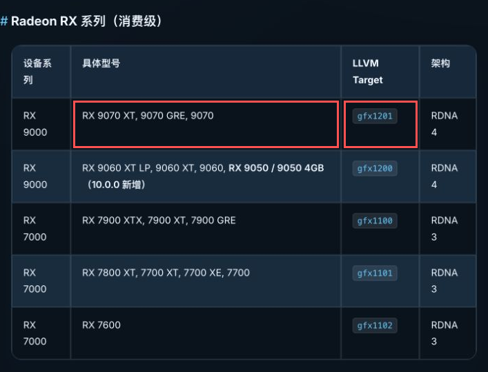
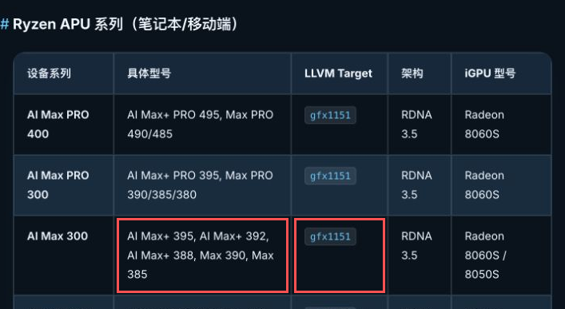
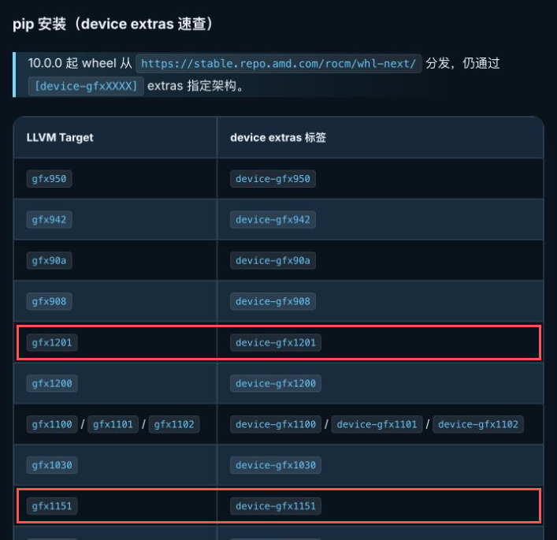

# 附录 B · 换一张卡：切换 ROCm 10.0 的 GPU 架构

## 本附录导读

> 教程用的是 RX 9070 XT，我们手上却可能是一台 Ryzen AI Max+ 395 主机。同样使用 ROCm 10.0，环境里选择的设备包却不同。本附录从一份已经能运行的 ROCm 10.0 环境出发，带我们查出新 GPU 的架构，修改当前项目的 `pyproject.toml`，再同步环境，让新 GPU 真正算出一个结果。

下面以 **RX 9070 XT（`gfx1201`）→ Ryzen AI Max+ 395（`gfx1151`）** 为例。整个过程使用同一套 ROCm 10.0 版本组合和 AMD 下载源，主要调整三处：**PyTorch 的 extra、设备包、设备包的来源映射**。

可以把这件事想成去仓库领工具。ROCm 10.0 把不同设备的工具放进同一个仓库，`device-gfx1201`、`device-gfx1151` 则是领货清单上的设备标签。仓库地址相同，领到的设备工具仍然不同。

## B.1 第一步：从显卡型号查到 gfx 代号

先打开 [AMD GPU 架构对照表](https://datawhalechina.github.io/hello-rocm/zh/00-environment/rocm-gpu-architecture-table)。这份表由 Hello ROCm 项目整理；查找时先认「具体型号」这一列，再沿着同一行向右读 **LLVM Target**。它就是编译器和设备包使用的目标架构代号。

如果使用 RX 9070 XT，在「Radeon RX 系列（消费级）」中找到它。@fig-switch-radeon-target 的两个红框分别标出型号所在的单元格和 `gfx1201`。这一步要记下的是 `gfx1201`，不要把旁边的 `RDNA 4` 当成安装参数。

::: figure fig-switch-radeon-target


从 Radeon RX 9000 的具体型号一栏，沿同一行找到 LLVM Target：RX 9070 XT 对应 `gfx1201`。来源：Hello ROCm 架构对照表，截图经裁切和红框标注。
:::

如果使用 Ryzen AI Max+ 395，就继续找到「Ryzen APU 系列（笔记本/移动端）」。APU 把 CPU 和 GPU 集成在同一颗处理器中，所以这里按处理器型号查找。@fig-switch-apu-target 标出了 AI Max 300 一行里的 AI Max+ 395，以及它对应的 `gfx1151`。

::: figure fig-switch-apu-target


从 Ryzen APU 表中的 AI Max+ 395，找到同一行的 `gfx1151`。来源：Hello ROCm 架构对照表，截图经裁切和红框标注。
:::

这里有三种名字，各管一件事：

| 名字 | RX 9070 XT 的例子 | 用在哪里 |
| ---- | ---- | ---- |
| 产品型号 | Radeon RX 9070 XT | 认出自己买的是哪张卡 |
| 架构家族 | RDNA 4 | 理解这张卡的硬件特点 |
| LLVM Target | `gfx1201` | 选择设备包、检查程序实际使用的架构 |

查表以后，我们还会在 B.4 用实际运行结果核对架构，确认程序使用的设备与我们选择的设备包一致。

**查到架构之后，还要核对 GPU、操作系统和驱动的支持组合。** 架构表能帮我们选包，具体平台条件应继续参考 [AMD 官方兼容性说明](https://rocm.docs.amd.com/en/latest/compatibility/compatibility-matrix.html)。本附录的操作环境是原生 Ubuntu 24.04、Linux x86_64 和 Python 3.12；系统驱动的准备沿用 [第 1 章](../../part0-intro/chapter1/index.md)。

## B.2 第二步：把架构代号对应到 device extra

在同一页面继续找到「pip 安装（device extras 速查）」。@fig-switch-device-extras 的红框给出了我们需要的两组对应关系。

::: figure fig-switch-device-extras


统一下载源写在表格上方；红框里的 `device-gfx1201` 和 `device-gfx1151` 才是安装依赖时选择的标签。来源：Hello ROCm 架构对照表，截图经裁切和红框标注。
:::

Python 依赖名后面的方括号称为 **extra（可选依赖组）**。例如：

```toml
"torch[device-gfx1201]==2.13.0+rocm10.0.0"
```

这行依次说明三件事：安装 `torch`，同时选择 `device-gfx1201` 所声明的设备依赖，并把版本固定在 `2.13.0+rocm10.0.0`。方括号属于依赖声明本身，写进 `pyproject.toml` 后，`uv sync` 就会按这份声明安装。

换到 `gfx1151` 时，`torch` 和 `torchvision` 都选择 `device-gfx1151`。AMD 下载源统一使用 `https://stable.repo.amd.com/rocm/whl-next/`，版本号保持当前 ROCm 10.0 的组合。接下来把这个选择写进正在使用的环境文件。

## B.3 第三步：修改当前环境的 pyproject.toml

进入正在使用的篇目录，打开其中的 `pyproject.toml`。我们在原文件中修改与设备有关的条目，保留项目名称、课程需要的其他依赖和 Notebook 配置。下面这张表先列出 `gfx1201` → `gfx1151` 的全部修改点，再分三处动手。

| 修改位置 | gfx1201 | gfx1151 |
| ---- | ---- | ---- |
| `torch`、`torchvision` 的 extra | `device-gfx1201` | `device-gfx1151` |
| ROCm 设备包 | `rocm-sdk-device-gfx1201` | `rocm-sdk-device-gfx1151` |
| PyTorch 设备包 | `amd-torch-device-gfx1201` | `amd-torch-device-gfx1151` |
| PyTorch 公共设备包 | `amd-torch-device-gfx12-0` | `amd-torch-device-gfx115x` |
| torchvision 设备包 | `amd-torchvision-device-gfx1201` | `amd-torchvision-device-gfx1151` |
| `[tool.uv.sources]` 中的设备包名 | 与左侧设备包一致 | 与右侧设备包一致 |
| AMD 源和版本约束 | 当前 ROCm 10.0 的组合 | 保持相同 |

### B.3.1 修改 torch 和 torchvision 的 extra

先在 `[project]` 的 `dependencies` 列表中，找到 `torch` 和 `torchvision` 两行，把方括号里的 `device-gfx1201` 都改成 `device-gfx1151`。修改后的两行是：

```toml
    "torch[device-gfx1151]==2.13.0+rocm10.0.0",
    "torchvision[device-gfx1151]==0.28.0+rocm10.0.0",
```

这里改的是同一版本所选择的设备依赖，`==` 后面的版本号保持不变。

### B.3.2 替换四个设备包

仍然在 `dependencies` 中，把表里的四个 `gfx1201` 相关设备包替换为下面四行。完成替换后，这个单架构环境里只保留目标架构对应的设备包：

```toml
    "rocm-sdk-device-gfx1151==10.0.0",
    "amd-torch-device-gfx1151==2.13.0+rocm10.0.0",
    "amd-torch-device-gfx115x==2.13.0+rocm10.0.0",
    "amd-torchvision-device-gfx1151==0.28.0+rocm10.0.0",
```

**其中最容易漏掉的是公共设备包：`gfx12-0` 要换成 `gfx115x`。** 这两个名字来自当前 PyTorch wheel 的依赖声明，不能靠把所有 `gfx1201` 搜索替换成 `gfx1151` 推导出来。后续更换其他架构或 PyTorch 版本时，也要重新核对它实际声明的依赖。

`rocm`、`rocm-sdk-core`、`rocm-sdk-devel`、`rocm-sdk-libraries`、Triton 和 torchaudio 在这两份配置中保持相同。

### B.3.3 同步修改设备包的来源映射

接着找到现有的 `[tool.uv.sources]`，把四个设备包的映射名称一起替换。下面是该表中修改后的四行，其他包的来源映射保留：

```toml
rocm-sdk-device-gfx1151 = { index = "rocm-amd" }
amd-torch-device-gfx1151 = { index = "rocm-amd" }
amd-torch-device-gfx115x = { index = "rocm-amd" }
amd-torchvision-device-gfx1151 = { index = "rocm-amd" }
```

为什么依赖名和来源映射要一起改？本教程的 AMD 索引设置了 `explicit = true`，只有明确绑定到 `rocm-amd` 的包才从这里解析。可以把 `[tool.uv.sources]` 理解成清单上的「领取地点」：**给 `torch` 指定了地点，它的设备依赖不会自动继承这个地点。** 因此，四个设备包要同时出现在 `dependencies` 和来源映射中。[uv 对显式索引的说明](https://docs.astral.sh/uv/concepts/indexes/#pinning-a-package-to-an-index)解释了这一行为。

`rocm-amd` 的 URL 保持 `https://stable.repo.amd.com/rocm/whl-next/`。设备选择已经写进依赖声明，URL 中不需要添加 `gfx1151`。

### B.3.4 对照完整配置检查一遍

下面给出改好的完整示例，配套目录为 `code/appendix/appendix-b-switch-gpu/gfx1151/`；修改前的 ROCm 10.0 配置保存在相邻的 `gfx1201/` 目录。两份配置都附有 `uv.lock`，可以并排核对设备相关的差异。如果正在修改自己的项目，用这个示例检查设备条目即可，不需要覆盖原有的其他课程依赖。

<details>
<summary>完整配置：ROCm 10.0 + gfx1151，供 AI Max+ 395 等设备验证</summary>

```toml
[project]
name = "part0-intro"
version = "0.1.0"
requires-python = ">=3.12,<3.13"
dependencies = [
    "numpy>=2.4.4",
    "matplotlib>=3.9",
    "torch[device-gfx1151]==2.13.0+rocm10.0.0",
    "torchvision[device-gfx1151]==0.28.0+rocm10.0.0",
    "torchaudio==2.11.0.2+rocm10.0.0",
    "rocm==10.0.0",
    "rocm-sdk-core==10.0.0",
    "rocm-sdk-devel==10.0.0",
    "rocm-sdk-libraries==10.0.0",
    "rocm-sdk-device-gfx1151==10.0.0",
    "amd-torch-device-gfx1151==2.13.0+rocm10.0.0",
    "amd-torch-device-gfx115x==2.13.0+rocm10.0.0",
    "amd-torchvision-device-gfx1151==0.28.0+rocm10.0.0",
    "triton==3.8.0+git4cff872c.rocm10.0.0",
]

[tool.uv]
environments = ["sys_platform == 'linux' and platform_machine == 'x86_64'"]

[[tool.uv.index]]
name = "rocm-amd"
url = "https://stable.repo.amd.com/rocm/whl-next/"
explicit = true

[[tool.uv.index]]
name = "pypi-mirror"
url = "https://mirrors.bfsu.edu.cn/pypi/web/simple"
default = true

[tool.uv.sources]
torch = { index = "rocm-amd" }
torchvision = { index = "rocm-amd" }
torchaudio = { index = "rocm-amd" }
rocm = { index = "rocm-amd" }
rocm-sdk-core = { index = "rocm-amd" }
rocm-sdk-devel = { index = "rocm-amd" }
rocm-sdk-libraries = { index = "rocm-amd" }
rocm-sdk-device-gfx1151 = { index = "rocm-amd" }
amd-torch-device-gfx1151 = { index = "rocm-amd" }
amd-torch-device-gfx115x = { index = "rocm-amd" }
amd-torchvision-device-gfx1151 = { index = "rocm-amd" }
triton = { index = "rocm-amd" }

[dependency-groups]
notebook = [
    "ipykernel>=7.3.0",
    "jupyterlab>=4.6.2",
]
```

</details>

**验证范围**：本附录的 GPU 运算检查在 RX 9070 XT（`gfx1201`）上完成。`gfx1151` 配置已通过 Linux x86_64、Python 3.12 下的依赖解析，尚未在对应 GPU 上运行。**🚧 待补 gfx1151 上机验证。** 解析成功说明依赖能配成一套，真正换卡以后，还要完成 B.4 的设备检查。

## B.4 第四步：同步环境，再让 GPU 真正算一次

保存 `pyproject.toml` 后，在目标 GPU 所在的原生 Ubuntu 机器上，进入这份文件所在的目录，先更新锁文件，再同步环境：

```bash
uv lock
uv sync --locked
```

`uv lock` 根据修改后的依赖声明更新 `uv.lock`；`uv sync --locked` 再按锁文件同步当前项目的 `.venv`。**修改设备依赖后可以直接更新锁文件，不必先删除它。** 保留锁文件，也方便对照这次究竟替换了哪些设备包。[uv 的锁定与同步说明](https://docs.astral.sh/uv/concepts/projects/sync/)给出了这两个步骤的区别。

如果直接使用本附录提供的架构目录，里面已经有配套锁文件，可以从 `uv sync --locked` 开始。下面是配套 `gfx1201` 示例的运行入口，命令从仓库根目录出发：

```bash
cd code/appendix/appendix-b-switch-gpu/gfx1201
uv sync --locked
uv run --locked ../check_gpu.py
```

在 `gfx1151` 机器上使用配套示例时，把 `cd` 命令最后一级目录改为 `gfx1151`，后两条命令相同。验证自己的篇环境时，在刚才同步的目录中运行同一个检查脚本，将 `../check_gpu.py` 换成脚本的实际路径即可。这样检查的才是刚刚修改的环境。

检查脚本会先输出包版本，再确认 GPU 可用，最后把张量放到 GPU 上做一次乘法，并与 CPU 上的预期结果比较。这里继续使用 `torch.cuda` 和 `device="cuda"`：PyTorch 的 ROCm 后端沿用了这套接口名称，出现 `cuda` 并不表示装成了 NVIDIA 版本。

<details>
<summary>检查脚本：check_gpu.py</summary>

```python
"""检查当前 Python 环境的 ROCm 包、GPU 架构和一次真实 GPU 运算。"""

from importlib.metadata import version

import torch
import torchvision
import torchaudio
import triton

print("ROCm SDK:", version("rocm"))
print("torch:", torch.__version__)
print("torchvision:", torchvision.__version__)
print("torchaudio:", torchaudio.__version__)
print("triton package:", version("triton"))
print("triton module:", triton.__version__)
print("HIP:", torch.version.hip)
print("GPU available:", torch.cuda.is_available())

if not torch.cuda.is_available():
    raise SystemExit("未发现可用 GPU：检查驱动、设备权限和所选 device extra。")

print("GPU:", torch.cuda.get_device_name(0))
print("Architecture:", torch.cuda.get_device_properties(0).gcnArchName)
x = torch.arange(4, dtype=torch.float32, device="cuda")
result = (x * 2).cpu()
torch.testing.assert_close(result, torch.tensor([0.0, 2.0, 4.0, 6.0]))
print("GPU calculation:", result)
```

</details>

下面是在 **Radeon RX 9070 XT（gfx1201）、原生 Ubuntu 24.04.5、Python 3.12.3、ROCm SDK 10.0.0 wheel 环境**中的实际输出。检查重点是：架构与选包一致，GPU 可用，最后的张量运算通过。

<details>
<summary>输出：ROCm 10.0 环境检查 @ RX 9070 XT / Ubuntu 24.04</summary>

```text
ROCm SDK: 10.0.0
torch: 2.13.0+rocm10.0.0
torchvision: 0.28.0+rocm10.0.0
torchaudio: 2.11.0.2+rocm10.0.0
triton package: 3.8.0+git4cff872c.rocm10.0.0
triton module: 3.8.0
HIP: 7.15.26333
GPU available: True
GPU: AMD Radeon RX 9070 XT
Architecture: gfx1201
GPU calculation: tensor([0., 2., 4., 6.])
```

</details>

换到另一种架构以后，重点看三个位置：`GPU available` 是否为 `True`，`GPU` 与 `Architecture` 是否对应实际设备，以及最后的张量运算是否通过。对于 AI Max+ 395，我们要核对架构字段中的 `gfx1151`；具体设备名称以目标机器的实际输出为准。

包版本和设备架构也要分开读。`torch.version.hip` 反映 PyTorch 构建关联的 HIP 版本，它与 ROCm SDK 的发行版本是不同字段，所以本次实测同时出现 `ROCm SDK: 10.0.0` 和 `HIP: 7.15.26333`。`triton.__version__` 显示 `3.8.0`，Python 安装包元数据则保留 `+git4cff872c.rocm10.0.0` 后缀；脚本把两者都列了出来。

完成这一步，我们确认的是 **Python 环境能加载这些包，并让当前 GPU 执行一次 PyTorch 运算**。`uv sync` 不会替我们升级系统的内核驱动；HIP 编译器、Triton JIT 和 profiling 工具是否能完成后续章节的任务，还需要各自的程序继续验证。把最小环境检查和后续实验分开，出了问题才知道从哪一层查起。

## B.5 报错时，先判断卡在哪一层

安装报错和 GPU 运行失败发生在不同阶段。先看失败位置，再检查对应文件，通常比反复换版本更有效。

| 现象 | 优先检查什么 | 下一步 |
| ---- | ---- | ---- |
| `tunnel error`、`Connection refused` | 当前 shell 的代理地址和代理服务 | 先恢复网络连通；此时还不能判断依赖版本是否可用 |
| 找不到 `rocm[libraries]==10.0.0` 或 `rocm-sdk-core==10.0.0` | AMD 显式索引的依赖声明和来源映射 | 对照 B.3，检查直接依赖与 `[tool.uv.sources]` 是否齐全，再核对索引上的版本 |
| 找不到 `amd-torch-device-gfx12-0` 或 `amd-torch-device-gfx115x` | 该版本 PyTorch 声明的公共设备包 | 按 B.3 同时调整设备包及其来源映射 |
| `--locked` 提示锁文件需要更新 | 是否修改过 `pyproject.toml` | 先运行 `uv lock`，成功后再 `uv sync --locked` |
| 安装成功，但 `GPU available: False` | 系统驱动、设备访问权限、实际运行的 Python 环境 | 回到第 1 章核对基础环境，再运行检查脚本 |
| 能识别 GPU，但张量运算报错 | 设备包是否与实际架构匹配，以及完整运行时错误 | 核对 B.1 与 B.3，保留报错信息继续定位 |

不要把 `No solution found` 直接翻译成「AMD 没有这个包」；也不要用跳过依赖安装的方式绕开它。我们的目标是让这份配置完整地解析、安装和运行，这样下一次重建环境时才有可依赖的起点。

## 本附录小结

- 先从产品型号找到 LLVM Target，再把 `gfx1201` 或 `gfx1151` 对应到 device extra。
- 在同一套 ROCm 10.0 环境中切换架构，保持统一的 `whl-next/` 源和版本组合。
- 在本附录的显式索引配置中，换卡要同时修改 extra、设备包及来源映射，尤其别漏掉 PyTorch 的公共设备包。
- 用 `uv lock` 更新依赖解析，用 `uv sync --locked` 安装，再用真实的 GPU 运算检查环境。三个步骤分别解决三个问题。

读完以后，我们应该能拿着另一张 AMD 卡的型号，查出它的架构，指出环境文件里与设备绑定的部分，并说明一次检查到底验证到了哪一步。接下来再回到对应章节，验证这张卡上的 HIP、Triton 或 profiling 程序。

## 延伸阅读

- [Hello ROCm · AMD GPU 架构对照表](https://datawhalechina.github.io/hello-rocm/zh/00-environment/rocm-gpu-architecture-table)
- [AMD · ROCm 兼容性说明](https://rocm.docs.amd.com/en/latest/compatibility/compatibility-matrix.html)
- [AMD · ROCm 10.0 wheel 索引](https://stable.repo.amd.com/rocm/whl-next/)
- [uv · 包索引与显式来源](https://docs.astral.sh/uv/concepts/indexes/)
- [uv · 锁定与同步](https://docs.astral.sh/uv/concepts/projects/sync/)
- [PyTorch · HIP / ROCm 后端说明](https://docs.pytorch.org/docs/stable/notes/hip.html)
- 本教程 [第 1 章 环境准备](../../part0-intro/chapter1/index.md)
