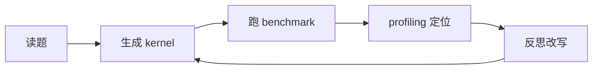

# 第0章 写给读者的话

## 本章导读

> 欢迎你！这一章不写代码，也不急着抛 GPU 术语。我们先坐下来聊清楚三件事：这本书要解决什么问题？它打算怎样带你学？以及，为什么后面所有章节都围着「算子从慢到快、最后交给 Agent 自动化」这条主线转？读完这一章，希望你不仅能判断这本书适不适合自己，更能在心里搭起一张全景地图——后面每一站会走到哪儿，心里大致有数。

## 0.1 为什么写这本入门书

我们先从一个你很可能会遇到的场景开始。

你跑了一个推理脚本，在自己的机器上似乎还行。后来换了一张显卡，模型没换、输入也差不多，延迟却明显变了。打开监控，GPU 好像也在工作；调一调 batch size，吞吐有时变好、有时变差；换一个推理引擎，有的模型收益肉眼可见，有的几乎纹丝不动。

到这一步，你心里大概已经冒出一个念头：**问题已经不是"会不会调用模型"了**。真正让人头疼的，是下面这一连串没人能一句话说清的疑问：

- GPU 上真正执行的是哪些 kernel？它们到底慢在哪？
- 当前瓶颈是访存、计算，还是别的什么？
- 一个算子从 naive 版本到优化版，到底改了什么才变快的？
- 你做的改动，到底是真的更快了，还是只是测量方式变了？
- 这些「测量 → 定位 → 改 → 再测」的流程，能不能让 Agent 自动跑？

这些问题，全都落在 **GPU 算子优化** 的范围里。它们不是"调一调参数就能搞定"的问题，而是需要你走到 GPU 执行那一层去，才能看清全貌。

如果一定要给一个简短的定义，可以这样说：**GPU 算子优化是让 GPU 上的计算单元高效运行起来的那一整套工程能力**。它把算法、kernel、访存模式、硬件资源串成一条链路。只盯着其中一层，往往看不清完整问题——就像你不可能只盯着发动机的某一个零件就判断整辆车为什么跑不快一样。

所以这本书不会停在"怎么运行某个工具"上。我们更关心的是：这个 kernel 到底慢在哪里？慢的证据在哪里？怎么一步步把它优化到接近硬件极限？以及——能不能把这套优化流程交给 Agent 自动完成？

## 0.2 这本书适合谁

这一节说明开始之前你需要准备什么，以及对号入座的读者画像。

知识上，你最好具备三类基础：

| 基础 | 需要到什么程度 |
| ---- | ---- |
| Python | 能运行脚本、看懂函数、列表、字典和基本包管理 |
| Linux 命令行 | 能进入目录、运行命令、查看日志、理解环境变量 |
| 深度学习概念 | 大概知道 tensor、batch、矩阵乘、Softmax、Attention、推理是什么 |

请放心，你不需要一开始就会 GPU 编程，更不需要先成为编译器专家。这本书的做法是把复杂内容一层层拆开，从"能跑通的最小例子"开始往上搭。你不会一上来就被扔进几百行 kernel 代码里。

那这本书适合谁？你可以对照下面对号入座：

| 你是谁 | 这本书能帮你 | 推荐读法 |
| ---- | ---- | ---- |
| AI 应用 / 算法工程师，想搞清楚"模型为什么慢" | 学会用 profiling 找证据，而不是凭直觉调参 | 别跳过第 1 篇 profiling |
| 刚接触 GPU 编程的同学 | 从最小例子起步，逐步建立硬件直觉 | 从头顺序读，第 2 篇算子是你的核心训练场 |
| 有 CUDA 经验、想看看 ROCm 什么样 | 在熟悉概念上"换个平台"再练一遍 | 快速浏览第 0 篇，重点攻算子篇和 Agent 篇 |
| 对刷 GPU 题库感兴趣 | 系统学到从 naive 到优化的方法论 | 第 1 篇 + 第 2 篇组合阅读 |
| 想做 LLM × Infra 的 Agent 工作 | 看 Agent 怎么和算子/模型优化结合 | 通读全本，重点在第 3、4 篇 Agent |

如果你是初学者，**请务必不要跳过第 1 篇 profiling**。很多人一上来就急着写 kernel、调参数，但要是连测量都测不准，所谓的"优化"就很容易变成赌博——你连自己是赢了还是输了都不知道。

## 0.3 为什么选 AMD Radeon RX 9070 XT

市面上的 GPU 学习资料，十本里有九本默认从 CUDA 起步。这很自然——CUDA 生态成熟、社区庞大、经典优化案例也大多来自 NVIDIA 平台。但我们还是刻意选了 AMD Radeon RX 9070 XT 这条路。

**不是为了"反 CUDA"，而是希望你借这条路线，把优化视角练得更通用一些。**

选择 RX 9070 XT（RDNA4）有两个很实际的理由：

| 理由 | 说明 |
| ---- | ---- |
| 易获得、成本低 | RX 9070 XT 是消费级显卡，不像数据中心卡那样昂贵和稀缺。大多数学习者都能弄到手 |
| Linux + ROCm 可跑 | 虽然没有 Windows 上的官方 ROCm 支持，但 Linux 上经社区和官方验证可用 |

GPU 算子优化里真正核心的问题，并不归某个厂商独有：

- 数据是否连续访问？
- 算子是计算瓶颈还是访存瓶颈？
- kernel launch 开销是否值得关注？
- profiling 结果能不能撑起优化结论？
- 自动调参是否真的在当前硬件上变快了？

这些问题在任何平台上都会出现，变的只是工具名、术语和实现细节。沿着 AMD GPU / ROCm 学下来，你会接触 CU、wavefront、LDS、HIP、rocprof、Triton on AMD 这些概念。一开始可能会觉得有点陌生——没关系，陌生感恰恰说明你正在从"框架使用者"往"算子优化者"的方向走。

也提前划一下边界：**这本书不是 CUDA 到 ROCm 的逐 API 翻译手册**。需要时我们会提一笔 HIP 和 CUDA 的对应关系，但不会把每一节写成对照表。你的注意力应该花在更值钱的问题上：

- 这个算子为什么慢？
- 慢的证据在哪里？
- 当前硬件上能尝试哪些优化？
- 优化后怎么确认结果是可信的？

最后再强调一次：**本书当前环境统一为 Radeon RX 9070 XT + ROCm 10.0 + 原生 Ubuntu 24.04**。历史实验会保留采集时的 ROCm 版本，当前安装方法见[第 1 章](../chapter1/index.md)。其他 AMD GPU 可以参考方法论，但性能数字和工具可用性需要自己实测验证。

## 0.4 这本书和市面教程有什么不同

市面上已经有不少讲 GPU 编程的好资料了。有的手把手教你写 CUDA kernel，有的把某个算子的官方实现讲得很透。那我们为什么还要再写一本？

如果只能让你带走三个关键词，那就是下面这三个。它们就是这本书和"标准算子套餐教程"之间最大的分界线：

| 关键词 | 含义 | 你会怎么练 |
| ---- | ---- | ---- |
| Profiling-Driven | 先学会「看数据」再学「改代码」 | 写 benchmark、看 timeline、读 profiling 报告 |
| 刷题导向 | 每个算子都是从 naive 到优化的完整案例 | Reduction / Softmax / GEMM / Attention 一路优化下来 |
| Agent-Driven | 把「人做的优化流程」交给 Agent 自动化 | 搭一个能自动 profiling、改代码、跑分的 Agent |

**第一，Profiling-Driven（用数据驱动优化）**

我们不鼓励凭感觉改代码。**一个优化成不成立，必须经过 benchmark 和 profiling 验证**。而且我们故意把 profiling 篇放在算子篇**前面**——先学会"看数据"，再去"改代码"。这样你写每个算子时，都带着"瓶颈意识"，而不是闷头写完才发现不知道慢在哪。这个流程听起来朴素，但它能帮你过滤掉一大半"看上去变快了"的伪优化——而这是真正做性能工作的人最怕的东西。

**第二，刷题导向（从 naive 到优化的完整案例）**

市面上很多教程把 Vector Add / Reduction / Softmax / Matmul 当成"知识点"逐个讲一遍，讲完就结束。我们的做法不一样：**每个算子都呈现完整的优化路径**——从最 naive 的版本开始，一步步 profiling、定位瓶颈、改写、再测，直到接近硬件极限。这和你在 LeetGPU 这类平台上"刷题"的过程是一致的：先正确性、再带宽、最后算术强度。学完整本书，你应该能上手任何 GPU 算子题库。

**第三，Agent-Driven（把优化流程自动化）**

注意，这里的 Agent **不是**"让大模型随便生成一段代码"。在算子优化场景里有价值的 Agent，应该会读硬件信息、跑 benchmark、调 profiling、根据瓶颈信号决定优化方向、改写 kernel、复测、并且把失败的尝试也老老实实记下来——因为失败的记录往往比成功的那一次更值钱。

所以这本书最后的 Agent 篇，并不是凭空给出"最优代码"，而是把前面这些流程串成一个可以反复运行的闭环（如 @fig-agent-loop 所示）：

::: figure fig-agent-loop

算子优化 Agent 的最小闭环
:::

这就是这本书最核心的野心：不只要告诉你按钮在哪儿，更要让你看清每一步在整个闭环里承担什么角色——以及，为什么**这个角色缺了，链路就断了**。

## 0.5 你将完成的事

先把镜头快进到终点，看一眼你学完整本书后会获得什么。

这本书围绕一条主线展开：

::: figure fig-book-loop

全书的闭环：理解 → 测量 → 优化 → 刷题 → 自动化
:::

具体来说，你会经历这样一段旅程：

| 阶段 | 你会学到 | 学完能做什么 |
| ---- | ---- | ---- |
| 入门（第 0 篇）| RX 9070 XT 环境、GPU 体系结构速通、第一个程序 | 跑通环境，建立 Roofline 心智模型 |
| Profiling（第 1 篇）| benchmark、rocprof、性能记录 | 用数据说明算子慢在哪里 |
| 算子 + 刷题（第 2 篇）| Reduction / Softmax / GEMM / Flash Attention + 刷题方法论 | 把一个 naive kernel 一步步优化到接近硬件极限 |
| Agent 算子层（第 3 篇）| Agent 入门、工具封装、多轮优化 | 让 Agent 生成、测量、裁决并记录候选，实现可复盘的优化循环 |
| 真实模型 + Agent（第 4 篇）| YOLO / LLM 部署 + Agent 自动优化 | 让 Agent 对真实模型做性能优化 |

这里有一条贯穿始终的底线：**优化的输入数据必须可信**。benchmark 不可信、profiling 没保存、硬件上下文没写清楚——那么不管最后的结论写得多漂亮，都不能拿到工程场合当结论用。数据质量决定优化判断的上限，这一点怎么强调都不为过。

## 0.6 学习路线图

这一节给你一条推荐路线。建议你先按顺序读，等熟悉后再按主题回看——就像去一个新城市，第一次坐地铁跟着线路图走，熟了之后自然会知道在哪换乘。

| 篇 | 你要学什么 | 学完能做什么 | 大约时间 |
| ---- | ---- | ---- | ---- |
| 第 0 篇 入门 | 环境验证、GPU 体系结构、第一个程序 | 跑通环境，建立硬件直觉 | 1-2 天 |
| 第 1 篇 Profiling | benchmark、rocprof、性能记录 | 找到 kernel 慢在哪里 | 2-3 天 |
| 第 2 篇 算子 + 刷题 | Reduction / Softmax / GEMM / Attention + 刷题 | 从 naive 优化到接近极限 | 5-7 天 |
| 第 3 篇 Agent 算子层 | Agent 入门、工具封装、多轮优化 | 让 Agent 自动优化 kernel | 3-4 天 |
| 第 4 篇 真实模型 + Agent | YOLO / LLM + Agent 优化 | 对真实模型做自动优化 | 3-4 天 |

整个旅程大约需要 2-3 周（按每天 2-3 小时算）。不需要一口气读完——每一篇都是相对独立的，但**强烈建议按顺序**，因为后面每一篇都建立在前面的基础上。

## 0.7 和其他 datawhale 教程的边界

最后说清楚这本书和其他 datawhale 教程的关系，避免你选错书或者重复学：

| 这本书覆盖 | 指向其他教程 |
| ---- | ---- |
| 单卡 GPU 算子优化（HIP/Triton）| — |
| Profiling 与性能分析 | — |
| 算子优化 Agent（自动 profiling/改代码/跑分）| — |
| 真实模型（YOLO/LLM）的单卡部署 + Agent 优化 | — |
| | 多卡通信、分布式训练 → hello-mlsys |
| | 服务化、动态 batching、多副本 → hello-mlsys |
| | LLM 应用开发、通用智能体 → hello-agents |
| | K8s 平台层、集群部署 → hello-ai-infra |

简单说：**这本书聚焦"单卡上的算子优化 + Agent 自动化"**。一旦问题超出单卡（多卡通信、服务化、集群），就交给后续的书。

下一章会带你做环境准备。它不会一上来就展开 ROCm 软件栈的内部原理，只帮你确认几件最关键的事：ROCm 能不能看到 RX 9070 XT？PyTorch 能不能跑？最小 HIP 程序能不能编译运行？几道门推开，后面的路就是通的。

## 本章小结

- **GPU 算子优化是连接层的工程**——算法、kernel、访存模式、硬件资源之间的衔接处，往往才是性能问题真正的藏身之所。
- 这本书的三条主线是 **Profiling-Driven（先看数据）、刷题导向（完整优化案例）、Agent-Driven（流程自动化）**，不是工具清单，更不是 API 对照表。
- 当前环境是 **Radeon RX 9070 XT + ROCm 10.0 + 原生 Ubuntu 24.04**；性能数字以各节记录的实际版本为准，其他设备的读者请自行复测。
- 学习路线从环境验证起步，经过 profiling、算子优化、刷题，最终落到 Agent 自动化——每一站都是下一站的基础。
- 下一章解决第一个动手问题：**怎样确认你的 RX 9070 XT 实验环境可以继续往后跑？**

## 延伸阅读

- [AMD ROCm Documentation](https://rocm.docs.amd.com/)
- [PyTorch](https://pytorch.org/)
- [hello-agents](https://github.com/datawhalechina/hello-agents)（Agent 基础，本书 Agent 篇的前置阅读）
