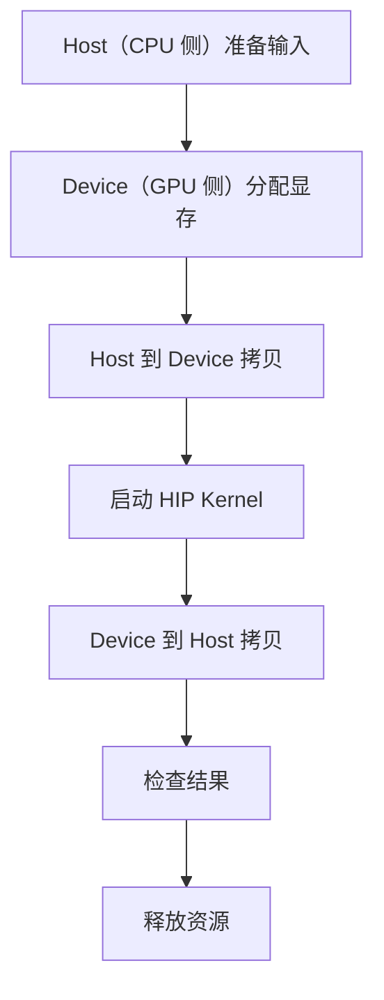

# 第1章 环境准备

## 本章导读

> 把这一章想象成一张「开工前体检表」就好。你**不必**在这里搞懂 ROCm、HIP、uv 的所有原理——那是后面章节的事。这一章只做一件事：让你有底气回答三个问题。ROCm 能不能看到 GPU？PyTorch 能不能用上 GPU？最小 HIP 程序能不能编译运行？三个都过了，基础链路就打通了；万一哪个过不去，我们也准备了排错指南，帮你用最快速度把问题定位出来。

本章对应代码在:

```text
code/part0-intro/
├── pyproject.toml
├── uv.lock
├── activate-rocm.sh
└── chapter1/
    ├── check_torch_rocm.py
    └── vector_add.hip
```

## 1.1 本教程的实验基线

本章不打算做"安装百科"，也不会覆盖所有 AMD GPU 和系统组合——真要写成那样，恐怕这一章就得比整本教程还厚。它只回答一个问题：**当前环境，够不够支撑你继续往后学？**

你可以把这一章想成三道门，必须依次推开，一道都跳不过去：

| 门 | 验证什么 | 推开之后说明 |
| ---- | ---- | ---- |
| 第一道门 | ROCm 能看到 GPU | 底层驱动和运行时基本可用 |
| 第二道门 | PyTorch ROCm | 框架层能把计算放到 AMD GPU 上 |
| 第三道门 | 最小 HIP 程序 | 后续手写 kernel 的路径基本打通 |

本章使用的基线如下：

| 项目 | 基线 |
| ---- | ---- |
| 硬件 | AMD Radeon RX 9070 XT |
| GPU 架构 | gfx1201（RDNA4；ISA 名 `gfx12-generic`）|
| ROCm SDK | **10.0.0**（`rocm-sdk version`）|
| HIP 组件版本 | `7.15.26333`（`hipcc --version` / `torch.version.hip`）|
| 操作系统 | **原生 Ubuntu 24.04**（本次验证为 Ubuntu 24.04.5 / Linux 7.0.0-31-generic，x86_64）|
| Python 环境管理 | uv（`uv 0.11.28`）|
| ROCm Python 包来源 | AMD `https://stable.repo.amd.com/rocm/whl-next/` 统一 wheel 源 |

如果你的硬件或 ROCm 版本和上面对不上，不用担心——验证顺序仍然可以照搬，只是包版本、设备名、工具输出会有差异，到时候自己对照一下就好（换卡时的完整调整流程见 [附录 B · 换一张卡](../../appendix/appendix-b-switch-gpu/index.md)）。

本章的安装、GPU 检查与 HIP 编译输出于 **2026-09-19** 在上述实验机复测。注意，**ROCm SDK 与 HIP 组件各有版本号**：装好 ROCm 10.0 后看到 HIP `7.15.26333` 是本次实测的正常输出。

全书各篇的安装环境已统一为 ROCm 10.0。后续章节中标注 ROCm 7.13 的性能表是历史实测，继续保留当时的版本与数值；我们复跑时记录自己的结果即可。

## 1.2 平台边界：原生 Linux 优先，WSL2 需单独验证

本次 ROCm 10.0 验证使用**原生 Ubuntu 24.04 + RX 9070 XT**。安装 wheel 之前，宿主机需要已经装好支持这张卡的 AMD GPU 驱动，当前用户也需要有访问 GPU 的权限。`uv` 负责项目里的 Python 包和 ROCm 工具链，内核驱动仍由系统管理。

如果我们使用的是 Windows / WSL2，就先按 [AMD 的 ROCm 10.0 安装页](https://rocm.docs.amd.com/en/docs-10.0.0/install/rocm.html)确认显卡、驱动与版本组合，再逐项验证本章的三道门。**本次原生 Linux 的验证结果不能直接当作 WSL2 的验证结果。**

::: warning 计算能跑，状态监控也要单独检查
`rocminfo`、PyTorch 和 HIP 程序通过，只说明对应的计算路径可用。`rocm-smi`、`amd-smi` 与硬件性能计数器还依赖平台提供的驱动接口，不能据此推断它们也能工作。本章以 `rocminfo`、PyTorch 和最小 HIP 程序为必做项；状态监控放在选读区，后续 profiling 以各章实际验证的功能为准。
:::

## 1.3 同步本篇 uv 环境

下面从已经下载好的教程仓库根目录开始。先确认系统有 Python 3.12 和 uv，再进入本篇目录：

```bash
cd code/part0-intro
```

本篇的 `pyproject.toml` 和 `uv.lock` 已经配好 ROCm 10.0，默认显卡是 RX 9070 XT（`gfx1201`）。**如果我们用的是其他架构，先按[附录 B](../../appendix/appendix-b-switch-gpu/index.md)修改三处 `device-gfx1201`，再安装。**

不用提前创建 `.venv`，也不用先装 torch。一条命令就够了：

```bash
uv sync
```

<details>
<summary>输出：uv sync 创建本篇环境（gfx1201 / ROCm 10.0）</summary>

```text
Using CPython 3.12.3 interpreter at: /usr/bin/python3
Creating virtual environment at: .venv
Resolved 119 packages in 0.79ms
Installed 33 packages in 152ms
 + amd-torch-device-gfx12-0==2.13.0+rocm10.0.0
 + amd-torch-device-gfx1201==2.13.0+rocm10.0.0
 + amd-torchvision-device-gfx1201==0.28.0+rocm10.0.0
 + contourpy==1.3.3
 + cycler==0.12.1
 + filelock==3.32.3
 + fonttools==4.63.0
 + fsspec==2026.7.0
 + jinja2==3.1.6
 + kiwisolver==1.5.0
 + markupsafe==3.0.3
 + matplotlib==3.11.0
 + mpmath==1.3.0
 + networkx==3.6.1
 + numpy==2.5.2
 + packaging==26.2
 + pillow==12.3.0
 + pyparsing==3.3.2
 + python-dateutil==2.9.0.post0
 + rocm==10.0.0
 + rocm-bootstrap==0.1.0
 + rocm-sdk-core==10.0.0
 + rocm-sdk-devel==10.0.0
 + rocm-sdk-device-gfx1201==10.0.0
 + rocm-sdk-libraries==10.0.0
 + setuptools==81.0.0
 + six==1.17.0
 + sympy==1.14.0
 + torch==2.13.0+rocm10.0.0
 + torchaudio==2.11.0.2+rocm10.0.0
 + torchvision==0.28.0+rocm10.0.0
 + triton==3.8.0+git4cff872c.rocm10.0.0
 + typing-extensions==4.16.0
```

这里的 `Resolved` 包含可选依赖组，默认实际安装的是下面列出的 33 个包；安装时间受网络和缓存影响，不需要与示例相同。

</details>

仓库自带的 `uv.lock` 直接保留。没有修改配置时，`uv sync` 按锁文件安装；修改 GPU extras 后，它会重新解析并更新锁文件。第一次安装会自动创建 `.venv`，已有环境则同步到新配置。

同步完成后，激活本篇环境：

```bash
source ./activate-rocm.sh
```

<details>
<summary>输出：激活后检查 SDK 和 PyTorch 版本（gfx1201 / ROCm 10.0）</summary>

```bash
rocm-sdk version
python -c "import torch; print(torch.__version__)"
```

```text
10.0.0
2.13.0+rocm10.0.0
```

激活脚本会展开开发文件、刷新设备包链接，并把 `ROCM_PATH` / `HIP_PATH` 指向本篇 `.venv` 下的 `_rocm_sdk_devel`。后面的 `hipcc` 和运行时库因此来自同一个 SDK，详见 [附录 A](../../appendix/appendix-a-env-install/index.md)。

</details>

## 1.4 验证 GPU 可见性

第一道门：ROCm 能不能看到 GPU。

先用 `rocminfo` 摸一摸你的 GPU：

```bash
rocminfo | grep -E "^[[:space:]]*(Name|Marketing Name|Vendor Name|Device Type|Compute Unit):" | head -20
```

<details>
<summary>输出：rocminfo 识别到 gfx1201 GPU（RX 9070 XT）</summary>

```text
  Name:                    12th Gen Intel(R) Core(TM) i5-12600K
  Marketing Name:          12th Gen Intel(R) Core(TM) i5-12600K
  Vendor Name:             CPU
  Device Type:             CPU
  Compute Unit:            16
  Name:                    gfx1201
  Marketing Name:          AMD Radeon RX 9070 XT
  Vendor Name:             AMD
  Device Type:             GPU
  Compute Unit:            64
```

</details>

关键看两点：`Device Type: GPU` 必须出现，并且 `Name` 是 `gfx1201`（对应 Marketing Name `AMD Radeon RX 9070 XT`）。两条都对上了，说明驱动认得你的卡——第一道门已经推开一半了。

> 如果你想确认 RX 9070 XT 的 ISA 名，可以再补一句 `rocminfo | grep amdhsa`，会看到 `amdgcn-amd-amdhsa--gfx1201` 和 `amdgcn-amd-amdhsa--gfx12-generic` 两条——前者是具体型号 target，后者是 gfx12 系列的通用 ISA。

#### 选读：用 amd-smi 看 GPU 的当前状态

在这台原生 Ubuntu 实验机上，激活 ROCm 10.0 环境后，`rocm-smi` 和 `amd-smi` 也可以使用。我们可以用它们查看显存占用、温度、功耗；它们是辅助检查，不代替后面的 GPU 运算验证。

```bash
amd-smi version
amd-smi monitor
```

<details>
<summary>输出：AMD SMI 版本与状态（RX 9070 XT / ROCm 10.0 / 原生 Ubuntu）</summary>

```text
AMDSMI Tool: 27.0.0+6b0e43f3 | AMDSMI Library version: 27.0.0 | ROCm version: 10.0.0 | amdgpu version: N/A | ionic version: N/A
GPU  XCP  POWER   GPU_T   MEM_T   GFX_CLK   GFX%   MEM%   ENC%   DEC%      VRAM_USAGE
  0    0   32 W   58 °C   58 °C  1115 MHz    6 %    1 %    N/A    0 %    2.9/ 15.9 GB
```

`VRAM_USAGE` 是当前显存用量，`GFX%` 是采样时的 GPU 活跃程度。这些字段会随机器负载变化，我们关注的是能读到状态，而不是复现某个温度或功耗值。

</details>

**如果 `rocminfo` 这一步失败了（连 GPU 都看不到），请先不要急着去跑 PyTorch、HIP 或 Triton**。上层框架全都建在底层运行时之上——底层不通，上层抛出来的错通常只会更让你迷惑。先回到驱动安装和 ROCm 官方文档去排查，确认 `rocminfo` 能看到 GPU 之后再继续。

## 1.5 验证 PyTorch ROCm

第二道门：框架层能不能真的把计算放到 AMD GPU 上。

先看检查脚本:

<details>
<summary>代码：check_torch_rocm.py</summary>

```python
import platform

import torch

print(f"python: {platform.python_version()}")
print(f"torch: {torch.__version__}")
print(f"cuda_available: {torch.cuda.is_available()}")

if not torch.cuda.is_available():
    raise SystemExit("PyTorch ROCm backend is not available")

print(f"device_count: {torch.cuda.device_count()}")
print(f"device_name: {torch.cuda.get_device_name(0)}")

x = torch.randn(1024, 1024, device="cuda")
y = x @ x

print(f"result_shape: {tuple(y.shape)}")
print(f"result_dtype: {y.dtype}")
print(f"result_device: {y.device}")
print(f"result_checksum: {y.sum().item():.6f}")
```

</details>

这个脚本做了三件事：导入 PyTorch、检查 GPU 后端、在 GPU 上跑一次 `1024 × 1024` 矩阵乘。简单到不能再简单——但验证环境时，**越简单越好**。复杂的例子只会让排查时变量更多、更乱。

运行：

```bash
python chapter1/check_torch_rocm.py
```

<details>
<summary>输出：PyTorch ROCm smoke test（gfx1201 / ROCm 10.0）</summary>

```text
python: 3.12.3
torch: 2.13.0+rocm10.0.0
cuda_available: True
device_count: 1
device_name: AMD Radeon RX 9070 XT
result_shape: (1024, 1024)
result_dtype: torch.float32
result_device: cuda:0
result_checksum: 57777.972656
```

`result_checksum` 来自随机输入，每次运行可能不同。看到 `device_name: AMD Radeon RX 9070 XT` 和 `cuda_available: True`，第二道门就过了——PyTorch 能看到 GPU 并完成了一次矩阵乘。

</details>

这里有个**几乎每个新手都会问的问题**：为什么 ROCm 版 PyTorch 里到处都是 `cuda`？答案是历史包袱——PyTorch 的设备字符串一直沿用 `cuda` 这个名字，没有为 ROCm 单独开一条。看到 `device="cuda"` 不代表你跑在 NVIDIA 卡上，把它读作"把 tensor 放到当前可用的 GPU 后端"就行。第二道门推开之后，这个命名的小别扭很快就会被你忘掉。

这一步过了，至少说明三件事：

| 检查项 | 通过后说明什么 |
| ---- | ---- |
| `import torch` 成功 | Python 环境里的 PyTorch 可用 |
| `cuda_available: True` | PyTorch 能看到 GPU 后端 |
| 矩阵乘完成 | 基础 GPU 计算路径可用 |

## 1.6 验证最小 HIP 程序

第三道门：你后续手写 kernel 的那条路有没有打通。

PyTorch 跑通只能证明框架层 OK；要真正走到 GPU 编程，还得能把一段 HIP C++ 编译、加载、跑起来。这里**不要求你立刻理解 HIP 的所有细节**——那是第 2 篇的事情。现在你只需要知道一个最小 HIP 程序的骨架长什么样：

::: figure fig-min-hip-flow


最小 HIP 程序的基本路径
:::

::: tip 第一次看到这些词？
- **Host（主机）**：CPU 及其使用的系统内存，负责准备输入、发起 GPU 任务和检查结果。示例中的 `h_a`、`h_b`、`h_c` 都是 Host 侧数据。
- **Device（设备）**：这里指 GPU 及其显存。示例中的 `d_a`、`d_b`、`d_c` 都指向 Device 侧显存；HIP Runtime 和驱动是 Host 程序与 GPU 之间的软件桥梁。
- **Host 到 Device（H2D）拷贝**：把输入从系统内存传到 GPU 显存；**Device 到 Host（D2H）拷贝**则把计算结果传回系统内存。两者在这里都由 `hipMemcpy` 完成。
- **HIP Kernel**：在 GPU 上并行执行的计算函数。它只负责计算，**不包含前后的数据拷贝**；本例的 kernel 只执行 `c[idx] = a[idx] + b[idx]`。

Kernel 启动后，Host 不一定会原地等待。示例中的 `hipDeviceSynchronize()` 用来等 GPU 计算完成，再把结果拷回 Host。更复杂的异步执行和同步方式将在后文遇到时展开。
:::

如 @fig-min-hip-flow 所示，这是几乎所有 HIP / CUDA 程序的最小骨架——分配显存、拷数据、起 kernel、拷回结果、校验、释放。后面写更复杂的算子时，外壳依然是这个样子，变的只是 kernel 内部那几行。把这个骨架刻在脑子里，后面学起来会轻松很多。

下面是本章用到的 HIP 文件：

<details>
<summary>代码：vector_add.hip</summary>

```cpp
#include <hip/hip_runtime.h>

#include <cmath>
#include <iostream>
#include <vector>

#define HIP_CHECK(call)                                                     \
  do {                                                                      \
    hipError_t err = call;                                                  \
    if (err != hipSuccess) {                                                \
      std::cerr << "HIP error: " << hipGetErrorString(err) << std::endl;   \
      return 1;                                                             \
    }                                                                       \
  } while (0)

__global__ void vector_add(const float* a, const float* b, float* c, int n) {
  int idx = blockIdx.x * blockDim.x + threadIdx.x;
  if (idx < n) {
    c[idx] = a[idx] + b[idx];
  }
}

int main() {
  const int n = 1 << 20;
  const size_t bytes = n * sizeof(float);

  std::vector<float> h_a(n, 1.0f);
  std::vector<float> h_b(n, 2.0f);
  std::vector<float> h_c(n, 0.0f);

  float* d_a = nullptr;
  float* d_b = nullptr;
  float* d_c = nullptr;

  HIP_CHECK(hipMalloc(&d_a, bytes));
  HIP_CHECK(hipMalloc(&d_b, bytes));
  HIP_CHECK(hipMalloc(&d_c, bytes));

  HIP_CHECK(hipMemcpy(d_a, h_a.data(), bytes, hipMemcpyHostToDevice));
  HIP_CHECK(hipMemcpy(d_b, h_b.data(), bytes, hipMemcpyHostToDevice));

  const int threads = 256;
  const int blocks = (n + threads - 1) / threads;
  vector_add<<<blocks, threads>>>(d_a, d_b, d_c, n);
  HIP_CHECK(hipGetLastError());
  HIP_CHECK(hipDeviceSynchronize());

  HIP_CHECK(hipMemcpy(h_c.data(), d_c, bytes, hipMemcpyDeviceToHost));

  float max_error = 0.0f;
  for (int i = 0; i < n; ++i) {
    max_error = std::max(max_error, std::abs(h_c[i] - 3.0f));
  }

  hipDeviceProp_t prop{};
  HIP_CHECK(hipGetDeviceProperties(&prop, 0));

  std::cout << "device_name: " << prop.name << std::endl;
  std::cout << "vector_size: " << n << std::endl;
  std::cout << "blocks: " << blocks << std::endl;
  std::cout << "threads_per_block: " << threads << std::endl;
  std::cout << "max_error: " << max_error << std::endl;
  std::cout << "status: " << (max_error == 0.0f ? "PASS" : "FAIL") << std::endl;

  HIP_CHECK(hipFree(d_a));
  HIP_CHECK(hipFree(d_b));
  HIP_CHECK(hipFree(d_c));

  return max_error == 0.0f ? 0 : 1;
}
```

</details>

先确认一下 `hipcc` 版本——这个命令顺带还能验证编译器路径是否在 `_rocm_sdk_devel` 下面：

```bash
hipcc --version
```

<details>
<summary>输出：HIP 编译器版本（ROCm 10.0）</summary>

```text
$ hipcc --version
HIP version: 7.15.26333-0000000
```

</details>

然后编译 HIP 程序——这一步检验的是 HIP 编译器能不能找到你的 GPU 对应的 device library：

```bash
cd chapter1
hipcc vector_add.hip -O2 -o vector_add && echo "compile_status: PASS"
```

<details>
<summary>输出：HIP 程序编译（vector_add.hip）</summary>

```text
$ hipcc vector_add.hip -O2 -o vector_add && echo "compile_status: PASS"
compile_status: PASS
```

编译通过意味着 HIP 编译器认识 gfx1201、能找到对应的 device library。

</details>

运行程序：

```bash
./vector_add
```

<details>
<summary>输出：vector add 运行结果（RX 9070 XT）</summary>

```text
device_name: AMD Radeon RX 9070 XT
vector_size: 1048576
blocks: 4096
threads_per_block: 256
max_error: 0
status: PASS
```

看到 `status: PASS` 和 `max_error: 0`，三道门全部推开——HIP 编译器认识你的 GPU、kernel 顺利启动、Host 与 Device 之间的数据拷贝正常、结果校验通过。

</details>

三道门全部推开——恭喜你，正式具备继续往后学的条件了。HIP 编译器认识你的 GPU、device library 找得到、kernel 顺利启动、Host 与 Device 之间的数据拷贝正常、结果校验通过，后面章节的每一行代码都建立在这三道门的基础之上。

## 1.7 环境不通时先收集什么

环境问题最容易让人焦虑——这一点我们都经历过。但**最糟糕的排错方式是只说一句"跑不通"**。无论求助对象是助教、社区，还是几小时之后冷静下来的你自己，你都需要把模糊的「不行」翻译成别人能判断的具体信息。

一个像样的排错请求，至少需要包含下面这些信息：

| 信息 | 示例 | 为什么重要 |
| ---- | ---- | ---- |
| 机器信息 | Radeon RX 9070 XT（gfx1201）/ ROCm 10.0 / 原生 Ubuntu 24.04 | 明确硬件和软件背景 |
| 目录 | `hello-gpu/code/part0-intro` | 排查路径和环境变量问题 |
| 环境 | `source ./activate-rocm.sh` 后运行 | 判断 venv 是否正确激活 |
| 命令 | `python chapter1/check_torch_rocm.py` | 方便别人复现 |
| 期望 | PyTorch 能看到 GPU 并完成矩阵乘 | 明确你认为应该发生什么 |
| 实际 | 完整报错输出 | 保留关键证据 |
| 最近改动 | 刚执行过 `uv sync` | 排查环境变化来源 |

保存输出最省事的办法是用 `tee`——既能让你看到屏幕输出，也能同时留下一份完整日志：

```bash
python chapter1/check_torch_rocm.py 2>&1 | tee check_torch_rocm.log
```

另外，尽量把下面这些版本信息也记下来——别嫌麻烦，一行命令报错时它们能帮你省掉至少半小时的盲目搜索：

- ROCm 版本
- Python 版本
- PyTorch 版本
- uv 环境所在路径
- 当前 GPU 架构（gfx1201）
- 运行日期

最后请把这条铁律刻在心上：**先确认底层，再确认上层**，顺序千万别反过来。

```text
ROCm / GPU 可见性
  ↓
Python 环境
  ↓
PyTorch ROCm
  ↓
HIP / Triton / profiling 工具
```

按这个顺序从下往上排查，无论是自己复盘，还是去问别人，沟通成本都会低很多。这也是整个算子优化领域的通用排错思路——后面做 profiling、调优时，你还会反复用到这一条。

## 附录：环境细节与换卡迁移

本章主线只要求你会跑 `uv sync` 和几个验证命令。下面这些进阶内容已经独立成附录，需要时再翻：

| 你想了解的 | 去哪里看 |
| ---- | ---- |
| 这套环境文件到底是怎么来的？ROCm 10.0 怎样选择设备包和下载源？`rocm-sdk init` 报 "cannot find ROCm device library" 怎么办？ | [附录 A · 环境安装细节与常见坑](../../appendix/appendix-a-env-install/index.md) |
| 我手上的卡不是 9070 XT（比如 AI MAX 395 / gfx1151），照着本章的 `pyproject.toml` 抄下来 `uv sync` 报错怎么办？ | [附录 B · 换一张卡：切换 ROCm 10.0 的 GPU 架构](../../appendix/appendix-b-switch-gpu/index.md) |

两个附录互不依赖，可以按需跳读。

## 本章小结

- 本章推开了三道环境验证门：**ROCm 可见、PyTorch ROCm、最小 HIP 路径**，每一道都是上一道的延伸，跳不过去。
- 本教程当前基线是原生 Ubuntu 24.04 + ROCm 10.0；其他平台需要按对应驱动和 SDK 版本单独验证。
- 环境通过 `pyproject.toml` + `uv.lock` 固化，进入 `code/part0-intro` 后只需 `uv sync` 就能复现——不用手动装任何东西。
- `activate-rocm.sh` 负责处理 ROCm wheel 的环境变量，最核心的职责是让 `ROCM_PATH` 指向 `_rocm_sdk_devel`，而不是 `_rocm_sdk_core`。
- PyTorch ROCm 里看到 `cuda:0` 完全正常，是历史命名问题，**不代表**你在用 NVIDIA GPU。
- 环境不通时不要只甩一句"失败了"——把机器信息、目录、命令、完整输出、版本号和最近改动一起拿出来，排错效率会高一个数量级。
- 下一章我们正式进入 GPU 体系结构，把 CU、wavefront、LDS 这些概念拆开来看——三道门之后的风景，我们来了。

## 延伸阅读

- [uv Documentation](https://docs.astral.sh/uv/)
- [AMD ROCm Documentation](https://rocm.docs.amd.com/)
- [AMD ROCm 10.0 wheel 源](https://stable.repo.amd.com/rocm/whl-next/)
- [ROCm 10.0 安装说明](https://rocm.docs.amd.com/en/docs-10.0.0/install/rocm.html)
- [PyTorch Get Started](https://pytorch.org/get-started/locally/)
