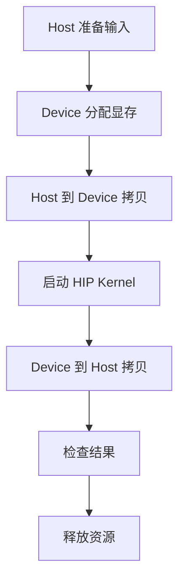

# 第1章 环境准备

## 本章导读

> 把这一章想象成一张「开工前体检表」就好。你**不必**在这里搞懂 ROCm、HIP、uv 的所有原理——那是后面章节的事。这一章只做一件事：让你有底气回答三个问题。ROCm 能不能看到 GPU？PyTorch 能不能用上 GPU？最小 HIP 程序能不能编译运行？三个都过了，基础链路就打通了；万一哪个过不去，我们也准备了排错指南，帮你用最快速度把问题定位出来。

本章对应代码在:

```text
code/part0-intro/
├── pyproject.toml
├── uv.lock
├── activate-rocm.sh
└── chapter1/
    ├── check_torch_rocm.py
    └── vector_add.hip
```

## 1.1 本教程的实验基线

本章不打算做"安装百科"，也不会覆盖所有 AMD GPU 和系统组合——真要写成那样，恐怕这一章就得比整本教程还厚。它只回答一个问题：**当前环境，够不够支撑你继续往后学？**

你可以把这一章想成三道门，必须依次推开，一道都跳不过去：

| 门 | 验证什么 | 推开之后说明 |
| ---- | ---- | ---- |
| 第一道门 | ROCm 能看到 GPU | 底层驱动和运行时基本可用 |
| 第二道门 | PyTorch ROCm | 框架层能把计算放到 AMD GPU 上 |
| 第三道门 | 最小 HIP 程序 | 后续手写 kernel 的路径基本打通 |

本章使用的基线如下：

| 项目 | 基线 |
| ---- | ---- |
| 硬件 | AMD Radeon RX 9070 XT |
| GPU 架构 | gfx1201（RDNA4；ISA 名 `gfx12-generic`）|
| ROCm 版本 | 7.13（`hipcc --version` 报 7.13.99004）|
| 操作系统 | **原生 Ubuntu 24.04**（Linux 6.17.0-35-generic，x86_64）|
| Python 环境管理 | uv（`uv 0.11.26`）|
| ROCm Python 包来源 | AMD `repo.amd.com/rocm/whl/gfx120X-all/` wheel 源 |

如果你的硬件或 ROCm 版本和上面对不上，不用担心——验证顺序仍然可以照搬，只是包版本、设备名、工具输出会有差异，到时候自己对照一下就好（换卡时的完整调整流程见 [附录 B · 换一张卡](../../appendix/appendix-b-switch-gpu/index.md)）。

本章所有命令输出均在 Radeon RX 9070 XT（gfx1201）+ ROCm 7.13 + 原生 Ubuntu 24.04 上实测，关键输出已逐段嵌入正文；本章没有单独提交 `logs/` 目录。

## 1.2 平台边界：原生 Linux 优先，WSL2 可用

在 9070XT 上跑 ROCm，常见的有两种平台选择：

| 方案 | 说明 |
| ---- | ---- |
| **原生 Linux 主机** | 工具链最完整，坑最少 |
| **WSL2**（Windows 11 上的 Linux 子系统）| 可用，但**功能有缺失**——见下面的警告 |

::: warning WSL2 下的已知缺失
如果你使用 WSL2 跟着学习，需要提前知道：

- ✅ `rocminfo`、`hipcc`、`hipMalloc`、PyTorch ROCm、Triton 这些**计算路径通常可用**。
- ❌ **`rocm-smi` 和 `amd-smi` 都不可用**。WSL2 内核没有加载 `amdgpu` 驱动模块（通过 `/dev/dxg` 暴露 GPU），两个工具都会报 `Driver not initialized (amdgpu not found in modules)`。
- ❌ 硬件性能计数器不可作为可用前提，后续 `rocprofv3 --pmc` 相关章节请以原生 Linux 为准。

所以本章在「验证 GPU 可见性」那一步只依赖 `rocminfo`，不把 `rocm-smi` / `amd-smi` 作为必需步骤。如果你后续想看显存占用、温度、功耗这类运行时状态，原生 Linux 上可以用（典型输出见下方 §1.4），WSL2 上两个工具都不行。
:::

如果你有条件，**首选原生 Linux**——能拿到完整的工具链（`rocm-smi` / `amd-smi` / `rocprofv3 --pmc` 全部可用），少踩 WSL2 的坑。但如果你手头只有 Windows，WSL2 也能把本教程跑通，只是要接受 `rocm-smi` / `amd-smi` 等依赖内核驱动的工具不可用。

## 1.3 同步本篇 uv 环境

开始之前，先把代码目录切过来：

```bash
cd code/part0-intro
```

依赖已经写好在 `pyproject.toml` 和 `uv.lock` 里，你**不用手动 `uv add` 一堆包**。一条命令就够了：

```bash
uv sync
```

<details>
<summary>输出：uv sync 创建本篇环境（gfx1201 / ROCm 7.13）</summary>

```text
Using CPython 3.12.3 interpreter at: /usr/bin/python3
Creating virtual environment at: .venv
Resolved 17 packages in 2.31s
Downloaded setuptools (1.0MiB)
 Downloaded setuptools
Prepared 1 package in 736ms
Installed 16 packages in 433ms
 + filelock==3.29.4
 + fsspec==2026.6.0
 + jinja2==3.1.6
 + markupsafe==3.0.3
 + mpmath==1.3.0
 + networkx==3.6.1
 + numpy==2.5.0
 + rocm==7.13.0
 + rocm-sdk-core==7.13.0
 + rocm-sdk-devel==7.13.0
 + rocm-sdk-libraries-gfx120x-all==7.13.0
 + setuptools==81.0.0
 + sympy==1.14.0
 + torch==2.11.0+rocm7.13.0
 + triton==3.6.0+rocm7.13.0
 + typing-extensions==4.15.0
```

</details>

同步完成后，激活本篇环境：

```bash
source ./activate-rocm.sh
```

<details>
<summary>输出：激活本篇 venv 后的关键检查（gfx1201 / ROCm 7.13）</summary>

激活 venv 后，`hipcc` 会进入 PATH（指向 venv 内），`torch` 也能正常导入——这两点是后面编译和跑 GPU 程序的前提：

```text
$ source .venv/bin/activate
$ which hipcc
.venv/bin/hipcc
$ python -c "import torch; print(torch.__version__)"
2.11.0+rocm7.13.0
```

如果你的环境里用的是 `activate-rocm.sh`（它会在激活 venv 的同时设好 `ROCM_PATH` / `HIP_PATH` / `LD_LIBRARY_PATH`），激活完请确认 `ROCM_PATH` 指向 `_rocm_sdk_devel`——指向 `_rocm_sdk_core` 的话，编译 HIP 程序会撞上 `cannot find ROCm device library`，详见 [附录 A · 环境安装细节与常见坑](../../appendix/appendix-a-env-install/index.md)。

</details>

## 1.4 验证 GPU 可见性

第一道门：ROCm 能不能看到 GPU。

先用 `rocminfo` 摸一摸你的 GPU：

```bash
rocminfo | grep -E "^[[:space:]]*(Name|Marketing Name|Vendor Name|Device Type|Compute Unit):" | head -20
```

<details>
<summary>输出：rocminfo 识别到 gfx1201 GPU（9070XT）</summary>

```text
  Name:                    12th Gen Intel(R) Core(TM) i5-12600K
  Marketing Name:          12th Gen Intel(R) Core(TM) i5-12600K
  Vendor Name:             CPU
  Device Type:             CPU
  Compute Unit:            16
  Name:                    gfx1201
  Marketing Name:          AMD Radeon RX 9070 XT
  Vendor Name:             AMD
  Device Type:             GPU
  Compute Unit:            64
```

</details>

关键看两点：`Device Type: GPU` 必须出现，并且 `Name` 是 `gfx1201`（对应 Marketing Name `AMD Radeon RX 9070 XT`）。两条都对上了，说明驱动认得你的卡——第一道门已经推开一半了。

> 如果你想确认 9070XT 的 ISA 名，可以再补一句 `rocminfo | grep amdhsa`，会看到 `amdgcn-amd-amdhsa--gfx1201` 和 `amdgcn-amd-amdhsa--gfx12-generic` 两条——前者是具体型号 target，后者是 gfx12 系列的通用 ISA。

#### rocm-smi / amd-smi：原生 Linux 可用，WSL2 下都不支持

在原生 Linux 上，验证完 `rocminfo` 后通常接着跑 `rocm-smi`（GPU 状态速览）和 `amd-smi`（更详细的硬件拓扑/功耗/clock）看 GPU 的显存、温度、功耗。本教程实验机（原生 Ubuntu 24.04 + 9070XT）上这两个工具的典型输出：

<details>
<summary>输出：rocm-smi（原生 Ubuntu，9070XT）</summary>

```text
$ rocm-smi

========================================= ROCm System Management Interface =========================================
=================================================== Concise Info ===================================================
Device  Node  IDs              Temp    Power  Partitions          SCLK     MCLK    Fan  Perf  PwrCap  VRAM%  GPU%
              (DID,     GUID)  (Edge)  (Avg)  (Mem, Compute, ID)
====================================================================================================================
0       1     0x7550,   28946  35.0°C  32.0W  N/A, N/A, 0         1664Mhz  875Mhz  0%   auto  317.0W  21%    1%
====================================================================================================================
```

`rocm-smi` 一行给出关键运行时状态：温度（Edge 35°C）、功耗（32W / 上限 317W）、核心/显存频率（SCLK 1664MHz / MCLK 875MHz）、显存占用（21%）、GPU 利用率（1%）。想看产品名加 `--showproductname`：

```text
$ rocm-smi --showproductname
GPU[0]  : Card Series:    AMD Radeon RX 9070 XT
GPU[0]  : Card Model:     0x7550
GPU[0]  : GFX Version:    gfx1201
```

版本：`ROCM-SMI version: 4.0.0` / `ROCM-SMI-LIB version: 7.8.0`（ROCm 7.13 自带）。

</details>

<details>
<summary>输出：amd-smi（原生 Ubuntu，9070XT，信息更详细）</summary>

`amd-smi` 是 `rocm-smi` 的后继者，提供更完整的硬件拓扑（PCIe 版本/带宽、功耗限制、固件版本等），它的输出比 `rocm-smi` 详细得多：

```text
$ amd-smi static     # 静态硬件信息（不随负载变化）
GPU: 0
    ASIC:
        MARKET_NAME: AMD Radeon RX 9070 XT
        DEVICE_ID: 0x7550
        NUM_COMPUTE_UNITS: 64
        TARGET_GRAPHICS_VERSION: gfx1201
    BUS:
        BDF: 0000:03:00.0
        MAX_PCIE_WIDTH: 16
        MAX_PCIE_SPEED: 32 GT/s
        PCIE_INTERFACE_VERSION: Gen 5
    LIMIT:
        PPT0:
            SOCKET_POWER_LIMIT: 317 W       # 标称 TBP
        SLOWDOWN_EDGE_TEMPERATURE: 110 °C   # 温度墙

$ amd-smi metric     # 运行时指标（随负载变化）
GPU: 0
    USAGE:
        GFX_ACTIVITY: 6 %
        UMC_ACTIVITY: 1 %                   # 显存控制器活动
    POWER:
        SOCKET_POWER: 36 W
        THROTTLE_STATUS: UNTHROTTLED        # 是否降频
    CLOCK:
        GFX_0:  CLK: 1221 MHz  (MIN 500 / MAX 2460)
        MEM_0:  ...
```

版本：`AMD-SMI Tool: 26.4.0 | ROCm version: 7.13.0`。`amd-smi monitor` 给类似 `rocm-smi` 的紧凑表格视图，`amd-smi static` 给静态拓扑，`amd-smi metric` 给运行时指标——三个子命令分工明确。

> 写文档时该用哪个？看你需要的信息粒度：`rocm-smi` 输出紧凑，适合一句话带过 GPU 状态；`amd-smi static` 适合记录硬件参数（CU 数、PCIe 版本、功耗墙），这些数字写进章节的"硬件上下文"很方便。本教程的硬件参数（64 CU、317W TBP、Gen5 PCIe）都从这里来。

</details>

**如果你在 WSL2 上学习，这两个工具都用不了**：

```text
$ rocm-smi
... Driver not initialized (amdgpu not found in modules)

$ amd-smi monitor
（同样报错，依赖 amdgpu 内核模块）
```

原因：WSL2 通过 `/dev/dxg`（不是 Linux 原生的 `amdgpu` 驱动）暴露 GPU，`rocm-smi` 和 `amd-smi` 都依赖 `amdgpu` 内核模块读硬件状态，WSL2 里没有这个模块。同样受影响的还有 `rocprofv3 --pmc` 的硬件计数器（依赖 KFD，见 [第 5 章 §5.3](../../part1-profiling/chapter5/index.md)）。

所以本章**只用 `rocminfo`** 这一个工具作为必需验证项——它不依赖 `amdgpu` / `rocm-smi` 那条状态监控路径，WSL2 上也能跑。

> `rocm-smi` / `amd-smi` 不可用**不影响**本章这三道门：`rocminfo`（验证 GPU）、`hipcc`（编译 kernel）、PyTorch ROCm（跑计算）都不走状态监控这条路。真正会受影响的是后续依赖 KFD / PMU 的 profiling 计数器，所以 profiling 篇以原生 Linux 的输出为准。如果你手头只有 WSL2，计算和编译全程能跑通，只是看不到温度/功耗/利用率这类运行时状态。

**如果 `rocminfo` 这一步失败了（连 GPU 都看不到），请先不要急着去跑 PyTorch、HIP 或 Triton**。上层框架全都建在底层运行时之上——底层不通，上层抛出来的错通常只会更让你迷惑。先回到驱动安装和 ROCm 官方文档去排查，确认 `rocminfo` 能看到 GPU 之后再继续。

## 1.5 验证 PyTorch ROCm

第二道门：框架层能不能真的把计算放到 AMD GPU 上。

先看检查脚本:

<details>
<summary>代码：check_torch_rocm.py</summary>

```python
import platform

import torch

print(f"python: {platform.python_version()}")
print(f"torch: {torch.__version__}")
print(f"cuda_available: {torch.cuda.is_available()}")

if not torch.cuda.is_available():
    raise SystemExit("PyTorch ROCm backend is not available")

print(f"device_count: {torch.cuda.device_count()}")
print(f"device_name: {torch.cuda.get_device_name(0)}")

x = torch.randn(1024, 1024, device="cuda")
y = x @ x

print(f"result_shape: {tuple(y.shape)}")
print(f"result_dtype: {y.dtype}")
print(f"result_device: {y.device}")
print(f"result_checksum: {y.sum().item():.6f}")
```

</details>

这个脚本做了三件事：导入 PyTorch、检查 GPU 后端、在 GPU 上跑一次 `1024 × 1024` 矩阵乘。简单到不能再简单——但验证环境时，**越简单越好**。复杂的例子只会让排查时变量更多、更乱。

运行：

```bash
python chapter1/check_torch_rocm.py
```

<details>
<summary>输出：PyTorch ROCm smoke test（gfx1201 / ROCm 7.13）</summary>

```text
python: 3.12.3
torch: 2.11.0+rocm7.13.0
cuda_available: True
device_count: 1
device_name: AMD Radeon RX 9070 XT
result_shape: (1024, 1024)
result_dtype: torch.float32
result_device: cuda:0
result_checksum: -12872.921875
```

看到 `device_name: AMD Radeon RX 9070 XT` 和 `cuda_available: True`，第二道门就过了——PyTorch 能看到 GPU 并完成了一次矩阵乘。

</details>

脚本没有固定随机种子，因此 `result_checksum` 每次可能不同。这里检查的是 shape、dtype、device 和计算能否完成，不应把 checksum 与示例逐位对照。

这里有个**几乎每个新手都会问的问题**：为什么 ROCm 版 PyTorch 里到处都是 `cuda`？答案是历史包袱——PyTorch 的设备字符串一直沿用 `cuda` 这个名字，没有为 ROCm 单独开一条。看到 `device="cuda"` 不代表你跑在 NVIDIA 卡上，把它读作"把 tensor 放到当前可用的 GPU 后端"就行。第二道门推开之后，这个命名的小别扭很快就会被你忘掉。

这一步过了，至少说明三件事：

| 检查项 | 通过后说明什么 |
| ---- | ---- |
| `import torch` 成功 | Python 环境里的 PyTorch 可用 |
| `cuda_available: True` | PyTorch 能看到 GPU 后端 |
| 矩阵乘完成 | 基础 GPU 计算路径可用 |

## 1.6 验证最小 HIP 程序

第三道门：你后续手写 kernel 的那条路有没有打通。

PyTorch 跑通只能证明框架层 OK；要真正走到 GPU 编程，还得能把一段 HIP C++ 编译、加载、跑起来。这里**不要求你立刻理解 HIP 的所有细节**——那是第 2 篇的事情。现在你只需要知道一个最小 HIP 程序的骨架长什么样：

::: figure fig-min-hip-flow


最小 HIP 程序的基本路径
:::

如 @fig-min-hip-flow 所示，这是几乎所有 HIP / CUDA 程序的最小骨架——分配显存、拷数据、起 kernel、拷回结果、校验、释放。后面写更复杂的算子时，外壳依然是这个样子，变的只是 kernel 内部那几行。把这个骨架刻在脑子里，后面学起来会轻松很多。

下面是本章用到的 HIP 文件：

<details>
<summary>代码：vector_add.hip</summary>

```cpp
#include <hip/hip_runtime.h>

#include <algorithm>
#include <cmath>
#include <iostream>
#include <limits>
#include <vector>

#define HIP_CHECK(call)                                                     \
  do {                                                                      \
    hipError_t err = call;                                                  \
    if (err != hipSuccess) {                                                \
      std::cerr << "HIP error: " << hipGetErrorString(err) << std::endl;   \
      return 1;                                                             \
    }                                                                       \
  } while (0)

__global__ void vector_add(const float* a, const float* b, float* c, int n) {
  int idx = blockIdx.x * blockDim.x + threadIdx.x;
  if (idx < n) {
    c[idx] = a[idx] + b[idx];
  }
}

int main() {
  const int n = 1 << 20;
  const size_t bytes = n * sizeof(float);

  std::vector<float> h_a(n, 1.0f);
  std::vector<float> h_b(n, 2.0f);
  std::vector<float> h_c(n, 0.0f);

  float* d_a = nullptr;
  float* d_b = nullptr;
  float* d_c = nullptr;

  HIP_CHECK(hipMalloc(&d_a, bytes));
  HIP_CHECK(hipMalloc(&d_b, bytes));
  HIP_CHECK(hipMalloc(&d_c, bytes));

  HIP_CHECK(hipMemcpy(d_a, h_a.data(), bytes, hipMemcpyHostToDevice));
  HIP_CHECK(hipMemcpy(d_b, h_b.data(), bytes, hipMemcpyHostToDevice));

  const int threads = 256;
  const int blocks = (n + threads - 1) / threads;
  vector_add<<<blocks, threads>>>(d_a, d_b, d_c, n);
  HIP_CHECK(hipGetLastError());
  HIP_CHECK(hipDeviceSynchronize());

  HIP_CHECK(hipMemcpy(h_c.data(), d_c, bytes, hipMemcpyDeviceToHost));

  float max_error = 0.0f;
  for (int i = 0; i < n; ++i) {
    const float error = std::abs(h_c[i] - 3.0f);
    if (!std::isfinite(error)) {
      max_error = std::numeric_limits<float>::infinity();
      break;
    }
    max_error = std::max(max_error, error);
  }
  const bool correct = std::isfinite(max_error) && max_error == 0.0f;

  hipDeviceProp_t prop{};
  HIP_CHECK(hipGetDeviceProperties(&prop, 0));

  std::cout << "device_name: " << prop.name << std::endl;
  std::cout << "vector_size: " << n << std::endl;
  std::cout << "blocks: " << blocks << std::endl;
  std::cout << "threads_per_block: " << threads << std::endl;
  std::cout << "max_error: " << max_error << std::endl;
  std::cout << "status: " << (correct ? "PASS" : "FAIL") << std::endl;

  HIP_CHECK(hipFree(d_a));
  HIP_CHECK(hipFree(d_b));
  HIP_CHECK(hipFree(d_c));

  return correct ? 0 : 1;
}
```

</details>

先确认一下 `hipcc` 版本——这个命令顺带还能验证编译器路径是否在 `_rocm_sdk_devel` 下面：

```bash
hipcc --version
```

<details>
<summary>输出：HIP 编译器版本（ROCm 7.13）</summary>

```text
$ hipcc --version
HIP version: 7.13.99004-3309c6114a
```

</details>

然后编译 HIP 程序——这一步检验的是 HIP 编译器能不能找到你的 GPU 对应的 device library：

```bash
cd chapter1
hipcc vector_add.hip -O2 -o vector_add && echo "compile_status: PASS"
```

<details>
<summary>输出：HIP 程序编译（vector_add.hip）</summary>

```text
$ hipcc vector_add.hip -O2 -o vector_add && echo "compile_status: PASS"
compile_status: PASS
```

编译通过意味着 HIP 编译器认识 gfx1201、能找到对应的 device library。

</details>

运行程序：

```bash
./vector_add
```

<details>
<summary>输出：vector add 运行结果（9070XT）</summary>

```text
device_name: AMD Radeon RX 9070 XT
vector_size: 1048576
blocks: 4096
threads_per_block: 256
max_error: 0
status: PASS
```

看到 `status: PASS` 和 `max_error: 0`，三道门全部推开——HIP 编译器认识你的 GPU、kernel 顺利启动、Host 与 Device 之间的数据拷贝正常、结果校验通过。

</details>

三道门全部推开——恭喜你，正式具备继续往后学的条件了。HIP 编译器认识你的 GPU、device library 找得到、kernel 顺利启动、Host 与 Device 之间的数据拷贝正常、结果校验通过，后面章节的每一行代码都建立在这三道门的基础之上。

## 1.7 环境不通时先收集什么

环境问题最容易让人焦虑——这一点我们都经历过。但**最糟糕的排错方式是只说一句"跑不通"**。无论求助对象是助教、社区，还是几小时之后冷静下来的你自己，你都需要把模糊的"不行"翻译成别人能判断的具体信息。

一个像样的排错请求，至少需要包含下面这些信息：

| 信息 | 示例 | 为什么重要 |
| ---- | ---- | ---- |
| 机器信息 | Radeon RX 9070 XT（gfx1201）/ ROCm 7.13 / 原生 Ubuntu 24.04 | 明确硬件和软件背景 |
| 目录 | `hello-gpu/code/part0-intro` | 排查路径和环境变量问题 |
| 环境 | `source ./activate-rocm.sh` 后运行 | 判断 venv 是否正确激活 |
| 命令 | `python chapter1/check_torch_rocm.py` | 方便别人复现 |
| 期望 | PyTorch 能看到 GPU 并完成矩阵乘 | 明确你认为应该发生什么 |
| 实际 | 完整报错输出 | 保留关键证据 |
| 最近改动 | 刚执行过 `uv sync` | 排查环境变化来源 |

保存输出最省事的办法是用 `tee`——既能让你看到屏幕输出，也能同时留下一份完整日志：

```bash
python chapter1/check_torch_rocm.py 2>&1 | tee check_torch_rocm.log
```

另外，尽量把下面这些版本信息也记下来——别嫌麻烦，一行命令报错时它们能帮你省掉至少半小时的盲目搜索：

- ROCm 版本
- Python 版本
- PyTorch 版本
- uv 环境所在路径
- 当前 GPU 架构（gfx1201）
- 运行日期

最后请把这条铁律刻在心上：**先确认底层，再确认上层**，顺序千万别反过来。

```text
ROCm / GPU 可见性
  ↓
Python 环境
  ↓
PyTorch ROCm
  ↓
HIP / Triton / profiling 工具
```

按这个顺序从下往上排查，无论是自己复盘，还是去问别人，沟通成本都会低很多。这也是整个算子优化领域的通用排错思路——后面做 profiling、调优时，你还会反复用到这一条。

## 附录：环境细节与换卡迁移

本章主线只要求你会跑 `uv sync` 和几个验证命令。下面这些进阶内容已经独立成附录，需要时再翻：

| 你想了解的 | 去哪里看 |
| ---- | ---- |
| 这套环境文件到底是怎么来的？AMD wheel 源为什么要 `explicit`？`rocm-sdk init` 报 "cannot find ROCm device library" 怎么办？ | [附录 A · 环境安装细节与常见坑](../../appendix/appendix-a-env-install/index.md) |
| 我手上的卡不是 9070 XT（比如 AI MAX 395 / gfx1151），照着本章的 `pyproject.toml` 抄下来 `uv sync` 报错怎么办？ | [附录 B · 换一张卡：从 gfx120X-all 迁移到 gfx1151](../../appendix/appendix-b-switch-gpu/index.md) |

两个附录互不依赖，可以按需跳读。

## 本章小结

- 本章推开了三道环境验证门：**ROCm 可见、PyTorch ROCm、最小 HIP 路径**，每一道都是上一道的延伸，跳不过去。
- 本教程当前基线是原生 Ubuntu 24.04 + ROCm 7.13；WSL2 读者通常也能跑通计算路径，但 `rocm-smi` / `amd-smi` 与硬件性能计数器相关能力不能作为可用前提。
- 在 GPU 驱动、`uv` 和系统编译工具已经就绪的前提下，`pyproject.toml` + `uv.lock` 固化了本篇 Python/ROCm wheel 依赖；进入 `code/part0-intro` 后用 `uv sync` 安装，不需要再手工拼装 `pip` 包版本。
- `activate-rocm.sh` 负责处理 ROCm wheel 的环境变量，最核心的职责是让 `ROCM_PATH` 指向 `_rocm_sdk_devel`，而不是 `_rocm_sdk_core`。
- PyTorch ROCm 里看到 `cuda:0` 完全正常，是历史命名问题，**不代表**你在用 NVIDIA GPU。
- 环境不通时不要只甩一句"失败了"——把机器信息、目录、命令、完整输出、版本号和最近改动一起拿出来，排错效率会高一个数量级。
- 下一章我们正式进入 GPU 体系结构，把 CU、Wavefront、LDS 这些概念拆开来看——三道门之后的风景，我们来了。

## 延伸阅读

- [uv Documentation](https://docs.astral.sh/uv/)
- [AMD ROCm Documentation](https://rocm.docs.amd.com/)
- [AMD ROCm wheel 源（gfx120X-all）](https://repo.amd.com/rocm/whl/gfx120X-all/)
- [PyTorch Get Started](https://pytorch.org/get-started/locally/)
