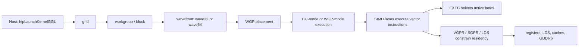
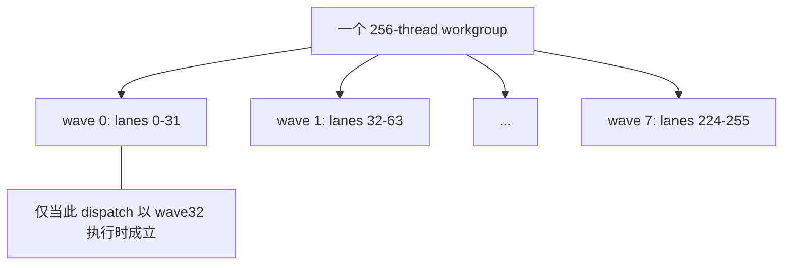
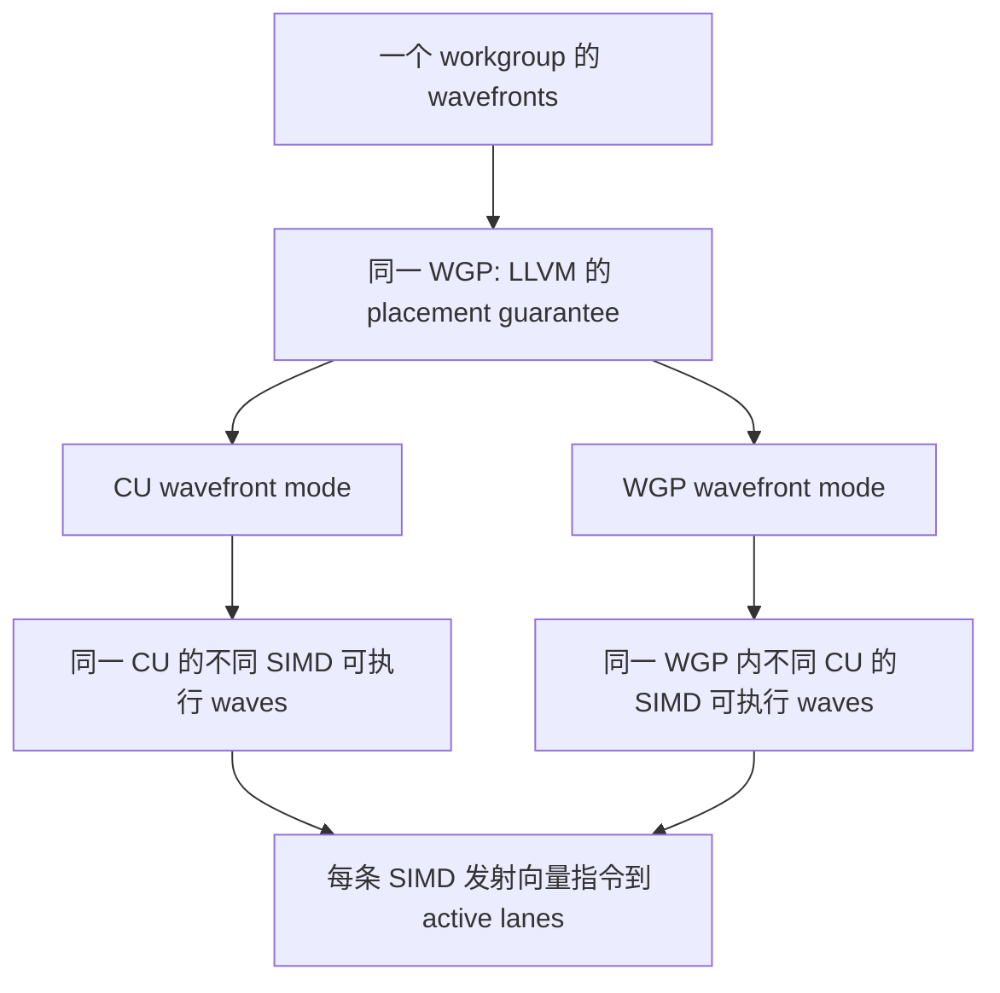
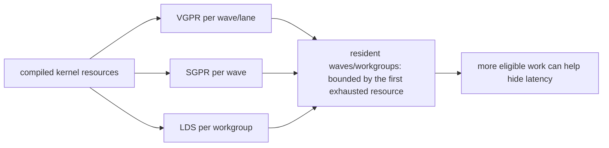
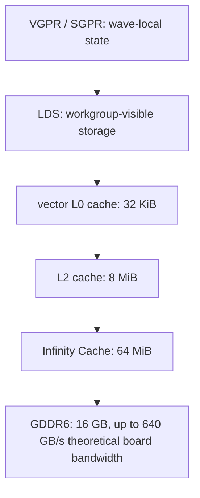
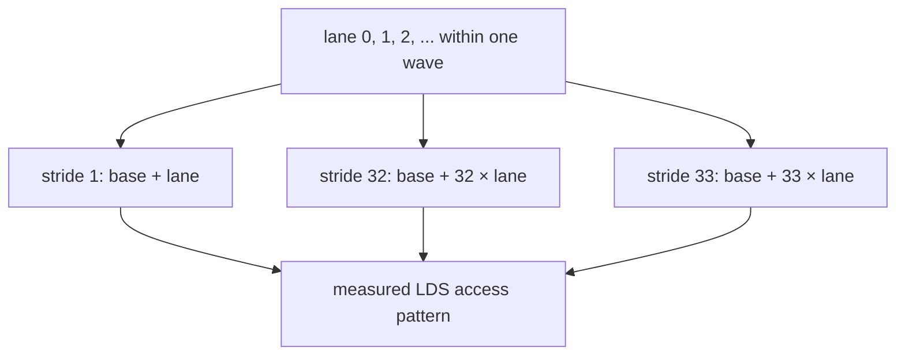
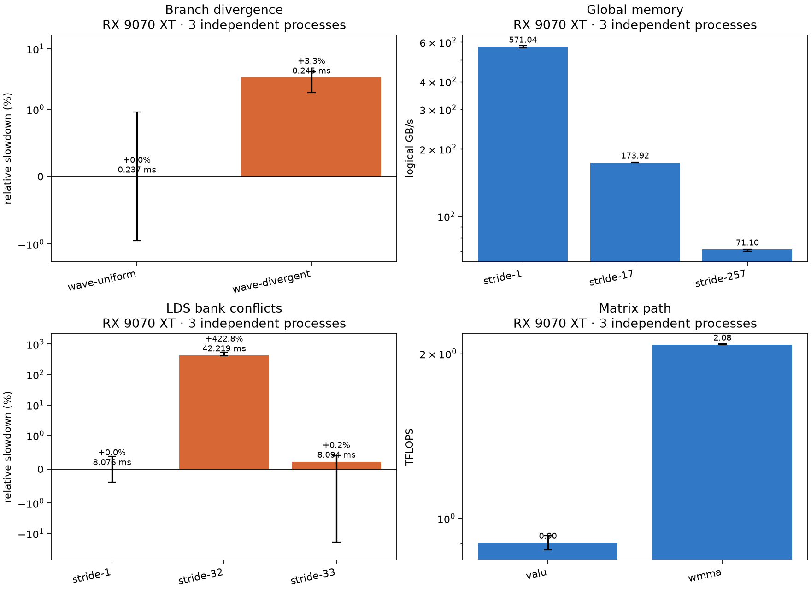

# 第2章 GPU 体系结构：Kernel 执行旅程

## 本章导读：跟着一次 Kernel 走进 RX 9070 XT

第 1 章确认了环境能够启动 HIP kernel；这一章换一个视角：不先背硬件名词，而是跟随一次 `hipLaunchKernelGGL`。它从 host 上的 grid 出发，被划分为 workgroup 和 wavefront，落到能执行它的硬件路径；分支改变有效 lane，寄存器与 LDS 决定可同时驻留的工作量。后半章再沿同一条路径考察数据访问、LDS bank 与矩阵指令。

本文的硬件锚点是 AMD Radeon RX 9070 XT：AMD 产品页列出 64 Compute Units、16 GB GDDR6、256-bit 接口、最高 640 GB/s 以及 64 MB Infinity Cache；这些是产品规格，不是某个 kernel 的实测速率。[AMD RX 9070 XT 产品规格](https://www.amd.com/en/products/graphics/desktops/radeon/9000-series/amd-radeon-rx-9070xt.html) ROCm 的 GFX1201 条目给出 `gfx1201`、wave32/wave64、128 KiB LDS、768 KiB VGPR file 与 32 KiB SGPR file 等资源数字。[ROCm GPU specifications](https://rocm.docs.amd.com/en/latest/reference/gpu-specs.html)

::: figure fig-ch2-kernel-journey


一次 HIP kernel 的学习路线：先建立工作划分，再把每个术语放回它影响的决策点。
:::

这是一张**编程模型到执行模型的导览图**，不是对某次 dispatch 的物理追踪：调度位置、同时驻留的 wave 数及缓存命中都需由编译产物和 profile 证明。为避免把 CUDA 习惯直接套到 AMD，先固定本章使用的对照词：

| HIP 中的词 | CUDA 中常见词 | AMD 执行模型中的词 | 本章应该怎样理解 |
| --- | --- | --- | --- |
| thread / work-item | thread | lane 上的一份工作 | 一个逻辑下标，不等于一颗独立处理器 |
| block | thread block | workgroup | 一组能协作、可使用 LDS 的 work-item |
| warp | warp | wavefront | 同一波前的 lane 按同一段指令流执行；目标可用 wave32 或 wave64 |
| grid | grid | dispatch 的 work-group 集合 | host 提交的全部工作，不保证立即同时执行 |
| `__shared__` | shared memory | LDS | workgroup 可显式使用的片上存储 |

> **读法约定**：下文的“RX 9070 XT”只指已记录的 `gfx1201` 实验平台；“wave32”既是该平台实验的实际 `warpSize`，也是本章代码例子的分组。它不把所有 AMD GPU、所有编译选项或所有 wave64 kernel 归为同一结论。

## 2.1 第一站：从 Kernel launch 到 workgroup

从 host 看，kernel launch 明确指定 grid 和 block。仓库的全局内存实验以 `kBlockSize=256` 构造 `dim3 grid(grid_for(n))` 与 `dim3 block(kBlockSize)`，再把它们传给 `hipLaunchKernelGGL`；kernel 内的

```cpp
std::size_t tid = blockIdx.x * blockDim.x + threadIdx.x;
if (tid < n) output[tid] = input[tid];
```

把一个 work-item 映射到一个全局下标。[`global_memory_access.hip`](../../../code/part0-intro/chapter2/global_memory_access.hip) 中真实版本只把读取下标改为受控的 stride。这里 `block` 是软件划分的 workgroup：它告诉运行时每组 work-item 的形状；它**没有**承诺“一组 block 对应一个 CU”，也没有承诺这些组会以 grid 顺序完成。

在这个站点应先问两个问题：一组 work-item 是否覆盖了正确的输出区域？最后一个 workgroup 越界的 lane 是否安全退出？这比“把 block 设成一个流行数字”更基础。对于需要 workgroup 内协作的 kernel，`__syncthreads()` 的参与条件也必须一致；否则问题首先是正确性，而不是吞吐率。

**迁移范围：** `grid`/`block`/`threadIdx` 的语义是 HIP 编程模型可移植的；256 这个值只来自本仓库的受控实验，不是 RX 9070 XT 的通用最优 block size。

**Kernel 决策卡**

- **事实：** launch 将 grid 划分为 workgroup；源码中的 `blockIdx`、`blockDim`、`threadIdx` 共同确定逻辑下标。
- **失败模式：** 把 block 当作物理 CU，或漏掉尾部边界，分别导致错误的性能解释或越界访问。
- **编码检查：** 写出全局下标与 `tid < n`，并让所有会到达 barrier 的 lane 走同一控制路径。
- **验证方法：** 用非整除 `blockDim` 的输入做 CPU 参考对照；再由 profile 观察实际 dispatch，而不从源码推断调度位置。

## 2.2 第二站：workgroup 怎样拆成 wavefront

运行时还会把一个 workgroup 拆成一个或多个 wavefront。ROCm 的 `gfx1201` 规格列出 wave32 和 wave64；本机的 HIP 属性在四个实验中报告 `wave_size=32`，因此 `blockDim.x=256` 的示例可被读成 **8 个 wave32**，而不是“256 个独立同时执行的线程”。[ROCm GFX1201 wavefront specifications](https://rocm.docs.amd.com/en/latest/reference/gpu-specs.html)

这一区分也解释了 branch 实验里两种谓词的写法：`wave-uniform` 用 `(tid / warpSize)` 让整组 lane 取同一路，`wave-divergent` 用 `(tid & 1)` 交替 lane。源码特意读取 runtime 的 `warpSize`，而不是把 32 硬编码为语言规则。[`branch_divergence.hip`](../../../code/part0-intro/chapter2/branch_divergence.hip)



wavefront 是执行时需要关心的粒度：同一个 wave 中的 lane 共享一段向量指令流，某些 lane 可以因边界或分支而失活；这并不改变它们仍属于同一波前。不要把 `warpSize=32` 当成“所有 AMD 目标都固定为 32”，也不要把某个 workgroup 的 thread 数自动等同于一条 wave 的宽度。

**迁移范围：** wavefront 作为 AMD 编程/执行术语可迁移；本节的 8×wave32 只适用于 256-thread block 且实际 wave size 为 32 的实例。wave64 kernel 应重新计算分组和分支边界。

**Kernel 决策卡**

- **事实：** workgroup 被拆为 wavefront；`gfx1201` 支持 wave32 与 wave64，而当前受控实验 runtime 报告 wave32。
- **失败模式：** 用 thread 数代替 wave 数，或把 wave32 的分支边界直接移植到 wave64 代码。
- **编码检查：** 以目标编译产物/运行时的 wave size 设计 lane 分组、tail mask 与 workgroup 内协作。
- **验证方法：** 记录 `hipDeviceProp_t::warpSize`、编译 target 和 block shape；用 non-multiple shape 验证边界与参考结果。

## 2.3 第三站：wavefront 怎样落到 WGP、CU 和 SIMD

wavefront 接下来不是“钉死”到一张 2-CU/4-SIMD 示意图上。LLVM 的 AMDGPU 文档给出的保证是：**同一 workgroup 的 wavefront 在同一 WGP 中执行**；在 CU wavefront execution mode 中，它们可以在同一 CU 的不同 SIMD 上执行；在 WGP wavefront execution mode 中，它们可以在同一 WGP 内不同 CU 的 SIMD 上执行。WGP mode 的可用性与编译器/目标有关，不能由一个 HIP kernel 的源码或 block size 反推。[LLVM AMDGPU：workgroup 的 WGP/CU execution mode](https://llvm.org/docs/AMDGPUUsage.html)

::: figure fig-ch2-wgp-cu-simd


WGP/CU/SIMD 的安全读法：图表达 LLVM 的执行模式关系，不规定每个 WGP 含几个 CU 或 SIMD。
:::

RX 9070 XT 的产品规格为 64 CU；本章环境的 `rocminfo` 也报告 64 physical CU 与 `gfx1201`。但是 HIP 的 `hipDeviceProp_t::multiProcessorCount` 在本机是 32，实验输出将它保留为 `hip_multiprocessor_count=32`，**不把它重命名为 physical CU**。[AMD 的 64 CU 产品规格](https://www.amd.com/en/products/graphics/desktops/radeon/9000-series/amd-radeon-rx-9070xt.html) 因而，`multiProcessorCount` 可以作为本次 runtime 的诊断字段，不能作为替换物理 CU 总数的依据。

SIMD 是执行向量指令的地方；它解释了为什么“同一 wave 的 lane 做同一类工作”是重要的，但不授权我们从编程模型推导每条指令的周期、每个 WGP 的固定内部个数或一个 kernel 的并发度。那些都是目标、指令、资源使用和调度状态共同决定的问题。

**迁移范围：** 64 CU 是 RX 9070 XT 产品规格；`multiProcessorCount=32` 是本机 HIP runtime 观测。WGP/CU mode 的关系按 LLVM 文档解释，不能外推为固定的 WGP 物理拓扑。

**Kernel 决策卡**

- **事实：** LLVM 保证同一 workgroup 的 wavefront 位于同一 WGP；CU mode 与 WGP mode 对 wave 可跨越的 SIMD/CU 给出不同允许关系。
- **失败模式：** 将 HIP 的 `multiProcessorCount` 叫作 physical CU，或把教学图误读为所有 RDNA 设备的固定 2-CU/4-SIMD 结构。
- **编码检查：** 让 workgroup 内通信通过正确的 LDS/同步语义表达；不要把物理 placement 假设编码为正确性前提。
- **验证方法：** 同时记录 target、`rocminfo` 与 HIP runtime 字段；需要 mode/资源结论时检查 LLVM 文档、code object 与 profiler，而非凭图推断。

## 2.4 第四站：分支、EXEC mask 与有效 lane

同一 wave 的 lane 遇到不同 `if` 结果时，向量路径仍按 wave 的指令流前进，但 `EXEC` 控制哪些 lane 的向量操作有效。LLVM 的 AMDGPU 文档用嵌套条件展示了保存原 `EXEC`、与条件相与执行 then、反转 mask 执行 else、再恢复原 mask 的模式；这正是把“发散”理解为**有效 lane 集合随指令段变化**的可靠入口。[LLVM AMDGPU：divergent control flow 与 EXEC](https://llvm.org/docs/AMDGPUUsage.html)

::: figure fig-ch2-exec-divergence
```mermaid
sequenceDiagram
    participant W as wave32 (示意)
    Note over W: t0: EXEC = lanes 0-31
    W->>W: t1: evaluate predicate
    Note over W: t2: then path, EXEC = lanes selected by predicate
    W->>W: t3: execute then instructions; inactive lanes do no vector work
    Note over W: t4: else path, EXEC = remaining selected lanes
    W->>W: t5: execute else instructions
    Note over W: t6: restore EXEC and reconverge
```

受控发散时间线：它显示 mask 的概念顺序，不主张每段恰好耗费一个周期。
:::

本仓库的最小实验固定 `N=16,777,216`、FP32、4 条依赖 FMA 的两条路径和其他计时设置，只改变谓词：按 `warpSize` 分组的 `wave-uniform`，与按 `tid` 奇偶交替的 `wave-divergent`。三进程中位数及范围分别为 **0.237341 [0.237041, 0.239320] ms** 和 **0.245241 [0.243860, 0.246920] ms**；后者慢 **3.33%**。完整协议、环境与 disassembly 审计在 [`EXPERIMENT.md`](../../../code/part0-intro/chapter2/EXPERIMENT.md)。

这个数值只说明该 RX 9070 XT 上、该受控谓词与指令组合存在可测差异；它**不是**“发散总会慢 3.33%”的通用惩罚。编译器可以改变分支形态，路径长度、访存、寄存器压力、wave size 和 data distribution 都会改变结果。对于短小条件，先检查生成代码与端到端 benchmark，再决定重排数据、拆 kernel 或保留分支。

**迁移范围：** EXEC 的掩码执行模型来自 LLVM AMDGPU 文档；本节的 3.33% 只迁移到记录的 gfx1201、N、FP32、四 FMA 路径和实验协议，不能迁移为其他 kernel 的预算。

**Kernel 决策卡**

- **事实：** divergent control flow 通过改变 `EXEC` 的有效 lane 集合执行 then/else 路径，再在汇合点恢复。
- **失败模式：** 把不活跃 lane 当作另一条同时执行的路径，或把一个受控 benchmark 的百分比当作所有 branch 的固定税。
- **编码检查：** 识别是否同一 wave 内 lane 取不同路径；优先让相近 lane 的 predicate/data 保持一致，同时不牺牲边界正确性。
- **验证方法：** 固定 shape、路径工作量和计时协议，检查 code object/disassembly，再报告中位数与独立进程范围而不是单次时间。

## 2.5 第五站：VGPR、SGPR、LDS 与驻留资源

当一条 wave 等待访存，硬件可切换到另一个已驻留的 wave；因此“能同时驻留多少工作”是延迟隐藏的一个资源问题，而不是只看线程数的分数。对 `gfx1201`，ROCm 规格列出的资源包括 **768 KiB VGPR file、32 KiB SGPR file 与 128 KiB LDS**。[ROCm GFX1201 register and LDS specifications](https://rocm.docs.amd.com/en/latest/reference/gpu-specs.html) 这些是硬件资源容量；一个具体 kernel 实际使用多少寄存器、静态 LDS、scratch，必须从编译结果或 profile 读取。

::: figure fig-ch2-residency-resources


驻留资源图：VGPR、SGPR、LDS 都可能成为上限；图不是从总容量直接计算 occupancy 的公式。
:::

三者的职责不同。VGPR 保存每个 lane 的向量临时值，SGPR 保存可由 wave 共享的标量状态，LDS 是 workgroup 显式协作与数据复用的片上区域。LDS 实验中的 `volatile __shared__ float shared[...]`、`__syncthreads()` 和 `wave = threadIdx.x / kWaveSize` 展示了后一种用法；它会在后半章用 stride-1/32/33 的受控对照讨论 bank 行为。[`lds_bank_conflict.hip`](../../../code/part0-intro/chapter2/lds_bank_conflict.hip)

不能从“LDS 有 128 KiB”直接得出某 kernel 的 occupancy，也不能把 occupancy 当作越高越好。寄存器数、LDS 分配粒度、workgroup shape、硬件限制、实际可并发的 workgroup 与瓶颈性质共同决定有效并发；过度压低寄存器还可能引入 spill 或更多指令。正确的顺序是：先保证算法/访存语义，再读取 compiler resource usage，用 profile 判断是否真在等延迟。

**迁移范围：** 本节的容量数字仅锚定 gfx1201 规格；“资源先耗尽者限制驻留”的思路可迁移，但具体 occupancy、spill 和最佳 tile 必须对目标 GPU、编译器与 kernel 单独测量。

**Kernel 决策卡**

- **事实：** VGPR、SGPR 和 LDS 都会消耗有限的片上资源，并可限制同时驻留的 wave/workgroup；规格容量不等于单 kernel 的实际用量。
- **失败模式：** 只追求更高 occupancy，忽略 spill、额外指令或 LDS/workgroup 分配造成的真实瓶颈。
- **编码检查：** 将临时数组、循环展开和 `__shared__` tile 视为资源选择；保留必要同步，避免为“少用寄存器”破坏数据复用。
- **验证方法：** 查看编译器的 VGPR/SGPR/LDS/scratch 报告与 profile，再在固定输入、target 和正确性检查下比较候选 tile/block。

## 2.6 第六站：从片上资源到 GDDR6 的数据旅程

一次 load/store 的数据不一定会走到最远的显存：它可能命中寄存器、LDS 或缓存；也可能继续向板载 GDDR6 请求。对 `gfx1201`，ROCm 规格列出 32 KiB L0 vector cache、8 MiB L2 和 64 MiB Infinity Cache；RX 9070 XT 产品规格列出 16 GB GDDR6、256-bit 接口与**最高 640 GB/s**的理论板卡带宽。[ROCm GFX1201 cache specifications](https://rocm.docs.amd.com/en/latest/reference/gpu-specs.html) [AMD RX 9070 XT 产品规格](https://www.amd.com/en/products/graphics/desktops/radeon/9000-series/amd-radeon-rx-9070xt.html) [AMD Radeon 9000 Quick Reference Guide](https://www.amd.com/content/dam/amd/en/documents/partner-hub/radeon/radeon-rx-9000-series-quick-reference-guide-non-competitive.pdf)

::: figure fig-ch2-memory-hierarchy


`gfx1201` 的容量与逻辑层次图。箭头表示可能的数据路径，而不是固定延迟、带宽、命中率或每次访问必经的精确硬件流水线。
:::

图中的容量不是性能排名，也不能把 64 MiB Infinity Cache 误写成 L2。尤其要区分三件事：规格给的是容量和理论板卡带宽；程序的**逻辑字节**来自算法读写计数；物理 GDDR6 流量还取决于缓存、写入行为和硬件事务，需通过适当计数器或受控实验才能归因。后面的 global-memory 实验只报告前者的逻辑有效带宽。

**迁移范围：** 32 KiB L0、8 MiB L2、64 MiB Infinity Cache、16 GB GDDR6 和 640 GB/s 仅锚定 RX 9070 XT / gfx1201 规格。一次访问实际命中哪一级、其延迟或物理流量必须在目标系统上测量。

**Kernel 决策卡**

- **事实：** 寄存器、LDS、缓存和 GDDR6 处于同一数据旅程的不同层；规格容量不说明任意 kernel 的命中率或实际带宽。
- **失败模式：** 把逻辑读写字节叫作物理 GDDR6 流量，或把 64 MiB Infinity Cache 归为 L2。
- **编码检查：** 为每个数组写清复用范围、访问顺序和 `__shared__` 所有权，再决定是否需要显式 tile。
- **验证方法：** 把算法字节、event 时间和可用硬件计数器分开记录；没有计数器时只报告逻辑指标并声明边界。

## 2.7 第七站：全局内存访问怎样浪费带宽

同一份输出可以因为读取地址的排列不同而产生完全不同的逻辑有效带宽。这里唯一改变的变量是 `Stride`：每个 work-item 仍写一个连续的 `output[tid]`，但从一个 power-of-two 分配中读取 `input[(tid * Stride) & (n - 1)]`。

```cpp
template <unsigned Stride>
__global__ void gather_copy(const float* input, float* output, std::size_t n) {
    std::size_t tid = blockIdx.x * blockDim.x + threadIdx.x;
    if (tid < n) output[tid] = input[(tid * Stride) & (n - 1)];
}
```

::: figure fig-ch2-global-access
```mermaid
flowchart LR
    T[consecutive lanes: tid 0, 1, 2, ...] --> S1[stride 1: input 0, 1, 2, ...]
    T --> S17[stride 17: input 0, 17, 34, ...]
    T --> S257[stride 257: input 0, 257, 514, ...]
    S1 --> O[all variants: output[tid]]
    S17 --> O
    S257 --> O
```

全局访问对照只改变读下标的 stride。它是“lane 地址排列”的示意，不是物理事务次数或 cache-line 计数。
:::

在 `N=16,777,216` FP32、`warmup=10`、`repeat=50` 的三独立进程协议下，逻辑有效带宽按 `2 × N × sizeof(float) / event time` 计算：

| 读取 stride | 中位数时间（ms）[三进程范围] | 逻辑有效带宽（GB/s）[三进程范围] | 相对 stride-1 |
| --- | ---: | ---: | ---: |
| 1 | 0.235040 [0.231941, 0.237641] | 571.042 [564.792, 578.673] | 基线 |
| 17 | 0.771721 [0.770461, 0.772321] | 173.920 [173.785, 174.204] | -69.54% |
| 257 | 1.887641 [1.884983, 1.923662] | 71.103 [69.772, 71.204] | -87.55% |

结果支持的结论很具体：在这个 gfx1201 gather-copy、shape 和 odd-stride permutation 中，离散的读取下标显著降低了**逻辑有效带宽**。它不证明用了多少物理 memory transaction，也不证明数据必然绕过 L0、L2 或 Infinity Cache；因此不能用 571.042 GB/s 去反推 GDDR6 实际流量，更不能和 640 GB/s 理论板卡带宽作“已达百分之几”的归因。源码和协议见 [`global_memory_access.hip`](../../../code/part0-intro/chapter2/global_memory_access.hip)、[`EXPERIMENT.md`](../../../code/part0-intro/chapter2/EXPERIMENT.md) 与 [`evidence/summary.csv`](../../../code/part0-intro/chapter2/evidence/summary.csv)。

**迁移范围：** 连续邻近下标通常值得作为第一版假设；具体 stride 曲线、缓存影响和最佳布局必须用目标 dtype、shape、编译器和 GPU 重测。

**Kernel 决策卡**

- **事实：** 本实验仅改变读取 stride，stride-17 与 stride-257 的逻辑有效带宽分别比 stride-1 低 69.54% 和 87.55%。
- **失败模式：** 用逻辑 GB/s 声称物理 GDDR6 流量，或把一个 stride microbenchmark 外推到所有算子。
- **编码检查：** 让相邻 lane 在同一轮尽量访问相邻逻辑元素；明确 tail mask，而不是用越界访问换取整齐下标。
- **验证方法：** 固定算法字节、shape、warmup/repeat，检查三进程范围；若要归因到缓存或事务，再收集相应计数器。

## 2.8 第八站：LDS bank 冲突怎样发生

LDS 的性能也取决于同一 wave 内请求的地址模式。本实验保持 256-thread block、wave32 分组、256 次 LDS 读取和相同的全局输入/输出不变，只改变表达式中的 `Stride`。它的地址模式是 `wave * kRegion + lane * Stride + (iteration & 31)`：这足以构造不同的共享数组映射，但**不**把固定 bank 数或 bank 取模公式冒充为 gfx1201 文档事实。

```cpp
unsigned wave = threadIdx.x / kWaveSize;
unsigned lane = threadIdx.x % kWaveSize;
unsigned index = wave * kRegion + lane * Stride + (iteration & 31);
accumulator += shared_pointer[index];
```

::: figure fig-ch2-lds-pattern


LDS 地址映射示意：它显示实验的索引模式，而不是声称 gfx1201 固定的 bank 数、bank 公式或每周期服务规则。
:::

| LDS stride | 中位数时间（ms）[三进程范围] | 对照读法 |
| --- | ---: | --- |
| 1 | 8.075865 [8.065751, 8.096146] | 基线 |
| 32 | 42.218658 [41.267262, 52.018600] | 5.23× baseline 时间 |
| 33 | 8.093651 [6.570887, 8.099028] | 中位数接近基线，但范围更宽 |

`stride-32` 的中位数时间是 `stride-1` 的 5.23×，支持“该 wave32/shared-memory indexing pattern 在此平台上有大幅性能惩罚”。`stride-33` 的中心值接近 `stride-1`（+0.22%），但其三进程范围很 noisy，不能据此宣称 33 是普适 magic number 或小差异有统计意义。报告中的 LDS 逻辑 GB/s 只是 256 次请求读取加一读一写的算法计数，也不是物理 LDS、HBM 或 GDDR6 流量。源码、协议和条目在 [`lds_bank_conflict.hip`](../../../code/part0-intro/chapter2/lds_bank_conflict.hip)、[`EXPERIMENT.md`](../../../code/part0-intro/chapter2/EXPERIMENT.md) 与 [`evidence/summary.csv`](../../../code/part0-intro/chapter2/evidence/summary.csv)。

**迁移范围：** “先看同 wave 的共享地址模式，再测量”可迁移；本节的 32/33 结果仅属于当前 wave32、数组布局、循环、编译器与 gfx1201 的受控模式。

**Kernel 决策卡**

- **事实：** 在固定其余变量的实验里，stride-32 的中位数为 42.218658 ms，是 stride-1 的 5.23×；stride-33 的范围较宽。
- **失败模式：** 将教学索引图当作硬件 bank 公式，或把一次 noisy 的 stride-33 对照称为普适最优布局。
- **编码检查：** 为共享 tile 写出同一 wave 的 lane→地址表；改变布局/填充后保持边界、barrier 和算法语义不变。
- **验证方法：** 用同一 shape 和读取次数做 stride 对照，报告独立进程范围；需要硬件级归因时查目标文档与可用计数器。

## 2.9 第九站：普通 VALU 与 RDNA4 WMMA

对 16×16×16 FP16→FP32 的独立矩阵乘，本章把普通 VALU 路径与 gfx12 WMMA intrinsic 放在同一份 CPU FP32 参考之下比较。AMD GPUOpen 说明 RDNA 4 的 `__builtin_amdgcn_wmma_f32_16x16x16_f16_w32_gfx12` 是由整个 wave32 调用的 16×16 WMMA；每 lane 为一个矩阵 fragment 装载/存储 8 个元素，A 按转置/column-major 解释，B、C、D 为 row-major。[GPUOpen：RDNA 4 WMMA intrinsic 与 fragment layout](https://gpuopen.com/learn/using_matrix_core_amd_rdna4/)

::: figure fig-ch2-valu-wmma
```mermaid
flowchart LR
    V[VALU: one thread computes one C[row, col] with k loop] --> VC[16 by 16 FP32 output]
    W[WMMA gfx12: one wave32 distributes fragments] --> F[A: transposed/column-major]
    W --> G[B/C/D: row-major]
    F --> I[wmma f32 16x16x16 f16 w32 gfx12]
    G --> I
    I --> D[each lane stores 8 D elements]
```

两个路径计算相同的小矩阵任务，但 WMMA 的 fragment layout 与 intrinsic 是 gfx12 专属接口；图不表示生产 GEMM 的 tile、流水或 library 实现。
:::

源码中的核心调用是：

```cpp
c_frag = __builtin_amdgcn_wmma_f32_16x16x16_f16_w32_gfx12(
    a_frag, b_frag, c_frag);
```

在 batch=4,096 个独立 16×16×16 任务的三进程对照中，VALU 为 **0.037200 [0.036080, 0.038320] ms / 0.902001 TFLOPS**；WMMA 为 **0.016160 [0.016121, 0.016160] ms / 2.076388 TFLOPS**，即这个教学 kernel 的吞吐为 2.30×。完整程序还会拒绝非 gfx12/wave32 runtime。[`rdna4_wmma.hip`](../../../code/part0-intro/chapter2/rdna4_wmma.hip) [实验协议与证据](../../../code/part0-intro/chapter2/EXPERIMENT.md)

不要把这两个数与产品规格混为一谈。AMD 为 RX 9070 XT 标注的理论规格是 **48.7 TFLOPS FP32 vector** 和 **195 TFLOPS FP16 matrix**；它们是芯片/板卡的理论规格，而不是这段没有大矩阵 tiling、双缓冲、生产 epilogue 或 library 调度的教学 kernel 的实测峰值。[AMD RX 9070 XT theoretical compute specifications](https://www.amd.com/en/products/graphics/desktops/radeon/9000-series/amd-radeon-rx-9070xt.html) 此比较不是 rocBLAS benchmark，也不能证明 WMMA 总是更快。

**迁移范围：** 该 intrinsic、wave32 fragment 宽度和布局只适用于 gfx12/RDNA 4；“先验证 layout 和数值参考、再比较同语义路径”的方法可迁移，任何大 GEMM 都需独立 autotune 和 library 对照。

**Kernel 决策卡**

- **事实：** gfx12 的此 WMMA intrinsic 对整个 wave32 的 16×16×16 fragment 工作；本实验的 WMMA/VALU 教学吞吐比为 2.30×。
- **失败模式：** 复用错误的 A/B/C/D layout，或把教学微基准的 2.076388 TFLOPS 与 rocBLAS 或 195 TFLOPS 理论规格等同。
- **编码检查：** 将 `__builtin_amdgcn_wmma_*_gfx12` 限定在 gfx12 编译/运行时守卫下，并以 CPU FP32 参考验证每个输出元素。
- **验证方法：** 固定 16×16×16、batch、dtype 与三进程协议，报告 range；大矩阵另做正确性、库基线与 shape/tile 扫描。

## 2.10 四个最小 HIP 实验

前面各站已经解释了“为什么测”；这里把四项实验收回成可复跑的最小对照。所有数值来自同一 source commit `2107e8a171b9599063468854caccc04de4ea147e`、三独立进程、`warmup=10`、`repeat=50`，每个正式条目均记录 `correct=OK`、`precheck=OK`、`postcheck=OK`。协议、完整命令和数据源见 [`EXPERIMENT.md`](../../../code/part0-intro/chapter2/EXPERIMENT.md) 与 [`evidence/summary.csv`](../../../code/part0-intro/chapter2/evidence/summary.csv)。

::: figure fig-ch2-labs


Chapter 2 受控实验总览。图用于比较每项实验内部的候选项，不把逻辑带宽和物理流量混为一谈。
:::

### 分支：只改 predicate 的 wave 内一致性

```cpp
bool take_a = mode == WaveUniform ? ((tid / warpSize & 1u) == 0u)
                                  : ((tid & 1u) == 0u);
```

- **唯一变量：** `take_a` 是按 wave 一致，还是在 lane 间交替；两条路径均为四条依赖 FP32 FMA。
- **三进程范围：** uniform 0.237341 [0.237041, 0.239320] ms；divergent 0.245241 [0.243860, 0.246920] ms（+3.33%）。
- **能证明：** 该 gfx1201、谓词和指令组合存在可测差异；**不能证明：** branch 的通用固定惩罚。
- **复跑证据：** [`branch_divergence.hip`](../../../code/part0-intro/chapter2/branch_divergence.hip)、[`EXPERIMENT.md`](../../../code/part0-intro/chapter2/EXPERIMENT.md)、[`summary.csv`](../../../code/part0-intro/chapter2/evidence/summary.csv)。

### 全局内存：只改读取 stride

```cpp
std::size_t source = (tid * Stride) & (n - 1);
output[tid] = input[source];
```

- **唯一变量：** `Stride=1/17/257`；每项仍为一个逻辑 FP32 load 加一个逻辑 store。
- **三进程范围：** 571.042 [564.792, 578.673]、173.920 [173.785, 174.204]、71.103 [69.772, 71.204] logical GB/s（对应 0.235040、0.771721、1.887641 ms）。
- **能证明：** 当前地址模式显著改变逻辑有效带宽；**不能证明：** 物理 transaction 数、GDDR6 流量或缓存层级归因。
- **复跑证据：** [`global_memory_access.hip`](../../../code/part0-intro/chapter2/global_memory_access.hip)、[`EXPERIMENT.md`](../../../code/part0-intro/chapter2/EXPERIMENT.md)、[`summary.csv`](../../../code/part0-intro/chapter2/evidence/summary.csv)。

### LDS：只改共享数组索引 stride

```cpp
unsigned index = wave * kRegion + lane * Stride + (iteration & 31);
accumulator += shared_pointer[index];
```

- **唯一变量：** LDS 读的 `Stride=1/32/33`；256-thread block、256 次读取/item 与其他工作固定。
- **三进程范围：** 1 为 8.075865 [8.065751, 8.096146] ms；32 为 42.218658 [41.267262, 52.018600] ms；33 为 8.093651 [6.570887, 8.099028] ms。
- **能证明：** stride-32 在当前 wave32/shared-memory pattern 有大惩罚；**不能证明：** gfx1201 的固定 bank 公式，且 stride-33 的 noisy range 不支持微小差异结论。
- **复跑证据：** [`lds_bank_conflict.hip`](../../../code/part0-intro/chapter2/lds_bank_conflict.hip)、[`EXPERIMENT.md`](../../../code/part0-intro/chapter2/EXPERIMENT.md)、[`summary.csv`](../../../code/part0-intro/chapter2/evidence/summary.csv)。

### 矩阵：只改 VALU 或 gfx12 WMMA 路径

```cpp
c_frag = __builtin_amdgcn_wmma_f32_16x16x16_f16_w32_gfx12(
    a_frag, b_frag, c_frag);
```

- **唯一变量：** 相同 4,096 个独立 16×16×16 FP16→FP32 矩阵积选择普通 VALU 或 WMMA。
- **三进程范围：** VALU 0.037200 [0.036080, 0.038320] ms / 0.902001 TFLOPS；WMMA 0.016160 [0.016121, 0.016160] ms / 2.076388 TFLOPS。
- **能证明：** 在此教学任务上 WMMA 为 2.30×；**不能证明：** rocBLAS、生产 GEMM 或理论矩阵峰值。
- **复跑证据：** [`rdna4_wmma.hip`](../../../code/part0-intro/chapter2/rdna4_wmma.hip)、[`EXPERIMENT.md`](../../../code/part0-intro/chapter2/EXPERIMENT.md)、[`summary.csv`](../../../code/part0-intro/chapter2/evidence/summary.csv)。

## 2.11 写 Kernel 前的硬件决策清单

把本章按“单次 kernel 的旅程”压缩成一次真正可执行的检查。第一次实现不需要全答对；它需要让每一项都能在源码、编译报告、实验记录或 profiler 中找到证据。

1. **launch：** 输出的逻辑分块是什么？`grid`、`block`、`tid` 与 tail guard 是否覆盖全部且只覆盖一次？
2. **workgroup/wave：** 目标实际 wave size 是多少？block 内协作和分支是否跨越了不该混合的 lane？
3. **placement：** 哪些正确性假设依赖同 workgroup 的 LDS/同步？是否错误假定了固定 CU/WGP 拓扑？
4. **control flow：** predicate 会不会让同一 wave 的 lane 进入不同长路径？能否按数据布局改善一致性而不损害语义？
5. **residency：** 编译产物的 VGPR、SGPR、LDS、scratch 各是多少？候选 tile/block 的资源变化是否已被记录？
6. **data path：** 每个数组的复用范围在哪里？逻辑字节和实际硬件流量是否被清楚区分？
7. **global address：** 同一 wave 的 lane 一轮读取的逻辑下标是否邻近？每种 stride/布局都是否有正确的 tail handling？
8. **LDS：** 把 lane→共享地址列出来后，改变 padding/stride 是否保持同步与数值结果？是否通过对照测过？
9. **matrix path：** 若用 WMMA，target 是否 gfx12，fragment A/B/C/D layout、wave size、CPU reference 是否全部匹配？
10. **evidence：** 是否固定硬件、软件、source commit、shape、warmup/repeat，并报告中位数及独立进程范围，而非单次最好值？

| 结论类型 | 本章例子 | 下一步 |
| --- | --- | --- |
| **可迁移** | 先做边界正确性，再分离逻辑指标与物理归因 | 在新 kernel 中继续采用这套验证顺序 |
| **需重测** | stride、LDS layout、VGPR/LDS 资源、occupancy、分支代价 | 更换 GPU、dtype、shape、编译器或算法后重新 benchmark/profile |
| **仅 gfx12** | `__builtin_amdgcn_wmma_*_w32_gfx12`、本节 WMMA fragment layout | 仅在 gfx12 编译/运行守卫下使用；其他 target 查其对应文档 |

### 建议阅读路线（60–90 分钟）

| 时间 | 建议动作 | 产出 |
| --- | --- | --- |
| 10 分钟 | 导读、2.1–2.2 | 能从 launch 说到 workgroup/wavefront |
| 15 分钟 | 2.3–2.5 | 能区分 WGP/CU mode、EXEC 与驻留资源 |
| 20 分钟 | 2.6–2.8 | 能把逻辑带宽、GDDR6 规格和 LDS 模式分开表述 |
| 15 分钟 | 2.9–2.10 | 能解释 gfx12 WMMA layout 与四项对照的结论边界 |
| 10–30 分钟 | 2.11、自检和复跑一个实验 | 写出自己的假设、命令和验证证据 |

## 本章小结

- 一次 kernel 从 launch 出发，先被划分为 workgroup 与 wavefront；它的执行位置、有效 lane 和并发度分别受 WGP/CU mode、EXEC、VGPR/SGPR/LDS 等因素约束。
- RX 9070 XT / gfx1201 的缓存与 GDDR6 规格是硬件背景；逻辑有效带宽和物理流量是不同指标，后者不能从前者直接推出。
- 四项最小实验把分支谓词、全局 stride、LDS stride 与 VALU/WMMA 路径各自隔离为一个变量；它们给出本机受控证据，而非跨 kernel 的定律。
- RDNA 4 WMMA 要按 gfx12 的 wave32 fragment layout 使用。它可以改变教学 16×16×16 对照的吞吐，但不是生产 GEMM、rocBLAS 或理论峰值的替代说法。
- 写 kernel 的正确路线是：先保证语义和边界，再检查资源与地址模式，最后把判断落到编译报告、独立进程 benchmark 和 profiler 证据。

## 自检问题

1. 为什么 `blockDim.x=256` 在本章 wave32 实验中可拆为 8 个 wave，但不能据此断言任何 AMD kernel 都是 wave32？
2. `hipDeviceProp_t::multiProcessorCount=32` 与 `rocminfo` 的 64 physical CU 为什么不能互换命名？
3. 将 `2 × N × sizeof(float) / event time` 报为 logical GB/s 时，至少遗漏了哪些物理流量信息？
4. `stride-32` 的 LDS 对照能证明什么，又为什么不能从它推出 gfx1201 的固定 bank 公式？
5. 解释 `__builtin_amdgcn_wmma_f32_16x16x16_f16_w32_gfx12` 中的 `f32`、`16x16x16`、`f16`、`w32` 与 `gfx12` 分别约束什么。
6. 你会如何设计一个新实验来检验自己的 tile 是否受 VGPR、LDS 或全局访问模式限制？列出至少一个固定量、一个改变量和一个验证方法。

## 延伸阅读

- [AMD Radeon RX 9070 XT 产品规格](https://www.amd.com/en/products/graphics/desktops/radeon/9000-series/amd-radeon-rx-9070xt.html)：产品级 CU、显存、理论带宽与理论计算规格。
- [AMD Radeon RX 9000 Series Quick Reference Guide](https://www.amd.com/content/dam/amd/en/documents/partner-hub/radeon/radeon-rx-9000-series-quick-reference-guide-non-competitive.pdf)：256-bit、64 MB Infinity Cache 与 640 GB/s 的产品速查。
- [ROCm GPU specifications](https://rocm.docs.amd.com/en/latest/reference/gpu-specs.html)：用 target 表核对 `gfx1201` 的 wave、缓存、LDS 和寄存器资源。
- [LLVM AMDGPU Usage Guide](https://llvm.org/docs/AMDGPUUsage.html)：查 WGP/CU execution mode、wavefront 和 EXEC 的编译器级语义。
- [GPUOpen: Using the Matrix Cores of AMD RDNA 4 architecture GPUs](https://gpuopen.com/learn/using_matrix_core_amd_rdna4/)：仅 gfx12 的 WMMA fragment layout 与 intrinsic 示例。
