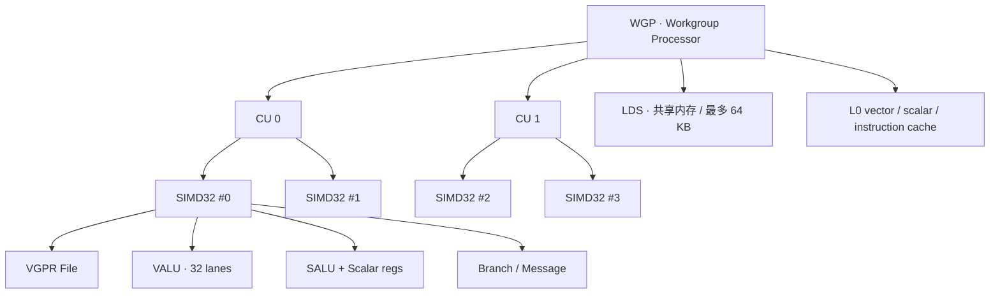
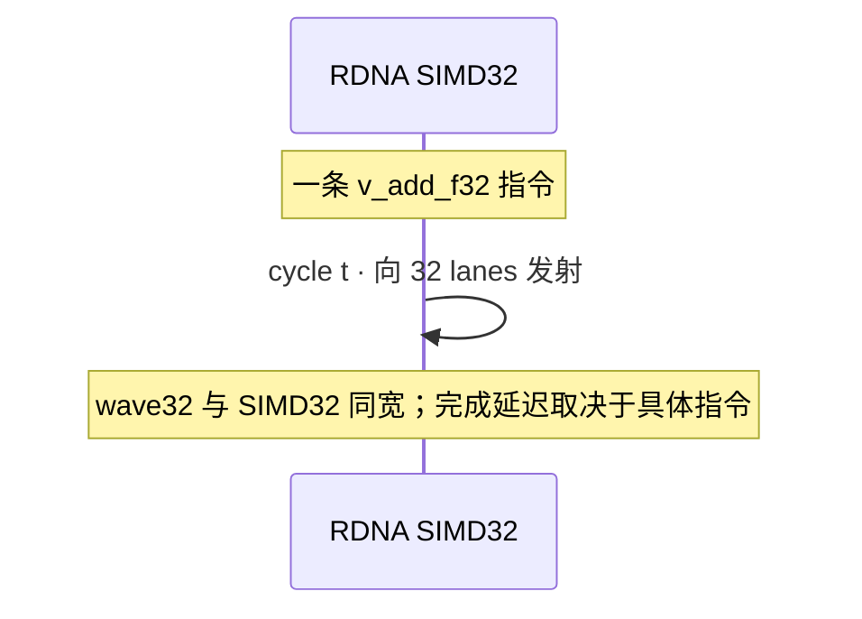
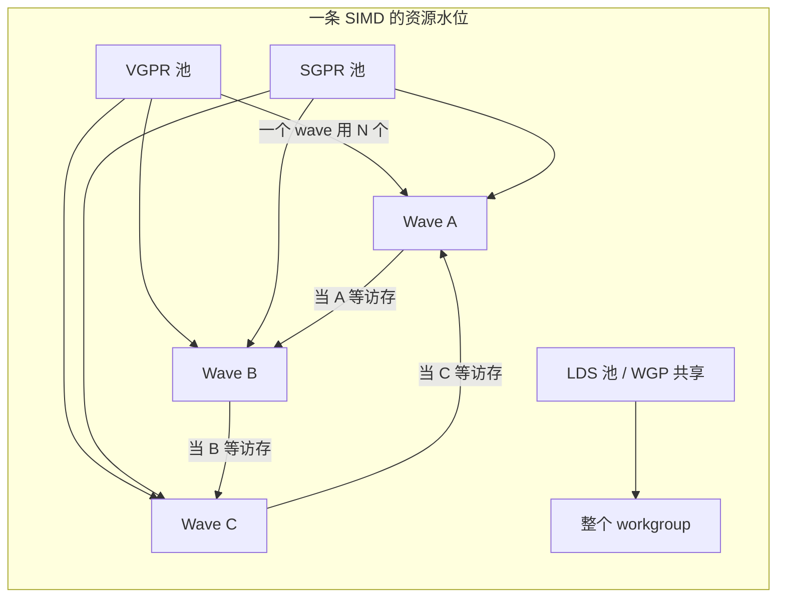
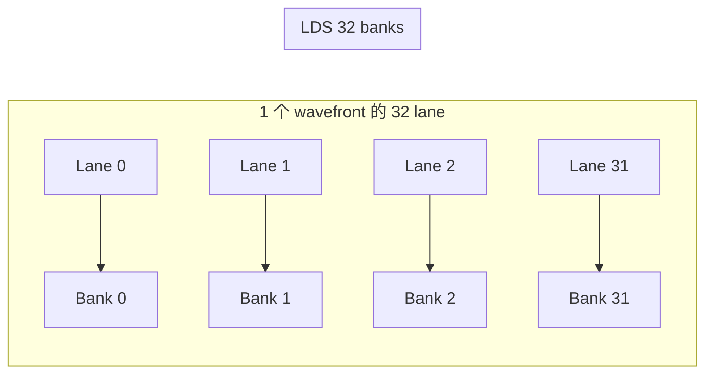
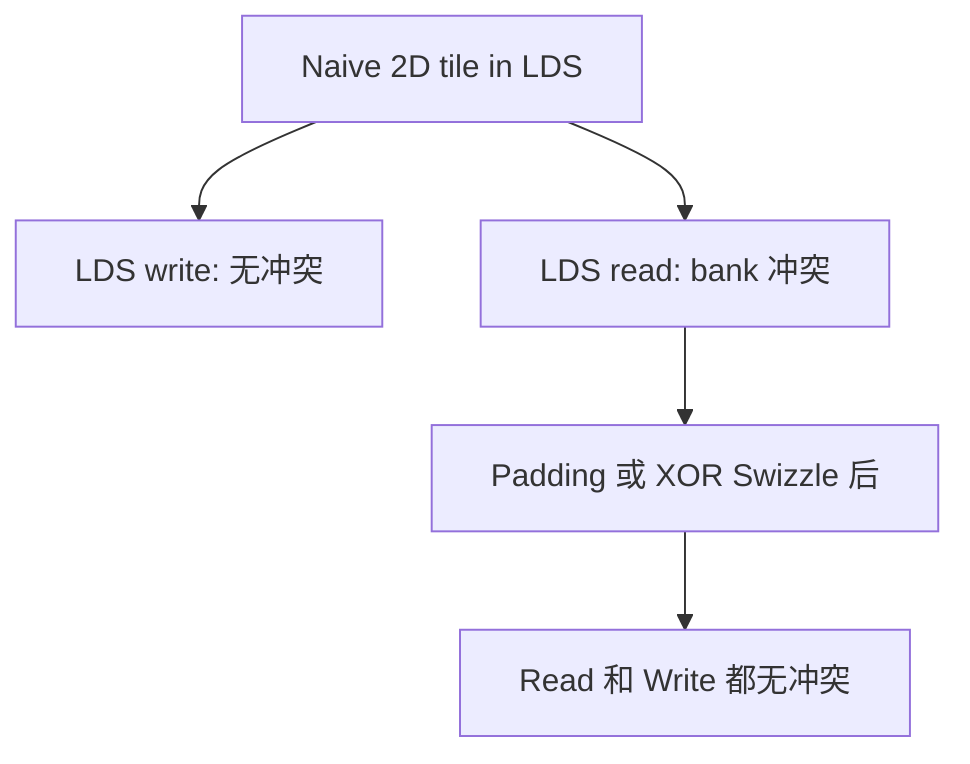
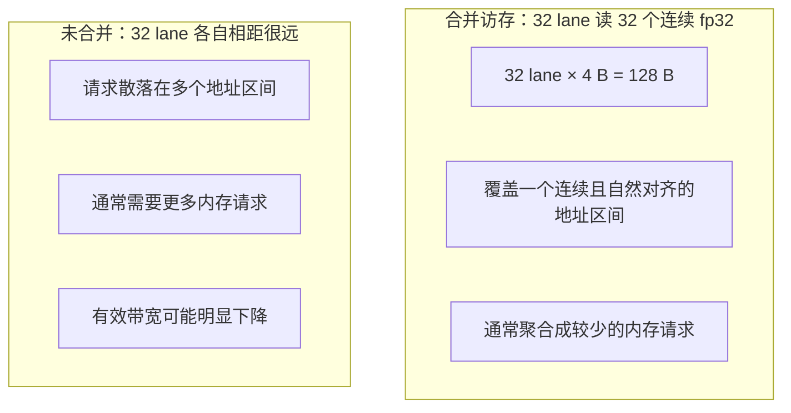
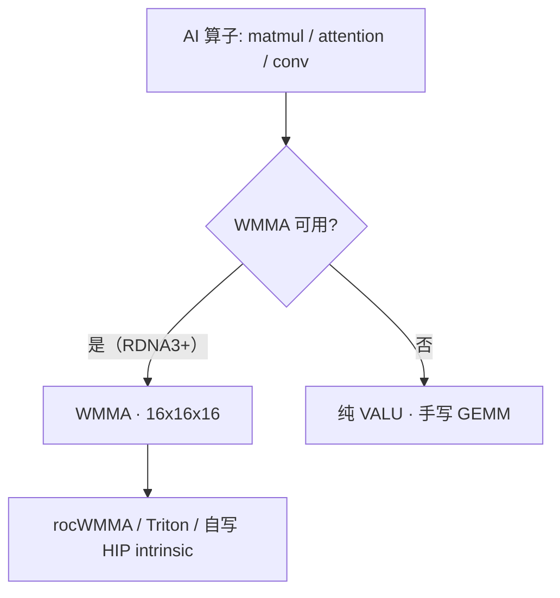

# 第2章 GPU 体系结构速通

## 本章导读

> 本章建立后续优化会反复用到的 GPU 硬件最小模型，但只讲 9070XT（RDNA4）用得到的部分。读完后，你应该能用自己的话讲清楚一个 kernel 从 launch 到执行经过哪些硬件单元，并知道 LDS、寄存器、wavefront 为什么是优化的核心资源。

[第 1 章](../chapter1/index.md) 我们跑通了环境，确认了 ROCm 能看到 GPU、PyTorch 能跑、最小 HIP 程序能编译。这一章把镜头继续往下推，对准链路最底下、也是后面最常被点名的那一层：**GPU 这块芯片本身**。

接下来你会反复在 profiler 报告、HIP 编译警告、AMD 工程博客里看到这些词：CU、SIMD、Wavefront、VGPR、SGPR、LDS、WMMA。第一次读它们像在背单词，但一旦把它们组装成一张完整的硬件图，后面看 rocprof 输出、Triton autotune log 时，你会突然发现指标和指标之间的因果关系自己浮出来了。

> **阅读方式提示**：本章是硬件概念章节，不要求你执行命令，也不要求你现在能写 HIP kernel。第一次阅读只需要建立一条主线——一个 kernel launch 后，会被拆成 workgroup / wavefront，最终落到 SIMD lane 上执行；VGPR、SGPR、LDS 会限制同时能跑多少 wave。其它术语第一次看不进去都没关系，下面这张表给你"现在掌握到什么程度"的尺子。

| 类型 | 术语 | 现在掌握到什么程度 |
| ---- | ---- | ---- |
| 本章必须懂 | CU、SIMD、Wavefront、VGPR、SGPR、LDS | 能说出它们在 GPU 执行路径中的位置和作用 |
| 先知道名字 | WMMA、Roofline、occupancy | 知道它们和性能分析有关，后面会实测 |
| 后续再深入 | EXEC mask、bank conflict、intrinsic、BLOCK_M/N/K | 现在不用掌握细节，实验章节会展开 |

## 2.1 GPU 为什么能并行

如果你刚从 CPU 思维切到 GPU 思维，可以先用一张图建立直觉：CPU 像少数几个擅长复杂判断的工人，GPU 像一大群动作统一的工人，适合把同一种计算同时铺到大量数据上。

::: figure fig-cpu-vs-gpu-workers


CPU 更适合复杂控制，GPU 更适合大规模同构并行计算
:::

CPU 的设计目标是**低延迟**——少量核心，每个核心都有大量缓存、分支预测、乱序执行，擅长处理复杂的控制逻辑。GPU 的设计目标是**高吞吐**——大量核心（在 AMD 上叫 CU），每个核心能同时处理成百上千个线程，擅长把同一种计算铺到大量数据上。

这就是为什么 GPU 适合做矩阵乘、卷积、attention 这类「同样的计算在大量数据上重复」的任务。本书后面写的每一个算子，本质上都是在回答一个问题：**怎么把计算高效地铺到这成千上万个线程上**。

## 2.2 Compute Unit（CU）的内部结构

这一节剖开"GPU 的最小车间"——Compute Unit（计算单元，简称 CU），看清楚 kernel 真正落到哪些执行单元上。

把整块 GPU 想象成一座大型工厂。从上往下看：芯片 → Shader Engine（着色引擎，分区）→ 一组 Workgroup Processor（WGP，工作组处理器）/ 一组 CU → 每个 CU 里若干 SIMD（单指令多数据执行管线）→ 每个 SIMD 里若干 lane（向量通道）。一个 kernel launch 出去，最终落到这些 lane 上完成乘加和访存。

写 HIP kernel 时看到的 thread / block / shared memory 这些概念，并不是凭空的抽象——它们都对应着上面这条硬件路径上的某一格。先把对照关系记下来，后面读代码就不会"硬件词"和"编程词"两套打架：

| 写代码时看到 | 硬件上大致对应 | 现在怎么理解 |
| ---- | ---- | ---- |
| thread / work-item | 一个 lane 上的一份执行 | 一个数据位置上的工作 |
| warp / wavefront | 一组同步执行的 work-item | AMD 上叫 wavefront；RDNA 默认 32 |
| block / workgroup | 一组 wave（同一 WGP 或同一 CU 上） | 块内 wave 之间可以共享 LDS |
| shared memory | LDS | block 内共享的高速 scratchpad |
| register | VGPR / SGPR | 每个线程或每个 wave 的临时变量空间 |

RDNA 体系下 CU 不是孤立的，而是两两组成一个 WGP；workgroup 内部的 wave（也叫 wavefront，波前）会被发射到同一个 WGP 的四条 SIMD32 上，并且可以共享 LDS。这是 RDNA 1 引入、RDNA 2/3/4 一路保留的核心组织方式。

如 @fig-wgp-simd-layout 所示，可以把 RDNA 一个 WGP 内部画成下面的层级：

::: figure fig-wgp-simd-layout


RDNA 体系下 WGP / CU / SIMD 的层级
:::

如果觉得 Mermaid 层级图还是太抽象，可以对照 @fig-gpu-factory 的工厂类比看：GPU 不是"一大堆散乱线程"，而是按 CU / Workgroup / Wavefront / Lane 一层层组织起来的并行工厂。

::: figure fig-gpu-factory


GPU 工厂里 CU、Workgroup、Wavefront、Lane 之间的层级关系
:::

要看懂这张图，记住几个关键单元就够了：

- **VALU（Vector ALU，向量算术逻辑单元）**：每条 SIMD 一组，宽度 32 lane（RDNA）。kernel 里"每个线程做一次乘加"最终就落在它身上。
- **SALU（Scalar ALU，标量算术单元）**：每个 wavefront 共享一组标量执行单元和 SGPR（标量寄存器堆）。控制流（if / loop / 分支）、地址常量、wave 级广播信息都走这里。
- **Branch / Message Unit**：处理跳转、栈、s_waitcnt（等待访存完成）、跨 wave 通信等控制信号。
- **VGPR File（Vector 寄存器堆）**：每个 lane 私有一组 32 位寄存器，是 GPU 上"一线"的存储——SIMD 真正吃饭用的本子。
- **LDS（Local Data Share，本地共享内存）**：CU 或 WGP 内部一块软件可控的高速 scratchpad，多数 RDNA 上一个 workgroup 最多可见 64 KB，wavefront 之间通过它做 block 内归约和 tile 复用。
- **L0 vector / scalar / instruction cache**：靠近执行单元的片上缓存；容量口径见 2.6 节的官方规格表。

把这些单元摆在一起，CU 的"分工"就很清楚了：SALU 决定**走哪条路**，VALU 决定**算什么**，LDS / 缓存决定**数据从哪里来**，VGPR/SGPR 决定**多少东西能同时在飞**。后面三节会逐一展开后两件事。

## 2.3 Wavefront 与 SIMT 执行

这一节讲 GPU 是怎么"一群线程一起走"的——wavefront 的概念，以及它对分支、访存的影响。

先记一个数字：**RDNA 上一个 wave 通常是 32 个 work-item（也叫 wave32）**，但也支持 wave64 模式。为什么是 32？因为它对应硬件 SIMD 的宽度——RDNA 的 SIMD 是 SIMD32，一次指令发射可以覆盖一个 wave32。这里说的是发射宽度，不表示任意向量指令都能在一个周期内完成。

::: figure fig-wave-issue-timing


同一条向量指令在 RDNA SIMD32（wave32）上的执行节奏
:::

无论 wave 多宽，**同一个 wave 内部的所有 lane 永远共享同一个程序计数器（PC）**——这就是 SIMT（Single Instruction Multiple Threads，单指令多线程）执行模型。它带来一个直接后果：**分支发散（branch divergence）会让某些 lane 被强制空转**。

考虑这样一段代码：

```cpp
// 简化的 HIP kernel 片段
if (threadIdx.x < 16) {
    // 走 A 路
    compute_a(data);
} else {
    // 走 B 路
    compute_b(data);
}
```

在 wave32 模式下，前 16 个 lane 走 A、后 16 个 lane 走 B。硬件做不到"两路同时跑"——它会先用 EXEC mask（execution mask，执行掩码）把后 16 个 lane 屏蔽掉跑完 A，再把前 16 个屏蔽掉跑完 B。实际花费的时间是两条路径之和，而不是更长那条。如果一个 wave 内部有 N 个互不相同的分支去向，最坏情况就是 N 倍代价——所以"让同一个 wave 里的 lane 走相同分支"是 GPU 算子的基本功。

> **如果你还没写过 HIP kernel，可以这样理解**：同一组一起出发的 32 个线程最好走同一条路；如果一半走 A、一半走 B，硬件会先把走 B 那一半"暂停"跑完 A，再反过来跑完 B。被暂停的 lane 不是"另一个 CPU 核去做别的事"，而是真的空着等。EXEC mask 是硬件自己维护的开关，**不需要你在代码里手动控制**，你能做的只是别写出让一个 wave 切两半的 if。

::: figure fig-wavefront-divergence


同一个 Wavefront 内部分支越整齐，lane 利用率越高
:::

> 经验法则：写 kernel 时，**让分支沿着 wave 边界（32 的整数倍）切**，不要让一个 if 把同一个 wave 切两半。

另一个相关概念是 **occupancy（占用率）**：一个 SIMD 上同时驻留多少个 wave。RDNA 上一个 SIMD 最多可以驻留多个 wave，让它们轮流"挡延迟"——访存的 wave 先去等数据，计算的 wave 抢上 VALU 干活。但驻留 wave 数受 VGPR、SGPR、LDS 的约束（详见下一节）。这就是为什么我们说 occupancy、VGPR 用量、LDS 用量是绑在一起的三件事。

> **现在不需要手算 occupancy**。你只需要知道：occupancy 反映 GPU 同时塞进多少 wave 来隐藏访存等待；高不一定就好，关键是有没有被 VGPR / LDS 这些资源卡住。后面 [Profiling 篇](../../part1-profiling/chapter5/index.md) 会结合 `rocprofv3` 的资源占用数据，判断这些资源是否可能成为限制因素。

## 2.4 VGPR、SGPR 与 LDS 资源

这一节讲清楚为什么 VGPR / SGPR / LDS 是 kernel 优化绕不开的"片上资源池"。

GPU 不像 CPU 那样靠"几级 cache + 重命名 + 大量乱序"来藏延迟。它靠的是**同一时刻让足够多的 wave 在飞**：当一个 wave 卡在访存上时，调度器立即切到另一个 wave 上跑 VALU。能"在飞"的 wave 数量越多，访存延迟越容易被掩盖。但 wave 不是免费的——每个 wave 都要占一份寄存器和共享内存。

把这块片上资源想象成一个**有上限的资源池**。每个 wave 在池子里"租"几样东西：

| 资源 | 谁在用 | 单位 | 多了的副作用 |
| ---- | ---- | ---- | ---- |
| VGPR（向量寄存器） | 每个 lane 私有 | 32-bit 寄存器 | 单 wave 越大 → 同 SIMD 上能驻留的 wave 越少 |
| SGPR（标量寄存器） | 整个 wave 共享 | 32-bit 寄存器 | 控制流、地址、常量太多会撑爆 SGPR 上限 |
| LDS（共享内存 / 工作台） | 整个 workgroup 共享 | KB | 单 workgroup 越大 → 同 WGP 上能驻留的 workgroup 越少 |

如 @fig-vgpr-sgpr-lds-pool 所示，可以把"占用率约束"画成一组并列的水位线：

::: figure fig-vgpr-sgpr-lds-pool


VGPR/SGPR/LDS 任何一项打满，都会限制可同时驻留的 wave 数量
:::

三个资源池中**任何一个**先打满，就决定了 occupancy 的上限。做 profiling 时，需要把 VGPR、SGPR、LDS 的资源占用放在一起看，判断哪个池子会最先耗尽。

LDS 还有第二个性质：它不是一块纯线性内存，而是**分 bank** 的（多数 AMD GPU 上 32 个 32-bit bank）。同一周期里，如果同一个 wave 内不同 lane 访问到同一个 bank 的不同地址，就会发生 **bank conflict（bank 冲突）**——硬件会串行化访问。LDS 用得好不好的标准之一就是有没有让 bank conflict 控制住。

对 kernel 写手来说，这一节的实操含义是：

- 看到编译器报 VGPR > 某阈值就别忽略——同 SIMD 上能驻留的 wave 少了；
- block size（每个 workgroup 多少线程）和 LDS 用量是两个互相约束的旋钮，不能只看一个；
- 用 LDS 复用 tile 是手段，不是目的——如果一个 kernel 已经是 compute-bound，再多塞一份 LDS 反而会挤占其他 workgroup 的位置。

> **一个最小例子**：假设你写的 kernel 里每个线程有很多临时变量（中间结果、循环展开后的临时值、不必要的寄存器变量），编译器为了把它们都放下，每个线程要占的 VGPR 数就上去了。VGPR 总量是固定的，每个 wave 占的越多，同一个 SIMD 上能同时塞下的 wave 就越少。wave 少了，原来"A 在等访存时 B 顶上"的腾挪空间也就小了——结果就是访存延迟没人挡，VALU 闲在那里等数据。所以"减少不必要的临时变量、控制循环展开次数"在 GPU 上不仅是代码风格问题，而是直接影响 occupancy。

## 2.5 显存层次：寄存器 → LDS → L0/L2/Infinity Cache → GDDR6

这一节把"数据从哪里来"完整拆开——从寄存器一直走到显存，让你看清一次访存到底走了几跳、哪一跳代价最高。

9070XT（RDNA4）的显存层次和数据中心 GPU（用 HBM）有很大不同。记住一个核心事实：**9070XT 用的是 16GB GDDR6，不是 HBM**。这意味着它的带宽上限远低于数据中心卡——后面算 Roofline 时，这条"带宽斜线"的位置会明显不同。

| 层级 | 位置 | 容量量级 | 带宽 | 延迟 |
| ---- | ---- | ---- | ---- | ---- |
| 寄存器（VGPR/SGPR）| 每个 lane/wave 私有 | 每个 wave 几 KB | 最高 | 最低 |
| LDS | CU/WGP 内部 | 每 workgroup 最多 64 KB | 很高 | 很低 |
| L0 cache | 靠近执行单元 | vector 32 KiB；scalar 16 KiB；instruction 32 KiB | 高 | 低 |
| L2 cache | 全局共享 | 8 MiB | 中 | 中 |
| Infinity Cache | 片上末级缓存 | 64 MiB | 中 | 中到高 |
| GDDR6 显存 | 板载 | 16 GB | **~510 GB/s**（实测，标称 ~760）| 高 |

> 上表 GDDR6 带宽用大数组 copy micro-benchmark 实测（footprint ≥1 GiB，纯 GDDR6 平台，排除 L2 命中）。标称 ~760 GB/s 是理论峰值；实测 ~510 GB/s 是 copy kernel 能达到的稳态有效带宽，受内存事务效率、L2、内存控制器影响——后续所有 Roofline 计算以实测值为准。脚本见 `code/part0-intro/chapter2/micro_bench.py`，原始输出见本章末尾。

几个对优化最关键的点：

- **离 lane 越近通常越快**：寄存器、LDS、L0、L2/Infinity Cache、GDDR6 构成逐级远离执行单元的数据路径。优化的核心思路之一就是增加片上复用，并让全局访问连续、对齐。
- **GDDR6 不是 HBM**：9070XT 的显存带宽实测约 **510 GB/s**（标称 ~760 GB/s），远低于 HBM 设备（动辄几 TB/s）。这意味着对 9070XT 来说，**memory-bound 算子的优化空间更大也更关键**——很多算子会卡在带宽上。
- **合并访存（Coalescing）**：连续的线程访问连续的地址时，硬件可以把多次访问合并成较少的内存事务。第 5 章会用两个 vector add 配置练习 profiling，同时也会检查对照实验是否还改变了线程工作划分。

## 2.6 L0 / L2 / Infinity Cache：片上缓存怎么工作

上一节的显存层次表里，L0、L2 和 Infinity Cache 只占了几行。但对算子优化来说，它们会影响一个 wavefront 的请求有多少能在片上命中，以及最终有多少流量到达 GDDR6。

### 几个尺寸先记住

ROCm 的 RX 9070 XT 规格表给出以下容量。这里照录公开字段，不把其他 RDNA 代际的 Graphics L1 或 cacheline 模型直接套到 RDNA4：

| 官方规格字段 | 容量 | 本章如何理解 |
| ---- | ----: | ---- |
| L0 Vector Cache | 32 KiB | 服务向量访存的近端缓存 |
| L0 Scalar Cache | 16 KiB | 服务 wave 共享的标量读取 |
| L0 Instruction Cache | 32 KiB | 缓存指令 |
| L2 Cache | 8 MiB | 全 GPU 共享的缓存层 |
| Infinity Cache | 64 MiB | 位于 L2 与 GDDR6 之间的大容量末级缓存 |

> 同一张 ROCm 规格表把 RX 9070 XT 的 `Graphics L1 Cache` 标为 `N/A`。这不表示芯片没有任何图形或纹理缓存，而是提醒我们不要在计算教程里凭其他代际资料虚构一层 `128-256 KB Vector L1`。RDNA4 的精确 cacheline 大小和聚合粒度应以目标 ISA 文档与微基准为准，不要直接挪用 GCN 的 64 字节模型。

### 片上 cache 给算子的三个关键含义

| 关注点 | cache 怎么影响 | 算子例子 |
| ---- | ---- | ---- |
| 复用粒度 | 同一个 cacheline 被多少 lane / wave 重读 | GEMM tile、卷积 stencil |
| 命中策略 | 流式访问 vs 时间局部性 | 大向量逐元素 op 复用少；GEMM tile 可以增加片上复用 |
| 可见性与顺序 | cache 命中不等于线程同步 | reduction、原子 op、跨 block 协作 |

举个具体场景。一个 vector add 把两个数组逐元素加起来：每个元素只读一次、写一次，几乎没有算法层面的复用。大工作集下它通常受内存路径限制，但具体流量落在 L0、L2、Infinity Cache 还是 GDDR6，不能只凭一次时间反推，需要结合 footprint 扫描、trace 或可用的硬件计数器。

换个场景，一个 GEMM 把 K 维度切 tile 加载到 LDS：每个 A、B 元素被 tile 内的多个线程重复用，LDS 和 cache 都可能减少更低层级的重复流量。它最终是否 compute-bound，仍要由同口径的性能测量判断。理解 cache 是为了先形成“哪里可能发生复用、哪里只是流式经过”的假设，再用实验验证。

> **写一致性的坑**：不要把 cacheline 上的请求合并理解成线程同步。多个线程用普通 store 并发写同一地址属于数据竞争，最终值不能依赖；需要合并更新时应使用原子操作，或先在 wave/block 内归约，再由唯一线程写回。多个 lane 读取同一地址时可能走广播路径，但这不能类推到并发写。

## 2.7 LDS 详解与 bank 冲突

LDS（Local Data Share，CUDA 里叫 shared memory）是 GPU 上**最容易把性能写飞的一块片上 SRAM**。一个 GEMM、一个 Softmax、一个 reduction，几乎都要靠 LDS 来藏访存延迟、做线程间通信。但 LDS 不是"普通的 SRAM"——它有 bank 结构，stride 选错可以让吞吐直接腰斩。

### LDS 的 bank 结构

- LDS 被划分为 **32 个 bank**，每个 bank 宽 4 字节（1 dword）；
- 地址到 bank 的映射是 `bank = (byte_address / 4) mod 32`；
- 当同一个 wave 在同一个 phase 内有多个 lane 访问**不同地址但落在同一个 bank** 时，发生 bank conflict，硬件被迫串行化。

::: figure fig-lds-banks


LDS 的 32 个 bank：wave32 下 32 个 lane 恰好各落一个 bank，连续 dword 访问无冲突
:::

如 @fig-lds-banks 所示，9070XT 默认 wave32，32 个 lane 各访问连续 dword 时正好各落一个 bank——这是最理想的访问模式。

### 三种最常见的 bank 模式

| 访问模式 | 例子 | 是否冲突 |
| ---- | ---- | ---- |
| 连续 dword | `lds[tid]` | 通常无冲突（32 lane 各落一个 bank）|
| 同一地址广播 | `lds[0]` 被全 wave 读 | 硬件 broadcast，不视为冲突 |
| Stride 是 32 的倍数 | `lds[tid * 32]` | **N-way 冲突最严重**，所有 lane 全打到同一个 bank |
| Stride 是 33（1 + 32）| 经典的 padding 写法 | 有效避免 stride=32 这一类冲突 |
| 2D tile 行主写 + 列主读 | GEMM 的 LDS 缓冲 | naive 实现读侧常见冲突，需要 swizzle/padding 修复 |

### 一个直观的踩坑例子：GEMM 的 LDS tile

写过 HIP GEMM 的人都见过这一幕：把 A 的 tile 行主存进 LDS，再让另一组线程列主地读出来——**写侧没冲突，读侧出现 bank 冲突**：

::: figure fig-gemm-bank-conflict


经典的 GEMM tile bank 冲突：写没问题，读冲突；Padding 或 Swizzle 后两边都不冲突
:::

修复手段一般有两类：

- **Padding（加一列）**：让每行多一个 dword（如 `As[BLOCK_K + 1]`），破坏 stride 32 的对齐；最简单，代价是浪费一点 LDS 容量；
- **XOR Swizzle**：对地址做 XOR 变换，让物理 bank 编号被打散；这是 Composable Kernel / rocWMMA 在生产代码里更常用的方案。

[第 10 章 GEMM](../../part2-kernels/chapter10/index.md) 会先用真实 kernel 验证 LDS 分块与寄存器复用；padding 是否有效仍要作为独立变量另做对照，不能从 tile 形状直接下结论。

> **怎么发现自己撞了 bank 冲突**：不要靠猜。先确认当前硬件是否提供可用的 LDS 相关计数器，再构造只改变 LDS 访问方式的对照实验。第 5 章会先练习怎样检查一个对照是否同时改了多个变量；[第 10 章 GEMM](../../part2-kernels/chapter10/index.md) 则先验证能由源码、时间和 kernel trace 共同支撑的分块复用。

## 2.8 全局内存合并访存（Coalescing）

合并访存是初学者最早接触的概念之一。它讲的是同一个 wave 内的 lane 怎样聚合自己的内存请求；连续且自然对齐的地址通常需要更少的请求，分散地址通常需要更多请求。

### 合并规则与事务条数

事务数取决于访问宽度、对齐、目标缓存层级和具体架构。经典 GCN 的 64 字节模型不能直接当作 RDNA4 的精确规则；公开资料不足以支持下面为 RDNA4 固定写出“2 条”或“32 条”事务。因此这里保留定性模型：比较同一 wave 的请求是覆盖连续地址区间，还是散落在许多地址区间。

::: figure fig-coalesce-txns


合并访存与非合并访存：差距来自硬件发出的事务条数
:::

如 @fig-coalesce-txns 所示，“连续线程访问连续地址”的价值在于让硬件更容易用较少的请求覆盖整个 wave 的地址集合。精确事务数应由目标架构文档、反汇编和受控微基准确认。

### 几种典型访存模式的代价对比

| 模式 | 例子 | 定性结果 | 备注 |
| ---- | ---- | ---- | ---- |
| 连续读 | `out[tid] = in[tid]` | 请求集中、通常易于合并 | 仍受对齐和访问宽度影响 |
| 跨步 2 读 | `out[tid] = in[tid * 2]` | 覆盖范围扩大，通常需要更多请求 | 性能下降幅度需实测 |
| 跨步 16 读 | `out[tid] = in[tid * 16]` | 地址高度分散，合并机会较少 | 还可能改变 cache 命中 |
| 同地址广播 | 所有 lane 读 `in[0]` | 可使用读取广播路径 | 延迟仍取决于命中的缓存层级 |
| 写多 lane → 同地址 | 普通 store | 数据竞争，结果不能依赖 | 合并更新应使用 atomic 或归约 |
| 2D 行主图像列读 | `img[col * H + row]` | 行主布局下地址分散 | 比较改 layout、分块转置或融合方案 |

### 给算子写法的三条直觉

1. **先想"哪个变量随 lane 索引变化"**，让它做内层 stride 1 的访问；
2. **向量化 load 需要同时验证对齐和生成指令**：若 4 次标量 dword load 能合成一次 dwordx4，源级 load 指令数最多从 4 降到 1；实际收益仍取决于瓶颈、对齐、寄存器压力和编译结果；
3. **transpose / strided slice 是否拆分要算总成本**：独立 kernel 便于复用和调试，但会增加 launch 与中间读写；融合分块有时反而更省流量，应按目标 shape 实测。

[第 3 章](../chapter3/index.md) 的 vector add 是连续线程读连续地址的典型；[第 5 章](../../part1-profiling/chapter5/index.md) 会用两个配置练习 profiler，并检查对照实验是否足够公平；[第 8 章 Reduction](../../part2-kernels/chapter8/index.md) 和 [第 10 章 GEMM](../../part2-kernels/chapter10/index.md) 会继续应用这些检查方法。

## 2.9 WMMA：RDNA4 的矩阵加速单元

这一节把"AI 算子怎么落到硬件矩阵单元上"讲清楚——它是 GEMM、Attention 这类算子能跑得多快的核心来源。

**WMMA（Wave Matrix Multiply Accumulate，波矩阵乘累加）** 是 RDNA 3 引入、RDNA 4 进一步增强的矩阵指令族。它的核心想法是：**用一条 wave 协作完成一个小 matmul tile** `D = A·B + C`，而不是让 VALU 一条一条加。

WMMA 是 wave 级指令——一条指令需要整个 wave 的所有 lane 配合完成。它把 A、B、C 三个 tile 的元素**分散到 wave 内每个 lane 的 VGPR 上**，硬件再用矩阵单元做一次乘累加。

GPUOpen 官方博客 "How to accelerate AI applications on RDNA 3 using WMMA" 给出的关键事实：

- **支持 wave32 与 wave64 两种模式**，编译器选哪种由 build target 决定；
- RDNA 3 / 3.5 上**只支持 16×16×16 一种 tile 形状**，RDNA 4 有所增强；
- 输入 A/B 类型可以是 FP16、BF16、INT8、INT4；累加器 C/D 类型可以是 FP16、FP32、BF16、INT32；
- 编译器内置函数形如（**只是指令入口形态，本章不要求复制运行**）：

```cpp
// RDNA4/gfx12：16x16x16 fp16 → fp32，wave32
float8 d =
    __builtin_amdgcn_wmma_f32_16x16x16_f16_w32_gfx12(a_frag, b_frag, c_frag);
```

> **听说过 NVIDIA Tensor Core 的话**：WMMA 在角色上和 Tensor Core 一致——都是"一条指令完成一个小 matmul tile"的专用矩阵单元，不是同一套指令集，但解决的是同一类问题。

回到 AI 算子层。**为什么 GEMM、Attention、Conv 都喜欢 WMMA？** 因为它把"乘加密集"这件事直接交给硬件矩阵单元，不再走 VALU 一条一条加；外加它是 wave 级指令，VGPR 之间自然形成数据复用，把"重复加载同一个 tile"的代价摊薄掉。

::: figure fig-matrix-decision-tree


在 9070XT 上选择矩阵单元路径的简化决策
:::

实操含义：

- 在 9070XT（RDNA4）上写低精度矩阵相关 kernel，应确认是否使用了预期的 WMMA 路径：可以使用 rocWMMA，也可以在明确 target 与 fragment 布局后使用 `__builtin_amdgcn_wmma_*`。第 10 章先实现可读的 FP32 naive/LDS/Triton 基线，并把 WMMA 留作后续单独实验，不声称已经完成 WMMA 对照。
- WMMA 的 tile 形状决定了 BLOCK_M / BLOCK_N / BLOCK_K 的最佳取值。第 2 篇的 Triton 章节会把这点反复用到。

## 2.10 Roofline 的硬件来源

最后一节把硬件参数翻译成 **Roofline 模型** 上的两条线，这样后面我们打开 profiler 时，就能很快判断"还有多少空间"。

Roofline 的核心想法非常朴素：**任何 kernel 的实际性能都被两件事卡住——算力上限和带宽上限**。把它们画在同一张坐标系里：

- 横轴：**arithmetic intensity（算术强度）**，单位 FLOP/Byte，意思是"每搬运 1 字节数据，能做多少次浮点运算"；
- 纵轴：**实际性能**，单位 FLOP/s（或 TFLOPS）；
- 两条线：
  - **水平线**：硬件的峰值算力 P_peak（给定精度下的 TFLOPS）；
  - **斜线**：硬件的峰值带宽 B_peak 乘以算术强度。

::: figure fig-roofline


Roofline 的两条线：左半边由带宽决定，右半边由算力决定
:::

两条线的硬件来源很具体：

- **理论峰值算力 P_theoretical** 来自“每 CU / 每周期能做多少 FLOP × CU 数 × 时钟”。本章脚本实际得到的是当前 PyTorch/rocBLAS、shape 和设备状态下的 **库实测参考值 P_measured_library**：`torch.matmul(4096×4096)` 的 fp16 约 79.9 TFLOPS、fp32 约 10.6 TFLOPS。仅凭这个时间不能证明具体生成了哪条矩阵指令。
- **带宽参考值**可以来自规格推导，也可以来自独立 copy micro-benchmark。后者是当前软件实现达到的 `B_measured_copy`，不等于理论物理峰值。第 2～6 章现有带宽规格、MiB/GB 单位和衍生图片仍需在重新采集数据后统一修订，详见对应跟踪 issue。

> `code/part0-intro/chapter2/micro_bench.py` 提供的是 measured reference，不是硬件理论规格。使用这些值画经验 Roofline 时，应在图例中写清软件栈、shape 和测量方法。

把这两条线画到同一张图上，每个 kernel 都会落在某一个点上。先用最简单的 Vector Add `c[i] = a[i] + b[i]` 走一遍"算术强度怎么从代码里算出来"：

```text
对每个 float32 元素：
  读 a[i]：4 Byte
  读 b[i]：4 Byte
  写 c[i]：4 Byte
  做 1 次加法：1 FLOP

算术强度 = FLOP / Byte = 1 / 12 ≈ 0.083 FLOP/Byte
```

关键不是死记这个数字，而是理解：**Vector Add 的算术强度天然很低**——搬一堆数据只做一次加法，所以它必然落在 Roofline 的斜线那一侧，属于 memory-bound。

| 算子典型 | 算术强度量级 | 落在哪一边 |
| ---- | ---- | ---- |
| Vector add（按元素加） | 很低（约 0.083–0.25 FLOP/Byte，取决于读写口径） | memory-bound |
| Reduction / Softmax 单趟 | < 1 FLOP/Byte | memory-bound |
| Conv / GEMM（小 batch） | 数 FLOP/Byte | 取决于 tile 是否有效复用 |
| GEMM（大 M/N/K，有 tile + 矩阵单元） | 数十至数百 FLOP/Byte | compute-bound |
| Attention（Flash 风格融合） | 取决于 head_dim 与序列长度 | 中间区，常被融合策略左右 |

读到这里，三件事应该串起来了：

1. **"算子是 memory-bound 还是 compute-bound" = "落在斜线上还是水平线上"**；
2. **优化 memory-bound 算子，是减少实际流量或提高可用带宽**：融合和复用可能减少字节数、提高算术强度；改善合并访问也可能让同一算法强度下的工作点向上靠近带宽参考线；
3. **优化 compute-bound 算子，是让工作点向上接近既定计算参考线**。若改用不同精度或矩阵指令，计算上限本身也变了，应为新计算路径单独定义 reference roof，而不是把它描述成同一条硬件水平线被软件“抬高”。

后面 [第 3 章](../chapter3/index.md) 会用 vector add 跑通第一个程序，[第 6 章](../../part1-profiling/chapter6/index.md) 会把算子点画到真实 Roofline 上。

## 2.11 实测：9070XT 的带宽与算力

前面两节的 Roofline 数字不是拍脑袋来的，全部用 `code/part0-intro/chapter2/micro_bench.py` 在 Radeon RX 9070 XT（gfx1201）+ ROCm 7.13 + 原生 Ubuntu 24.04 上实测。完整输出如下，方便你对照复现：

<details>
<summary>输出：micro_bench.py @ AMD Radeon RX 9070 XT + ROCm 7.13</summary>

```text
============================================================
GPU: AMD Radeon RX 9070 XT
torch: 2.11.0+rocm7.13.0
============================================================

--- 显存带宽（大数组 copy，测 GDDR6 平台 B_peak）---
   footprint |    min_ms |     GB/s
--------------------------------------
       64 MiB |   0.239 ms |   534.7
      256 MiB |   0.976 ms |   524.4
      512 MiB |   1.988 ms |   515.1
     1024 MiB |   4.008 ms |   511.0
     2048 MiB |   8.032 ms |   510.0

--- 峰值算力（torch.matmul 4096x4096，测 P_peak）---
   dtype |    min_ms |     TFLOPS
--------------------------------
    fp16 |   1.721 ms |    79.9
    fp32 |  12.944 ms |    10.6
```

</details>

读这张表的几个要点：

- **带宽随 footprint 增大先升后稳**：64 MiB 时打印值为 534.7 GB/s，到 1024 MiB 后稳定在 ~510–511 GB/s。较小工作集可能受到 L0、L2、Infinity Cache、TLB 与时钟状态共同影响，不能只凭这一列时间把高值归因于 L2。
- **实测 ≈ 标称的 67%**：标称 ~760 GB/s 是理论峰值，实测 ~510 GB/s 是 copy kernel 的有效带宽。这个差距是正常的（事务开销、L2、内存控制器），后续算 Roofline 一律用实测 510 GB/s，不用标称。
- **当前库实测中 fp16 吞吐约为 fp32 的 7.5 倍**：79.9 与 10.6 TFLOPS 是两个 dtype 下的 `torch.matmul` 观测值。它们说明精度与底层执行路径会显著影响吞吐，但不能单凭时间断言 fp16 一定使用了哪条 WMMA 指令、fp32 一定只走哪类 SIMD FMA；需要再看 trace、反汇编或库文档。
- **拐点算术强度 ≈ P_peak / B_peak**：fp16 下拐点约 79.9/0.510 ≈ 157 FLOP/Byte，fp32 下约 10.6/0.510 ≈ 21 FLOP/Byte。一个算子的算术强度超过这个拐点才算 compute-bound，否则就是 memory-bound——Vector Add（0.083）远在拐点左侧。

## 本章小结

- **CU 内部不是黑盒**：SIMD（VALU + SALU）、寄存器堆、LDS、L0 缓存各司其职；RDNA 还在 CU 之上多了一层 WGP，WGP 内 4 条 SIMD32 共享 LDS。
- **wave 是 GPU 的最小调度单位**：RDNA 默认 wave32；同一个 wave 内分支发散会让 lane 串行化执行。
- **VGPR / SGPR / LDS 是同一个 occupancy 池子的三个水位**：任何一个先满，都会限制可同时驻留的 wave 数，从而限制延迟隐藏能力。
- **9070XT 用 16GB GDDR6（非 HBM）**，实测有效带宽约 510 GB/s（标称 ~760）；离 lane 越近的存储越快，优化的核心是让数据待在离 lane 近的地方。
- **WMMA 是 RDNA3+ 的矩阵加速单元**，一条 wave 协作完成一个 16×16×16 的 matmul tile；GEMM/Attention 优化的核心是利用好它。
- **Roofline 上的两条线直接来自硬件参数**：水平线是峰值算力（受是否使能 WMMA 影响），斜线是峰值带宽。

下一章 [第 3 章](../chapter3/index.md) 会用 vector add 跑通第一个真正的 GPU 程序，并把这一章建立的 Roofline 心智模型用起来。

## 自检问题

读完本章后，你应该能回答：

1. CU、SIMD、wavefront 三者是什么关系？一个 wave 是怎么落到 SIMD 上的？
2. 为什么同一个 wave 内分支走向不同会变慢？EXEC mask 是硬件做的还是你写代码控制的？
3. VGPR / SGPR / LDS 为什么会限制 occupancy？哪一个先打满，会出现什么样的现象？
4. 9070XT 的显存层次有哪几层？为什么说它和 HBM 设备的 Roofline 拐点不一样？
5. WMMA 是什么？它和"手写 GEMM 一条一条加"有什么区别？
6. Vector Add 为什么通常是 memory-bound？大 GEMM 配合 WMMA 为什么能跑到 compute-bound？

## 延伸阅读

**初学者优先看**

- [ROCm Conceptual: Device hardware glossary](https://rocm.docs.amd.com/en/latest/reference/glossary/device-hardware.html) — 本章所有硬件术语的对照字典
- [AMD Radeon RX 9070 XT 官方页面](https://www.amd.com/en/products/graphics/desktops/radeon/9000-series/amd-radeon-rx-9070xt.html) — 本书基线硬件
- [ROCm：AMD GPU specifications](https://rocm.docs.amd.com/en/latest/reference/gpu-specs.html) — wave、LDS 与各级 cache 的公开规格字段

**写 kernel 时再看：架构文档**

- [AMD RDNA Architecture White Paper（PDF）](https://www.amd.com/system/files/documents/rdna-whitepaper.pdf)
- [AMD GPU Architecture Programming Documentation Hub](https://gpuopen.com/amd-gpu-architecture-programming-documentation/)
- [LLVM AMDGPU Backend User Guide](https://llvm.org/docs/AMDGPUUsage.html)

**写矩阵相关 kernel 时再看：WMMA**

- [GPUOpen：How to accelerate AI applications on RDNA 3 using WMMA](https://gpuopen.com/learn/wmma_on_rdna3/)
- [GPUOpen：Using the Matrix Cores of AMD RDNA 4 architecture GPUs](https://gpuopen.com/learn/using_matrix_core_amd_rdna4/)
- [GPUOpen Lab Notes：AMD matrix cores](https://gpuopen.com/learn/amd-lab-notes/amd-lab-notes-matrix-cores-readme/)
- [ROCm/amd_matrix_instruction_calculator（GitHub 工具）](https://github.com/ROCm/amd_matrix_instruction_calculator)
