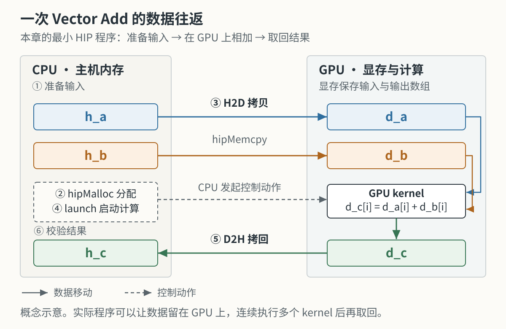
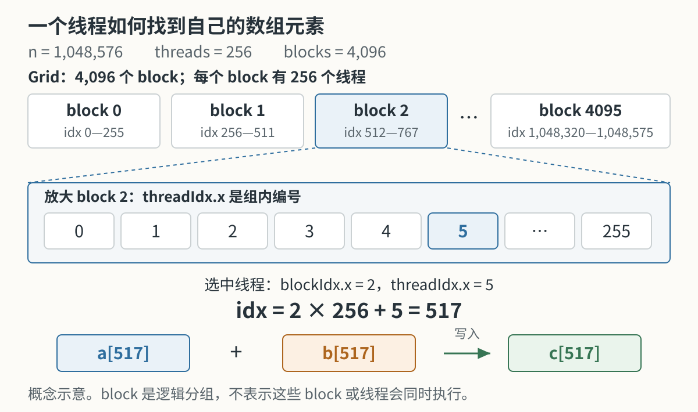
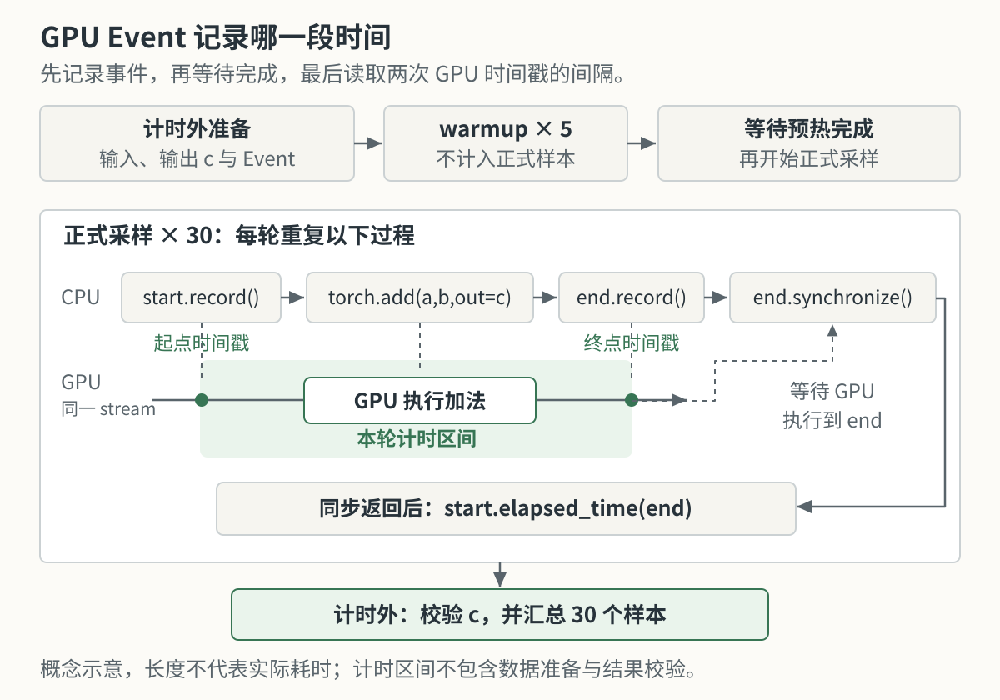

# 第4章 第一个程序 + 性能分析

## 本章导读

在第 2、3 章中，我们用数组加法认识了线程的分工和数据的去向。现在把这个例子写成一个完整程序：给定两个等长数组，让 GPU 计算对应元素的和，再把结果取回来检查。

完成计算后，我们还想知道它用了多长时间。这个问题需要先回答两件事：我们测的是哪一个实现，计时从哪里开始、到哪里结束？本章先用 HIP 看清程序的组成，再用 Python 学习测量方法，最后解释测得的时间与有效带宽。

| 文件 | 本章用它做什么 |
| --- | --- |
| `code/part0-intro/chapter4/vector_add.hip` | 手写 HIP 向量加法，编译、运行并检查结果 |
| `code/part0-intro/chapter4/benchmark_vector_add.py` | 测量 **PyTorch 实现**的向量加法，学习预热、重复和 GPU event |

两个程序完成相同的数学运算，但 Python 脚本**没有调用前面的 HIP 文件**。它们分别帮助我们理解“怎样写”和“怎样测”，不能把后者的时间当成前者的性能。

## 4.1 准备环境

本节进入已经在[第 1 章](../chapter1/index.md)验证过的环境。如果 `rocminfo`、PyTorch GPU 张量或最小 HIP 程序尚未通过验证，先完成第 1 章，再继续本章。

以下命令从仓库根目录开始，在安装 ROCm 的 **Ubuntu 实验机**执行：

```bash
cd code/part0-intro
uv sync
source ./activate-rocm.sh
cd chapter4
```

后续命令都在 `code/part0-intro/chapter4/` 中运行。`uv sync` 安装本篇锁定的依赖；激活脚本选择对应的 Python，并设置 HIP 编译器需要的路径。

本章输出于 **2026-09-11** 复跑，环境为 Radeon RX 9070 XT（gfx1201）、ROCm 7.13、原生 Ubuntu 24.04.4、PyTorch 2.11.0+rocm7.13.0；CPU 是 Intel Core i5-12600K。实验机有其他进程，因此下面的时间是一组带环境记录的观测值，复跑时不必与它逐位相同。

## 4.2 从向量加法到 HIP 程序

本节将同下标相加的规则，逐步放进一个可以编译运行的程序。

### 4.2.1 定义输入和输出

给定长度为 $N$ 的数组 $a$ 和 $b$，我们要得到同样长度的数组 $c$：

$$
c_i = a_i + b_i,\qquad i=0,1,\ldots,N-1.
$$

为了让结果容易检查，示例将 $a$ 的每个元素设为 1，$b$ 的每个元素设为 2。因此无论数组多长，$c$ 的每个元素都应该是 3。这里不需要矩阵运算或归约，只要把每个位置算对即可。

`vector_add.hip` 的 `main` 函数先准备主机端数组：

```cpp
  const int n = 1 << 20;
  const size_t bytes = n * sizeof(float);

  std::vector<float> h_a(n, 1.0f);
  std::vector<float> h_b(n, 2.0f);
  std::vector<float> h_c(n, 0.0f);
```

`1 << 20` 是 C++ 中的左移表达式，在这里等于 $2^{20}=1{,}048{,}576$。`n` 表示元素个数，`bytes` 表示**一个数组**需要多少字节。`std::vector<float>` 可以先理解为“保存浮点数的、长度可指定的数组”，`1.0f` 中的 `f` 表示 `float` 常量。

### 4.2.2 在主机和设备之间传递数据

主机（Host）指 CPU 一侧，设备（Device）指 GPU 一侧。本例使用两套存储：`h_a`、`h_b`、`h_c` 在主机内存中，`d_a`、`d_b`、`d_c` 指向 GPU 显存中的数组。变量名里的 `h_` 和 `d_` 是帮助阅读的命名约定。

先为 GPU 上的三个数组分配空间，再复制两个输入：

```cpp
  float* d_a = nullptr;
  float* d_b = nullptr;
  float* d_c = nullptr;

  HIP_CHECK(hipMalloc(&d_a, bytes));
  HIP_CHECK(hipMalloc(&d_b, bytes));
  HIP_CHECK(hipMalloc(&d_c, bytes));

  HIP_CHECK(hipMemcpy(d_a, h_a.data(), bytes, hipMemcpyHostToDevice));
  HIP_CHECK(hipMemcpy(d_b, h_b.data(), bytes, hipMemcpyHostToDevice));
```

`float*` 是一个指针，用来保存数组起始位置。`hipMalloc` 分配显存，并把得到的地址写入指针变量；`hipMemcpy` 的前三个参数依次是目标位置、来源位置和字节数。`h_a.data()` 给出主机数组的起始地址。

`HIP_CHECK` 是本文件定义的错误检查宏。先把它理解为一个检查步骤：HIP 调用失败时打印错误并退出，避免带着错误继续运行。完整定义保留在源码中。

如 @fig-vec-add-data-path 所示，拷贝、GPU 计算和结果检查发生在不同位置。`hipMalloc` 只负责分配空间，数据复制由 `hipMemcpy` 完成。

::: figure fig-vec-add-data-path


本例的数据流程：输入从主机传到设备，计算结果从设备传回主机；分配空间与复制数据是不同操作。
:::

### 4.2.3 每个线程完成一次加法

现在来看运行在 GPU 上的核函数：

```cpp
__global__ void vector_add(const float* a, const float* b, float* c, int n) {
  int idx = blockIdx.x * blockDim.x + threadIdx.x;
  if (idx < n) {
    c[idx] = a[idx] + b[idx];
  }
}
```

`__global__` 表示这个函数由主机发起调用、在 GPU 上执行。`const float* a` 和 `const float* b` 表示核函数通过这些指针读取输入，不修改输入元素；`float* c` 指向可写的输出。

第 2 章推导过全局下标。这里把同一公式写成代码：`blockIdx.x` 是块编号，`blockDim.x` 是每块线程数，`threadIdx.x` 是块内线程编号。每个线程得到自己的 `idx`，因此同一段代码会访问不同位置。

例如每块有 256 个线程时，块 2 中的线程 5 处理的位置是 $2\times256+5=517$，它执行 `c[517] = a[517] + b[517]`。@fig-block-thread-hierarchy 只展开需要观察的编号，其余线程省略。

::: figure fig-block-thread-hierarchy


块编号与块内编号共同确定数组位置；启动的全部线程不要求同时驻留或同时执行。
:::

`if (idx < n)` 则限制有效下标。如果输入长度不能被每块线程数整除，最后一块仍会启动完整数量的线程；多出的线程不应访问数组。这个判断让同一个核函数也能处理这样的尾部。

### 4.2.4 启动、等待和检查

主机端选择每块 256 个线程，并计算需要的块数：

```cpp
  const int threads = 256;
  const int blocks = (n + threads - 1) / threads;
  vector_add<<<blocks, threads>>>(d_a, d_b, d_c, n);
  HIP_CHECK(hipGetLastError());
  HIP_CHECK(hipDeviceSynchronize());

  HIP_CHECK(hipMemcpy(h_c.data(), d_c, bytes, hipMemcpyDeviceToHost));
```

整数除法会向下取整，所以分子先加 `threads - 1`，得到覆盖全部元素所需的块数。本例中 $1{,}048{,}576/256=4096$，刚好整除。`<<<blocks, threads>>>` 指定启动规模，后面的圆括号才是传给核函数的四个参数。

启动调用返回时，GPU 的计算可能还没有完成。`hipGetLastError()` 检查启动错误，`hipDeviceSynchronize()` 等待设备完成工作；之后将 `d_c` 拷回 `h_c`，主机才能用结果进行检查。程序最后用 `hipFree` 释放三块显存。

编译并运行现成的完整文件：

```bash
hipcc vector_add.hip -O2 -o vector_add
./vector_add
```

`hipcc` 把源码编译为可执行程序，`-O2` 开启编译优化，`-o vector_add` 指定输出文件名。`./vector_add` 运行当前目录里的这个文件。

本次 RX 9070 XT + ROCm 7.13 / 原生 Ubuntu 24.04.4 的输出为：

```text
device_name: AMD Radeon RX 9070 XT
vector_size: 1048576
blocks: 4096
threads_per_block: 256
max_error: 0
status: PASS
```

程序逐元素计算实际结果与 3 的误差，并报告最大的误差。对本例固定输入，`max_error: 0` 和 `status: PASS` 表示检查通过。到这里，我们验证了程序的结果，**还没有测量这个手写 HIP kernel 的运行时间**。

## 4.3 测量 PyTorch 向量加法

本节用较短的 Python 程序学习计时。我们继续计算向量加法，但改由 PyTorch 提供底层实现。使用 Python 可以先把注意力放在测量范围上；手写 HIP kernel 的详细计时与 profiling 将在下一篇展开。

### 4.3.1 固定需要测量的工作

PyTorch 的张量（tensor）是保存数值的多维数组，本章只用一维、`float32` 类型的张量。CPU 和 GPU 两条路径都预先创建输入和输出，再重复执行加法。以下是 GPU 路径的准备部分：

```python
    a = torch.ones(size, device="cuda", dtype=torch.float32)
    b = torch.full((size,), 2.0, device="cuda", dtype=torch.float32)
    c = torch.empty_like(a)
```

`ones` 将输入设为 1，`full` 将另一个输入设为 2，`empty_like` 只分配同形状的输出空间，其初始值未定义。后续每次计算都执行 `torch.add(a, b, out=c)`，把结果写到已经准备好的 `c` 中。

这里的 `device="cuda"` 并不表示使用了 NVIDIA 显卡。PyTorch 的 ROCm 版本沿用了 `torch.cuda` 接口和设备名，实际后端可通过 `torch.version.hip` 确认，详见 [PyTorch 的 HIP 说明](https://docs.pytorch.org/docs/2.11/notes/hip.html)。

我们将输入创建、输出分配和数值检查放在计时外，CPU 和 GPU 计时内都只安排加法。脚本默认将 PyTorch 的 CPU 算子线程数设为 1，并打印 CPU 型号与线程数。这样读到结果时，就知道 CPU 一栏采用了什么配置。

### 4.3.2 等待完成以后，读取时间

CPU 发出 GPU 操作后可以继续执行，因此“Python 已经执行到下一行”不等于“GPU 已经算完”。直接在提交前后读取 CPU 时钟，可能只量到提交过程的一部分。

GPU event 可以在同一条执行流中记录两个时间点：一个放在加法之前，一个放在加法之后。等结束 event 完成后，再读取它们的时间差：

```python
        start.record()
        torch.add(a, b, out=c)
        end.record()
        end.synchronize()
        times.append(start.elapsed_time(end))
```

其中 `start` 和 `end` 是启用了计时的 `torch.cuda.Event`。`record()` 将标记放入当前执行流，`end.synchronize()` 让主机等到结束标记完成，`elapsed_time` 返回两个标记之间经过的毫秒数。顺序见 @fig-benchmark-warmup-repeat-sync；同步之后做的是**读取时间差**，并非这时才开始计时。[PyTorch 的异步执行说明](https://docs.pytorch.org/docs/stable/notes/cuda.html#asynchronous-execution)给出了同样的基本原则。

::: figure fig-benchmark-warmup-repeat-sync


event 确定计时区间，同步保证区间已经结束。时间线表示执行顺序，不按实际耗时比例绘制。
:::

这个区间是设备侧的一段经过时间，不包含输入输出的主机与设备间拷贝，也不代表整个 Python 程序的耗时。对于很短的运算，提交节奏和设备状态也可能影响 event 间隔，不能仅凭一个 event 数字就断定核函数内部花了多少时间。

### 4.3.3 预热、重复和检查

正式测量前，脚本先执行 5 次加法作为预热（warmup），再重复测量 30 次。预热可以减轻首次执行和状态变化的影响，5 次是本例的配置，并不保证所有工作负载都已经稳定。

每轮得到一个时间，最后报告三种统计量：

| 输出字段 | 含义 | 本章怎样使用 |
| --- | --- | --- |
| `median_ms` | 将时间排序后的中间值 | 用作正文主要比较值 |
| `mean_ms` | 所有时间的平均值 | 与中位数一起观察波动 |
| `min_ms` | 这一组中最短的一次 | 作为补充，不视为保证无干扰的“真值” |

测量结束后，脚本检查输出的每个元素是否有限且等于 3；验证失败就报错，不打印通过状态。检查放在计时外，避免把求和或比较混入加法的时间。

运行默认规模的测试：

```bash
python benchmark_vector_add.py --size 16777216 --warmup 5 --repeat 30 --cpu-threads 1
```

这里的 `--size` 接受十进制整数。它与源码中的 `1 << 24` 对应，但命令行中不要直接写未求值的移位表达式。

<details>
<summary>完整代码：benchmark_vector_add.py</summary>

```python
import argparse
import platform
import statistics
import time
from pathlib import Path

import torch


def parse_args():
    parser = argparse.ArgumentParser(description="Benchmark torch vector add on CPU and ROCm GPU.")
    parser.add_argument("--size", type=int, default=1 << 24)
    parser.add_argument("--warmup", type=int, default=5)
    parser.add_argument("--repeat", type=int, default=30)
    parser.add_argument("--cpu-threads", type=int, default=1)
    args = parser.parse_args()
    for name in ("size", "repeat", "cpu_threads"):
        if getattr(args, name) <= 0:
            parser.error(f"--{name.replace('_', '-')} must be greater than 0")
    if args.warmup < 0:
        parser.error("--warmup must be at least 0")
    return args


def cpu_name():
    cpuinfo = Path("/proc/cpuinfo")
    if cpuinfo.exists():
        for line in cpuinfo.read_text().splitlines():
            if line.startswith("model name"):
                return line.split(":", 1)[1].strip()
    return platform.processor() or platform.machine()


def validate_output(c):
    # 验证放在计时外：每个元素都必须有限，并且等于 1 + 2 = 3。
    if not (torch.isfinite(c) & (c == 3.0)).all().item():
        raise RuntimeError(f"{c.device} vector add validation failed")


def benchmark_cpu(size, warmup, repeat):
    a = torch.ones(size, dtype=torch.float32)
    b = torch.full((size,), 2.0, dtype=torch.float32)
    c = torch.empty_like(a)

    for _ in range(warmup):
        torch.add(a, b, out=c)

    times = []
    for _ in range(repeat):
        start = time.perf_counter()
        torch.add(a, b, out=c)
        end = time.perf_counter()
        times.append((end - start) * 1000)
    validate_output(c)
    return times


def benchmark_gpu(size, warmup, repeat):
    a = torch.ones(size, device="cuda", dtype=torch.float32)
    b = torch.full((size,), 2.0, device="cuda", dtype=torch.float32)
    c = torch.empty_like(a)

    # Event 会延迟初始化；提前记录一次，避免首次初始化进入测量。
    start = torch.cuda.Event(enable_timing=True)
    end = torch.cuda.Event(enable_timing=True)
    start.record()
    end.record()
    end.synchronize()

    for _ in range(warmup):
        torch.add(a, b, out=c)
    torch.cuda.synchronize()

    times = []
    for _ in range(repeat):
        start.record()
        torch.add(a, b, out=c)
        end.record()
        end.synchronize()
        times.append(start.elapsed_time(end))
    validate_output(c)
    return times


def summarize(name, times, size):
    mean_ms = statistics.mean(times)
    median_ms = statistics.median(times)
    min_ms = min(times)
    bytes_moved = size * 3 * 4
    # 12N 是算法的有效字节数，不是硬件计数器测出的显存流量。
    bandwidth_by_median = bytes_moved / (median_ms / 1000) / 1e9
    bandwidth_by_min = bytes_moved / (min_ms / 1000) / 1e9

    print(f"{name}_mean_ms: {mean_ms:.6f}")
    print(f"{name}_median_ms: {median_ms:.6f}")
    print(f"{name}_min_ms: {min_ms:.6f}")
    print(f"{name}_bandwidth_gb_s_by_median: {bandwidth_by_median:.6f}")
    print(f"{name}_bandwidth_gb_s_by_min: {bandwidth_by_min:.6f}")


def main():
    args = parse_args()
    if not torch.cuda.is_available() or torch.version.hip is None:
        raise SystemExit("PyTorch ROCm backend is not available")
    torch.set_num_threads(args.cpu_threads)
    print(f"torch: {torch.__version__}")
    print(f"hip: {torch.version.hip}")
    print(f"cuda_available: {torch.cuda.is_available()}")
    print(f"device_name: {torch.cuda.get_device_name(0)}")
    print(f"cpu_name: {cpu_name()}")
    print(f"cpu_threads: {torch.get_num_threads()}")
    print("dtype: float32")
    print(f"vector_size: {args.size}")
    print(f"warmup: {args.warmup}")
    print(f"repeat: {args.repeat}")
    print("cpu_timing: wall clock around torch.add(a, b, out=c)")
    print("gpu_timing: device event interval; not end-to-end latency")

    cpu_times = benchmark_cpu(args.size, args.warmup, args.repeat)
    gpu_times = benchmark_gpu(args.size, args.warmup, args.repeat)

    print("cpu_validation: PASS (all elements finite and equal to 3)")
    print("gpu_validation: PASS (all elements finite and equal to 3)")
    summarize("cpu", cpu_times, args.size)
    summarize("gpu", gpu_times, args.size)
    print("status: PASS")


if __name__ == "__main__":
    main()
```

</details>

## 4.4 解释测量结果

本节先读清输出字段，再将时间转换成有效带宽。以下结果来自 2026-09-11 的同一轮测试：RX 9070 XT、ROCm 7.13、原生 Ubuntu 24.04.4；输入是 16,777,216 个 `float32`，预热 5 次、测量 30 次。

### 4.4.1 先读时间和计时范围

| 项目 | CPU：i5-12600K，PyTorch 算子线程数 1 | GPU：RX 9070 XT |
| --- | ---: | ---: |
| 中位数 | 8.24 ms | 0.340 ms |
| 平均值 | 8.27 ms | 0.349 ms |
| 最小值 | 8.08 ms | 0.339 ms |
| 计时方式 | 加法调用前后的 CPU 时钟 | 加法前后的 GPU event |

两边都执行预分配输出的加法，但使用不同位置的时钟。CPU 时间包括 Python 到算子实现的调用开销；GPU 时间是设备侧 event 间隔。它们帮助我们观察当前实现，**不能直接代表把整个应用从 CPU 换到 GPU 后的加速比**。

<details>
<summary>原始输出：PyTorch 向量加法 @ RX 9070 XT + ROCm 7.13 / 原生 Ubuntu 24.04.4</summary>

```text
torch: 2.11.0+rocm7.13.0
hip: 7.13.99004
cuda_available: True
device_name: AMD Radeon RX 9070 XT
cpu_name: 12th Gen Intel(R) Core(TM) i5-12600K
cpu_threads: 1
dtype: float32
vector_size: 16777216
warmup: 5
repeat: 30
cpu_timing: wall clock around torch.add(a, b, out=c)
gpu_timing: device event interval; not end-to-end latency
cpu_validation: PASS (all elements finite and equal to 3)
gpu_validation: PASS (all elements finite and equal to 3)
cpu_mean_ms: 8.269686
cpu_median_ms: 8.235512
cpu_min_ms: 8.082346
cpu_bandwidth_gb_s_by_median: 24.446152
cpu_bandwidth_gb_s_by_min: 24.909425
gpu_mean_ms: 0.348581
gpu_median_ms: 0.339833
gpu_min_ms: 0.338993
gpu_bandwidth_gb_s_by_median: 592.428037
gpu_bandwidth_gb_s_by_min: 593.895993
status: PASS
```

</details>

### 4.4.2 从时间算出有效带宽

对每个输出元素，我们读取一个 `a[i]`、读取一个 `b[i]`，再写入一个 `c[i]`。每个 `float32` 占 4 字节，所以算法需要处理的有效数据量为：

$$
B_{\mathrm{effective}}=N\times(4+4+4)=12N\ \text{Byte}.
$$

本例每个数组为 64 MiB，三个数组合计 192 MiB，即 201,326,592 字节。用这个数据量除以测得的时间，得到有效带宽：

$$
BW_{\mathrm{effective}}=\frac{12N}{t}.
$$

代入 GPU 中位数 $t=0.339833\ \text{ms}$，注意将毫秒换算为秒：

$$
BW_{\mathrm{effective}}
=\frac{201{,}326{,}592}{0.339833\times10^{-3}}
\approx 5.92\times10^{11}\ \text{Byte/s}
=592\ \text{GB/s}.
$$

这里 `GB/s` 按 $10^9$ 字节每秒计算，`MiB` 按 $2^{20}$ 字节计算。有效带宽回答的是“每秒完成了多少算法所要求的数据处理”，**并没有测出显存实际传输了多少字节**。缓存、访存粒度和写入路径都可能让物理流量与 $12N$ 不同。

AMD 为 RX 9070 XT 给出的规格是[最高 640 GB/s 显存带宽](https://www.amd.com/en/products/graphics/desktops/radeon/9000-series/amd-radeon-rx-9070xt.html)。$592/640\approx92.6\%$ 可以作为模型下的对照，但不能称为显存控制器的实测利用率，也不能据此判断“只剩 7.4% 优化空间”。本章没有采集显存流量计数器。

### 4.4.3 一次加法为什么要关心数据移动

每个元素只进行一次浮点加法，却对应 12 字节的有效数据量。用浮点运算次数除以有效字节数，可以得到这个模型下的算术强度（Arithmetic Intensity）：

$$
AI=\frac{1\ \text{FLOP}}{12\ \text{Byte}}
\approx0.0833\ \text{FLOP/Byte}.
$$

因此，对足够大的向量，我们通常先检查数据访问和带宽。对于小向量，启动、提交和缓存也可能成为主要因素，不能把“算术强度低”直接等同于“任意规模都只受显存带宽限制”。

将多个逐元素操作融合，减少中间数组的读写，是后续值得验证的一种优化方向。是否更快、能快多少，仍要通过测量判断。更完整的分析方法放在[第 7 章 Roofline](../../part1-profiling/chapter7/index.md)，本章先掌握从“读两次、写一次”推导 $12N$ 即可。

## 4.5 从算子时间到程序时间

本节把测量范围扩大到使用者真正等待的过程。前面 GPU event 的起点附近，输入和输出空间已经在设备上准备好了。如果实际任务的数据在 CPU 内存中，就还要考虑输入拷贝、提交工作、等待完成和结果拷回。

| 想回答的问题 | 应观察的范围 |
| --- | --- |
| 数据已在设备上，一次 PyTorch 加法经过多久？ | 本章的 GPU event 区间 |
| 主机发出操作并等到结果完成，要多久？ | 包含提交与等待的主机计时 |
| CPU 内存中的两个数组交给 GPU，直到取回结果，要多久？ | 加上主机与设备间拷贝；说明是否包含分配 |

核函数启动也有成本，通常称为 launch 或 dispatch 开销。对于很短的运算，这部分成本可能不可忽略。本章没有单独测量 dispatch，所以不指定它需要多少微秒，也不用其他显卡的测量代入本机计算。

是否值得使用 GPU，要结合输入规模、数据位置和后续计算一起判断。若很多步都能在 GPU 上连续完成，一次输入拷贝可以服务于多步计算；若只做一次很小的加法，则需要测量完整流程。这里没有通用的“少于多少元素就一定选 CPU”的分界。

## 4.6 记录与练习

本节改变输入规模，检查前面的理解能否解释新的结果。保留同样的预热、重复次数与 CPU 线程配置，运行另外两个规模：

```bash
python benchmark_vector_add.py --size 1048576 --warmup 5 --repeat 30 --cpu-threads 1
python benchmark_vector_add.py --size 67108864 --warmup 5 --repeat 30 --cpu-threads 1
```

三组均于 2026-09-11 在上述 RX 9070 XT + ROCm 7.13 / 原生 Ubuntu 24.04.4 环境实测，以下只比较 PyTorch GPU 路径，均为 `float32`、warmup 5、repeat 30：

| 元素数 $N$ | 每个数组的大小 | GPU 中位数 | 按中位数计算的有效带宽 |
| ---: | ---: | ---: | ---: |
| 1,048,576 | 4 MiB | 0.0241 ms | 522 GB/s |
| 16,777,216 | 64 MiB | 0.340 ms | 592 GB/s |
| 67,108,864 | 256 MiB | 1.32 ms | 608 GB/s |

在这一组观测中，数组变大后总时间增加，有效带宽也发生变化。小规模的平均值与最小值差距更大，说明一个数不足以概括运行情况。仅凭这些时间不能确定缓存命中率或各项开销的比例。

每次复跑至少记录日期、CPU/GPU 型号、系统与 ROCm/PyTorch 版本、源码版本、输入规模、线程配置、warmup/repeat、正确性结果和三种时间统计量。带宽旁注明采用 median 还是 min，以及是否包含数据搬运；这样过几天仍能判断两组结果是否可比较。

尝试完成以下练习。前两题可以手算，后两题用本次输出核对。

1. 保持每块 256 个线程，若输入长度改成 1000，需要几个 block？最后一块中哪些线程会被 `idx < n` 排除？这只是覆盖范围的推导，不代表已经运行过修改后的 HIP 程序。
2. 若开始和结束 event 仍按原顺序提交，却在读取 `elapsed_time` 前不等待，缺少了什么保证？
3. 使用自己测得的 GPU 中位数，手算 $12N/t$。结果是否与 `gpu_bandwidth_gb_s_by_median` 相符？先检查毫秒与秒的换算。
4. 比较三个规模的 mean、median 和 min。它们是否足够接近？再测一组时是否仍得到相同趋势？记录观察，不预设输入越大就一定越有效率。

<details>
<summary>前两题的参考答案</summary>

1. 需要 4 个 block，覆盖 1024 个线程。最后一块从全局下标 768 开始，块内编号 0–231 对应有效元素；块内编号 232–255 的 24 个线程被排除。
2. 缺少结束 event 已执行完成的保证。提交了结束标记不代表 GPU 已经到达该标记；需要等待完成，才能读取这次区间的时间差。

</details>

## 本章小结

- 一个完整 HIP 示例包含主机数据准备、设备存储、数据拷贝、核函数启动、等待和结果检查；核函数只是其中一部分。
- 一线程处理一元素时，全局下标决定访问位置，边界判断保护最后一个 block 的无效线程。
- 手写 HIP 程序负责验证结果，PyTorch benchmark 负责演示计时。测量前需要明确实现、输入和计时范围。
- GPU event 标记区间，同步保证区间完成；预热后重复测量，用中位数配合平均值和最小值阅读结果。
- $12N/t$ 给出向量加法的有效带宽。它是算法数据量与实测时间的比值，不能代替物理显存流量或端到端程序耗时。

下一章进入 [benchmark 与可信计时](../../part1-profiling/chapter5/index.md)，继续讨论怎样判断测量是否稳定，以及怎样比较不同实现。

## 延伸阅读

- [HIP：核函数语言与启动](https://rocm.docs.amd.com/projects/HIP/en/latest/how-to/hip_cpp_language_extensions.html)
- [PyTorch：HIP（ROCm）接口说明](https://docs.pytorch.org/docs/2.11/notes/hip.html)
- [PyTorch：异步执行与计时](https://docs.pytorch.org/docs/stable/notes/cuda.html#asynchronous-execution)
- [PyTorch：CPU 算子线程数](https://docs.pytorch.org/docs/2.11/generated/torch.set_num_threads.html)
- [《动手学深度学习》：异步计算](https://zh.d2l.ai/chapter_computational-performance/async-computation.html)
