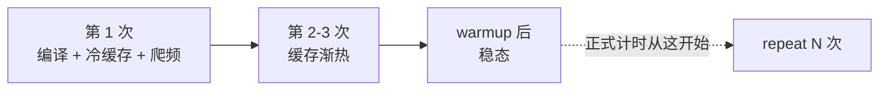

# 第4章 benchmark 与可信计时

## 本章导读

> 前面三章我们把环境、GPU 体系结构和第一个 vector add 程序串了起来，[第 3 章](../../part0-intro/chapter3/index.md)还用一次 baseline benchmark 建立了「算子离 Roofline 上限有多远」的直觉。从这一篇（Part 1 profiling 篇）开始，问题变成：怎么知道量出来的数字准不准、可不可信、会不会骗人？
>
> 本章先把镜头对准「量准」这件事本身。Latency、Throughput、Bandwidth、FLOPS 这些指标，memory-bound / compute-bound 这套判断语言，以及 Roofline 心智模型，[第 2 章](../../part0-intro/chapter2/index.md)和[第 3 章](../../part0-intro/chapter3/index.md)已经建立，本章不再重复——而是把它们底下那层更基础的东西讲清楚：一次 benchmark 怎样才算可信。读完后你应该能：解释为什么不能只跑一次就下结论；说明 warmup、repeat、synchronize 这些「无聊」的细节如何决定数字是否可信；用 GPU event 而不是 CPU wall clock 量出 kernel 的真实耗时；用一份检查清单避免常见的伪优化。

[第 3 章](../../part0-intro/chapter3/index.md)你已经写过一个小 benchmark（`benchmark_vector_add.py`），里面用了 warmup、repeat 和 GPU event——但当时只是照着做。本章把每个步骤背后的「为什么」讲清楚。

## 4.1 为什么不能凭感觉优化

这一节先讲一个容易踩的坑：性能优化最怕的不是「没优化成功」，而是你以为自己优化成功了，其实只是测错了。

日常写业务代码时，凭感觉改一改有时还能工作；但 GPU 性能优化不太一样。GPU 程序通常是异步执行的，第一次运行可能包含初始化或编译开销，同一个输入规模下也可能因为后台负载、缓存状态、调度方式而波动。只看一次运行时间，很容易把偶然现象当成规律。

很多刚开始做性能优化的同学，会直接问：「怎么把 GPU 跑满？」这个问题听上去很工程，但还不够具体。GPU 没跑满可能是数据没送到，可能是任务太碎，可能是测量本身不可靠，也可能它**确实**已经撞上了硬件天花板——只是你还不知道天花板在哪里。

所以 Part 1 的第一步不是「马上优化」，而是先学会问更好的问题：我到底在测什么？这个数字可信吗？它说明瓶颈在哪一层？下一步应该收集什么证据？

下面这张表列出几种常见的「直觉判断」与它们更值得追问的问题：

| 直觉判断 | 可能的问题 | 更好的追问 |
| ---- | ---- | ---- |
| GPU 利用率低，所以 kernel 写得差 | 可能是 CPU 调度慢、输入太小、数据搬运多，或者 GPU 一直在等任务 | GPU 到底在等什么？任务有没有持续送进去？ |
| 改完代码以后快了一点 | 可能只是 warmup、缓存、后台负载或随机波动 | 重复测了吗？统计口径一样吗？ |
| 单个算子快了，端到端就会快 | 这个算子可能只占总时间的一小部分 | 它在整条链路里占多少比例？ |
| 平均时间下降了 | 可能尾延迟变差，或者波动变大 | median、min、p95、p99 有没有一起看？ |
| GPU 时间很短，说明程序很快 | 可能只量到了 CPU 提交任务的时间，没有等 GPU 真正算完 | 计时前后有没有 synchronize？ |
| fp16 比 fp32 快两倍 | 也许只是计算路径变了，访存没变 | 是真省了带宽，还是只在算力侧变快？ |

这里先记住一句话：**没有稳定测量，就没有可靠优化。**

如 @fig-measure-loop 所示，把「凭感觉改」换成「先测后改」的最小闭环，至少要包含五步：

::: figure fig-measure-loop


从「感觉慢」到「可验证优化」的最小闭环
:::

如 @fig-measure-loop 所示，优化不是从改代码开始，而是从定义问题和设计测量开始。否则你很容易进入一种状态：代码改了很多，数字也变了，但没人知道到底是哪一步起作用。

这也是为什么本书反复强调一条工作节奏：先理解硬件和系统，再量准时间，再找到慢点，最后只改一个变量做验证。Part 1（profiling 篇）就是在练习这条路线。本章先把「怎么量准」讲清楚，[下一章](../chapter5/index.md) 会用两个 vector add 版本，把 benchmark 和 `rocprofv3` 接起来。

## 4.2 热身与缓存效应

这一节解释 benchmark 里最常见的一个现象：**第一次总是特别慢**，以及为什么正式计时前要先丢掉前几次。

GPU 程序的「首轮开销」通常来自三件事：

1. **编译 / JIT**：第一次启动某个 kernel 时，驱动或框架可能还要做最终编译、链接、内核选择（Triton autotune、rocBLAS 的 kernel 选择都在这一步发生）；
2. **缓存准备**：第一次访存时 L2、页表、TLB 都是冷的，数据要真正从显存搬进来；
3. **时钟爬升**：GPU 的实际工作频率可能从空闲状态逐步爬升到标称频率，前几次还没爬满。

如果直接拿第一次的时间当成绩，你量到的多半是这些一次性开销，而不是 kernel 真正的稳态性能。这就是为什么检查清单里有一条「区分初始化和正式计时」：**首轮要单独记录，不要混进统计**。

更隐蔽的是缓存带来的「伪提升」：第二次运行同一个输入往往比第一次快很多，原因只是数据已经被 L2 / GDDR6 预热，而不是你的代码变好了。这会制造一种很强的错觉——「我什么都没改，它就快了」。

::: figure fig-warmup-cache


首轮的一次性开销会在 warmup 后消失，正式计时只看稳态段
:::

应对方法很直接：

- **warmup**：正式计时前先空跑若干次（经验上至少 5~20 次），让 JIT、cache、时钟进入稳定状态；
- **按工作集大小分级测试**：当输入 footprint 接近 L2 容量时，缓存命中会让数字异常好看——这时要换多个 footprint 看趋势，而不是只跑一个 size；
- **首轮单独留档**：如果首轮特别慢，把它作为「初始化成本」单独记下来，正式统计前扔掉。

> 一个常被忽略的细节：warmup 之后**也要 synchronize**，否则 warmup 的任务可能还没真正在 GPU 上跑完，计时起点就被污染了。

## 4.3 重复运行与统计

这一节讲为什么「跑一次」永远不够，以及拿到一组时间后该怎么汇总。

单次结果可能只是偶然：一次后台任务、一次调度抖动、一次缓存命中，都足以让数字漂移。所以可信 benchmark 的第二个支柱是 **repeat（重复多次）**，并对这组时间做统计汇总，而不是只挑一个数字报告。

一个最小 benchmark 的流程可以写成：

```text
准备固定输入
记录硬件、软件版本和参数
运行若干次 warmup
等待设备完成
重复计时多次
每次计时都确保测量范围一致
汇总 mean / median / min / 波动
保存原始输出和结论
```

`mean`、`median`、`min` 这几个统计量各有用处：

- **mean**：平均值，容易受异常慢的一次影响；
- **median**：中位数，更能代表多数情况下的表现；
- **min**：最好的一次，常用来观察较少受外部干扰时的能力（估算带宽 / 算力上限时常以 min 为分母）；
- **波动范围 / std / p95 / p99**：告诉你这个 benchmark 是否稳定，以及尾延迟有多差。

不要只相信一个数字。**一个 benchmark 如果波动很大，你应该先修测量方法，而不是急着优化代码。** 具体来说，看到「改完只快了一点点」时，先问：repeat 够吗？median 和 std 怎么变？是不是落在了正常波动范围内？

[第 3 章](../../part0-intro/chapter3/index.md)的 `benchmark_vector_add.py` 里 `repeat=30` 就是为了让你拿到一串时间、再看 median / min 而不是单次值——本章只是把那个做法背后的道理讲清楚。

## 4.4 GPU event 与 wall-clock 计时

这一节讲本章最关键的技术细节：**device-only kernel 时间和 host-observed 端到端时间要用不同计时边界**。

GPU 任务通常是**异步提交**的：你在 host 端调用 `torch.softmax(x)` 或 `kernel<<<...>>>()` 时，CPU 可能只把命令塞进队列就返回。如果直接在调用前后读取 wall clock、却不在终点同步，量到的主要是提交时间。要测设备时间，可以在同一 GPU stream 上记录 event；要测用户观察到的端到端延迟，可以使用高精度 wall clock，但必须在计时终点同步，并明确是否包含 launch、拷贝、分配和框架开销。

下面三段内嵌骨架分别对应 PyTorch、Triton、HIP 三种常见入口，演示「warmup → record event → repeat → synchronize → elapsed」的 device-only 流程。仓库中的可执行综合入口是 `code/part1-profiling/chapter4/bench_ch4.py`；本章没有提交独立的骨架文件或 `logs/` 目录，关键输出直接嵌在正文中。

### 骨架 A：PyTorch op 的设备执行时间

最常见的入口：你想知道 `torch.nn.functional.softmax(x)` 在某个 shape 上有多快。

<details>
<summary>代码骨架：bench_torch_op.py</summary>

```python
# 正文内嵌骨架；仓库可执行综合入口为 bench_ch4.py
# 目标：演示一个可信的 PyTorch 算子 benchmark（示例算子可换成任意 op）
# 硬件上下文：Radeon RX 9070 XT + ROCm 7.13（实测见下方 §4.4 结果表）
import argparse
import statistics
import torch


def bench(shape, dtype, repeats=200, warmup=20):
    x = torch.randn(*shape, dtype=dtype, device="cuda")

    # warmup：让 JIT、cache、clock 进入稳定状态
    for _ in range(warmup):
        torch.softmax(x, dim=-1)
    torch.cuda.synchronize()

    # 用 GPU event 测设备执行时间
    start = [torch.cuda.Event(enable_timing=True) for _ in range(repeats)]
    end   = [torch.cuda.Event(enable_timing=True) for _ in range(repeats)]
    for i in range(repeats):
        start[i].record()
        torch.softmax(x, dim=-1)
        end[i].record()
    torch.cuda.synchronize()

    times_ms = [s.elapsed_time(e) for s, e in zip(start, end)]
    return {
        "mean":   statistics.mean(times_ms),
        "median": statistics.median(times_ms),
        "min":    min(times_ms),
        "p95":    sorted(times_ms)[int(len(times_ms) * 0.95)],
        "std":    statistics.pstdev(times_ms),
    }


if __name__ == "__main__":
    p = argparse.ArgumentParser()
    p.add_argument("--shape", default="4096,4096")
    p.add_argument("--dtype", default="fp16", choices=["fp16", "bf16", "fp32"])
    p.add_argument("--repeats", type=int, default=200)
    args = p.parse_args()

    shape = tuple(int(x) for x in args.shape.split(","))
    dtype = {"fp16": torch.float16, "bf16": torch.bfloat16, "fp32": torch.float32}[args.dtype]

    stats = bench(shape, dtype, args.repeats)
    print(f"shape={shape} dtype={args.dtype} stats={stats}")
```

</details>

要点：

- 用 `torch.cuda.Event` 测设备执行时间；若改用 wall clock 测端到端延迟，必须在终点同步并写清计时范围；
- 本例 warmup 20 次，并在 warmup 后 `synchronize`；实际次数应以 JIT、autotune、时钟和样本是否稳定为准；
- 同时输出 mean / median / min / p95 / std，单一数字不够。

### 骨架 B：Triton kernel 计时与有效带宽

针对单个 kernel 的 micro-benchmark，重点是**用 bytes / ops 估算反推有效带宽或算力**，再和硬件峰值比较，判断「离极限多远」。

<details>
<summary>代码骨架：bench_triton_copy.py</summary>

```python
# 正文内嵌骨架；仓库可执行综合入口为 bench_ch4.py
# 目标：用最简单的 copy kernel 验证 benchmark 流程，并估算有效带宽
# 硬件上下文：Radeon RX 9070 XT + ROCm 7.13（实测见下方 §4.4 结果表）
import argparse
import torch
import triton
import triton.language as tl


@triton.jit
def copy_kernel(x_ptr, y_ptr, n, BLOCK: tl.constexpr):
    pid = tl.program_id(0)
    offs = pid * BLOCK + tl.arange(0, BLOCK)
    mask = offs < n
    tl.store(y_ptr + offs, tl.load(x_ptr + offs, mask=mask), mask=mask)


def bench(n, repeats=200, warmup=20, block=1024):
    x = torch.empty(n, dtype=torch.float32, device="cuda")
    y = torch.empty_like(x)
    grid = ((n + block - 1) // block,)

    for _ in range(warmup):
        copy_kernel[grid](x, y, n, BLOCK=block)
    torch.cuda.synchronize()

    s = torch.cuda.Event(enable_timing=True)
    e = torch.cuda.Event(enable_timing=True)
    s.record()
    for _ in range(repeats):
        copy_kernel[grid](x, y, n, BLOCK=block)
    e.record()
    torch.cuda.synchronize()
    ms = s.elapsed_time(e)

    # 每次迭代搬运 2 * n * 4 字节（一读一写 fp32）
    total_bytes = 2 * n * 4 * repeats
    eff_bw = total_bytes / (ms * 1e-3) / 1e9   # GB/s
    return ms, eff_bw


if __name__ == "__main__":
    p = argparse.ArgumentParser()
    p.add_argument("--n", type=int, default=1 << 24)
    p.add_argument("--repeats", type=int, default=200)
    args = p.parse_args()
    ms, gbps = bench(args.n, args.repeats)
    print(f"n={args.n} time={ms:.3f} ms eff_bw={gbps:.2f} GB/s")
```

</details>

要点：

- **用一个公式把时间换算成 BW（或 TFLOPS）**——单看时间没法判断「离峰值多远」；
- 当 `n` 远大于 L2 容量时，eff_bw 应该逼近 GDDR6 实测带宽，否则 benchmark 流程本身有问题；
- 同样的骨架可以替换 kernel 来测 GEMM、softmax 等，只要把「搬运 bytes / 计算 ops」的公式换掉。

### 骨架 C：HIP event 计时

有时你需要绕过 Python 直接量 HIP kernel——它对应的最小 benchmark 骨架是这样的：

<details>
<summary>代码骨架：bench_hip.cpp</summary>

```cpp
// 正文内嵌骨架；用于说明 HIP event 的最小流程
// 目标：HIP event 最小计时模板
// 硬件上下文：Radeon RX 9070 XT + ROCm 7.13（实测见下方 §4.4 结果表）
#include <hip/hip_runtime.h>
#include <cstdio>

#define HIP_CHECK(call)                                                      \
    do {                                                                     \
        const hipError_t error = (call);                                     \
        if (error != hipSuccess) {                                           \
            std::fprintf(stderr, "HIP error: %s\n",                         \
                         hipGetErrorString(error));                           \
            return 1;                                                        \
        }                                                                    \
    } while (0)

__global__ void my_kernel(float* x, int n) {
    int i = blockIdx.x * blockDim.x + threadIdx.x;
    if (i < n) x[i] = x[i] * 2.0f + 1.0f;
}

int main() {
    const int n = 1 << 24;
    const int warmup = 20, repeats = 200;
    float* d;
    HIP_CHECK(hipMalloc(&d, n * sizeof(float)));
    HIP_CHECK(hipMemset(d, 0, n * sizeof(float)));

    int block = 256;
    int grid  = (n + block - 1) / block;

    for (int i = 0; i < warmup; ++i)
        my_kernel<<<grid, block>>>(d, n);
    HIP_CHECK(hipGetLastError());
    HIP_CHECK(hipDeviceSynchronize());

    hipEvent_t s, e;
    HIP_CHECK(hipEventCreate(&s));
    HIP_CHECK(hipEventCreate(&e));
    HIP_CHECK(hipEventRecord(s));
    for (int i = 0; i < repeats; ++i)
        my_kernel<<<grid, block>>>(d, n);
    HIP_CHECK(hipGetLastError());
    HIP_CHECK(hipEventRecord(e));
    HIP_CHECK(hipEventSynchronize(e));

    float ms = 0.f;
    HIP_CHECK(hipEventElapsedTime(&ms, s, e));
    printf("avg per launch = %.4f ms\n", ms / repeats);

    HIP_CHECK(hipEventDestroy(s));
    HIP_CHECK(hipEventDestroy(e));
    HIP_CHECK(hipFree(d));
    return 0;
}
```

</details>

要点：

- `hipEvent_t` 的精度足够量到 μs 级 kernel；
- 一定要 `hipEventSynchronize` 之后再读 elapsed time，否则 host 还在拿着 stale 值；
- [第 5 章](../chapter5/index.md) 会沿用这个计时骨架，再用 `rocprofv3` 核对 kernel 时间。

### 实测数字（Radeon RX 9070 XT + ROCm 7.13）

下面这张表是用 [`bench_ch4.py`](https://github.com/datawhalechina/hello-gpu/blob/dev/code/part1-profiling/chapter4/bench_ch4.py)（综合了上面骨架 A / B 两段流程）在 9070XT（gfx1201 / ROCm 7.13 / 原生 Ubuntu 24.04）上跑出来的实测值：

<details>
<summary>实测输出：Ch4 benchmark @ 9070XT + ROCm 7.13（原生 Ubuntu 24.04）</summary>

下表是用 `bench_ch4.py` 在 9070XT（gfx1201 / ROCm 7.13 / 原生 Ubuntu 24.04）上的实测值：

| 实验 | 算子 / 公式 | shape / dtype | 时延（median / min） | 有效带宽 | 算术强度 |
| ---- | ---- | ---- | ----: | ----: | ----: |
| 骨架 A — PyTorch vector add | `c = a + b` | 4096² / fp32 | 0.337 / 0.335 ms | 600.8 GB/s | ~0.083 FLOP/B |
| 骨架 A — PyTorch vector add | `c = a + b` | 4096² / fp16 | 0.173 / 0.171 ms | 587.3 GB/s | ~0.17 FLOP/B |
| 骨架 B — Triton vector copy | `y = x` | 每个张量 8 MiB | 0.020 ms（批次平均） | 785.1 GB/s | — |
| 骨架 B — Triton vector copy | `y = x` | 每个张量 64 MiB | 0.223 ms（批次平均） | 572.8 GB/s | — |
| 骨架 B — Triton vector copy | `y = x` | 每个张量 256 MiB | 0.900 ms（批次平均） | 568.6 GB/s | — |

```text
GPU: AMD Radeon RX 9070 XT
torch: 2.11.0+rocm7.13.0
hipcc: 7.13.99004 / arch gfx1201 / 原生 Ubuntu 24.04 (6.17.0-35-generic)

--- 骨架 A：PyTorch vector add (4096×4096) ---
 dtype |    min_ms |  median_ms |     GB/s
  fp32 |   0.335 ms |    0.337 ms |   600.8
  fp16 |   0.171 ms |    0.173 ms |   587.3

--- 骨架 B：Triton vector copy (float32) ---
   footprint |    avg_ms |     GB/s
        8 MiB |   0.020 ms |   785.1
       64 MiB |   0.223 ms |   572.8
      256 MiB |   0.900 ms |   568.6
```

> 时延口径：vector add 用 GPU event 逐次计时，同时报告 min 与 median；vector copy 用一段 event 覆盖 200 次连续 launch 后求平均，因此只有批次平均值，不能据此推出 min、median 或波动。有效带宽的口径是 vector add 按 `3 × elems × dtype` 字节（两读一写），vector copy 按每次 `2 × footprint` 字节（一读一写）。现有带宽单位将在第 2～6 章统一重算时一并校正。

</details>

读这张表的关键点：

- **memory-bound 算子的「快」上限就是带宽**：vector add 在 fp32 / fp16 下有效带宽几乎一致（600.8 vs 587.3 GB/s），但 fp16 的时间只有 fp32 的约一半（0.171 vs 0.335 ms）——这正是直觉表里「改 dtype 之后吞吐翻倍 ≠ 真省了带宽」那条的实测印证。fp16 真省到的是 byte 数，算术强度（FLOP/B）跟着翻倍。
- **vector copy 的 footprint 扫描能提示 cache/显存边界**：8 MiB 时较高的逻辑有效带宽说明片上 cache 可能参与；每个张量 64 MiB 后结果下降并趋稳。仅凭时间不能把命中精确归到 L2、Infinity Cache 或 GDDR6，后续参考线还需要结合正确单位和更完整的 footprint 扫描重建。

> 太小的输入（几 MiB 以下）测出来的不是带宽峰值，是 launch overhead——每次 copy 真正干活只有几 μs，被启动开销稀释。太大的输入又只能看到 GDDR6 平台。要看 cache 层级必须跑 footprint 扫描，而不是只跑一个 size。

> 三段骨架本身只是流程模板；实测数字请按[第 3 章 3.5 节](../../part0-intro/chapter3/index.md)的实验底稿习惯，落到 `code/part1-profiling/chapter4/` 下的记录里，写清楚硬件、命令、原始输出和结论，几天后回来才复现得了。

## 4.5 避免测量陷阱

这一节专门讲「看起来变快了，但其实不一定」的情况——也就是常说的**伪优化**。伪优化最麻烦的地方在于，它会给你一种很强的成就感：数字变好了，代码也改了，好像问题解决了。但如果测量方式不可靠，后面换输入、换机器、换版本时，结果很可能消失。

下面这张表把常见伪优化来源和应对方式整理在一起：

| 现象 | 可能原因 | 应对方式 |
| ---- | ---- | ---- |
| 第一次很慢，后面明显变快 | 首轮包含初始化、编译、缓存准备 | 单独记录首轮，正式统计前 warmup |
| 改完只快了一点 | 可能是正常波动 | 增加 repeat，看 median 和 std |
| GPU 计时几乎为零 | 没有等待 GPU 完成 | 使用 GPU event 或显式 synchronize |
| 小输入特别快 | 可能主要测到 launch overhead 或缓存效果 | 用多个输入规模观察趋势 |
| 单个 kernel 快了，但端到端没变化 | 瓶颈不在这个 kernel | 先看它在总耗时中占比 |
| 前后版本差异很大 | 同时改了多个变量 | 一次只改一个变量，保留对照组 |
| 带宽或 FLOPS 看起来异常高 | 数据量模型或计时范围不一致 | 重新核对 bytes / ops 的估算口径 |
| 改 dtype 之后吞吐翻倍 | 可能只是 Tensor 数量变了一半 | 把 byte 数和 ops 数都重新算 |
| 关掉某个 print / log 后变慢 | 可能 print 把 host 卡住，意外起到了同步效果 | 计时范围要明确包含或排除日志 |
| 第二次运行就一直很快 | 数据已被 L2 / GDDR6 预热 | 在 footprint 接近 cache 容量时，按工作集大小分级测试 |

避免伪优化的核心方法也很简单：**让实验可复查。**

一次好的性能实验，至少应该留下：输入规模、数据类型、硬件和软件版本、运行命令、原始输出、统计方式、结论。这样几天以后你再回来，或者别人帮你 review 时，才知道这个数字到底从哪里来——这正是[第 3 章 3.5 节](../../part0-intro/chapter3/index.md)强调的实验底稿习惯。

如果你现在只记住一条，那就是：**优化前先建立可信 baseline。** 没有 baseline，后面所有「更快了」都没有参照物。

## 4.6 可信 benchmark 的检查清单

这一节把前面几节的要点收成一份清单——每次开一组实验前过一遍，能挡掉大部分伪优化。

| 检查项 | 为什么重要 | 常见错误 |
| ---- | ---- | ---- |
| 固定输入规模 | 输入变了，时间自然会变 | 前后对比时 shape 不一致 |
| 固定数据类型 | fp32、fp16、bf16 的计算路径不同 | 只说「快了」，不说 dtype |
| 区分初始化和正式计时 | 第一次运行可能包含加载、编译、缓存准备 | 把首轮初始化当成稳定性能 |
| warmup | 让缓存、JIT、设备状态进入稳定状态 | 第一轮特别慢，直接拿来平均 |
| repeat | 单次结果可能只是偶然 | 只跑一次就下结论 |
| synchronize | GPU 任务常常异步提交 | 只量到 CPU 提交时间 |
| 计时器选择 | device-only 与端到端问题需要不同计时边界 | 用未同步的 wall clock 量异步 kernel |
| 锁定时钟 / 后台干扰 | 频率波动会污染数据 | 后台跑着别的 GPU 任务 |
| 记录环境 | 后续复查需要硬件、驱动、框架版本 | 只有一个数字，没有上下文 |
| 只改一个变量 | 才知道是谁带来变化 | 同时改 shape、dtype、实现和参数 |

把这张表和 4.4 的三段骨架配合起来用：骨架管「怎么测」，清单管「测得对不对」。两者都到位，一次 benchmark 才值得相信。

## 本章小结

- 性能优化不是从改代码开始，而是从定义问题和设计测量开始；**没有稳定测量，就没有可靠优化**。
- 首轮的一次性开销（编译、冷缓存、爬频）要在 warmup 里消掉；正式统计只看稳态段，warmup 之后记得 synchronize。
- 单次结果不可信，要 repeat 多次并汇总 mean / median / min / p95 / std；波动大时先修测量方法，而不是急着优化代码。
- GPU 任务是异步提交的：GPU event（`torch.cuda.Event` / `hipEvent_t`）适合测设备时间；同步后的高精度 wall clock 适合测 host-observed/端到端延迟。两者都必须明确计时范围。
- 伪优化有很多伪装（缓存命中、launch overhead、改 dtype 只省了 byte、print 意外同步……），核心对策是「让实验可复查」和「先建立可信 baseline」。
- [下一章](../chapter5/index.md) 会用两个 vector add 版本，把本章的 benchmark 流程和 `rocprofv3` 串成「量准 → 找到慢点 → 验证」的完整路线。

## 延伸阅读

- [HIP Performance Guidelines](https://rocm.docs.amd.com/projects/HIP/en/latest/how-to/performance_guidelines.html)
- [HIP Programming Guide](https://rocm.docs.amd.com/projects/HIP/en/latest/) — HIP 编程模型与计时 API 入口
- [PyTorch Profiler 文档](https://docs.pytorch.org/docs/stable/profiler.html)
- [ROCm Documentation](https://rocm.docs.amd.com/)
