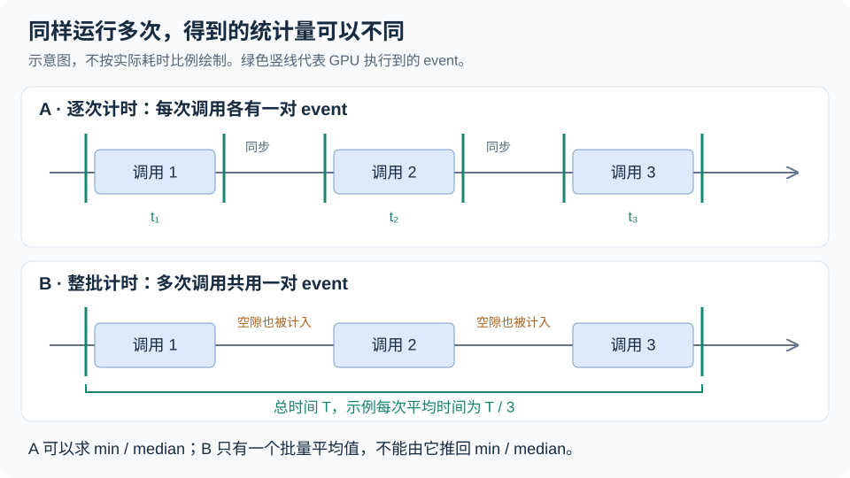

# 第5章 benchmark 与可信计时

## 本章导读

> [第 4 章](../../part0-intro/chapter4/index.md)中，我们已经运行了向量加法，并用 GPU event 测出了时间。如果再改一次程序，时间变短了，怎样判断它确实更快？这一章沿用向量加法，再加上一个简单的数组复制实验，逐步建立可以重复比较的基准测试（benchmark）。
>
> 你将看到两种计时方式，亲手把毫秒换算成有效带宽，并学会区分测量结果与对结果的解释。只需要理解数组、循环，以及上一章的 GPU event；Triton 代码可以先当作“把数组复制一遍”的函数来读。

## 5.1 先确定计时的起点和终点

这一节先回答：我们所说的“一次向量加法耗时”，究竟包括哪些工作？

假设两个数组已经在 GPU 上，我们要计算 `z = x + y`。从用户启动程序到看到结果，中间还有创建数组、传输数据、提交计算、检查答案等步骤。如果把全部步骤都计入，得到的是这段程序的总耗时；如果只计入数据准备好后的加法，得到的是另一个范围的耗时。这两个数字都可以有用，比较前必须先说明范围。

本章测量**输入和输出已分配在 GPU 上时，重复执行算子的 event 时间**。数组分配、输入初始化、预热和结果检查都在计时区间外。这样做是为了比较计算过程，而不是把每次创建数组的成本也混进去。

这里还要处理 GPU 的异步执行。CPU 提交一次加法后，通常可以继续执行后面的 Python 语句，此时 GPU 不一定已经算完。如果只在 Python 调用前后读时钟，期间又没有等待 GPU 完成，就可能主要量到提交任务的时间。[PyTorch 的异步执行说明](https://docs.pytorch.org/docs/2.11/notes/cuda.html#asynchronous-execution)解释了这个区别。

上一章用过的 **event** 可以理解为排入 GPU 执行流的时间标记。**执行流（stream）**是一条按顺序执行任务的队列：我们在同一条流上依次放入起点、加法、终点，等待终点完成后，再读两点之间的时间。ROCm 版 PyTorch 也沿用 `torch.cuda.Event` 和 `device="cuda"` 这些接口名称，它们在本机实际调用 AMD GPU。[HIP 语义说明](https://docs.pytorch.org/docs/2.11/notes/hip.html)

| 想回答的问题 | 合适的计时范围 | 本章是否测量 |
| ---- | ---- | ---- |
| 准备好数据后，一次算子执行用了多久？ | 同一执行流上的起止 event | 是 |
| 连续执行多次，平均每次用了多久？ | 一批调用外的起止 event，总时间除以次数 | 是 |
| 包含数据准备和传输，用户一共等了多久？ | 明确包含这些步骤的主机时钟，并在必要位置等待 GPU | 否 |

event 也不是只记录计算指令的“过滤器”。如果 GPU 已经执行到起点，而 CPU 还没有提交后续工作，中间的空隙也会进入 event 时间。因此，对很短的算子，启动和提交节奏仍可能影响结果。下一章会借助 profiler，进一步查看每次 kernel 自身的起止时间。

## 5.2 运行一次完整的基准测试

这一节先跑通实验，再逐段阅读它的实现。

配套脚本是 [`code/part1-profiling/chapter5/bench_ch4.py`](https://github.com/datawhalechina/hello-gpu/blob/dev/code/part1-profiling/chapter5/bench_ch4.py)。文件名保留了旧章号，当前对应第 5 章。它完成两件事：对 `4096 × 4096` 个元素做加法；复制一个 FP32 数组，分别测试单个数组为 8、64、256 MiB 的情况。

在完成[第 1 章环境准备](../../part0-intro/chapter1/index.md)的实验机上，从项目根目录进入本篇环境：

```bash
cd code/part1-profiling
source ./activate-rocm.sh
python chapter5/bench_ch4.py
```

下面是 **2026-09-11 在 Radeon RX 9070 XT（gfx1201）+ ROCm 7.13.99004 + 原生 Ubuntu 24.04.4** 上的一次完整运行。PyTorch 为 `2.11.0+rocm7.13.0`，Triton 为 `3.6.0`，Python 为 `3.12.3`。默认预热 20 次，正式执行 200 次。设备未锁频，采样前可见少量后台 GPU 活动，因此这些数值用于学习方法，不代表独占设备的最佳成绩。

<details>
<summary>实测输出：向量加法与数组复制 @ RX 9070 XT / ROCm 7.13 / 原生 Ubuntu</summary>

```text
GPU: AMD Radeon RX 9070 XT
torch: 2.11.0+rocm7.13.0; HIP: 7.13.99004
Python: 3.12.3; Triton: 3.6.0
warmup: 20; repeats: 200; seed: 0

--- A: PyTorch vector add (4096 x 4096, preallocated output) ---
dtype | min_ms | median_ms | GB/s_at_median | validation
fp32 | 0.336605 | 0.338365 | 594.998 | PASS
fp16 | 0.172483 | 0.173443 | 580.383 | PASS

--- B: Triton vector copy (FP32, BLOCK=1024) ---
array_MiB | pair_MiB | batch_avg_ms | GB/s_at_batch_avg | validation
8 | 16 | 0.016711 | 1003.972 | PASS
64 | 128 | 0.223374 | 600.864 | PASS
256 | 512 | 0.901349 | 595.630 | PASS
```

</details>

先读第一行加法结果：FP32 的一次 event 时间中位数约为 **0.338 ms**，有效带宽约为 **595 GB/s**。`PASS` 表示脚本检查了整个输出数组，所有元素都有限且等于预期的 3。复制实验则逐元素检查结果与输入完全一致，并拒绝 NaN 和无穷值。校验发生在计时区间外，所以不会把检查答案的时间算进成绩。

两个表的时间列不同：加法报告 `min_ms` 和 `median_ms`，复制报告 `batch_avg_ms`。我们接下来从代码中找到原因。

## 5.3 从准备数据到记录一个样本

这一节把加法实验拆开，说明每一步如何影响测量。以下 Python 片段均摘自配套脚本，省略函数外层的缩进。

### 5.3.1 固定输入，提前准备输出

首先创建输入与输出。`shape` 决定元素个数，`dtype` 决定每个元素占用的字节数。

```python
x = torch.ones(shape, dtype=dtype, device="cuda")
y = torch.full_like(x, 2.0)
z = torch.empty_like(x)
```

这里选择 1 和 2，是为了让预期答案明确：每个输出都应该是 3。`empty_like` 只分配存储，不负责初始化；后续加法必须写入整个 `z`。正式运行使用 `torch.add(x, y, out=z)`，把结果写进预先分配的数组，从而保持每次调用的输出存储一致。

我们比较 FP32 与 FP16 时，数组形状保持不变。FP32 每个元素占 4 字节，FP16 占 2 字节；变化的是每个元素的存储大小，元素数量没有变化。

### 5.3.2 预热：先执行，再开始收集样本

接下来先运行几次相同的操作：

```python
for _ in range(warmup):
    torch.add(x, y, out=z)
torch.cuda.synchronize()
check_add(z)
```

**预热（warmup）**是正式计时前的运行。第一次调用可能触发运行时初始化、代码加载或编译，设备频率和缓存状态也可能与持续运行时不同。我们希望测量重复使用算子时的表现，因此把这部分与正式样本分开。若关心首次调用成本，就应另外测量和报告首次调用。

`torch.cuda.synchronize()` 等待设备上的工作完成；随后检查答案，确认接下来计时的是一个结果正确的程序。20 次是本实验的默认参数，并不保证所有程序在第 21 次都进入某种固定状态。输入形状、数据类型或实现改变后，应重新预热；结果仍明显波动时，还要检查设备负载与频率。

这里的循环会反复使用同一组数组。**复用输入本身就是实验条件的一部分**：它可能利用缓存，不等价于每轮都处理从未访问过的新数据。预热也不会自动把一个算子变成“纯显存带宽测试”。

### 5.3.3 用一对 event 收集多次时间

脚本先创建两个 event，并各记录一次，让它们的底层资源完成初始化。正式计时的循环如下：

```python
times = []
for _ in range(repeats):
    start.record()
    torch.add(x, y, out=z)
    end.record()
    end.synchronize()
    times.append(start.elapsed_time(end))
check_add(z)
```

按顺序读这六行：记录起点，执行加法，记录终点，等待终点完成，把经过的毫秒数放进列表。上一轮已经完成，所以可以在下一轮复用这对 event。循环结束后再检查一次结果。

这里得到的是 **200 个单次时间样本**。同步发生在终点之后，它等待的主机时间没有额外加到 `elapsed_time` 的结果里，但每轮同步会改变调用之间的节奏。因此，把这段循环改成连续提交 200 次，再一次性等待，测量条件也随之改变。

## 5.4 单次样本与批量平均值

这一节比较两种重复方式，并说明它们分别支持哪些结论。

@fig-event-sampling 用三次调用示意脚本中的两种方式。实际实验运行 200 次，图中的方块宽度没有使用实测比例。

::: figure fig-event-sampling


逐次计时保留每次调用的信息；整批计时包含起止标记之间的调用与空隙，只得到一个批量平均值。
:::

对于加法的时间列表，脚本计算：

```python
min_ms = min(times)
median_ms = statistics.median(times)
```

**最小值（min）**是这批样本中最快的一次，可以保留作参考；它不能代表每次都能达到的速度。**中位数（median）**把样本从小到大排列后取中间位置，能减少少数特别慢的样本对结果的影响。本章用中位数计算加法的有效带宽，并同时报告最小值，让统计口径可以复查。

复制实验采用另一种方式：

```python
start.record()
for _ in range(repeats):
    copy_kernel[grid](x, y, n, BLOCK=block)
end.record()
end.synchronize()
batch_avg_ms = start.elapsed_time(end) / repeats
```

两个 event 包住整批调用，得到总时间 $T$，再除以次数 $R$，即 $T/R$。这样减少了插入 event 和逐次同步的次数，但不能从一个总时间恢复每次调用用了多久。**批量平均值既不是最小值，也不是中位数**；如果想知道不同批次的波动，需要再运行多个批次并分别保留结果。

这里的 `copy_kernel` 用 Triton 编写。Triton 是一种用 Python 语法描述 GPU 计算的工具，它会编译核函数；本章只借它提供一个独立的复制实现。函数完成 `y[i] = x[i]`，每个 program 负责一组最多 1024 个元素，越过数组末尾的位置由 `mask` 排除。完整实现不到十行，可以稍后展开阅读。

<details>
<summary>代码：Triton 数组复制核函数</summary>

```python
@triton.jit
def copy_kernel(x_ptr, y_ptr, n, BLOCK: tl.constexpr):
    pid = tl.program_id(0)
    offs = pid * BLOCK + tl.arange(0, BLOCK)
    mask = offs < n
    tl.store(y_ptr + offs, tl.load(x_ptr + offs, mask=mask), mask=mask)
```

</details>

加法和复制的数学操作、实现方式、计时方法都不同。把它们放在同一章，是为了学习测量方法；这组实验不能用来比较 PyTorch 与 Triton 哪个整体更快。要比较两种实现，应先让它们完成同一任务，再统一输入和计时方式。

## 5.5 从时间算出有效带宽

这一节用实测数字走一遍单位换算，理解结果中的 `GB/s`。

### 5.5.1 向量加法要读写多少数据

设数组有 $N$ 个元素，每个元素占 $s$ 字节。一次加法读 `x`、读 `y`、写 `z`，算法要求的数据量为：

$$
B = 3Ns.
$$

FP32 实验中，$N=4096^2=16\,777\,216$，$s=4$，所以 $B=201\,326\,592$ 字节，也就是 192 MiB。**有效带宽**用这个算法数据量除以耗时：

$$
\mathrm{BW}_{\mathrm{eff}}=\frac{B}{t}.
$$

$t$ 要换成秒，字节换成十进制 GB。代入本次记录的中位数，得到：

$$
\mathrm{BW}_{\mathrm{eff}}
=\frac{201\,326\,592}{0.338365\times10^{-3}}\div10^9
\approx595\ \mathrm{GB/s}.
$$

源码让张量自己提供元素数和每个元素的字节数，避免切换数据类型后忘记更新公式：

```python
bytes_moved = 3 * x.numel() * x.element_size()
gbs = bytes_moved / (median_ms * 1e-3) / 1e9
```

同一次 RX 9070 XT / ROCm 7.13 / 原生 Ubuntu 实验中，FP16 中位数约为 0.173 ms，有效带宽约为 580 GB/s。它处理的元素数相同，算法字节数减半，时间也接近减半。这个结果与“数据量对耗时影响较大”的判断相符；单凭两个点，还不能证明某个具体硬件部件已经达到上限。

### 5.5.2 复制时，单个数组和读写总量不同

复制一次需要读 `x`、写 `y`，因此 $B=2Ns$。本章的 `array_MiB` 指**单个数组的大小**，`pair_MiB` 指两个数组合计的存储大小，在这里也恰好等于算法的一读一写数据量。

| 单个数组 | 两个数组合计 | 一次复制的算法数据量 |
| ----: | ----: | ----: |
| 8 MiB | 16 MiB | $16\times2^{20}$ 字节 |
| 64 MiB | 128 MiB | $128\times2^{20}$ 字节 |
| 256 MiB | 512 MiB | $512\times2^{20}$ 字节 |

MiB 是二进制单位，$1\ \mathrm{MiB}=2^{20}$ 字节；GB 是十进制单位，$1\ \mathrm{GB}=10^9$ 字节。不能直接把“MiB 除以 ms”标成 GB/s。脚本先得到准确的字节数，再统一换算：

```python
bytes_moved = 2 * x.numel() * x.element_size()
gbs = bytes_moved / (batch_avg_ms * 1e-3) / 1e9
```

### 5.5.3 有效带宽不等于显存总线的实测流量

本次复制实验中，8 MiB 数组对应的有效带宽约为 $1.00\times10^3$ GB/s，而 64、256 MiB 数组约为 601、596 GB/s。这说明测量结果随工作集大小变化；**工作集**就是这段程序反复访问的数据，本例中包括输入和输出。

为什么小数组的数值更高？缓存复用是值得验证的解释：如果部分数据来自片上缓存，算法仍把它算作一次读取，但这些字节不一定都经过 GDDR6 显存总线。与此同时，输入规模、调用间隙和计时开销也会影响结果。这里的 `GB/s` 来自算法字节数与 event 时间，没有测量真实显存事务，不能据此断言“小数组全部命中 L2”或“大数组就是 GPU 的带宽极限”。

这一章先保留可靠的观察：**相同计时方法下，复制不同大小的数组得到不同的有效带宽。** 下一章会学习怎样增加证据，第 7 章再把明确了口径的数据放到 Roofline 图上。

## 5.6 复测、记录与练习

这一节把前面的步骤收束成一次可以复查的实验。

重新启动脚本会得到另一组样本，不必要求最后几位小数一致。先确认操作、输入规模、数据类型、预热次数、正式次数和统计方式一致，再观察差异。如果两个版本只差一点，应交替重复运行它们，保留每轮结果；单个进程里的 200 次采样不能替代所有独立复测。

脚本也允许改变预热和正式次数。下面的命令已在相同实验机上运行通过，五组输出的正确性检查均为 `PASS`：

```bash
python chapter5/bench_ch4.py --warmup 40 --repeats 100
```

它用来观察测量设置的影响。由于同时改变了两个参数，不应据此把结果变化归因于某一个参数；做对照实验时，再分别改变预热次数或正式次数。

一份记录只需要先写清五件事：运行环境与日期，完整命令，输入与校验方式，计时范围与统计量，观察及待验证的解释。本章本地实验底稿保存在 `code/part1-profiling/chapter5/EXPERIMENT.md`，原始输出保存在该目录的 `logs/bench-native-2026-09-11.log`。早期 WSL2 记录与本次原生 Ubuntu 记录分开保留，正文采用本次修正后脚本的结果。

你可以用以下问题检查自己是否理解了测量过程：

1. FP16 向量加法的算法数据量是多少字节？代入 0.173443 ms，能否算出输出中的有效带宽？
2. 假如只保留一批 200 次调用的总时间，还能求出单次调用的中位数吗？缺少了什么信息？
3. 把输出数组分配移到每次加法内部，会改变哪些条件？此时应怎样重新描述计时范围？
4. 对 8 MiB 的复制数组，一次算法读写总量是多少？如果误把 `8` 当作两个数组的总大小，带宽会相差多少？
5. 小数组的有效带宽更高，你能写出一条已观察到的事实和一条尚未验证的解释，并把它们分开吗？

<details>
<summary>自检提示：单位、统计量与结论边界</summary>

1. $3\times4096^2\times2=100\,663\,296$ 字节，即 96 MiB。除以对应的秒数再除以 $10^9$，约为 580 GB/s。
2. 不能。总时间没有保留每次调用的时间分布，也可能包括调用间隙。
3. 每轮多了分配或分配器复用的工作，主机提交节奏也可能变化；这与本章的预分配版本不同。
4. 16 MiB。只计 8 MiB 会把有效带宽算成正确值的一半。
5. “本次小数组的有效带宽更高”是观察；“原因是缓存复用”是需要进一步验证的解释。

</details>

## 本章小结

- 先定义计时范围，再选择计时方法。GPU event 测量执行流中两个标记之间的时间；正确同步的主机时钟也可以用于明确范围的总耗时测量。
- 分配、初始化、预热和结果检查放在本章的计时区间外。重复使用输入、每轮同步等设置也属于实验条件。
- 逐次计时得到多个样本，可以报告最小值和中位数；整批计时得到总时间除以次数的平均值，两者不能混称。
- 有效带宽需要同时写清算法字节数、时间统计量和单位。它不会自动告诉我们字节经过了哪一级存储。

[第 6 章](../chapter6/index.md)继续使用向量加法，借助 `rocprofv3` 从“这个版本更慢”走到“它怎样执行，以及下一步该检查什么”。

## 延伸阅读

- [《动手学深度学习》：异步计算](https://zh.d2l.ai/chapter_computational-performance/async-computation.html) — 从程序执行顺序理解异步与同步。
- [PyTorch：异步执行与计时](https://docs.pytorch.org/docs/2.11/notes/cuda.html#asynchronous-execution) — 解释主机调用和设备执行的关系。
- [PyTorch：Event](https://docs.pytorch.org/docs/2.11/generated/torch.cuda.Event.html) — event 的记录、等待与时间单位。
- [HIP Performance Guidelines](https://rocm.docs.amd.com/projects/HIP/en/latest/how-to/performance_guidelines.html) — 进一步了解性能测量与优化。
