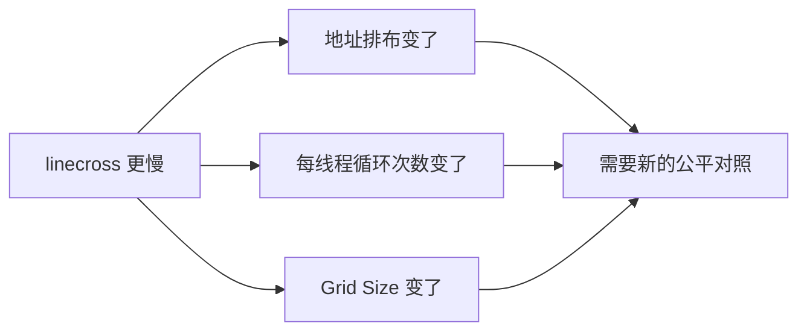

# 第5章 用 rocprof 找到慢在哪里

## 本章导读

> 本章只解决一个问题：**两个 vector add 实现速度差很多时，怎么先找到慢在哪个 kernel？**
>
> 我们会先用 benchmark 看差距，再用 `rocprofv3` 查看每次 kernel dispatch，最后扫描 `stride` 观察变化趋势。这个案例还会提醒你：命令行里只改一个参数，不代表 GPU 内部只改了一件事。读完后，你应该会定位慢点，也知道什么时候还不能急着下结论。

本章代码在 `code/part1-profiling/chapter5/vector_add.hip`。下面的性能数据来自 **Radeon RX 9070 XT（gfx1201）+ ROCm 7.13 + 原生 Ubuntu 24.04**；换一张卡，数字会变，但操作顺序不变。

## 5.1 先看懂两个实现

这一节先看两个 kernel 分别怎样把 `n` 个元素分给线程。它们的输出相同，但线程的工作划分并不相同。

### 5.1.1 连续访存版

普通 vector add 让线程 `i` 处理元素 `i`：

```cpp
__global__ void kernel_coalesced(const float* a, const float* b,
                                 float* c, int n) {
    int i = blockIdx.x * blockDim.x + threadIdx.x;
    if (i < n) {
        c[i] = a[i] + b[i];
    }
}
```

一个 wavefront 里的 lane 0、lane 1、lane 2 会依次访问 `a[0]`、`a[1]`、`a[2]`。这些地址连在一起，GPU 可以把多条线程请求合并成较少的内存事务。这就是**合并访存（Memory Coalescing）**。

这个版本每个线程只计算一个输出，因此一共启动约 `n` 个线程。

### 5.1.2 linecross 版

`linecross` 是本章给对照实现起的名字，不是 ROCm 的标准术语。它让每个 lane 处理一小段连续元素：

```cpp
int tile_base = wave_id * 32 * stride;
int my_start = tile_base + lane * stride;
for (int j = 0; j < stride; ++j) {
    int i = my_start + j;
    c[i] = a[i] + b[i];
}
```

以 `stride=32` 为例，同一次循环中，各 lane 看到的地址大致是：

```text
lane 0  -> a[0]
lane 1  -> a[32]
lane 2  -> a[64]
lane 3  -> a[96]
...
```

相邻 lane 的起点隔了 32 个 float，也就是 128 字节。地址排布比连续访存版更分散。

一个 wavefront 一共处理 `32 × stride` 个输出，所以 stride 变大时会同时发生两件事：

1. 每个 lane 的循环次数增加；
2. 需要启动的 wavefront 数减少。

::: figure fig-coalesce-vs-linecross


两个实现同时改变了地址排布和线程工作划分。
:::

如 @fig-coalesce-vs-linecross 所示，这不是一个“只改地址排布”的严格对照。它适合练习 benchmark 和 kernel trace，也能展示 stride 增大时的整体趋势；但仅凭这组数据，不能把全部性能差距都归因于访存合并。

## 5.2 先跑一遍，确认谁更慢

这一节先不打开 profiler，只用第 4 章的计时方法比较三个配置。

从仓库根目录进入本篇环境并编译：

```bash
cd code/part1-profiling
source ./activate-rocm.sh
cd chapter5
mkdir -p logs
hipcc --offload-arch=gfx1201 -O3 -std=c++17 vector_add.hip -o vector_add_bench
```

然后运行连续访存版，再把 `linecross` 的 stride 分别设为 1 和 32：

```bash
./vector_add_bench --kernel coalesced --size 16777216 --block 256 \
    --warmup 20 --repeat 100 \
    --output-json logs/coalesced_size16777216.json

./vector_add_bench --kernel linecross --size 16777216 --block 256 --stride 1 \
    --warmup 20 --repeat 100 \
    --output-json logs/linecross_stride1_size16777216.json

./vector_add_bench --kernel linecross --size 16777216 --block 256 --stride 32 \
    --warmup 20 --repeat 100 \
    --output-json logs/linecross_stride32_size16777216.json
```

先认识会影响本次对照的参数：

| 参数 | 含义 |
| ---- | ---- |
| `--kernel` | 选择 `coalesced` 或 `linecross` |
| `--size 16777216` | 处理 16M 个 float |
| `--block 256` | 每个 block 启动 256 个线程 |
| `--stride` | `linecross` 中每个 lane 负责多少个连续元素 |
| `--warmup` / `--repeat` | 热身次数和正式计时次数 |
| `--output-json` | 把本次参数和结果写入 JSON |

程序会在分配显存前检查参数：`size`、`repeat` 和 `linecross` 的 stride 必须为正，`warmup` 不能为负，block 必须是 32 的整数倍并且不超过设备上限。非法参数应直接返回非零，而不是进入除零、异常分配或非法 launch。

程序会同时输出延迟和**有效带宽**。按算法口径，vector add 每个元素需要读 `a`、读 `b`、写 `c`，合计 12 B 有效数据，因此：

```text
有效带宽 = 12 × 元素个数 / kernel 时间
```

有效带宽是为了方便比较而换算出的数值，不等于硬件实际发出的 DRAM 事务量。

在 9070XT 上得到的结果如下：

| kernel | stride | 最短时间 | 有效带宽 | 正确性 |
| ---- | ----: | ----: | ----: | :----: |
| coalesced | - | 0.334 ms | 603 GB/s | OK |
| linecross | 1 | 0.336 ms | 599 GB/s | OK |
| linecross | 32 | 2.25 ms | 89.7 GB/s | OK |

`linecross stride=1` 每个线程也只处理一个元素，线程数和连续访存版相同，因此两者时间接近。

到了 `stride=32`，时间增加到 2.25 ms，约为连续访存版的 **6.7 倍**。现在可以确认这个配置更慢，但还不能确认是地址分散、wavefront 变少，还是两者共同造成。

## 5.3 用 rocprof 看每次 kernel dispatch

这一节只用 `rocprofv3` 的 kernel trace（核函数跟踪），不碰复杂计数器。GPU event 已经给出了计时结果，kernel trace 的新增价值是把每次 dispatch 单独列出来；以后面对包含很多 kernel 的程序，就能用它找到最慢的那一个。

分别采集两个版本：

```bash
rocprofv3 --kernel-trace -o logs/final_kt_coalesced.csv -f csv \
    -- ./vector_add_bench --kernel coalesced --size 16777216 --block 256 \
       --warmup 5 --repeat 10

rocprofv3 --kernel-trace -o logs/final_kt_linecross32.csv -f csv \
    -- ./vector_add_bench --kernel linecross --size 16777216 --block 256 --stride 32 \
       --warmup 5 --repeat 10
```

目标 kernel 一共启动 15 次：前 5 次是 warmup，后 10 次才是正式结果。`rocprofv3` 还可能记录运行时辅助 dispatch，因此第一次打开 CSV 时，先按 `Kernel_Name` 过滤出 `kernel_coalesced` 或 `kernel_linecross`，再找下面几组列：

| 列 | 先用它回答什么 |
| ---- | ---- |
| `Kernel_Name` | 到底运行了哪个 kernel |
| `Start_Timestamp` / `End_Timestamp` | 单次 kernel 花了多久 |
| `Grid_Size_X` / `Workgroup_Size_X` | X 维一共启动了多少个 work-item / 每个 workgroup 的大小 |
| `VGPR_Count` / `SGPR_Count` | kernel 的寄存器分配 |

时间戳单位是纳秒：

```text
kernel 时间（μs）= (End_Timestamp - Start_Timestamp) / 1000
```

在过滤后的目标 kernel 行中跳过最前面的 5 行 warmup，再统计后 10 行。不要直接跳过原始 CSV 的前 5 行，因为拷贝、填充等辅助 dispatch 可能出现在目标 kernel 前后。这次运行得到：

| kernel | 单次最短时间 | 中位数 | Grid Size | VGPR | SGPR |
| ---- | ----: | ----: | ----: | ----: | ----: |
| `kernel_coalesced` | 329 μs | 330 μs | 16 777 216 | 8 | 128 |
| `kernel_linecross`（stride=32） | 2202 μs | 2304 μs | 524 288 | 16 | 128 |

这个表先读出三件事：

1. kernel trace 的 329 μs 和 benchmark 的 0.334 ms 基本一致，两种计时方法互相对得上；
2. `kernel_linecross` 是更慢的 dispatch；
3. 它的 Grid Size 只有连续访存版的 1/32，说明线程工作划分确实一起变了。

这就是 kernel trace 的第一价值：**先把“程序慢”缩小成“某个 kernel 慢”，再看这个 kernel 的启动配置。**

## 5.4 先列出一起变化的东西

这一节不增加新工具，只检查实验到底同时改了哪些变量。

从源码和 trace 可以列出：

| 变化 | coalesced | linecross stride=32 |
| ---- | ---- | ---- |
| 同时访问的地址 | 相邻 | 更分散 |
| 每个线程处理的输出 | 1 个 | 32 个 |
| Grid Size | 16 777 216 | 524 288 |
| kernel 时间 | 0.334 ms | 2.25 ms |

::: figure fig-from-time-to-hypotheses


一次改了多件事时，先不要急着把结果归给其中一件。
:::

如 @fig-from-time-to-hypotheses 所示，访存合并是一个合理方向，但并不是当前数据唯一支持的解释。有效带宽从 603 GB/s 降到 89.7 GB/s，也只是同一份时间结果换成了带宽单位，不能算第二份独立测量。

## 5.5 看看静态资源有没有变

这一节检查 VGPR、SGPR 和 LDS。Occupancy（占用率）在这里可以先简单理解成“GPU 能同时保留多少个 wavefront 轮流工作”。

`linecross stride=1` 和 `linecross stride=32` 执行的是同一个编译后的 kernel。stride 是运行时参数，因此两种配置的静态资源分配相同：

| 资源 | linecross stride=1 | linecross stride=32 |
| ---- | ----: | ----: |
| VGPR | 16 | 16 |
| SGPR | 128 | 128 |
| LDS | 0 | 0 |

这说明寄存器和 LDS 分配不是两个 stride 配置之间的变量。不过，stride 仍然改变了每个线程的循环次数和 Grid Size，所以还不能把剩余差距全部交给访存合并解释。

这一节的结论很窄：**静态资源没变，但工作划分变了。**

## 5.6 用 stride 扫描观察趋势

这一节扫描 `stride`，观察这个 `linecross` 实现的整体性能怎样变化。

```bash
for s in 1 2 4 8 16 32 64 128 256; do
    ./vector_add_bench --kernel linecross --size 16777216 --block 256 --stride $s \
        --warmup 20 --repeat 50 \
        --output-json logs/linecross_s${s}.json
done
```

下面摘出几个代表值：

| stride | 最短时间 | 有效带宽 | 相对 stride=1 耗时 |
| ----: | ----: | ----: | ----: |
| 1 | 0.338 ms | 596 GB/s | 1.00× |
| 8 | 0.405 ms | 497 GB/s | 1.20× |
| 16 | 1.65 ms | 122 GB/s | 4.89× |
| 32 | 2.19 ms | 92.1 GB/s | 6.47× |
| 64 | 4.86 ms | 41.4 GB/s | 14.4× |
| 256 | 25.3 ms | 7.95 GB/s | 74.9× |

可以直接观察到：stride 整体越大，这个实现越慢。但一个命令行参数同时改变了地址跨度、每线程循环次数和 Grid Size，所以这条曲线描述的是**组合效果**，不是单独的 cache line 或合并访存曲线。

要单独验证访存合并，下一组实验需要固定三件事：

1. 启动相同数量的线程和 wavefront；
2. 每个线程执行相同次数的循环和加法；
3. 只改变循环里的索引公式，让一版地址相邻、另一版地址分散。

例如，两版都让每个 lane 处理 32 个元素，只改变访问顺序：

```text
连续版：i = tile_base + j * 32 + lane
分散版：i = tile_base + lane * 32 + j
```

这才是后续应该补跑的公平对照。在这组新数据产生之前，本章停在“找到慢 kernel，并发现实验同时改变了多个底层变量”这个结论上。

::: figure fig-profiling-loop


本章走完的最小 profiling 路线。
:::

如 @fig-profiling-loop 所示，profiler 不会自动替你证明原因。它先帮你找到慢点；真正解释原因，还需要源码检查和公平对照。下一章会把当前两个配置的实测结果放到 Roofline 图上，练习怎样描述工作点的位置。

## 本章小结

- benchmark 先告诉你“哪个配置更慢”；`rocprofv3 --kernel-trace` 再告诉你“慢在哪个 dispatch”。
- `linecross stride=32` 约为 2.25 ms，明显慢于连续访存版的 0.334 ms。
- 当前 `linecross` 同时改变地址排布、每线程循环次数和 Grid Size，因此不能把 6.7 倍差距全部归因于访存合并。
- 下一步应固定线程数和每线程工作量，只改变索引公式，再重新测量。

## 延伸阅读

- [ROCprofiler 文档](https://rocm.docs.amd.com/projects/rocprofiler/en/latest/)
- [HIP Performance Guidelines](https://rocm.docs.amd.com/projects/HIP/en/latest/how-to/performance_guidelines.html)
- [GPUOpen：Memory Coalescing](https://gpuopen.com/learn/gcn-memory-coalescing/)
