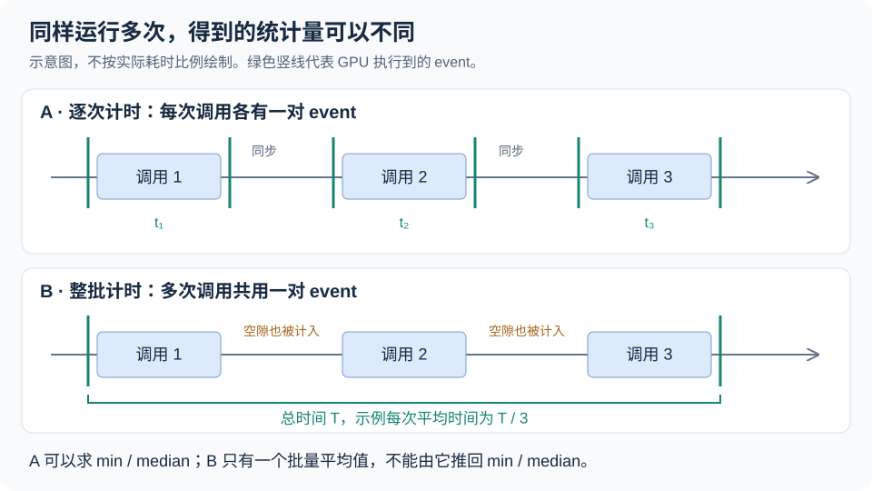

# 第5章 benchmark 与可信计时

## 本章导读

> 在[第 4 章](../../part0-intro/chapter4/index.md)中，我们完成了向量加法并在 GPU 上跑通了最小程序。但当我们动手修改算子、试图让它跑得更快时，常常会遇到第一个现实障碍：测量出来的数字真的可靠吗？如果改动后耗时缩短了 0.05 ms，这究竟是优化生效了，还是仅仅碰巧避开了某次系统的偶然抖动？
>
> 这一章我们沿用向量加法，并引入一个简单的数组复制实验，带你一步步搭建能够经得起重复检验的基准测试（Benchmark）。你将理解设备事件（Event）计时的底层机制，把测得的毫秒数准确换算为有效带宽，并学会把“测量到的事实”与“对现象的解释”清晰分开。你只需要掌握基本的 Python 数组和循环，以及第 4 章建立的 GPU 异步概念；文中出现的 Triton 代码，也完全可以先当作一个普通的“数组复制函数”来理解。

## 5.1 先确定计时的起点和终点

在对比不同实现的性能之前，我们必须先回答一个看似简单却极易混淆的问题：我们常说的“一次向量加法耗时”，衡量的究竟是哪一段工作？

假设两个数组已经存放在显存中，我们的目标是计算 `z = x + y`。在真实程序里，从点击运行到最终拿到结果，完整的流程通常包括：在主机端创建数组、把数据从内存搬运到显卡、从 CPU 下发计算指令、GPU 核心执行核函数，以及最后校验答案的正确性。如果把所有环节统统计时，得到的是整段程序的端到端耗时；如果仅在数据准备就绪后测量纯粹的加法过程，得到的则是算子本身的计算耗时。这两种口径都有其实际用途，但在下结论之前，必须先明确测量的边界。

本章的基准测试聚焦于后者：**在输入和输出已经分配到 GPU 上的前提下，测量重复执行算子时的纯 GPU Event 耗时**。显存分配、数据初始化、初次预热以及答案核对，都被严格排除在计时区间之外。这样做的目的，是为了把精力集中在计算与访存过程本身，避免被单次创建数组的固定开销所干扰。

要做到这一点，我们首先需要理解 GPU 的**异步执行机制**。在日常的 Python 编程中，CPU 发起一次加法调用后，通常只需将计算任务投递到驱动队列，就会立刻返回并继续执行下一行代码；此时，GPU 很可能还没有真正开始运算，更谈不上算完。如果直接在 Python 函数调用前后读取系统时钟，并且中间没有任何显式等待，我们测得的实际上只是 CPU 把任务塞进队列的“下发延迟”，而非 GPU 实际执行计算的时间。对于这个机制，[PyTorch 异步执行文档](https://docs.pytorch.org/docs/2.11/notes/cuda.html#asynchronous-execution)给出了深入的说明。

为了在 GPU 的真实时间线上打上标记，我们需要借助 **Event（事件）**。你可以把 Event 理解为排入 GPU 命令队列的时间戳标记。GPU 上的任务是由**执行流（Stream）**按先后顺序调度执行的：我们在同一条流里，先放入一个起始 Event，紧接着放入加法任务，最后放入一个结束 Event。当 GPU 顺次处理完前两项并抵达结束 Event 时，我们再去读取这两个标记之间经过的时间差。ROCm 生态下的 PyTorch 完全沿用了这些熟悉的接口，`torch.cuda.Event` 和 `device="cuda"` 在本机环境中会自动映射并驱动 AMD GPU，相关细节可参考 [HIP 语义说明](https://docs.pytorch.org/docs/2.11/notes/hip.html)。

| 想回答的问题 | 合适的计时范围 | 本章是否测量 |
| ---- | ---- | ---- |
| 准备好数据后，一次算子执行用了多久？ | 同一执行流上的起止 event | 是 |
| 连续执行多次，平均每次用了多久？ | 一批调用外的起止 event，总时间除以次数 | 是 |
| 包含数据准备和传输，用户一共等了多久？ | 明确包含这些步骤的主机时钟，并在必要位置等待 GPU | 否 |

event 的读数是两个标记在 GPU 时间线上的时间戳之差，并不天然等于 kernel 的执行时长。GPU 按提交顺序执行命令：如果 start 标记执行时队列已空，而 CPU 还没把 kernel 提交过来，GPU 就会空闲等待，这段空隙同样落在两个时间戳之间、被计入结果。因此算子越短，测量值里混入的“CPU 提交延迟”占比越大。要看 kernel 自身的起止时间，需要用 profiler（下一章）。

## 5.2 运行一次完整的基准测试

在拆解代码细节之前，我们先在实验机上跑通完整的基准测试脚本，建立对输出数据和性能指标的直观感知。

配套脚本是 [`code/part1-profiling/chapter5/bench_ch5.py`](https://github.com/datawhalechina/hello-gpu/blob/dev/code/part1-profiling/chapter5/bench_ch5.py)。该脚本主要负责两组基准测试：一组是对包含 $4096 \times 4096$ 个元素的张量执行加法；另一组则是使用 Triton 复制一个单精度（FP32）数组，分别测试数据量为 8 MiB、64 MiB 和 256 MiB 时的表现。

当前运行环境统一为 **Radeon RX 9070 XT（gfx1201）+ ROCm 10.0 + 原生 Ubuntu 24.04**。完成[第 1 章环境准备](../../part0-intro/chapter1/index.md)后，从项目根目录进入本篇环境并运行：

```bash
cd code/part1-profiling
source ./activate-rocm.sh
python chapter5/bench_ch5.py
```

下面保留 **2026-09-11 在 Radeon RX 9070 XT（gfx1201） + 原生 Ubuntu 24.04.4** 上的一次完整运行记录。Python 版本为 `3.12.3`。测试默认进行 20 次预热，随后采集 200 次正式执行。由于设备未锁频，且采样前存在少量后台 GPU 波动，这些历史数值主要用于展示分析方法，不代表极端独占环境下的极限成绩。

<details>
<summary>历史输出节选：向量加法与数组复制 @ RX 9070 XT / 原生 Ubuntu</summary>

```text
GPU: AMD Radeon RX 9070 XT
Python: 3.12.3; Triton: 3.6.0
warmup: 20; repeats: 200; seed: 0

--- A: PyTorch vector add (4096 x 4096, preallocated output) ---
dtype | min_ms | median_ms | GB/s_at_median | validation
fp32 | 0.336605 | 0.338365 | 594.998 | PASS
fp16 | 0.172483 | 0.173443 | 580.383 | PASS

--- B: Triton vector copy (FP32, BLOCK=1024) ---
array_MiB | pair_MiB | batch_avg_ms | GB/s_at_batch_avg | validation
8 | 16 | 0.016711 | 1003.972 | PASS
64 | 128 | 0.223374 | 600.864 | PASS
256 | 512 | 0.901349 | 595.630 | PASS
```

</details>

我们先看第一组加法的输出字段：
- `dtype`：数据类型，FP32 的耗时中位数（`median_ms`）约为 **0.338 ms**，对应换算出的有效带宽（`GB/s_at_median`）约为 **595 GB/s**；
- `validation`：正确性校验状态。`PASS` 表明脚本在计时之外遍历了整个输出数组，确认每个元素都落在有限值区间且严格等于期望值 3。复制实验同样会逐元素对比输入与输出，并明确拒绝 NaN 和 Inf。

注意到两张表的时间统计指标并不相同：加法测试汇报的是单次样本的 `min_ms` 和 `median_ms`，而复制实验汇报的则是整批折算的 `batch_avg_ms`。我们接下来通过代码实现，剖析两者为何会产生这种差异。

## 5.3 从准备数据到记录一个样本

看到测试结果后，我们回到代码本身。向量加法测试究竟是如何组织输入、剔除外部干扰并精准记录每个样本的？以下代码片段均摘自配套脚本。

### 5.3.1 固定输入，提前准备输出

首先是张量的显存分配与初始化：

```python
x = torch.ones(shape, dtype=dtype, device="cuda")
y = torch.full_like(x, 2.0)
z = torch.empty_like(x)
```

这里将输入分别初始化为全 1.0 和全 2.0，目的是让每一个输出位置都有明确且已知的标称理论值（3.0），便于在基准测试前后快速核对算子是否产出预期结果、是否产生 NaN 或明显数值偏差。

不过需要明确这种核对的边界：**全常量输入不能代替全面的单元测试**。如果核函数内部存在线程索引错位、相邻元素读取混淆等逻辑错误，全相同的元素值很可能会将这些 bug 掩盖过去；此外，向合法缓冲区边界之外的越界写入，也无法仅凭输出数组内部的值被发现。

特别需要注意 `torch.empty_like(x)`：它只在 GPU 上分配对应大小的显存块，完全不进行数据填充。在正式评测中，调用 `torch.add(x, y, out=z)` 可以直接将结果写入预先分配好的显存地址 `z`。这样既保证了每次迭代使用的输出存储始终稳定，也完全避开了在循环体内重复向显存分配器申请空间的额外开销。

当我们将数据类型从 FP32 切换到 FP16 时，张量形状（即元素总数）完全保持一致；变化的是单个元素的存储宽度（从 4 字节降为 2 字节），整体占用空间直接减半。

### 5.3.2 预热：先执行，再开始收集样本

分配好张量后，并不能马上开始计时，而是必须先执行一定次数的预热：

```python
for _ in range(warmup):
    torch.add(x, y, out=z)
torch.cuda.synchronize()
check_add(z)
```

**预热（Warmup）**用于减少首次执行对测量的影响。初次调用可能包含驱动上下文初始化、JIT 编译或内核加载等准备工作，因此先执行几次，把这些开销留在正式计时之外。运行期间 GPU 频率也可能变化，是否已经稳定需要另外观察。

固定次数的预热不能保证频率恒定或测量稳定。改变数据规模、数据类型或 kernel 后，应针对新条件重新预热，再通过多次独立复测，比较中位数与样本分布，判断差异是否超过运行波动。

执行完预热循环后，代码调用 `torch.cuda.synchronize()` 阻塞等待 GPU 处理完所有的前期任务，并调用 `check_add(z)` 对结果做全量核对，确认即将接受测量的确实是一个能算出正确结果的算子。

这里的预热和正式计时反复使用同一组输入、输出数组，数据可能保留在片上缓存（Cache）中。这属于当前实验的条件，与每次处理新数据的测试不同；不能把预热后的结果直接当作纯显存带宽。

### 5.3.3 用一对 event 收集多次时间

完成预热后，测试进入正式采样循环：

```python
times = []
for _ in range(repeats):
    start.record()
    torch.add(x, y, out=z)
    end.record()
    end.synchronize()
    times.append(start.elapsed_time(end))
check_add(z)
```

我们来梳理这六行代码在时间线上的实际动作：
1. `start.record()`：向 GPU 执行流中插入起始标记；
2. `torch.add(x, y, out=z)`：向执行流排入加法内核任务；
3. `end.record()`：在同一执行流中紧随内核之后插入结束标记；
4. `end.synchronize()`：CPU 端显式阻塞，等待 GPU 执行完 `end` 标记；
5. `times.append(...)`：读取该次执行跨越的毫秒数，追加到样本列表中。

这一循环产出的是 **200 个独立的单次执行时间样本**。由于 CPU 在每次迭代后都等待了 `end` 同步，这种节奏避免了大量任务在 GPU 队列中积压，但也让下发节奏受到了 CPU 循环的影响。如果将循环改写为“一口气下发 200 次内核，最后只同步一次”，测量所对应的硬件排队与执行条件就会随之改变。

## 5.4 单次样本与批量平均值

在加法测试和复制测试中，我们分别采取了两种截然不同的测量和统计方式。

@fig-event-sampling 示意了这两种方式的本质区别：

::: figure fig-event-sampling


逐次计时保留每次调用的信息；整批计时包含起止标记之间的调用与空隙，只得到一个批量平均值。
:::

对于向量加法收集到的 200 个样本列表，脚本计算出两个典型指标：

```python
min_ms = min(times)
median_ms = statistics.median(times)
```

- **最小值（min）**：代表整批采样中最平稳、最快的一次。它反映了系统在极少受到后台扰动时的潜在最好表现，但不能代表算子每次都能稳定触达的速度。
- **中位数（median）**：将所有样本从小到大排序后截取正中间的值。相比平均值（mean），中位数对偶发出现的异常慢样本（比如操作系统调度开销）具有极强的抵抗力，更忠实地反映了绝大多数调用的集中趋势。

本章后续计算向量加法的有效带宽时，统一采用中位数作为代表时间，并附带汇报最小值作为参考。

复制实验采用另一种方式，整批调用采用如下计时方式：

```python
start.record()
for _ in range(repeats):
    copy_kernel[grid](x, y, n, BLOCK=block)
end.record()
end.synchronize()
batch_avg_ms = start.elapsed_time(end) / repeats
```

用一对 Event 包裹整批调用，测出完成 $R$ 次循环的总耗时 $T$，再均摊得到单次调用的平均耗时 $T/R$。这种做法将 Event 记录和 GPU 同步的频次降到了最低，显著减少了主机端的打点开销。但其代价是：总耗时平摊后掩盖了每次调用之间的时间离散度，我们无法从中获知耗时的波动区间与离群样本。**批量平均值既不是最小值，也不是中位数**；若想考察系统在整批执行时的稳定性，通常需要多次运行整批测试并记录各自的均值分布。

这里用于评测的 `copy_kernel` 使用 Triton 编写。Triton 允许我们用贴近 Python 的高层语法表达 GPU 上的分块并行逻辑，并在运行时即时编译（JIT）为高效的机器码。在本章中，我们主要借用它提供一个结构清晰的单算子实现：它完成 `y[i] = x[i]` 的按元素搬运，每个计算实例（Program）负责处理连续的一组元素（最多 1024 个），越界部分通过 `mask` 掩码做安全保护。

<details>
<summary>代码：Triton 数组复制核函数</summary>

```python
@triton.jit
def copy_kernel(x_ptr, y_ptr, n, BLOCK: tl.constexpr):
    pid = tl.program_id(0)
    offs = pid * BLOCK + tl.arange(0, BLOCK)
    mask = offs < n
    tl.store(y_ptr + offs, tl.load(x_ptr + offs, mask=mask), mask=mask)
```

</details>

需要再次强调：向量加法与数组复制在计算逻辑、底层框架（PyTorch 原生算子 vs 手写 Triton 内核）以及采样机制（逐次采样 vs 整批均摊）上都存在差异。将它们放在同一章，是为了展示不同评测场景下的测量方法，切忌凭这组数据直接判定“PyTorch 与 Triton 谁更胜一筹”。要做出公正的横向对比，必须严格控制在相同的计算任务、输入规模和计时口径之下。

## 5.5 从时间算出有效带宽

在基准测试的输出中，除了毫秒数，最引人注目的往往是每秒传输字节数（`GB/s`）。这个数字是如何计算出来的？它与显卡的硬件物理带宽又是什么关系？

### 5.5.1 向量加法要读写多少数据

我们先明确计算所需的已知量。假设待处理的数组包含 $N$ 个元素，每个元素在内存中占用 $s$ 字节。完成一次完整的向量加法 `z = x + y`，算法需要执行以下三步访存：
1. 从显存读取数组 `x`，读取量为 $N \cdot s$ 字节；
2. 从显存读取数组 `y`，读取量为 $N \cdot s$ 字节；
3. 将计算结果写回数组 `z`，写入量为 $N \cdot s$ 字节。

因此，单次向量加法在算法逻辑上要求的数据读写总量为：

$$
B = 3Ns.
$$

在我们的 FP32 实验中，张量形状为 $4096 \times 4096$，即 $N = 16\,777\,216$ 个元素；单精度浮点数每个元素占用 $s = 4$ 字节。将这些已知量代入公式，可得一次加法涉及的有效数据量：

$$
B = 3 \times 16\,777\,216 \times 4 = 201\,326\,592\text{ 字节} \approx 192\text{ MiB}.
$$

**有效带宽（Effective Bandwidth）**定义为算法逻辑数据量与实测耗时之比：

$$
\mathrm{BW}_{\mathrm{eff}} = \frac{B}{t}.
$$

在计算时，需统一将时间 $t$ 转换为秒（s），将数据量换算为十进制的吉字节（$1\text{ GB} = 10^9\text{ Byte}$）。代入本次实验测得的耗时中位数（0.338365 ms），推导如下：

$$
\mathrm{BW}_{\mathrm{eff}}
= \frac{201\,326\,592}{0.338365 \times 10^{-3}} \div 10^9
\approx 595\ \mathrm{GB/s}.
$$

在配套代码中，我们直接调用张量对象的元数据接口获取元素总数和单元素字节大小，避免手动修改数据类型时遗漏推导系数：

```python
bytes_moved = 3 * x.numel() * x.element_size()
gbs = bytes_moved / (median_ms * 1e-3) / 1e9
```

而在完全相同环境下的 FP16 实验中，测得的中位数约为 0.173 ms，对应有效带宽约为 580 GB/s。对比两组实验：元素总数完全相同，但由于半精度的单元素字节数减半（$s = 2$），逻辑数据搬运量减半，最终耗时也相应缩减了近一半。这一现象直观契合了“访存量主导了向量加法耗时”的理论预期；但仅凭两个数据点，我们还不能草率断定硬件的显存总线已被彻底压榨到极限。

### 5.5.2 复制时，单个数组和读写总量不同

对于数组复制操作 `y = copy(x)`，逻辑上只需读入一次 `x`、写出一次 `y`，因此算法数据总量为 $B = 2Ns$。

这里需要格外警惕测试输出中的两列规格：`array_MiB` 表示**单个张量的大小**，而 `pair_MiB` 则是输入与输出两个张量的空间总和（即 $2Ns$），它恰好对应一次复制所需的逻辑数据量。

| 单个数组 | 两个数组合计 | 一次复制的算法数据量 |
| ----: | ----: | ----: |
| 8 MiB | 16 MiB | $16\times2^{20}$ 字节 |
| 64 MiB | 128 MiB | $128\times2^{20}$ 字节 |
| 256 MiB | 512 MiB | $512\times2^{20}$ 字节 |

在日常交流中，“兆（M）”和“吉（G）”常常被含糊使用，但换算性能时必须严格界定进制：
- 二进制单位：$1\ \mathrm{MiB} = 2^{20} = 1\,048\,576\text{ 字节}$；
- 工业标准的十进制速率单位：$1\ \mathrm{GB/s} = 10^9\text{ 字节/秒}$。

如果直接拿 MiB 除以毫秒，会由于进制混淆导致约 4.86% 的计算偏差。脚本中严格执行了先转纯字节、再除以十进制基数的换算流程：

```python
bytes_moved = 2 * x.numel() * x.element_size()
gbs = bytes_moved / (batch_avg_ms * 1e-3) / 1e9
```

### 5.5.3 有效带宽不等于显存总线的实测流量

在复制实验的测试结果中，呈现出了一个极具启发性的现象：
当单个数组为 8 MiB 时，算出的有效带宽高达约 **1004 GB/s**；而当数组扩大至 64 MiB 和 256 MiB 时，有效带宽则回落到了 601 GB/s 与 596 GB/s 左右。

为什么较小规模的数据复制能跑出远超大数组的“等效带宽”？
这里需要区分**工作集（Working Set）**与硬件存储层级。在评测中，算子反复对同一对张量进行读写。当张量较小时，数据总量可以完整容纳在 GPU 的大容量片上高速缓存（L2/L3 Cache）中。对于算法而言，它依然完成了 $2Ns$ 字节的逻辑读取与写入；但对硬件而言，大量访问直接在高速的片上缓存中完成命中，无需每次都穿越相对较慢的 GDDR6 物理显存总线。

但这属于基于体系结构原理的**合理推测**。在当前的基准测试中，我们手中掌握的客观事实只有两条：逻辑数据量以及 GPU Event 记录的耗时；我们并没有调用底层硬件性能计数器去真正统计 GDDR6 物理通道上的真实事务包数。因此，我们不能草率地下结论说“8 MiB 必然 100% 命中了缓存”，也不能断言“596 GB/s 就是这块 GPU 的物理显存总线极限”。

本章的核心原则是：**明确测量的口径与前提，据实报告观察结果，将理论假设留待进一步验证。** 在下一章中，我们将学会借助专业 Profiler 收集底层证据；在第 7 章中，再将这些数据纳入 Roofline 模型的统一框架中进行审视。

## 5.6 复测、记录与练习

掌握了测量与换算方法后，我们来看如何沉淀一份具备可复现性的实验记录。

当你在实验机上重新运行脚本时，打印出的耗时和带宽大概率不会与文档中的每一个小数位完全吻合——这是物理硬件运行时的正常波动。判断实验是否成功的关键，在于确认以下核心要素是否受控一致：相同的硬件与驱动环境、确定的输入规模与数据类型、充分的预热次数、一致的重复采样数，以及相同的统计指标。

如果要在两个有细微差距的实现之间分出高下，绝对不能只在单次运行中挑一个看起来最亮眼的数字，而应当在同等条件下交替多次独立运行，对比它们整体的中位数与分布范围。

配套脚本支持通过命令行参数灵活调整测试轮次。例如，我们可以显式指定增加预热与采样次数：

```bash
python chapter5/bench_ch5.py --warmup 40 --repeats 100
```

这条命令同时变更了预热与正式采样两个参数，适用于观察更深度的稳态表现。但在设计对照实验时，每次应仅改变一个独立变量，避免因多变量耦合而无法归因。

一份规范的基准测试记录应当完整记录五项要素：运行环境与测试日期、完整的执行命令与代码哈希、输入规模与结果校验方式、明确的计时区间与统计口径，以及直接观察到的数值与待验证假设。本章对应的本地实验底稿和原始运行日志分别存放于 `code/part1-profiling/chapter5/EXPERIMENT.md` 和 `logs/bench-native-2026-09-11.log`。

完成本章学习后，你可以尝试回答以下问题以检验对测量边界的理解：

1. 对于 FP16 向量加法，算法逻辑数据量是多少字节？代入 0.173443 ms 的耗时，能否独立推导出输出表格中的有效带宽？
2. 如果某套测试系统只记录了 200 次内核运行的总时间，我们还能从中恢复出单次调用的中位数吗？为什么？
3. 如果把输出数组的显存分配（`empty_like`）移入每次加法内部，测试条件发生了什么根本变化？此时的计时范围应当如何重新定义？
4. 对于单个大小为 8 MiB 的复制数组，完成一次复制的算法数据搬运总量是多少？如果误将单个数组大小当作了搬运总量，计算出的有效带宽会有什么偏差？
5. 针对小数组复制测出更高有效带宽的现象，请分别写出一条“已由实测支持的事实”和一条“尚未获独立证据验证的推测”。

<details>
<summary>自检提示：单位、统计量与结论边界</summary>

1. $3 \times 4096^2 \times 2 = 100\,663\,296\text{ 字节}$（即 96 MiB）。除以 $0.173443 \times 10^{-3}\text{ s}$ 再除以 $10^9$，可算出有效带宽约为 580 GB/s。
2. 不能。总时间只能计算出包含可能存在的下发间隙在内的粗粒度均值，单次调用的时间分布与波动极值信息在求和过程中已经彻底丢失。
3. 计时区间内混入了显存分配器的管理开销（寻找空闲块、切分或触发驱动系统调用），甚至可能伴随 CPU 与驱动的隐式等待；此时测得的是“显存动态分配 + 内核计算”的组合耗时，不再是纯粹的算子执行性能。
4. 算法需同时读取输入和写出输出，数据搬运总量为 16 MiB（$16 \times 2^{20}\text{ 字节}$）。若误按 8 MiB 计算，得出的有效带宽将只有真实算法有效带宽的一半。
5. 事实：“在相同计时方法下，8 MiB 数组测得的有效带宽（约 1004 GB/s）明显高于 256 MiB 数组（约 596 GB/s）”；推测：“小数组的高有效带宽是因为全部数据都命中了片上缓存”。

</details>

## 本章小结

- **先明确计时边界，再选择计时工具**：GPU Event 测量的是执行流中两个打点之间的硬件时间；经过精确同步的 CPU 计时器可用于全链路测量。不要把显存分配与初始化的开销混入算子本身的执行时间。
- **预热与复用属于测量条件**：预热用于减少冷启动影响，是否稳定仍需通过复测与样本分布判断；循环中复用张量可能利用缓存，结论需保留这一条件。
- **单次采样与整批折算反映不同信息**：逐次测量能够产出时间分布并得到抗抖动的中位数；整批计时平摊了开销但丢失了波动细节，二者不可混为一谈。
- **算法有效带宽是逻辑概念**：有效带宽由算法读写的逻辑字节数除以耗时得到，不等于硬件实际显存流量除以耗时。

在建立了可信的基准测试之后，如果发现某个实现明显变慢，光看时间数字无法回答“它到底卡在哪”。[第 6 章](../chapter6/index.md)我们将为向量加法挂上 `rocprofv3`，通过 Kernel Trace 观察底层线程分工与执行轨迹。

## 延伸阅读

- [《动手学深度学习》：异步计算](https://zh.d2l.ai/chapter_computational-performance/async-computation.html) — 从程序执行顺序理解异步与同步。
- [PyTorch：异步执行与计时](https://docs.pytorch.org/docs/2.11/notes/cuda.html#asynchronous-execution) — 解释主机调用和设备执行的关系。
- [PyTorch：Event](https://docs.pytorch.org/docs/2.11/generated/torch.cuda.Event.html) — event 的记录、等待与时间单位。
- [HIP Performance Guidelines](https://rocm.docs.amd.com/projects/HIP/en/latest/how-to/performance_guidelines.html) — 进一步了解性能测量与优化。
