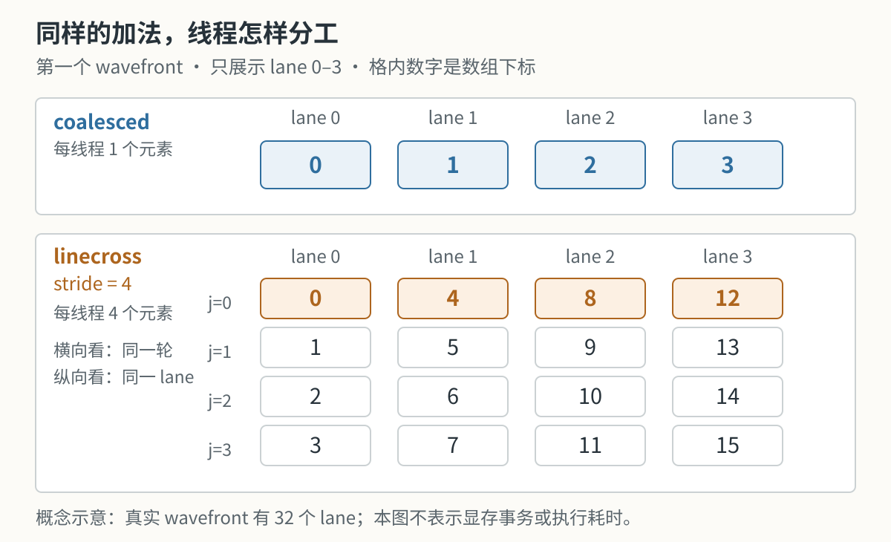

# 第6章 用 rocprof 找到慢在哪里

## 本章导读

> 在第 5 章，我们学会了给 GPU 程序计时。现在考虑一个具体问题：同样计算 `c[i] = a[i] + b[i]`，为什么换一种线程分工后，时间变长了？
>
> 本章先运行两个实现，确认差距；再用 `rocprofv3` 记录 kernel 的执行过程，读懂其中一条记录；最后回到代码，检查到底改变了什么。你需要了解第 4 章的线程编号和第 5 章的 GPU event，无需提前掌握性能分析工具。

本章的性能数据保留自 **2026-07-06，Radeon RX 9070 XT（gfx1201）+ ROCm 7.13 + 原生 Ubuntu 24.04** 的实验。下面的时间表没有使用旧 WSL2 数据，也不是本轮文档修订重新测得的结果。我们重点学习怎样从记录得到结论，不要求你的每次运行都复现相同的小数。

## 6.1 先运行两个向量加法

这一节先得到可以比较的结果。暂时把两个实现看成两个完成相同任务的函数，下一节再展开它们的代码。

### 6.1.1 准备程序

下面的命令在实验机的 Linux 终端执行。开始前，需要完成[第 1 章的 ROCm 环境](../../part0-intro/chapter1/index.md)，并准备好[第 5 章使用的 Part 1 环境](../chapter5/index.md)。本篇环境需要使用自己的依赖清单；环境尚未建立时，先按第 1 章的方法在 `code/part1-profiling/` 同步依赖，再激活。

本章源文件是 `code/part1-profiling/chapter6/vector_add.hip`。从仓库根目录开始：

```bash
cd code/part1-profiling
source ./activate-rocm.sh
cd chapter6
mkdir -p logs
hipcc --offload-arch=gfx1201 -O3 vector_add.hip -o vector_add_bench
```

前两步选择本篇的环境，`hipcc` 把 HIP 源码编译成可执行文件 `vector_add_bench`。`--offload-arch=gfx1201` 指定实验卡的架构，`-O3` 开启编译优化。后续命令都在这个 `chapter6/` 目录内运行。

### 6.1.2 运行基准

先测 `coalesced`，再测 `linecross`。这两个名字用来选择源码中的 kernel；`linecross` 是本章给对照实现起的名字，不是 ROCm 的标准术语。

```bash
./vector_add_bench --kernel coalesced --size 16777216 --block 256 \
    --warmup 20 --repeat 100 \
    --output-json logs/coalesced_size16777216.json

./vector_add_bench --kernel linecross --size 16777216 --block 256 --stride 32 \
    --warmup 20 --repeat 100 \
    --output-json logs/linecross_stride32_size16777216.json
```

两个命令使用同样的数组长度和 block 大小。我们先认清几个参数：

| 参数 | 这次运行的含义 |
| ---- | ---- |
| `--size 16777216` | 每个数组含 $2^{24}$ 个 `float` 元素 |
| `--block 256` | 每个 block 有 256 个线程 |
| `--stride 32` | 在 `linecross` 中，每个线程连续处理 32 个元素；下一节解释地址如何分配 |
| `--warmup 20` | 先启动 20 次 kernel，预热结果不参与统计 |
| `--repeat 100` | 再测量 100 次 kernel，输出最小值、中位数和平均值 |
| `--output-json` | 将本次参数和结果保存到指定文件 |

计时起止 event 包住一次 kernel 启动，输入已提前准备好，不包含显存分配和主机与设备之间的数据拷贝。与第 5 章一样，这是两个 event 之间的设备时间；若提交过程产生空隙，也可能被计入。程序逐次使用 HIP event 计时，三个统计量来自同一组样本。

2026-07-06 的原生 Ubuntu 实验记录如下。有效带宽使用**最短时间**换算，因此阅读一行时，要将它和 `min_ms` 对应起来。

| 实现 | 最短时间 | 中位数 | 有效带宽 |
| ---- | ----: | ----: | ----: |
| coalesced | 0.334 ms | 0.335 ms | 603 GB/s |
| linecross，stride=32 | 2.25 ms | 2.53 ms | 89.7 GB/s |

有效带宽的算法口径和第 4 章相同：读一个 `float` 的 `a[i]`，读一个 `float` 的 `b[i]`，再写一个 `float` 的 `c[i]`，合计 12 B。因此

$$
B_{\mathrm{effective}} = \frac{12n}{t}.
$$

其中 $t$ 以秒为单位，除以 $10^9$ 后得到 GB/s。这个数统计的是算法有效字节，并不是性能计数器测得的物理显存流量。

现在能确认：在这组输入上，`linecross stride=32` 的最短耗时约为连续版的 **6.7 倍**。但“更慢”还不是原因。为了往下分析，我们先看看线程做的工作有什么不同。

::: tip 怎样理解程序输出的 OK
本章现有程序只抽查前 `min(1024, n)` 个输出，`correctness=OK` 表示这部分样本未报告误差，不等于全数组验证。它的误差判断也没有单独拒绝 NaN。下面保留历史计时用于学习 profiling；在把修改后的 kernel 当作正确实现之前，应先在计时外补齐全数组和非有限值检查。
:::

## 6.2 把线程分工画出来

这一节比较两个 kernel 的索引。它们都计算完整的向量加法，但将这些加法分给线程的方式不同。

### 6.2.1 一个线程处理一个元素

`coalesced` 使用我们在第 4 章见过的全局线程编号。下面是源文件中的完整函数：

```cpp
__global__ void kernel_coalesced(const float* __restrict__ a,
                                 const float* __restrict__ b,
                                 float*       __restrict__ c,
                                 int n) {
    int idx = blockIdx.x * blockDim.x + threadIdx.x;
    if (idx < n) {
        c[idx] = a[idx] + b[idx];
    }
}
```

`idx` 决定当前线程读写哪个数组元素。先看第一个 wavefront：lane 0、1、2 分别处理元素 0、1、2。相邻 lane 的地址也相邻，这有利于 GPU 合并同一条访存指令的地址请求，称为**合并访存（memory coalescing）**。`__restrict__` 告诉编译器，这几个指针在这里不指向相互重叠的数据区域；它不负责计算线程编号。

每个线程只计算一个结果。对于本章的数组长度和 block 大小，程序启动 $16\,777\,216 / 256 = 65\,536$ 个 block。

### 6.2.2 一个线程处理一段元素

`linecross` 把一个 wavefront 负责的数据切成 32 段，每段有 `stride` 个元素，再把一段交给一个 lane。为了方便手算，@fig-linecross-index-map 用 `stride=4` 展示前 4 个 lane。

::: figure fig-linecross-index-map


线程与元素下标的概念示意。每格表示数组下标，仅展示 lane 0–3；真实 kernel 按 32 个 lane 划分一个 wavefront。
:::

读 @fig-linecross-index-map 时，先横向看 `j=0`：4 个 lane 处理下标 0、4、8、12。再纵向看 lane 0：它依次处理下标 0、1、2、3。**同一轮中，lane 之间的地址分散；同一个 lane 的多轮访问则是连续的。**

这些编号由下面的代码得到。它是源文件中的完整 `kernel_linecross`：

```cpp
__global__ void kernel_linecross(const float* __restrict__ a,
                                 const float* __restrict__ b,
                                 float*       __restrict__ c,
                                 int n,
                                 int stride) {
    const int W = 32;
    int waves_in_block = blockDim.x / W;
    int wave_in_block  = threadIdx.x / W;
    int lane           = threadIdx.x & (W - 1);
    int wave_id        = blockIdx.x * waves_in_block + wave_in_block;
    int tile_base      = wave_id * W * stride;          // 本 wave 的连续 tile 起点
    int my_start       = tile_base + lane * stride;     // 本 lane 负责的连续 stride 个元素起点
    #pragma unroll
    for (int j = 0; j < stride; ++j) {
        int idx = my_start + j;
        if (idx < n) {
            c[idx] = a[idx] + b[idx];
        }
    }
}
```

这段代码可以分成三步阅读：

1. 前几行得到全局 `wave_id` 和 wavefront 内的 `lane`，`W=32` 是本例使用的分组宽度。
2. `tile_base` 是这个 wavefront 负责的数据区间起点；`my_start` 再向后移动 `lane × stride` 个元素，找到当前线程的起点。
3. 循环中的 `idx = my_start + j` 沿着这段数据前进，`idx < n` 防止越过数组末尾。

把 `stride` 换成本次实验的 32，在第一个 wavefront 的 `j=0` 中，各 lane 访问下标 0、32、64、96。相邻起点相隔 32 个 `float`，也就是 128 B。这是**源码计算出的地址间距**，并没有告诉我们硬件实际产生了多少条显存事务。

还有一个变化很容易漏掉：现在一个线程要做 32 次加法，同样的 $n$ 个输出只需要原来 1/32 的线程。因此 `stride` 同时影响地址间距、线程循环次数和总线程数。我们后面必须把它们一起考虑。

## 6.3 让 rocprofv3 记录 kernel 的执行

这一节给运行过程增加一份记录。**kernel trace** 可以理解成一张清单：每启动一次 kernel，就记录它的名字、开始时间、结束时间和启动配置；一次启动称为一次 **dispatch**。

GPU event 可以回答“我计时的这段工作花了多久”。当一个程序调用很多 kernel 时，trace 还能帮助我们分清是哪一个 kernel 占用了时间。本章只有两个已知实现，正好可以用它们学习读表。

### 6.3.1 工具从哪里来

本章使用的命令行工具是 **`rocprofv3`**。它来自 ROCprofiler-SDK，在本章实验机上已经随系统 ROCm 工具环境准备好；激活 Python 虚拟环境本身不等于安装了这个工具。如果终端找不到该命令，应先按 [AMD 的 ROCprofiler-SDK 安装说明](https://rocm.docs.amd.com/projects/rocprofiler-sdk/en/latest/install/install.html)检查系统安装和可执行文件路径，再继续本节。

本节只开启 `--kernel-trace`，不要求先配置硬件性能计数器。命令和输出列名以本章保留的 ROCm 7.13 实测为准，其他版本可查 [AMD 的 rocprofv3 使用说明](https://rocm.docs.amd.com/projects/rocprofiler-sdk/en/latest/how-to/using-rocprofv3.html#kernel-trace)。

### 6.3.2 采集连续版，再采集 linecross

先在已经编译好的程序外面包一层 `rocprofv3`：

```bash
rocprofv3 --kernel-trace -o logs/final_kt_coalesced.csv -f csv \
    -- ./vector_add_bench --kernel coalesced --size 16777216 --block 256 \
       --warmup 5 --repeat 10
```

这里的 `--` 是分界线：左边是 profiler 的参数，右边是原程序及其参数。`--kernel-trace` 选择记录 kernel，`-f csv` 选择表格格式，`-o` 指定输出文件前缀。

这次只记录 5 次预热和 10 次正式启动，便于逐行阅读。**这是单独的 profiling 运行，不是替换上一节的 100 次 benchmark。** 不把 profiler 运行中的程序计时混进基准结果。

再采集 `linecross stride=32`：

```bash
rocprofv3 --kernel-trace -o logs/final_kt_linecross32.csv -f csv \
    -- ./vector_add_bench --kernel linecross --size 16777216 --block 256 --stride 32 \
       --warmup 5 --repeat 10
```

在本章这次运行中，生成的 kernel 记录文件是：

```text
logs/final_kt_coalesced.csv_kernel_trace.csv
logs/final_kt_linecross32.csv_kernel_trace.csv
```

注意后缀是 `_kernel_trace.csv`。`-o` 中虽然已经写了 `.csv`，工具仍会在这个前缀后追加记录类型；不要只寻找一个叫 `final_kt_coalesced.csv` 的文件。旁边的 `_agent_info.csv` 记录设备信息，不是要统计的 kernel 时间表。

## 6.4 从 CSV 中读懂一次启动

这一节打开 `final_kt_coalesced.csv_kernel_trace.csv`，按“名字 → 时间 → 线程数”的顺序读一条记录。CSV 是逗号分隔的表格，可以用文本编辑器或表格软件打开。

### 6.4.1 先选对记录

本次两个文件都各有 **16 条 dispatch 记录**，其中只有 15 条是我们的向量加法：5 次预热和 10 次正式启动。末尾还出现了一条 `__amd_rocclr_copyBuffer`，来自运行时的数据拷贝。

因此，统计时先按 `Kernel_Name` 选择目标 kernel，再按启动顺序跳过它的前 5 次。不要直接对整个 CSV 删掉前 5 行后取平均，否则会把拷贝 kernel 也算进去。

::: figure fig-trace-record-selection


本章 trace 的记录分组。每格代表一条记录，宽度不表示执行时间；统计前先筛选 kernel 名称，再排除预热。
:::

@fig-trace-record-selection 中的蓝色记录才是这次统计对象。对于更复杂的程序，其他 kernel 还可能出现在中间，所以“按名字筛选”比假定它总在最后一行更可靠。

### 6.4.2 计算一条记录的时间

下面将连续版 `Dispatch_Id=6` 的几个字段竖着排开。这些值摘自 2026-07-06 的原始 CSV：

| 字段 | 原始值 | 含义 |
| ---- | ---- | ---- |
| `Kernel_Name` | `kernel_coalesced(float const*, float const*, float*, int)` | 这条记录对应哪个函数；括号内是参数类型 |
| `Dispatch_Id` | `6` | 这次启动的编号；本次恰好是目标 kernel 的第一次正式计时 |
| `Start_Timestamp` | `62486600995446` | 开始时间戳，单位 ns |
| `End_Timestamp` | `62486601325050` | 结束时间戳，单位 ns |
| `Workgroup_Size_X` | `256` | 本例一维 block 的线程数 |
| `Grid_Size_X` | `16777216` | 本例一维 grid 的总线程数 |

两个时间戳的绝对值不需要记忆。只要相减，就得到该次 kernel 的持续时间：

$$
\begin{aligned}
\Delta t &= 62486601325050 - 62486600995446\\
         &= 329604\ \mathrm{ns}\\
         &= 329.604\ \mathrm{\mu s}\approx 0.330\ \mathrm{ms}.
\end{aligned}
$$

这是 GPU 上这个 kernel 的执行时间，不是 CPU 调用启动函数的时间，也不是整个程序的运行时间。用表格软件打开 CSV 时，可以新增一列“结束时间戳减开始时间戳”，再除以 1000 得到 μs。

### 6.4.3 再看启动了多少个线程

`Workgroup` 在这份 CSV 中对应 HIP 的 block；`Grid_Size_X` 则是整个 grid 的线程数，**不是 block 数**。因为本例的 Y、Z 维度都是 1，所以可以直接计算：

$$
\text{block 数} = \frac{\text{Grid\_Size\_X}}{\text{Workgroup\_Size\_X}}.
$$

对两个 kernel 的 10 次正式记录分别求最小值和中位数，得到：

| kernel | 最短时间 | 中位数 | `Grid_Size_X` | `Workgroup_Size_X` | block 数 |
| ---- | ----: | ----: | ----: | ----: | ----: |
| `kernel_coalesced` | 329 μs | 330 μs | 16 777 216 | 256 | 65 536 |
| `kernel_linecross`，stride=32 | 2202 μs | 2304 μs | 524 288 | 256 | 2048 |

连续版的 trace 最短时间约 0.329 ms，前面的独立 benchmark 最短时间约 0.334 ms，二者接近；`linecross` 在两种运行中也都明显更慢。这支持我们继续检查 `linecross`，但不要求两次独立采样的小数完全一致。

再横向看启动配置：block 大小仍是 256，但总线程数已经缩小到 1/32。这和上一节从索引代码得到的推导一致。**Grid 小了只表示本次共启动的工作变少，不能直接读成 GPU 同时驻留的线程比例。**

## 6.5 这些证据还不能说明什么

这一节把静态资源和计数器放回它们各自能回答的问题，避免由一个数字跳到完整的性能解释。

### 6.5.1 寄存器数量不是利用率

第 3 章介绍过 VGPR、SGPR 和 LDS。trace 中还记录了对应的静态资源字段：

| 字段 | coalesced | linecross，stride=32 | 在这里怎样理解 |
| ---- | ----: | ----: | ---- |
| `VGPR_Count` | 8 | 16 | 工具报告的向量寄存器分配计数 |
| `SGPR_Count` | 128 | 128 | 工具报告的标量寄存器分配计数 |
| `LDS_Block_Size` | 0 B | 0 B | 每个 block 的 LDS 分配量；这两个函数没有使用 LDS |

这些是工具报告的资源分配，不是运行时“寄存器忙了多少”的测量。仅凭 VGPR 从 8 变成 16，不能断言性能就会下降一半；仅凭 LDS 为 0，也不能判断 kernel 没有等待数据。

我们还可以用 `linecross stride=1` 检查同一个函数的不同运行参数：

```bash
./vector_add_bench --kernel linecross --size 16777216 --block 256 --stride 1 \
    --warmup 20 --repeat 100 \
    --output-json logs/linecross_stride1_size16777216.json
```

在 2026-07-06 的同组实验中，它的最短时间为 **0.336 ms**，与连续版的 **0.334 ms** 接近。`stride=1` 和 `stride=32` 使用的是同一个编译后的 `kernel_linecross`，所以改变这个运行参数不会改变静态寄存器或 LDS 分配。

这排除了“两个 stride 值编译出了不同静态资源分配”的解释，却没有排除工作划分的影响。`stride` 增大时，每个线程的循环更长，整个 grid 更小；实际并发情况仍需进一步分析。

### 6.5.2 返回 0 的计数器不能直接拿来解释访存

硬件性能计数器（performance counter，PMC）可以记录执行过程中的某些事件，例如 wavefront 数量或访存相关活动。但“文件里有一列”不代表当前环境已经获得可信的测量。

本章 **2026-07-08** 在同一原生 Ubuntu、RX 9070 XT、ROCm 7.13 环境复核时，`FETCH_SIZE`、`GL2C_HIT_sum`、`SQ_INSTS_VALU` 和 `OccupancyPercent` 返回 0；这组值不足以作为显存字节数、缓存命中或占用率的证据。它们也不能被解释成“没有访存”“没有执行指令”或“占用率确实是零”。

另一方面，`GPUBusy` 和 `Wavefronts` 在该次检查中有非零值，所以也不能说所有 PMC 都不可用。本章只使用已经核对过的 event、kernel trace 和源码推导，不由这些无效零值推断缓存行为。后续工具版本或设备配置的结果，应重新验证；这里记录的是当时的实验边界。

## 6.6 用 stride 扫描提出下一步实验

这一节进一步改变 `stride`，观察整体趋势，再判断这个实验还缺什么对照。

在同一 `chapter6/` 目录运行已有的扫描命令：

```bash
for s in 1 2 4 8 16 32 64 128 256; do
    ./vector_add_bench --kernel linecross --size 16777216 --block 256 --stride $s \
        --warmup 20 --repeat 50 \
        --output-json logs/linecross_s${s}.json
done
```

下面保留 2026-07-06 的完整扫描结果，统计量都是各配置 50 次计时中的最小值。它与前面 100 次重复的基准是两组独立采样，因此同一配置可能略有不同。

| stride | 最短时间 | 有效带宽 |
| ----: | ----: | ----: |
| 1 | 0.338 ms | 596 GB/s |
| 2 | 0.336 ms | 600 GB/s |
| 4 | 0.336 ms | 600 GB/s |
| 8 | 0.405 ms | 497 GB/s |
| 16 | 1.65 ms | 122 GB/s |
| 32 | 2.19 ms | 92.1 GB/s |
| 64 | 4.86 ms | 41.4 GB/s |
| 128 | 4.77 ms | 42.2 GB/s |
| 256 | 25.3 ms | 7.95 GB/s |

整体上，大 stride 的配置明显变慢。但结果并非严格递增，例如 128 略快于 64。我们可以描述这一组运行的趋势，不能将它当成对所有输入都成立的规律。

现在把源码和测量放在一起：

| 我们看到的变化 | 从哪里确认 | 还没有证明的事 |
| ---- | ---- | ---- |
| 同一轮访存的 lane 地址更分散 | 索引公式 | 物理显存事务到底增加了多少 |
| 每个线程要循环更多次 | `j < stride` | 更长的依赖链贡献了多少耗时 |
| 启动的总线程数变少 | grid 计算与 trace | 运行时占用率是否因此下降了多少 |
| 有效带宽变低 | 由同一个计时结果换算 | 这不是第二份独立的硬件测量 |

还有一点：**全部 kernel 运行完后，两版仍读写同样的数组元素；不同的是各个 wavefront、各轮指令所处理的地址集合。** 若只盯着“总数据量相同”，仍然会漏掉这些执行过程的差异。

要进一步隔离索引映射的影响，可以设计一个新对照：两版都让每个 wavefront 处理连续的 1024 个元素，每个 lane 都循环 32 次，并使用相同的 grid 和 block。只改变循环中每个 lane 取哪一个下标：

| 索引方案（设计示意，尚无本章实测结果） | 第一个 wavefront 在 `j=0` 时的前四个下标 |
| ---- | ---- |
| `tile_base + j * 32 + lane` | 0、1、2、3 |
| `tile_base + lane * 32 + j` | 0、32、64、96 |

两种方案最终都覆盖这 1024 个元素，各线程工作量也相同。接下来仍需要先检查结果，再做独立计时；如要把差异进一步归因于物理事务或缓存，还需要可用的测量证据。这里给出的是下一步实验设计，不预告它会快多少。

## 6.7 练习

这一节用几个小任务检查你能否独立读懂结果，而不只是重复命令。

1. **读一行 trace。** 找到 `kernel_linecross` 的第一条正式记录，计算持续时间，再换算成 ms。为什么不能将它和连续版 100 次重复的最小值直接作为公平的单次比较？
2. **核对 grid。** 保持本章的 $n=16\,777\,216$ 和 `block=256`，从源码计算 `stride=1` 与 `stride=32` 各需要多少个 block，再与 trace 核对。
3. **检查统计范围。** 在原始 CSV 中找出 `__amd_rocclr_copyBuffer`。如果把它混进 10 次正式记录，会把平均时间往哪个方向拉？为什么它不属于向量加法的 benchmark 样本？
4. **手算公平对照。** 对第一个 wavefront，将两种设计中的 `lane=0`、`lane=1` 和 `j=0`、`j=1` 代入索引。确认两种方案改变了访问次序，再说明还要检查哪些条件，才能把它们用于性能比较。

<details>
<summary>前两题的核对结果</summary>

第一题的原始时间戳为 `62486854099361` 和 `62486856477107`，差值是 `2377746 ns`，即约 **2.378 ms**。这是一个样本；要比较两个实现，应分别对同样选取范围的记录使用同一个统计量。

第二题中，`stride=1` 时每个 block 处理 256 个元素，需要 **65 536 个 block**；`stride=32` 时每个 block 处理 8192 个元素，需要 **2048 个 block**。block 大小都为 256，不代表两个 grid 的线程总数相同。

</details>

## 本章小结

- 先在 profiler 外做 benchmark，确认性能差距；再单独采集 trace，查看每次 kernel 的执行时间和启动配置。
- 读 trace 时先筛选 kernel 名称，再排除预热。时间戳要相减，`Grid_Size_X` 也不能误读成 block 数。
- `linecross` 改变了地址排布、每线程循环次数和总线程数。它展示了组合效果，不能独自证明全部差距都来自访存合并。
- 静态资源字段、有效带宽和硬件性能计数器各有不同含义。计数器返回 0 时，先确认测量是否可用。

[下一章](../chapter7/index.md) 会把同一组向量加法结果放到 Roofline 图上，学习将计算量、数据量和时间联系起来。

## 延伸阅读

- [AMD：使用 rocprofv3 进行跟踪与分析](https://rocm.docs.amd.com/projects/rocprofiler-sdk/en/latest/how-to/using-rocprofv3.html)——查阅命令和输出字段。
- [AMD：ROCprofiler-SDK 安装说明](https://rocm.docs.amd.com/projects/rocprofiler-sdk/en/latest/install/install.html)——排查系统中没有 `rocprofv3` 的情况。
- [HIP Performance Guidelines](https://rocm.docs.amd.com/projects/HIP/en/latest/how-to/performance_guidelines.html)——阅读访存访问模式和性能分析的一般建议。
