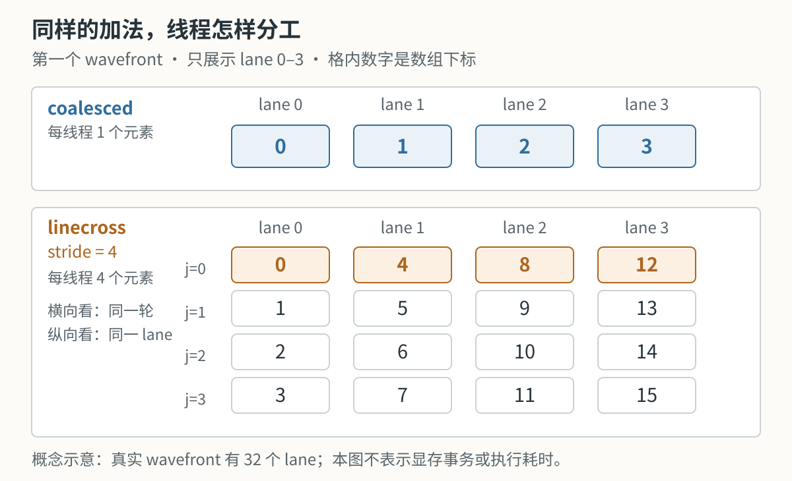

# 第6章 用 rocprof 找到慢在哪里

## 本章导读

> 在[第 5 章](../chapter5/index.md)中，我们学习了怎样测量算子时间。现在考虑一个问题：同样计算 `c[i] = a[i] + b[i]`，为什么改变线程对数据的分工后，时间会变长？
>
> “跑得慢”只是测量到的现象，它本身不能解释底层究竟发生了什么。是编译器生成了低效的代码？是线程数量不足导致计算单元闲置？还是显存访问模式被破坏了？本章我们将使用 ROCm 官方的分析工具 `rocprofv3` 采集 Kernel Trace，按字段逐项读懂 GPU 内核的启动细节，并顺着真实证据设计严谨的对照实验。你只需要熟悉第 4 章的线程编号与第 5 章的 GPU Event 概念即可跟上全流程。

本章运行环境统一为 **Radeon RX 9070 XT（gfx1201）+ ROCm 10.0 + 原生 Ubuntu 24.04**。我们重点学习怎样从客观记录推导出技术判断，不要求你的每次运行都复现相同的小数。

## 6.1 先运行两个向量加法

在挂上性能分析工具之前，我们先在基准测试中复现这两个实现的性能差距，建立可供比对的数据参照。此时暂时把它们看作两个黑盒函数，下一节再展开具体的实现差异。

### 6.1.1 准备程序

以下命令均在实验机的 Linux 终端执行。开始前，请确认已完成[第 1 章的环境准备](../../part0-intro/chapter1/index.md)，并激活了[第 5 章使用的 Part 1 环境](../chapter5/index.md)。

本章源码文件为 `code/part1-profiling/chapter6/vector_add.hip`。从仓库根目录进入对应目录并执行编译：

```bash
cd code/part1-profiling
source ./activate-rocm.sh
cd chapter6
mkdir -p logs
hipcc --offload-arch=gfx1201 -O3 vector_add.hip -o vector_add_bench
```

前两步激活本篇的 ROCm 运行环境。`hipcc` 将源码编译为可执行文件 `vector_add_bench`；`--offload-arch=gfx1201` 指定当前实验卡的架构，`-O3` 开启编译优化。后续命令都在这个 `chapter6/` 目录内运行；切换终端后，需要重新激活本篇环境并进入该目录。

### 6.1.2 运行基准

我们先后运行两个实现：先测连续访存版 `coalesced`，再测跨步访存版 `linecross`（这是本文为了方便对比而命名的对照实现）：

```bash
./vector_add_bench --kernel coalesced --size 16777216 --block 256 \
    --warmup 20 --repeat 100 \
    --output-json logs/coalesced_size16777216.json

./vector_add_bench --kernel linecross --size 16777216 --block 256 --stride 32 \
    --warmup 20 --repeat 100 \
    --output-json logs/linecross_stride32_size16777216.json
```

两个命令保持相同的数组总长度与线程块大小。我们先理清这组关键参数的物理含义：

| 参数 | 这次运行的含义 |
| ---- | ---- |
| `--size 16777216` | 每个数组包含 $2^{24} = 16\,777\,216$ 个 `float` 元素（单数组 64 MiB） |
| `--block 256` | 每个 Block（线程块）包含 256 个线程 |
| `--stride 32` | 在 `linecross` 实现中，每个线程负责连续处理 32 个元素；下一节将推导其地址分布 |
| `--warmup 20` | 先执行 20 次内核作为预热，剔除初次调用的波动，预热耗时不计入统计 |
| `--repeat 100` | 正式执行 100 次内核并采集时间，输出最小值、中位数与平均值 |
| `--output-json` | 将本次运行的配置参数与统计指标导出为 JSON 文件 |

两组测试均使用 HIP Event 在执行流中打点以测量设备执行时间戳之差。输入数据均已提前在 GPU 上就绪，显存分配与跨设备传输耗时未计入其中；不过需要注意，如果事件记录时队列出现短暂空转，测得的设备时间仍可能包含主机提交等待的间隙。

下面是在 **2026-07-06，Radeon RX 9070 XT（gfx1201） + 原生 Ubuntu 24.04** 上获得的历史实验记录。这里的有效带宽按样本中的**最短时间**（`min_ms`）换算：

| 实现 | 最短时间 | 中位数 | 有效带宽 |
| ---- | ----: | ----: | ----: |
| coalesced | 0.334 ms | 0.335 ms | 603 GB/s |
| linecross，stride=32 | 2.25 ms | 2.53 ms | 89.7 GB/s |

有效带宽的计算口径与第 5 章一致：每次加法读入一个 `float` 的 `a[i]`（4 字节）、读入一个 `b[i]`（4 字节）、写出一个 `c[i]`（4 字节），单元素对应 12 字节逻辑数据量。因此算法有效带宽为：

$$
B_{\mathrm{effective}} = \frac{12n}{t}.
$$

将最短时间 $t$ 转换为秒并除以 $10^9$，即得出表格中的 GB/s。该指标衡量的是算法有效利用显存的逻辑速率，并非硬件计数器采集到的物理总线流量。

基准测试给出了明确的结果：在相同的数据规模下，`linecross stride=32` 的最短耗时是连续版的 **6.7 倍**之多。但正如前文所述，“耗时长”只是观测结果。为了找出造成这巨大差距的根源，我们必须深入源码，观察线程分工到底发生了怎样的改变。

::: tip 怎样理解程序输出的 OK
现有程序只抽查前 `min(1024, n)` 个输出，且没有单独拒绝 NaN：若结果为 NaN，`fabs(actual - expected) > tolerance` 的比较也不会报告错误。因此，`correctness=OK` 只表示这段检查没有报错，不能据此确认全数组正确，甚至不能保证抽查值都是有限数。

本章保留历史计时，用来学习怎样读取 trace 和设计对照。修改 kernel 后，应先在 event 计时区间外补齐全量结果与非有限值检查，再接受该实现的性能结果。现有抽查本来也在计时区间之外，扩大校验范围不需要把校验耗时算入 kernel 时间。
:::

## 6.2 把线程分工画出来

为了看清这近 7 倍的性能差距从何而来，我们需要回到源码，把两个核函数分配给线程的数据映射关系具象化。它们虽然完成了完全相同的数学加法，但在硬件层面上调动线程的方式大相径庭。

### 6.2.1 一个线程处理一个元素

连续访存版本 `coalesced` 采用了我们在第 4 章中学习过的全局线程索引模型。下面是源文件中的完整核函数：

```cpp
__global__ void kernel_coalesced(const float* __restrict__ a,
                                 const float* __restrict__ b,
                                 float*       __restrict__ c,
                                 int n) {
    int idx = blockIdx.x * blockDim.x + threadIdx.x;
    if (idx < n) {
        c[idx] = a[idx] + b[idx];
    }
}
```

这里 `idx` 直接决定当前线程读写哪个数组位置。以最先执行的第一个 Wavefront 为例：Lane 0、1、2 分别对应读取数组元素 0、1、2。

在当前实验卡（Radeon RX 9070 XT）运行的 Wave32 模式下，同一 Wavefront 内的 32 个线程是同步执行指令的（注意 AMD GPU 也支持 Wave64 模式，具体取决于架构与编译器选择）。当所有 Lane 访问的物理地址在显存中紧密连续时，显存子系统能够将这些独立的访问请求打包、合并成极少数大带宽的显存事务发起传输，这种机制被称为**合并访存（Memory Coalescing）**。代码中的 `__restrict__` 则是给编译器的类型修饰符，承诺指针所指的显存区间不会重叠，便于编译器生成更激进的加载指令，它本身不参与线程编号的计算。

在该版本中，每个线程仅计算 1 个输出元素。对应本章的数组规模与 Block 大小，GPU 共启动了 $16\,777\,216 / 256 = 65\,536$ 个 Block。

### 6.2.2 一个线程处理一段元素

对照版本 `linecross` 则改变了策略：它把一个 Wavefront 负责处理的数据块切分为 32 份，每一份包含连续的 `stride` 个元素，并把整份数据直接承包给单独一个 Lane。为了直观理解这一映射，@fig-linecross-index-map 以 `stride=4` 为例展示了前 4 个 Lane 的访问方式：

::: figure fig-linecross-index-map


线程与元素下标的概念示意。每格表示数组下标，仅展示 lane 0–3；真实 kernel 按 32 个 lane 划分一个 wavefront。
:::

仔细观察 @fig-linecross-index-map：
- **横向看同一循环轮次（$j=0$）**：4 个 Lane 在同一时刻分别访问下标 0、4、8、12。相邻 Lane 之间的内存地址不再连续，而是被生生拉开了 4 个元素的距离；
- **纵向看同一个 Lane（以 Lane 0 为例）**：随着循环 $j$ 从 0 走到 3，它自身在时间上依次访问的是连续的下标 0、1、2、3。

**也就是说：在任一具体时刻，Wavefront 内部各 Lane 之间的并发访存是分散跨步的；而同一个 Lane 在多轮循环中的串行访存则是局域连续的。**

这一分工由如下核函数实现：

```cpp
__global__ void kernel_linecross(const float* __restrict__ a,
                                 const float* __restrict__ b,
                                 float*       __restrict__ c,
                                 int n,
                                 int stride) {
    const int W = 32;
    int waves_in_block = blockDim.x / W;
    int wave_in_block  = threadIdx.x / W;
    int lane           = threadIdx.x & (W - 1);
    int wave_id        = blockIdx.x * waves_in_block + wave_in_block;
    int tile_base      = wave_id * W * stride;          // 本 wave 的连续 tile 起点
    int my_start       = tile_base + lane * stride;     // 本 lane 负责的连续 stride 个元素起点
    #pragma unroll
    for (int j = 0; j < stride; ++j) {
        int idx = my_start + j;
        if (idx < n) {
            c[idx] = a[idx] + b[idx];
        }
    }
}
```

这段代码的计算逻辑分为三层：
1. 确定线程在所属 Wavefront 内的身份：通过位运算提取局部 `lane` 编号（$0 \sim 31$），并计算出该 Wavefront 在整个 Grid 中的全局序号 `wave_id`；
2. 划分数据区间：`tile_base` 定位该 Wavefront 处理的大数据块起点，`my_start` 再向后跳过 `lane * stride` 个元素，精准对齐到当前线程承包的切片起点；
3. 线程内循环计算：每个线程通过循环展开处理其名下的连续 `stride` 个元素，`idx < n` 防止数组越界。

在本次评测中，实测参数为 `stride = 32`。这意味着在 $j=0$ 的首轮读取中，各 Lane 访问的下标分别为 0、32、64、96……相邻 Lane 之间的物理间距扩大到了 32 个 `float`，即整整 128 字节！显存合并访存的硬件条件被彻底瓦解。

然而，我们还必须注意到一个容易被忽视的伴生变化：既然每个线程一口气处理了 32 个元素，那么计算同样 $n$ 个输出所需的**总线程数就直接缩减到了原来的 1/32**。这意味着 `stride` 的引入同时改变了三件事：并发访存的地址间隔、单个线程内部的串行循环深度，以及整个 GPU Grid 的并发规模。我们在分析原因时绝不能将这三者割裂开来。

## 6.3 让 rocprofv3 记录 kernel 的执行

从代码推导中，我们发现了合并访存遭到破坏这一有力疑点。但硬件到底是如何实际调度并执行这两个内核的？GPU 内部启动了多少个并发工作组？单次内核运行的纯耗时究竟是多少？要回答这些问题，我们需要借助性能剖析工具捕捉更详尽的客观记录。

**Kernel Trace（内核轨迹）**就像是 GPU 驱动层的一张详尽流水清单：GPU 每启动一次内核（称为一次 **Dispatch**），工具就会精准记录其函数符号、起始纳秒时间戳、结束纳秒时间戳以及具体的网格维度配置。

上一章的 GPU Event 只能回答“由 Event 圈起来的一整段工作耗时多少”；而 Kernel Trace 则能把聚光灯对准具体的单个内核，帮助我们看清每次 Dispatch 的微观细节。

### 6.3.1 工具从哪里来

本章使用 **`rocprofv3`** 采集 kernel trace。它来自本篇 `.venv` 中的 ROCm 10.0 SDK，与 `hipcc` 使用同一套环境。`uv sync` 安装依赖后，`source ./activate-rocm.sh` 会激活虚拟环境，并设置 SDK 的工具与动态库路径。

如果提示找不到命令，先回到 `code/part1-profiling/` 检查是否已同步依赖并激活本篇环境，再进入 `chapter6/`。新终端也需要重新激活。工具的安装结构可参考 [AMD ROCprofiler-SDK 安装文档](https://rocm.docs.amd.com/projects/rocprofiler-sdk/en/latest/install/install.html)。下面用历史 trace 讲解字段；实际文件名和列名以当前采集结果为准。

本节只启用 `--kernel-trace`，用于核对启动配置与 kernel 的起止时间。采集过程仍可能影响执行，trace 与正式 benchmark 分开进行。

### 6.3.2 采集连续版，再采集 linecross

我们在已经编译好的基准程序外侧挂接 `rocprofv3` 启动监听：

```bash
rocprofv3 --kernel-trace -o logs/final_kt_coalesced.csv -f csv \
    -- ./vector_add_bench --kernel coalesced --size 16777216 --block 256 \
       --warmup 5 --repeat 10
```

注意命令行中的 `--` 分隔符：
- 分隔符左侧是 Profiler 自身的配置参数：`--kernel-trace` 指定仅记录内核调用，`-f csv` 指定输出为 CSV 表格格式，`-o` 指定日志文件的路径前缀；
- 分隔符右侧则是被分析的目标程序及其参数。为了方便在文本工具中逐行核查，我们在本次 Profiling 中将预热与正式重复次数精简为 5 次与 10 次。

**特别需要明确：这是一次用于结构剖析的独立 Profiling 运行，它绝不能直接取代 6.1 节中为了测速而进行的 100 次纯净基准测试。** Profiler 的插桩行为本身会引入额外的系统截获开销，因此正式的 Benchmark 计时必须与 Profiling 日志采集严格解耦。

接着对 `linecross stride=32` 进行同样的轨迹采集：

```bash
rocprofv3 --kernel-trace -o logs/final_kt_linecross32.csv -f csv \
    -- ./vector_add_bench --kernel linecross --size 16777216 --block 256 --stride 32 \
       --warmup 5 --repeat 10
```

命令执行完毕后，系统会在日志目录下生成对应的内核轨迹文件：

```text
logs/final_kt_coalesced.csv_kernel_trace.csv
logs/final_kt_linecross32.csv_kernel_trace.csv
```

请留意生成文件的真实后缀为 `_kernel_trace.csv`，工具会自动在用户指定的前缀后附加轨迹类型标识。同目录下可能附带生成的 `_agent_info.csv` 主要记载 GPU 拓扑与设备信息，不属于内核执行流水账。

## 6.4 从 CSV 中读懂一次启动

我们使用文本编辑器或表格软件打开 `final_kt_coalesced.csv_kernel_trace.csv`，按照“符号名 → 真实耗时 → 线程拓扑”的逻辑顺序来解读一条真实的启动记录。

### 6.4.1 先选对记录

打开生成的 CSV 表格，你会发现每个文件恰好包含了 **16 条 Dispatch 记录**。但请注意：其中属于我们向量加法内核的只有 15 条（5 次预热 + 10 次正式执行）。文件的最后一条记录实际上是一个名为 `__amd_rocclr_copyBuffer` 的内核调用——这是运行时在测试结束后回收数据时触发的显存搬运内核！

因此，在做数据过滤与统计时，必须坚持两项原则：
1. **先按内核名称（`Kernel_Name`）进行精准筛选**，锁定我们的目标核函数；
2. **严格按照时序剔除前 5 次预热样本**，只保留后续的 10 次稳态调用。

绝对不能简单粗暴地全选表格然后掐头去尾，否则会误将底层的拷贝内核当作加法内核算入均值。

::: figure fig-trace-record-selection


本章 trace 的记录分组。每格代表一条记录，宽度不表示执行时间；统计前先筛选 kernel 名称，再排除预热。
:::

如 @fig-trace-record-selection 所示，唯有蓝色标注的 10 条正式记录才是有效的统计样本。在更复杂的大型程序中，各类系统辅助内核与计算内核往往交织在一起，“根据函数符号精确过滤”是性能分析的基本功。

### 6.4.2 计算一条记录的时间

我们从连续访存版的正式记录中抽取出第一条稳态样本（`Dispatch_Id = 6`），横向查看其核心字段：

| 字段 | 原始值 | 含义 |
| ---- | ---- | ---- |
| `Kernel_Name` | `kernel_coalesced(float const*, float const*, float*, int)` | 内核符号签名，括号内为参数类型 |
| `Dispatch_Id` | `6` | 该内核在全局队列中的启动批次编号，本例中为正式测试的第 1 次启动 |
| `Start_Timestamp` | `62486600995446` | GPU 开始执行该内核的硬件时间戳（纳秒，ns） |
| `End_Timestamp` | `62486601325050` | GPU 执行完毕该内核的硬件时间戳（纳秒，ns） |
| `Workgroup_Size_X` | `256` | 本次启动的一维工作组（Block）线程宽度 |
| `Grid_Size_X` | `16777216` | 本次启动的一维网格（Grid）全局总线程数 |

时间戳的绝对数值反映的是系统单调时钟的累计计数值，没有独立记忆的意义。将两个时间戳直接相减，即可精确算出该内核在 GPU 核心上驻留执行的净时长：

$$
\begin{aligned}
\Delta t &= 62486601325050 - 62486600995446\\
         &= 329604\ \mathrm{ns}\\
         &= 329.604\ \mathrm{\mu s}\approx 0.330\ \mathrm{ms}.
\end{aligned}
$$

这大约 0.330 ms 是内核在 GPU 硬件流水线上不折不扣的真实运算耗时，既不包含 CPU 发起系统调用的调度开销，也不包含驱动层的排队等待。

### 6.4.3 再看启动了多少个线程

在 ROCm Trace 术语中，`Workgroup` 完全对应 HIP 编程模型中的 Block（线程块）；而 `Grid_Size_X` 代表的是整个网格包含的**线程总数**，**并非 Block 的数量**。

由于本测试采用一维网格（Y 和 Z 维度均为 1），整个内核发射的 Block 总数可以通过除法直接得出：

$$
\text{Block 数量} = \frac{\text{Grid\_Size\_X}}{\text{Workgroup\_Size\_X}}.
$$

我们对两个内核各自的 10 条正式记录分别汇总，提取出耗时统计与拓扑结构：

| kernel | 最短时间 | 中位数 | `Grid_Size_X` | `Workgroup_Size_X` | Block 数量 |
| ---- | ----: | ----: | ----: | ----: | ----: |
| `kernel_coalesced` | 329 μs | 330 μs | 16 777 216 | 256 | 65 536 |
| `kernel_linecross`，stride=32 | 2202 μs | 2304 μs | 524 288 | 256 | 2048 |

将 Trace 中的纯内核耗时与 6.1 节中的纯净 Benchmark 进行交叉比对：
- 连续版的 Trace 最短耗时约为 0.329 ms，与 Benchmark 测得的 0.334 ms 极其接近；
- `linecross` 在 Trace 中最短耗时为 2.202 ms，同样比连续版慢了近 6.7 倍。
这两组独立采集的数据在比例上高度一致，说明测量到的性能暴跌绝大部分直接源自 GPU 内核内部执行的拉长，而非由于 CPU 发射端偶然卡顿所致。

再横向审视执行配置：虽然两者的 Block 尺寸都是 256，但 `linecross` 发射的总线程数和 Block 总数整整缩减为了原来的 1/32（从 65 536 个 Block 骤降到 2048 个）。这验证了我们在 6.2.2 节的数学推导：单个线程承担更多工作，导致整个 Grid 规模大幅缩减。**但必须注意：启动的总 Block 数少，仅代表任务总包数变少，绝不能不加论证地等同于“GPU 的计算单元一定严重空闲”。**

## 6.5 这些证据还不能说明什么

在拿到 Trace 日志后，新手常犯的一个错误是看到某个数字发生变化，就迫不及待地宣布找到了“根本原因”。这一节我们将审视日志中的静态资源与性能计数器字段，明确它们的证据边界。

### 6.5.1 寄存器数量不是利用率

我们在第 3 章接触过向量通用寄存器（VGPR）、标量通用寄存器（SGPR）与本地数据共享区（LDS）。在导出的 Trace 日志中，也记录了对应的静态资源字段：

| 字段 | coalesced | linecross，stride=32 | 在这里怎样理解 |
| ---- | ----: | ----: | ---- |
| `VGPR_Count` | 8 | 16 | 编译器为每个 Lane（物理线程）分配的向量通用寄存器数量 |
| `SGPR_Count` | 128 | 128 | 编译器为每个 Wavefront 分配的标量通用寄存器数量 |
| `LDS_Block_Size` | 0 B | 0 B | 编译器为每个 Workgroup（Block）分配的本地数据共享区字节数；本测试核函数未声明 LDS |

这些数字是编译器在离线编译期决定的**静态资源配额**，分别对应不同的硬件分配层级（VGPR 属于物理线程 lane，SGPR 属于 wavefront，LDS 属于 workgroup），并不等于运行期“硬件流水线的忙碌程度”或“动态利用率”。仅凭 VGPR 从 8 增长到 16，绝对不能直接得出“寄存器压力翻倍导致性能骤降 7 倍”的结论。

要检查寄存器分配数能否解释时间差，可以运行同一个 `linecross` 编译产物，只把参数改为 `stride=1`：

```bash
./vector_add_bench --kernel linecross --size 16777216 --block 256 --stride 1 \
    --warmup 20 --repeat 100 \
    --output-json logs/linecross_stride1_size16777216.json
```

在同组硬件测试中，`stride=1` 的最短耗时为 **0.336 ms**，与连续版的 **0.334 ms** 接近。

`stride=1` 与 `stride=32` 使用同一个编译产物，`VGPR_Count` 同为 16，但时间不同。这说明静态寄存器数量本身不足以解释差距，不能把“VGPR 更多”直接等同于“运行更慢”。地址排列、循环工作量与 grid 大小也随 stride 改变，还需要继续区分它们的影响。

### 6.5.2 返回 0 的计数器不能直接拿来解释访存

硬件性能计数器（Performance Counter，PMC）是集成在 GPU 流水线上的物理监测探头，能够统计诸如缓存命中、指令类型分布等细粒度硬件事件。然而，日志表格中存在某个字段，并不代表我们已经在当前系统中拿到了真实有效的测量数据。

在历史实测记录（2026-07-08，RX 9070 XT + 原生 Ubuntu 24.04 + ROCm 7.13.0，`rocprofv3` 1.3.0，见 `code/part1-profiling/chapter6/logs/pmc-spotcheck-2026-07-08.md`）中，尝试采集的 `FETCH_SIZE`、`GL2C_HIT_sum`、`SQ_INSTS_VALU` 以及 `OccupancyPercent` 均直接返回了数值 `0`。如果脱离工具链在该平台上的实际支持状态，望文生义地将这些字段解释为“程序完全没有执行指令”或者“缓存命中率绝对为零”，就会犯下严重的常识性错误。

与此相对，该次抽查中的 `GPUBusy`（100%）与 `Wavefronts`（524288）字段则返回了合理的非零数值。这表明当时面对的是工具链部分性能计数器在消费级 RDNA4（gfx1201）架构上的支持边界。虽然本教程当前安装基线已推进至 ROCm 10.0，但在具体硬件计数器的支持上，读者仍应严格区分官方文档明确支持的指标、旧版环境下的实测观察以及尚未复核的能力。本教程严格遵循实证原则：凡未获得有效采样的物理计数器，一律不作为断言硬件行为的依据；所有的推论必须建立在经过交叉校验的 Event 计时、Kernel Trace 以及严格的算法映射推导之上。

## 6.6 用 stride 扫描提出下一步实验

为了摸清跨步大小对性能影响的整体轮廓，我们在相同环境下执行连续的 `stride` 参数扫描：

```bash
for s in 1 2 4 8 16 32 64 128 256; do
    ./vector_add_bench --kernel linecross --size 16777216 --block 256 --stride $s \
        --warmup 20 --repeat 50 \
        --output-json logs/linecross_s${s}.json
done
```

下表呈现了完整的扫描测量结果（各项均为 50 次稳态采样中的最短耗时）：

| stride | 最短时间 | 有效带宽 |
| ----: | ----: | ----: |
| 1 | 0.338 ms | 596 GB/s |
| 2 | 0.336 ms | 600 GB/s |
| 4 | 0.336 ms | 600 GB/s |
| 8 | 0.405 ms | 497 GB/s |
| 16 | 1.65 ms | 122 GB/s |
| 32 | 2.19 ms | 92.1 GB/s |
| 64 | 4.86 ms | 41.4 GB/s |
| 128 | 4.77 ms | 42.2 GB/s |
| 256 | 25.3 ms | 7.95 GB/s |

从数据中可以清晰地观察到两个规律：
1. **小跨步保持高效**：当 $s \in \{1, 2, 4\}$ 时，耗时几乎没有变化，有效带宽维持在约 600 GB/s 的高位；
2. **跨步增大引发剧烈衰退**：从 $s=8$ 开始性能出现肉眼可见的滑坡，到 $s=256$ 时有效带宽跌至不足 8 GB/s；但曲线并非处处单调（例如本次测量中 $s=128$ 的耗时略短于 $s=64$）。由于当前测试同时改变了地址跨步、线程内循环深度和发射规模，我们不能仅凭微弱的时间差异就直接断定这是由缓存行竞争或硬件调度引起的，而应将其视为多变量交织下的一组测量现象。

现在，我们把观察到的事实与待验证的假设整合成对照表：

| 我们看到的变化 | 从哪里确认 | 还没有证明的事 |
| ---- | ---- | ---- |
| 同一轮访存的 lane 地址更分散 | 索引公式 | 物理显存事务到底增加了多少 |
| 每个线程要循环更多次 | `j < stride` | 更长的依赖链贡献了多少耗时 |
| 启动的总线程数变少 | grid 计算与 trace | 运行时占用率是否因此下降了多少 |
| 有效带宽变低 | 由同一个计时结果换算 | 这不是第二份独立的硬件测量 |

请始终牢记：**无论 stride 为多少，所有内核执行完毕后处理的数学数据总量是完全一致的。** 性能的悬殊差异，完全源于计算过程在空间和时间上的组织方式。

由于当前的 `linecross` 实现同时耦合了“访存发散程度”、“线程内循环次数”以及“全局网格大小”三个变量，我们还不能武断地将全部性能损失都扣在“访存合并失败”头上。为了完全隔离变量，下一步应当设计更为严谨的**受控对照实验**：
保持每个 Wavefront 依然处理连续 1024 个元素、每个 Lane 依然在循环中迭代 32 次，全局 Block 和 Grid 完全相同，仅仅改变内核中计算内存偏移的公式：

| 索引方案（设计示意，尚无本章实测结果） | 第一个 wavefront 在 `j=0` 时的前四个下标 |
| ---- | ---- |
| `tile_base + j * 32 + lane` | 0、1、2、3（并发保持连续） |
| `tile_base + lane * 32 + j` | 0、32、64、96（并发发生跨步） |

这一受控设计将彻底消除循环次数与线程数量的干扰，把聚光灯真正聚焦在合并访存本身。这是性能工程的标准迭代思路：用已有测试暴露问题，用 Profiling 排除伪因，最后设计针对性的受控实验锁定根因。

## 6.7 练习

完成本章后，请尝试回答以下问题以巩固对 Profiling 分析流程的掌握：

1. **读懂一条 Trace**：在生成的 Trace 文件中找到 `kernel_linecross` 的第一条正式记录，计算其起止时间戳差值并换算为毫秒。为什么不能拿单条 Trace 记录与连续版的 100 次基准测试最小值直接做高低判断？
2. **核对网格规模**：保持 $n = 16\,777\,216$ 与 `block = 256` 不变，从源码数学逻辑推导 `stride = 1` 与 `stride = 32` 各自需要发射多少个 Block，并与 Trace 表格中的 `Grid_Size_X` 进行交叉核对。
3. **识别背景干扰**：在原始 CSV 中找到 `__amd_rocclr_copyBuffer`。如果不加筛选就对全表取平均耗时，会对评估向量加法算子产生什么误导？
4. **设计受控实验**：针对 6.6 节提出的两种索引方案，推导当 `lane = 1`、`j = 2` 时各自访问的数组绝对下标。

<details>
<summary>前两题的核对结果</summary>

1. 原始时间戳相减：$62486856477107 - 62486854099361 = 2\,377\,746\text{ ns} \approx 2.378\text{ ms}$。单次记录包含了系统偶发抖动，且 Profiler 插桩本身存在测量开销；公正的对比必须在相同的采样与统计口径下展开。
2. `stride = 1` 时每个 Block 负责 256 个元素，共需 $16\,777\,216 / 256 = 65\,536$ 个 Block；`stride = 32` 时每个 Block 负责 $256 \times 32 = 8192$ 个元素，仅需 $16\,777\,216 / 8192 = 2048$ 个 Block。Trace 中对应的 `Grid_Size_X` 分别为 16 777 216 与 524 288（即 $2048 \times 256$）。

</details>

## 本章小结

- **Benchmark 与 Profiling 各司其职**：基准测试在不启用 profiler 的条件下重复测量时间并记录波动；Profiling 围绕具体问题采集额外证据。两组结果分别保存。
- **看懂 Trace 的基本功**：分析 CSV 轨迹时，必须先按内核名称严格过滤目标函数，并按时序排除预热开销。时间戳差值反映的是纯内核在 GPU 核心上的执行时长。
- **分清静态配置与动态利用率**：VGPR、SGPR 等编译期配额不等于运行时硬件繁忙度；当特定硬件计数器返回无效零值时，要诚实承认数据局限，切忌主观臆断。
- **科学归因依靠受控实验**：性能衰减往往是多个因素耦合的结果。面对多变量交织的现状，必须设计单一变量的受控对比，才能最终确认性能优化的发力点。

现在，我们确认了两个版本的时间差，也从源码和 trace 中看到了工作划分的变化；各项变化分别贡献了多少耗时，还需要受控实验判断。[第 7 章](../chapter7/index.md)将结合计算量、逻辑数据量与时间绘制 Roofline 图，帮助我们选择下一步值得检验的方向。

## 延伸阅读

- [AMD：使用 rocprofv3 进行跟踪与分析](https://rocm.docs.amd.com/projects/rocprofiler-sdk/en/latest/how-to/using-rocprofv3.html)——查阅官方完整的命令参数与输出字段说明。
- [AMD：ROCprofiler-SDK 架构与安装指南](https://rocm.docs.amd.com/projects/rocprofiler-sdk/en/latest/install/install.html)——了解 Profiler 的系统底层依赖。
- [HIP Performance Guidelines](https://rocm.docs.amd.com/projects/HIP/en/latest/how-to/performance_guidelines.html)——阅读关于合并访存与架构优化的官方准则。
