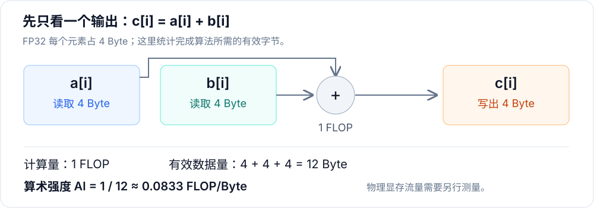
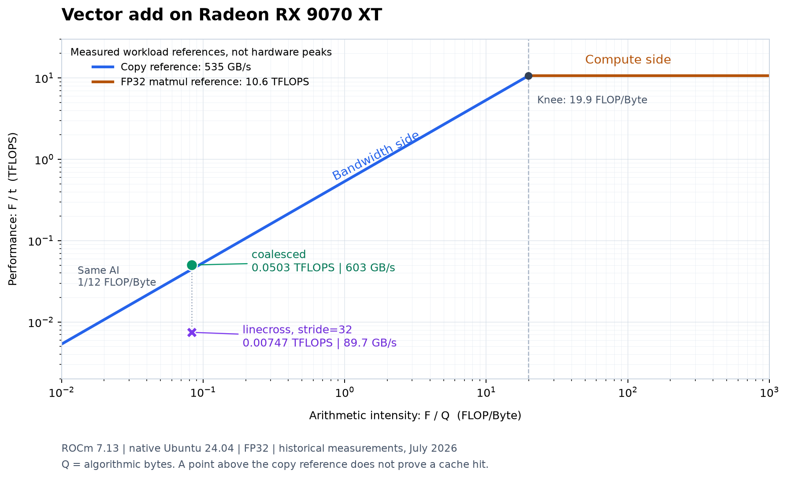

# 第7章 读懂 Roofline 图

## 本章导读

在第 6 章中，同样的 Vector Add，连续访存版本约需 `0.334 ms`，`linecross stride=32` 版本约需 `2.25 ms`。我们已经知道后者更慢，也在 trace 中看到了不同的工作划分。不过，还有一个问题没有回答：对于这样的任务，应该优先考虑减少数据搬运，还是提高计算速度？

Roofline（屋顶线模型）把计算量、数据量和时间放在同一张图上，帮助我们提出下一轮实验的方向。本章从一条加法开始计算，逐步画出工作点和参考线。你只需要会读第 6 章的结果表，不需要先记住一组性能公式。

读完后，你应该能独立完成三件事：算出一个简单算子的算术强度；解释 Roofline 为什么先倾斜、再变平；根据工作点提出一个可检验的优化假设。

## 7.1 一次加法包含多少工作

我们先暂时放下计时，只数清 Vector Add 为了得到一个输出，至少需要做什么。

对于 `c[i] = a[i] + b[i]`，若三个数组都使用 FP32，每个元素占 4 Byte，那么需要读取两个输入，做一次加法，再写出一个输出。@fig-vector-add-work 把这四步放在一起。

::: figure fig-vector-add-work


一个输出对应一次浮点加法、两次输入读取和一次输出写入；字节数采用算法口径。
:::

一次浮点加法计为 `1 FLOP`，这里的 FLOP 是**浮点运算的次数**。处理 $N$ 个元素，共有 $N$ 次加法，需要读取 $2N$ 个元素并写入 $N$ 个元素。用 $F$ 表示计算量、$Q$ 表示有效数据量，就有：

$$
F=N\quad\text{FLOP},\qquad Q=3N\times4=12N\quad\text{Byte}.
$$

将二者相除，就得到**算术强度（Arithmetic Intensity，AI）**：

$$
AI=\frac{F}{Q}=\frac{N}{12N}=\frac{1}{12}\approx0.0833\quad\text{FLOP/Byte}.
$$

这个数回答的是：每搬运 1 Byte 有效数据，完成多少次浮点运算？Vector Add 平均搬运 12 Byte 才做一次加法，计算相对于数据搬运很少。

注意 $N$ 在分子、分母中抵消了。把数组长度翻倍，计算量和数据量一起翻倍，AI 不会改变。更大的数组可能让 GPU 更忙，从而改变运行时间和吞吐，但不会让这个算法凭空多出数据复用。

这里的 $Q$ 需要特别说明：我们数的是算法要用的输入、输出字节，**没有测量 GDDR6 总线实际传输了多少字节**。缓存、实际访问事务等因素可能使物理流量与这个数不同。后面用它画出的横坐标，也是“按算法有效字节计算的 AI”。

## 7.2 为什么图上的线像屋顶

这一节从两个速度限制出发，推导 Roofline 的形状。

先考虑搬运数据。为了推导模型，我们暂时假设 $Q$ 就是所分析存储层级需要传输的数据量。如果该层级的带宽上限为 $BW$ Byte/s，搬运 $Q$ Byte 至少需要 $Q/BW$ 秒。即使加法本身足够快，这些数据也需要时间才能到达。计算性能用每秒完成的浮点运算次数表示，即 $P=F/t$，因此：

$$
P\leq\frac{F}{Q/BW}=BW\times AI.
$$

这就是带宽给出的限制。保持带宽不变，AI 越大，同样一批数据能支持的计算越多，允许达到的计算性能就越高。把横轴设为 AI、纵轴设为 $P$，会得到一条向右上方延伸的斜线。

再考虑计算。GPU 每秒能够执行的浮点运算也有上限，记作 $P_{\mathrm{compute}}$。即使数据已经备好，计算单元也不能无限快：

$$
P\leq P_{\mathrm{compute}}.
$$

这一限制与横轴无关，所以是一条水平线。两种限制同时存在，我们要取其中较低的一个：

$$
P_{\mathrm{roof}}=\min\left(BW\times AI,\ P_{\mathrm{compute}}\right).
$$

因此，Roofline 先沿着斜线升高，到达水平线后就不再继续升高。两段相接的位置叫**拐点**，其横坐标为：

$$
AI_{\mathrm{knee}}=\frac{P_{\mathrm{compute}}}{BW}.
$$

读图时，拐点左侧表示模型中的带宽约束更低，右侧表示计算约束更低。这里说的是“哪一种约束更紧”，不是已经证明实际程序只受这一种因素影响。一个小数组的 kernel 还可能主要花时间在启动上，离这两条线都很远。[Roofline 模型的官方介绍](https://amcr.lbl.gov/departments/computer-science-department/ppan/roofline-performance-model/)也把它作为性能边界与优化方向的分析工具。

### 7.2.1 本章采用什么参考值

要画出具体曲线，还需要带宽和计算性能的数值。本章使用两项独立工作负载的历史实测作为参考，环境均为 **Radeon RX 9070 XT（gfx1201）+ ROCm 7.13 + 原生 Ubuntu 24.04**，测量日期为 **2026-07-08**。

| 参考工作负载 | 输入与计时口径 | 用于画图的参考值 |
| ---- | ---- | ----: |
| PyTorch `copy_` | FP32，输入、输出各 2048 MiB；连续执行 50 次的平均时间约 8.032 ms | 535 GB/s |
| PyTorch FP32 矩阵乘 | 两个 `4096 × 4096` 矩阵；连续执行 30 次的平均时间约 12.944 ms | 10.6 TFLOPS |

这些数字表示“这两项测试当时跑到了多少”，不是显卡规格中的理论峰值，也不是其他工作负载不可超过的上限。我们用它们练习画图和比较结果，将生成的曲线称为**实测参考线**。这两项历史微基准也没有完整的输出校验，不能用来验收某个新实现是否“达到峰值”；新实验仍应按第 5 章的方法，先验证结果，再测量时间。

其中，copy 的带宽需要先统一单位。2048 MiB 是**单个缓冲区**的大小，复制一次既读输入又写输出：

$$
BW_{\mathrm{copy}}=
\frac{2\times2048\times2^{20}}{8.032\times10^{-3}}\div10^9
\approx535\quad\text{GB/s}.
$$

早期日志把 `MiB/ms` 直接写成了 `GB/s`，得到约 510 的数值。本章已按原始时间和字节数重新换算；旧日志中的时间不变。矩阵乘按 $2\times4096^3$ FLOP 的常用口径计算，约为 10.6 TFLOPS。两项历史日志的 `min_ms` 表头也不准确：源码实际测的是一批执行的平均时间，本章按真实计时方式说明。

代入这两个参考值，拐点约为 `19.9 FLOP/Byte`。计算前应先将 TFLOPS 换成 FLOPS、GB/s 换成 Byte/s；不要直接用 `10.6 / 535`，否则会遗漏 $10^3$ 的单位换算。

## 7.3 把一次测量变成一个点

现在回到第 6 章，把 Vector Add 的实测时间代入公式。

第 6 章这组原生 Ubuntu 实验于 **2026-07-06** 记录，输入为 $N=16\,777\,216$ 个 FP32 元素，`block=256`，预热 20 次、计时 100 次。历史程序对两个版本的前 1024 个输出抽查通过，以最小 HIP event 时间作为本次比较的统计量。抽查没有覆盖全部输出，也未单独检查 NaN，验证边界见 [第 6 章](../chapter6/index.md#_61-先运行两个向量加法)。我们沿用同一组结果，不将 profiler 插桩后的时间混进来。

首先数工作量：

$$
F=16\,777\,216\quad\text{FLOP},\qquad
Q=201\,326\,592\quad\text{Byte}=192\quad\text{MiB}.
$$

以 coalesced 为例，原记录时间约为 `0.3338 ms`，即 `0.0003338 s`。纵坐标是单位时间完成的计算量：

$$
P=\frac{F}{t}
=\frac{16\,777\,216}{0.0003338}
\approx5.03\times10^{10}\quad\text{FLOPS}
=0.0503\quad\text{TFLOPS}.
$$

FLOPS 中的 `/s` 表示“每秒”，与表示计算次数的 FLOP 不同。这里的 `0.0503 TFLOPS` 也可以写成 `50.3 GFLOPS`，只是单位不同。

同一次测量还能换算出有效带宽：

$$
BW_{\mathrm{effective}}=\frac{Q}{t}\approx603\quad\text{GB/s}.
$$

时间、TFLOPS、有效带宽是同一份测量的不同表达。在工作量固定时，时间减半，后两者都会翻倍。它们有助于从不同角度阅读结果，但不是三份相互独立的硬件证据。

对 linecross 做同样的计算，就得到两个**工作点**——这个词只是指我们画到图上的实测结果：

| 版本 | 最小时间 | AI（FLOP/Byte） | 性能（TFLOPS） | 有效带宽（GB/s） |
| ---- | ----: | ----: | ----: | ----: |
| coalesced | 0.334 ms | 0.0833 | 0.0503 | 603 |
| linecross，stride=32 | 2.25 ms | 0.0833 | 0.00747 | 89.7 |

两个版本完成相同的 $N$ 次加法，按算法口径读写相同的 $12N$ Byte，横坐标相同。后者花的时间更长，因此纵坐标更低。根据原始记录中的时间，差距约为 `6.73 倍`；不要用表中已经取整的数字重复计算，再要求结果逐位一致。

## 7.4 生成图，并沿着坐标读一遍

这一节使用仓库中的绘图脚本，把参考曲线与两个工作点画在一起。

脚本位于 `code/part1-profiling/chapter7/plot_roofline_ch6.py`。文件名中的 `ch6` 是历史命名，本章继续保留它。脚本内保存了上述测量的输入规模、时间和来源说明，运行时只做换算和绘图，不会重新运行 GPU benchmark。

参考线和工作点的核心计算如下，完整实现见该脚本：

```python
F = N
Q = 3 * N * 4
AI_VADD = F / Q
P_COALESCED = F / (COALESCED_MIN_MS * 1e-3) / 1e12
P_LINECROSS = F / (LINECROSS_MIN_MS * 1e-3) / 1e12
BW_COALESCED = Q / (COALESCED_MIN_MS * 1e-3) / 1e9
BW_LINECROSS = Q / (LINECROSS_MIN_MS * 1e-3) / 1e9
KNEE = P_REFERENCE * 1e3 / BW_REFERENCE
```

工作点由 $F/t$ 直接计算，避免先将有效带宽取整，再反推性能。画参考线时，脚本使用 `np.minimum` 取带宽约束和计算约束中的较小值，所以斜线到达拐点后会接上水平线。

在实验机的仓库工作目录中执行：

```bash
cd code/part1-profiling
source ./activate-rocm.sh
python chapter7/plot_roofline_ch6.py --save
```

图片会保存在 `code/part1-profiling/chapter7/roofline-ch6.png`。如果你要画自己的结果，需要把脚本中的输入规模、测量时间和参考值一起换成自己的记录，仅重新运行绘图命令不会自动采集新数据。

::: figure fig-roofline-vadd-linecross


RX 9070 XT、ROCm 7.13、原生 Ubuntu 24.04 上的历史实测示例；参考线来自独立工作负载，横轴采用算法有效字节口径。
:::

阅读 @fig-roofline-vadd-linecross 时，可以按下面的顺序移动视线。

**先看横轴。** 两个点都在 `0.0833 FLOP/Byte`，远小于约 `19.9 FLOP/Byte` 的参考拐点。对于这样一次搬运只配一次加法的任务，先研究数据搬运是合理的起点。

**再看纵轴。** 绿色圆点是 coalesced，紫色叉号是 linecross。它们的上下差距反映了实测时间差距。两个坐标轴都使用对数刻度：从 `0.01` 到 `0.1`、从 `0.1` 到 `1` 在图上距离相同，都表示增加 10 倍。因此，图上的距离应该按倍数理解。

**最后看参考线。** linecross 明显低于 copy 参考曲线，值得继续查实现中的开销。coalesced 略高于它，也不矛盾：535 GB/s 来自另一项 copy 测试，输入规模、读写比例和计时方式都不同。它只是参考结果，不能据此认定 Vector Add 超越了硬件上限。

同样，超过 copy 参考线也不能证明某次访问命中了 L2。第 6 章尚未获得可用的相关访存计数器，当前数据不能把缓存、实际事务和工作划分的影响拆开。物理显存 Roofline 需要对应存储层级的流量口径，本章的简化图用于建立概念和比较工作点。

## 7.5 从读图走到下一轮实验

这一节把图中的观察变成具体问题，而不是从位置直接跳到结论。

回到 linecross，源码和 trace 已经说明：`stride=32` 同时改变了相邻线程的访问地址、每线程处理的元素数和 Grid Size。因此，当前实验支持“这个配置比 coalesced 慢”，但还不足以支持“全部 6.73 倍差距都来自访存不合并”。

下一步应保持线程数、每线程工作量和计时方法一致，只改变地址映射，再检查结果是否正确、时间是否变化。这样，我们才能知道更连续的访问能解释多少差距。这个受控对照属于下一轮实验，本章没有提前给出它的收益。

对于其他工作点，也可以沿用同样的思路：

| 观察到的现象 | 可以提出的假设 | 下一步如何区分 |
| ---- | ---- | ---- |
| AI 小，性能低于合适的带宽参考 | 数据访问方式造成额外开销 | 固定工作划分，对比地址映射；有有效 counter 时再检查流量 |
| 输入很小，性能很低 | 启动等固定开销占比较大 | 增大输入，观察时间和吞吐怎样变化，并结合 trace |
| 多个短 kernel 顺序执行 | 中间结果读写或多次启动有代价 | 检查数据依赖，评估能否融合，再比较完整路径时间 |
| AI 大，低于同精度的计算参考 | 计算路径、依赖链或并行度有影响 | 先核对实际使用的指令和工作划分，再设计对应实验 |

低 AI 不保证已经跑满带宽，高 AI 也不保证已经跑满算力。对计算路径的比较还需要相同的精度与结果要求；不能拿 FP32 普通运算的工作点，直接与另一种低精度矩阵计算的参考线比较。

可以用一张小表记录本章已经知道的内容。它既保存结果，也保存结论成立的范围。

| 项目 | 本次记录 |
| ---- | ---- |
| 环境与输入 | 9070 XT / ROCm 7.13 / 原生 Ubuntu 24.04；FP32，$N=16\,777\,216$ |
| 计时方法 | HIP event；预热 20 次、计时 100 次；使用最小值 |
| 结果 | coalesced 约 0.334 ms；linecross stride=32 约 2.25 ms |
| 已有证据 | 历史程序抽查通过（非全量验证）；时间不同；trace 显示工作划分与资源字段不同 |
| 尚未分离的影响 | 地址映射、每线程工作量、Grid Size，以及未能测得的物理流量 |
| 下一步 | 保持工作划分一致，仅比较地址映射 |

实际做实验时，再在记录中补上源码版本、完整命令、原始日志位置以及是否有其他进程使用 GPU。未来重新读这份记录，你就能分清哪些是测量，哪些是推测。

## 7.6 练习

下面的练习先在纸上计算，再设计实验；没有实测之前，不需要填写性能数字。

1. 保持 FP32 Vector Add 不变，将 $N$ 翻倍。$F$、$Q$ 和 AI 分别怎样变化？如果时间恰好也翻倍，工作点会移动吗？如果时间增加不到两倍呢？
2. 将输入、输出全部改成 FP16，仍然每个输出只做一次加法。按算法口径，AI 是多少？这个推导能否保证实际运行时间减半？说明还缺少什么证据。
3. 单纯的 copy 没有浮点算术，按本章口径 $F=0$。为什么它适合用 GB/s 评价，却不能像 Vector Add 一样放到这幅双对数图里？
4. 某个工作点超过了一项独立 copy 测试的参考线。请列出首先应核对的输入、单位和计时条件，然后说明为什么这还不是缓存命中的直接证据。

<details>
<summary>提示：检查你的推导是否使用了同一种口径</summary>

第一题中，$F$ 和 $Q$ 都翻倍，AI 不变。如果时间也翻倍，$P=F/t$ 不变，点仍在原处；如果时间增加不到两倍，点会向上移动。

第二题中，$Q=6N$ Byte，AI 为 $1/6$ FLOP/Byte。字节数减半只是算法计数，具体时间还取决于实际实现、固定开销和可达到的吞吐，需要重新计时。

第三题中，AI 与 $P$ 都为零，对数坐标无法表示零。copy 可以用来测量带宽参考，但不必把它画成浮点计算的工作点。

第四题可以从 GB 与 GiB、单个缓冲区与总读写量、算法字节与物理字节、最小值与批量均值，以及输入大小、测试时 GPU 状态逐项核对。即便这些口径无误，不同工作负载的实测参考也不构成普遍上限。

</details>

## 本章小结

- 一个工作点来自计算量 $F$、数据量 $Q$ 和时间 $t$：横坐标为 $F/Q$，纵坐标为 $F/t$。首先应说明数据量与时间的统计口径。
- Roofline 取带宽约束与计算约束中较低的一项，因此形成“斜线接水平线”的形状。独立工作负载的实测参考不等于硬件峰值。
- FP32 Vector Add 的算法 AI 为 $1/12$ FLOP/Byte。它提示我们优先研究数据搬运，但不能独自证明某个具体瓶颈。
- 图中的差距帮助我们提出假设；源码、profiler 和受控实验决定哪些解释最终能够成立。

至此，第 5 章的计时、第 6 章的 profiling 和本章的模型分析连在了一起。进入 [第 8 章 Element-Wise](../../part2-kernels/chapter8/index.md) 后，我们会继续使用 Vector Add，将这些分析方法用于实际的 HIP 与 Triton 优化。

## 延伸阅读

- [Berkeley Lab：Roofline 模型介绍](https://amcr.lbl.gov/departments/computer-science-department/ppan/roofline-performance-model/)——理解计算吞吐、数据局部性与带宽如何放在一个模型里。
- [Roofline 原论文](https://dl.acm.org/doi/10.1145/1498765.1498785)——阅读模型的原始定义与分析案例。
- [Berkeley Lab：Empirical Roofline Tool](https://amcr.lbl.gov/departments/computer-science-department/ppan/roofline-performance-model/empirical-roofline-tool-ert/)——了解更系统的实测参考构建方法。
