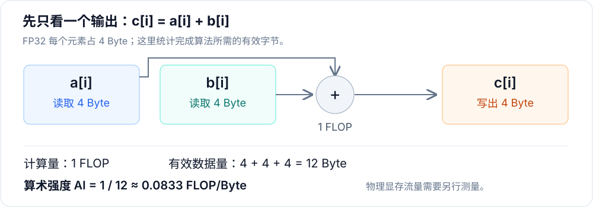
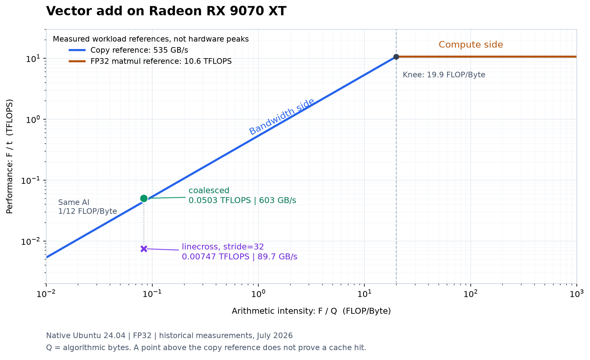

# 第7章 读懂 Roofline 图

## 本章导读

> 在[第 6 章](../chapter6/index.md)中，我们测到了两个向量加法版本的时间差，也从源码和 trace 中看到了不同的工作划分。接下来应该优先研究数据搬运，还是计算过程？
>
> **Roofline（屋顶线模型）**把计算量、数据量和时间放在同一张图上，帮助我们提出优化假设。本章从一次加法开始，计算算术强度，再把实测结果与参考线画在一起。读完后，你应该能解释图中的位置意味着什么，以及还需要哪些实验来判断原因。只需会读第 6 章的结果表，就可以开始。

## 7.1 一次加法包含多少工作

在代入具体的计时数字之前，我们先剥离掉所有硬件细节，单纯从算法逻辑层面数清楚：完成一次向量加法，究竟需要进行多少次计算、搬运多少数据？

考虑 `c[i] = a[i] + b[i]`。三个数组均采用单精度浮点数（FP32），每个元素占 4 字节（Byte）。得到一个输出，需要读取 `a[i]`、读取 `b[i]`、执行一次加法，再写回 `c[i]`。@fig-vector-add-work 展示了这些逻辑操作：

::: figure fig-vector-add-work


一个输出对应一次浮点加法、两次输入读取和一次输出写入；字节数采用算法口径。
:::

我们将**浮点运算的次数**记为 **FLOP**（Floating-Point Operation）。若处理的数组规模为 $N$ 个元素，则算法需要完成 $N$ 次浮点加法，同时需要读取 $2N$ 个输入元素并写回 $N$ 个输出元素。

我们用两个核心符号来定量刻画这项任务：

- $F$：算法的总计算量（单位为 FLOP）；
- $Q$：算法必需的有效数据搬运量（单位为 Byte）。

对应到本例，已知量为：

$$
F = N\quad\text{FLOP},\qquad Q = 3N \times 4 = 12N\quad\text{Byte}.
$$

将计算量与数据量相除，得到**算术强度（Arithmetic Intensity，AI）**。本章先按算法的有效字节计算：

$$
AI = \frac{F}{Q} = \frac{N}{12N} = \frac{1}{12} \approx 0.0833\quad\text{FLOP/Byte}.
$$

这个数回答的是：**每读写 1 Byte 有效数据，完成多少次浮点运算？** FP32 向量加法平均读写 12 Byte 才做一次加法，计算量相对于数据量很少。

这里 $N$ 在分子、分母中抵消了。把数组长度翻倍，计算量与逻辑数据量一起翻倍，AI 不变。更大的输入可能改变运行时间和吞吐，但不会改变这个算法的逻辑读写比例。

$Q$ 统计的是算法需要的输入、输出字节，**没有测量显存实际传输了多少字节**。缓存命中、访问事务等因素可能使物理流量与它不同。后面图中的横坐标也采用这一算法口径。

## 7.2 为什么图上的线像屋顶

明确了任务的算术强度后，我们来看硬件是如何对它施加性能约束的。

Roofline 先考虑两种限制：数据搬运速率（带宽，Bandwidth）和浮点计算吞吐（算力，Compute Performance）。

先考虑带宽。为了推导模型，暂时假设 $Q$ 就是所考察存储层级实际需要传输的数据量，带宽上限为 $BW$ Byte/s。那么搬运这些数据至少需要 $Q / BW$ 秒。计算吞吐是 $P = F / t$，因此：

$$
P \le \frac{F}{Q / BW} = BW \times \frac{F}{Q} = BW \times AI.
$$

保持带宽不变，AI 越大，同样多的数据能支持的计算越多，允许达到的吞吐就越高。因此，以 AI 为横轴、$P$ 为纵轴时，这项限制形成一条上升的**斜线**。如果改用算法逻辑字节，而没有测得该存储层级的实际流量，就只能把它作为参考，不能宣称是物理显存带宽给出的严格上限。

再考虑算力。即使数据已经备好，GPU 对给定精度与运算类型的计算吞吐也有上限，记作 $P_{\mathrm{compute}}$：

$$
P \le P_{\mathrm{compute}}.
$$

在固定这个计算上限后，它不随横坐标 AI 改变，表现为一条**水平线**。

在实际运行中，这两项物理限制同时生效，系统的实际计算性能必然受制于两者中更为严苛的一方：

$$
P_{\mathrm{roof}} = \min\left(BW \times AI,\ P_{\mathrm{compute}}\right).
$$

将这两段包络线拼接在一起，先沿斜线上升、到达算力上限后转为水平延伸，其轮廓恰好就像一座房子的屋顶，**Roofline 模型**因而得名。斜线与水平线交汇的临界点被称为**拐点（Knee Point）**，其横坐标为：

$$
AI_{\mathrm{knee}} = \frac{P_{\mathrm{compute}}}{BW}.
$$

拐点表示模型中两种约束相等的位置：

- **拐点左侧（$AI < AI_{\mathrm{knee}}$）**：带宽给出的上限较低，可以优先检查数据访问与复用；
- **拐点右侧（$AI > AI_{\mathrm{knee}}$）**：计算给出的上限较低，可以优先检查计算路径与指令效率。

这里比较的是模型中的上限，尚未证实程序的实际瓶颈。例如，小数组的 kernel 可能主要受启动开销影响，离两条线都很远。判断具体原因，还需要结合源码、测量和有针对性的 profiling。

### 7.2.1 本章采用什么参考值

本章用两项独立工作负载的历史实测来画参考线。平台为 **Radeon RX 9070 XT + 原生 Ubuntu 24.04**，采集日期为 **2026-07-08**，环境为 ROCm 7.13.0 与 `torch 2.11.0+rocm7.13.0`，原始记录见 `code/part0-intro/chapter2/logs/micro_bench-native-ubuntu-2026-07-08.log`：

| 参考工作负载 | 输入与计时口径 | 用于画图的参考值 |
| ---- | ---- | ----: |
| PyTorch `copy_` | FP32，输入、输出各 2048 MiB；连续执行 50 次的平均时间约 8.032 ms | 535 GB/s |
| PyTorch FP32 矩阵乘 | 两个 `4096 × 4096` 矩阵；连续执行 30 次的平均时间约 12.944 ms | 10.6 TFLOPS |

这些数字表示两项测试当时达到的性能，用来构建**实测参考线**。它们不等于硬件峰值，也不是其他工作负载不可超过的上限。两项历史微基准没有完整的输出校验，适合在这里练习换算与读图，不能据此验收新实现是否“达到峰值”。新实现仍需先检查正确性，再按自身条件测量性能。

其中，数据复制基准的带宽换算过程如下（单个张量为 2048 MiB，一次复制需读写各一次）：

$$
BW_{\mathrm{copy}} = \frac{2 \times 2048 \times 2^{20}\text{ Byte}}{8.032 \times 10^{-3}\text{ s}} \div 10^9 \approx 535\quad\text{GB/s}.
$$

而对于 FP32 稠密矩阵乘法（GEMM），按标准的 $2 \times 4096^3$ FLOP 算法计算量除以均摊耗时，测得吞吐约为 10.6 TFLOPS。

将这两项实测参考值代入公式，得到这组参考线的拐点：

$$
AI_{\mathrm{knee}} = \frac{10.6 \times 10^{12}\text{ FLOPS}}{535 \times 10^9\text{ Byte/s}} \approx 19.9\quad\text{FLOP/Byte}.
$$

## 7.3 把一次测量变成一个点

现在，我们将第 6 章中对向量加法的真实实测耗时，代入到这一模型中去。

回顾第 6 章的实验条件：数组规模 $N = 16\,777\,216$，FP32 精度，`block = 256`。在该输入下，单次调用的工作量已知：

$$
F = 16\,777\,216\quad\text{FLOP},\qquad Q = 201\,326\,592\quad\text{Byte} = 192\quad\text{MiB}.
$$

以连续访存版 `coalesced` 为例，历史实测最短耗时为 $t \approx 0.3338\text{ ms} = 0.0003338\text{ s}$。该算子在真实硬件上发挥出的实际计算吞吐（即纵坐标 $P$）为：

$$
P = \frac{F}{t} = \frac{16\,777\,216}{0.0003338} \approx 5.03 \times 10^{10}\quad\text{FLOPS} = 0.0503\quad\text{TFLOPS} = 50.3\quad\text{GFLOPS}.
$$

同理，若从数据搬运速率的视角换算，对应的有效带宽为：

$$
BW_{\mathrm{effective}} = \frac{Q}{t} \approx 603\quad\text{GB/s}.
$$

时间、TFLOPS 与有效带宽来自同一份计时。当工作量固定时，耗时减半，后两者都会翻倍；它们不是三份独立的硬件证据。

对跨步访存版 `linecross stride=32`（耗时 2.25 ms）做完全相同的推导，我们就得到了描绘在同一幅图上的两个**工作点（Operational Points）**：

| 版本 | 最小时间 | AI（FLOP/Byte） | 性能（TFLOPS） | 有效带宽（GB/s） |
| ---- | ----: | ----: | ----: | ----: |
| coalesced | 0.334 ms | 0.0833 | 0.0503 | 603 |
| linecross，stride=32 | 2.25 ms | 0.0833 | 0.00747 | 89.7 |

由于两个版本处理的数学元素数量完全一致，它们的横坐标算术强度完全重合在 $AI \approx 0.0833$ 处；而由于耗时相差 6.73 倍，它们在纵坐标计算吞吐上呈现出巨大的高度落差。

## 7.4 生成图，并沿着坐标读一遍

为了将两组工作点与硬件实测参考线合成为直观的图表，我们运行仓库中的配套绘图脚本。

脚本位于 `code/part1-profiling/chapter7/plot_roofline_ch7.py`。该脚本内置了前述测量的输入规格、实测时间与硬件参考值，其核心职责是完成单位换算并渲染图像，本身不触发底层 GPU 计算。

脚本的核心计算与推导完全一致：

```python
F = N
Q = 3 * N * 4
AI_VADD = F / Q
P_COALESCED = F / (COALESCED_MIN_MS * 1e-3) / 1e12
P_LINECROSS = F / (LINECROSS_MIN_MS * 1e-3) / 1e12
BW_COALESCED = Q / (COALESCED_MIN_MS * 1e-3) / 1e9
BW_LINECROSS = Q / (LINECROSS_MIN_MS * 1e-3) / 1e9
KNEE = P_REFERENCE * 1e3 / BW_REFERENCE
```

我们在实验机终端中执行该脚本：

```bash
cd code/part1-profiling
source ./activate-rocm.sh
python chapter7/plot_roofline_ch7.py --save
```

生成的图表保存在 `code/part1-profiling/chapter7/roofline-ch7.png`：

::: figure fig-roofline-vadd-linecross


RX 9070 XT、原生 Ubuntu 24.04 上的历史实测示例；参考线来自独立工作负载，横轴采用算法有效字节口径。
:::

初次接触 Roofline 图的读者，可以按照以下视线顺序来逐层解读 @fig-roofline-vadd-linecross：

1. **先看坐标轴形式（双对数刻度）**：
   横轴和纵轴均采用对数坐标（Log-Log Scale）。这是因为在深度学习系统中，不同算子的算术强度与吞吐往往跨越多个数量级（从 0.01 到 100+）。在对数坐标下，相同距离代表的是相同的**倍数关系**（例如 0.01 到 0.1 的物理间距与 0.1 到 1 完全相同），而不是绝对差值。
2. **再看工作点的横向坐标（算术强度）**：
   两个点都在 $AI = 0.0833\text{ FLOP/Byte}$，位于参考拐点（约 $19.9\text{ FLOP/Byte}$）的左侧。每读写 12 字节逻辑数据只做一次加法，因此**先检查数据访问方式是合理的起点**。但图中的位置不能证明已经跑满显存带宽，也不能排除启动、调度或线程内循环的开销。
3. **审视纵向落差与参考线**：
   - 绿色圆点（`coalesced`）对应有效带宽约为 603 GB/s，高于独立测量的 535 GB/s `copy_` 参考值。两者的逻辑读写量不同（192 MiB 与 4096 MiB），读写比例不同（2 读 1 写与 1 读 1 写），统计量也不同（逐次 event 计时的最小值与整批计时的平均值）。因此，超过参考线不能证明缓存命中，更不能当作超越硬件上限；
   - 紫色叉号（`linecross`）则垂直跌落至下方，有效带宽仅有 89.7 GB/s。两者的纵向落差，直观呈现了第 6 章测得的那 6.73 倍时间差。

图中能确认的是：完成相同的逻辑工作量，`linecross` 花费了更多时间，因此换算出的吞吐与有效带宽更低。显存事务、线程内循环和并行工作数量各自贡献了多少耗时，当前结果还无法区分。

## 7.5 从读图走到下一轮实验

接下来，把读图得到的方向变成一个可以检验的问题。

第 6 章的源码与 trace 显示，`stride=32` 同时改变了地址排列、每线程循环次数和 grid 大小。如果想知道地址排列本身有多大影响，下一步可以**保持每线程工作量、block 和 grid 一致，只改变索引公式**。先检查结果，再按相同口径复测，看时间是否改变、差异是否超过波动。本章尚未给出这项受控对照的收益。

面对其他现象，也可以先提出假设，再选择能区分原因的实验：

| 观察到的现象 | 可以提出的假设 | 下一步如何区分 |
| ---- | ---- | ---- |
| AI 小，性能低于合适的带宽参考线 | 数据访问方式可能引入额外开销 | 固定工作划分，对比地址映射；有有效计数器时再检查实际流量 |
| 输入较小，吞吐较低 | 启动或提交等固定开销可能占比较大 | 增大输入，观察时间与吞吐；需要区分 event 与 kernel 时间时再采集 trace |
| 多个算子顺序执行 | 中间结果读写或多次启动可能有代价 | 检查数据依赖，尝试融合，比较完整路径的时间 |
| AI 较高，低于同精度的计算参考线 | 指令依赖或并行工作量可能有影响 | 核对工作划分，设计对应对照；需要验证指令假设时再检查编译结果 |

我们把当前向量加法案例的分析结论整理归档，明确已知事实与推论范围：

| 项目 | 本次记录 |
| ---- | ---- |
| 环境与输入 | 9070 XT / 原生 Ubuntu 24.04；FP32，$N=16\,777\,216$ |
| 计时方法 | HIP event；预热 20 次、计时 100 次；使用最小值 |
| 结果 | coalesced 约 0.334 ms；linecross stride=32 约 2.25 ms |
| 已有证据 | 历史程序抽查未报错，但未覆盖全数组，也未单独拒绝 NaN；时间不同；trace 显示工作划分与资源字段不同 |
| 尚未分离的影响 | 地址映射、每线程工作量、Grid Size，以及未能测得的物理流量 |
| 下一步 | 保持工作划分一致，仅比较地址映射 |

实际做实验时，再在记录中补上源码版本、完整命令、原始日志位置以及是否有其他进程使用 GPU。未来重新读这份记录，你就能分清哪些是测量，哪些是推测。

## 7.6 练习

请尝试完成以下练习，检验你对 Roofline 物理含义与换算细节的掌握：

1. **改变输入规模**：保持 FP32 向量加法逻辑不变，将数组长度 $N$ 增加一倍。总计算量 $F$、有效数据量 $Q$ 以及算术强度 $AI$ 分别发生什么变化？如果实际测得的耗时恰好也翻倍，工作点在图中的位置会移动吗？若耗时增加不足两倍呢？
2. **改变数据类型**：将输入和输出数组统一由 FP32 改为 FP16，单次依然只做一次加法。算术强度 $AI$ 变为多少？这一推导是否必然保证运行时间减少 50%？请说明还需要核查哪些物理条件。
3. **纯数据搬运的图上定位**：纯粹的内存复制（Copy）不包含任何浮点运算（$F = 0$）。为什么它适合用带宽（GB/s）评价，却无法作为一个有效工作点画在这幅双对数 Roofline 图中？
4. **核对参考线的条件**：如果某个 kernel 测出的有效带宽略高于独立测试的 `copy_` 参考线，请列出首先应当核对的三项条件，并说明为什么这还不能证明命中了 L2 缓存。

<details>
<summary>提示：检查你的推导是否使用了同一种口径</summary>

第一题中，$F$ 和 $Q$ 都翻倍，AI 不变。如果时间也翻倍，$P=F/t$ 不变，点仍在原处；如果时间增加不到两倍，点会向上移动。

第二题中，$Q=6N$ Byte，AI 为 $1/6$ FLOP/Byte。字节数减半只是算法计数，具体时间还取决于实际实现、固定开销和可达到的吞吐，需要重新计时。

第三题中，AI 与 $P$ 都为零，对数坐标无法表示零。copy 可以用来测量带宽参考，但不必把它画成浮点计算的工作点。

第四题可以从 GB 与 GiB、单个缓冲区与总读写量、算法字节与物理字节、最小值与批量均值，以及输入大小、测试时 GPU 状态逐项核对。即便这些口径无误，不同工作负载的实测参考也不构成普遍上限。

</details>

## 本章小结

- **工作点的数学构成**：Roofline 图上的一个点由三要素决定——总计算量 $F$、有效数据量 $Q$ 与耗时 $t$。横坐标为算术强度 $AI = F/Q$，纵坐标为计算吞吐 $P = F/t$。
- **模型比较两种约束**：Roofline 取带宽约束与计算约束中较低的一项，形成斜线接水平线的形状。独立工作负载的实测参考线不等于硬件峰值。
- **低 AI 提供排查方向**：FP32 向量加法的算法 AI 为 $1/12\text{ FLOP/Byte}$，提示我们优先检查数据访问，但不能单凭它确定某个实现的瓶颈。
- **用实验检验假设**：改动后先检查正确性，再按一致口径重复测量。有具体问题且工具能够提供额外证据时，再做 profiling。

第 5 章的计时、第 6 章的 trace 与本章的模型分析，现在可以一起用于设计实验。进入[第 2 篇：经典算子与 Kernel 实战](../../part2-kernels/index.md)后，我们会继续使用向量加法，分别在 HIP 与 Triton 路线中练习提出改动、测量和判断。

## 延伸阅读

- [Berkeley Lab：Roofline 模型介绍](https://amcr.lbl.gov/departments/computer-science-department/ppan/roofline-performance-model/)——理解计算吞吐、数据局部性与带宽如何放在一个模型里。
- [Roofline 原论文](https://dl.acm.org/doi/10.1145/1498765.1498785)——阅读模型的原始定义与分析案例。
- [Berkeley Lab：Empirical Roofline Tool](https://amcr.lbl.gov/departments/computer-science-department/ppan/roofline-performance-model/empirical-roofline-tool-ert/)——了解更系统的实测参考构建方法。
