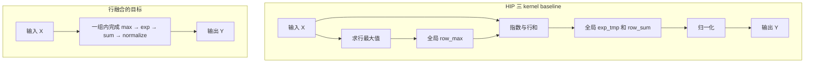
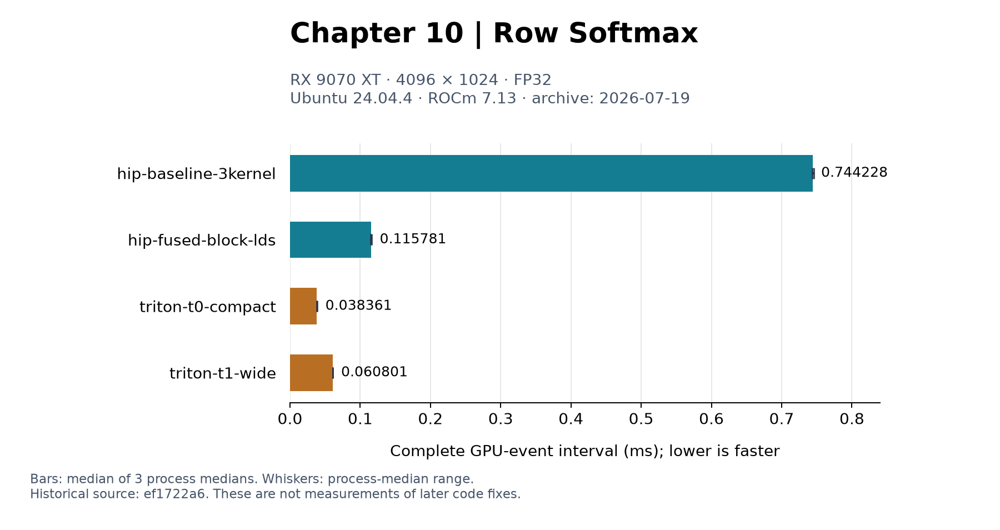

<script setup>
import SoftmaxJourney from './softmax-journey.vue'
import SoftmaxExecution from './softmax-execution.vue'
</script>

# 第10章 Normalization：归一化算子

## 本章导读

第 9 章把多个输入合成一个和。现在，我们希望把一行分数变成一行非负的权重，并让这些权重加起来等于 `1`。Softmax 会先取指数，再除以整行指数的和，因此每个位置都需要知道其他位置贡献了多少。

这把前两章的基本操作连了起来：逐元素计算、最大值归约、求和归约。我们用 `[1000, 1001, 1002]` 跟踪中间值，先理解如何避免数值溢出，再看这些步骤怎样在 GPU 上协作，以及中间结果是否需要写回全局内存。

可以选择一条阅读路线：

- **先理解算法**：从[三个数的例子](#softmax-semantics)读到[融合的数据流](#softmax-dataflow)，再看[实测对照](#softmax-results)。
- **动手写 HIP**：公共部分之后进入 [HIP 实现](#ch10-hip)，从三个 kernel 读到一行一个 block。
- **动手写 Triton**：公共部分之后进入 [Triton 实现](#ch10-triton)，把一整行表示为逻辑向量，观察 mask 与两次归约。

配套代码位于 `code/part2-kernels/chapter10/`。本章使用 FP32 输入输出，已有性能证据对应 Radeon RX 9070 XT、ROCm 7.13、原生 Ubuntu 24.04；只对 `4096×1024` 和已检查的边界输入作结论。启动与计时基础沿用[第 8 章](../chapter8/index.md)和[第 5 章](../../part1-profiling/chapter5/index.md)。

## 10.1 从一行分数到一行概率 {#softmax-semantics}

本节用一行三个数明确 Softmax 的输入、输出和共享依赖。

假设输入是一行 `[2, 1, 0]`。先逐位置取自然指数，再除以这些指数的总和：

| 输入 `x` | `exp(x)`，约值 | 除以总和 `11.1074` 后，约值 |
| ---: | ---: | ---: |
| 2 | 7.3891 | 0.6652 |
| 1 | 2.7183 | 0.2447 |
| 0 | 1.0000 | 0.0900 |

分数越大，得到的权重越大。未舍入输出的和是 `1`，所以我们可以将它们解释为一组概率。表中四位小数的和为 `0.9999`，只是显示舍入。

对形状为 `R×C` 的矩阵 `X`，本章**沿每一行的列维度**计算：

$$
Y_{r,c}=\frac{e^{X_{r,c}}}{\sum_{j=0}^{C-1}e^{X_{r,j}}},
\qquad 0\le r<R,\ 0\le c<C.
$$

`r` 是行号，`c` 是列号。一个输出 `Y[r,c]` 的分子来自当前位置，分母却来自整行。因此同行的列需要协作；不同行互不依赖，可以并行处理。我们不会对整个矩阵只求一个共同分母。

## 10.2 平移输入，避免指数溢出 {#softmax-stability}

本节保持同一个计算目标，解决直接取指数的范围问题。

把输入改成 `[1000, 1001, 1002]`。FP32 最大有限值约为 `3.4×10³⁸`，而 `exp(1000)` 远远超过这个范围。若直接取指数，最后会落到 `inf/inf`，结果不是有效概率。负方向也有问题：`[-1002,-1001,-1000]` 的指数可能全部下溢为 `0`，分母也变成 `0`。

解决方法来自一个等式。整行共同减去常数 `a`，分子与分母会同时乘上 `e^{-a}`，比例保持不变：

$$
\frac{e^{x_c-a}}{\sum_j e^{x_j-a}}
=\frac{e^{-a}e^{x_c}}{e^{-a}\sum_j e^{x_j}}
=\frac{e^{x_c}}{\sum_j e^{x_j}}.
$$

选择 `a=max(x)`，最大的指数自变量变成 `0`。对于 `[1000,1001,1002]`，我们得到：

| 步骤 | 手算结果 |
| --- | --- |
| 最大值 `m` | `1002` |
| 平移 `x−m` | `[-2, -1, 0]` |
| 指数 `p=exp(x−m)` | 约 `[0.1353, 0.3679, 1.0000]` |
| 分母 `s=sum(p)` | 约 `1.5032` |
| 输出 `y=p/s` | 约 `[0.0900, 0.2447, 0.6652]` |

::: figure fig-softmax-values
<SoftmaxJourney />

跟踪同一行三个数的最大值、稳定指数、分母和输出。每一步只依赖此前已经产生的值；图中的时间轴是教学步骤，数值保留四位小数。
:::

在 @fig-softmax-values 中，最大值和分母都只有一个，但要供三个位置共同使用。这正是两次归约的作用。数学上平移后指数属于 `(0,1]`；FP32 中很小的项仍可能下溢为 `0`，因此实现中的范围是 `[0,1]`。至少一个最大值对应的指数为 `1`，分母不会因为全部指数下溢而变成 `0`。

由此得到本章所有实现共同采用的稳定形式：

$$
m_r=\max_jX_{r,j},\qquad
p_{r,c}=e^{X_{r,c}-m_r},\qquad
s_r=\sum_jp_{r,j},\qquad
Y_{r,c}=p_{r,c}/s_r.
$$

本章输入约定为有限 FP32 值。如果输入本身含 `NaN` 或无穷，需要另行定义传播行为；减最大值不负责修复这样的输入。对极端正负有限值，浮点减法也可能溢出为负无穷，使很小的概率被舍为 `0`，不能据此宣称消除了全部数值误差。

## 10.3 中间结果需要放在哪里 {#softmax-dataflow}

本节把数学步骤连成数据通路，建立融合要解决的问题。

稳定 Softmax 由四个逻辑操作组成：

| 操作 | 已学过的模式 | 产生什么 |
| --- | --- | --- |
| `max(x)` | Reduction | 整行共享的一个最大值 |
| `exp(x−m)` | Element-Wise | 每列一个指数 |
| `sum(p)` | Reduction | 整行共享的一个分母 |
| `p/s` | Element-Wise | 每列一个输出 |

四个操作不要求启动四个 kernel。我们可以把中间值写到全局数组，由后一个 kernel 接着计算；也可以让一组线程完成整行，在组内交换共享值。

::: figure fig-softmax-fusion-path


上方通过全局中间数组连接三次 dispatch；下方把整行交给同一组执行单元。实际 HIP 融合版仍会重复读取输入，Triton 则在 program 内保留逻辑中间值。
:::

主 shape 是 `4096×1024`，仅 `exp_tmp` 就需要 `4096×1024×4 Byte=16 MiB`。省掉它的一次完整写入和随后读取，按数组元素计算少了 `32 MiB` 的中间数据访问；这不等于 profiler 已测到相同数量的 GDDR6 流量，缓存和编译器还会影响实际访问。

融合还会改变行内并行方式、同步与寄存器需求。因此我们要同时问：少写了哪些数组，多做了哪些计算，又让多少线程参与同一行？

## 10.4 固定正确性和完整计时 {#softmax-contract}

本节说明后面的版本怎样使用同一份输入与检查标准。

| 项目 | 实验约定 |
| --- | --- |
| 输入输出 | 连续的 `R×C` FP32 矩阵，沿最后一维计算 |
| 输入构造 | 确定性有限值，按行叠加 `+1000`、`−1000`、`0` |
| 参考 | HIP 使用 CPU 稳定 Softmax；Triton 使用 CPU `torch.softmax(..., dim=1)` |
| 元素误差 | 最大绝对误差不超过 `2e-5`，所有输出必须有限 |
| 行和误差 | 每行和与 `1` 的差不超过 `2e-5` |
| 检查时机 | 计时前检查一次；计时后检查最后一次输出 |
| event 区间 | baseline 包含全部 3 次 dispatch；融合版包含完整 1 次 dispatch |
| 区间之外 | 内存分配、CPU reference、拷贝、Triton 首次 JIT |

两个 CPU reference 的累加路径不同，行和检查也分别使用 CPU FP64 累加与 PyTorch FP32 求和。它们使用相同容差，足以检查本章案例，但不是逐比特相同的裁判实现。

输入中的大正负平移覆盖了指数范围压力；不同的行还带有不同基础数值，因此现有脚本**并未直接构造一对 `x` 与 `x+1000` 来比较平移不变性**。这个单独的关系测试放在练习里。

脚本包含 `1×1、2×31、3×32、4×33、2×255、3×257` 六组边界。列数决定循环和 mask 是否越界，行数决定 grid 是否遗漏输出。通过这些案例不代表任意长行、其他 dtype 或所有输入分布都已验证。

## 10.5 用 HIP 或 Triton 完成整行 {#softmax-implementation}

本节分别观察显式线程协作与逻辑向量表达。公式和裁判保持一致，详细实现通过标签切换。

<ImplementationTabs id="ch10-implementation">
<template #hip>

### 10.5.1 HIP：三个 kernel 串起稳定公式 {#ch10-hip}

`softmax_hip.hip` 中的 `hip-baseline-3kernel` 把中间步骤展开，适合先读清楚每个数组的用途。

第一个 kernel 中，一个 thread 负责一行，循环得到行最大值：

```cpp
float maximum = kDeviceNegativeInfinity;
const std::size_t base = row * columns;
for (std::size_t column = 0; column < columns; ++column) {
    maximum = fmaxf(maximum, input[base + column]);
}
row_max[row] = maximum;
```

`base` 是当前行首下标。源码中的 `kDeviceNegativeInfinity` 实际取接近最小有限 FP32 的值，用于本章有限输入的最大值初值；名称并不表示它真是 IEEE 负无穷。

第二个 kernel 读取行最大值，逐列保存指数，同时累加分母：

```cpp
float sum = 0.0F;
for (std::size_t column = 0; column < columns; ++column) {
    const float value = expf(input[base + column] - row_max[row]);
    exponentials[base + column] = value;
    sum += value;
}
row_sum[row] = sum;
```

第三个 kernel 回到一线程一元素，使用 `index / columns` 找到当前元素所属的行：

```cpp
if (index < elements) {
    output[index] = exponentials[index] / row_sum[index / columns];
}
```

前两个阶段都让一个线程串行处理整行。在同一轮循环中，相邻线程处理相邻行，读取地址相隔 `columns` 个元素；这也与一组线程读取相邻列的映射不同。因此后面 baseline 与融合版的比较同时改变了 dispatch、中间数组和线程映射。

::: figure fig-softmax-three-kernel
<SoftmaxExecution scenario="three-kernel" />

baseline 三个 kernel 用全局中间数组串接的数据流：dispatch 1 写 row_max，dispatch 2 物化 exp_tmp（16 MiB）与 row_sum，dispatch 3 归一化写回。图为 3 行 × 3 列教学缩略，逻辑访问量按「写一次、读一次」计算，不是硬件事务计数。
:::

如 @fig-softmax-three-kernel 所示，三个 dispatch 之间传递的是全局数组：指数被完整写进 `exp_tmp` 再整读一遍。把这张图与 @fig-softmax-fusion-path 的下方路线对照，就能看到融合要省掉的是哪一段往返。

已准备 Part 2 环境后，可以单独运行两版 HIP：

```bash
cd code/part2-kernels
source ./activate-rocm.sh
hipcc --offload-arch=gfx1201 -O3 -std=c++17 \
  chapter10/softmax_hip.hip -o /tmp/softmax_hip
/tmp/softmax_hip --version all --rows 4096 --cols 1024 \
  --block 256 --warmup 10 --repeat 50
```

### 10.5.2 一个 block 合作处理一行

`hip-fused-block-lds` 使用 `blockIdx.x` 作为行号。若 `block=256`，线程 `t` 读取列 `t、t+256、t+512……`。每一轮中，相邻线程访问相邻列。

每个线程先求自己的局部最大值，再借用第 9 章的 LDS 树合并：

```cpp
shared[lane] = local_maximum;
__syncthreads();

for (unsigned int stride = blockDim.x / 2; stride > 0; stride /= 2) {
    if (lane < stride) {
        shared[lane] = fmaxf(shared[lane], shared[lane + stride]);
    }
    __syncthreads();
}
```

本文件把 `threadIdx.x` 命名为 `lane`，这里它是 **block 内线程编号**，不是 wavefront 内的 lane 编号。这个区别在 `block=256` 包含多个 wavefront 时很重要。

得到行最大值后，各线程重新遍历自己的列，累加稳定指数，再复用 LDS 求整行分母。先看最大值读出后的一道屏障：

```cpp
const float maximum = shared[0];
// Every thread must read the maximum before LDS is reused for the sum.
__syncthreads();
```

最后一次 max 树归约屏障保证最大值已经写好；上面这道屏障还要保证**所有线程都读完最大值**，其他线程才能把 LDS 改作 sum 的空间。如果一个 wavefront 先覆盖 `shared[0]`，另一个尚未读取最大值的 wavefront 就可能拿错数据。复用共享存储需要同时照顾写者和读者。

最后再遍历一次输入并写回：

```cpp
output[base + column] =
    expf(input[base + column] - maximum) / denominator;
```

当前实现没有保存整行指数，因此源码中扫描输入三次，并在求和与输出阶段分别计算指数。它省去了全局 `exp_tmp` 和两次 launch，也付出了重复读取和重算的成本；不能描述为“输入只读一次”。

::: figure fig-softmax-fused-timeline
<SoftmaxExecution scenario="fused-row" />

hip-fused-block-lds 一个 block 处理一行的时间线：跨步局部 max → LDS max 树 → 读者屏障 → 复用 LDS 求 sum 树 → 重算指数写回。图为 block=4 线程、3 列的教学缩略（无有效列的线程演示单位元），行数据为正文手算值。
:::

如 @fig-softmax-fused-timeline 所示，LDS 在一次 kernel 里先后扮演两个角色：先当 max 树的空间，再当 sum 树的空间。中间那道**读者屏障**是关键——所有线程都读完 `shared[0]` 里的最大值之后，其他线程才能把它覆盖掉。

### 10.5.3 当前实现的范围

当前 HIP 实现使用整个 block 的 LDS 树，尚未实现 wavefront shuffle 收尾。硬件以 wave32 执行线程，并不自动把 LDS 算法变成 shuffle 算法。

树从 `blockDim.x/2` 逐轮减半，因此命令行要求 block 为 `1–1024` 之间的 2 的幂。列数没有这个要求；没有有效列的线程给 max 贡献最低初值，给 sum 贡献 `0`。

`block=256` 时源码申请 `256×4=1024 Byte` 动态 LDS。这个申请量可以手算，但实际占用率和寄存器成本不能只看数组大小。如果保存指数来减少重算，需要同时确定每个线程要保存多少值、支持多长的行，以及资源增加后的性能。

</template>
<template #triton>

### 10.5.4 Triton：把一整行看成逻辑向量 {#ch10-triton}

`softmax_triton.py` 的 kernel 直接表达稳定公式。下列片段来自 `softmax_row_kernel`：

```python
row = tl.program_id(axis=0)
offsets = tl.arange(0, BLOCK_SIZE)
valid = offsets < columns

logits = tl.load(
    input_ptr + row * input_row_stride + offsets,
    mask=valid,
    other=-float("inf"),
)
maximum = tl.max(logits, axis=0)
numerator = tl.exp(logits - maximum)
denominator = tl.sum(numerator, axis=0)
probabilities = numerator / denominator
tl.store(
    output_ptr + row * output_row_stride + offsets,
    probabilities,
    mask=valid,
)
```

把 @fig-softmax-values 对照过来：`maximum` 是 `1002`，`numerator` 对应三个稳定指数，`denominator` 对应 `1.5032`。`tl.max` 和 `tl.sum` 沿逻辑向量的第 0 维归约；program 中只有这一行，因此它们不会把其他行一起算进去。

Host 的 grid 是 `(rows,)`，每行启动一个 program。program 操作的 `BLOCK_SIZE` 个逻辑位置由编译器分配给硬件线程；`BLOCK_SIZE=1024` 不表示启动 1024 个显式线程。

### 10.5.5 mask 同时影响边界和数学

若 `columns=3`，紧凑配置选择 `BLOCK_SIZE=4`。前三个位置是输入，最后一个位置用负无穷补齐：

```text
逻辑输入：[1000, 1001, 1002, −∞]
减最大值：[  −2,   −1,    0, −∞]
指数约值：[0.1353, 0.3679, 1, 0]
```

补齐位置不会改变 max，取指数后又给 sum 贡献 `0`。最终 store 的 mask 防止写到行外。若 load 时用 `0` 补齐，这个无效位置的指数也会参与分母；全负输入还会把最大值错误地改变成 `0`。即使 store 不写第四格，它已经污染了归约，所以 mask 的默认值必须与数学配套。

这里的指数由 `tl.exp` 计算，与 CPU `exp` 的近似路径可能不同；结合归约顺序，输出采用容差比较而非逐比特一致。

### 10.5.6 Host 和两个配置

Host 先分配输出，调用 `softmax_row_kernel[(rows,)]`，传入输入输出的行跨度、逻辑块宽度与 `num_warps`。程序先检查完整输出，再预热和计时，每轮 event 完成后读取该轮时间，最终再做一次输出检查。

| 配置 | 主 shape 下的 `BLOCK_SIZE` | `num_warps` | 变化 |
| --- | ---: | ---: | --- |
| `triton-t0-compact` | 1024 | 4 | 覆盖一行的最小 2 的幂 |
| `triton-t1-wide` | 2048 | 8 | 同时扩大逻辑宽度和参与的 warps 数 |

默认 t1 取 t0 宽度的两倍，最高 `65536`。它是一组参数对照，并非已知优化；因为同时改了两个参数，也不能从结果独立推断每个参数的贡献。

单独运行 Triton：

```bash
cd code/part2-kernels
source ./activate-rocm.sh
python chapter10/softmax_triton.py --version all \
  --rows 4096 --cols 1024 --warmup 10 --repeat 50
```

脚本允许列数不超过 `65536`，这个 CLI 限制不是“所有这类长行已经实测通过”的承诺。更长行或资源不足时，需要重新设计分块与归约，而不是继续无限扩大逻辑向量。

</template>
</ImplementationTabs>

## 10.6 先读测量，再解释融合收益 {#softmax-results}

本节把不同实现放回共同的输入与计时区间，保留没有提速的配置。

下面保留 2026-07-19 的历史观察值。本轮代码检查发现 HIP 融合版在复用 LDS 前缺少一道读者屏障，当前源码已经补上；旧测试虽然通过，仍不能证明该同步缺口安全。**表中 HIP 融合时间对应修复前源码，不能直接用作修复后的性能结论。**

归档实验条件为：**RX 9070 XT（gfx1201）、原生 Ubuntu 24.04.4、ROCm 7.13、PyTorch 2.11、Triton 3.6；`4096×1024` FP32，warmup 10 次、repeat 50 次、3 个独立进程**。表中时间是三个进程各自 median 的中位数。

| 实现 | 完整 Softmax median（ms） | 三进程 median 范围（ms） |
| --- | ---: | ---: |
| `hip-baseline-3kernel` | 0.744228 | 0.743547–0.746188 |
| `hip-fused-block-lds` | 0.115781 | 0.114701–0.116281 |
| `triton-t0-compact` | 0.038361 | 0.037941–0.038841 |
| `triton-t1-wide` | 0.060801 | 0.060581–0.060841 |

::: figure fig-softmax-performance


比较时从输入与实现范围出发。扩大逻辑块并增加 warps 的 t1-wide 在当前 shape 上更慢，这个负结果与较快版本一起保留。
:::

HIP 融合版的历史时间约为 baseline 的六分之一。但它同时减少了 launch、去掉了全局中间数组，并把单线程串行读行改成 block 协作；不能把全部收益归给“少两次 launch”。

Triton wide 版比 compact 版慢。两者数学相同，却分别使用 `1024/4` 与 `2048/8` 的逻辑块和 warps 配置。更多参与资源未必弥补额外逻辑工作与协作成本。现有 profile 中，两版的 VGPR 字段都是 `40`，所以也不能未经进一步证据就写成“wide 版因为寄存器数更高而变慢”。

把实现放在一起，可以明确它们各自承担的工作：

| 问题 | HIP baseline | HIP LDS 融合 | Triton |
| --- | --- | --- | --- |
| 行内分工 | 归约阶段一线程一行 | 一 block 一行 | 一 program 一行 |
| 每次调用的主体 kernel 数 | 3 | 1 | 1 |
| 指数中间结果 | 写入全局数组 | 不保存，输出时重算 | program 内逻辑值 |
| max、sum 协作 | 线程串行循环 | block 的 LDS 树 | `tl.max`、`tl.sum` |
| 输入读取（源码层面） | max 和 exp 阶段读取 | max、sum、输出阶段读取 | 一次逻辑 load |

program 内的逻辑值不等于每种配置都能完全驻留在寄存器。源码能告诉我们没有显式全局中间数组，实际是否发生溢出存储仍应检查生成代码与资源信息。

证据入口是 `code/part2-kernels/chapter10/evidence/manifest.json`、`summary.csv`、`profile_summary.csv`，对应源码 `ef1722a6743bc0a9d6528d1fa938ad64976f0c05`。其中 `chapter9-process-*` 是章节重排前的命名。历史记录保留原数值；代码修复后的结果需要另外实测，不能自动沿用这张表。

2026-09-11 补上 LDS 复用屏障后，两个 HIP 实现在 8 组边界形状和主形状 `4096×1024` 的 3 个独立进程中，计时前后校验均通过。该次运行的融合版三进程 median 为 `0.113042 ms`，范围为 `0.101562–0.118622 ms`；它属于单独的修正验证，未重跑 Triton 或采集新 trace，不能与上面的历史表拼成新排名。详细参数、源码哈希和逐条结果见[同步修正记录](https://github.com/datawhalechina/hello-gpu/blob/dev/code/part2-kernels/chapter10/EXPERIMENT.md)。

## 10.7 运行、筛选 trace 与检查边界 {#softmax-rerun}

本节把一次完整复跑和逐条解释记录连起来。Part 2 环境准备好后，在项目根目录执行：

```bash
cd code/part2-kernels
uv sync
bash chapter10/run_all.sh
```

脚本先编译 HIP，依次运行六组边界 shape 的四种实现，再运行默认 `4096×1024`、warmup 10 次、repeat 50 次。先确认 `correct=OK precheck=OK postcheck=OK`，再比较相同 shape 的 `median_ms`。

`run_all.sh` 负责正确性和计时，独立的 `chapter10/profile_all.sh` 负责采集四种实现的 trace。原先的 `RUN_PROFILE=1` 不在运行脚本中读取，设置它不会开启 profiling。使用独立脚本时要提供所测源码的 `SOURCE_COMMIT`；版本在本地确定，实验机只运行已传入的代码。

历史 profile 使用 warmup 0 次、repeat 5 次。加上预检一次，共 6 次逻辑调用，因此四种实现的主体 dispatch 数对应 `18、6、6、6`。后检只检查最后一次输出，不额外运行一次 Softmax。

读 trace 时可以先定位 kernel 名称：

- baseline：`row_max_serial`、`row_exp_sum_serial`、`normalize_rows`；
- HIP 融合：`softmax_fused_lds`；
- Triton 两种配置：`softmax_row_kernel`。

现有汇总的 `grid_size_x` 数值对应 trace 中的总工作项范围。例如 HIP 融合记录为 `1,048,576`，除以 workgroup `256`，才得到 `4096` 个 block。不能直接将其解释为百万个 block。LDS 汇总为 `0` 也不能据此否定动态 LDS；使用某个资源字段前，要先确认它真正表示什么。

尚需扩展的测试包括：严格成对的平移输入、相同最大值、多种长行和其他 dtype。特别是 `C=4097`、FP16/BF16，只是后续实验方向，不能写成已经通过。

## 10.8 练习：预测数值与成本 {#softmax-exercises}

1. 将动画输入改成 `[0,0,0]`，再改成 `[1000,1000,1000]`。先写下两个结果与中间最大值，再解释哪些量变了、哪些没变。
2. 用逻辑宽度 4 处理三个负数 `[-1002,-1001,-1000]`。分别用 `0` 和负无穷填充第四格，追踪 max、指数与分母，说明错误填充可能怎样影响数值稳定性。
3. 显式构造相同基础行的 `x`、`x+1000`、`x−1000`，比较稳定公式与直接指数公式。记录非有限结果，而不只是最终误差。
4. 固定逻辑宽度，只改变 Triton `num_warps`；再固定 `num_warps`，只改变逻辑宽度。与同时改变两个参数相比，现在能更清楚地区分什么？
5. 保持一 block 一行与相同列映射，为 HIP 增加 shuffle 收尾或局部指数保存中的一种改动。先补边界检查，再报告资源、完整时间和不适用的行长。

<details>
<summary>自检提示：相同概率不代表相同中间值</summary>

两组三个相同输入都得到 `[1/3,1/3,1/3]`。行最大值不同，但减最大值之后都变成 `[0,0,0]`。

全负输入若用 `0` 填充，max 会被无效位置改成 `0`，这个补齐位置还会给分母贡献 `exp(0)=1`。即使最终不写第四格，它也已经参与了中间计算；真实三项的指数还可能全部下溢。用负无穷填充，真实最大值仍是 `−1000`，补齐位置的指数为 `0`。

</details>

## 本章小结

Softmax 的一行共享最大值和分母，两个归约之间穿插逐元素计算。减去行最大值保持数学比例，并让至少一个稳定指数为 `1`，避免直接指数的主要范围问题。

融合可以减少全局中间数组和 dispatch，但不同实现也会改变线程分工、同步、重算和资源需求。判断收益时，要把这些变化分别说清楚；本章 wide 配置变慢的结果提醒我们，参数变大不是优化方向本身。

下一章讨论[矩阵乘](../chapter11/index.md)。那时我们仍然关心数据能否留在片上，但复用会从“同一行的多个阶段”扩展到“多个输出共同使用同一块输入”。

## 延伸阅读

- [Triton Fused Softmax 教程](https://triton-lang.org/main/getting-started/tutorials/02-fused-softmax.html)：稳定公式、mask 与行融合。官方当前示例还包含 program 跨行循环等机制，本章采用更直接的一行一 program。
- [HIP Kernel Language](https://rocm.docs.amd.com/projects/HIP/en/latest/reference/kernel_language.html)：共享存储和 block 同步。
- [第 9 章：Reduction](../chapter9/index.md)：树形归约、单位元和阶段边界。
- [第 6 章：用 rocprof 找到慢点](../../part1-profiling/chapter6/index.md)：先筛选算法记录，再解释字段。
