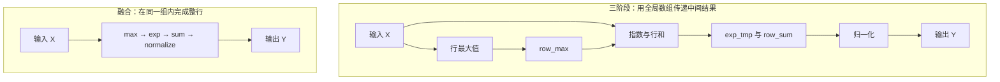
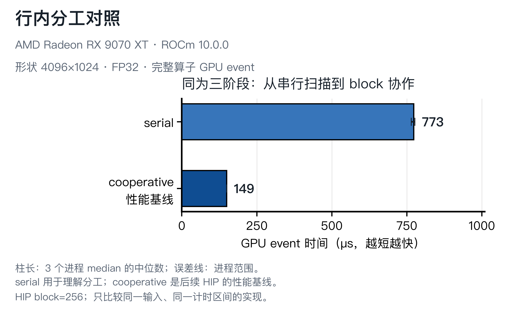
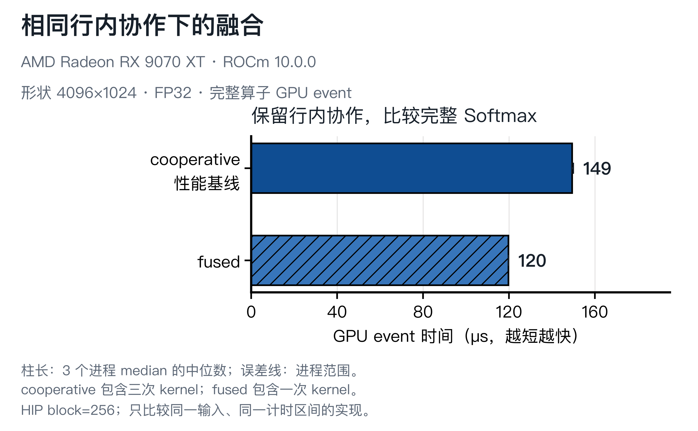
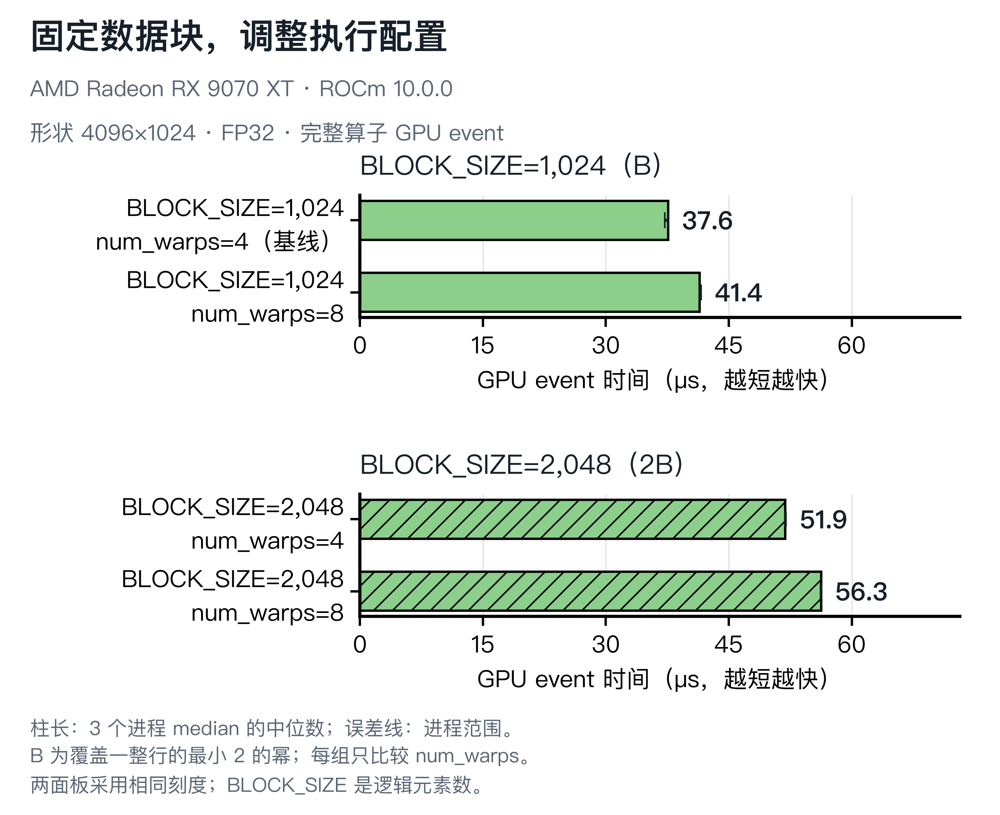
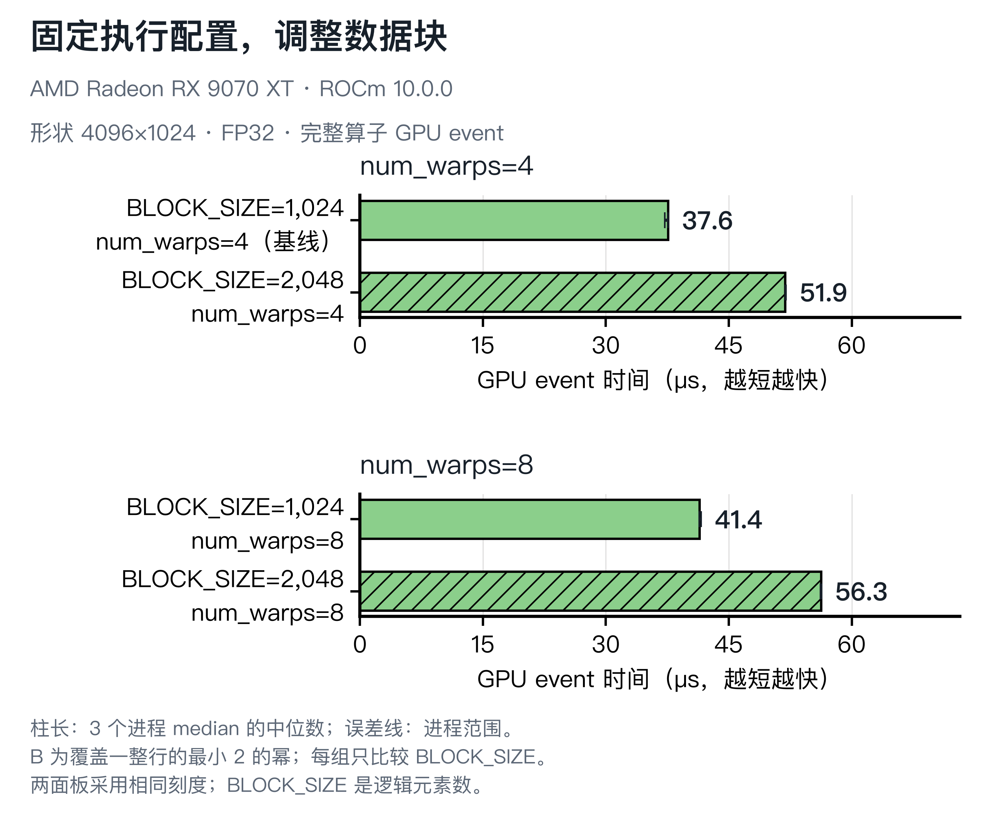
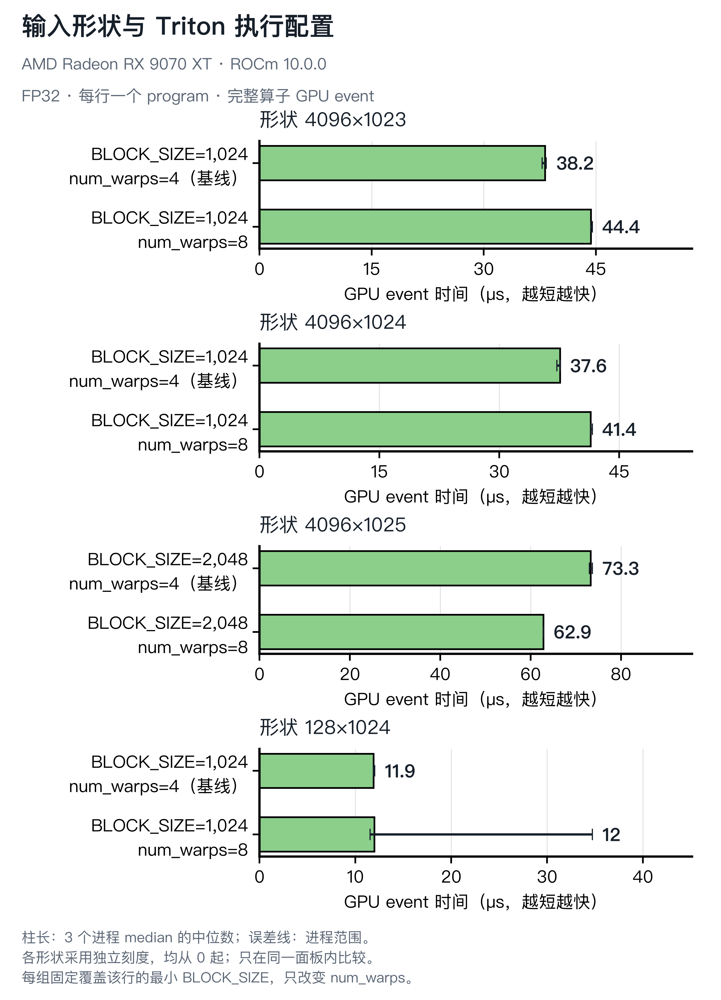
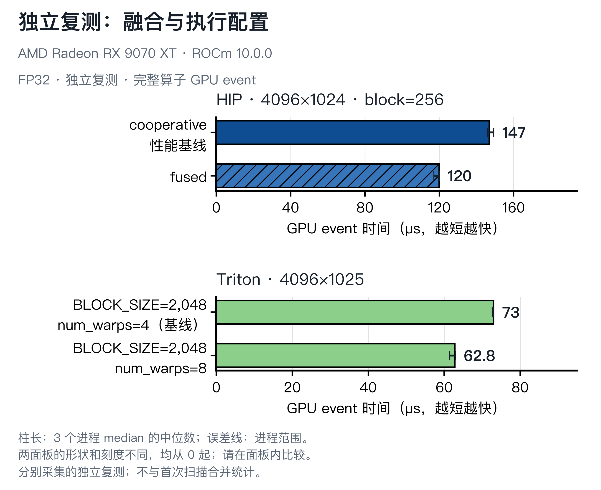

<script setup>
import SoftmaxJourney from './softmax-journey.vue'
import SoftmaxExecution from './softmax-execution.vue'
import SoftmaxTritonMask from './softmax-triton-mask.vue'
</script>

# 第10章 Normalization：归一化算子

## 本章导读

第 9 章把多个输入合成一个和。现在希望把一行分数变成一行非负权重，让它们加起来等于 `1`。Softmax 先取指数，再除以整行指数的和；因此每个输出既需要自己的输入，也需要整行共同算出的分母。

本章用 `[1000, 1001, 1002]` 看清稳定公式，再分别研究两个问题：**一行里的计算怎样分工，中间结果是否值得留在一次 kernel 内完成？** HIP 先建立每行一个 block 的三阶段基线，再比较融合；Triton 从一行一个 program 出发，分别比较参与的 warps 数和逻辑向量宽度。

- **先理解算法**：阅读[行级语义](#softmax-semantics)、[数值稳定性](#softmax-stability)与[中间数据流](#softmax-dataflow)。
- **选择 HIP**：进入 [HIP 路线](#ch10-hip)，先确认行内协作，再验证融合是否划算。
- **选择 Triton**：进入 [Triton 路线](#ch10-triton)，用固定参数的对照逐步选择执行配置。

配套代码在 `code/part2-kernels/chapter10/`，环境沿用 **Radeon RX 9070 XT（gfx1201）+ ROCm 10.0 + 原生 Ubuntu 24.04**。归约、mask 与 GPU event 分别沿用第 9、8、5 章；动画展示手算步骤，不表示真实执行速度。

## 10.1 从一行分数到一行概率 {#softmax-semantics}

输入一行 `[2, 1, 0]`，先逐位置取自然指数，再除以这些指数的总和：

| 输入 `x` | `exp(x)`，约值 | 除以总和 `11.1074` 后，约值 |
| ---: | ---: | ---: |
| 2 | 7.3891 | 0.6652 |
| 1 | 2.7183 | 0.2447 |
| 0 | 1.0000 | 0.0900 |

分数越大，得到的权重越大。未舍入输出的和为 `1`，因此可以解释成一组概率；表中四位小数之和为 `0.9999`，只是显示舍入。

对 `R×C` 的矩阵 `X`，本章沿**每一行的列维度**计算：

$$
Y_{r,c}=\frac{e^{X_{r,c}}}{\sum_{j=0}^{C-1}e^{X_{r,j}}},
\qquad 0\le r<R,\quad 0\le c<C.
$$

`r` 是行号，`c` 是列号。一个输出的分子来自当前位置，分母却来自整行；同一行内需要协作，不同行互不依赖。我们不会为整个矩阵只计算一个共同分母。

## 10.2 平移输入，避免指数溢出 {#softmax-stability}

把输入换成 `[1000, 1001, 1002]`。直接计算 `exp(1000)` 已远超 FP32 的有限范围，最后可能得到 `inf/inf`。反过来，`[-1002, -1001, -1000]` 的指数可能全部下溢为 `0`，分母也变成 `0`。

整行减去同一个常数，可以在数学上保留原来的比例：

$$
\frac{e^{x_c-a}}{\sum_j e^{x_j-a}}
=\frac{e^{-a}e^{x_c}}{e^{-a}\sum_j e^{x_j}}
=\frac{e^{x_c}}{\sum_j e^{x_j}}.
$$

选择 `a=max(x)`，最大的指数自变量就变成 `0`：

| 步骤 | `[1000,1001,1002]` 的结果 |
| --- | --- |
| 最大值 `m` | `1002` |
| 平移 `x−m` | `[-2, -1, 0]` |
| 指数 `p=exp(x−m)` | 约 `[0.1353, 0.3679, 1.0000]` |
| 分母 `s=sum(p)` | 约 `1.5032` |
| 输出 `y=p/s` | 约 `[0.0900, 0.2447, 0.6652]` |

::: figure fig-softmax-values
<SoftmaxJourney />

同一行先汇入最大值 m，再把 m 分发给各位置；指数求和得到 s 后，所有位置再使用同一个分母。数字在运算完成时更新，图中小数保留四位。
:::

@fig-softmax-values 中，先停在“汇入 max”，确认三个输入共同产生一个 1002；再进入“分发 m”，看同一个值怎样用于三次减法。分母也遵循相同的汇入与分发关系。最大值和分母各只有一个，却要供整行共同使用。这正是两次归约的职责。减去最大值后，至少一项指数为 `1`；其他项处在 `0` 与 `1` 之间，因此不会因为全部指数下溢而得到零分母。

所有版本采用相同的稳定形式：

$$
m_r=\max_jX_{r,j},\qquad
p_{r,c}=e^{X_{r,c}-m_r},\qquad
s_r=\sum_jp_{r,j},\qquad
Y_{r,c}=p_{r,c}/s_r.
$$

本章输入限定为有限 FP32 值。减去最大值解决了直接指数的主要范围问题，并不消除舍入误差；非常小的概率仍可能下溢为 `0`。含 `NaN` 或无穷的输入需要另行规定语义。

## 10.3 中间结果与计算边界 {#softmax-dataflow}

稳定公式串起了四个逻辑操作：

| 操作 | 已学过的模式 | 下一步需要什么 |
| --- | --- | --- |
| `max(x)` | Reduction | 整行共同使用的最大值 |
| `exp(x−m)` | Element-Wise | 每列一个稳定指数 |
| `sum(p)` | Reduction | 整行共同使用的分母 |
| `p/s` | Element-Wise | 每列一个输出 |

四个逻辑操作不要求启动四个 kernel。一个直接方案用三个阶段：求最大值；计算并保存指数，同时求和；读取指数与行和，完成归一化。后一个阶段要读前一个阶段的结果，所以它们通过全局数组连接。

::: figure fig-softmax-fusion-path

```mermaid
flowchart TB
  subgraph staged[三阶段：用全局数组传递中间结果]
    A[输入 X] --> M[行最大值]
    M --> GM[row_max]
    A --> E[指数与行和]
    GM --> E
    E --> GP[exp_tmp 与 row_sum]
    GP --> N[归一化]
    N --> O[输出 Y]
  end
  subgraph fused[融合：在同一组内完成整行]
    FX[输入 X] --> ROW[max → exp → sum → normalize]
    ROW --> FY[输出 Y]
  end
```

上方用中间数组连接三次调用；下方尝试在一次调用中完成。融合版如何保存或重算指数，要到具体实现中判断。
:::

@fig-softmax-fusion-path 给出一个优化方向：少一次中间数组往返，是否值得？主输入为 `4096×1024`，单个 FP32 指数数组 `exp_tmp` 就有 **16 MiB**，完整写入再读取对应 **32 MiB** 的逻辑访问。

但省掉这个数组后，指数仍要用于最后的除法。可以保留它，也可以重新计算。HIP 本章采用重算，Triton 在 program 的逻辑表达式中复用指数值。我们会分别检查各自新增和减少的工作，再用完整计时作选择。

## 10.4 正确性参考与计时范围 {#softmax-contract}

两条路线使用同一输入语义：连续的 `R×C` FP32 矩阵，沿最后一维做 Softmax。测试值随行列位置变化，并按行叠加 `+1000`、`−1000`、`0`，以覆盖直接取指数容易出问题的范围；本轮固定 `seed=20260920`。

| 检查项目 | 本章约定 |
| --- | --- |
| 输入与输出 | 有限 FP32 输入，同形状 FP32 输出 |
| 正确性参考 | CPU 按 FP64 稳定公式计算，再转为 FP32 与输出比较 |
| 逐元素误差 | 输出必须有限，最大绝对误差不超过 `2e-5` |
| 行和误差 | 每行与 `1` 的差不超过 `2e-5`；两条路线均用 FP64 累加输出行和 |
| 检查时机 | 计时前检查完整输出；计时后检查最后一次完整输出 |
| 初始化检查 | 首次输出预填 NaN，使未写入位置能被发现 |

正确性参考负责判断答案；**HIP 的路线基线是 cooperative 三阶段，Triton 的路线基线是紧凑逻辑宽度与 4 warps**。CPU reference 不作为 GPU 性能基线。

本次主形状为 `4096×1024`。另外对 cooperative、fused 和四项 Triton 配置检查并计时 `4096×1023`、`4096×1025`、`128×1024`；主矩阵与这些形状共 75 个独立进程、3,750 个计时样本。`1×1`、`3×33`、`3×257`、`3×1025` 的七配置共 28 项小边界检查也全部通过。这里验证了带较大正负偏移的有限输入，没有把它称为任意输入上的数值保证。

完整 Softmax 的 event 区间从第一个 kernel 之前开始，到最后一个 kernel 之后结束：三阶段包含全部三次调用，融合包含一次调用。两条路线每轮都等待结束 event 完成，再读取该轮时间。内存分配、初始数据拷贝、CPU reference、输出检查和 Triton 首次 JIT 均在稳态计时之外。

正式采集于 **2026-09-20，Radeon RX 9070 XT（gfx1201）、ROCm SDK 10.0.0、原生 Ubuntu 24.04**，HIP 为 7.15.26333，Triton 为 3.8.0。每配置三个独立进程，各预热 10 次、计时 50 次，轮换执行顺序；同一进程复用数组、不主动刷缓存，设备保留桌面与已有上下文。短 event 区间仍可能包括 CPU 提交空隙。

正式计时不打开 profiler，trace 另行采集。结果图以各独立进程 median 的中位数作为中心，范围表示这些 median 的最小值到最大值，不是置信区间。先检查完整时间，再用阶段诊断解释下一步要研究什么。

## 10.5 HIP 与 Triton 优化路线 {#softmax-implementation}

两条路线分别建立自然的基线，再围绕一个问题修改。先选一种语言读完整即可。

**环境与结果目录。** 以下命令在 GPU 机器的仓库根目录开始执行，后续保持在 `code/part2-kernels/`。沿用本篇 `uv.lock`，不要删除锁文件：

```bash
cd code/part2-kernels &&
uv sync --locked &&
source ./activate-rocm.sh
```

为本章新建一个独立结果目录，保存打印出来的路径：

```bash
mkdir -p chapter10/results &&
RUN=$(mktemp -d chapter10/results/walkthrough-XXXXXX) &&
mkdir "$RUN/build" &&
printf '本轮结果目录：%s\n' "$RUN"
```

换终端后，重新执行环境准备，再恢复之前打印的目录；提示处只粘贴路径，不含 `RUN=`：

```bash
read -r -p '粘贴上次输出的结果目录：' RUN &&
test -n "$RUN" && test -d "$RUN/build" &&
printf '继续使用结果目录：%s\n' "$RUN"
```

需要重测或改动源码时，新建 `RUN`，重新编译 HIP；恢复旧目录只用于继续未修改的实验。后续命令会拒绝写入已有样本。

每条命令先校验，再完成一个进程的 10 次预热与 50 次计时；折叠输出对应第 1 个进程。**图使用三个独立进程的统计，不是一次终端输出。** 手工复测时同时把样本名 `p1` 与 `--process 1` 改为 `p2`/`2`、`p3`/`3`，每遍覆盖同组候选并轮换起始项。[章末批量入口](#softmax-rerun)会自动完成这一步、汇总并画本轮图，不要求先运行 profiler。

本章把三个问题分开：答案与行和是否正确，完整 Softmax 是否更快，以及融合后程序是否保持了计划中的行分工。前两个问题每轮都检查，第三个问题只在融合对照中用一组 trace 核对。

<ImplementationTabs id="ch10-implementation">
<template #hip>

### 10.5.1 公式入口：展开三个阶段 {#ch10-hip}

<a id="ch10-hip-source"></a>

<details>
<summary>完整源码：code/part2-kernels/chapter10/softmax_hip.hip</summary>

<<< @/../code/part2-kernels/chapter10/softmax_hip.hip{cpp}

</details>

这份文件包含本路线的输入准备、kernel、启动、校验与计时；后续配置共用它，按函数和运行参数定位改动。

先编译一次。未修改源码时可复用本轮可执行文件；修改源码后请新建结果目录再编译：

```bash
test -d "${RUN:?请先准备本章环境与结果目录}/build" && \
if [[ ! -x "$RUN/build/softmax_hip" ]]; then
  hipcc --offload-arch=gfx1201 -O3 -std=c++17 \
    chapter10/softmax_hip.hip -o "$RUN/build/softmax_hip"
fi
```

`softmax_hip.hip` 的 `baseline` 版本便于对照公式：前两个 kernel 各让一个线程处理一整行，第三个 kernel 再按元素写回。

| kernel | 分工 | 写出什么 |
| --- | --- | --- |
| `row_max_serial` | 一个线程循环读取整行 | `row_max[row]` |
| `row_exp_sum_serial` | 同样逐列循环，取指数并求和 | `exponentials`、`row_sum[row]` |
| `normalize_rows` | 每个有效线程处理一个元素 | `exponentials[index] / row_sum[index / columns]` |

::: figure fig-softmax-three-kernel
<SoftmaxExecution scenario="three-kernel" />

三次调用的静态交接图，只跟踪一行 [1000,1001,1002]。橙色框是全局中间数组：后续调用读取这些结果，输入和中间数组不会因读取消失。
:::

@fig-softmax-three-kernel 中，第二次调用需要原输入和行最大值，第三次调用需要保存的指数和行和。先沿这些依赖确认中间数组的用途。进入优化之前，还要解决它的行内分工：一个线程独自扫描 1024 个数，同行没有用上多个线程的协作；同一轮中相邻线程还在读取不同行，地址相隔 `columns` 个元素。

先运行公式版本，检查逐元素误差和行和误差：

<!-- benchmark:hip-serial-b256:4096x1024 -->

```bash
test -d "${RUN:?请先准备本章环境与结果目录}/build" && \
test ! -e "$RUN/n4096x1024-hip-serial-b256-p1.csv" && \
"$RUN/build/softmax_hip" \
  --block 256 --version baseline --rows 4096 \
  --cols 1024 --warmup 10 --repeat 50 \
  --seed 20260920 --config-id hip-serial-b256 --samples "$RUN/n4096x1024-hip-serial-b256-p1.csv" \
  --process 1
```

<details>
<summary>真实输出：hip-serial-b256，shape=4096x1024，第 1 个独立进程</summary>

<<< @/../code/part2-kernels/chapter10/evidence/walkthrough/logs/n4096x1024-hip-serial-b256-p1.log{text}

</details>

先确认 `correct/precheck/postcheck=OK`，再核对 `shape=4096x1024,launches=3`。`median_ms` 是这个进程的完整三阶段时间，不能只选最短一轮作为成绩。

因此先保留三个阶段和这些中间数组，把每一行交给整个 block。这一步建立后面的融合基线，避免将行内并行化和阶段融合一次混在同一个比较里。

### 10.5.2 建立基线：每行一个 block，保留三个阶段

新版 `cooperative` 仍由三个 kernel 组成，每个 kernel 都让一个 block 处理一行。`blockIdx.x` 是行号，线程 `t` 负责列 `t、t+blockDim.x、t+2×blockDim.x……`。

先把 block 缩为 4 个线程、列数设为 10，就能检查分工：

| block 内线程 | 负责的列 |
| --- | --- |
| 0 | `0、4、8` |
| 1 | `1、5、9` |
| 2 | `2、6` |
| 3 | `3、7` |

每列恰好处理一次，每一轮相邻线程读取相邻列。真实主配置使用 `block=256`、`C=1024`，所以每个线程先处理 4 列。

第一个阶段 `row_max_block` 先各自求局部最大值，再用第 9 章的 LDS 树合并：

```cpp
const unsigned int lane = threadIdx.x;
const std::size_t base = static_cast<std::size_t>(blockIdx.x) * columns;
float local = kDeviceNegativeInfinity;
for (std::size_t column = lane; column < columns; column += blockDim.x)
    local = fmaxf(local, input[base + column]);
shared[lane] = local;
__syncthreads();
for (unsigned int stride = blockDim.x / 2; stride > 0; stride /= 2) {
    if (lane < stride) shared[lane] = fmaxf(shared[lane], shared[lane + stride]);
    __syncthreads();
}
if (lane == 0) row_max[blockIdx.x] = shared[0];
```

这里沿用源码中的变量名 `lane`，它表示 `threadIdx.x`，即 block 内线程编号。没有有效列的线程保持 max 的单位元，仍要到达 block 屏障。
第二阶段 `row_exp_sum_block` 使用同样的列分工，每个线程计算自己负责的指数、写入全局指数数组，并累加局部和：

```cpp
const float maximum = row_max[blockIdx.x];
float local = 0.0F;
for (std::size_t column = lane; column < columns; column += blockDim.x) {
    const float value = expf(input[base + column] - maximum);
    exponentials[base + column] = value;
    local += value;
}
```

之后用 LDS 求和树得到 `row_sum`。第三阶段 `normalize_block` 仍按一行一个 block，把保存的指数除以这行的分母。三个阶段之间通过同一 stream 的调用顺序交接；每个阶段内部则用 block 屏障协调 LDS 读写。

**建立这一步对照的目的，是先观察行内协作。** serial → cooperative 没有减少 kernel 数，也没有去掉中间数组，但改变了归约方式、线程与列的映射以及启动规模。它们的总体变化不能简化成某一项硬件成本。

在同一份源码中选择 `cooperative`；输入与计时参数不变：

<!-- benchmark:hip-cooperative-b256:4096x1024 -->

```bash
test -d "${RUN:?请先准备本章环境与结果目录}/build" && \
test ! -e "$RUN/n4096x1024-hip-cooperative-b256-p1.csv" && \
"$RUN/build/softmax_hip" \
  --block 256 --version cooperative --rows 4096 \
  --cols 1024 --warmup 10 --repeat 50 \
  --seed 20260920 --config-id hip-cooperative-b256 --samples "$RUN/n4096x1024-hip-cooperative-b256-p1.csv" \
  --process 1
```

<details>
<summary>真实输出：hip-cooperative-b256，shape=4096x1024，第 1 个独立进程</summary>

<<< @/../code/part2-kernels/chapter10/evidence/walkthrough/logs/n4096x1024-hip-cooperative-b256-p1.log{text}

</details>

同样先检查输出与行和，再比较完整时间。下面图表汇总三个进程，终端折叠区展示第 1 个进程。

两版均通过输出和行和检查。主输入的完整时间从 serial 的 **773.261 μs** 降至 cooperative 的 **149.296 μs**。启动代码中，串行版前两阶段各用 16 个 block，协作版三个阶段各用 4,096 个 block，每块 256 线程。分工可从代码核对；这项完整时间差没有单独测出某一种成本。

::: figure fig-softmax-round-cooperative


行内协作准备对照：两版保留相同中间数组和三个阶段，变化的是怎样将一行分配给线程。后续融合统一与 cooperative 比较。
:::

本轮先采用 cooperative 作为 HIP 性能基线。它仍要保存整张指数数组，仍通过三个 kernel 完成。下一步围绕这些中间交接提出融合假设，而不是继续用串行版本作为所有收益的分母。

### 10.5.3 融合对照：保持行分工，减少中间交接

现在有了每行一个 block 的正确实现，三个阶段之间仍要传递 `row_max`、`exponentials`、`row_sum`。下一项假设是：**保持这套行分工，在同一个 kernel 中完成 max、sum 和归一化，减少中间交接能否覆盖重读与重算的代价？**

`fused` 保持 `block=256`，沿用相同的列步长和两棵 LDS 树。区别在于行最大值与分母在一次 kernel 内交接，不再通过全局行标量数组传递。指数不写入 `exponentials`，最后输出时重新计算。

#### LDS 复用必须等到所有读者完成

max 树结束后，行最大值位于 `shared[0]`。每个线程先把它读到自己的局部变量，再共同经过一道屏障：

```cpp
const float maximum = shared[0];
// Every thread must read the maximum before LDS is reused for the sum.
__syncthreads();
```

前一轮屏障保证最大值已经写好；这里的屏障保证**所有线程都已经读完**。否则，一个 wavefront 先把 LDS 改作 sum 空间，另一个尚未读取最大值的 wavefront 就可能读到被覆盖的数据。

接下来每个线程再次扫描自己的列，累加 `expf(input - maximum)`；将局部和写入 LDS，用同样的树求出分母。最后再扫描一次自己的列，写出：

```cpp
output[base + column] =
    expf(input[base + column] - maximum) / denominator;
```

::: figure fig-softmax-fused-timeline
<SoftmaxExecution scenario="fused-row" />

LDS 复用特写：shared[0] 的 1002 被读成各线程自己的 maximum 副本；全 block 经过读者屏障后，线程 0 才将局部指数和约 0.1353 写入这个共享槽。本例采用 3 列、256 线程，只显示两个代表读者。
:::

在 @fig-softmax-fused-timeline 的“允许覆盖”一步，比较共享槽和两个 maximum 副本：只有共享槽变成约 0.1353，已经取得的副本仍为 1002。线程 32 没有有效列，也须读最大值并参与 block 屏障；图外其余线程遵循相同规则。无有效列的线程给 max 贡献负无穷，给 sum 贡献 `0`，不能跳过同步。

#### 把减少和增加的工作一起列出来

融合没有把输入变成只读一次。按当前源码，每个有效元素在 max、sum、最终输出三个阶段各被读取一次，指数在 sum 和输出时各计算一次：

| 源码中的工作 | cooperative 三阶段基线 | fused |
| --- | ---: | ---: |
| 每次完整调用的 kernel 数 | 3 | 1 |
| 输入 `X` 的扫描次数 | 2 | 3 |
| 每个元素的 `expf` 次数 | 1 | 2 |
| 指数数组 | 写一次、读一次 | 不读写 |
| `row_max`、`row_sum` | 经全局数组传递 | 在一次 kernel 内使用 |
| 行内分工与归约 | 一行一 block、列步长相同、LDS 树 | 保持同一方案，并正确同步 LDS 复用 |

主输入每张 FP32 矩阵是 16 MiB。只数输入、指数数组和输出这三类大数组，基线为 `2×读X + 写exp + 读exp + 写Y`，共 **80 MiB**；融合版为 `3×读X + 写Y`，共 **64 MiB**。去掉指数数组的 32 MiB 往返，同时新增一遍 16 MiB 输入读取，还多算了一次指数。

这是按源码估算的逻辑访问量，另有行标量和 LDS 访问；缓存与编译器会影响实际硬件流量。当前统一测试程序还为不同版本分配了相同的中间缓冲区，所以这里说明的是 fused 不再读写这些数组，不能直接当作整个进程峰值显存减少的证明。

运行 `fused`，完整输入和检查标准与 cooperative 相同：

<!-- benchmark:hip-fused-b256:4096x1024 -->

```bash
test -d "${RUN:?请先准备本章环境与结果目录}/build" && \
test ! -e "$RUN/n4096x1024-hip-fused-b256-p1.csv" && \
"$RUN/build/softmax_hip" \
  --block 256 --version fused --rows 4096 \
  --cols 1024 --warmup 10 --repeat 50 \
  --seed 20260920 --config-id hip-fused-b256 --samples "$RUN/n4096x1024-hip-fused-b256-p1.csv" \
  --process 1
```

<details>
<summary>真实输出：hip-fused-b256，shape=4096x1024，第 1 个独立进程</summary>

<<< @/../code/part2-kernels/chapter10/evidence/walkthrough/logs/n4096x1024-hip-fused-b256-p1.log{text}

</details>

检查两种误差与前后校验，再读 `launches=1` 和完整时间。是否采用由这组不带 profiler 的 benchmark 决定。

::: figure fig-softmax-round-fusion


保持行分工后比较融合方案。图中时间包含得到整张输出的完整路径，不能只取其中一个归约阶段。
:::

完整时间由 **149.296 μs** 降至 **119.717 μs**，约为基线时间的 80.2%，速度比约 **1.25×**。因此对主输入保留 fused。这支持的是减少交接、增加重读与重算之后的净收益，不能把约 29.6 μs 全部归为某次内存访问或某两次启动。

<details>
<summary>按需分析：融合是否按计划保持行分工、减少阶段交接？</summary>

已经知道 fused 更快，下面只核对执行结构。仍从 `code/part2-kernels/` 运行，对 cooperative 与 fused 分别采集；每条命令新建自己的目录，已有目录会停止本条命令。随后用第 8 章的标准库脚本按 kernel 名分开读：

```bash
test -d "${RUN:?请先准备本章环境与结果目录}/build" && \
mkdir "$RUN/profile-hip-cooperative-b256" && \
rocprofv3 --kernel-trace --output-format csv \
  --output-directory "$RUN/profile-hip-cooperative-b256" --output-file hip-cooperative-b256 -- \
  "$RUN/build/softmax_hip" \
    --block 256 --version cooperative --rows 4096 \
    --cols 1024 --warmup 5 --repeat 10 \
    --seed 20260920 --config-id hip-cooperative-b256 && \
python chapter8/inspect_trace.py \
  "$RUN/profile-hip-cooperative-b256/hip-cooperative-b256_kernel_trace.csv" \
  --kernel row_max_block --skip 6 --take 10 && \
python chapter8/inspect_trace.py \
  "$RUN/profile-hip-cooperative-b256/hip-cooperative-b256_kernel_trace.csv" \
  --kernel row_exp_sum_block --skip 6 --take 10 && \
python chapter8/inspect_trace.py \
  "$RUN/profile-hip-cooperative-b256/hip-cooperative-b256_kernel_trace.csv" \
  --kernel normalize_block --skip 6 --take 10
```

<details>
<summary>筛选后的真实 trace：hip-cooperative-b256，shape=4096x1024</summary>

<<< @/../code/part2-kernels/chapter10/evidence/walkthrough/reports/hip-cooperative-b256.txt{text}

</details>

<details>
<summary>原始 kernel trace CSV：hip-cooperative-b256，shape=4096x1024</summary>

<<< @/../code/part2-kernels/chapter10/evidence/walkthrough/profiles/hip-cooperative-b256_kernel_trace.csv{text}

</details>

```bash
test -d "${RUN:?请先准备本章环境与结果目录}/build" && \
mkdir "$RUN/profile-hip-fused-b256" && \
rocprofv3 --kernel-trace --output-format csv \
  --output-directory "$RUN/profile-hip-fused-b256" --output-file hip-fused-b256 -- \
  "$RUN/build/softmax_hip" \
    --block 256 --version fused --rows 4096 \
    --cols 1024 --warmup 5 --repeat 10 \
    --seed 20260920 --config-id hip-fused-b256 && \
python chapter8/inspect_trace.py \
  "$RUN/profile-hip-fused-b256/hip-fused-b256_kernel_trace.csv" \
  --kernel softmax_fused_lds --skip 6 --take 10
```

<details>
<summary>筛选后的真实 trace：hip-fused-b256，shape=4096x1024</summary>

<<< @/../code/part2-kernels/chapter10/evidence/walkthrough/reports/hip-fused-b256.txt{text}

</details>

<details>
<summary>原始 kernel trace CSV：hip-fused-b256，shape=4096x1024</summary>

<<< @/../code/part2-kernels/chapter10/evidence/walkthrough/profiles/hip-fused-b256_kernel_trace.csv{text}

</details>

先读 `target_rows=16`，排除预检和预热的前 6 次，留下 10 次。再看 kernel 名称：cooperative 的三个阶段与 fused 的一个阶段分别存在；不能把整个文件的行数当作一次调用的 kernel 数。四个阶段的 `workgroups_total=4096`、每组 256 线程，符合每行一个 block 的对照设计。

最后才看 `kernel_median_us`：fused 的设备区间约 110.6 μs。它不与另一轮 event 相减估算启动成本，也不把 cooperative 三个独立中位数之和作为正式成绩。首阶段有约 270.7 μs 的单次值，报告保留完整范围。

这些记录支持“融合遵循了预期的行分工与阶段数量”，仍不能把总收益分给某次读取或某次启动。HIP 的 `lds_bytes=0` 未包含这次动态 LDS 申请，源码实际请求 `256×4=1024 B`，不能读成没有 LDS。

</details>

### 10.5.4 检查行长与行数的影响

一个主形状不足以决定今后的配置。先保持行数不变，检查列数 `1023、1024、1025`：对于 `block=256`，1024 列时每线程处理 4 项；1025 列时线程 0 多处理一项，其他线程的分工基本不变。1023 列则有一个线程少处理一项，尾部仍要正确参与两次归约。

先用一个小尾部验证 fused 的分工。此处只检查答案，`warmup=0,repeat=1` 的时间不进入性能图：

```bash
test -d "${RUN:?请先准备本章环境与结果目录}/build" && \
"$RUN/build/softmax_hip" \
  --block 256 --version fused --rows 3 \
  --cols 1025 --warmup 0 --repeat 1 \
  --seed 20260920 --config-id hip-fused-b256
```

<details>
<summary>正确性输出：HIP fused，3×1025，输出与行和</summary>

<<< @/../code/part2-kernels/chapter10/evidence/walkthrough/logs/edge-3x1025-hip-fused-b256.log{text}

</details>

先读前后校验、有限值与两种误差；尾部正确后，才比较较大输入的性能。

再保持 1024 列，把行数从 4096 减少到 128。每行一个 block 意味着 grid 也从 4096 个 block 变为 128 个；可供 GPU 调度的组数和总工作量都减少了。阶段启动、中间数组与线程协作的相对成本可能随形状变化，因此要在新形状内重新比较 cooperative 和 fused。

| 形状 | cooperative（μs） | fused（μs） |
| --- | ---: | ---: |
| `4096x1023` | 150.40（147.12–151.52） | 120.38（120.06–120.48） |
| `4096x1024` | 149.30（149.16–149.96） | 119.72（119.72–119.74） |
| `4096x1025` | 156.98（153.76–157.86） | 130.52（130.26–130.62） |
| `128x1024` | 24.68（24.68–24.80） | 15.88（15.84–15.90） |

括号表示三进程 median 范围；每行在相同形状内比较。

三个补充形状里，fused 也都低于同形状的 cooperative。主形状的独立确认中，cooperative 为 **146.857 μs**（145.938–149.297），fused 为 **119.858 μs**（117.098–119.858），这项收益再次出现。确认组另行统计，不并入原来的图。这里没有扫描其他 block 大小，因此结论是保留本轮融合方案，并非找到了每种形状的最佳实现。

</template>
<template #triton>

### 10.5.5 Triton 基线：一行一个 program {#ch10-triton}

<a id="ch10-triton-source"></a>

<details>
<summary>完整源码：code/part2-kernels/chapter10/softmax_triton.py</summary>

<<< @/../code/part2-kernels/chapter10/softmax_triton.py{python}

</details>

这份文件包含本路线的输入准备、kernel、启动、校验与计时；后续配置共用它，按函数和运行参数定位改动。

Triton 路线直接用一个逻辑向量表示一行。`softmax_row_kernel` 中的步骤与手算一一对应：

```python
row = tl.program_id(axis=0)
offsets = tl.arange(0, BLOCK_SIZE)
valid = offsets < columns

logits = tl.load(
    input_ptr + row * input_row_stride + offsets,
    mask=valid,
    other=-float("inf"),
)
maximum = tl.max(logits, axis=0)
numerator = tl.exp(logits - maximum)
denominator = tl.sum(numerator, axis=0)
probabilities = numerator / denominator
tl.store(
    output_ptr + row * output_row_stride + offsets,
    probabilities,
    mask=valid,
)
```

Host 的 grid 为 `(rows,)`，每行启动一个 program。`tl.max` 和 `tl.sum` 都沿这一行的逻辑向量归约，其他行不会混进来。program 内保留了 `numerator` 这一逻辑值，没有显式的全局指数数组。

#### 先让补齐位置符合数学

若有 3 列，先选能覆盖一行的最小 2 的幂宽度 `B=4`。用一行负数 `[-1002,-1001,-1000]`，更容易检查第四个逻辑位置应该怎样处理：

::: figure fig-softmax-triton-mask
<SoftmaxTritonMask />

真实输入只有三项。无效的第四个逻辑位置加载为 −∞，取指数后贡献 0；最后只写回三个真实输出。
:::

在 @fig-softmax-triton-mask 中，停在“最大值”检查结果仍是 `−1000`，再看第四个逻辑位置怎样从 `−∞` 变成指数 `0`。load mask 负责安全读取并提供正确补值，store mask 负责不写出行外。若加载时用 `0` 补齐，它会胜过所有真实负输入，把最大值改成 `0`；真实三项的指数可能全部下溢，结果就被破坏了。

基线选择 **`BLOCK_SIZE=B`、`num_warps=4`**，其中 `B` 是覆盖 `C` 的最小 2 的幂。对于主输入 `C=1024`，基线就是 `(1024,4)`。一个 program 有 1024 个逻辑位置，并不意味着它有 1024 个显式线程；编译器负责具体映射。

先运行紧凑宽度、4 warps 的基线：

<!-- benchmark:triton-b4:4096x1024 -->

```bash
test -d "${RUN:?请先准备本章环境与结果目录}/build" && \
test ! -e "$RUN/n4096x1024-triton-b4-p1.csv" && \
python chapter10/softmax_triton.py \
  --t0-warps 4 --t1-warps 4 --t1-block 1024 \
  --version t0 --rows 4096 --cols 1024 \
  --warmup 10 --repeat 50 --seed 20260920 \
  --config-id triton-b4 --samples "$RUN/n4096x1024-triton-b4-p1.csv" --process 1
```

<details>
<summary>真实输出：triton-b4，shape=4096x1024，第 1 个独立进程</summary>

<<< @/../code/part2-kernels/chapter10/evidence/walkthrough/logs/n4096x1024-triton-b4-p1.log{text}

</details>

检查输出与行和，然后核对 `block=1024`、`num_warps=4` 与单次完整调用。基线三个进程汇总为 **37.599 μs**。这里逻辑宽度与硬件线程数是不同的量。

### 10.5.6 第一轮：固定逻辑宽度，比较 warps

基线已经用一个 program 完成一整行。接下来调整的不是 kernel 数，而是这个 program 的执行配置。先提出一个问题：**同样长的一行，使用更多 warps 参与，能否缩短完整执行时间？**

先保持 `BLOCK_SIZE=B`、输入、行数、kernel 代码不变，只比较 `num_warps=4` 与 `8`。两版仍是一行一个 program，读取相同的有效列，完成同样的 max、exp、sum 和归一化。

为检查这个选择是否依赖逻辑宽度，我们也准备 `BLOCK_SIZE=2B` 下的 4/8 对照。`B` 已经能覆盖整行，`2B` 只增加补齐位置，不增加有效列。因此图里可以分成两组，每组固定一个宽度，单独回答 warps 的变化。

更多 warps 会改变 program 内逻辑工作如何分配与协作，也可能改变资源使用。它不是“免费增加并行度”，所以先提出有限候选，再检查结果，不提前把 8 warps 当作优化版。

接下来只运行另外三项，不重复已有基线。四组数据会用于两个方向的比较：

<!-- benchmark:triton-b8:4096x1024 -->

```bash
test -d "${RUN:?请先准备本章环境与结果目录}/build" && \
test ! -e "$RUN/n4096x1024-triton-b8-p1.csv" && \
python chapter10/softmax_triton.py \
  --t0-warps 8 --t1-warps 8 --t1-block 1024 \
  --version t0 --rows 4096 --cols 1024 \
  --warmup 10 --repeat 50 --seed 20260920 \
  --config-id triton-b8 --samples "$RUN/n4096x1024-triton-b8-p1.csv" --process 1
```

<details>
<summary>真实输出：triton-b8，shape=4096x1024，第 1 个独立进程</summary>

<<< @/../code/part2-kernels/chapter10/evidence/walkthrough/logs/n4096x1024-triton-b8-p1.log{text}

</details>

<!-- benchmark:triton-2b4:4096x1024 -->

```bash
test -d "${RUN:?请先准备本章环境与结果目录}/build" && \
test ! -e "$RUN/n4096x1024-triton-2b4-p1.csv" && \
python chapter10/softmax_triton.py \
  --t0-warps 4 --t1-warps 4 --t1-block 2048 \
  --version t1 --rows 4096 --cols 1024 \
  --warmup 10 --repeat 50 --seed 20260920 \
  --config-id triton-2b4 --samples "$RUN/n4096x1024-triton-2b4-p1.csv" --process 1
```

<details>
<summary>真实输出：triton-2b4，shape=4096x1024，第 1 个独立进程</summary>

<<< @/../code/part2-kernels/chapter10/evidence/walkthrough/logs/n4096x1024-triton-2b4-p1.log{text}

</details>

<!-- benchmark:triton-2b8:4096x1024 -->

```bash
test -d "${RUN:?请先准备本章环境与结果目录}/build" && \
test ! -e "$RUN/n4096x1024-triton-2b8-p1.csv" && \
python chapter10/softmax_triton.py \
  --t0-warps 8 --t1-warps 8 --t1-block 2048 \
  --version t1 --rows 4096 --cols 1024 \
  --warmup 10 --repeat 50 --seed 20260920 \
  --config-id triton-2b8 --samples "$RUN/n4096x1024-triton-2b8-p1.csv" --process 1
```

<details>
<summary>真实输出：triton-2b8，shape=4096x1024，第 1 个独立进程</summary>

<<< @/../code/part2-kernels/chapter10/evidence/walkthrough/logs/n4096x1024-triton-2b8-p1.log{text}

</details>


四项都先检查答案和行和，再核对逻辑宽度与 warps，最后比较 `median_ms`。同名 kernel 依靠不同 `config-id` 和样本路径区分；两张图复用这一组扫描，不是再采一轮。

::: figure fig-softmax-triton-warps


每组固定一个逻辑宽度，单独比较 warps。原始 `(B,4)` 始终标出，先看紧凑宽度下的效果，再检查换一个宽度是否得到相同判断。
:::

在紧凑宽度 1024 下，4→8 warps 使时间从 **37.599 μs** 增至 **41.439 μs**；在宽度 2048 下，也从 **51.879 μs** 增至 **56.279 μs**。两组都没有获益，因此主输入继续保留 4 warps。更多参与线程并没有自动缩短整行计算。

### 10.5.7 第二轮：固定 warps，比较逻辑宽度

现在从另一个方向读取这四项实验：固定 warps，判断把逻辑向量从 `B` 扩为 `2B` 是否值得。每次直接对照都只改一个参数：

| 配置 | 第一轮用途 | 第二轮用途 |
| --- | --- | --- |
| `(B,4)` | 原始基线 | 固定 4 warps 的宽度基线 |
| `(B,8)` | 固定 `B`，增加 warps | 固定 8 warps 的宽度基线 |
| `(2B,4)` | — | 保持 4 warps，只扩大逻辑宽度 |
| `(2B,8)` | — | 保持 8 warps，只扩大逻辑宽度 |

对于同一行，`B` 已足够覆盖全部有效列。扩大为 `2B` **没有新增有效输入**，新增位置都被 mask。需要验证的是更宽逻辑向量带来的编译分配变化是否有利，还是只增加了无效位置与归约的成本；不能把这个参数解释为处理了更多有用数据。

源码层面，新增位置仍参与向量表达式，但其 load 为负无穷、指数为 `0`，store 被屏蔽。编译器如何映射或消除这些操作要看实际产物，因此不要简单将逻辑宽度翻倍换算成指令数或执行时间翻倍。

::: figure fig-softmax-triton-width


将两个参数拆开后，可以分别观察更改 warps 与扩大逻辑宽度的效果，也能检查宽度的效果是否依赖 warps 配置。
:::

固定 4 warps 时，加宽使时间从 **37.599 μs** 增至 **51.879 μs**；固定 8 warps 时，则从 **41.439 μs** 增至 **56.279 μs**。所以主输入继续保留紧凑宽度。这个退步足以决定不采用加宽。若还要判断编译器增加了哪些资源需求，可再选固定 warps 的代表配置诊断；没有这项证据时，不把时间差命名为寄存器成本。

### 10.5.8 检查逻辑宽度边界与行数

Triton 的紧凑宽度随列数跳变：

| 实际列数 `C` | 最小逻辑宽度 `B` | 紧凑版无效位置 | 加宽版 `2B` | 加宽版无效位置 |
| ---: | ---: | ---: | ---: | ---: |
| 1023 | 1024 | 1 | 2048 | 1025 |
| 1024 | 1024 | 0 | 2048 | 1024 |
| 1025 | 2048 | 1023 | 4096 | 3071 |

先确认新逻辑宽度没有污染 Softmax 的分母。下面使用同一份程序检查 3×1025，仅读正确性：

```bash
test -d "${RUN:?请先准备本章环境与结果目录}/build" && \
python chapter10/softmax_triton.py \
  --t0-warps 4 --t1-warps 4 --t1-block 2048 \
  --version t0 --rows 3 --cols 1025 \
  --warmup 0 --repeat 1 --seed 20260920 \
  --config-id triton-b4
```

<details>
<summary>正确性输出：Triton 紧凑宽度，3×1025</summary>

<<< @/../code/part2-kernels/chapter10/evidence/walkthrough/logs/edge-3x1025-triton-b4.log{text}

</details>

这里 `block=2048`，但输出仍只有 1025 列；先看 `correct` 与行和误差，再看性能形状。

从 1024 列增加到 1025 列，输入只多一项，紧凑逻辑宽度却从 1024 变为 2048。因此即便时间出现明显变化，也不能只解释为“多算了一个数”。先核对实际 `BLOCK_SIZE`、warps 和 mask，再看编译与计时。

行数的影响也要单独检查：当前每行一个 program，所以行数决定了 program 总数；加宽一行不会增加 program 数。少量长行与大量同样长的行，可能需要不同的执行配置。

::: figure fig-softmax-triton-shapes


列数决定逻辑宽度，行数决定 program 数。图中先比较紧凑宽度的 4/8 warps；各面板刻度范围不同，不能跨面板比较柱长。全部四项配置均保存在发布记录中。
:::

这次出现了配置顺序的变化：`4096×1025` 的紧凑宽度为 2048，4 warps 为 **73.298 μs**，8 warps 为 **62.858 μs**；此时 8 warps 更快。它与 `4096×1024` 的选择不同。输入的行跨度、尾部和紧凑逻辑宽度一起变化，不能把跨形状的时间差只归给 mask。

`128×1024` 下，8 warps 的三个进程 median 范围为 **11.520–34.714 μs**，明显比其他项宽。图中保留该范围，没有删掉慢进程；这组结果不足以支持稳定的配置优势。主形状重新运行紧凑 4 warps 得到 **37.400 μs**，与首次扫描接近，但只重跑一个配置不能重新证明它优于全部候选。1025 列的两配置随后在新进程中确认：4 warps 为 **72.959 μs**（72.639–73.039），8 warps 为 **62.799 μs**（61.479–62.959）。因此对这个已测形状保留紧凑宽度与 8 warps，见 @fig-softmax-performance。

这一轮的可迁移方法是：先选覆盖一行的自然宽度，再固定它比较 warps，最后在固定 warps 下验证加宽是否值得。到了新形状，先重新算 `B` 和 program 数，再决定是否沿用原配置。

</template>
</ImplementationTabs>

## 10.6 比较结果与保留方案 {#softmax-results}

两条路线围绕同一公式，却直接控制不同的工作：

| 问题 | HIP cooperative | HIP fused | Triton |
| --- | --- | --- | --- |
| 行内分工 | 一 block 一行 | 相同行分工 | 一 program 一行 |
| 一次调用的主体 kernel 数 | 3 | 1 | 1 |
| 指数如何用于输出 | 全局保存后读取 | 再次计算 | 复用 program 内逻辑值 |
| max、sum 归约 | LDS 树 | LDS 树与正确的复用屏障 | `tl.max`、`tl.sum` |
| 本轮主要选择 | 作为融合前的路线基线 | 中间交接与重算是否划算 | warps 和逻辑宽度分别是否值得改变 |

| 配置 | 完整 median（μs） | 三进程范围（μs） | 相对本路线基线的速度比 |
| --- | ---: | ---: | ---: |
| `hip-cooperative-b256` | 149.296 | 149.156–149.956 | 1.00× |
| `hip-fused-b256` | 119.717 | 119.717–119.737 | 1.25× |
| `triton-b4` | 37.599 | 37.199–37.599 | 1.00× |
| `triton-b8` | 41.439 | 41.399–41.639 | 0.91× |
| `triton-2b4` | 51.879 | 51.879–51.999 | 0.72× |
| `triton-2b8` | 56.279 | 56.199–56.318 | 0.67× |

上表为主输入 `4096×1024`。速度比用各自路线基线的时间除以当前时间；HIP 以 cooperative 为分母，Triton 以 `(B,4)` 为分母，不据此排列语言优劣。

::: figure fig-softmax-performance


独立确认使用 RX 9070 XT、ROCm 10.0 与完整输出时间。上面比较主形状的 HIP 融合，下面比较 1025 列的 Triton warps；每项仍为三进程各 50 次计时，两组分别统计。
:::

HIP 主形状的融合收益在独立确认中保持，因而保留 fused；Triton 在 1024 列时保留紧凑宽度与 4 warps，1025 列则需要重新比较 warps。后一个案例说明，调参不是给算子贴上一个永远适用的配置标签。

判断融合时，把减少的中间读写、调用次数，与增加的重读和重算一起考虑。判断参数时，先确认是否只改了计划中的选择，再看有效工作和编译配置怎样变化。配置更大、逻辑访问更少，都只是待验证的线索。

## 10.7 运行与诊断 {#softmax-rerun}

前面的命令便于逐项理解。要完成三个独立进程的整组比较，仍在已激活的 `code/part2-kernels/` 中，使用批量入口；它以尚不存在的 `$RUN/rounds` 子目录保存本轮结果：

```bash
test -d "${RUN:?请先准备本章环境与结果目录}/build" && \
python chapter10/run_rounds.py --output "$RUN/rounds" --phase main && \
python chapter10/plot_rounds.py \
  --evidence "$RUN/rounds/summary" --out-dir "$RUN/figures/main" \
  --round cooperative --round fusion --round warps --round tile
```

主阶段固定 4096×1024，先检查 28 项小边界，再测七项配置。 每项三个独立进程，各预热 10 次、计时 50 次，轮换候选顺序；先检查正确性，再汇总性能。`main` 不采集 profiler。图中心为三个进程中位数的中位数，误差线为它们的最小值到最大值，不是置信区间。

需要检查形状迁移时，再运行 validation：

```bash
python chapter10/run_rounds.py --output "$RUN/rounds" --phase validation && \
python chapter10/plot_rounds.py \
  --evidence "$RUN/rounds/summary" --out-dir "$RUN/figures/validation" \
  --round shapes
```

补测 4096×1023、4096×1025、128×1024，均保留 cooperative/fused 与四项 Triton。这一步继续使用本轮冻结的源码和配置，并检查实际环境。两条绘图命令都显式读取**你的本轮 summary**，不会用教程发布的成绩替缺失结果补值。

选出候选后，再以独立目录确认：

```bash
python chapter10/verify_rounds.py \
  --frozen-run "$RUN/rounds" --output "$RUN/confirmation"
```

默认保留 cooperative、fused、Triton 基线与主形状最快候选，重复项只运行一次。确认数据保存在自己的 `summary/summary.csv`、`summary/process-summary.csv` 与 `confirmation.json` 中，不自动并入父实验。先比较同形状的新旧进程范围，再决定是否保留候选；不要复制教程中的确认文件到新目录拼图。

程序把逐次计时写入 `samples/`，把检查与终端记录写入 `logs/`；`source/` 保存本轮源码，`commands.jsonl` 保存实际参数。已有主目录拒绝被新的 `main` 覆盖；修改代码、改变条件或重新采一轮时，新建 `RUN`。第一次编译和 Triton JIT 在稳态计时之外，后续终端继续使用本篇环境。

本章图使用 `chapter10/evidence/rounds/` 的三进程实测与独立确认；折叠终端输出来自其中第 1 个进程的原始日志，保存在 `chapter10/evidence/walkthrough/`。一次进程的中位数不必等于图的中心。按需 trace 的采集命令与阅读报告已经放在对应问题旁；批量 `--phase profile` 仅供需要完整诊断矩阵时选用。

要检查 1025 列的 warps 排名是否保持，先完成 validation，再另建确认目录：

```bash
python chapter10/verify_rounds.py --frozen-run "$RUN/rounds" \
  --output "$RUN/confirmation-1025" \
  --shape 4096x1025 --configs triton-b4 triton-b8
```

此确认只回答新形状内的 4/8 warps 选择。主形状的 trace 不能替 1025 列解释原因；少量行的大波动也应保留，不能用最快一次替换。


## 10.8 练习：预测成本并验证 {#softmax-exercises}

1. **稳定性与补齐**：分别对 `[0,0,0]`、`[1000,1000,1000]` 手算稳定 Softmax，再用宽度 4 处理 `[-1002,-1001,-1000]`。如果无效位置填 `0`，它会怎样影响 max 和分母？
2. **构造关系测试**：用同一基础行生成 `x`、`x+1000`、`x−1000`，检查平移前后的输出，并记录非有限结果。与“不同的行各自加一个平移量”相比，这项测试多检查了什么？
3. **HIP 修改**：保持 cooperative 与 fused 的相同行分工，在一个新形状上比较完整时间。若准备保存指数以避免重算，先说明每个线程要保存几个值、怎样处理尾部，再检查实际资源与性能；不能仅凭少一次 `expf` 宣布更快。
4. **Triton 修改**：选择一个新的列宽，先算 `B`，分别比较 `(B,4)/(B,8)` 与固定 warps 的 `B/2B`。保留全部结果，在新进程中确认候选；说明选择是否依赖行数。

<details>
<summary>自检提示</summary>

两组三个相同输入都得到 `[1/3,1/3,1/3]`。最大值不同，但平移后都成为 `[0,0,0]`。

全负输入若用 `0` 填充，无效位置可能成为最大值，并向分母加入自己的指数。真实三项还可能下溢为 `0`；即使最后的 store 不写无效位置，中间计算已经被污染。

保存指数会减少重算，也增加需要保留的值。扩大逻辑宽度可能改变编译分工，但在原宽度已覆盖整行时没有增加有效输入。这些改动的取舍都需要回到完整结果与实测时间。

</details>

## 本章小结

Softmax 将两次行内归约与逐元素计算连在一起。减最大值保护指数范围，单位元和 mask 让尾部正确参与运算；复用 LDS 时还要确保所有线程读完旧值，再覆盖为新用途。

HIP 先保持三个阶段建立行内协作基线，再比较融合，因而能更清楚地观察中间交接与重算的净效果。Triton 分别比较 warps 和逻辑宽度，并检查列宽边界与行数。每条路线都保留自己的初版和本轮对照，用新测量决定保留方案。

下一章进入[矩阵乘](../chapter11/index.md)。复用将从“同一行的多个阶段”扩展为“多个输出共同使用同一块输入”。

## 延伸阅读

- [Triton Fused Softmax 教程](https://triton-lang.org/main/getting-started/tutorials/02-fused-softmax.html)：稳定公式、mask 与行融合；本章采用一行一个 program。
- [HIP Kernel Language](https://rocm.docs.amd.com/projects/HIP/en/latest/reference/kernel_language.html)：共享存储与 block 同步。
- [第 9 章：Reduction](../chapter9/index.md)：树形归约、单位元和阶段边界。
- [第 6 章：用 rocprof 找到慢点](../../part1-profiling/chapter6/index.md)：筛选目标记录和解释字段。
