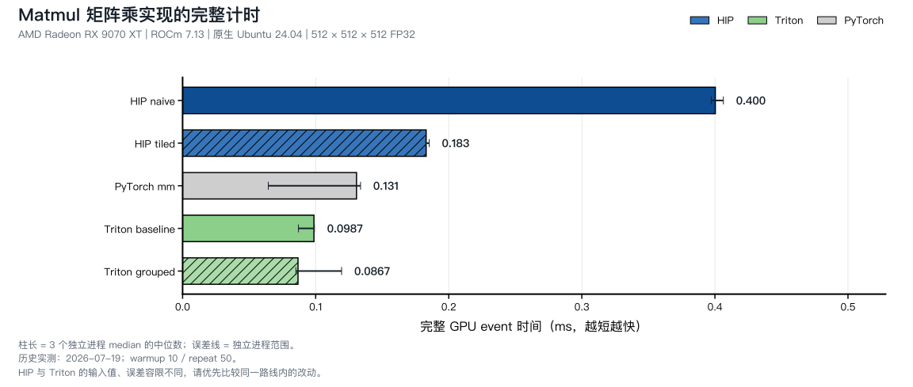

<script setup>
import MatmulJourney from './matmul-journey.vue'
import MatmulExecution from './matmul-execution.vue'
</script>

# 第11章 GEMM-Like：矩阵乘类算子

## 本章导读

在第 8 章的向量加法中，一个输入元素通常只参与一个输出。矩阵乘法却有一件很值得利用的事：**同一个输入会反复出现在不同输出的计算中。** 如果能把这些计算安排在一起，已经读进来的数据就有机会多用几次。

本章用一个可以手算的小矩阵解释这种复用，再把它写成 HIP 和 Triton kernel。学完后，你应当能说明一个输出如何计算、一个输入如何被多个输出复用，以及为什么更大的分块未必更快。这里的 Matmul 是 GEMM 家族中的基本情形，只计算 `C = A @ B`，不含缩放、转置或额外的加法项。

| 阅读路线 | 建议顺序 |
| --- | --- |
| 先理解算法 | [点积](#_11-1-从一个输出看矩阵乘) → [分块动画](#_11-2-把重复使用的数据放在一起) → [结果](#_11-5-实测支持了哪些判断) |
| 动手写 HIP | 先看共同算法，再进入 [实现标签页](#_11-3-用两种方式表达分块) 的 HIP 路线 |
| 动手写 Triton | 先看共同算法，再进入 [实现标签页](#_11-3-用两种方式表达分块) 的 Triton 路线；语法不熟可查 [附录 D](../../appendix/programming-models/index.md#triton-model) |

本章代码对应 `code/part2-kernels/chapter11/`。已有性能记录来自 Radeon RX 9070 XT（gfx1201）、ROCm 7.13、原生 Ubuntu 24.04；先跟着小例子推导，到实验部分再看这些数字。

## 11.1 从一个输出看矩阵乘

我们先算出一个输出，再用同样的规则得到整个矩阵。设输入为：

$$
A=\begin{bmatrix}1&2&3\\4&5&6\end{bmatrix},\qquad
B=\begin{bmatrix}1&0\\2&1\\0&2\end{bmatrix}.
$$

`A` 有 2 行、3 列，`B` 有 3 行、2 列。取 A 的第 0 行和 B 的第 0 列，对应位置相乘后相加，就得到：

$$
C_{0,0}=1\times1+2\times2+3\times0=5.
$$

这就是**点积**。换一列 B，得到同一行的另一个输出；换一行 A，得到下一行的输出。按这个规则计算：

$$
C=AB=\begin{bmatrix}5&8\\14&17\end{bmatrix}.
$$

::: figure fig-matmul-dot
<MatmulJourney mode="dot" />

固定输出 C[0,0]，沿着点积的 K 方向逐项累加。动画使用手算数据，播放速度不代表 GPU 执行时间。
:::

先在 @fig-matmul-dot 中走到 `k=1`，检查部分和是否为 5；再走到 `k=2`。最后一个乘积为 0，所以部分和没有变。这能帮助我们区分“处理了一个输入”和“数值一定发生变化”。

推广到任意大小，用 `M` 表示 A 的行数、`N` 表示 B 的列数、`K` 表示点积长度：

$$
A\in\mathbb{R}^{M\times K},\quad B\in\mathbb{R}^{K\times N},\quad
C_{m,n}=\sum_{k=0}^{K-1}A_{m,k}B_{k,n}.
$$

M、N 决定有多少个输出可以并行计算；K 决定每个输出要累加多少项。常用的算法工作量是 `2MNK` FLOP，把每次乘加记为两次浮点运算。它用于计算吞吐率，不是硬件指令条数。

代码把矩阵连续存放在一维数组中，先存第 0 行，再存第 1 行，这叫行优先（row-major）布局。于是：

| 数学位置 | 一维数组下标 | 一行的长度 |
| --- | --- | --- |
| `A[row, inner]` | `row * K + inner` | K |
| `B[inner, column]` | `inner * N + column` | N |
| `C[row, column]` | `row * N + column` | N |

例如本例 `C[1,1]` 使用 A 的下标 `3,4,5` 和 B 的下标 `1,3,5`。B 的行步长是 N，不能因为循环变量沿 K 移动就误写成 K。后面的代码用小写 `m/n/k` 保存这三个尺寸。

## 11.2 把重复使用的数据放在一起

现在从“一个输出怎么算”转向“几个输出怎样合作”。仍看同一组小矩阵：计算 `C[0,0]` 与 `C[0,1]`，都会使用 A 的第 0 行；计算 `C[0,0]` 与 `C[1,0]`，都会使用 B 的第 0 列。

如果四个输出分别完成点积，源码一共请求 `4 × 3 × 2 = 24` 个输入值。我们也可以每次取 A 的一列和 B 的一行，同时更新四个输出：

$$
\begin{aligned}
C^{(0)}&=\begin{bmatrix}0&0\\0&0\end{bmatrix},\\
C^{(1)}&=C^{(0)}+\begin{bmatrix}1\\4\end{bmatrix}\begin{bmatrix}1&0\end{bmatrix}
       =\begin{bmatrix}1&0\\4&0\end{bmatrix},\\
C^{(2)}&=C^{(1)}+\begin{bmatrix}2\\5\end{bmatrix}\begin{bmatrix}2&1\end{bmatrix}
       =\begin{bmatrix}5&2\\14&5\end{bmatrix},\\
C^{(3)}&=C^{(2)}+\begin{bmatrix}3\\6\end{bmatrix}\begin{bmatrix}0&2\end{bmatrix}
       =\begin{bmatrix}5&8\\14&17\end{bmatrix}.
\end{aligned}
$$

每轮读入 2 个 A 值和 2 个 B 值，共 3 轮，只需请求 12 个输入值。每个 A 值用于两列输出，每个 B 值用于两行输出。保存下来的四个部分和叫作**累加块**。

::: figure fig-matmul-tile
<MatmulJourney mode="tile" />

同一个 2×2 输出块始终保留部分和；每轮换入一列 A 和一行 B，四个输入共同更新四个输出。
:::

@fig-matmul-tile 为了看清乘加，把 K 方向的分块宽度设成 1。实际 kernel 一次处理更大的一片输入，这片小矩阵就叫 **tile**。HIP 实现把 A/B tile 放进 block 内共享的 LDS，Triton 则用张量块表达加载与乘法。两者都需要让累加块跨 K 方向的各轮计算继续存在，直到最后才写回 C。

这里的“24 次变成 12 次”是手算出的源码请求数。它不等于显存流量必定减半：原先的重复读取可能命中缓存，显存也按事务传输数据。分块还会引入同步和资源开销。小例子给出了优化理由，后面的实验负责检验它是否带来收益。

## 11.3 用两种方式表达分块

两条路线计算相同的矩阵乘。你可以先选熟悉的一条，另一条保留作对照；不必在两段长实现之间来回跳。HIP 的 thread/block 与 Triton 的 program/tile 若还不熟悉，可以先读 [附录 D：编程范式](../../appendix/programming-models/index.md)。

<ImplementationTabs id="ch11-implementations">

<template #hip>

### 11.3.1 HIP：先让一个线程负责一个输出

`matmul_hip.hip` 的 `matmul_naive` 直接把点积翻译成循环。二维 block 中，x 方向选择输出列，y 方向选择输出行：

```cpp
__global__ void matmul_naive(const float* __restrict__ a,
                             const float* __restrict__ b,
                             float* __restrict__ c,
                             std::size_t m,
                             std::size_t n,
                             std::size_t k) {
    const std::size_t row =
        static_cast<std::size_t>(blockIdx.y) * blockDim.y + threadIdx.y;
    const std::size_t column =
        static_cast<std::size_t>(blockIdx.x) * blockDim.x + threadIdx.x;
    if (row >= m || column >= n) {
        return;
    }

    float accumulator = 0.0F;
    for (std::size_t inner = 0; inner < k; ++inner) {
        accumulator += a[row * k + inner] * b[inner * n + column];
    }
    c[row * n + column] = accumulator;
}
```

这段 kernel 有两个值得先核对的地方。`accumulator` 是当前线程负责的一个部分和；它必须在 K 循环外初始化。末尾 `c[row * n + column]` 使用 N 作为行步长，与数学中的输出位置对应。

Host 端固定 `kTile=16`，启动一个 `16×16` 的 block。grid 的 x 方向需要 `ceil(N/16)` 个 block，y 方向需要 `ceil(M/16)` 个 block，才能覆盖所有输出。朴素版本没有 block 内同步，因此越界线程可以直接返回。

### 11.3.2 HIP：把 A/B tile 放进 LDS

第二个版本保持“一线程一输出”，只改变输入的组织方式。每个 block 协作加载两片 `16×16` 输入，随后每个线程从 LDS 取数，更新自己的 `accumulator`。

先看 `matmul_tiled` 每轮的加载部分：

```cpp
const std::size_t a_column = tile * kTile + threadIdx.x;
const std::size_t b_row = tile * kTile + threadIdx.y;
tile_a[threadIdx.y][threadIdx.x] =
    row < m && a_column < k ? a[row * k + a_column] : 0.0F;
tile_b[threadIdx.y][threadIdx.x] =
    b_row < k && column < n ? b[b_row * n + column] : 0.0F;
__syncthreads();
```

线程 `(threadIdx.y, threadIdx.x)` 各负责搬入一个 A 值和一个 B 值。越界位置写 0，保证后续读取 LDS 时每个位置都有定义。第一次 `__syncthreads()` 等待整个 block 完成装载，避免某个线程先读到尚未写好的值。

同一对 tile 装好后，每个线程沿它的内部 K 方向累加：

```cpp
#pragma unroll
        for (unsigned int inner = 0; inner < kTile; ++inner) {
            accumulator +=
                tile_a[threadIdx.y][inner] * tile_b[inner][threadIdx.x];
        }
        __syncthreads();
```

注意这里的两个下标：`tile_a[threadIdx.y][inner]` 在输出行上取值，`tile_b[inner][threadIdx.x]` 在输出列上取值。它仍然是 11.1 节的点积，只是输入来自 LDS。

第二次同步同样不能省略。一个线程完成乘加后，不代表别的线程也读完了；只有大家都结束这一轮，才能用下一对 tile 覆盖这两块 LDS。

<details>
<summary>完整 kernel：matmul_tiled，对照两次同步与最后的写回</summary>

```cpp
__global__ void matmul_tiled(const float* __restrict__ a,
                            const float* __restrict__ b,
                            float* __restrict__ c,
                            std::size_t m,
                            std::size_t n,
                            std::size_t k) {
    __shared__ float tile_a[kTile][kTile];
    __shared__ float tile_b[kTile][kTile];

    const std::size_t row =
        static_cast<std::size_t>(blockIdx.y) * kTile + threadIdx.y;
    const std::size_t column =
        static_cast<std::size_t>(blockIdx.x) * kTile + threadIdx.x;
    const std::size_t tile_count = (k + kTile - 1) / kTile;
    float accumulator = 0.0F;

    for (std::size_t tile = 0; tile < tile_count; ++tile) {
        const std::size_t a_column = tile * kTile + threadIdx.x;
        const std::size_t b_row = tile * kTile + threadIdx.y;
        tile_a[threadIdx.y][threadIdx.x] =
            row < m && a_column < k ? a[row * k + a_column] : 0.0F;
        tile_b[threadIdx.y][threadIdx.x] =
            b_row < k && column < n ? b[b_row * n + column] : 0.0F;
        __syncthreads();

#pragma unroll
        for (unsigned int inner = 0; inner < kTile; ++inner) {
            accumulator +=
                tile_a[threadIdx.y][inner] * tile_b[inner][threadIdx.x];
        }
        __syncthreads();
    }

    if (row < m && column < n) {
        c[row * n + column] = accumulator;
    }
}
```

</details>

两个 `16×16` FP32 数组在源码中需要 `2 × 16 × 16 × 4 = 2048` Byte 的 LDS。这个数来自数组大小的计算；实际编译资源仍应读编译产物或 profiler。当前版本没有寄存器多输出分块、双缓冲或矩阵指令的手写实现，不把这些后续方向混进本轮收益。

::: figure fig-matmul-tiled-lds
<MatmulExecution scenario="tiled-lds" />

matmul_tiled 一个 block 沿 K 循环推进的时间线：协作装载 tile_a/tile_b（越界填 0）→ 第一道 `__syncthreads()` → 各线程从 LDS 取数累加自己的 accumulator → 第二道 `__syncthreads()` → 下一对 tile 覆盖 LDS。图为 block=2×2 线程、kTile=2、K=5 的教学缩略（第三轮即尾块），可手算：C 块 = [[8,10],[11,12]]。
:::

如 @fig-matmul-tiled-lds 所示，两道同步像两根栅栏把每轮分成「装载」与「累加」两段：第一道保证没有人读到半成品 tile，第二道保证没有人被提前覆盖的 tile 污染。尾块那一轮同时展示了越界格填 `0`（单位元）——这正是 11.4 节「不能提前退出」的图形版。

</template>

<template #triton>

### 11.3.3 Triton：一个 program 保留一块输出

`matmul_triton.py` 固定 `BLOCK_M=BLOCK_N=BLOCK_K=32`、`NUM_WARPS=4`。每个 program 负责 C 的一块 `32×32` 输出，沿 K 循环处理输入。这里的 32 是数据块尺寸，不能把它当成 thread 数。

先假设已经知道当前输出块的编号 `program_m/program_n`。下面的源码构造 A/B 地址，并给每个输出位置准备一个 FP32 部分和：

```python
offsets_m = program_m * BLOCK_SIZE_M + tl.arange(0, BLOCK_SIZE_M)
offsets_n = program_n * BLOCK_SIZE_N + tl.arange(0, BLOCK_SIZE_N)
offsets_k = tl.arange(0, BLOCK_SIZE_K)
a_pointers = a_ptr + offsets_m[:, None] * k + offsets_k[None, :]
b_pointers = b_ptr + offsets_k[:, None] * n + offsets_n[None, :]
accumulator = tl.zeros((BLOCK_SIZE_M, BLOCK_SIZE_N), dtype=tl.float32)
```

`offsets_m[:, None]` 变成一列行号，`offsets_k[None, :]` 变成一行 K 下标；广播后得到 A tile 的二维地址。B 的地址同理，但一行有 n 个元素，所以 K 方向步长是 n。

沿 K 推进时，`tl.dot(a, b)` 完成两片输入的矩阵乘，结果继续加到同一个 `accumulator`：

```python
for k_block in range(0, tl.cdiv(k, BLOCK_SIZE_K)):
    current_k = k_block * BLOCK_SIZE_K + offsets_k
    a = tl.load(
        a_pointers,
        mask=(offsets_m[:, None] < m) & (current_k[None, :] < k),
        other=0.0,
    )
    b = tl.load(
        b_pointers,
        mask=(current_k[:, None] < k) & (offsets_n[None, :] < n),
        other=0.0,
    )
    accumulator += tl.dot(a, b)
    a_pointers += BLOCK_SIZE_K
    b_pointers += BLOCK_SIZE_K * n

output_offsets = offsets_m[:, None] * n + offsets_n[None, :]
output_mask = (offsets_m[:, None] < m) & (offsets_n[None, :] < n)
tl.store(c_ptr + output_offsets, accumulator, mask=output_mask)
```

`a_pointers` 每轮向右移动 32 个元素；`b_pointers` 每轮向下移动 32 行，即 `32*n` 个元素。加载时同时检查行、列和 K 的边界，最后只写有效输出。

这里的输入、输出与累加器是 FP32。源码调用的是 `tl.dot(a, b)`，没有显式指定 `input_precision`；仅凭张量 dtype 不能认定各后端采用完全相同的乘法精度。迁移设备或比较精度时，应检查 [`tl.dot` 的精度选项](https://triton-lang.org/main/python-api/generated/triton.language.dot.html)，并重新校验误差。

### 11.3.4 Triton：改变 program 编号与输出块的对应

一个 program 内的复用已经由 `tl.dot` 表达。相邻 program 之间还有另一种机会：它们如果在接近的时间访问同一片输入，这些数据可能仍在缓存中。

本章两版 Triton kernel 的数学和 tile 完全相同。`triton-baseline` 使用 `GROUP_M=1`，`triton-grouped` 使用 `GROUP_M=8`，只改变 program ID 到输出块的映射。下面是两版共同使用的编号代码：

```python
program_id = tl.program_id(axis=0)
programs_m = tl.cdiv(m, BLOCK_SIZE_M)
programs_n = tl.cdiv(n, BLOCK_SIZE_N)

programs_per_group = GROUP_SIZE_M * programs_n
group_id = program_id // programs_per_group
first_program_m = group_id * GROUP_SIZE_M
group_m = tl.minimum(programs_m - first_program_m, GROUP_SIZE_M)
program_in_group = program_id % programs_per_group
program_m = first_program_m + program_in_group % group_m
program_n = program_in_group // group_m
```

以 4 行、3 列输出块为例，`GROUP_M=1` 的前几个编号对应 `(0,0)、(0,1)、(0,2)、(1,0)`；若用 `GROUP_M=2` 手算，则对应 `(0,0)、(1,0)、(0,1)、(1,1)`。后一种安排让两行输出块先围绕同一列 B 工作。

这只是编号与数据位置的安排，并没有要求 GPU 严格按编号串行执行。缓存命中率是否改善、改善能否抵消其他开销，仍需观察实验；[Triton 官方矩阵乘教程](https://triton-lang.org/main/getting-started/tutorials/03-matrix-multiplication.html) 解释了这种安排的动机。

::: figure fig-matmul-group-order
<MatmulExecution scenario="group-order" />

`GROUP_M=1` 与 `GROUP_M=8` 的 program 编号顺序对照（3 行 × 4 列输出块）：左图按行走、右图同组行围绕同一列 B。编号点亮顺序即 program_id 顺序；结尾给出 9070 XT 两版实测。
:::

如 @fig-matmul-group-order 所示，`GROUP_M=8` 让相邻编号的 program 连续访问同一列 B——这是把「缓存里可能还有」变成现实的编号安排。

### 11.3.5 Triton：从 host 启动，并检查完整输出

Host 的 `launch` 已经收到 GPU 上的 a、b 和预先分配的 output。两版 Triton 共用下面这段启动代码：

```python
m, k = a.shape
_, n = b.shape
grid = (triton.cdiv(m, BLOCK_M) * triton.cdiv(n, BLOCK_N),)
matmul_kernel[grid](
    a,
    b,
    output,
    m,
    n,
    k,
    BLOCK_SIZE_M=BLOCK_M,
    BLOCK_SIZE_N=BLOCK_N,
    BLOCK_SIZE_K=BLOCK_K,
    GROUP_SIZE_M=implementation.group_m,
    num_warps=NUM_WARPS,
)
```

`run_implementation` 在计时前后分别调用 `validate`，与 `torch.mm(a,b)` 的完整输出比较。benchmark 先预热，再用 GPU event 记录每次 launch；分配、CPU 到 GPU 复制、参考计算与正确性校验都放在计时区间外。第一次运行可能触发 JIT 编译，因此先预热再读延迟。

</template>

</ImplementationTabs>

## 11.4 尾块和精度都属于正确性

矩阵尺寸不一定是 tile 大小的整数倍。我们分别看 M、N、K，避免用一个输出 mask 掩盖三种不同边界。

| 不整除的方向 | 需要保护什么 | HIP tiled | Triton |
| --- | --- | --- | --- |
| M | A 的尾行与 C 的尾行 | A 越界填 0，最终不写无效 C | A load 与 C store 检查行号 |
| N | B 的尾列与 C 的尾列 | B 越界填 0，最终不写无效 C | B load 与 C store 检查列号 |
| K | 最后一次点积的输入 | A/B 越界部分都填 0 | 两个 load 都检查 `current_k < k` |

以 `M=N=16、K=17` 为例，HIP 需要两轮 K tile。第二轮只有 `inner=0` 有效，其余位置填 0。这个 0 不改变点积结果，却让所有线程可以走完同样的加载、同步和计算流程。**tiled kernel 中不能让 M/N 越界线程提前退出**，因为其余线程还要与它们协作加载并到达同步点。

运行脚本已包含 `1×1×1`、`3×5×7`、`15×17×19`、`17×19×23`、`31×33×29`。它们比只跑一个整齐的方阵更容易暴露地址、尾块和未初始化输出问题。

浮点加法还有另一个边界：改变求和顺序可能改变舍入结果。本章 HIP 使用 CPU double 累加再转 FP32 的参考值，绝对和相对阈值均为 `1e-3`；Triton 与 PyTorch `torch.mm` 比较，两个阈值均为 `1e-2`。因此 `correct=OK` 表示通过各自明确的误差标准，不表示逐位相等，也不证明任意输入都满足同样误差。

两条语言路线也使用各自的确定性输入生成方法：HIP 是整数公式生成，Triton 是固定随机种子的 `torch.rand`。相同 seed 不代表它们生成同一组元素。下面的结果适合判断**同一路线内的改动**，跨路线数值只作这组实现的观察，不能写成严格同输入、同精度要求的语言排名。

## 11.5 实测支持了哪些判断

把算法解释和已有记录放在一起，我们可以检查两个具体假设：HIP 显式复用 LDS 是否有收益，Triton 改变 program 排序是否稳定有收益。

实验在 Radeon RX 9070 XT（gfx1201）、ROCm 7.13、原生 Ubuntu 24.04 上完成，PyTorch 为 `2.11.0+rocm7.13.0`，Triton 为 `3.6.0`。以下记录来自 2026-07-19，形状是 `M=N=K=512`、FP32；每个实现跑 3 个独立进程，每进程预热 10 次、计时 50 次。

| 实现 | 进程中位数的中心值（ms） | 3 个进程的中位数范围（ms） | 算法吞吐（TFLOP/s） |
| --- | ---: | ---: | ---: |
| `hip-naive` | 0.400 | 0.397–0.406 | 0.671 |
| `hip-tiled` | 0.183 | 0.183–0.185 | 1.47 |
| `torch-mm` | 0.131 | 0.0644–0.134 | 2.05 |
| `triton-baseline` | 0.0987 | 0.0870–0.0990 | 2.72 |
| `triton-grouped` | 0.0867 | 0.0851–0.119 | 3.10 |

中心值取 3 个进程中位数的中位数，范围也来自这 3 个中位数，不是统计置信区间。`TFLOP/s` 用 `2MNK / 时间` 换算，所有边界与主 shape 记录均通过各自正确性检查。

::: figure fig-matmul-performance


已有 Matmul 实测。比较实现时同时观察中心值和进程范围；跨语言输入生成与误差阈值的差异见 11.4 节。
:::

@fig-matmul-performance 支持 HIP tiled 在这组测试中稳定优于 naive：两者的进程范围分离。这与“让输入在 block 内复用”的动机一致，但不能仅凭延迟就认定物理显存流量降低了多少。

Triton grouped 的中心值更低，可它的范围与 baseline 重叠，最慢进程还超过 baseline 的范围。我们应保留这个负结果：**当前记录不足以说明 grouped ordering 稳定获胜**。`torch-mm` 的范围也较宽，不能取其中某个最低值作通用结论。

正式记录位于 `code/part2-kernels/chapter11/EXPERIMENT.md`，汇总在同目录 `evidence/summary.csv`，环境和源码版本在 `evidence/manifest.json`。早期日志使用旧章节号 `chapter10`，对应的仍是这组 Matmul 实验。

逐实现 trace 可以帮助核对 dispatch，但当前 `profile_summary.csv` 中多个 grid、LDS 和 VGPR 字段是 `unavailable`。它们表示未得到可用字段，不能当成 0，也不足以据此宣称更高占用率或更少 cache miss。Triton trace 中还有参考计算与校验 kernel，读取时间前要先筛选 `matmul_kernel`。

## 11.6 选择 tile 时，先提出可验证的问题

当前数据只比较 HIP 的两个固定实现，以及 Triton 的两种排序。它没有测出一套适用于所有 shape 或 GPU 的最佳 tile。扩大 tile 的理由与代价可以先从源码推导：

| 改动 | 希望得到什么 | 需要同时检查什么 |
| --- | --- | --- |
| 增大输出块的 M/N 方向 | 同一输入服务更多输出 | 累加器变多、尾块浪费、可同时运行的块数 |
| 增大 K 方向 tile | 减少 K 循环轮数 | 输入暂存空间、每轮工作量、K 尾部浪费 |
| 一个 HIP 线程算多个输出 | 读入一个值后更新多个累加器 | VGPR 使用量、依赖链与执行时间 |
| 改变 program 分组 | 让可能共享输入的 program 靠近 | 多进程时间范围，以及可用的缓存证据 |

例如一个线程若同时计算相邻两列，就可以用同一个 A 值更新两个累加器。这是**寄存器分块**的起点。它增加了复用，也增加了每个线程要保留的状态；本章还没有相应实测版本，可以把它作为练习，不能预先填写加速比。

还可以先算一个理想化的算术强度。假设 A、B 各从显存读一次，C 写一次，FP32 的算法字节数为 `4(MK+KN+MN)`：

$$
I_{\mathrm{ideal}}=\frac{2MNK}{4(MK+KN+MN)}\quad\text{FLOP/Byte}.
$$

这个理想模型忽略重复读入、缓存与其他流量，用来理解 shape 改变时复用潜力的变化。判断带宽还是计算吞吐更可能构成限制，需要把它与同设备、同精度口径下的 Roofline 转折点 `计算吞吐上限 / 带宽上限` 对照；不存在统一的 `I=10` 分界。即便落在理论计算侧，实际 kernel 仍可能受同步、指令依赖或资源限制。

第一次改参数时，只保留少量能解释的候选。先检查输出，再记录选择了什么 tile、误差和进程时间范围。自动搜索只是在候选中找较好的配置，不会替我们决定误差要求，也不会证明一个配置适合其他 GPU。

## 11.7 复跑与练习

先按已有脚本重现基线，确认输入、校验和计时路径一致，再动参数。以下命令在配置好 Part 2 环境的 Radeon RX 9070 XT 实验机执行：

```bash
cd code/part2-kernels
uv sync
source ./activate-rocm.sh
bash chapter11/run_all.sh
```

脚本会编译 HIP、运行边界 shape，然后计时主 shape 的 HIP、PyTorch 和 Triton 实现。默认 `warmup=5、repeat=20`，用于先跑通流程。复现表格所用的单个正式进程配置时，使用：

```bash
RUN_EDGE_CASES=0 M=512 N=512 K=512 \
WARMUP=10 REPEAT=50 SEED=20260719 bash chapter11/run_all.sh
```

正式比较应分别运行 3 个独立进程并保留日志。输出里的 `precheck/postcheck` 先确认正确性；再看 `median_ms` 与各进程范围。`min_ms` 可以作为补充观察，不能替代稳定性判断。

需要 profiler 时，单独运行 `chapter11/profile_all.sh`。该脚本要求 `SOURCE_COMMIT` 标识源码；将下面的占位内容替换为本地 Git 维护机提供、与传到实验机的源码对应的 SHA，实验机不执行 Git 操作：

```bash
SOURCE_COMMIT="<与实验源码对应的提交 SHA>" \
PROFILE_WARMUP=0 PROFILE_REPEAT=5 bash chapter11/profile_all.sh
```

profiler 的时间用于观察 dispatch 与资源，benchmark 的 GPU event 时间用于性能对照，两者分开记录。

尝试下面几道练习；先写预测，再修改和验证：

1. 用 11.1 节的小矩阵手算 `C[1,1]` 的三个部分和。提示：依次应得到 `0、5、17`，同时核对 A/B 的一维下标。
2. 对 `M=16、N=16、K=17`，画出 HIP 第二轮 A/B tile 哪些位置有效。提示：A 只有第 0 列有效，B 只有第 0 行有效；所有线程仍要到达两次同步。
3. 保持问题不变，把 HIP `kTile` 从 16 改成 8。先预测 block 线程数、两块 LDS 的源码字节数和 K 循环轮数如何变化，再比较正确性与时间。不要把这些源码计算写成 profiler 测量值。
4. 为一个 HIP 线程负责相邻两列画出累加关系。提示：需要两个累加器，每轮共享一个 A 值，读取两个 B 值；思考最后一列越界时怎么办。
5. 将 Triton 分组参数改成 4，保持 tile 和 `num_warps` 不变。至少运行 3 个独立进程；如果范围重叠，说明这组结果还不足以支持什么结论。

## 本章小结

- 矩阵乘的每个输出是一个点积，M/N 决定输出位置，K 决定累加范围。
- 分块把多个输出共同需要的数据组织起来，累加块跨 K 轮次保留。HIP 显式管理 LDS 与同步，Triton 用张量块和 `tl.dot` 表达计算。
- M/N 尾块保护输出覆盖，K 尾块保护点积输入；填零、mask 和同步必须共同保持正确性。
- 当前 9070 XT 记录支持 HIP tiled 的稳定收益，没有证明 Triton grouped 稳定优于 baseline。输入、误差阈值和进程波动都要随结果一起读。
- 更大的 tile、更多的线程内累加器都有代价，下一次优化应从一个具体、可检验的复用假设开始。

到这里，我们已经学会让数据在一次矩阵乘内部多用几次。[下一章](../chapter12/index.md) 把矩阵乘与 Softmax 连起来，研究能否让它们之间的中间结果也少写回显存。

## 延伸阅读

- [Triton Matrix Multiplication 教程](https://triton-lang.org/main/getting-started/tutorials/03-matrix-multiplication.html)：分块地址与 program 排序的进一步解释，示例 dtype 和配置与本章不同。
- [`tl.dot` API](https://triton-lang.org/main/python-api/generated/triton.language.dot.html)：输入形状、累加器与乘法精度选项。
- [AMD HIP Programming Model](https://rocm.docs.amd.com/projects/HIP/en/latest/understand/programming_model.html)：线程组织与协作模型。
- [`rocprofv3` 使用文档](https://rocm.docs.amd.com/projects/rocprofiler-sdk/en/latest/how-to/using-rocprofv3.html)：trace 与性能计数器的采集方法。
