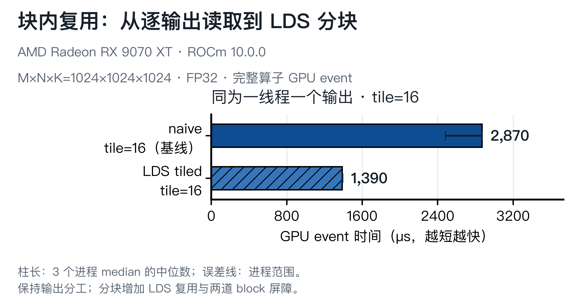
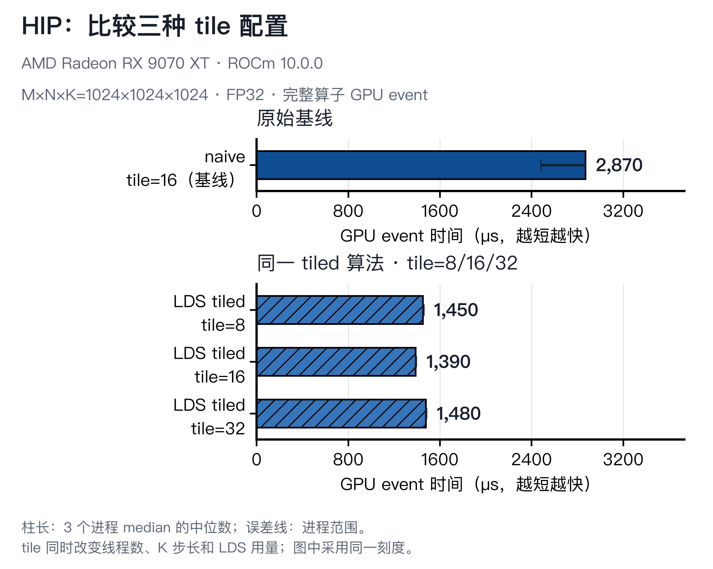
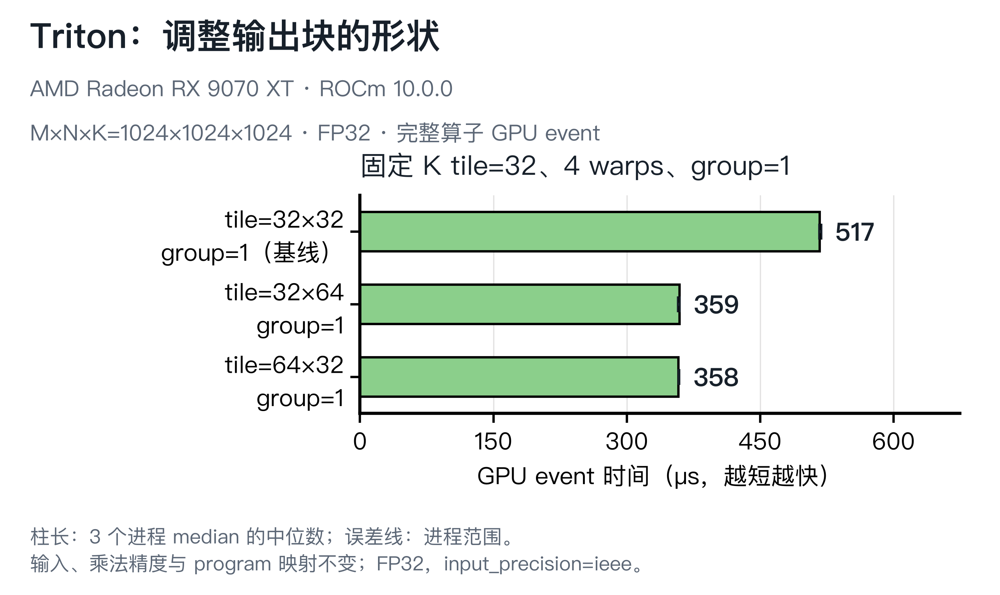
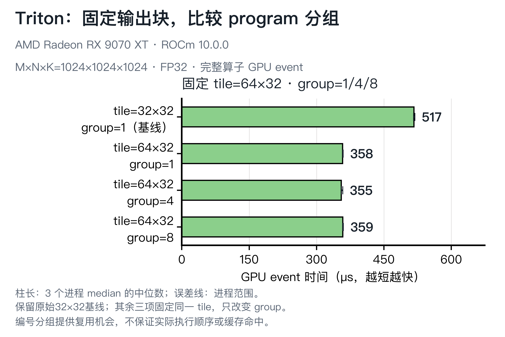
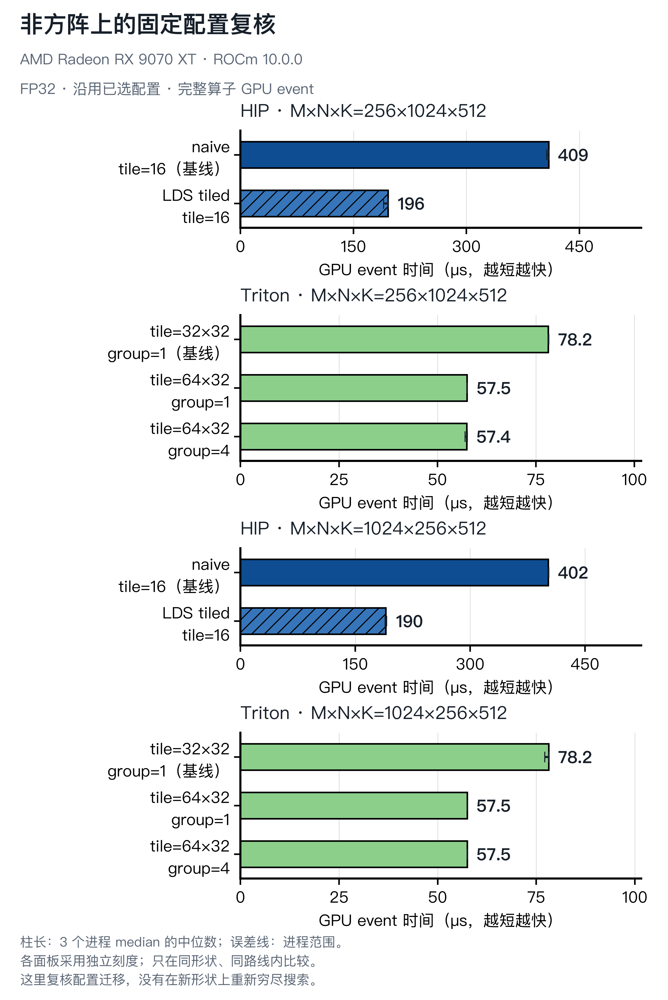
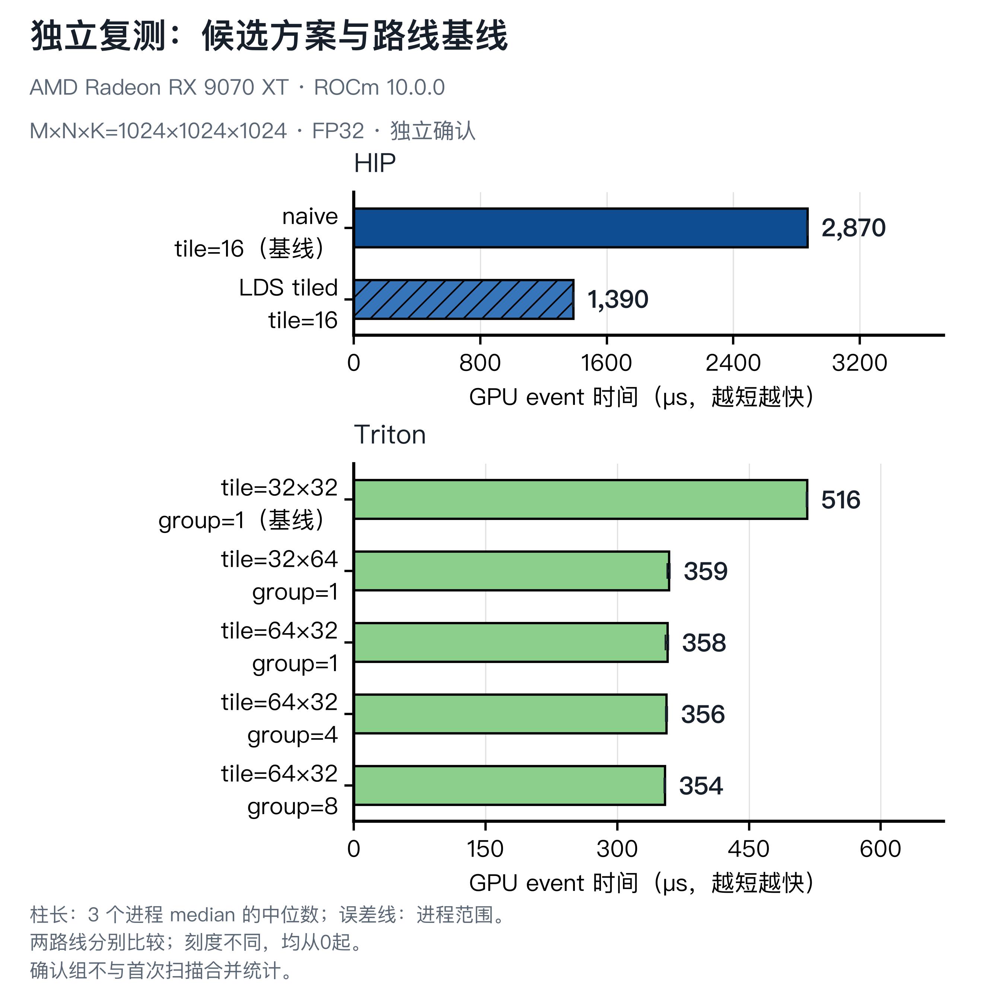

<script setup>
import MatmulJourney from './matmul-journey.vue'
import MatmulExecution from './matmul-execution.vue'
</script>

# 第11章 GEMM-Like：矩阵乘类算子

## 本章导读

在第 8 章的向量加法中，一个输入元素通常只参与一个输出。矩阵乘法不同：同一行 A 会用于多列输出，同一列 B 会用于多行输出。**怎样让读进来的数据多用几次，是本章的优化起点。**

我们先用小矩阵看清这种复用，再分别建立 HIP 和 Triton 的性能基线。HIP 先加入 block 内共享的输入分块，再比较分块大小；Triton 先比较输出 tile 的形状，再检查 program 分组是否有帮助。每轮都根据正确性和实测结果决定下一步。

这里实现 GEMM 家族中的基本情形 `C = A @ B`，输入和输出都是行优先 FP32 矩阵，不含转置、缩放或额外加法项。

| 阅读路线 | 建议顺序 |
| --- | --- |
| 理解算法 | [点积与矩阵布局](#matmul-semantics) → [分块与输入复用](#matmul-reuse) → [结果与参数选择](#matmul-results) |
| 编写 HIP | 共同算法与实验约定 → [HIP 优化路线](#ch11-hip) |
| 编写 Triton | 共同算法与实验约定 → [Triton 优化路线](#ch11-triton)；语法可查 [附录 D](../../appendix/programming-models/index.md#triton-model) |

代码位于 `code/part2-kernels/chapter11/`。本章主实验使用 **Radeon RX 9070 XT（gfx1201）+ ROCm SDK 10.0 + 原生 Ubuntu 24.04**，主形状是 `M=N=K=1024`。完整采集信息与复跑入口放在 [11.7 节](#matmul-rerun)。

<span id="_11-1-从一个输出看矩阵乘"></span>

## 11.1 点积与矩阵布局 {#matmul-semantics}

先算出一个输出，再把同样的规则用于整个矩阵：

$$
A=\begin{bmatrix}1&2&3\\4&5&6\end{bmatrix},\qquad
B=\begin{bmatrix}1&0\\2&1\\0&2\end{bmatrix}.
$$

取 A 的第 0 行和 B 的第 0 列，对应元素相乘后相加：

$$
C_{0,0}=1\times1+2\times2+3\times0=5.
$$

这叫**点积**。换一列 B，就得到同一行的另一个输出；换一行 A，就得到下一行的输出。最终：

$$
C=AB=\begin{bmatrix}5&8\\14&17\end{bmatrix}.
$$

::: figure fig-matmul-dot
<MatmulJourney mode="dot" />

固定 C[0,0]，临时部分和依次为 0、1、5、5，最后才单独写回输出。原输入始终保留；动画速度不代表 GPU 执行时间。
:::

在 @fig-matmul-dot 中，走到 `k=1` 时部分和已经是 5；`k=2` 的乘积为 0，所以处理了最后一项，部分和仍为 5。

一般地，A 的形状为 `M×K`，B 为 `K×N`，C 为 `M×N`：

$$
C_{m,n}=\sum_{k=0}^{K-1}A_{m,k}B_{k,n}.
$$

M、N 决定有多少个输出可以并行计算，K 决定每个输出要累加多少项。吞吐率采用常见的 `2MNK` FLOP 计数：每次乘加记两次浮点运算。这是算法工作量，不是硬件指令条数。

源码将矩阵按行连续存放在一维数组中，行步长分别为 K、N、N：

| 数学位置 | 一维数组下标 |
| --- | --- |
| `A[row, inner]` | `row * K + inner` |
| `B[inner, column]` | `inner * N + column` |
| `C[row, column]` | `row * N + column` |

例如 `C[1,1]` 使用 A 的下标 `3,4,5` 和 B 的下标 `1,3,5`。沿 B 的一列移动，跨过的是一整行 B，因此步长是 N。

<span id="_11-2-把重复使用的数据放在一起"></span>

## 11.2 分块与输入复用 {#matmul-reuse}

仍看这组小矩阵。`C[0,0]` 与 `C[0,1]` 都使用 A 的第 0 行；`C[0,0]` 与 `C[1,0]` 都使用 B 的第 0 列。四个输出分别完成点积，源码会请求 `4×3×2=24` 个输入值。

也可以每轮取 A 的一列和 B 的一行，更新全部四个输出。在 @fig-matmul-tile 中点选 `A[0,1]=2`：它与 `B[1,0]=2` 相乘，给 `C[0,0]` 加上 4；又与 `B[1,1]=1` 相乘，给 `C[0,1]` 加上 2。

::: figure fig-matmul-tile
<MatmulJourney mode="tile" />

点选一个 A 或 B 输入值，查看这一项会贡献给哪些输出位置。显示的是单项贡献，完整结果还需累加其他 K 位置。
:::

| 已处理的 K 位置 | 两行输出的部分和 |
| --- | --- |
| 尚未开始 | `[0, 0]`、`[0, 0]` |
| `k=0` | `[1, 0]`、`[4, 0]` |
| `k=1` | `[5, 2]`、`[14, 5]` |
| `k=2` | `[5, 8]`、`[14, 17]` |

现在每轮请求 2 个 A 值和 2 个 B 值，三轮共 12 个。每个 A 值用于两列输出，每个 B 值用于两行输出，四个部分和则一直保留到 K 方向处理完毕。

这样共同处理的一片小矩阵称为 **tile（分块）**。本例的输出 tile 是 `2×2`，表中沿 K 每次推进 1；实际 kernel 可以一次推进更宽的一段 K。HIP 用 LDS 显式保存共享的 A/B tile，Triton 用张量块描述加载和乘法。

24 与 12 是本例的逻辑输入请求数，不能直接换算成实际显存流量。重复请求可能命中缓存，分块也会增加同步和资源占用。这个推导给出了值得实验的假设：**增加输入复用，是否能抵消新增成本？**

## 11.3 正确性与计时约定 {#matmul-contract}

开始比较前，先让两条路线回答同一道题。输入、参考结果和验收标准保持一致，性能基线则各自建立。

| 项目 | 本章约定 |
| --- | --- |
| 输入 | 相同 seed 的确定性 FP32 输入，包含正负数；主实验 seed 为 `20260920` |
| 正确性参考 | CPU 上以 FP64 计算矩阵乘，再转为 FP32 |
| 验收条件 | 每个输出都有限，且 `abs(actual-ref) <= 1e-4 + 1e-4 * abs(ref)` |
| HIP 性能基线 | `naive`，block 为 `16×16`，一线程计算一个输出 |
| Triton 性能基线 | 输出 tile `32×32`、K tile 32、4 warps、group 1 |
| 计时范围 | 已在 GPU 上的 A/B 到 C 写回 GPU，全算子 event 时间；不含分配、CPU 参考和主机拷贝 |

检查程序在计时前把输出填为 NaN，运行预检，结束计时后再检查全部输出。这样漏写的位置不会因旧值碰巧正确而通过。NaN、无穷值先被拒绝，再计算误差；判断依据是逐元素容差，不是比较两项最大误差。

Triton 显式使用 `tl.dot(..., input_precision="ieee")`，FP32 累加。HIP 的点积也使用 FP32 累加。共同的参考和容差用于验证本章实现；它们不要求不同编译器生成相同指令或逐位相同的结果。

图中横轴是完整算子时间，越短越好。主实验每配置运行 3 个独立进程，每进程预热 10 次、采样 50 次。先取各进程的中位数，再取这三个数的中位数；范围线展示三个进程中位数的最小值和最大值，**不是置信区间**。本章预先创建 event，排入全部采样区间后统一同步；短区间仍可能包含 CPU 提交间隙。Profiler 另行运行，不把采集时的耗时混入主结果。

<span id="_11-3-用两种方式表达分块"></span>

## 11.4 HIP 与 Triton 优化路线 {#matmul-implementation}

两条路线都围绕输入复用，但直接控制的对象不同。HIP 编写线程的加载、LDS 和同步；Triton 描述一个 program 处理的张量块，再选择执行配置。可以先完整阅读一条路线。

**环境与结果目录。** 以下命令在 GPU 机器的仓库根目录开始执行，后续保持在 `code/part2-kernels/`。沿用本篇 `uv.lock`，不要删除锁文件：

```bash
cd code/part2-kernels &&
uv sync --locked &&
source ./activate-rocm.sh
```

为本章新建一个独立结果目录，保存打印出来的路径：

```bash
mkdir -p chapter11/results &&
RUN=$(mktemp -d chapter11/results/walkthrough-XXXXXX) &&
mkdir "$RUN/build" &&
printf '本轮结果目录：%s\n' "$RUN"
```

换终端后，重新执行环境准备，再恢复之前打印的目录；提示处只粘贴路径，不含 `RUN=`：

```bash
read -r -p '粘贴上次输出的结果目录：' RUN &&
test -n "$RUN" && test -d "$RUN/build" &&
printf '继续使用结果目录：%s\n' "$RUN"
```

需要重测或改动源码时，新建 `RUN`，重新编译 HIP；恢复旧目录只用于继续未修改的实验。后续命令会拒绝写入已有样本。

每条命令先校验，再完成一个进程的 10 次预热与 50 次计时；折叠输出对应第 1 个进程。**图使用三个独立进程的统计，不是一次终端输出。** 手工复测时同时把样本名 `p1` 与 `--process 1` 改为 `p2`/`2`、`p3`/`3`，每遍覆盖同组候选并轮换起始项。[章末批量入口](#matmul-rerun)会自动完成这一步、汇总并画本轮图，不要求先运行 profiler。

本章先从源码推导复用机会，再用测量选择 tile。只有追问 tile 改动怎样改变启动与资源分配时，才读取代表配置的 trace。

<ImplementationTabs id="ch11-implementations">

<template #hip>

### 11.4.1 HIP 基线：一线程一输出 {#ch11-hip}

<a id="ch11-hip-source"></a>

<details>
<summary>完整源码：code/part2-kernels/chapter11/matmul_hip.hip</summary>

<<< @/../code/part2-kernels/chapter11/matmul_hip.hip{cpp}

</details>

这份文件包含本路线的输入准备、kernel、启动、校验与计时；后续配置共用它，按函数和运行参数定位改动。

先编译一次。未修改源码时可复用本轮可执行文件；修改源码后请新建结果目录再编译：

```bash
test -d "${RUN:?请先准备本章环境与结果目录}/build" && \
if [[ ! -x "$RUN/build/matmul_hip" ]]; then
  hipcc --offload-arch=gfx1201 -O3 -std=c++17 \
    chapter11/matmul_hip.hip -o "$RUN/build/matmul_hip"
fi
```

`matmul_naive` 把点积直接写成循环。二维 block 的 x 方向对应输出列，y 方向对应输出行，核心代码是：

```cpp
const std::size_t row =
    static_cast<std::size_t>(blockIdx.y) * blockDim.y + threadIdx.y;
const std::size_t column =
    static_cast<std::size_t>(blockIdx.x) * blockDim.x + threadIdx.x;
if (row >= m || column >= n) {
    return;
}

float accumulator = 0.0F;
for (std::size_t inner = 0; inner < k; ++inner) {
    accumulator += a[row * k + inner] * b[inner * n + column];
}
c[row * n + column] = accumulator;
```

本轮固定 `--tile 16`，即一个 block 有 `16×16=256` 个线程，覆盖一个 `16×16` 输出块。主形状需要 `64×64` 个 block。每个线程独立完成长度为 1024 的点积，累加器必须在 K 循环外初始化。

先明确 M/N/K，避免沿用命令行默认的小形状；主输入统一为 1024³：

<!-- benchmark:hip-naive-t16:1024x1024x1024 -->

```bash
test -d "${RUN:?请先准备本章环境与结果目录}/build" && \
test ! -e "$RUN/n1024x1024x1024-hip-naive-t16-p1.csv" && \
"$RUN/build/matmul_hip" \
  --tile 16 --version naive --m 1024 \
  --n 1024 --k 1024 --warmup 10 \
  --repeat 50 --seed 20260920 --config-id hip-naive-t16 \
  --samples "$RUN/n1024x1024x1024-hip-naive-t16-p1.csv" --process 1
```

<details>
<summary>真实输出：hip-naive-t16，shape=1024x1024x1024，第 1 个独立进程</summary>

<<< @/../code/part2-kernels/chapter11/evidence/walkthrough/logs/n1024x1024x1024-hip-naive-t16-p1.log{text}

</details>

先看预检、计时后检查与逐元素容差，再核对形状和 `tile=16`，最后读本进程中位数。

主形状的基线时间为 **2.870803 ms**，三个进程中位数的范围是 `2.482325–2.872944 ms`，预检和计时后检查均通过。启动函数提交一个 `matmul_naive`；下一轮保持一个 kernel，比较输入组织方式。

接着检查两个相邻输出 `C[row,column]` 和 `C[row,column+1]`：它们重复使用同一行 A，却各自在 K 循环中发出加载。相邻输出行又会重复使用 B。这是代码中可直接验证的复用机会，还不能仅凭耗时判定全部时间都花在显存读取上。

### 11.4.2 HIP 第一轮：协作加载与 LDS 复用

这一轮保持 `16×16` block 和“一线程一输出”，加入共享的 A/B tile。每个线程各搬入一个 A 值和一个 B 值，让整个 block 一起使用。源码用模板参数 `Tile` 表示边长，本轮取 16：

```cpp
const std::size_t a_column = tile * Tile + threadIdx.x;
const std::size_t b_row = tile * Tile + threadIdx.y;
tile_a[threadIdx.y][threadIdx.x] =
    row < m && a_column < k ? a[row * k + a_column] : 0.0F;
tile_b[threadIdx.y][threadIdx.x] =
    b_row < k && column < n ? b[b_row * n + column] : 0.0F;
__syncthreads();
```

第一次屏障等全 block 装好数据。随后，一个线程从 A tile 取一行、从 B tile 取一列，继续更新自己的部分和：

```cpp
#pragma unroll
for (unsigned int inner = 0; inner < Tile; ++inner) {
    accumulator +=
        tile_a[threadIdx.y][inner] * tile_b[inner][threadIdx.x];
}
__syncthreads();
```

第二次屏障等全 block 读完这一对 tile，才能用下一轮输入覆盖 LDS。一次是“写完才能读”，另一次是“读完才能覆盖”。累加器不随 K tile 清零，全部轮次结束后才写回 C。

@fig-matmul-tiled-lds 继续使用前面的 A、B，令 tile 为 2。固定负责 `C[0,1]` 的线程 `(ty=0,tx=1)`，先看它从哪两个 LDS 位置取数，再看什么条件下才能覆盖这些位置。

::: figure fig-matmul-tiled-lds
<MatmulExecution scenario="tiled-lds" />

K=3、Tile=2，共处理两对输入 tile。第一轮 C[0,1] 累计为 2；尾轮再加 3×2=6，补零项不改变结果，最后写回 8。
:::

可以依次停在“乘加 0”“乘加 1”：当前线程先加 `1×0=0`，再加 `2×1=2`。第一轮结束时，全块四个部分和为 `[[5,2],[14,5]]`。读后屏障等所有消费者都完成，下一轮才用新输入覆盖 LDS；各线程的部分和继续保留。

尾轮中，A 的 K=2 列和 B 的 K=2 行有效，K=3 对应位置补 0。该线程再加 `3×2` 和 `0×0`，得到 8；全块最终得到 `[[5,8],[14,17]]`。无效位置补 0 与数据中本来存在的 0 都参与乘加，但来源不同。

主实验中，Tile=16 时，每块每轮显式加载 `2×16×16=512` 个输入值。若 256 个输出各自读取 16 对输入，同一段 K 会产生 `256×16×2=8192` 次逻辑请求。复用机会增加的同时，每轮也加入 LDS 读写和两次屏障；性能实验比较的是这套改动的整体结果。

选择同一文件中的 `matmul_tiled<16>`，只切换实现，继续验证完整输出：

<!-- benchmark:hip-tiled-t16:1024x1024x1024 -->

```bash
test -d "${RUN:?请先准备本章环境与结果目录}/build" && \
test ! -e "$RUN/n1024x1024x1024-hip-tiled-t16-p1.csv" && \
"$RUN/build/matmul_hip" \
  --tile 16 --version tiled --m 1024 \
  --n 1024 --k 1024 --warmup 10 \
  --repeat 50 --seed 20260920 --config-id hip-tiled-t16 \
  --samples "$RUN/n1024x1024x1024-hip-tiled-t16-p1.csv" --process 1
```

<details>
<summary>真实输出：hip-tiled-t16，shape=1024x1024x1024，第 1 个独立进程</summary>

<<< @/../code/part2-kernels/chapter11/evidence/walkthrough/logs/n1024x1024x1024-hip-tiled-t16-p1.log{text}

</details>

正确性通过后，与保存的 naive16 比较完整时间；两个版本都必须算完 C。

::: figure fig-matmul-round-lds


第一轮：保持一线程一输出和 16×16 block，比较直接加载与 LDS 分块。原始基线保留在图中。
:::

LDS 版本为 **1.386772 ms**，范围 `1.384532–1.394171 ms`；相对 naive16，主实验约快 **2.07 倍**。两组进程范围分离，支持继续保留这套分块实现。这个结果说明整体改动有效，没有把其中多少收益单独分摊给缓存、LDS 或某类指令。

### 11.4.3 HIP 第二轮：tile 配置比较

有了 LDS 版本，下一步比较 tile 大小。源码支持 8、16、32，仍是一线程一输出；因此边长变化会同时改变线程数、共享空间、K 循环轮数和 grid 大小。

| Tile | 每块线程数 | A/B 两块 LDS | 主形状 K 轮数 | 主形状 block 数 |
| --- | ---: | ---: | ---: | ---: |
| 8 | 64 | 512 B | 128 | 16384 |
| 16 | 256 | 2048 B | 64 | 4096 |
| 32 | 1024 | 8192 B | 32 | 1024 |

表中数值由源码与形状计算，LDS 为 `2×Tile²×sizeof(float)`。更大的 tile 增加单块复用、减少 K 轮数，但一个 block 也更大，资源和并行安排随之改变。因此这一轮称为 **tile 配置比较**，不把结果归因于其中某一个变化。

沿用刚才的 tiled16，再运行两端候选。除了 `--tile`，形状、输入与测量不变：

<!-- benchmark:hip-tiled-t8:1024x1024x1024 -->

```bash
test -d "${RUN:?请先准备本章环境与结果目录}/build" && \
test ! -e "$RUN/n1024x1024x1024-hip-tiled-t8-p1.csv" && \
"$RUN/build/matmul_hip" \
  --tile 8 --version tiled --m 1024 \
  --n 1024 --k 1024 --warmup 10 \
  --repeat 50 --seed 20260920 --config-id hip-tiled-t8 \
  --samples "$RUN/n1024x1024x1024-hip-tiled-t8-p1.csv" --process 1
```

<details>
<summary>真实输出：hip-tiled-t8，shape=1024x1024x1024，第 1 个独立进程</summary>

<<< @/../code/part2-kernels/chapter11/evidence/walkthrough/logs/n1024x1024x1024-hip-tiled-t8-p1.log{text}

</details>

<!-- benchmark:hip-tiled-t32:1024x1024x1024 -->

```bash
test -d "${RUN:?请先准备本章环境与结果目录}/build" && \
test ! -e "$RUN/n1024x1024x1024-hip-tiled-t32-p1.csv" && \
"$RUN/build/matmul_hip" \
  --tile 32 --version tiled --m 1024 \
  --n 1024 --k 1024 --warmup 10 \
  --repeat 50 --seed 20260920 --config-id hip-tiled-t32 \
  --samples "$RUN/n1024x1024x1024-hip-tiled-t32-p1.csv" --process 1
```

<details>
<summary>真实输出：hip-tiled-t32，shape=1024x1024x1024，第 1 个独立进程</summary>

<<< @/../code/part2-kernels/chapter11/evidence/walkthrough/logs/n1024x1024x1024-hip-tiled-t32-p1.log{text}

</details>

先确认每个配置前后检查通过，再比较所有进程的时间范围。

::: figure fig-matmul-round-hip-tile


第二轮：在 LDS 算法内比较三种 tile 配置。所有版本采用相同输入、主形状和完整算子计时范围。
:::

三种 tile 的主实验时间分别为 **1.450751 ms（8）**、**1.386772 ms（16）**、**1.478391 ms（32）**。本轮保留 Tile=16：变小和变大都没有进一步提速，Tile=32 虽减少了 K 轮数，完整时间仍更长。

<details>
<summary>按需分析：Tile=32 减少了循环，为何不能只按复用量选择？</summary>

benchmark 已支持保留 16。若要核对“tile 同时改变了哪些执行条件”，选择 16/32 两个代表点，查看 launch 和静态资源字段。仍在 `code/part2-kernels/`，trace 与正式 benchmark 分开采：

```bash
test -d "${RUN:?请先准备本章环境与结果目录}/build" && \
mkdir "$RUN/profile-hip-tiled-t16" && \
rocprofv3 --kernel-trace --output-format csv \
  --output-directory "$RUN/profile-hip-tiled-t16" --output-file hip-tiled-t16 -- \
  "$RUN/build/matmul_hip" \
    --tile 16 --version tiled --m 1024 \
    --n 1024 --k 1024 --warmup 5 \
    --repeat 10 --seed 20260920 --config-id hip-tiled-t16 && \
python chapter8/inspect_trace.py \
  "$RUN/profile-hip-tiled-t16/hip-tiled-t16_kernel_trace.csv" \
  --kernel matmul_tiled --skip 6 --take 10
```

<details>
<summary>筛选后的真实 trace：hip-tiled-t16，shape=1024x1024x1024</summary>

<<< @/../code/part2-kernels/chapter11/evidence/walkthrough/reports/hip-tiled-t16.txt{text}

</details>

<details>
<summary>原始 kernel trace CSV：hip-tiled-t16，shape=1024x1024x1024</summary>

<<< @/../code/part2-kernels/chapter11/evidence/walkthrough/profiles/hip-tiled-t16_kernel_trace.csv{text}

</details>

```bash
test -d "${RUN:?请先准备本章环境与结果目录}/build" && \
mkdir "$RUN/profile-hip-tiled-t32" && \
rocprofv3 --kernel-trace --output-format csv \
  --output-directory "$RUN/profile-hip-tiled-t32" --output-file hip-tiled-t32 -- \
  "$RUN/build/matmul_hip" \
    --tile 32 --version tiled --m 1024 \
    --n 1024 --k 1024 --warmup 5 \
    --repeat 10 --seed 20260920 --config-id hip-tiled-t32 && \
python chapter8/inspect_trace.py \
  "$RUN/profile-hip-tiled-t32/hip-tiled-t32_kernel_trace.csv" \
  --kernel matmul_tiled --skip 6 --take 10
```

<details>
<summary>筛选后的真实 trace：hip-tiled-t32，shape=1024x1024x1024</summary>

<<< @/../code/part2-kernels/chapter11/evidence/walkthrough/reports/hip-tiled-t32.txt{text}

</details>

<details>
<summary>原始 kernel trace CSV：hip-tiled-t32，shape=1024x1024x1024</summary>

<<< @/../code/part2-kernels/chapter11/evidence/walkthrough/profiles/hip-tiled-t32_kernel_trace.csv{text}

</details>

先检查每个目标共 16 条，排除预检和 5 次预热，再看余下 10 次。这里是二维 launch：应分别把 grid 的 X/Y/Z 除以 workgroup 的 X/Y/Z，再将结果相乘。Tile16 的每组是 16×16，共 64×64 个 block；Tile32 的每组是 32×32，共 32×32 个 block，不能只看 X。

随后看 `lds_bytes`，两者为 2048/8192 B，与源码的两块静态 LDS 一致；`vgpr_count` 为 56/88。更多输入复用伴随更大的 block 与资源分配，这些变化都是真实存在的。它们仍不足以证明唯一瓶颈是寄存器、LDS 或 occupancy；本轮没有有效计数把各自成本分开。

采用决定仍基于不带 profiler 的完整时间；不会把资源数较小直接等同于性能较好。

</details>

候选还需要经过非方形输入和尾部检查。主形状整除三种 tile，单凭这张图看不出尾部浪费，也不能保证另一个矩阵大小会得到相同排序。

</template>

<template #triton>

### 11.4.4 Triton 基线：一个 program 一个输出块 {#ch11-triton}

<a id="ch11-triton-source"></a>

<details>
<summary>完整源码：code/part2-kernels/chapter11/matmul_triton.py</summary>

<<< @/../code/part2-kernels/chapter11/matmul_triton.py{python}

</details>

这份文件包含本路线的输入准备、kernel、启动、校验与计时；后续配置共用它，按函数和运行参数定位改动。

Triton 路线直接以分块矩阵乘建立自然基线：一个 program 负责 `32×32` 输出，沿 K 每次处理 32；`num_warps=4`、`GROUP_SIZE_M=1`。这两个 32 描述逻辑输出块，不表示创建了 `32×32` 个线程。

先由 `program_m/program_n` 找到输出块，再构造 A/B 地址。A 的 tile 是 `BLOCK_SIZE_M×BLOCK_SIZE_K`，B 的 tile 是 `BLOCK_SIZE_K×BLOCK_SIZE_N`：

```python
offsets_m = program_m * BLOCK_SIZE_M + tl.arange(0, BLOCK_SIZE_M)
offsets_n = program_n * BLOCK_SIZE_N + tl.arange(0, BLOCK_SIZE_N)
offsets_k = tl.arange(0, BLOCK_SIZE_K)
a_pointers = a_ptr + offsets_m[:, None] * k + offsets_k[None, :]
b_pointers = b_ptr + offsets_k[:, None] * n + offsets_n[None, :]
accumulator = tl.zeros((BLOCK_SIZE_M, BLOCK_SIZE_N), dtype=tl.float32)
```

`a_pointers` 的行步长是 K，`b_pointers` 的行步长是 N，与 11.1 节的布局一致。每轮加载有效输入，越界位置补 0，然后累加点积块：

```python
for k_block in range(0, tl.cdiv(k, BLOCK_SIZE_K)):
    current_k = k_block * BLOCK_SIZE_K + offsets_k
    a = tl.load(a_pointers,
        mask=(offsets_m[:, None] < m) & (current_k[None, :] < k),
        other=0.0)
    b = tl.load(b_pointers,
        mask=(current_k[:, None] < k) & (offsets_n[None, :] < n),
        other=0.0)
    accumulator += tl.dot(a, b, input_precision="ieee")
    a_pointers += BLOCK_SIZE_K
    b_pointers += BLOCK_SIZE_K * n
```

最后用 M、N 的边界 mask 写回输出。程序保留累加块，编译器负责把张量加载和乘法映射到线程与指令；无需仿照 HIP 再写一套线程编号和手工 LDS。

用一个 `3×3` 乘 `3×3` 的手算例子，单独检查三处 mask：

$$
A=\begin{bmatrix}1&2&3\\4&5&6\\1&0&1\end{bmatrix},\qquad
B=\begin{bmatrix}1&0&2\\2&1&0\\0&2&1\end{bmatrix}.
$$

选择右下角 `2×2` 输出 tile，逻辑行和列都是 `[2,3]`，但只有 `C[2,2]` 属于真实矩阵。K 方向也每次处理 2 项：

::: figure fig-matmul-triton-edge
<MatmulExecution scenario="triton-edge" />

A 的加载检查行与 K，B 的加载检查 K 与列，C 的写回单独检查行与列。手算 tile 大小用于看清边界，不表示物理线程数。
:::

在 @fig-matmul-triton-edge 中，第一轮给 `C[2,2]` 加上 `1×2+0×0=2`，第二轮再加 `1×1+0×0=1`，临时值成为 3。加载 mask 将不存在的 K=3 项补 0；store mask 则保证只写 `C[2,2]=3`，不写另外三个越界位置。`A[2,1]=0` 是有效输入，不能与越界补零混为一谈。


运行同一主形状，并明确 K tile、warps 和 group 的基线：

<!-- benchmark:triton-b32x32-g1:1024x1024x1024 -->

```bash
test -d "${RUN:?请先准备本章环境与结果目录}/build" && \
test ! -e "$RUN/n1024x1024x1024-triton-b32x32-g1-p1.csv" && \
python chapter11/matmul_triton.py \
  --block-m 32 --block-n 32 --block-k 32 \
  --num-warps 4 --group-m 1 --version baseline \
  --m 1024 --n 1024 --k 1024 \
  --warmup 10 --repeat 50 --seed 20260920 \
  --config-id triton-b32x32-g1 --samples "$RUN/n1024x1024x1024-triton-b32x32-g1-p1.csv" --process 1
```

<details>
<summary>真实输出：triton-b32x32-g1，shape=1024x1024x1024，第 1 个独立进程</summary>

<<< @/../code/part2-kernels/chapter11/evidence/walkthrough/logs/n1024x1024x1024-triton-b32x32-g1-p1.log{text}

</details>

先确认 `input_precision=ieee` 与正确性通过，再核对三个 tile 维度、group 和完整时间。

基线时间为 **0.516917 ms**，三个进程范围为 `0.516217–0.519037 ms`，预检和计时后检查均通过。主机启动函数提交一次 `matmul_kernel`。接下来保持 kernel 的算法结构，只比较输出 tile 的配置。

### 11.4.5 Triton 第一轮：输出 tile 的形状

基线中，一个 A 值会用于 32 列输出，一个 B 值会用于 32 行输出。把 tile 加宽为 `32×64`，是否能让同一片 A 服务更多输出列？反过来，加高为 `64×32`，是否能让同一片 B 服务更多输出行？

本轮固定 K tile 32、4 warps 和 group 1，只比较这三种输出形状。对主实验来说：

| 输出 tile | 每个 program 输出数 | 每轮 A/B 逻辑输入数 | 全部 program 数 |
| --- | ---: | --- | ---: |
| 32×32 | 1024 | 1024 + 1024 | 1024 |
| 32×64 | 2048 | 1024 + 2048 | 512 |
| 64×32 | 2048 | 2048 + 1024 | 512 |

两个较大的 tile 用 1.5 倍逻辑输入更新 2 倍输出，具有更多复用机会；同时累加块变大、program 数减半。资源压力和可用并行度也会变化，最终要看编译结果和时间，不能只按请求数选择。

基线已保存，再运行两个方向的候选，保持 K tile=32、warps=4、group=1：

<!-- benchmark:triton-b32x64-g1:1024x1024x1024 -->

```bash
test -d "${RUN:?请先准备本章环境与结果目录}/build" && \
test ! -e "$RUN/n1024x1024x1024-triton-b32x64-g1-p1.csv" && \
python chapter11/matmul_triton.py \
  --block-m 32 --block-n 64 --block-k 32 \
  --num-warps 4 --group-m 1 --version baseline \
  --m 1024 --n 1024 --k 1024 \
  --warmup 10 --repeat 50 --seed 20260920 \
  --config-id triton-b32x64-g1 --samples "$RUN/n1024x1024x1024-triton-b32x64-g1-p1.csv" --process 1
```

<details>
<summary>真实输出：triton-b32x64-g1，shape=1024x1024x1024，第 1 个独立进程</summary>

<<< @/../code/part2-kernels/chapter11/evidence/walkthrough/logs/n1024x1024x1024-triton-b32x64-g1-p1.log{text}

</details>

<!-- benchmark:triton-b64x32-g1:1024x1024x1024 -->

```bash
test -d "${RUN:?请先准备本章环境与结果目录}/build" && \
test ! -e "$RUN/n1024x1024x1024-triton-b64x32-g1-p1.csv" && \
python chapter11/matmul_triton.py \
  --block-m 64 --block-n 32 --block-k 32 \
  --num-warps 4 --group-m 1 --version baseline \
  --m 1024 --n 1024 --k 1024 \
  --warmup 10 --repeat 50 --seed 20260920 \
  --config-id triton-b64x32-g1 --samples "$RUN/n1024x1024x1024-triton-b64x32-g1-p1.csv" --process 1
```

<details>
<summary>真实输出：triton-b64x32-g1，shape=1024x1024x1024，第 1 个独立进程</summary>

<<< @/../code/part2-kernels/chapter11/evidence/walkthrough/logs/n1024x1024x1024-triton-b64x32-g1-p1.log{text}

</details>

分别核对 M/N tile，而不是只看它们都包含 2048 个逻辑输出。正确性通过后再比较范围。

::: figure fig-matmul-round-triton-tile


第一轮：固定 K tile、warps 和 program 分组，比较输出 tile。横向加宽与纵向加高分别增加 A、B 的复用机会。
:::

`32×64` 为 **0.359218 ms**，范围 `0.357378–0.359658 ms`；`64×32` 为 **0.358038 ms**，范围 `0.357898–0.359337 ms`。两者相对 `32×32` 都约快 **1.44 倍**，但彼此的范围重叠，不能据这次略低的中位数断言 `64×32` 稳定优于 `32×64`。

下一轮按预先设定的采集规则，取中位数较低的 `64×32` 做固定候选，继续检查分组。这里的选择是安排后续对照，不是宣布两个较大 tile 已经分出稳定胜负。这一步不需要再采一轮只显示时间接近的 trace；能否稳定分出优劣，应先由独立确认回答。

### 11.4.6 Triton 第二轮：program 分组

上一轮考察一个 program 内的复用；这一轮考察不同 program 是否有机会复用缓存中的输入。**先固定上一轮的候选 tile**，再比较 group 1、4、8；K tile、warps、输入和计算公式都保持相同。

先用一个有 3 行、4 列输出 tile 的小网格理解编号映射：

| group 配置 | 前六个 program 对应的输出 tile `(行,列)` |
| --- | --- |
| 1 | `(0,0) (0,1) (0,2) (0,3) (1,0) (1,1)` |
| 8 | `(0,0) (1,0) (2,0) (0,1) (1,1) (2,1)` |

group 8 的意思是每组最多包含 8 行 tile。本例只有 3 行，实际组高取 3。编号相近的 program 先覆盖同一列的不同输出行，会请求同一列对应的 B tile，由此提出缓存复用假设。

::: figure fig-matmul-group-order
<MatmulExecution scenario="group-order" />

点选同一个 program ID，比较 group 1 与 group 8 对应的输出块。每组最多 8 行，本例只有 3 行，因此实际组高为 3；点选不表示 GPU 调度。
:::

例如，在 @fig-matmul-group-order 中点选 `id=1`：group 1 对应输出块 `(0,1)`，group 8 对应 `(1,0)`，请求的 B tile 列分别是 1 和 0。这里的坐标是输出块坐标，不能当作单个矩阵元素的下标。GPU 不保证严格按编号依次执行；分组也不会把多个 program 合成一个共享 LDS 的 block。它只改变哪个 program 负责哪个输出块，能否改善缓存复用需要后续证据。

本次扫描选出 64×32；保持它，运行 group 4/8，复用已经得到的 group1：

<!-- benchmark:triton-b64x32-g4:1024x1024x1024 -->

```bash
test -d "${RUN:?请先准备本章环境与结果目录}/build" && \
test ! -e "$RUN/n1024x1024x1024-triton-b64x32-g4-p1.csv" && \
python chapter11/matmul_triton.py \
  --block-m 64 --block-n 32 --block-k 32 \
  --num-warps 4 --group-m 4 --version grouped \
  --m 1024 --n 1024 --k 1024 \
  --warmup 10 --repeat 50 --seed 20260920 \
  --config-id triton-b64x32-g4 --samples "$RUN/n1024x1024x1024-triton-b64x32-g4-p1.csv" --process 1
```

<details>
<summary>真实输出：triton-b64x32-g4，shape=1024x1024x1024，第 1 个独立进程</summary>

<<< @/../code/part2-kernels/chapter11/evidence/walkthrough/logs/n1024x1024x1024-triton-b64x32-g4-p1.log{text}

</details>

<!-- benchmark:triton-b64x32-g8:1024x1024x1024 -->

```bash
test -d "${RUN:?请先准备本章环境与结果目录}/build" && \
test ! -e "$RUN/n1024x1024x1024-triton-b64x32-g8-p1.csv" && \
python chapter11/matmul_triton.py \
  --block-m 64 --block-n 32 --block-k 32 \
  --num-warps 4 --group-m 8 --version grouped \
  --m 1024 --n 1024 --k 1024 \
  --warmup 10 --repeat 50 --seed 20260920 \
  --config-id triton-b64x32-g8 --samples "$RUN/n1024x1024x1024-triton-b64x32-g8-p1.csv" --process 1
```

<details>
<summary>真实输出：triton-b64x32-g8，shape=1024x1024x1024，第 1 个独立进程</summary>

<<< @/../code/part2-kernels/chapter11/evidence/walkthrough/logs/n1024x1024x1024-triton-b64x32-g8-p1.log{text}

</details>

先核对 tile 与 warps 没有跟着改变，再看 group 与完整时间。这里的命令复现本文对照；自己的扫描若选出 32×64，应对那个 tile 做分组，章末批量入口会自动完成选择。

::: figure fig-matmul-round-group


第二轮：在固定 tile 上比较分组。候选 tile/group1 是本轮对照，32×32/group1 是本路线原始基线。
:::

固定 `64×32` 后，group 1、4、8 分别为 **0.358038 ms**、**0.355278 ms**、**0.358518 ms**。group 4 的中位数仅比 group 1 低约 **0.8%**，两组范围重叠；group 8 也没有在本轮显示明确收益。较大 tile 带来的改进很明显，分组的额外价值则需要独立确认，不能从编号动画直接推导出来。

独立复测中，group 1、4、8 分别为 **0.357537 ms**、**0.356077 ms**、**0.354397 ms**：数值第一从 group 4 换成了 group 8。group 8 在复测中略快，但在主扫描中没有领先；这还不足以选定一个能重复获益的分组。因此本章保留较简单的 group 1，记录另外两项供后续调查。没有缓存计数证据时，不把这点时间差写成“L2 命中率提高”。

</template>

</ImplementationTabs>

<span id="_11-4-尾块和精度都属于正确性"></span>

## 11.5 尾部与形状迁移 {#matmul-boundaries}

矩阵边长通常不会总是 tile 的整数倍。M、N、K 的尾部分别影响输出行、输出列和点积最后一段，必须分别检查。

| 边界形状 `M×N×K` | 重点检查 |
| --- | --- |
| `129×128×128` | 多出的输出行，A 读取和 C 写回的 M 边界 |
| `128×129×128` | 多出的输出列，B 读取和 C 写回的 N 边界 |
| `128×128×129` | 最后一段 K，A/B 越界输入是否补 0 |

HIP 朴素版本没有 block 屏障，越界线程可以直接返回。LDS 版本需要整个 block 参与装载和同步，越界输出线程也要走完整个 K 循环，只在最终写回时跳过。否则，留下来的线程可能无法完成一致的屏障协作。

Triton 对 A、B 分别使用 `(M,K)`、`(K,N)` 的加载 mask，对 C 使用 `(M,N)` 的写回 mask。K 尾部补 0，让无效位置不贡献点积；M/N 尾部不写输出。一个 mask 不能代替这三处不同的边界判断。

本轮 9 个主实验配置分别运行这 3 组尾部，共 **27 项检查通过**。它们覆盖了三个维度的尾部，不等于已经验证了任意形状和任意数据分布。

<details>
<summary>运行三个维度的尾部检查：选择已阅读的路线</summary>

仍在 `code/part2-kernels/`。HIP 命令使用 [本路线已编译的程序](#ch11-hip-source)，Triton 直接使用完整 Python 文件。以下每次仅运行一次，检查答案，不比较计时；章末主入口会自动完成全部 27 项。

**HIP tiled16：**

```bash
test -d "${RUN:?请先准备本章环境与结果目录}/build" && \
"$RUN/build/matmul_hip" \
  --tile 16 --version tiled --m 129 \
  --n 128 --k 128 --warmup 0 \
  --repeat 1 --seed 20260920 --config-id hip-tiled-t16
```

<details>
<summary>正确性输出：M 尾部，hip-tiled-t16</summary>

<<< @/../code/part2-kernels/chapter11/evidence/walkthrough/logs/edge-129x128x128-hip-tiled-t16.log{text}

</details>

```bash
test -d "${RUN:?请先准备本章环境与结果目录}/build" && \
"$RUN/build/matmul_hip" \
  --tile 16 --version tiled --m 128 \
  --n 129 --k 128 --warmup 0 \
  --repeat 1 --seed 20260920 --config-id hip-tiled-t16
```

<details>
<summary>正确性输出：N 尾部，hip-tiled-t16</summary>

<<< @/../code/part2-kernels/chapter11/evidence/walkthrough/logs/edge-128x129x128-hip-tiled-t16.log{text}

</details>

```bash
test -d "${RUN:?请先准备本章环境与结果目录}/build" && \
"$RUN/build/matmul_hip" \
  --tile 16 --version tiled --m 128 \
  --n 128 --k 129 --warmup 0 \
  --repeat 1 --seed 20260920 --config-id hip-tiled-t16
```

<details>
<summary>正确性输出：K 尾部，hip-tiled-t16</summary>

<<< @/../code/part2-kernels/chapter11/evidence/walkthrough/logs/edge-128x128x129-hip-tiled-t16.log{text}

</details>


**Triton 64×32/group1：**

```bash
test -d "${RUN:?请先准备本章环境与结果目录}/build" && \
python chapter11/matmul_triton.py \
  --block-m 64 --block-n 32 --block-k 32 \
  --num-warps 4 --group-m 1 --version baseline \
  --m 129 --n 128 --k 128 \
  --warmup 0 --repeat 1 --seed 20260920 \
  --config-id triton-b64x32-g1
```

<details>
<summary>正确性输出：M 尾部，triton-b64x32-g1</summary>

<<< @/../code/part2-kernels/chapter11/evidence/walkthrough/logs/edge-129x128x128-triton-b64x32-g1.log{text}

</details>

```bash
test -d "${RUN:?请先准备本章环境与结果目录}/build" && \
python chapter11/matmul_triton.py \
  --block-m 64 --block-n 32 --block-k 32 \
  --num-warps 4 --group-m 1 --version baseline \
  --m 128 --n 129 --k 128 \
  --warmup 0 --repeat 1 --seed 20260920 \
  --config-id triton-b64x32-g1
```

<details>
<summary>正确性输出：N 尾部，triton-b64x32-g1</summary>

<<< @/../code/part2-kernels/chapter11/evidence/walkthrough/logs/edge-128x129x128-triton-b64x32-g1.log{text}

</details>

```bash
test -d "${RUN:?请先准备本章环境与结果目录}/build" && \
python chapter11/matmul_triton.py \
  --block-m 64 --block-n 32 --block-k 32 \
  --num-warps 4 --group-m 1 --version baseline \
  --m 128 --n 128 --k 129 \
  --warmup 0 --repeat 1 --seed 20260920 \
  --config-id triton-b64x32-g1
```

<details>
<summary>正确性输出：K 尾部，triton-b64x32-g1</summary>

<<< @/../code/part2-kernels/chapter11/evidence/walkthrough/logs/edge-128x128x129-triton-b64x32-g1.log{text}

</details>

先看 `correct/precheck/postcheck` 与误差诊断；接受条件仍是前述逐元素混合容差，不能把 `max_abs_error` 与 `max_rel_error` 当成在同一位置取得的一对误差。三个输出都通过，才说明这三种边界在所测输入上处理正确。单次 `median_ms` 不进入性能排名。

</details>

正确性通过后，再看两组非方形性能输入 `256×1024×512` 与 `1024×256×512`。它们交换输出矩阵的长短边，用于检查已选候选能否迁移到这两种形状。每组保留 HIP naive16/tiled16，以及 Triton 32×32/group1、64×32/group1、64×32/group4。

::: figure fig-matmul-round-shapes


每个面板只比较同一形状和同一路线，各面板刻度独立。矩形实验沿用方阵中选出的候选，没有重新遍历所有 tile。
:::

两组矩形上，HIP tiled16 分别为 **0.196271 ms**、**0.189930 ms**，都快于对应 naive16；Triton 的 `64×32/group1` 分别为 **0.057543 ms**、**0.057523 ms**，也都快于对应 `32×32/group1`。group 4 的额外变化仅约 0.000100 ms、0.000020 ms，进程范围与 group 1 重叠。

这些结果支持候选在这两组输入上继续使用。矩形实验没有运行 `32×64` 或 group 8，因而不能据此比较两种 tile 方向的普遍优劣。

## 11.6 结果与参数选择 {#matmul-results}

<span id="_11-5-实测支持了哪些判断"></span>

逐轮图用于决定每一步改动是否保留，下面的表归纳当前输入范围内的选择。HIP 和 Triton 各自使用本路线的原始基线计算变化。

| 路线 | 原始基线 | 复测后的候选 | 主形状结果 | 适用范围 |
| --- | --- | --- | --- | --- |
| HIP | naive16 | LDS tiled16 | 2.870803 → 1.386772 ms，约 2.07 倍 | 已测方阵及两种矩形；tile 8/32 未继续提速 |
| Triton | 32×32/group1 | 64×32/group1 | 0.516917 → 0.358038 ms，约 1.44 倍 | 已测三种形状；32×64 也是接近的方阵候选 |

::: figure fig-matmul-performance


独立确认共 7 配置、21 个进程、1050 个 event 样本。上、下面板分别比较 HIP 与 Triton，不同刻度都从 0 起；数据不与主扫描合并。
:::

复测中，HIP naive16 → tiled16 为 **2.868933 → 1.388766 ms**；Triton `32×32/group1` → `64×32/group1` 为 **0.516244 → 0.357537 ms**。输入复用的主要收益再次出现。两种非方形 tile 的范围仍重叠，分组的第一名则发生变化，所以保留主要改进，不把每个微小差值都升级为默认配置。

同样的主形状时间也可换算为吞吐率，计算式是 `2MNK / 时间`：

| 主扫描配置 | 完整时间（ms） | 算法吞吐率（TFLOP/s） |
| --- | ---: | ---: |
| HIP naive16 | 2.870803 | 0.748 |
| HIP tiled16 | 1.386772 | 1.549 |
| Triton 32×32/group1 | 0.516917 | 4.154 |
| Triton 64×32/group1 | 0.358038 | 5.998 |

吞吐率是同一批时间的另一种表达，没有单独增加硬件性能证据，也没有与未测的峰值相除。


解释结果时，可以把手里的证据对应到三个问题：

| 问题 | 可以用什么回答 |
| --- | --- |
| 改动有没有让完整算子更快？ | 同 shape、同计时范围的重复采样和独立确认 |
| 改动实际生成了什么？ | 目标 kernel 的 trace、可用资源字段，以及需要时的 ISA |
| 时间为何变化？ | 结合可用计数检验具体假设；源码中的复用机会本身不等于已测出的流量或缓存收益 |

例如，LDS 源码能确认两片共享 tile 和两次屏障；trace 可以确认目标 kernel 的 launch 配置。要进一步声称“这个版本快是因为某级缓存命中更多”，还需要相应证据。未采到的字段保留为空缺，不按 0 解读。

<span id="_11-6-选择tile时先提出可验证问题"></span>

手工比较 tile 和 group 已经完成了一次小规模参数搜索：先列候选，再检查正确性，按相同方法计时，最后用复测结果选配置。**Autotune** 是把这样的候选评估交给程序执行，并按输入形状等条件保存选择。它仍需要合理候选、明确精度和计时范围；自动化不会让方阵上的选择自然适用于所有矩阵。

本章先保留可逐项解释的手工候选。后续扩大搜索范围时，可以把这里已经验证的流程迁入自动调参，而不必一开始就同时搜索更多参数。

<span id="_11-7-复跑与练习"></span>

## 11.7 实验复现与练习 {#matmul-rerun}

前面的命令便于逐项理解。要完成三个独立进程的整组比较，仍在已激活的 `code/part2-kernels/` 中，使用批量入口；它以尚不存在的 `$RUN/rounds` 子目录保存本轮结果：

```bash
test -d "${RUN:?请先准备本章环境与结果目录}/build" && \
python chapter11/run_rounds.py --output "$RUN/rounds" --phase main && \
python chapter11/plot_rounds.py \
  --evidence "$RUN/rounds/summary" --out-dir "$RUN/figures/main" \
  --round lds --round hip-tile --round triton-tile --round group
```

主阶段固定 M=N=K=1024，先测七项基础配置，再从三个 Triton tile 中选择中位数最低者，追加该 tile 的 group4/8，并检查 M/N/K 尾部。 每项三个独立进程，各预热 10 次、计时 50 次，轮换候选顺序；先检查正确性，再汇总性能。`main` 不采集 profiler。图中心为三个进程中位数的中位数，误差线为它们的最小值到最大值，不是置信区间。

需要检查形状迁移时，再运行 validation：

```bash
python chapter11/run_rounds.py --output "$RUN/rounds" --phase validation && \
python chapter11/plot_rounds.py \
  --evidence "$RUN/rounds/summary" --out-dir "$RUN/figures/validation" \
  --round shapes
```

补测 256×1024×512 与 1024×256×512，保留路线基线、受控中间版本及本轮所选 tile/group。这一步继续使用本轮冻结的源码和配置，并检查实际环境。两条绘图命令都显式读取**你的本轮 summary**，不会用教程发布的成绩替缺失结果补值。

选出候选后，再以独立目录确认：

```bash
python chapter11/verify_rounds.py \
  --frozen-run "$RUN/rounds" --output "$RUN/confirmation"
```

默认确认路线基线、tiled16 及本轮选出的 tile/group。若两个 tile 或几个 group 很接近，应使用 `--configs` 追加它们；配置 ID 从本轮 manifest 中选，不假设每次都选中 64×32。确认数据保存在自己的 `summary/summary.csv`、`summary/process-summary.csv` 与 `confirmation.json` 中，不自动并入父实验。先比较同形状的新旧进程范围，再决定是否保留候选；不要复制教程中的确认文件到新目录拼图。

程序把逐次计时写入 `samples/`，把检查与终端记录写入 `logs/`；`source/` 保存本轮源码，`commands.jsonl` 保存实际参数。已有主目录拒绝被新的 `main` 覆盖；修改代码、改变条件或重新采一轮时，新建 `RUN`。第一次编译和 Triton JIT 在稳态计时之外，后续终端继续使用本篇环境。

本章图使用 `chapter11/evidence/rounds/` 的三进程实测与独立确认；折叠终端输出来自其中第 1 个进程的原始日志，保存在 `chapter11/evidence/walkthrough/`。一次进程的中位数不必等于图的中心。按需 trace 的采集命令与阅读报告已经放在对应问题旁；批量 `--phase profile` 仅供需要完整诊断矩阵时选用。

本文独立确认保留了 32×64 与 64×32 两种接近的 tile，以及所选 tile 的 group1/4/8；数值第一发生变化，因此没有把 group4 升为默认值。实际复跑的 `manifest.json` 中，`tile_selection` 记录被选中的方向及 `group_scan_ids`，新的分组图按该记录生成。

实验条件为 RX 9070 XT、ROCm SDK 10.0.0、原生 Ubuntu 24.04.5，HIP 7.15.26333、Triton 3.8.0。GPU 非独占、不锁频，重复使用数组、不主动清缓存；正式 benchmark 与 trace 分开。本章性能主张只涵盖所测输入与条件。


复跑后可完成四项练习：

1. 手算 `C[1,1]=17`，列出其 A/B 一维下标，再核对点积动画。
2. 对 Tile=8，计算一块 A/B LDS 的总字节数，以及主形状沿 K 的轮数，核对上文配置表。
3. 令 M=129、N=128、K=128，指出最后一行 tile 中哪些线程仍须参加屏障、哪些线程最终写回。
4. 固定一种 Triton tile，先写出 group 1 与 group 4 的前几个 program 坐标，再预测可能复用的是哪一片输入。运行同 shape 对照后，分别记录预测与实际结果。

矩阵乘把优化问题集中到了“读入的数据能被多少输出使用”。HIP 的 LDS 和 Triton 的 tile 都能表达这种复用，但扩大分块、调整分组是否值得，需要由完整算子测量决定。下一章继续研究另一类机会：相邻计算阶段之间的中间结果，能否减少写出和重新读取。


## 延伸阅读

- 《AMD GPU 编程》第 8.4 节矩阵乘法：从每个输出的点积出发，再用共享分块减少重复输入请求。本章借用这一递进方式，实验数据来自本文的 RX 9070 XT。
- [Triton 官方矩阵乘教程](https://triton-lang.org/main/getting-started/tutorials/03-matrix-multiplication.html)：进一步阅读二维地址、program 分组与按形状自动调参。官方示例的精度和硬件条件与本文不同，参数和性能值需要分别验证。
