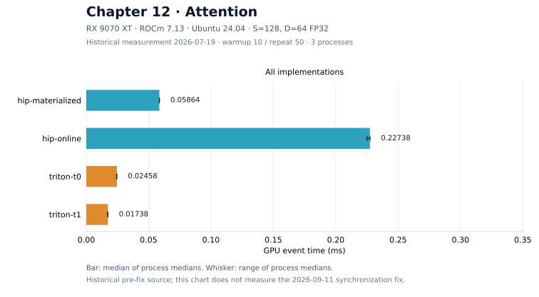

<script setup>
import AttentionJourney from './attention-journey.vue'
import AttentionExecution from './attention-execution.vue'
</script>

# 第12章 Fusion：融合算子

## 本章导读

前几章中，我们已经会做矩阵乘和 Softmax。如果把它们接起来，前一个算子的输出就成为后一个算子的输入。最直接的办法是把中间结果写回显存，等下一个 kernel 来读。能否在数据还留在片上时继续计算，只把最终结果写出去？

这一章用 Attention 回答这个问题。我们先看一行输出是怎样得到的，再手算一个不必保存全部分数的算法，最后比较它的两种实现。第一次阅读，重点看清“已经算过的结果怎样继续使用”。HIP 和 Triton 的代码放在同一节的标签页中，基本语法可随时回到[附录 D](../../appendix/programming-models/index.md)。

## 12.1 一行 Attention 输出依赖什么

本章只考虑单 batch、单 head、FP32 前向计算。把序列长度记为 $S$，每个向量的长度记为 $D$。输入 $Q、K、V$ 都有 $S$ 行、$D$ 列。对第 $i$ 行 query，我们先和每行 key 做点积，再用 Softmax 把这些分数变成权重：

$$
s_{ij}=\frac{Q_i\cdot K_j}{\sqrt D},\qquad
p_{ij}=\frac{e^{s_{ij}}}{\sum_{k=0}^{S-1}e^{s_{ik}}},\qquad
O_i=\sum_{j=0}^{S-1}p_{ij}V_j.
$$

这里的 $p_{ij}$ 是一个数，$V_j$ 是一个向量。输出 $O_i$ 是这些 value 向量的加权和，因此仍有 $D$ 个分量。不要把分数 $s_{ij}$ 当成数组下标：与它对应的是第 $j$ 行 value。

先假设某个 query 与三个 key 的分数已经算好，依次为 `[2,1,4]`，对应 value 是 `[1,0]、[0,2]、[3,1]`。减去最大值 4 后，指数为：

$$
[e^{-2},e^{-3},1]\approx[0.1353,0.0498,1].
$$

把它们除以总和 $1.1851$，得到概率约 `[0.1142,0.0420,0.8438]`。再分别乘 value 并相加，输出约为 `[2.6456,0.9278]`。下面会反复使用这一组数。它是数学手算，不是 benchmark 输入。

## 12.2 把中间结果存下来会发生什么

物化（materialize）就是把一个中间结果真正保存成数组。完整 Attention 的分数矩阵和概率矩阵都是 $S\times S$：

```text
Q、K → Scores [S,S] → P [S,S] → 与 V 相乘 → O [S,D]
```

本章 HIP 基线正好分三个 kernel：算分数、逐行 Softmax、计算加权和。这样很容易逐段调试，因为每一步都留下了可检查的数组。它也让 Scores 和 P 各经历一次全局写入和一次后续读取。

仅这两个 FP32 中间数组的容量就是 $2\times S^2\times4$ Byte；按每个数组写一次、读一次计算，逻辑中间数据量为 $16S^2$ Byte。这里数的是算法读写，不是硬件计数器测得的显存流量。缓存、重复访问和具体实现都会影响物理传输。

问题于是变成：**不保存完整 Scores 和 P，能否仍然得到同一个加权和？**

::: figure fig-attention-materialize-flow
<AttentionExecution scenario="materialize-flow" />

物化数据流：三个 dispatch 之间用全局数组 Scores [S,S] 与 P [S,S] 串接，二者各经历一次全局写入与一次读取。图为 S=4、D=2 的教学缩略；16S² Byte 按「写一次、读一次」计算，是算法读写量，不是硬件事务计数。
:::

如 @fig-attention-materialize-flow 所示，中间数组不是副产品，而是这条管线的工作介质：每个 dispatch 的输出就是下一个 dispatch 的输入，都要经过全局显存走一个来回。


## 12.3 边读 key，边更新 Softmax

一次只处理一个分数时，我们还不知道后面是否会出现更大的值。为已经读过的 key 保留三个累计状态即可：

| 状态 | 含义 | 大小 |
| --- | --- | --- |
| $m$ | 已见分数中的最大值 | 一个标量 |
| $l$ | 以 $m$ 为基准的指数和 | 一个标量 |
| $a$，代码中为 `accumulator` 或 `numerator` | 以同一基准累计的加权 value | 一个 $D$ 维向量 |

初始 $m=-\infty,l=0,a=0$。读到 key $j$ 的分数 $s_j$ 时，新的基准为 $m'=\max(m,s_j)$。定义两个缩放系数：

$$
\alpha=e^{m-m'},\qquad \beta=e^{s_j-m'}.
$$

然后同时更新分母和分子：

$$
l'=\alpha l+\beta,\qquad a'=\alpha a+\beta V_j.
$$

最后输出 $a/l$。为什么旧结果也要乘 $\alpha$？旧项原来以 $e^m$ 为尺度，现在改用 $e^{m'}$；恒等式 $e^{s-m'}=e^{s-m}e^{m-m'}$ 正好给出这一系数。

在前面的例子中，读完分数 2 和 1 后，$m=2,l=1+e^{-1},a=[1,2e^{-1}]$。第三个分数 4 改变了最大值，必须先把旧 $l$ 和旧 $a$ 都乘 $e^{-2}$，再加入新项。@fig-attention-online 展示每一步的实际数值。

::: figure fig-attention-online
<AttentionJourney />

固定一个 query 行，逐个 key 更新在线 Softmax。最后一帧与物化计算得到相同的数学结果；动画不表示硬件执行时序。
:::

这就是在线（online）的含义：随着输入到来更新状态。处理顺序可以是一项一项，也可以是一块一块。Triton 实现会先求当前 tile 的最大值和贡献，再用同样的缩放关系合入历史状态。数学上等价不意味着浮点结果逐位相同，归约次序仍可能带来舍入差异。

## 12.4 用 HIP 或 Triton 表达这段数据流

<ImplementationTabs id="ch12-implementations">

<template #hip>

### HIP：先把三个 kernel 的职责分开 {#ch12-hip}

完整源码在 [attention_hip.hip](https://github.com/datawhalechina/hello-gpu/blob/dev/code/part2-kernels/chapter12/attention_hip.hip)。`scores_kernel` 的一个线程负责一个 query-key 点积；`softmax_rows_kernel` 的一个 block 负责一行；`probability_value_kernel` 的一个线程负责一个输出元素。Host 的 `launch` 将三个 dispatch 放在同一计时间隔内。

Softmax 中，同一块 LDS 先用于 max 归约，再用于 sum 归约。因此有两个不同的等待点：先等最大值写好，再等所有线程读完最大值，之后才可以覆盖这块存储。本次审查在后一个位置补上了屏障，原理与第 10 章相同。

### HIP：让一个 block 完成一个 query 行

在线版本的 `blockIdx.x` 选择 query 行，所有线程沿 key 顺序协作。每次先各自计算部分点积，在 LDS 中归约；线程 0 得到当前 score 后更新状态。下面是源码原文：

```cpp
if (tid == 0) {
    float score = reduction[0] * scale;
    float old_max = state[0];
    float new_max = fmaxf(old_max, score);
    float alpha = expf(old_max - new_max);
    float beta = expf(score - new_max);
    state[0] = new_max;
    state[1] = state[1] * alpha + beta;
    state[2] = alpha;
    state[3] = beta;
}
```

`state[0:4]` 分别保存 $m,l,\alpha,\beta$。四个存储位置中，前两个是累计标量，后两个是本轮广播给其他线程的系数；向量累计另放在 `numerator` 中。紧接着的屏障保证线程读到这一轮的新系数。更新 numerator 后还要再同步，防止下一轮提前覆盖系数：

```cpp
    for (int d = tid; d < dim; d += blockDim.x) {
        numerator[d] = numerator[d] * state[2] +
                       state[3] * value[col * dim + d];
    }
    __syncthreads();
}
```

扫描完所有 key 后，每个线程负责把若干个 `numerator[d] / state[1]` 写到输出。这个版本明确展示了依赖，但每个 key 都需要多次 block 同步，且 query 没有跨行分块复用。减少中间写回只是收益的一面，新增的同步同样是成本。

::: figure fig-attention-online-sync
<AttentionExecution scenario="online-sync" />

hip-online 每个 key 的同步时间线：部分点积 → LDS 归约出 score → 线程 0 更新 m、l、α、β → 屏障广播 → 全线程更新 numerator → 屏障。图中 Q/K 取一组能得到正文手算分数 [2, 1, 4] 的值，D=2 → 2 线程教学缩略；底部计数器累计 block 同步次数。
:::

如 @fig-attention-online-sync 所示，正文要求画的顺序——点积完成 → 状态更新 → 所有线程更新 numerator → 下一 key——在图中就是每个 key 的一拍。同步计数器随 key 持续累加：这是 12.6 节「少写回，为什么仍可能更慢」的成因所在。


### HIP：区分不读写与不分配

在线 kernel 不读写 Scores/P。不过当前教学驱动为了让两版共用一次运行，仍无条件分配了这两个缓冲区。因而当前实现可以验证中间读写被省去，**不能据此声称整个进程的显存分配峰值已经下降**。如果要测容量收益，需要先改成按版本分配，并单独记录峰值。

在本章目录编译后，用同一参数运行两条路线：

```bash
hipcc --offload-arch=gfx1201 -O3 -std=c++17 attention_hip.hip -o attention_hip
./attention_hip --version all --seq 128 --dim 64 --block 256 --warmup 5 --repeat 20
```

</template>

<template #triton>

### Triton：一个 program 处理一个 query 行 {#ch12-triton}

完整源码在 [attention_triton.py](https://github.com/datawhalechina/hello-gpu/blob/dev/code/part2-kernels/chapter12/attention_triton.py)。`row = tl.program_id(0)` 选 query 行；`BLOCK_D` 覆盖向量分量，`BLOCK_K` 覆盖本轮读取的 key。把它看成一个二维小块：行方向是 key，列方向是向量分量。

加载 K tile 后，沿向量分量做归约得到一组 score，再沿 key 方向求 tile 最大值：

```python
scores = tl.sum(k * q[None, :], axis=1) * scale
scores = tl.where(key_mask, scores, -float("inf"))
tile_max = tl.max(scores, axis=0)
next_max = tl.maximum(running_max, tile_max)
history_scale = tl.exp(running_max - next_max)
probabilities = tl.exp(scores - next_max)
```

`axis=1` 的 `tl.sum` 把每个 key 的点积收成一个数；`axis=0` 的 `tl.max` 则把这些分数收成 tile 最大值。超出序列末尾的 key 被设为负无穷，其指数贡献为 0。

随后加载对应 V tile，将它的贡献加到历史累计值：

```python
accumulator = accumulator * history_scale + tl.sum(
    probabilities[:, None] * v, axis=0
)
running_sum = running_sum * history_scale + tl.sum(probabilities, axis=0)
running_max = next_max
```

`probabilities` 此时还没有除以指数和，是暂时的未归一化权重；直到循环结束才执行 `accumulator / running_sum`。`mask=d < DIM` 同时保护分量尾部。不要只看变量名字，就把它当成最终概率。

### Triton：改变每轮看多少个 key

`t0` 使用 `BLOCK_K=16`，`t1` 使用 32。对 `S=128`，它们分别循环 8 轮和 4 轮。更宽的 tile 会减少循环轮数，也会扩大每轮同时处理的数据；这两个变化要一起通过实验评估。

在本章目录运行：

```bash
python attention_triton.py --version all --seq 128 --dim 64
```

当前 CLI 限制 `DIM <= 256`。修改 `BLOCK_K` 之前先保留这个已验证范围；支持更大的 head dimension 需要重新检查资源和边界，不能只改掉参数限制。

</template>

</ImplementationTabs>

## 12.5 怎样检查结果和计时

两种语言都比较完整输出矩阵，计时前后各检查一次，最大绝对误差需小于 `2e-4`。HIP 使用 CPU FP32 参考计算，输入来自 `[-0.5,0.5]` 均匀分布；Triton 使用 PyTorch 参考和缩放后的正态输入。即使 seed 相同，这也不是完全相同的一份输入，跨语言结果只作当前协议下的观察。

现有 HIP 误差循环用 `std::max` 累计绝对误差，没有单独拒绝 NaN。因此通过输出校验描述的是当前输入和检查程序的结果；若增加溢出压力输入，应先补上有限值检查，不能只依赖一个最大误差数字。

边界检查应当覆盖两个轴。2026-09-11 的同步修正复测实际检查了 `1×1、7×13、33×31、65×33`，并对主形状 `128×64` 运行了 3 个独立进程，两个 HIP 实现均通过前后校验。这次未重跑 Triton。已有历史发布组还保留了独立的边界与 trace 记录。

GPU event 对 materialized 包围三个 kernel，对 online 包围一个 kernel；分配、数据传入和参考答案不在计时内。单看 online 的一个 kernel 与 materialized 的一个子 kernel，比较范围就变了。

## 12.6 少写回，为什么仍可能更慢

以下是 **2026-07-19、修正 LDS 同步之前**的历史组：RX 9070 XT、原生 Ubuntu 24.04、ROCm 7.13，FP32，`S=128,D=64`。每进程预热 10 次、计时 50 次，3 个独立进程；表中为进程内 median 的中位数。

| 实现 | median ms | 三进程范围 ms |
| --- | ---: | ---: |
| HIP materialized | 0.0586405 | 0.058561–0.058741 |
| HIP online | 0.227383 | 0.225102–0.227542 |
| Triton t0 | 0.024580 | 0.024441–0.024600 |
| Triton t1 | 0.017380 | 0.017060–0.017400 |

::: figure fig-attention-performance


修正前历史实验，柱长来自该章 evidence/summary.csv；不作为同步修正版的当前性能排名。
:::

历史 HIP online 比物化版慢，保留这个负结果有助于理解融合的边界：源码中每个 key 的同步和串行扫描都是值得排查的成本。但只有总时间和资源字段，尚不能量化每一项造成了多少延迟，也不能把频繁同步认定为唯一原因。

同步修正后的独立回归中，HIP materialized 的三进程 median 为 `0.088003 ms`（`0.088002–0.0881215`），online 为 `0.280066 ms`（`0.279847–0.280165`）。该组预热 5 次、计时 20 次，GPU 未独占，未重采 Triton 或 profile；不能和旧图拼接，也不能用两个日期的差值推算屏障开销。源码哈希、边界与每条结果见[实验记录](https://github.com/datawhalechina/hello-gpu/blob/dev/code/part2-kernels/chapter12/EXPERIMENT.md)。

## 12.7 复跑并提出下一轮问题

先进入已经配置好的 Part 2 环境，然后运行本章入口：

```bash
cd code/part2-kernels
source ./activate-rocm.sh
bash chapter12/run_all.sh
```

`profile_all.sh` 会为每种实现单独采集 trace，需要的源码提交标识由本地 Git 维护机提供，实验机只运行传入的文件。记录中应先说明追踪的是三个子 kernel 还是在线 kernel，再读 dispatch、workgroup、LDS、VGPR 和 scratch 字段。trace 的 grid 范围也不能直接当成 block 数。

下一轮可以先回答一个小问题：HIP online 的每次同步承担哪个依赖？画出“点积完成 → 状态更新 → 所有线程更新 numerator → 下一 key”的顺序，再考虑是否可以按 key tile 一起计算。没有依赖分析就删屏障，即使偶尔跑对也不能说明修改正确。

## 12.8 练习：先预测，再改变一个条件

1. 用上面的 `[2,1,4]` 和三个 V，手算最后一轮 $\alpha,l,a$。如果忘记缩放旧 $a$，哪个输出分量会出错？提示：新基准会影响所有历史项。
2. 把三个 key 的顺序改成 `[4,2,1]`，同时交换对应 V。数学输出会改变吗？浮点最后几位一定相同吗？
3. 对 `S=33`，画出 `BLOCK_K=16` 的三轮 mask。被屏蔽的 key 为什么不能把 score 填成 0？
4. 只改变 `BLOCK_K`，同时记录循环轮数、时间和资源字段。若变慢，保留这组结果，并列出尚未验证的原因。
5. 选做：添加 causal mask。先给出 `j > i` 不参与计算的数学规则，再检查每行至少有一个有效位置；暂不同时加入 batch、多 head 和低精度。

## 本章小结

Attention 把矩阵乘和 Softmax 接成一段数据流。物化实现留下完整的分数和概率矩阵，在线实现则保留当前最大值、指数和与加权累计。最大值改变时，分母和分子必须一起换尺度。

本章只实现便于观察的前向算法，借用了 [FlashAttention 的分块与减少中间读写思想](https://arxiv.org/abs/2205.14135)，没有复现完整论文 kernel。下一章会把同样的依赖与融合分析用于更短的 RMSNorm，作为这一篇的综合练习。

## 延伸阅读

- [Triton Fused Attention 教程](https://triton-lang.org/main/getting-started/tutorials/06-fused-attention.html)：学完在线递推后，再阅读更完整的分块实现。
- [附录 D：HIP 与 Triton 的编程范式](../../appendix/programming-models/index.md)：回顾 block 协作和 program 数据块。
