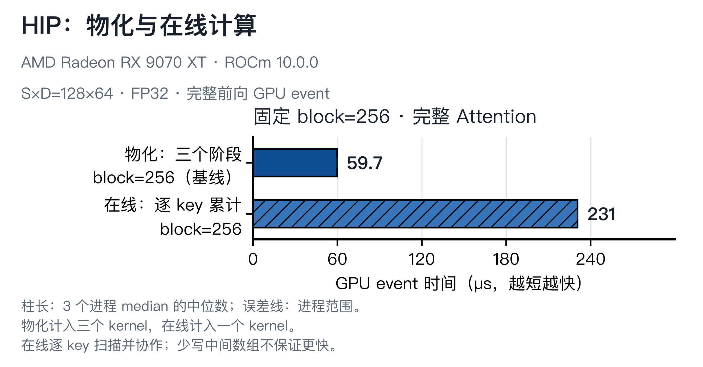
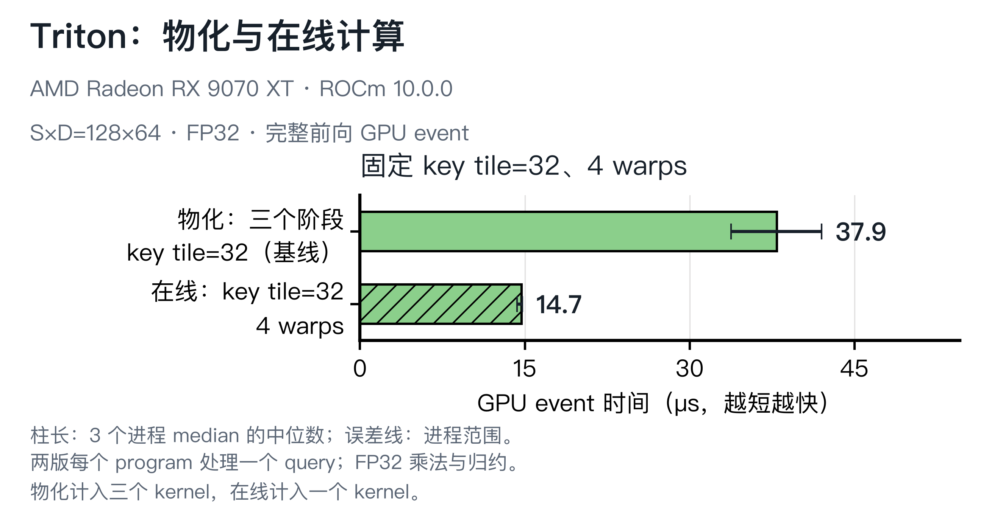
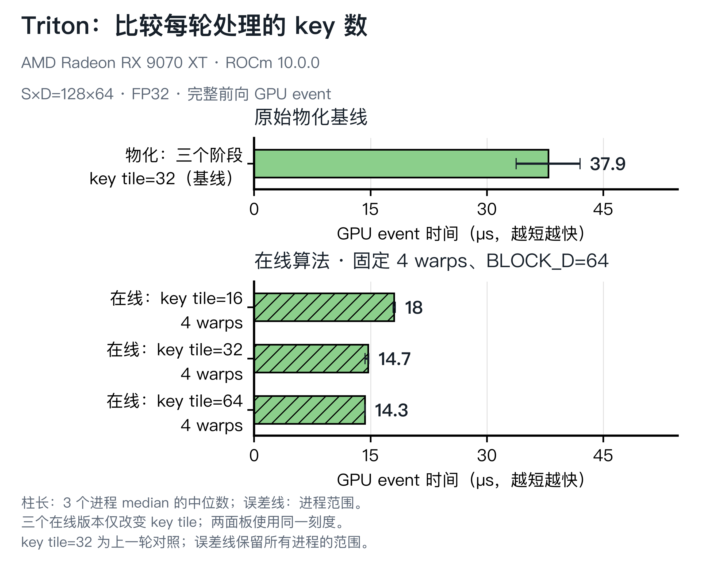
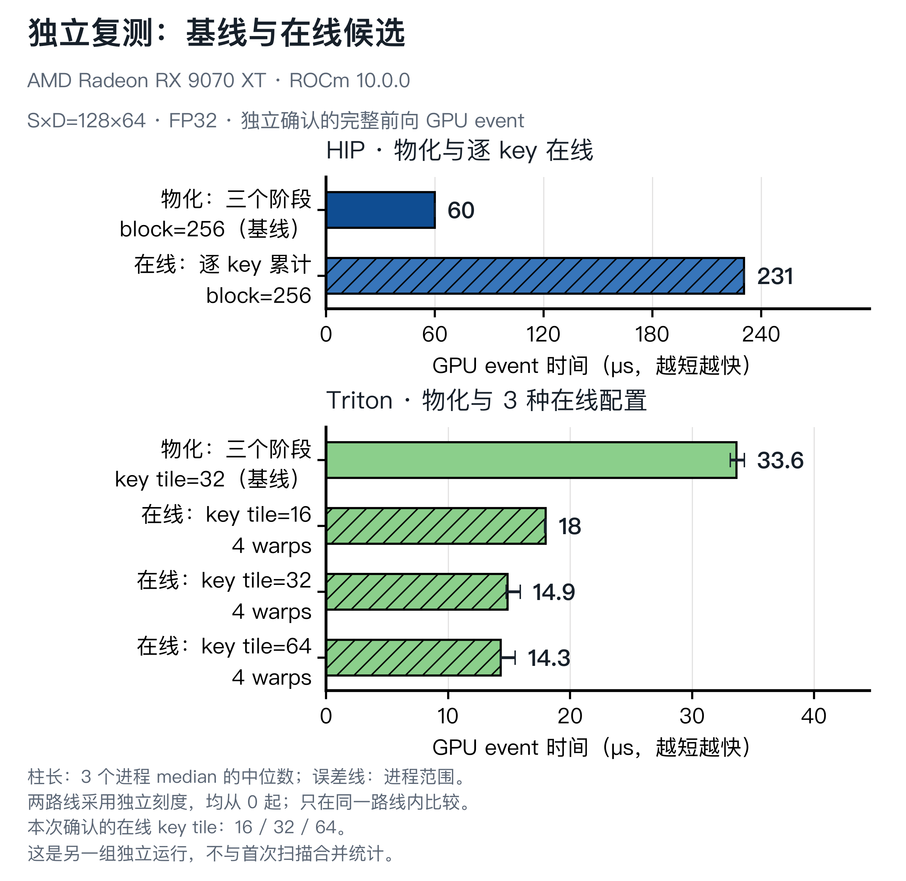
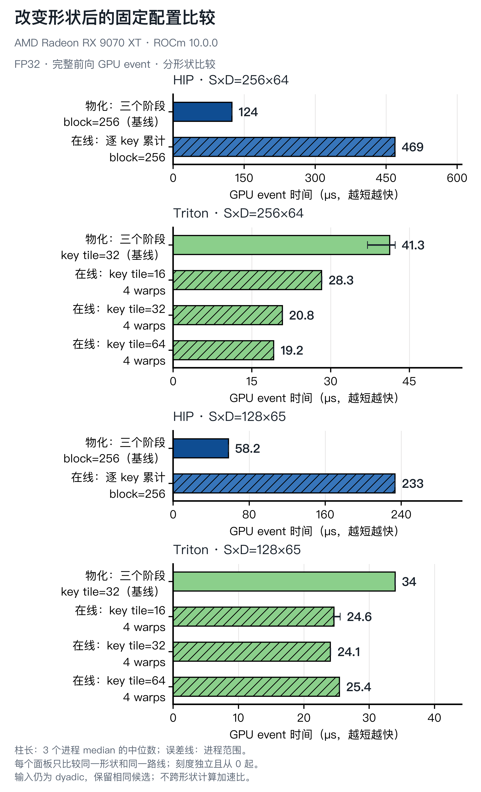

<script setup>
import AttentionJourney from './attention-journey.vue'
import AttentionExecution from './attention-execution.vue'
</script>

# 第12章 Fusion：融合算子

## 本章导读

前两章已经能分别完成矩阵乘和 Softmax。把它们接起来后，前一步的输出就成了后一步的输入：先算完、写入数组，再由下一步读走，是最直接的实现。

如果后一步只需要中间结果的一部分，能否在这部分还可用时继续计算，省去完整中间数组？本章用 Attention 研究这个问题。先用三个 key 手算一行输出，再让已经算过的贡献随着新 key 到来继续累积，最后用完整路径的计时判断这项改动是否值得。

- **公共基础**：阅读[加权和](#attention-semantics)、[中间数据](#attention-materialization)和[在线更新](#attention-online)，看清结果为什么不变。
- **HIP 路线**：从[三个 kernel 的物化基线](#ch12-hip)出发，比较一个 block 完成一行的在线版本，检查减少中间读写是否抵得上新增协作。
- **Triton 路线**：从[三个 kernel 的物化基线](#ch12-triton)出发，先比较在线计算，再固定其他参数，只改变一次处理的 key 数。

配套代码在 `code/part2-kernels/chapter12/`。环境沿用 **Radeon RX 9070 XT（gfx1201）+ ROCm 10.0 + 原生 Ubuntu 24.04**。动画展示算法中的依赖和手算过程，不表示 GPU 的真实执行速度。

## 12.1 Attention 的一行加权和 {#attention-semantics}

本章计算单组 Q、K、V 的 FP32 前向 Attention，不包含 batch、多 head 或 causal mask。序列长度为 $S$，每个向量有 $D$ 个分量，三个输入的形状都是 `[S,D]`。

固定第 $i$ 行 query，先与每行 key 做点积得到分数，再对这一行分数做 Softmax，最后用这些权重合并 value：

$$
s_{ij}=\frac{Q_i\cdot K_j}{\sqrt D},\qquad
p_{ij}=\frac{e^{s_{ij}}}{\sum_{k=0}^{S-1}e^{s_{ik}}},\qquad
O_i=\sum_{j=0}^{S-1}p_{ij}V_j.
$$

一个 $p_{ij}$ 是标量，$V_j$ 是向量；它们相乘后仍有 $D$ 个分量。把所有 key 对应的贡献加起来，得到这一行输出 $O_i$。因此，计算某个 query 行需要遍历全部 key/value，但不需要其他 query 行的结果。

先假设某个 query 得到三个分数 `[2,1,4]`，对应的 value 是 `[1,0]、[0,2]、[3,1]`。沿用第 10 章的稳定 Softmax，先减去最大值 `4`：

| key | 平移后的指数，约值 | 归一化权重，约值 | 对输出的贡献，约值 |
| --- | ---: | ---: | --- |
| 0 | $e^{-2}=0.1353$ | 0.1142 | `[0.1142, 0]` |
| 1 | $e^{-3}=0.0498$ | 0.0420 | `[0, 0.0840]` |
| 2 | $1$ | 0.8438 | `[2.5314, 0.8438]` |

未舍入指数的总和约为 `1.1851`，输出约为 `[2.6456,0.9278]`。后面始终跟踪同一组数据，观察怎样在不保存全部分数的情况下得到这个结果。这个例子用于手算，不是性能实验输入。

先在 @fig-attention-weighted-sum 中逐项观察：一个概率分别乘对应 V 的两个分量，得到两个贡献，再各自加入输出的累计值。概率和 V 的原值始终保留，只有三个 key 都处理完后才写出输出。

::: figure fig-attention-weighted-sum
<AttentionJourney mode="weighted" />

同一个 query 的三个权重分别作用于三条 V。可在每个 key 的步骤停留，核对两个乘积和两个累计分量；动画的播放时长不表示计算耗时。
:::

## 12.2 中间矩阵与物化成本 {#attention-materialization}

对所有 query 行重复上述计算，就会得到分数矩阵 `Scores[S,S]` 和概率矩阵 `P[S,S]`。把一个中间结果真正保存成数组，称为物化（materialize）：

```text
Q、K → Scores [S,S] → P [S,S] → 与 V 合并 → O [S,D]
```

两条路线都先建立三个 kernel 的物化基线。分数、Softmax、加权和各自完成一段工作，通过全局数组传递结果。每段职责清楚，也便于定位错误。

::: figure fig-attention-materialize-flow
<AttentionExecution scenario="materialize-flow" />

三个阶段通过 Scores 与 P 交接。仍固定上例的一个 query：分数需要全部 K，输出需要完整概率行和全部 V。每个 query 都按此规则得到自己的输出行；箭头只表示数组依赖。
:::

@fig-attention-materialize-flow 中，两块 FP32 中间数组合计占用 $2S^2\times4$ Byte。对主形状 `S=128,D=64`，它们的容量合计为 **128 KiB**。只按每块数组完整写一次、完整读一次计，已有 **256 KiB** 的逻辑访问。这是按数组大小计算的最低账目，不是测得的带宽或流量。

具体源码可能重复读取：例如 HIP 的加权和 kernel 由一个线程负责一个输出分量，同一行概率会被该行的多个输出线程分别读取；行 Softmax 也会多次扫描 Scores。缓存还会影响这些访问最终到达哪一级存储。因此，不能拿 `16S² Byte` 直接代替本程序的全部读取量，再用总时间反推显存带宽。

需要检验的假设是：**省去完整 Scores/P 的中间读写，能否降低一次 Attention 的总时间？** 为此必须改变计算过程，让尚未读完 key 时也能保留正确的历史贡献。

## 12.3 在线 Softmax 与历史贡献 {#attention-online}

先只处理第一个分数 `2`。以它作为当前最大值，指数就是 `1`，加权 value 是 `[1,0]`。第二个分数 `1` 小于当前最大值，加入 $e^{-1}$ 和 $e^{-1}[0,2]$ 即可。

第三个分数变成 `4`。之前两个指数以 `2` 为基准，现在必须一起换成以 `4` 为基准：旧结果都乘 $e^{2-4}$，再加入新的 `[3,1]`。不能只重缩放分母而保留原来的分子。

::: figure fig-attention-online
<AttentionJourney />

固定同一个 query，依次加入三个 key 的贡献。新最大值从 2 变为 4 时，分别停在“保留旧值”“重缩放”“加入新项”三个步骤，核对旧分母与两个旧累计是否同乘 exp(−2)。最后再做除法；显示的小数只用于阅读，后续计算使用未舍入的值。
:::

把 @fig-attention-online 中持续保留的值记为三个状态：

| 状态 | 当前含义 | 需要保存多少数据 |
| --- | --- | --- |
| $m$ | 已处理分数的最大值 | 一个标量 |
| $l$ | 以 $m$ 为基准的指数和 | 一个标量 |
| $a$ | 以同一基准累计的加权 value | 一个 $D$ 维向量 |

初始状态为 $m=-\infty,l=0,a=0$。读到分数 $s_j$ 后，令

$$
m'=\max(m,s_j),\qquad \alpha=e^{m-m'},\qquad\beta=e^{s_j-m'}.
$$

新的分母和分子分别为

$$
l'=\alpha l+\beta,\qquad a'=\alpha a+\beta V_j.
$$

最后输出 $a/l$。重缩放来自恒等式 $e^{s-m'}=e^{s-m}e^{m-m'}$，它让所有历史项仍采用同一尺度。第一个 key 有限时，$\alpha=e^{-\infty}=0$，初始状态不会贡献任何权重。

这称为在线（online）计算：随着新数据到来更新已有状态。也可以一次处理一个 key tile，先求 tile 内的最大值、指数和与加权贡献，再按同样的关系合入历史。两种组织在数学上等价；FP32 的归约顺序不同，最后几位不要求逐位相同。

## 12.4 正确性参考与计时范围 {#attention-contract}

两条路线都使用连续的 FP32 `Q/K/V[S,D]`，输出为 FP32 `O[S,D]`。性能实验输入按行号、分量号和固定 seed 生成；所有值都是整数除以二的幂，因此 HIP 与 Triton 得到相同的输入，不依赖两种随机库恰好生成相同序列。

| 检查项目 | 本章约定 |
| --- | --- |
| 主形状与输入 | `S=128,D=64`，`input=dyadic`，`seed=20260920` |
| 正确性参考 | CPU 用 FP64 完成 QK、稳定 Softmax、PV，最后转为 FP32 |
| 逐元素误差 | $|O-O_{ref}|\le 2\times10^{-5}+2\times10^{-4}|O_{ref}|$ |
| 有限值 | 任意输出为 NaN 或无穷立即失败 |
| 检查时机 | 第一次输出预填 NaN，计时前检查完整输出；计时后再检查最后一次完整输出 |
| GPU 算术 | 两路线保持 FP32；本章 Triton 不使用 `tl.dot` 或混合精度矩阵路径 |

六个配置分别检查 `dyadic` 输入的 `1×1`、`17×31`、`33×65`、`65×64`，以及 `rising-max` 输入的 `65×64`、`129×64`，共 **36 项检查通过**。形状顺序为 `S×D`；其中 33/65/129 检查 key 尾部，31/65 检查向量分量尾部。

专用输入 `rising-max` 让后一个 key 的分数高于前一个，迫使状态在多个 key、多个 tile 之间反复重缩放。它用于发现“只有最大值不变时才算对”的错误；不与默认输入的性能样本混在一起。单 key 检查还有一个直接答案：权重为 `1`，输出应等于这一行 value。

GPU event 计完整前向路径：物化版本包含三个 kernel，在线版本包含一个 kernel。分配、输入拷贝、CPU 参考、正确性检查及 Triton 首次编译在稳态计时之外。正式计时不启用 profiler，诊断另行采集。

每配置运行 3 个独立进程，每进程预热 10 次、采样 50 次，每个 event 区间后同步。图的中心值是三个进程中位数的中位数，范围线是它们的最小—最大值，**不是置信区间**。主形状与两组附加形状共 54 个进程、2700 个样本；扫描后另外运行 18 个进程、900 个样本作独立确认。

两个 Host 当前都为 Scores/P 分配空间，即使只运行在线版本也保留这项分配。输出中的 `intermediate_allocated_bytes` 记录这两块缓冲区容量，`intermediate_used_bytes` 则在在线版本中为 `0`。后一个字段表示 kernel 不使用它们，既不是访存计数器，也不能证明整个进程的显存分配峰值已下降。

## 12.5 HIP 与 Triton 优化路线 {#attention-implementation}

先在一种语言内建立物化基线，再对照在线实现。两条路线分别回答自己的优化问题，不把彼此当作必须战胜的初版。

**环境与结果目录。** 以下命令在 GPU 机器的仓库根目录开始执行，后续保持在 `code/part2-kernels/`。沿用本篇 `uv.lock`，不要删除锁文件：

```bash
cd code/part2-kernels &&
uv sync --locked &&
source ./activate-rocm.sh
```

为本章新建一个独立结果目录，保存打印出来的路径：

```bash
mkdir -p chapter12/results &&
RUN=$(mktemp -d chapter12/results/walkthrough-XXXXXX) &&
mkdir "$RUN/build" &&
printf '本轮结果目录：%s\n' "$RUN"
```

换终端后，重新执行环境准备，再恢复之前打印的目录；提示处只粘贴路径，不含 `RUN=`：

```bash
read -r -p '粘贴上次输出的结果目录：' RUN &&
test -n "$RUN" && test -d "$RUN/build" &&
printf '继续使用结果目录：%s\n' "$RUN"
```

需要重测或改动源码时，新建 `RUN`，重新编译 HIP；恢复旧目录只用于继续未修改的实验。后续命令会拒绝写入已有样本。

每条命令先校验，再完成一个进程的 10 次预热与 50 次计时；折叠输出对应第 1 个进程。**图使用三个独立进程的统计，不是一次终端输出。** 手工复测时同时把样本名 `p1` 与 `--process 1` 改为 `p2`/`2`、`p3`/`3`，每遍覆盖同组候选并轮换起始项。[章末批量入口](#attention-reproduce)会自动完成这一步、汇总并画本轮图，不要求先运行 profiler。

先判断完整结果与完整时间。HIP 在线版本出现明显退步，才进一步追问设备上的哪个阶段变长；Triton 的采用与 tile 选择先由重复测量判断，不要求两条路线走相同的工具流程。

<ImplementationTabs id="ch12-implementations">
<template #hip>

### 12.5.1 HIP 基线：分阶段保存中间结果 {#ch12-hip}

<a id="ch12-hip-source"></a>

<details>
<summary>完整源码：code/part2-kernels/chapter12/attention_hip.hip</summary>

<<< @/../code/part2-kernels/chapter12/attention_hip.hip{cpp}

</details>

这份文件包含本路线的输入准备、kernel、启动、校验与计时；后续配置共用它，按函数和运行参数定位改动。

先编译一次。未修改源码时可复用本轮可执行文件；修改源码后请新建结果目录再编译：

```bash
test -d "${RUN:?请先准备本章环境与结果目录}/build" && \
if [[ ! -x "$RUN/build/attention_hip" ]]; then
  hipcc --offload-arch=gfx1201 -O3 -std=c++17 \
    chapter12/attention_hip.hip -o "$RUN/build/attention_hip"
fi
```

`launch()` 用三个 kernel 对应三个阶段：

| 阶段 | 分工 | 写出什么 |
| --- | --- | --- |
| `scores_kernel` | 一个线程计算一个 query-key 点积 | 一个 Score |
| `softmax_rows_kernel` | 一个 block 协作处理一行分数 | 这一行概率 |
| `probability_value_kernel` | 一个线程累加一个输出分量 | 一个 O 元素 |

同一 query 的不同 key 点积互不依赖，分数阶段可以同时展开多个 query-key 对；最终加权和则沿 key 归约。行 Softmax 的 LDS 复用遵循第 10 章的同步规则：归约完成后，必须等所有线程读完最大值，才可用同一片 LDS 保存下一次归约的部分和。

先运行物化路径，为本路线建立基线：

<!-- benchmark:hip-materialized-b256:128x64 -->

```bash
test -d "${RUN:?请先准备本章环境与结果目录}/build" && \
test ! -e "$RUN/n128x64-hip-materialized-b256-p1.csv" && \
"$RUN/build/attention_hip" \
  --block 256 --version materialized --seq 128 \
  --dim 64 --warmup 10 --repeat 50 \
  --seed 20260920 --input dyadic --config-id hip-materialized-b256 \
  --samples "$RUN/n128x64-hip-materialized-b256-p1.csv" --process 1
```

<details>
<summary>真实输出：hip-materialized-b256，shape=128x64，第 1 个独立进程</summary>

<<< @/../code/part2-kernels/chapter12/evidence/walkthrough/logs/n128x64-hip-materialized-b256-p1.log{text}

</details>

先检查 `correct/precheck/postcheck`、有限值与容差比，再核对 `shape=128x64,launches=3`。主形状基线完整时间为 **59.681 μs**，三个进程中位数范围为 **59.581–59.741 μs**。源码中的 Scores/P 交接已经提供了融合假设，不需要先采 profiler 才能提出它。

这条路径保存了完整中间矩阵，也进行了三次 kernel 调用。接下来尝试在一个 block 内直接累计一行输出，检验这些中间成本是否值得省去。

### 12.5.2 HIP 改动：一个 block 完成在线累计

在线版本用 `blockIdx.x` 选择 query 行。每读一个 key，线程协作算完点积，再更新这一行的最大值、指数和与向量累计。这样最终只需写出 `O[S,D]`，kernel 不再读写 Scores/P。

线程 `0` 更新当前 key 的标量状态：

```cpp
if (tid == 0) {
    float score = reduction[0] * scale;
    float old_max = state[0];
    float new_max = fmaxf(old_max, score);
    float alpha = expf(old_max - new_max);
    float beta = expf(score - new_max);
    state[0] = new_max;
    state[1] = state[1] * alpha + beta;
    state[2] = alpha;
    state[3] = beta;
}
```

屏障之后，其他线程读取本轮的 `alpha/beta`，分别更新自己负责的 `numerator[d]`。更新结束后再同步，下一轮才能覆盖系数。

::: figure fig-attention-online-sync
<AttentionExecution scenario="online-sync" />

只放大 key 2 的系数交接，起点是已经得到 score=4。线程 0 写好共享系数，全 block 同步后消费者才能取得它们；各自更新共享 numerator 后，还需等待消费完成才能复用系数。图中仅展开两个输出分量，其余线程仍参与协作，不统计完整 kernel 的屏障次数。
:::

@fig-attention-online-sync 标出了系数写入与消费之间的依赖。物化基线会展开多个 query-key 对，在线版则在每个 block 内按顺序遍历 key；它还需要保存跨轮状态，并多次等待点积和状态更新完成。**省去中间矩阵，并不意味着剩余计算的分工与协作成本保持不变。**

在线算法改变了跨轮状态，先让后续 key 的最大值持续升高，检查分母与分子是否一起重缩放：

```bash
test -d "${RUN:?请先准备本章环境与结果目录}/build" && \
"$RUN/build/attention_hip" \
  --block 256 --version online --seq 65 \
  --dim 64 --warmup 0 --repeat 1 \
  --seed 20260920 --input rising-max --config-id hip-online-b256
```

<details>
<summary>正确性输出：HIP online，65×64，rising-max</summary>

<<< @/../code/part2-kernels/chapter12/evidence/walkthrough/logs/edge-rising-max-65x64-hip-online-b256.log{text}

</details>

再检查只有一个 key 的情形，输出应等于 value：

```bash
test -d "${RUN:?请先准备本章环境与结果目录}/build" && \
"$RUN/build/attention_hip" \
  --block 256 --version online --seq 1 \
  --dim 1 --warmup 0 --repeat 1 \
  --seed 20260920 --input dyadic --config-id hip-online-b256
```

<details>
<summary>正确性输出：HIP online，单 key</summary>

<<< @/../code/part2-kernels/chapter12/evidence/walkthrough/logs/edge-dyadic-1x1-hip-online-b256.log{text}

</details>

两条命令仅读正确性，不比较一次采样的时间。检查通过后，回到与基线相同的 dyadic 主输入，测完整在线版本：

<!-- benchmark:hip-online-b256:128x64 -->

```bash
test -d "${RUN:?请先准备本章环境与结果目录}/build" && \
test ! -e "$RUN/n128x64-hip-online-b256-p1.csv" && \
"$RUN/build/attention_hip" \
  --block 256 --version online --seq 128 \
  --dim 64 --warmup 10 --repeat 50 \
  --seed 20260920 --input dyadic --config-id hip-online-b256 \
  --samples "$RUN/n128x64-hip-online-b256-p1.csv" --process 1
```

<details>
<summary>真实输出：hip-online-b256，shape=128x64，第 1 个独立进程</summary>

<<< @/../code/part2-kernels/chapter12/evidence/walkthrough/logs/n128x64-hip-online-b256-p1.log{text}

</details>

先核对检查通过、`launches=1` 与 `intermediate_used_bytes=0`，再读完整时间；后者不代表主机没有分配这两块缓冲。

::: figure fig-attention-round-hip-fusion


S=128、D=64，两版 block 都为 256，比较完整前向路径。在线版减少目标 kernel 数和中间读写，但没有保持相同的 key 并行分工。
:::

在线版为 **230.643 μs**，范围 **230.523–230.683 μs**，用时约为物化基线的 **3.86 倍**。独立确认仍为 **230.602 μs** 对 **59.961 μs**。本轮保留物化实现作为 HIP 方案；在线公式通过了正确性检查，但这套执行安排没有带来性能收益。

这个负结果修正了最初的假设：仅仅省去中间矩阵还不够，还要考虑原本可以展开的 key 工作，现在怎样被顺序处理。

### 12.5.3 HIP 诊断：区分阶段时间与原因

**这次要回答：完整路径的退步，是否也出现在在线 kernel 的设备执行区间？** 这会帮助决定继续研究设备端的执行安排，还是先调查测量与提交方式。仍在 `code/part2-kernels/`，分别采两条路径；每个 kernel 按名字筛选：

```bash
test -d "${RUN:?请先准备本章环境与结果目录}/build" && \
mkdir "$RUN/profile-hip-materialized-b256" && \
rocprofv3 --kernel-trace --output-format csv \
  --output-directory "$RUN/profile-hip-materialized-b256" --output-file hip-materialized-b256 -- \
  "$RUN/build/attention_hip" \
    --block 256 --version materialized --seq 128 \
    --dim 64 --warmup 5 --repeat 10 \
    --seed 20260920 --input dyadic --config-id hip-materialized-b256 && \
python chapter8/inspect_trace.py \
  "$RUN/profile-hip-materialized-b256/hip-materialized-b256_kernel_trace.csv" \
  --kernel scores_kernel --skip 6 --take 10 && \
python chapter8/inspect_trace.py \
  "$RUN/profile-hip-materialized-b256/hip-materialized-b256_kernel_trace.csv" \
  --kernel softmax_rows_kernel --skip 6 --take 10 && \
python chapter8/inspect_trace.py \
  "$RUN/profile-hip-materialized-b256/hip-materialized-b256_kernel_trace.csv" \
  --kernel probability_value_kernel --skip 6 --take 10
```

<details>
<summary>筛选后的真实 trace：hip-materialized-b256，shape=128x64</summary>

<<< @/../code/part2-kernels/chapter12/evidence/walkthrough/reports/hip-materialized-b256.txt{text}

</details>

<details>
<summary>原始 kernel trace CSV：hip-materialized-b256，shape=128x64</summary>

<<< @/../code/part2-kernels/chapter12/evidence/walkthrough/profiles/hip-materialized-b256_kernel_trace.csv{text}

</details>

```bash
test -d "${RUN:?请先准备本章环境与结果目录}/build" && \
mkdir "$RUN/profile-hip-online-b256" && \
rocprofv3 --kernel-trace --output-format csv \
  --output-directory "$RUN/profile-hip-online-b256" --output-file hip-online-b256 -- \
  "$RUN/build/attention_hip" \
    --block 256 --version online --seq 128 \
    --dim 64 --warmup 5 --repeat 10 \
    --seed 20260920 --input dyadic --config-id hip-online-b256 && \
python chapter8/inspect_trace.py \
  "$RUN/profile-hip-online-b256/hip-online-b256_kernel_trace.csv" \
  --kernel online_attention_kernel --skip 6 --take 10
```

<details>
<summary>筛选后的真实 trace：hip-online-b256，shape=128x64</summary>

<<< @/../code/part2-kernels/chapter12/evidence/walkthrough/reports/hip-online-b256.txt{text}

</details>

<details>
<summary>原始 kernel trace CSV：hip-online-b256，shape=128x64</summary>

<<< @/../code/part2-kernels/chapter12/evidence/walkthrough/profiles/hip-online-b256_kernel_trace.csv{text}

</details>

先读报告的 `target_rows/skipped_rows/kept_rows`，核对分析窗口；再读名称与 launch，最后比较 `kernel_median_us` 和范围。物化三个阶段分别约 **8.141、4.560、34.921 μs**，在线则如下文。不要把三个独立中位数相加当成完整 benchmark。

先在 trace 中按 `scores_kernel`、`softmax_rows_kernel`、`probability_value_kernel` 筛选物化路径，再查看 `online_attention_kernel`。确认同一 shape、block 参数和完整调用范围，排除初始化与预检调用。阶段 trace 能显示耗时主要落在哪个目标 kernel，独立采集时的总记录数不是一次 Attention 的调用数。

本次每个目标 kernel 都有 16 条记录：1 次预检、5 次预热、10 次目标重复，排除前 6 条后统计。在线 kernel 的 trace 中位数为 **222.903 μs**，说明较长的设备执行本身值得继续研究；不能拿它与另一轮 event 相减，计算某项启动或同步成本。

本轮 `block=256,D=64` 时，Softmax 动态 LDS 为 `256×4=1024 B`，在线版为 `(256+64+4)×4=1296 B`。这些容量来自实际启动参数。trace 的 `LDS_Block_Size` 为 0，没有包含这项动态申请，因此不能读作“不使用 LDS”。

源码确认在线版在每个 key 后需要协作，trace 确认它的执行时间；两者还不能说明每个屏障贡献了多少延迟。继续优化时，可以提出“按 key tile 合并多轮工作”的下一项假设，但必须保留相同公式与正确性检查，再建立单独对照。直接删掉承担数据依赖的屏障，会先改变程序是否正确。

</template>
<template #triton>

### 12.5.4 Triton 基线：一行 query 的三个阶段 {#ch12-triton}

<a id="ch12-triton-source"></a>

<details>
<summary>完整源码：code/part2-kernels/chapter12/attention_triton.py</summary>

<<< @/../code/part2-kernels/chapter12/attention_triton.py{python}

</details>

这份文件包含本路线的输入准备、kernel、启动、校验与计时；后续配置共用它，按函数和运行参数定位改动。

完整程序先实现同样的物化路径。三个阶段各启动 `S` 个 program，一个 program 负责一个 query 行：

| 阶段 | program 内的工作 | 写出什么 |
| --- | --- | --- |
| `materialized_scores_kernel` | 以 32 个 key 为一块，计算与当前 query 的点积 | 当前 query 的整行 Scores |
| `materialized_softmax_kernel` | 读取一行 Scores，求稳定 Softmax | 整行 P |
| `materialized_pv_kernel` | 以 32 个 key 为一块，合并概率乘 value 的贡献 | 整行 O |

QK 和 PV 都使用 FP32 乘法与 `tl.sum`，保持本轮精度语义；这里没有通过切换矩阵精度来制造更快的基线。key tile 固定为 `32`，`num_warps=4`。`BLOCK_D` 是覆盖 `D` 的最小二次幂，超出的分量由 mask 保护。

先运行本路线的物化基线：

<!-- benchmark:triton-materialized-k32:128x64 -->

```bash
test -d "${RUN:?请先准备本章环境与结果目录}/build" && \
test ! -e "$RUN/n128x64-triton-materialized-k32-p1.csv" && \
python chapter12/attention_triton.py \
  --block-k 32 --num-warps 4 --version materialized \
  --seq 128 --dim 64 --warmup 10 \
  --repeat 50 --seed 20260920 --input dyadic \
  --config-id triton-materialized-k32 --samples "$RUN/n128x64-triton-materialized-k32-p1.csv" --process 1
```

<details>
<summary>真实输出：triton-materialized-k32，shape=128x64，第 1 个独立进程</summary>

<<< @/../code/part2-kernels/chapter12/evidence/walkthrough/logs/n128x64-triton-materialized-k32-p1.log{text}

</details>

检查正确性、有限值、三个阶段与固定 key tile32，再读完整时间。三进程汇总为 **37.940 μs**，范围 **33.760–42.001 μs**；这个范围也保留了较慢的进程。

这里观察到的可改动边界很清楚：相邻阶段通过 Scores/P 交接，而每个 query 的输出不依赖其他 query。可以尝试把这三个阶段在同一 program 内连接起来。

三个阶段之间写出并读回中间矩阵。下一轮保留一行一个 program、相同精度、key tile `32` 和 `4` warps，改成在一个 program 中直接累计输出。

### 12.5.5 Triton 改动：合并当前 tile 与历史状态

在线 program 先加载当前 query，随后循环读取 K/V tile。tile 内沿 `D` 求和得到每个 key 的分数，再沿 key 方向求最大值：

```python
scores = tl.sum(k * q[None, :], axis=1) * scale
scores = tl.where(key_mask, scores, -float("inf"))
tile_max = tl.max(scores, axis=0)
next_max = tl.maximum(running_max, tile_max)
history_scale = tl.exp(running_max - next_max)
probabilities = tl.exp(scores - next_max)
```

`axis=1` 合并一个 key 的点积分量，`axis=0` 合并不同 key 的结果。超出序列末尾的 score 设成负无穷，因此指数贡献为 `0`。`probabilities` 在这一段还没有归一化，要等全部 tile 处理完才除以总和。

随后合并向量累计和指数和：

```python
accumulator = accumulator * history_scale + tl.sum(
    probabilities[:, None] * values, axis=0
)
running_sum = running_sum * history_scale + tl.sum(probabilities, axis=0)
running_max = next_max
```

把手算例改成每次处理两个 key，便能看到尾块的行为。第一块包含 key 0、1；第二块只有 key 2 有效，另一个逻辑位置越界。@fig-attention-triton-mask 沿用相同输入，逐步核对尾部 mask 和历史重缩放；这里的块大小 2 仅用于手算。

::: figure fig-attention-triton-mask
<AttentionExecution scenario="triton-tile" />

每行对应一个 key，V 的两列对应两个分量。尾块的无效 score 为 −∞，指数为 0，对分母和两个累计分量都没有贡献。本例两个 V 分量均有效；这些逻辑行列不表示硬件 lane 的排布。
:::

这次融合减少了中间数组读写与 kernel 调用，同时引入跨 tile 的历史状态重缩放，并改变归约的组织。因此物化与在线的时间差体现的是整个设计选择，不能只解释成少读写了多少 Byte。

先用 rising-max 穿过多个 key tile，检查历史状态重缩放：

```bash
test -d "${RUN:?请先准备本章环境与结果目录}/build" && \
python chapter12/attention_triton.py \
  --block-k 32 --num-warps 4 --version online \
  --seq 65 --dim 64 --warmup 0 \
  --repeat 1 --seed 20260920 --input rising-max \
  --config-id triton-online-k32
```

<details>
<summary>正确性输出：Triton online，65×64，rising-max</summary>

<<< @/../code/part2-kernels/chapter12/evidence/walkthrough/logs/edge-rising-max-65x64-triton-online-k32.log{text}

</details>

再检查单 key 的直接答案：

```bash
test -d "${RUN:?请先准备本章环境与结果目录}/build" && \
python chapter12/attention_triton.py \
  --block-k 32 --num-warps 4 --version online \
  --seq 1 --dim 1 --warmup 0 \
  --repeat 1 --seed 20260920 --input dyadic \
  --config-id triton-online-k32
```

<details>
<summary>正确性输出：Triton online，单 key</summary>

<<< @/../code/part2-kernels/chapter12/evidence/walkthrough/logs/edge-dyadic-1x1-triton-online-k32.log{text}

</details>

这里仅读正确性。正式比较回到相同 dyadic 输入，保持 key tile32 与 4 warps：

<!-- benchmark:triton-online-k32:128x64 -->

```bash
test -d "${RUN:?请先准备本章环境与结果目录}/build" && \
test ! -e "$RUN/n128x64-triton-online-k32-p1.csv" && \
python chapter12/attention_triton.py \
  --block-k 32 --num-warps 4 --version online \
  --seq 128 --dim 64 --warmup 10 \
  --repeat 50 --seed 20260920 --input dyadic \
  --config-id triton-online-k32 --samples "$RUN/n128x64-triton-online-k32-p1.csv" --process 1
```

<details>
<summary>真实输出：triton-online-k32，shape=128x64，第 1 个独立进程</summary>

<<< @/../code/part2-kernels/chapter12/evidence/walkthrough/logs/n128x64-triton-online-k32-p1.log{text}

</details>

先核对预检、后检与容差，再比较完整时间。源码可以确认中间数组不再读写；真实性能由以下三进程图判断。

::: figure fig-attention-round-triton-fusion


本轮固定 key tile 32、4 warps 和一行一个 program，比较三次 kernel 调用的物化版本与一次调用的在线版本。
:::

在线 tile 32 为 **14.720 μs**，范围 **14.280–14.761 μs**，相对本路线物化基线约快 **2.58 倍**。独立确认中，物化为 **33.641 μs**、在线 tile 32 为 **14.860 μs**，主要改进再次出现。因此保留在线方案，再检查每轮 key 数是否值得调整。

### 12.5.6 Triton 调参：固定分工，改变 key tile

在线公式已经不变，现在只把 `BLOCK_K` 在 `16、32、64` 中调整。对 `S=128`，分别需要 `8、4、2` 轮。其他参数保持一致：一个 program 负责一个 query，`num_warps=4`，`BLOCK_D=64`。

更大的 key tile 减少循环和历史状态更新次数，也扩大每轮同时参与表达式的 K/V 数据。它可能改变编译器的寄存器安排，不能从循环减少就判断时间一定下降。

复用 tile32 的记录，只追加 16/64 两个候选：

<!-- benchmark:triton-online-k16:128x64 -->

```bash
test -d "${RUN:?请先准备本章环境与结果目录}/build" && \
test ! -e "$RUN/n128x64-triton-online-k16-p1.csv" && \
python chapter12/attention_triton.py \
  --block-k 16 --num-warps 4 --version online \
  --seq 128 --dim 64 --warmup 10 \
  --repeat 50 --seed 20260920 --input dyadic \
  --config-id triton-online-k16 --samples "$RUN/n128x64-triton-online-k16-p1.csv" --process 1
```

<details>
<summary>真实输出：triton-online-k16，shape=128x64，第 1 个独立进程</summary>

<<< @/../code/part2-kernels/chapter12/evidence/walkthrough/logs/n128x64-triton-online-k16-p1.log{text}

</details>

<!-- benchmark:triton-online-k64:128x64 -->

```bash
test -d "${RUN:?请先准备本章环境与结果目录}/build" && \
test ! -e "$RUN/n128x64-triton-online-k64-p1.csv" && \
python chapter12/attention_triton.py \
  --block-k 64 --num-warps 4 --version online \
  --seq 128 --dim 64 --warmup 10 \
  --repeat 50 --seed 20260920 --input dyadic \
  --config-id triton-online-k64 --samples "$RUN/n128x64-triton-online-k64-p1.csv" --process 1
```

<details>
<summary>真实输出：triton-online-k64，shape=128x64，第 1 个独立进程</summary>

<<< @/../code/part2-kernels/chapter12/evidence/walkthrough/logs/n128x64-triton-online-k64-p1.log{text}

</details>

检查 `block_k` 变化，同时确认 shape、warps、输入和精度保持不变；各项均通过正确性后，再看独立进程范围。

::: figure fig-attention-round-triton-tile


保留物化原始基线，在线三项只改变 key tile。两个面板采用同一时间刻度；tile 32 是上一轮采用的版本。
:::

tile 16、32、64 分别为 **18.040、14.720、14.280 μs**。从 16 到 32 的差异清楚，但 64 相对当前 32 只低约 3%，两组进程范围重叠。独立确认中，32 为 **14.860 μs（14.760–15.900）**，64 为 **14.300 μs（14.281–15.500）**，范围仍重叠。本章主形状保留 tile 32，把 64 留作候选，不把更小的中位数直接写成稳定优势。

这里没有新的证据要求为每档 tile 再采一次 profiler。先保留接近候选并复测；若之后出现明确异常，再针对循环、资源或提交方式提出单独问题。

再把 `S` 改成不能整除 tile 的长度。最后一轮只有一部分 key 有效，`key_mask` 必须同时保护 K/V 加载，并把无效 score 排除在 Softmax 之外。把无效 score 填 `0` 会给它们错误地分配指数权重。维度尾部也必须单独用 `d < DIM` 保护；一个 mask 不能代替另一个。

可以用小输入单独验证两种尾部。仍仅读正确性，不把单次检查时间放入排名：

```bash
test -d "${RUN:?请先准备本章环境与结果目录}/build" && \
python chapter12/attention_triton.py \
  --block-k 32 --num-warps 4 --version online \
  --seq 17 --dim 31 --warmup 0 \
  --repeat 1 --seed 20260920 --input dyadic \
  --config-id triton-online-k32
```

<details>
<summary>正确性输出：Triton，17 个 key 与 31 个分量</summary>

<<< @/../code/part2-kernels/chapter12/evidence/walkthrough/logs/edge-dyadic-17x31-triton-online-k32.log{text}

</details>

```bash
test -d "${RUN:?请先准备本章环境与结果目录}/build" && \
python chapter12/attention_triton.py \
  --block-k 32 --num-warps 4 --version online \
  --seq 33 --dim 65 --warmup 0 \
  --repeat 1 --seed 20260920 --input dyadic \
  --config-id triton-online-k32
```

<details>
<summary>正确性输出：Triton，33 个 key 与 65 个分量</summary>

<<< @/../code/part2-kernels/chapter12/evidence/walkthrough/logs/edge-dyadic-33x65-triton-online-k32.log{text}

</details>

先核对检查通过，再看 `block_d` 随 D 补齐；key 与分量两个维度都必须保护。

另外两组性能输入为 `S=256,D=64` 与 `S=128,D=65`，每组仍运行全部六配置、三个独立进程。前者的在线 tile 32/64 为 **20.800/19.160 μs**，后者则为 **24.061/25.440 μs**，次序改变了。

D 从 64 到 65 时，覆盖它的 `BLOCK_D` 从 64 扩大到 128，逻辑块中无效的分量明显增加；这是下一步值得研究的变化，不能仅凭现有时间给它单独分摊成本。两组数据只用于观察形状迁移，尚未分别做独立候选确认，完整比较见 @fig-attention-round-shapes。

</template>
</ImplementationTabs>

## 12.6 完整路径比较与方案选择 {#attention-results}

物化与在线计算保留相同的 Attention 语义，却用不同方式安排中间结果。一次融合是否值得，要同时检查省掉了什么、增加了什么，并用同范围的计时作选择。

| 路线与主形状 S×D=128×64 | 主扫描完整时间（μs） | 本轮决定 |
| --- | ---: | --- |
| HIP materialized / block256 | 59.681 | 保留为 HIP 方案 |
| HIP online / block256 | 230.643 | 保留正确实现与负结果，继续诊断执行安排 |
| Triton materialized / key32 | 37.940 | 保留为路线原始基线 |
| Triton online / key32 | 14.720 | 采用在线版本，保留当前 tile32 |
| Triton online / key64 | 14.280 | 候选与 tile32 的范围重叠，暂不替换默认选择 |

::: figure fig-attention-performance


RX 9070 XT、ROCm 10.0，S=128、D=64，完整路径 event。两条路线分开比较；每项为三个新进程，不与主扫描合并。
:::

独立确认保留了所有六个配置，包括较慢的在线 HIP 和接近的 Triton tile32/64。HIP 的负结果、Triton 在线相对物化的收益都复现了；tile32 与 tile64 的差异仍不足以据此作稳定选择。

::: figure fig-attention-round-shapes


S×D=256×64 与 128×65 各测全部六项。每个面板单独标注路线与形状，刻度独立，不能跨面板直接比较柱长。
:::

两组附加形状中，HIP 物化仍快于当前在线实现，Triton 在线仍快于本路线物化实现；哪种在线 key tile 更合适则发生变化。形状迁移保留了全部配置，未只展示有利的一组。

本章的选择范围是已经检查过的 shape、输入、精度与设备。它不等于生产 Attention 的普遍结论：当前实现没有 query tile 之间的高级复用，没有混合精度矩阵路径，也没有 batch/head/causal。换成其他输入范围、序列长度或融合边界后，需要重新选择基线并验证。

## 12.7 运行与诊断 {#attention-reproduce}

前面的命令便于逐项理解。要完成三个独立进程的整组比较，仍在已激活的 `code/part2-kernels/` 中，使用批量入口；它以尚不存在的 `$RUN/rounds` 子目录保存本轮结果：

```bash
test -d "${RUN:?请先准备本章环境与结果目录}/build" && \
python chapter12/run_rounds.py --output "$RUN/rounds" --phase main && \
python chapter12/plot_rounds.py \
  --evidence "$RUN/rounds/summary" --out-dir "$RUN/figures/main" \
  --round hip-fusion --round triton-fusion --round triton-tile
```

主阶段固定 S=128,D=64，先完成 36 项边界与 rising-max 检查，再运行六配置。 每项三个独立进程，各预热 10 次、计时 50 次，轮换候选顺序；先检查正确性，再汇总性能。`main` 不采集 profiler。图中心为三个进程中位数的中位数，误差线为它们的最小值到最大值，不是置信区间。

需要检查形状迁移时，再运行 validation：

```bash
python chapter12/run_rounds.py --output "$RUN/rounds" --phase validation && \
python chapter12/plot_rounds.py \
  --evidence "$RUN/rounds/summary" --out-dir "$RUN/figures/validation" \
  --round shapes
```

两组附加形状是 S×D=256×64 与 128×65，每组测全部六项。这一步继续使用本轮冻结的源码和配置，并检查实际环境。两条绘图命令都显式读取**你的本轮 summary**，不会用教程发布的成绩替缺失结果补值。

选出候选后，再以独立目录确认：

```bash
python chapter12/verify_rounds.py \
  --frozen-run "$RUN/rounds" --output "$RUN/confirmation"
```

确认保留 HIP 两版、Triton 物化与 online16，再加最快在线配置及距它不超过 5% 的候选，重复项只运行一次。本文因此确认全部六项。确认数据保存在自己的 `summary/summary.csv`、`summary/process-summary.csv` 与 `confirmation.json` 中，不自动并入父实验。先比较同形状的新旧进程范围，再决定是否保留候选；不要复制教程中的确认文件到新目录拼图。

程序把逐次计时写入 `samples/`，把检查与终端记录写入 `logs/`；`source/` 保存本轮源码，`commands.jsonl` 保存实际参数。已有主目录拒绝被新的 `main` 覆盖；修改代码、改变条件或重新采一轮时，新建 `RUN`。第一次编译和 Triton JIT 在稳态计时之外，后续终端继续使用本篇环境。

本章图使用 `chapter12/evidence/rounds/` 的三进程实测与独立确认；折叠终端输出来自其中第 1 个进程的原始日志，保存在 `chapter12/evidence/walkthrough/`。一次进程的中位数不必等于图的中心。按需 trace 的采集命令与阅读报告已经放在对应问题旁；批量 `--phase profile` 仅供需要完整诊断矩阵时选用。

本章实测条件为 RX 9070 XT、ROCm SDK 10.0.0、原生 Ubuntu 24.04.5，HIP 7.15.26333、Triton 3.8.0；GPU 非独占、不锁频，输入数组重复使用且不清缓存。PMC、ATT 等工具并非本章操作前提，当前可用能力与限制见[第 8 章](../chapter8/index.md#_8-5-按问题选择性能分析)。


## 12.8 练习与下一轮实验 {#attention-exercises}

1. 仍用分数 `[2,1,4]` 和三个 value，手算第三轮的 $\alpha,l,a$。如果分母重缩放而分子没有，哪些输出分量会改变？
2. 把 key 顺序改成 `[4,2,1]`，同时重排对应 value。数学结果应怎样变化？FP32 的最后几位是否必须一致？
3. 对 `S=33`，分别画出 key tile `16` 与 `32` 的有效位置。保持其他参数不变，先验证答案，再记录完整时间，并说明变化是否超过独立进程间的范围。
4. HIP 选读：按 @fig-attention-online-sync 标出每个屏障保护的读写依赖。若下一轮尝试一次处理多个 key，哪些状态可以局部合并，哪些依赖仍必须等待？先说明设计，再改代码。

## 本章小结

Attention 的输出依赖所有 key 的权重，但不一定需要保存全部分数。在线算法通过最大值、指数和及向量累计保留历史贡献；最大值改变时，分母和分子一起重缩放。

融合改变的不只有中间写回，也可能改变并行分工、同步次数和同时保存的数据量。HIP 的物化与在线对照、Triton 的融合与 key tile 扫描都要由完整计时和正确性检查决定是否采用。下一章会把这套方法用于更紧凑的 RMSNorm，让你独立完成一次候选配置的选择与复测。

## 延伸阅读

- [FlashAttention 论文](https://arxiv.org/abs/2205.14135)：理解分块和减少中间读写的设计。本文只保留便于观察的 FP32 前向版本，不复现完整论文 kernel。
- [Triton Fused Attention 教程](https://triton-lang.org/main/getting-started/tutorials/06-fused-attention.html)：继续阅读更完整的分块实现；其中部分配置与硬件路径有额外前提，不能直接当作本章 gfx1201 的已验证选项。
- [附录 D：HIP 与 Triton 的编程范式](../../appendix/programming-models/index.md)：回顾 block 协作与 program 的逻辑数据块。
