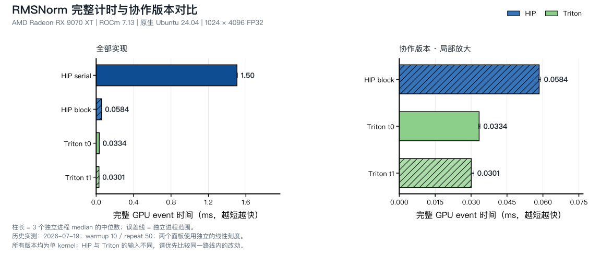

<script setup>
import RmsnormJourney from './rmsnorm-journey.vue'
import RmsnormExecution from './rmsnorm-execution.vue'
</script>

# 第13章 综合实战：Fused RMSNorm

## 本章导读

给一行数据乘上同一个缩放系数，是第 8 章的逐元素计算。如果这个系数必须先从整行数据算出来，事情就多了一层依赖：先归约，再把结果用于每一个位置。

RMSNorm 正好把这两件事连在一起。我们用它结束这一篇：从公式辨认已经学过的模式，用短代码表达分工，再检查测量究竟支持什么。两条语言路线共用算法解释；需要复习语法时，可以打开[附录 D](../../appendix/programming-models/index.md)。

## 13.1 先为一行数据算出尺度

RMS 是 root mean square，即“均方根”：先平方，再求平均，最后开平方。对一行 $N$ 个输入 $x$ 和同长度权重 $w$，本章计算：

$$
r=\frac{1}{\sqrt{\frac1N\sum_{j=0}^{N-1}x_j^2+\epsilon}},\qquad y_i=x_i\,r\,w_i.
$$

$r$ 是均方根的倒数，整行共用；$w_i$ 是每列各自的权重。正数 $\epsilon$ 加在开平方之前，让全零输入也有有效分母。本章实验默认使用 `1e-5`。

先看 `x=[3,4]、w=[1,1]`。平方和为 25，平方均值为 12.5，因此 $r=1/\sqrt{12.5+10^{-5}}\approx0.2828$，输出约为 `[0.8485,1.1314]`。这两个输出虽然最终各自相乘，却都依赖两个输入的平方和。

@fig-rmsnorm-flow 把例子扩成四列，并让权重也发生变化。先停在“归约”，自己算出两项部分和，再前进到“输出”核对。

::: figure fig-rmsnorm-flow
<RmsnormJourney />

用 `[3,4,-3,-4]`、权重 `[1,0.5,2,1]` 和 `epsilon=1e-5` 展示平方、归约、广播和加权。数值为公式计算，动画速度不是 GPU 时间。
:::

这里没有先减去输入均值。与 LayerNorm 相比，RMSNorm 省略了“减均值”这一步，仍保留基于均方根的缩放与学习权重。无需先学会 LayerNorm 的全部实现，沿着本章公式即可完成 kernel。

## 13.2 找到归约与融合的边界

把公式拆开，会得到四个已见过的操作：

| 阶段 | 数据依赖 | 已学过的模式 |
| --- | --- | --- |
| $x_i^2$ | 只依赖当前位置 | 逐元素 |
| $\sum x_i^2$ | 依赖整行 | 归约 |
| 计算 $r$ | 依赖平方和与有效列数 | 标量计算 |
| $x_i r w_i$ | 依赖原输入、行尺度和权重 | 广播后的逐元素 |

如果把平方先存成全局数组，再启动归约和输出 kernel，会留下中间读写。也可以在同一个 kernel 中完成：把局部平方和交给 block/program 归约，得到尺度后直接写输出。这里的融合指的是这一段数据流不再物化平方数组与行统计数组。

**本章实际比较的 serial、block 和 Triton 都已经是单个 kernel。** serial 与 block 的计时差主要用于观察行内协作；它不是“多次启动变成一次启动”的测量。要量化融合本身的收益，需要另外实现和校验真正的分步基线。

另外，融合不等于“x 只读一次”。HIP 源码先为平方和读取 x，之后为输出再次读取 x。Triton 在源码中保留 `values` 并复用，但物理寄存器分配、缓存和可能的 spill 仍需另行观察，不能凭变量只出现一次就宣布显存流量减半。

## 13.3 选择 HIP 或 Triton 实现

<ImplementationTabs id="ch13-implementations">

<template #hip>

### HIP：一个线程顺序处理一行 {#ch13-hip}

完整源码在 [rmsnorm_hip.hip](https://github.com/datawhalechina/hello-gpu/blob/dev/code/part2-kernels/chapter13/rmsnorm_hip.hip)。先读 `serial`，它与公式的顺序完全一致：

```cpp
__global__ void rmsnorm_serial_kernel(const float* input, const float* weight,
                                      float* output, int rows, int cols,
                                      float epsilon) {
    int row = blockIdx.x * blockDim.x + threadIdx.x;
    if (row >= rows) return;
    float square_sum = 0.0f;
    for (int col = 0; col < cols; ++col) {
        float value = input[row * cols + col];
        square_sum += value * value;
    }
    float inverse_rms = rsqrtf(square_sum / cols + epsilon);
    for (int col = 0; col < cols; ++col) {
        output[row * cols + col] =
            input[row * cols + col] * inverse_rms * weight[col];
    }
}
```

这里 `row` 由全局线程编号得到。一个线程先遍历全部列求平方和，再遍历一遍写结果。不同的行可以同时算，但同一行的累加仍按顺序进行。`rsqrtf` 表示平方根的倒数，对应公式中的 $r$。

### HIP：一个 block 合作处理一行

接下来只改变行内分工。`blockIdx.x` 直接选择行，线程 `tid` 处理 `tid、tid+blockDim.x、…` 这些列，先在自己的寄存器中累加，再把部分和放入 LDS：

```cpp
__global__ void rmsnorm_block_kernel(const float* input, const float* weight,
                                     float* output, int rows, int cols,
                                     float epsilon) {
    extern __shared__ float shared[];
    int row = blockIdx.x;
    int tid = threadIdx.x;
    float square_sum = 0.0f;
    for (int col = tid; col < cols; col += blockDim.x) {
        float value = input[row * cols + col];
        square_sum += value * value;
    }
    shared[tid] = square_sum;
    __syncthreads();
    for (int stride = blockDim.x / 2; stride > 0; stride >>= 1) {
        if (tid < stride) shared[tid] += shared[tid + stride];
        __syncthreads();
    }
    float inverse_rms = rsqrtf(shared[0] / cols + epsilon);
    for (int col = tid; col < cols; col += blockDim.x) {
        output[row * cols + col] =
            input[row * cols + col] * inverse_rms * weight[col];
    }
}
```

这段代码只有三处需要特别留意。第一，某个线程没有有效列时，`square_sum` 仍为 0，可以正常参与归约。第二，LDS 写入和每一轮树归约之后都要同步；不能因为某个线程本轮不做加法，就让它跳过屏障。第三，平均值除以 `cols`，不是线程数 `blockDim.x`。

所有线程读取最终 `shared[0]` 后，这一块 LDS 不再被覆盖，因此不需要像第 10 章那样为下一次复用补读后写屏障。判断屏障要看数据的下一次使用，不能机械照搬固定数量。

::: figure fig-rmsnorm-serial-vs-block
<RmsnormExecution scenario="serial-vs-block" />

两个 HIP 版本的同输入对照：左侧 serial 一线程一行，平方和是一条按列顺序的长链；右侧 block 四线程（真实 block=256）各自累加局部平方和，经 LDS 树归约与广播写出同一结果。图为 x=[3,4,-3,-4]、w=[1,0.5,2,1] 的教学缩略，结尾给出 9070 XT 实测。
:::

如 @fig-rmsnorm-serial-vs-block 所示，serial 与 block 的差别只在同一行内的协作方式：前者把平方和排成一条长链，后者用树把链深压到 `log₂block`。这正是 13.5 节 25.8 倍时间差的来源。


### HIP：从两个版本的同输入对照开始

本章 `run_all.sh` 会编译并运行两个版本。选做参数实验时，先保持输入、权重和列数不变，只调整一个 block 配置，再检查时间与正确性。当前树形归约要求 block 大小为二次幂，CLI 已检查这个限制。

</template>

<template #triton>

### Triton：把一行表示为一组 offsets {#ch13-triton}

完整源码在 [rmsnorm_triton.py](https://github.com/datawhalechina/hello-gpu/blob/dev/code/part2-kernels/chapter13/rmsnorm_triton.py)。每个 program 读取一行，进行一次平方和归约，然后把标量尺度广播到所有有效位置：

```python
@triton.jit
def rmsnorm_kernel(
    input_ptr,
    weight_ptr,
    output_ptr,
    cols,
    epsilon,
    BLOCK_SIZE: tl.constexpr,
):
    row = tl.program_id(0)
    offsets = tl.arange(0, BLOCK_SIZE)
    mask = offsets < cols
    values = tl.load(input_ptr + row * cols + offsets, mask=mask, other=0.0)
    mean_square = tl.sum(values * values, axis=0) / cols
    inverse_rms = tl.rsqrt(mean_square + epsilon)
    weights = tl.load(weight_ptr + offsets, mask=mask, other=0.0)
    tl.store(
        output_ptr + row * cols + offsets,
        values * inverse_rms * weights,
        mask=mask,
    )
```

`tl.sum(values * values, axis=0)` 把列方向收成一个平方和。`inverse_rms` 是标量，和向量 `values`、`weights` 相乘时会用于每个位置；这就是动画中的广播，不必手写循环把尺度复制成数组。

`weight_ptr + offsets` 没有 `row * cols`，因为所有行共用同一组列权重。若误把权重当成 `[rows,cols]` 数组读取，即使输入下标正确，结果也会出错。

### Triton：为什么 mask 不能改变分母

Host 将 `BLOCK_SIZE` 设为 `triton.next_power_of_2(cols)`。例如有效列数 13 会用 16 个逻辑位置表示，最后 3 项加载为 0，对平方和没有贡献。但求均值仍要除以 13；除以 16 会改变整个输出尺度。

本章 `t0/t1` 使用相同 kernel，分别设置 `num_warps=4/8`。它改变执行配置，没有改变数据的数学含义。`BLOCK_SIZE` 与 `num_warps` 也不是同一个参数：前者决定本 program 表达多少位置，后者参与编译器如何安排执行。

```bash
python rmsnorm_triton.py --version all --rows 1024 --cols 4096
```

上面的命令在本章目录执行。当前教学入口限制 `cols <= 65536`，这是程序的支持范围，不能理解为范围内所有列数都已有性能验证。

</template>

</ImplementationTabs>

## 13.4 用边界输入检验公式与下标

当前输入、权重、输出均为 FP32。HIP 的 CPU reference 用 double 累加平方和，再转回 FP32 计算尺度；Triton 与 PyTorch 表达式比较。两边当前最大绝对误差阈值都是 `2e-5`，计时前后均检查完整输出。

两条路线的输入生成不同：HIP 使用均匀分布，Triton 使用正态分布。相同 seed 不代表相同数组，跨语言表格也不应被解读为完全同输入的语言比较。HIP 的误差循环还未单独拒绝 NaN；扩展到极大值或低精度之前，应先补上有限值检查，并重新定义适当的误差标准。

| 形状或输入 | 能检查什么 | 当前状态 |
| --- | --- | --- |
| `3×13` | 列数不为二次幂，mask 与有效分母 | 一键脚本中的边界 |
| `33×257` | 跨过 256 列，最后一轮只剩一列 | 历史实验记录中的边界 |
| `1024×4096` | 多行、长行的主实验 | 已有三进程记录 |
| 单元素、全零、正负混合与极大值 | 尺度、epsilon 和有限值检查 | 建议新增的数值覆盖，不冒充已有测量 |

公式也能提供一些不依赖 benchmark 的检查。全零输入应得到全零输出；把所有 $w_i$ 设为 0，输出也应全为 0。若 $\epsilon$ 不为 0，将 x 放大两倍并不会让归一化结果严格不变，可以把公式代入后自己验证。

## 13.5 从实测看行内协作

下面保留 2026-07-19 的历史实验：**RX 9070 XT + 原生 Ubuntu 24.04 + ROCm 7.13**，FP32、`1024×4096`、`epsilon=1e-5`。每个进程预热 10 次、正式计时 50 次，共 3 个独立进程；表中为各进程 median 的中位数。GPU event 包围本次 RMSNorm kernel，不含分配、输入生成、参考计算和数据拷贝。

| 实现 | median ms | 三进程 median 范围 ms |
| --- | ---: | ---: |
| HIP serial | 1.504860 | 1.501600–1.510040 |
| HIP block | 0.058440 | 0.058041–0.0590205 |
| Triton t0 · 4 warps | 0.033360 | 0.033100–0.033740 |
| Triton t1 · 8 warps | 0.030081 | 0.030041–0.031160 |

::: figure fig-rmsnorm-performance


历史 evidence 的三进程中位数与范围。两个面板使用各自的线性时间刻度，不能跨面板比较柱长。
:::

在相同 HIP 输入下，block 版约为 serial 版的 $25.8$ 倍速度。这个差距支持“让线程合作处理长行”在本次配置下有效。它不证明所有列数都应该用 256 线程：对极短的行，同步和空闲线程所占的比例会改变。

Triton 的 8-warps 配置在本次形状下更快，但表格没有告诉我们原因。不要把它写成“更多 warps 总是更好”，也不要把尚未测过的 scratch 增长作为既定解释。更换列数后，应重新采集数据。

## 13.6 运行后，先筛选目标 kernel

在已经配置好的 Part 2 环境执行：

```bash
cd code/part2-kernels
source ./activate-rocm.sh
bash chapter13/run_all.sh
```

脚本先跑 `3×13`，再跑主形状，并打印每个实现的 `RESULT`。这是一轮复跑；正文三进程结果的采集参数和来源另见[实验记录](https://github.com/datawhalechina/hello-gpu/blob/dev/code/part2-kernels/chapter13/EXPERIMENT.md)。需要采集 trace 时使用独立 `profile_all.sh`，源码身份由本地 Git 维护机记录并传给实验机。

本章历史 `profile_summary.csv` 的 `kernel_names` 同时包含目标 kernel、拷贝以及 PyTorch 参考计算。表中的 `trace_dispatches=7/24` 是整份 trace 的记录数，不能说一次 RMSNorm 需要启动 7 次或 24 次 kernel。

回到原始 trace 后，先筛选 `rmsnorm_serial_kernel`、`rmsnorm_block_kernel` 或 `rmsnorm_kernel`，再研究目标记录的资源字段。汇总中的 `unavailable` 是信息不足，不能填成 0；也不能用混合了多个 kernel 的资源汇总解释 t0/t1 的差异。

## 13.7 把这一章变成自己的实验

1. 对动画输入手算平方和与第三个输出。只把 `w[2]` 从 2 改成 1，行尺度会变吗？提示：权重不参与平方和。
2. 设 `cols=13`，预测把均值分母误写成 16 后，输出绝对值会变大还是变小，再用公式说明原因。
3. 从 HIP block 版开始，只改变 block 大小。记录输入、误差、三进程时间与实际参与归约的线程数；不要同时加入向量化。
4. 选做：为 HIP 增加 wavefront shuffle 收尾。先写清哪些线程持有部分和、跨 wavefront 何时需要 LDS，再实现和复测。
5. 选做：实现真正的分步平方、归约和输出基线，比较完整路径的时间与中间数组容量。不要把当前 serial 版标成“未融合”。

实验记录可以只用一小段话开始：“在某个形状下，我预计什么成本较大；本轮只改了什么；校验怎样；时间如何变化；还缺什么证据。”逐渐补全源码身份、环境和原始结果，就能让另一位读者复跑。

遇到新算子时，同样先画出输入到输出的依赖，圈出逐元素、归约和复用的部分。写出一个便于检查的实现，再选择下一项实验。某个配置变慢，也是一次有用的观察。

## 本章小结

RMSNorm 先把整行输入归约成一个尺度，再将它广播回各位置。HIP 显式组织线程、LDS 和同步；Triton 用向量与 `tl.sum` 表达同一依赖。二者的当前实现都已经融合了主要数学步骤，实验展示的是行内协作和执行配置的差异。

到这里，逐元素、归约、归一化、矩阵复用和融合已经可以放在同一张数据流图上理解。后续优化仍从具体输入出发，用参考答案确认正确，再用完整计时检验每一次改动。

## 延伸阅读

- [RMSNorm 原论文](https://arxiv.org/abs/1910.07467)：理解为何去掉减均值，仍保留均方根缩放。
- [Triton Layer Normalization 教程](https://triton-lang.org/main/getting-started/tutorials/05-layer-norm.html)：进一步阅读行级 program 与资源约束。
