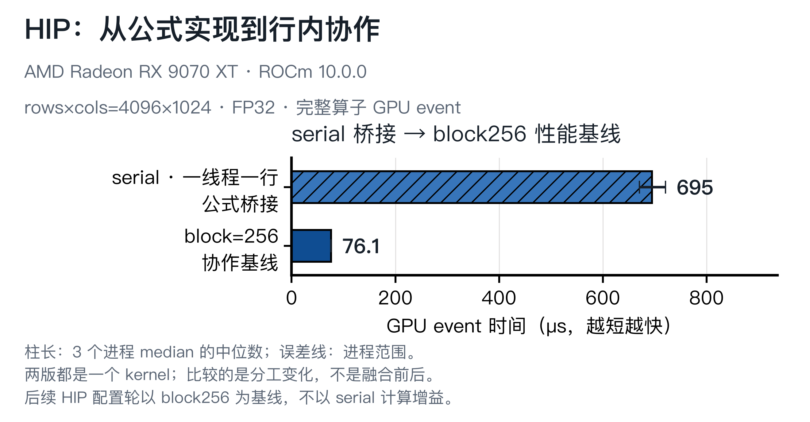
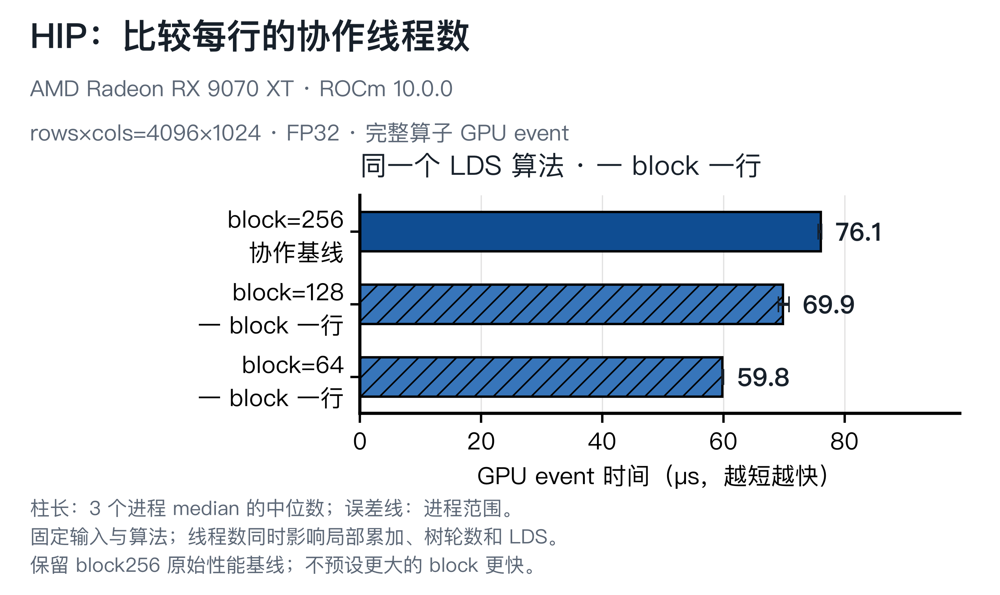
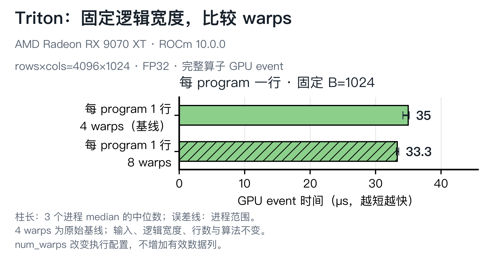
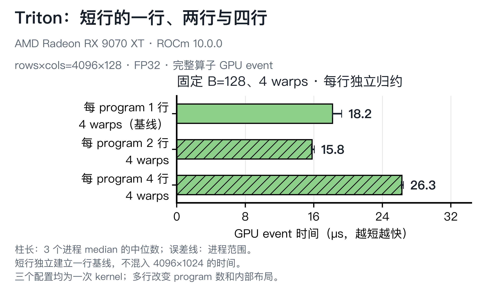
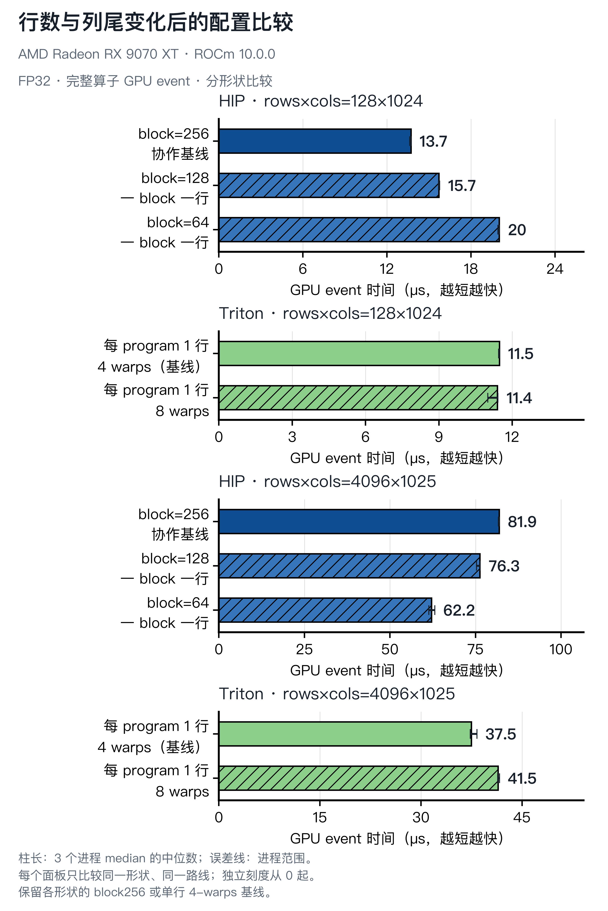
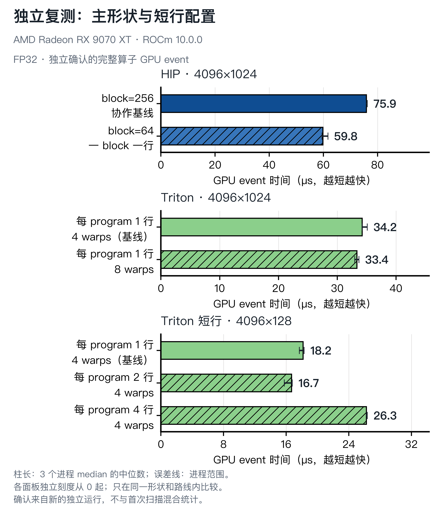

<script setup>
import RmsnormJourney from './rmsnorm-journey.vue'
import RmsnormExecution from './rmsnorm-execution.vue'
</script>

# 第13章 综合实战：Fused RMSNorm

## 本章导读

给一行数据乘上同一个系数，是第 8 章的逐元素计算。如果这个系数必须先从整行数据算出来，就多了一层依赖：先归约，再把结果用于每一个位置。

RMSNorm 把这两件事连在一起。本章用它综合前面的方法：先确定数据依赖和正确答案，再建立性能基线，提出一个能用实验回答的问题。HIP 比较同一行分给多少个线程；Triton 先比较 warps，再针对短行检查一个 program 能否处理多行。

| 路线 | 本章要回答的问题 |
| --- | --- |
| [共同语义](#rmsnorm-semantics) | 一行的统计量怎样影响每个输出，权重在哪里参与计算？ |
| [HIP](#ch13-hip) | block=256 建立协作基线后，64 或 128 个线程是否更合适？ |
| [Triton](#ch13-triton) | 4/8 warps 怎样比较；短行时，把 2/4 行交给同一个 program 是否值得？ |

代码位于 `code/part2-kernels/chapter13/`。本章环境为 **Radeon RX 9070 XT（gfx1201）+ ROCm SDK 10.0 + 原生 Ubuntu 24.04**，主形状为 `4096×1024`。短行实验采用 `4096×128`，单独建立同形状基线。

<span id="_13-1-先为一行数据算出尺度"></span>

## 13.1 行统计量与逐列权重 {#rmsnorm-semantics}

先看一行 `x=[3,4]`、权重 `w=[1,1]`。平方和为 25，除以列数 2 得到 12.5，再加上一个小正数 `epsilon=1e-5`。平方根的倒数约为 0.2828，两个输入都乘这个系数，输出约为 `[0.8485,1.1314]`。

这就是 RMSNorm 的主要计算。RMS 是 root mean square，即“均方根”；我们把均方根的倒数记为 $r$。对一行 $N$ 列的数据：

$$
r=\frac{1}{\sqrt{\frac1N\sum_{j=0}^{N-1}x_j^2+\epsilon}},
\qquad y_i=x_i\,r\,w_i.
$$

$r$ 由整行输入共同决定，所有列使用同一个值；$w_i$ 则是每列自己的权重。正数 $\epsilon$ 加在开平方之前，让全零输入也有有效分母。这里不先减去输入均值。

@fig-rmsnorm-flow 将例子扩成四列，权重也不再全为 1。先看平方和怎样确定整行尺度，再停在“输出”核对每列自己的权重。

::: figure fig-rmsnorm-flow
<RmsnormJourney />

输入 [3,4,−3,−4]，权重 [1,0.5,2,1]，epsilon=1e−5。动画展示公式数值，播放速度不代表 GPU 时间。
:::

平方和为 `9+16+9+16=50`，平方均值仍为 12.5。输出约为 `[0.8485,0.5657,−1.6971,−1.1314]`。第三列（下标2）的权重为2，放大了该列输出，但没有改变行统计量 $r$。

推广到多行时，每行独立求 $r$，所有行共享长度为 `cols` 的权重向量。输入与输出是 `[rows,cols]`，权重是 `[cols]`，不能把权重也按二维矩阵寻址。

<span id="_13-2-找到归约与融合的边界"></span>

## 13.2 归约依赖与融合范围 {#rmsnorm-dataflow}

把公式沿数据依赖展开，可以找到四种已经学过的操作：

| 阶段 | 依赖什么 | 本篇对应的方法 |
| --- | --- | --- |
| 平方 $x_i^2$ | 当前输入 | 逐元素计算 |
| 平方和 $\sum x_i^2$ | 当前行的全部列 | 局部累加与归约 |
| 行尺度 $r$ | 平方和、有效列数和 epsilon | 标量计算 |
| 输出 $x_i r w_i$ | 当前输入、行尺度、对应权重 | 广播后的逐元素计算 |

平方和算出来以后，同一行的所有输出才能使用最终的 $r$。不过，中间的平方数组和行统计数组不必写成全局数组，可以在一个 kernel 中完成整段计算。

**本章的 HIP serial、HIP block 和 Triton 版本都已经融合为一个 kernel。** serial 用于把公式翻译成程序，block 和 Triton 用于建立各自的性能基线。后面比较的是分工与执行配置，不能把它们之间的时间差解释成“多个 kernel 融合为一个”的收益。

融合也不表示输入只读一次。HIP 先读取 x 求平方和，输出时再读取 x；Triton 在源码中保留 `values` 供输出使用。实际流量与寄存器使用仍要看编译和采集结果。

## 13.3 正确性参考与计时范围 {#rmsnorm-contract}

两条路线使用相同的确定性输入和权重。普通输入含有正负值，权重也有正有负；同一 seed 在 HIP 和 Python 中产生相同数组。

| 项目 | 本章约定 |
| --- | --- |
| 数据类型 | 输入、权重和输出均为 FP32 |
| 正确性参考 | CPU FP64 完成平方和、尺度和乘权重，最后转为 FP32 |
| 验收条件 | 全部输出有限，且逐元素满足 `abs(actual-ref) <= 2e-5 + 2e-5 * abs(ref)` |
| epsilon | 默认 `1e-5`，实际 FP32 值是 `9.999999747378752e-06`；两条路线按这个值计算参考 |
| 主 seed | `20260920` |
| HIP 性能基线 | 一 block 一行，block=256 |
| Triton 性能基线 | 一 program 一行，`B=next_power_of_2(cols)`，4 warps |
| 计时范围 | X、weight 已在 GPU 上，到完整 Y 写回 GPU；不含分配、主机拷贝、参考计算或校验 |

输出在预检前填为 NaN，确认 kernel 写出全部结果；预检通过才计时，最后再次检查完整输出。NaN、无穷值会先被拒绝，不会因为最大误差更新方式而漏过。参考结果来自 CPU，不是另一条 GPU 性能路线。

两条路线预先创建 event。每个样本按“起点 event → 一次 kernel → 终点 event”计时，等待该终点完成后再开始下一轮。Profiler 单独运行，不把采集时的耗时纳入主图。

每配置运行三个独立进程，每进程预热10次、采样50次，配置顺序轮换。主形状六项、短行三项、两组附形状各五项，共 **19个配置/形状组合、57个进程、2850个样本**。主输入和短行候选随后分别独立确认，合计21个进程、1050个样本。

每个进程先取自己的中位数，再汇总这些进程中位数；图中范围线表示它们的最小值和最大值，不是置信区间。不同 shape 的图分别建立基线，不跨图比较柱子的长度。

<span id="_13-3-选择-hip-或-triton-实现"></span>

## 13.4 HIP 与 Triton 优化路线 {#rmsnorm-implementation}

**环境与结果目录。** 以下命令在 GPU 机器的仓库根目录开始执行，后续保持在 `code/part2-kernels/`。沿用本篇 `uv.lock`，不要删除锁文件：

```bash
cd code/part2-kernels &&
uv sync --locked &&
source ./activate-rocm.sh
```

为本章新建一个独立结果目录，保存打印出来的路径：

```bash
mkdir -p chapter13/results &&
RUN=$(mktemp -d chapter13/results/walkthrough-XXXXXX) &&
mkdir "$RUN/build" &&
printf '本轮结果目录：%s\n' "$RUN"
```

换终端后，重新执行环境准备，再恢复之前打印的目录；提示处只粘贴路径，不含 `RUN=`：

```bash
read -r -p '粘贴上次输出的结果目录：' RUN &&
test -n "$RUN" && test -d "$RUN/build" &&
printf '继续使用结果目录：%s\n' "$RUN"
```

需要重测或改动源码时，新建 `RUN`，重新编译 HIP；恢复旧目录只用于继续未修改的实验。后续命令会拒绝写入已有样本。

每条命令先校验，再完成一个进程的 10 次预热与 50 次计时；折叠输出对应第 1 个进程。**图使用三个独立进程的统计，不是一次终端输出。** 手工复测时同时把样本名 `p1` 与 `--process 1` 改为 `p2`/`2`、`p3`/`3`，每遍覆盖同组候选并轮换起始项。[章末批量入口](#rmsnorm-rerun)会自动完成这一步、汇总并画本轮图，不要求先运行 profiler。

若保护命令发现同名样本已存在，这一次不会运行或覆盖它；需要重测时新建结果目录。先看正确性和完整时间，只有当结果留下具体疑问时再采集 trace。

<ImplementationTabs id="ch13-implementations">

<template #hip>

### 13.4.1 HIP：从公式到行内协作 {#ch13-hip}

<a id="ch13-hip-source"></a>

<details>
<summary>完整源码：code/part2-kernels/chapter13/rmsnorm_hip.hip</summary>

<<< @/../code/part2-kernels/chapter13/rmsnorm_hip.hip{cpp}

</details>

这份文件包含本路线的输入准备、kernel、启动、校验与计时；后续配置共用它，按函数和运行参数定位改动。

先编译一次。未修改源码时可复用本轮可执行文件；修改源码后请新建结果目录再编译：

```bash
test -d "${RUN:?请先准备本章环境与结果目录}/build" && \
if [[ ! -x "$RUN/build/rmsnorm_hip" ]]; then
  hipcc --offload-arch=gfx1201 -O3 -std=c++17 \
    chapter13/rmsnorm_hip.hip -o "$RUN/build/rmsnorm_hip"
fi
```

先读 `serial`：一个线程处理一行，先沿列顺序求平方和，再沿列写输出。它的核心与公式一一对应：

```cpp
float square_sum = 0.0f;
for (int col = 0; col < cols; ++col) {
    const float value = input[base + col];
    square_sum += value * value;
}
const float inverse_rms = rsqrtf(square_sum / cols + epsilon);
for (int col = 0; col < cols; ++col)
    output[base + col] = input[base + col] * inverse_rms * weight[col];
```

先运行公式版本，确认完整输出符合参考。主形状显式指定为 `4096×1024`：

<!-- benchmark:hip-serial-b256:4096x1024 -->

```bash
test -d "${RUN:?请先准备本章环境与结果目录}/build" && \
test ! -e "$RUN/n4096x1024-hip-serial-b256-p1.csv" && \
"$RUN/build/rmsnorm_hip" \
  --block 256 --version serial --rows 4096 \
  --cols 1024 --warmup 10 --repeat 50 \
  --seed 20260920 --epsilon 9.999999747378752e-06 --input normal \
  --config-id hip-serial-b256 --samples "$RUN/n4096x1024-hip-serial-b256-p1.csv" --process 1
```

<details>
<summary>真实输出：hip-serial-b256，shape=4096x1024，第 1 个独立进程</summary>

<<< @/../code/part2-kernels/chapter13/evidence/walkthrough/logs/n4096x1024-hip-serial-b256-p1.log{text}

</details>

`correct=OK` 表示预检和计时后检查通过，`median_ms` 是本进程的中位数。这里 `base=row*cols`，不同的行可以并行；同一行的平方和仍是一条顺序累加链。为了让一行也能协作，把 `blockIdx.x` 对应到行，线程 `tid` 处理 `tid、tid+blockDim.x、…` 这些列。

::: figure fig-rmsnorm-serial-vs-block
<RmsnormExecution scenario="serial-vs-block" />

点选三个阶段，对照同一行的依赖与写回：serial 保留顺序累加链；block 通过 LDS 归约后，各线程读取平方和、各自求尺度。四个位置是教学缩略，主实验为 block=256。
:::

@fig-rmsnorm-serial-vs-block 中，各线程先把局部平方和放进 LDS，再合并成整行平方和：

```cpp
float square_sum = 0.0f;
for (int col = tid; col < cols; col += blockDim.x) {
    const float value = input[base + col];
    square_sum += value * value;
}
shared[tid] = square_sum;
__syncthreads();
for (int stride = blockDim.x / 2; stride > 0; stride >>= 1) {
    if (tid < stride) shared[tid] += shared[tid + stride];
    __syncthreads();
}
```

没有有效列的线程让局部和保持 0，照常参加屏障。每轮不做加法的线程也不能跳过屏障。最终 `shared[0]` 给出整行平方和，仍除以有效列数 `cols`，然后线程按原分工写输出。

这里读取 `shared[0]` 后，不再覆盖这块 LDS。与第 10 章复用同一片共享空间的情况不同，不需要为了后续覆盖再加一道读后屏障。

同一份源码选择 `--version block --block 256`，检查行内协作是否缩短完整时间：

<!-- benchmark:hip-block-b256:4096x1024 -->

```bash
test -d "${RUN:?请先准备本章环境与结果目录}/build" && \
test ! -e "$RUN/n4096x1024-hip-block-b256-p1.csv" && \
"$RUN/build/rmsnorm_hip" \
  --block 256 --version block --rows 4096 \
  --cols 1024 --warmup 10 --repeat 50 \
  --seed 20260920 --epsilon 9.999999747378752e-06 --input normal \
  --config-id hip-block-b256 --samples "$RUN/n4096x1024-hip-block-b256-p1.csv" --process 1
```

<details>
<summary>真实输出：hip-block-b256，shape=4096x1024，第 1 个独立进程</summary>

<<< @/../code/part2-kernels/chapter13/evidence/walkthrough/logs/n4096x1024-hip-block-b256-p1.log{text}

</details>

::: figure fig-rmsnorm-round-cooperative


公式实现到协作实现的桥接。两者都是单个 kernel；后续 HIP 配置实验以 block256 为性能基线。
:::

公式版本为 **694.605 μs（670.684–720.645）**，block256 为 **76.080 μs（75.661–76.201）**。行内协作的整体改动显著缩短了完整时间；它同时改变了访存分工、归约组织和可调度的工作，不能把比值全部归给树的深度。

启动代码让每个 block 负责一行，主形状因此安排 4096 个 block，每组 256 线程。接下来保持这项映射，研究 256 线程是否适合 1024 列的工作。后续图都以 block256 为 HIP 性能基线。

### 13.4.2 HIP：block 大小与局部工作量

有了 block=256 的协作基线，下一问是：每行 1024 列，需要这么多线程吗？线程少一些，每个线程会多算几项，但树归约更短、LDS 需求也更少。

本轮保持同一个 kernel、相同输入和归约算法，只比较 block=64、128、256：

| block | 主形状每线程累加的列数 | LDS 字节数 | 树归约轮数 |
| --- | ---: | ---: | ---: |
| 64 | 16 | 256 | 6 |
| 128 | 8 | 512 | 7 |
| 256 | 4 | 1024 | 8 |

这些是源码可计算的工作量。线程数变化也会改变 wave 数与执行安排，因此不能把时间差只归给少了一轮屏障。先提出局部工作量与协作成本的取舍，再看完整时间。

block256 的记录已经得到，继续运行同一 kernel 的两个候选；不必为这一轮重复运行原基线：

<!-- benchmark:hip-block-b128:4096x1024 -->

```bash
test -d "${RUN:?请先准备本章环境与结果目录}/build" && \
test ! -e "$RUN/n4096x1024-hip-block-b128-p1.csv" && \
"$RUN/build/rmsnorm_hip" \
  --block 128 --version block --rows 4096 \
  --cols 1024 --warmup 10 --repeat 50 \
  --seed 20260920 --epsilon 9.999999747378752e-06 --input normal \
  --config-id hip-block-b128 --samples "$RUN/n4096x1024-hip-block-b128-p1.csv" --process 1
```

<details>
<summary>真实输出：hip-block-b128，shape=4096x1024，第 1 个独立进程</summary>

<<< @/../code/part2-kernels/chapter13/evidence/walkthrough/logs/n4096x1024-hip-block-b128-p1.log{text}

</details>

<!-- benchmark:hip-block-b64:4096x1024 -->

```bash
test -d "${RUN:?请先准备本章环境与结果目录}/build" && \
test ! -e "$RUN/n4096x1024-hip-block-b64-p1.csv" && \
"$RUN/build/rmsnorm_hip" \
  --block 64 --version block --rows 4096 \
  --cols 1024 --warmup 10 --repeat 50 \
  --seed 20260920 --epsilon 9.999999747378752e-06 --input normal \
  --config-id hip-block-b64 --samples "$RUN/n4096x1024-hip-block-b64-p1.csv" --process 1
```

<details>
<summary>真实输出：hip-block-b64，shape=4096x1024，第 1 个独立进程</summary>

<<< @/../code/part2-kernels/chapter13/evidence/walkthrough/logs/n4096x1024-hip-block-b64-p1.log{text}

</details>

::: figure fig-rmsnorm-round-block


HIP 配置实验：block256 是原始性能基线，64 和 128 是当前候选。所有版本仍是一 block 一行。
:::

block256、128、64 的完整时间分别是 **76.080、69.860、59.820 μs**。64线程相对路线基线约快 **1.27倍**；独立确认中，256为 **75.920 μs（75.860–76.201）**，64为 **59.841 μs（59.521–61.681）**，两组范围分离。因此主形状采用 block64。

随后减少行数，或把列数改成不能整除 block 的值，检查选择是否仍然合适。性能上的优选配置需要范围，不能从一次主形状比较推成通用线程数。

</template>

<template #triton>

### 13.4.3 Triton：一 program 一行的基线 {#ch13-triton}

<a id="ch13-triton-source"></a>

<details>
<summary>完整源码：code/part2-kernels/chapter13/rmsnorm_triton.py</summary>

<<< @/../code/part2-kernels/chapter13/rmsnorm_triton.py{python}

</details>

这份文件包含本路线的输入准备、kernel、启动、校验与计时；后续配置共用它，按函数和运行参数定位改动。

自然基线让一个 program 表达一整行。`B=next_power_of_2(cols)`，用 B 个逻辑位置覆盖有效列，4 warps 为初始执行配置：

```python
row = tl.program_id(0).to(tl.int64)
offsets = tl.arange(0, BLOCK_SIZE)
mask = offsets < cols
values = tl.load(input_ptr + row * cols + offsets, mask=mask, other=0.0)
mean_square = tl.sum(values * values, axis=0) / cols
inverse_rms = tl.rsqrt(mean_square + epsilon)
weights = tl.load(weight_ptr + offsets, mask=mask, other=0.0)
tl.store(output_ptr + row * cols + offsets,
         values * inverse_rms * weights, mask=mask)
```

`tl.sum(..., axis=0)` 沿列求一个平方和，标量 `inverse_rms` 再用于整行输出，这就是广播。权重地址只有列偏移，没有 `row*cols`，因为所有行共用同一组权重。

主形状 `cols=1024` 时，B 就是 1024；若 `cols=1025`，B 变为 2048，剩下的逻辑位置加载为 0。平方均值始终除以有效列数 1025，不按 B 或 warps 数求平均。

选择单行、4 warps 的配置，先建立本路线基线：

<!-- benchmark:triton-r1-w4:4096x1024 -->

```bash
test -d "${RUN:?请先准备本章环境与结果目录}/build" && \
test ! -e "$RUN/n4096x1024-triton-r1-w4-p1.csv" && \
python chapter13/rmsnorm_triton.py \
  --rows-per-program 1 --num-warps 4 --version configured \
  --rows 4096 --cols 1024 --warmup 10 \
  --repeat 50 --seed 20260920 --epsilon 9.999999747378752e-06 \
  --input normal --config-id triton-r1-w4 --samples "$RUN/n4096x1024-triton-r1-w4-p1.csv" \
  --process 1
```

<details>
<summary>真实输出：triton-r1-w4，shape=4096x1024，第 1 个独立进程</summary>

<<< @/../code/part2-kernels/chapter13/evidence/walkthrough/logs/n4096x1024-triton-r1-w4-p1.log{text}

</details>

基线完整时间为 **34.980 μs（34.180–35.120）**，预检与计时后检查均通过。启动代码安排 4096 个 program，各自完成一行。B=1024 描述逻辑数据宽度，不能与线程数画等号。

这一轮不再拆分公式：一个program已经完成整行归约和输出。下一步检查同一逻辑块换一种执行配置是否有收益。

### 13.4.4 Triton 第一轮：固定逻辑宽度比较 warps

保持一 program 一行、B=1024，只把 warps 从 4 改为 8。同样一组逻辑数据会采用不同执行配置，但 B 不变，也没有新增有效列。

候选假设是更多执行资源可能改变行内归约与逐元素计算的安排；代价也可能随之增加。我们先测量，不能因为数值更大就认定更快。

保留刚才的 4-warps 记录，再运行 8-warps 候选：

<!-- benchmark:triton-r1-w8:4096x1024 -->

```bash
test -d "${RUN:?请先准备本章环境与结果目录}/build" && \
test ! -e "$RUN/n4096x1024-triton-r1-w8-p1.csv" && \
python chapter13/rmsnorm_triton.py \
  --rows-per-program 1 --num-warps 8 --version configured \
  --rows 4096 --cols 1024 --warmup 10 \
  --repeat 50 --seed 20260920 --epsilon 9.999999747378752e-06 \
  --input normal --config-id triton-r1-w8 --samples "$RUN/n4096x1024-triton-r1-w8-p1.csv" \
  --process 1
```

<details>
<summary>真实输出：triton-r1-w8，shape=4096x1024，第 1 个独立进程</summary>

<<< @/../code/part2-kernels/chapter13/evidence/walkthrough/logs/n4096x1024-triton-r1-w8-p1.log{text}

</details>

::: figure fig-rmsnorm-round-warps


第一轮：固定逻辑宽度和每个 program 的工作范围，比较 4/8 warps。
:::

8 warps 为 **33.321 μs（33.160–33.540）**，略低于4 warps的34.980 μs。独立确认中，两者分别为 **33.360 μs（32.980–33.681）** 与 **34.240 μs（34.201–35.100）**，这次范围也分离。本章对主形状采用8 warps，但不会把它直接带到所有行长。

### 13.4.5 Triton 第二轮：短行的多行 program

接下来把输入换成 **4096×128**，重新建立一 program 一行、B=128、4 warps 的短行基线。每行只有 128 个有效列，但仍有 4096 行需要处理。一个 program 能否负责多行，让执行配置与这份工作更合适？

先运行短行的 R=1 基线，它与前面 1024 列的实验是两组不同输入：

<!-- benchmark:triton-r1-w4:4096x128 -->

```bash
test -d "${RUN:?请先准备本章环境与结果目录}/build" && \
test ! -e "$RUN/n4096x128-triton-r1-w4-p1.csv" && \
python chapter13/rmsnorm_triton.py \
  --rows-per-program 1 --num-warps 4 --version configured \
  --rows 4096 --cols 128 --warmup 10 \
  --repeat 50 --seed 20260920 --epsilon 9.999999747378752e-06 \
  --input normal --config-id triton-r1-w4 --samples "$RUN/n4096x128-triton-r1-w4-p1.csv" \
  --process 1
```

<details>
<summary>真实输出：triton-r1-w4，shape=4096x128，第 1 个独立进程</summary>

<<< @/../code/part2-kernels/chapter13/evidence/walkthrough/logs/n4096x128-triton-r1-w4-p1.log{text}

</details>

先用两行示意“多行”的含义。两行共享列权重，各自保留自己的平方和和尺度：

| 一次 program 内的数据 | 平方和 | 行尺度 |
| --- | ---: | --- |
| 第 0 行 `[3,4,−3,−4]` | 50 | `1/sqrt(50/4+epsilon)` |
| 第 1 行 `[1,1,1,1]` | 4 | `1/sqrt(4/4+epsilon)` |

不能把两行合成一次总归约。源码用一个 `[R,B]` 张量块表达 R 行，只沿列轴求和：

```python
row = (tl.program_id(0).to(tl.int64) * ROWS_PER_PROGRAM
       + tl.arange(0, ROWS_PER_PROGRAM))
column = tl.arange(0, BLOCK_SIZE)
offsets = row[:, None] * cols + column[None, :]
mask = (row[:, None] < rows) & (column[None, :] < cols)
values = tl.load(input_ptr + offsets, mask=mask, other=0.0)
mean_square = tl.sum(values * values, axis=1) / cols
inverse_rms = tl.rsqrt(mean_square + epsilon)
weights = tl.load(weight_ptr + column, mask=column < cols, other=0.0)
result = values * inverse_rms[:, None] * weights[None, :]
tl.store(output_ptr + offsets, result, mask=mask)
```

`axis=1` 是列方向。归约之后，`inverse_rms` 保留 R 个值；`[:,None]` 让每行的值用于该行全部列，`weights[None,:]` 则让同一组列权重用于全部行。

@fig-rmsnorm-triton-rows 用三行、三列的小输入区分两个边界：补出的列不增加分母，补出的行不能写回。先核对前两行各自的尺度，再看最后一个 program。

::: figure fig-rmsnorm-triton-rows
<RmsnormExecution scenario="triton-rows" />

R=2、B=4 的逻辑手算。第 2 行是有效的全零行；第 3 行不存在。两者都出现零值，但加载和写回权限不同。
:::

本轮固定 B=128 和 4 warps，仅比较 R=1、2、4：

| 每 program 行数 R | 逻辑数据块 | program 数 | 每次算子 kernel 数 |
| --- | --- | ---: | ---: |
| 1 | 1×128 | 4096 | 1 |
| 2 | 2×128 | 2048 | 1 |
| 4 | 4×128 | 1024 | 1 |

减少的是 program 数，没有减少 kernel 启动次数。同时单个 program 的工作量、活跃中间值和编译布局也改变了。这是一项结构性配置对照，不能只把可能的收益称为“少了启动开销”。

固定这个短行输入，依次检查 R=2 和 R=4：

<!-- benchmark:triton-r2-w4:4096x128 -->

```bash
test -d "${RUN:?请先准备本章环境与结果目录}/build" && \
test ! -e "$RUN/n4096x128-triton-r2-w4-p1.csv" && \
python chapter13/rmsnorm_triton.py \
  --rows-per-program 2 --num-warps 4 --version configured \
  --rows 4096 --cols 128 --warmup 10 \
  --repeat 50 --seed 20260920 --epsilon 9.999999747378752e-06 \
  --input normal --config-id triton-r2-w4 --samples "$RUN/n4096x128-triton-r2-w4-p1.csv" \
  --process 1
```

<details>
<summary>真实输出：triton-r2-w4，shape=4096x128，第 1 个独立进程</summary>

<<< @/../code/part2-kernels/chapter13/evidence/walkthrough/logs/n4096x128-triton-r2-w4-p1.log{text}

</details>

<!-- benchmark:triton-r4-w4:4096x128 -->

```bash
test -d "${RUN:?请先准备本章环境与结果目录}/build" && \
test ! -e "$RUN/n4096x128-triton-r4-w4-p1.csv" && \
python chapter13/rmsnorm_triton.py \
  --rows-per-program 4 --num-warps 4 --version configured \
  --rows 4096 --cols 128 --warmup 10 \
  --repeat 50 --seed 20260920 --epsilon 9.999999747378752e-06 \
  --input normal --config-id triton-r4-w4 --samples "$RUN/n4096x128-triton-r4-w4-p1.csv" \
  --process 1
```

<details>
<summary>真实输出：triton-r4-w4，shape=4096x128，第 1 个独立进程</summary>

<<< @/../code/part2-kernels/chapter13/evidence/walkthrough/logs/n4096x128-triton-r4-w4-p1.log{text}

</details>

::: figure fig-rmsnorm-round-rows


第二轮：短行上比较每个 program 的行数。图中不混入 4096×1024 的时间。
:::

R=1、2、4 的完整event时间分别为 **18.200、15.800、26.280 μs**。两行版本比短行基线快，四行版本反而更慢。独立确认仍为 **18.160、16.700、26.260 μs**：两行的进程范围为15.760–16.780 μs，基线为17.680–18.300 μs。因此本轮短行选择R=2，四行结果照常保留。

到这里才需要提出一个诊断问题：**四行版本的完整 event 更慢，是否意味着它的 kernel 在设备上执行得更久？** 只看 event 不能回答这个问题，需要把同一短行输入的三种配置分别放进 profiler。

下面仍从 `code/part2-kernels/` 执行。每个配置使用新的 profile 子目录，已有目录会让该条命令停止，避免覆盖旧结果。采集只开 kernel trace，随后按目标函数筛选：跳过 1 次预检和 5 次预热，保留 10 次目标调用。三份已有 trace 的阅读结果如下；它们与不带 profiler 的 event 是独立采集。

```bash
test -d "${RUN:?请先准备本章环境与结果目录}/build" && \
mkdir "$RUN/profile-n4096x128-triton-r1-w4" && \
rocprofv3 --kernel-trace --output-format csv \
  --output-directory "$RUN/profile-n4096x128-triton-r1-w4" --output-file n4096x128-triton-r1-w4 -- \
  python chapter13/rmsnorm_triton.py \
    --rows-per-program 1 --num-warps 4 --version configured \
    --rows 4096 --cols 128 --warmup 5 \
    --repeat 10 --seed 20260920 --epsilon 9.999999747378752e-06 \
    --input normal --config-id triton-r1-w4 && \
python chapter8/inspect_trace.py \
  "$RUN/profile-n4096x128-triton-r1-w4/n4096x128-triton-r1-w4_kernel_trace.csv" \
  --kernel rmsnorm_kernel --skip 6 --take 10
```

<details>
<summary>筛选后的真实 trace：triton-r1-w4，shape=4096x128</summary>

<<< @/../code/part2-kernels/chapter13/evidence/walkthrough/reports/n4096x128-triton-r1-w4.txt{text}

</details>

<details>
<summary>原始 kernel trace CSV：triton-r1-w4，shape=4096x128</summary>

<<< @/../code/part2-kernels/chapter13/evidence/walkthrough/profiles/n4096x128-triton-r1-w4_kernel_trace.csv{text}

</details>

```bash
test -d "${RUN:?请先准备本章环境与结果目录}/build" && \
mkdir "$RUN/profile-n4096x128-triton-r2-w4" && \
rocprofv3 --kernel-trace --output-format csv \
  --output-directory "$RUN/profile-n4096x128-triton-r2-w4" --output-file n4096x128-triton-r2-w4 -- \
  python chapter13/rmsnorm_triton.py \
    --rows-per-program 2 --num-warps 4 --version configured \
    --rows 4096 --cols 128 --warmup 5 \
    --repeat 10 --seed 20260920 --epsilon 9.999999747378752e-06 \
    --input normal --config-id triton-r2-w4 && \
python chapter8/inspect_trace.py \
  "$RUN/profile-n4096x128-triton-r2-w4/n4096x128-triton-r2-w4_kernel_trace.csv" \
  --kernel rmsnorm_rows_kernel --skip 6 --take 10
```

<details>
<summary>筛选后的真实 trace：triton-r2-w4，shape=4096x128</summary>

<<< @/../code/part2-kernels/chapter13/evidence/walkthrough/reports/n4096x128-triton-r2-w4.txt{text}

</details>

<details>
<summary>原始 kernel trace CSV：triton-r2-w4，shape=4096x128</summary>

<<< @/../code/part2-kernels/chapter13/evidence/walkthrough/profiles/n4096x128-triton-r2-w4_kernel_trace.csv{text}

</details>

```bash
test -d "${RUN:?请先准备本章环境与结果目录}/build" && \
mkdir "$RUN/profile-n4096x128-triton-r4-w4" && \
rocprofv3 --kernel-trace --output-format csv \
  --output-directory "$RUN/profile-n4096x128-triton-r4-w4" --output-file n4096x128-triton-r4-w4 -- \
  python chapter13/rmsnorm_triton.py \
    --rows-per-program 4 --num-warps 4 --version configured \
    --rows 4096 --cols 128 --warmup 5 \
    --repeat 10 --seed 20260920 --epsilon 9.999999747378752e-06 \
    --input normal --config-id triton-r4-w4 && \
python chapter8/inspect_trace.py \
  "$RUN/profile-n4096x128-triton-r4-w4/n4096x128-triton-r4-w4_kernel_trace.csv" \
  --kernel rmsnorm_rows_kernel --skip 6 --take 10
```

<details>
<summary>筛选后的真实 trace：triton-r4-w4，shape=4096x128</summary>

<<< @/../code/part2-kernels/chapter13/evidence/walkthrough/reports/n4096x128-triton-r4-w4.txt{text}

</details>

<details>
<summary>原始 kernel trace CSV：triton-r4-w4，shape=4096x128</summary>

<<< @/../code/part2-kernels/chapter13/evidence/walkthrough/profiles/n4096x128-triton-r4-w4_kernel_trace.csv{text}

</details>

报告中的 `target_rows=16` 是整个进程中匹配到的 kernel 调用数，`kept_rows=10` 才是本次诊断窗口；不能把 16 当成一次 RMSNorm 的 kernel 数。`grid_work_items_xyz` 除以 `workgroup_size_xyz` 得到 program 数，三版分别为 4096、2048、1024；这些 launch 字段确认了分组变化。把 kernel 时间放在一起比较：

| 每 program 行数 | 独立采集的 kernel trace 中位数（μs） | 10次目标调用的范围（μs） |
| --- | ---: | ---: |
| 1 | 9.140 | 9.000–31.560 |
| 2 | 8.680 | 6.641–21.960 |
| 4 | 7.080 | 5.200–21.200 |

四行版本的 kernel trace 中位数反而较短，三个版本的 VGPR 字段也同为 16、scratch 为 0。因此，**不能把完整 event 更慢直接解释成四行 kernel 自身更慢，也不能从这些记录得出寄存器溢出的结论**。单次 trace 范围较宽，也不适合把中位数差当作稳定收益。

完整event还可能纳入起点之后等待CPU提交的空隙，而trace观察的是设备上的kernel起止；两组又是独立采集。当前证据支持在本章当前的调用与计时方式下选择两行，但不足以判断耗时差距中有多少来自 CPU 端的提交节奏。不能用表中两个中位数相减去估算这项成本。下一轮可以控制提交方式后重测，同时继续保留两个口径。

</template>

</ImplementationTabs>

<span id="_13-4-用边界输入检验公式与下标"></span>

## 13.5 边界输入与形状迁移 {#rmsnorm-boundaries}

边界检查要同时覆盖公式和寻址。本章保留普通正负输入，另外加入三种容易判断的输入模式：

| `--input` | 改变的内容 | 应检查什么 |
| --- | --- | --- |
| `normal` | 确定性的正负 x 与正负列权重 | 常规结果与两条路线的共同参考 |
| `zero` | x 全为 0，权重保持普通输入 | epsilon 保证分母有效，输出为 0 |
| `zero-weight` | 列权重全为 0，x 保持普通输入 | 最终输出为 0，权重确实参与计算 |
| `signed-weight` | 权重交替正负，幅值也有变化 | 权重按列应用，不能误用单个行权重或绝对值 |

下面从已有检查中选四个例子；按已阅读的路线运行，HIP 需先完成[本路线编译](#ch13-hip-source)。它们使用 `warmup=0,repeat=1`，用于阅读正确性结果；不拿这一轮时间作性能比较。[章末主入口](#rmsnorm-rerun)会自动完成全部 128 项，已经运行批量入口时无需再逐项重跑。

先检查 HIP 的零输入与零权重：即使行尺度不同，最终输出都应为 0。

```bash
test -d "${RUN:?请先准备本章环境与结果目录}/build" && \
"$RUN/build/rmsnorm_hip" \
  --block 64 --version block --rows 33 \
  --cols 1 --warmup 0 --repeat 1 \
  --seed 20260920 --epsilon 9.999999747378752e-06 --input zero \
  --config-id hip-block-b64
```

<details>
<summary>正确性输出：zero，33x1，hip-block-b64</summary>

<<< @/../code/part2-kernels/chapter13/evidence/walkthrough/logs/edge-zero-33x1-hip-block-b64.log{text}

</details>

```bash
test -d "${RUN:?请先准备本章环境与结果目录}/build" && \
"$RUN/build/rmsnorm_hip" \
  --block 64 --version block --rows 33 \
  --cols 257 --warmup 0 --repeat 1 \
  --seed 20260920 --epsilon 9.999999747378752e-06 --input zero-weight \
  --config-id hip-block-b64
```

<details>
<summary>正确性输出：zero-weight，33x257，hip-block-b64</summary>

<<< @/../code/part2-kernels/chapter13/evidence/walkthrough/logs/edge-zero-weight-33x257-hip-block-b64.log{text}

</details>

再让 Triton 两行版本处理正负交替、幅值不同的列权重，检查每一列是否乘上了自己的权重：

```bash
test -d "${RUN:?请先准备本章环境与结果目录}/build" && \
python chapter13/rmsnorm_triton.py \
  --rows-per-program 2 --num-warps 4 --version configured \
  --rows 33 --cols 129 --warmup 0 \
  --repeat 1 --seed 20260920 --epsilon 9.999999747378752e-06 \
  --input signed-weight --config-id triton-r2-w4
```

<details>
<summary>正确性输出：signed-weight，33x129，triton-r2-w4</summary>

<<< @/../code/part2-kernels/chapter13/evidence/walkthrough/logs/edge-signed-weight-33x129-triton-r2-w4.log{text}

</details>

单列时公式仍要成立；129、257、4097 列分别让逻辑宽度跨过二次幂边界。多行 program 还需要检查最后一个 program 不满 R 行的情况。

例如 `rows=33, cols=129, R=4`：最后一个 program 的行编号为 32、33、34、35，仅第 32 行有效；B=256，只有列 0 到 128 有效。行 mask 和列 mask 要同时保护输入与输出，权重加载只按列边界判断。

用同一个 33 行、129 列输入检查 R=4 的行列尾部：

```bash
test -d "${RUN:?请先准备本章环境与结果目录}/build" && \
python chapter13/rmsnorm_triton.py \
  --rows-per-program 4 --num-warps 4 --version configured \
  --rows 33 --cols 129 --warmup 0 \
  --repeat 1 --seed 20260920 --epsilon 9.999999747378752e-06 \
  --input normal --config-id triton-r4-w4
```

<details>
<summary>正确性输出：normal，33x129，triton-r4-w4</summary>

<<< @/../code/part2-kernels/chapter13/evidence/walkthrough/logs/edge-normal-33x129-triton-r4-w4.log{text}

</details>

本轮实际检查 `33×1`、`33×129`、`33×257`、`33×4097`，每个形状分别使用四种输入和八个实现配置，共 **128项通过**。两行和四行program也参加这些检查，因而同时覆盖列尾与不满一组的行尾。

性能迁移另选两种形状，它们各自回答不同的问题：

| 形状 | 与主形状相比 | 本轮关注点 |
| --- | --- | --- |
| `128×1024` | 列数相同、行数减少 | 可并行的行变少，原 block/warps 选择是否仍合适？ |
| `4096×1025` | 每行多一列 | HIP 增加尾部工作；Triton B 从 1024 变为 2048，排序是否变化？ |

::: figure fig-rmsnorm-round-shapes


两组形状都比较HIP block64/128/256与Triton单行4/8 warps，各保留本形状的路线基线。各面板刻度独立；短行多行program另见前一轮图。
:::

| 形状 | 配置 | 完整 event 中位数 μs | 三个进程中位数范围 μs |
| --- | --- | ---: | --- |
| `128x1024` | `hip-block-b256` | 13.720 | 13.620–13.721 |
| `128x1024` | `hip-block-b128` | 15.720 | 15.680–15.760 |
| `128x1024` | `hip-block-b64` | 20.020 | 19.920–20.040 |
| `128x1024` | `triton-r1-w4` | 11.480 | 11.440–11.480 |
| `128x1024` | `triton-r1-w8` | 11.400 | 11.000–11.420 |
| `4096x1025` | `hip-block-b256` | 81.940 | 81.661–82.020 |
| `4096x1025` | `hip-block-b128` | 76.320 | 75.320–76.380 |
| `4096x1025` | `hip-block-b64` | 62.161 | 61.361–63.141 |
| `4096x1025` | `triton-r1-w4` | 37.480 | 37.321–38.300 |
| `4096x1025` | `triton-r1-w8` | 41.460 | 41.381–41.660 |

`128×1024` 上，HIP block256 为 **13.720 μs**，block64 为 **20.020 μs**，主形状的排序反转。行内分工并未变成通用选择：当独立的行只有128个时，需要重新考虑每组工作与整体并行安排。这里的时间只能说明当前配置结果，尚未隔离每项硬件成本。

`4096×1025` 上，HIP block64 仍较快：**62.161 μs** 对block256的 **81.940 μs**；Triton却是4 warps的 **37.480 μs** 快于8 warps的 **41.460 μs**。列宽改变后需要重新核对逻辑块和执行配置，不能只沿用1024列的选择。

两组附形状目前是各三个进程的配置扫描，尚未另开确认组。它们用于发现不能直接迁移的选择，不作为已经确认的全形状参数表。

epsilon 也属于算子输入。把 x 放大两倍，并不会在正 epsilon 下让输出严格不变；可以直接代入公式理解其影响。当前数值检查覆盖的是记录中的输入模式与范围，不替任意极大输入或其他数据类型作保证。

<span id="_13-5-从实测看行内协作"></span>

## 13.6 实测结果与配置选择 {#rmsnorm-results}

本章不需要一个包办所有形状的配置。主形状、短行和较少行数的输入，各自依据对应的基线作决定：

| 问题 | 基线 | 复测后的结论 |
| --- | --- | --- |
| 主形状 HIP block 配置 | block=256 | 采用block64，完整时间的收益在独立确认中保持 |
| 主形状 Triton warps | 一行/B1024/4 warps | 主形状采用8 warps；换行数或列宽后重新比较 |
| 短行 Triton 多行配置 | 一行/B128/4 warps | 采用2行/program；4行的完整event退步，设备trace未显示相同排序 |
| 附形状是否沿用配置 | 各 shape 自己的基线 | 不能直接迁移：少行输入HIP排序反转，1025列时Triton warps排序反转 |

::: figure fig-rmsnorm-performance


主形状确认HIP block256/64、Triton单行4/8 warps；短行确认1/2/4行program。各项三个新进程，合计21个进程、1050个样本，各面板标明形状与独立刻度。
:::

确认结果支持本章做出的三项配置决策，但没有将其合并回主扫描数据集，也没有将短行完整 event 的相对排序直接等同为底层 kernel trace 的硬件执行时间排序。两种口径保留不同信息，恰好提示下一轮要控制和检查什么。

本章不必给每个候选都追加一次 profiler。block 和 warps 的选择先由完整算子时间与独立确认判断；短行结果留下了计时口径的疑问，才使用三份 trace 继续检查。尚未分离的原因继续作为假设，不用相同资源字段替它作解释。

<span id="_13-6-运行后-先筛选目标-kernel"></span>

## 13.7 实验复现与练习 {#rmsnorm-rerun}

如果希望一次完成主形状的三进程采样和比较图，使用批量入口。仍在已经激活环境的 `code/part2-kernels/` 中，沿用前面准备的 `$RUN`。批量入口使用尚不存在的 `$RUN/rounds` 子目录；它会自行冻结源码、编译，并保存新采集的原始样本：

```bash
test -d "${RUN:?请先准备本章环境与结果目录}/build" && \
python chapter13/run_rounds.py --output "$RUN/rounds" --phase main && \
python chapter13/plot_rounds.py \
  --evidence "$RUN/rounds/summary" --out-dir "$RUN/figures/main" \
  --round cooperative --round block --round warps
```

`main` 显式使用 `rows=4096,cols=1024`，先完成 128 项边界检查，再测 HIP 公式版本、三个 block 配置和 Triton 单行 4/8 warps。每项三个独立进程，预热 10 次、采样 50 次；它会轮换候选顺序。上述三张图只读取本次主阶段的六组结果，不要求预先运行 validation 或 profiler。

想检查短行分组和另外两种形状时，再对同一轮运行 validation：

```bash
python chapter13/run_rounds.py --output "$RUN/rounds" --phase validation && \
python chapter13/plot_rounds.py \
  --evidence "$RUN/rounds/summary" --out-dir "$RUN/figures/validation" \
  --round rows --round shapes
```

这一步增加 `4096×128` 的三种行分组，以及 `128×1024`、`4096×1025` 各五种候选。它使用原冻结源码和配置，在运行前检查身份与环境。**两条绘图命令都显式使用本轮 summary**，不会用仓库里发布的旧测量替缺失项目补值。

需要验证某次选择是否稳定，再创建独立确认组。主形状默认保留 HIP block256 基线、最快 block 及距最快不超过 5% 的候选，再加入 Triton 单行 4/8 warps，重复项只运行一次：

```bash
python chapter13/verify_rounds.py \
  --frozen-run "$RUN/rounds" --output "$RUN/confirmation-main"
```

短行确认须先完成对应的 validation，才能选择父实验中实际测过的三种配置：

```bash
python chapter13/verify_rounds.py \
  --frozen-run "$RUN/rounds" --output "$RUN/confirmation-short" \
  --shape 4096x128 --configs triton-r1-w4 triton-r2-w4 triton-r4-w4
```

确认结果分别保存在各自目录的 `summary/summary.csv`、`summary/process-summary.csv` 和 `confirmation.json`。先在同一形状内比较新旧进程范围，判断选择是否保留。确认数据不会自动写入父目录的 summary，因此前面的绘图命令只画扫描结果；不要把仓库中的确认 JSON 复制进新目录来补图。

短行的按需 trace 命令已经放在 [Triton 路线](#ch13-triton) 的退步案例后。批量 `--phase profile` 还会采主形状六项和短行三项，只有需要完整 trace 矩阵时再使用它，不是完成主实验的前提。

每一轮的 `samples/` 保存逐次时间，`logs/` 保存检查和终端输出，`source/` 保存本轮源码，`profiles/` 保存 trace，`commands.jsonl` 保存实际命令。`summary.csv` 汇总配置，`process-summary.csv` 保留独立进程范围；计时和检查失败时不会用已有发布成绩代替。

本章图表均来自 RX 9070 XT（gfx1201）、ROCm SDK10.0.0、HIP7.15.26333、原生 Ubuntu24.04.5、PyTorch2.13.0+rocm10.0.0、Triton3.8.0 的实测。GPU 非独占、不锁频，每轮重用数组、不主动刷缓存。正文折叠输出是对应配置第 1 个进程的原始终端记录；图和独立确认的来源见 `chapter13/evidence/rounds/`，短行 CSV 与阅读报告见 `chapter13/evidence/walkthrough/`。

<span id="_13-7-把这一章变成自己的实验"></span>

可以按以下顺序完成练习：

1. 手算动画第三列的输出。只把 `w[2]` 从 2 改为 1，说明为什么该行尺度不变。
2. 设有效列数为 129，解释为什么 B=256 的填充位置不贡献平方和，但分母仍然是 129。
3. 对 HIP block=128、cols=1024，列出线程 3 处理的列编号，再计算 LDS 字节数和归约轮数。
4. 对 `rows=33, cols=129, R=4`，画出最后一个 program 的行列 mask；指出 `tl.sum` 必须沿哪个轴归约。
5. 固定一种 shape，把一轮实验写成几句话：观察到了什么、提出什么假设、改了哪个配置、正确性怎样、复测是否支持保留。

RMSNorm 把逐元素计算、归约、广播和融合放进了同一条数据流。实现之后，还需要为工作量选择分工：一行由多少线程合作，一个 program 处理多少行。先建立可检查的基线，再逐轮保留有证据支持的改动，这套方法可以带到下一种算子。


## 延伸阅读

- [RMSNorm 原论文](https://arxiv.org/abs/1910.07467)：了解用均方根缩放输入的定义与动机。本章侧重于给定前向公式的工程实现与配置实验，不使用论文中的模型端到端数字替代真实硬件的算子实测。
- [第9章：归约算子](../chapter9/index.md)：回顾局部部分和、协作归约和完整路径的计时。
