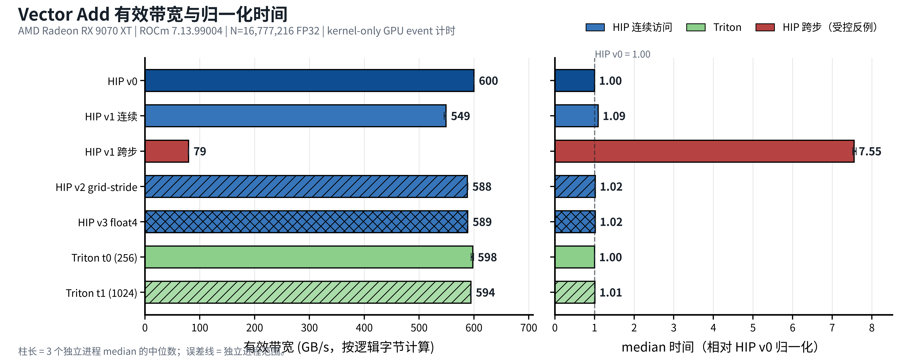

<script setup lang="ts">
import ElementwiseJourney from './elementwise-journey.vue'
</script>

# 第7章 Element-Wise：逐元素算子

## 本章导读

> 如果把 GPU 算子比作一组流水线任务，Element-Wise（逐元素）就是最容易看清的一类：输出位置 `i` 只需要输入位置 `i`，不必等待其他位置。我们从 Vector Add（向量加法）开始，用同一道题走两条路线。HIP 篇把线程、地址与显存访问拆开讲；Triton 篇用一个 program 处理一块数据，先建立能快速修改的最小模板。

第 3 章已经带你第一次跑通 Vector Add，第 4–6 章已经介绍计时与性能分析。本章不重走安装流程，而是第一次回答四个“算子优化”问题：**同一个计算怎样用两种编程范式表达、数据怎样分给并行执行单元、地址怎样排列、改动是否真的有效。**

你不必把两条路线一次读完。先按自己的目标选择：

| 阅读路线 | 更适合谁 | 建议顺序 | 能带走什么 |
| ---- | ---- | ---- | ---- |
| 完整路线 | 第一次系统学习 GPU Kernel，希望理解两种写法 | 7.1 → 7.2 → 7.3 → 7.4 → 7.5 → 7.6 → 7.7 | 同一个算子从数学语义到实验闭环的全貌 |
| [HIP 篇](#74-hip-篇看清线程与显存) | 想看清 thread、wavefront、显存地址与向量加载，愿意写 C++ | 7.1 → 7.2 → 7.3 → 7.4 → 7.6 → 7.7 | 更强的底层控制与性能分析入口 |
| [Triton 篇](#75-triton-篇用-tile-快速表达) | 熟悉 Python/PyTorch，想先快速写出可验证的自定义算子 | 7.1 → 7.2 → 7.3 → 7.5 → 7.6 → 7.7 | program/tile/mask 的最小心智模型 |

::: tip 先记住一句话
HIP 常从“当前 thread 得到哪个标量下标”出发；Triton 常从“当前 program 生成哪一块下标”出发。两者最后都必须回答同一件事：**读了哪些地址，算了什么，写回哪里。**
:::

## 7.1 先认识 Element-Wise

### 7.1.1 不看名字，先看依赖关系

判断一个算子是不是逐元素，最稳妥的方法不是背算子表，而是观察一个输出依赖哪些输入。

Vector Add 的定义是：

$$
C_i = A_i + B_i, \qquad 0 \le i \lt N
$$

想得到 `C[3]`，只需要 `A[3]` 与 `B[3]`。`A[0]`、`A[1]` 或其他位置都不会影响它。因此不同输出位置之间没有数据依赖，可以彼此独立地计算。

::: figure fig-elementwise-dependency
<ElementwiseJourney scenario="dependency" />

Vector Add 的逐元素依赖：当前位置只读取对应的两个输入位置。
:::

如 @fig-elementwise-dependency 所示，动画每一步只激活同一列中的 `A[i]`、`B[i]` 与 `C[i]`。真实 GPU 会并行处理许多列；这里故意逐步播放，是为了让依赖关系更容易看清。

同一模式还包括：

| 算子 | 单个输出的表达式 | `Y[i]` 依赖什么 |
| ---- | ---- | ---- |
| Add | `Y[i] = A[i] + B[i]` | `A[i]`、`B[i]` |
| ReLU | `Y[i] = max(X[i], 0)` | `X[i]` |
| Scale & Bias | `Y[i] = alpha * X[i] + beta` | `X[i]` 与两个标量 |
| Clamp | `Y[i] = min(max(X[i], low), high)` | `X[i]` 与上下界 |

它们的计算表达式不同，但数据划分方法相似：先把互不依赖的下标分出去，再处理对应元素。HIP 与 Triton 对“怎样分出去”给出了不同的源码视角。

### 7.1.2 同一个 Vector Add，两种编程范式

上一节回答了“算什么”：每个位置独立完成一次加法。现在回答“怎样描述谁来算”。这两件事不要混在一起：**Element-Wise 是算子的数据依赖类别，HIP 与 Triton 是表达这类计算的两种编程范式。**

Triton 官方编程指南用下面两句话对照两种视角：

- CUDA 式线程级写法：`Scalar Program, Blocked Threads`；本章的 HIP 写法采用相同的 thread-centric SIMT 视角。
- Triton 分块写法：`Blocked Program, Scalar Threads`。

先不用背英文。对初学者更有用的翻译是：**HIP kernel 正文站在一个 thread 的位置，Triton kernel 正文站在一个 program 的位置。**

::: figure fig-hip-triton-paradigms
<ElementwiseJourney scenario="paradigm" />

同一个 Vector Add 的两种分工视角：HIP 从标量线程与标量下标出发，Triton 从 program 与一块逻辑下标出发；两边最终只写回有效位置。
:::

如 @fig-hip-triton-paradigms 所示，图中故意使用 `N=6`，但让启动范围覆盖位置 `0–7`。这样既能看到两种划分方式，也能看到它们怎样关闭最后两个越界位置。

先把真实 API 收起来，只看两段结构：

```text
HIP
当前 thread → 一个标量下标 i
如果 i 有效：C[i] = A[i] + B[i]

Triton
当前 program → 一组逻辑下标 offsets
对有效位置：C[offsets] = A[offsets] + B[offsets]
```

HIP 会启动许多 thread，每个 thread 概念上执行同一份 kernel 正文，只是得到的标量下标不同。“一个 thread 只算一个元素”只是本章 `HIP v0` 的起点；后面的版本可以让一个 thread 处理多个元素。

Triton 则让一个 program 直接描述一组逻辑下标上的计算。后文的 `tl.arange` 用来生成这组下标，它**不会创建同样数量的线程**；逻辑位置怎样映射到底层线程，由编译器继续完成。

把两段结构按同一组问题对齐：

| 问题 | HIP v0：线程级视角 | Triton t0：分块视角 |
| ---- | ---- | ---- |
| kernel 正文直接描述谁 | 一个 thread | 一个 program instance |
| 下标是什么形状 | 标量 `index` | 一块 `offsets` |
| 本例每个实例处理什么 | 一个输出位置 | 一个输出 tile |
| 怎样保护尾部 | 每个 thread 执行标量 `if` | mask 逐位置保护整块 load/store |
| 源码显式控制的组织层次 | thread 与 block | program 与 tile；底层线程布局交给编译器 |

::: warning 不要把名字相近的概念直接画等号
HIP 的 `blockDim.x` 是一个 block 中显式启动的 thread 数；Triton 的 `BLOCK_SIZE` 是一个 program 逻辑覆盖的元素数。即使两者都写成 `256`，含义也不同。Triton program 不等于 HIP thread，tile 中的逻辑位置也不与某个硬件线程固定一一对应。
:::

后面读代码时，可以反复用这组顺序翻译：

```text
HIP：    当前 thread → 标量 index   → 标量 load / add / store
Triton： 当前 program → 一块 offsets → 分块 load / add / store
```

两条路线改变的是源码直接控制的层次，不是 Vector Add 的数学语义。它们都要覆盖相同的有效下标，也都要经过正确性检查与实测，不能因为抽象层次更高或更低就预设谁更快。真实的 HIP API 留到 [7.4](#74-hip-篇看清线程与显存)，Triton 最小模板留到 [7.5](#75-triton-篇用-tile-快速表达) 再逐行展开。

### 7.1.3 什么不属于这一类

如果输出 `Y[i]` 需要一整段输入，事情就变了。例如 Sum Reduction 要把很多输入合成一个值，线程之间必须协作；Softmax 还要先求一行最大值与总和。它们分别是[第 8 章 Reduction](../chapter8/index.md)和[第 9 章 Normalization](../chapter9/index.md)的主角。

因此，“输入输出形状相同”不是逐元素的充分条件。真正重要的是**输出位置之间能不能独立完成**。

## 7.2 用 Vector Add 固定问题

### 7.2.1 先用 4 个元素手算

给定：

```text
A = [2, -1, 4, 3]
B = [7,  3, -1, 2]
```

逐位置相加：

```text
C[0] = 2  + 7  = 9
C[1] = -1 + 3  = 2
C[2] = 4  + -1 = 3
C[3] = 3  + 2  = 5

C = [9, 2, 3, 5]
```

这个例子已经包含完整语义。把长度从 4 换成几千万，数学没有变化，变化的是我们怎样把这些位置交给 GPU。

### 7.2.2 固定同一份裁判规则

本章配套程序让 HIP 与 Triton 使用相同规则：

| 项目 | 固定方式 |
| ---- | ---- |
| 数学语义 | `C[i] = A[i] + B[i]` |
| 数据类型 | 32 位浮点数（FP32） |
| 输入 | 用同一确定性整数公式生成，再转成 FP32 |
| 参考结果 | CPU 逐元素执行同一个 FP32 加法 |
| 边界 | 覆盖小于 wave、刚好等于 block、比 block 多 1、不能被 4 整除等长度 |
| 正确性 | 正式计时前检查一次，计时后再检查一次 |
| 计时范围 | 只计 GPU kernel，不含分配、输入生成与 Host-to-Device 拷贝 |

为什么需要检查奇怪的长度？因为真实输入不会永远刚好等于 block size 的整数倍。若 `N=1027`，最后一个 block 只有少数位置有效；没有边界保护的 kernel 会访问数组外部。

PyTorch 参考写法只有一行：

```python
reference = input_a + input_b
```

短不代表可以省略它。自定义 kernel 的第一个目标永远是与参考结果一致；一个错误但很快的 kernel 没有比较价值。

### 7.2.3 把“尾部”加入裁判规则

边界长度专门检查最后一组不完整的位置。例如 `N=13`、候选下标为 `8–15` 时，只有 `8–12` 有效：HIP 由各 thread 的标量 `if` 关闭越界下标，Triton 由 mask 逐位置关闭越界 load/store。这是在落实 @fig-hip-triton-paradigms 的同一条规则，不再引入第三种分工方式。

## 7.3 一次加法要搬多少数据

### 7.3.1 真正忙的可能不是加法器

对一个 FP32 输出元素，最理想的逻辑工作量是：

| 动作 | 数量 | 逻辑字节 |
| ---- | ----: | ----: |
| 读取 `A[i]` | 1 个 FP32 | 4 Byte |
| 读取 `B[i]` | 1 个 FP32 | 4 Byte |
| 执行加法 | 1 次浮点加法 | 1 FLOP |
| 写回 `C[i]` | 1 个 FP32 | 4 Byte |
| 合计 |  | 12 Byte + 1 FLOP |

所以它的理想算术强度是：

$$
AI_{logical} = \frac{1\ \text{FLOP}}{12\ \text{Byte}}
             \approx 0.0833\ \text{FLOP/Byte}
$$

这只是从算子语义推导出的**逻辑下界**，不是性能实测。缓存命中、未合并访问、对齐和实际内存事务都可能让物理流量不同。

从这个比例可以提出一个等待实验检验的假设：

> Vector Add 每搬 12 Byte 只做 1 次加法，当前大 shape 可能更容易受显存带宽限制，而不是受浮点计算吞吐限制。

可以把 `0.083 FLOP/Byte` 放进坐标系：9070XT 的 FP32 峰值算力与显存带宽相除，得到的“平衡点”在几十 FLOP/Byte 量级。Vector Add 的算术强度比这个平衡点低两个数量级以上，意味着即使把加法器全部跑满，数据也供不上——瓶颈大概率在搬运，不在计算。注意用词仍是“大概率”。后文会用 Radeon RX 9070 XT 上的 GPU event 时间和受控地址实验检验它。即使有效带宽接近本机可达到的水平，也只能说明结果与带宽受限假设一致；没有物理流量计数器时，不能把逻辑字节直接当成显存事务。

### 7.3.2 有效带宽怎样算

本章统一用计时区间中的逻辑字节计算有效带宽：

$$
BW_{effective} = \frac{3 \times N \times 4\ \text{Byte}}{t}
$$

其中 `t` 是一次 kernel 的 GPU event 时间。这个指标适合在**相同语义、相同 shape、相同计时范围**下比较版本，但它不等于内存控制器实际传输了多少字节。物理流量必须由可用的硬件计数器或更进一步的分析支持。

## 7.4 HIP 篇：看清线程与显存

### 7.4.1 这条路线适合谁

HIP 篇更适合下面的读者：

- 想知道 block、thread、wavefront 最后怎样变成具体地址；
- 愿意读少量 C++，并希望控制 grid、加载类型与尾部路径；
- 后续想继续学习 LDS、Wave Shuffle、VGPR 等更底层机制；
- 遇到性能问题时，希望能从源码一路追到 kernel trace。

第一次读 HIP 不需要先记住所有硬件名词。本节只反复使用四个对象：

```text
grid 里有多个 block
block 里有多个 thread
相邻 thread 以 wavefront 为硬件执行组
thread 最终访问全局内存中的地址
```

用一组具体数字锚定：本章 `N=16,777,216`、`blockDim.x=256`，那么 grid 需要 `65,536` 个 block；每个 block 里的 256 个 thread 按 32 个一组编成 8 个 wavefront；每个 thread 用 `blockIdx.x × 256 + threadIdx.x` 算出自己负责的那一个地址。后文所有版本只是在改变“哪个 thread 访问哪个地址、一次访问多少字节”。

### 7.4.2 HIP v0：一个线程处理一个元素

最短的正确 kernel 是：

```cpp
__global__ void vector_add_v0(const float* input_a,
                              const float* input_b,
                              float* output,
                              std::size_t size) {
    const std::size_t index =
        static_cast<std::size_t>(blockIdx.x) * blockDim.x + threadIdx.x;
    if (index < size) {
        output[index] = input_a[index] + input_b[index];
    }
}
```

先把索引公式拆开：

```text
blockIdx.x * blockDim.x    当前 block 之前有多少线程
+ threadIdx.x              当前线程在 block 内的位置
= index                    当前线程负责的全局元素下标
```

例如 `blockDim.x=256`，第 2 个 block 中的第 3 个线程得到：

```text
index = 2 × 256 + 3 = 515
```

它只处理 `C[515] = A[515] + B[515]`。最后一个 block 可能越过 `size`，所以 `if (index < size)` 不能省略。

当相邻线程得到相邻 `index` 时，它们也会访问相邻的 FP32 地址。AMD 的 HIP 性能指南把这种排列称为 coalesced memory access（合并访存）：硬件有机会把多个线程的请求组合成更少的内存事务。这里先把它当作**地址结构事实**；实际事务数与性能仍要测量。

### 7.4.3 HIP v1：怎样公平比较连续与跨步

一个常见教学错误是：连续版每线程处理 1 个元素，跨步版每线程处理 32 个元素，然后直接比较时间。此时改变的不只是地址顺序，还包括 grid、循环次数和每线程工作量，无法知道差异来自哪里。

本章改用一个受控实验。真实代码与动画缩略的比例如下，两边只改“同一轮内 lane 到地址的排列”，其余全部固定：

| 配置 | 真实 HIP 代码 | @fig-hip-coalescing 动画 |
| ---- | ---- | ---- |
| 执行单元 | 1 个 Wave32（32 个 lane） | 8 个 lane |
| 每 lane 处理 | 32 个元素 | 4 个元素 |
| 一轮覆盖 | 32 × 32 = 1024 元素 | 8 × 4 = 32 元素 |
| grid / block / 循环次数 / 逻辑字节 | 两边相同 | 两边相同 |

::: figure fig-hip-coalescing
<ElementwiseJourney scenario="memory" />

合并访存受控对照的缩略动画：两边处理同一批元素，只改变每一轮的下标排列。图中 32B 地址组是帮助观察聚集度的教学分桶，不是实测硬件事务计数；连续顺序每轮触及 1 组，跨步顺序每轮触及 4 组。
:::

左侧连续版在第 `round` 轮使用：

```text
index = base + round × wave_size + lane
```

右侧跨步版只交换两个维度：

```text
index = base + lane × rounds + round
```

四轮动画结束后，两边都覆盖下标 `0–31`，没有重复也没有遗漏。连续顺序的累计组访问依次为 `1 / 2 / 3 / 4`，跨步顺序依次为 `4 / 8 / 12 / 16`。这仍是地址分组层面的教学计数；正式 HIP 代码保持相同的 grid、block、每 lane 循环次数、加法次数和逻辑字节，物理事务与性能由后续实测判断。

```cpp
// hip-v1-contiguous
index = base + round * 32 + lane;

// hip-v1-strided
index = base + lane * 32 + round;
```

这个实验要验证的不是“跨步一定慢多少”，而是：

> 在当前 9070XT、当前 shape 与当前编译结果下，只改变 wave 内地址顺序，kernel 时间和 trace 是否出现可重复差异？

2026-07-17 的受控实验给出了可重复差异：连续版的三进程 median 是 `0.362 ms`，跨步版是 `2.60 ms`，跨步版用时约为连续版的 `7.17×`。两者的 kernel trace 都记录到相同的 `524,288` 个 work-item、workgroup size 256、VGPR 16、LDS 0 Byte 和 scratch 0 Byte；grid、循环次数、算术与逻辑字节也相同。

因此，当前证据支持“Wave32 同轮地址顺序显著影响这个 Vector Add”的判断。它仍没有直接数出物理显存事务，所以更严格的措辞是：**受控地址变化与 `7.17×` 时间差同时出现，并且现有 trace 资源字段没有提供其他差异。**

### 7.4.4 HIP v2：Grid-Stride Loop 让线程重复工作

v0 启动足够多的线程，让每个线程只处理一个位置。另一种常见写法是限制 grid，让线程每隔整个 grid 的跨度继续处理下一个元素：

```cpp
const std::size_t thread =
    static_cast<std::size_t>(blockIdx.x) * blockDim.x + threadIdx.x;
const std::size_t grid_stride =
    static_cast<std::size_t>(gridDim.x) * blockDim.x;

for (std::size_t index = thread;
     index < size;
     index += grid_stride) {
    output[index] = input_a[index] + input_b[index];
}
```

假设 grid 一共包含 1024 个线程：

```text
线程 0：0, 1024, 2048, ...
线程 1：1, 1025, 2049, ...
线程 2：2, 1026, 2050, ...
```

在同一轮循环中，相邻线程依旧访问相邻元素，因此 Grid-Stride 与“连续访存”并不冲突。

本章代码默认把 v2 的 grid 上限设为“设备 CU 数量 × 8”，并把最终 grid 写入 `RESULT`。这只是待验证的起点，不是通用最优值。减少 block 数可能降低调度开销，也可能让并行度不足；两种方向都要由实测回答。

### 7.4.5 HIP v3：`float4` 与尾部不是一回事

FP32 标量占 4 Byte，`float4` 把 4 个 FP32 组合成 16 Byte 类型。v3 先把完整的四元素组交给向量路径，再用标量处理最后 `0–3` 个元素。

::: figure fig-hip-float4-tail
<ElementwiseJourney scenario="vector" />

`N=18` 时的 `float4` 源码分组与标量尾部。动画只画输入 A 的读取；输入 B 的读取与输出 C 的写回采用同样分组。该分组不等同于物理显存事务一定减少。
:::

核心结构是：

```cpp
const std::size_t vector_count = size / 4;

for (std::size_t v = thread; v < vector_count; v += grid_stride) {
    const float4 a = input_a4[v];
    const float4 b = input_b4[v];
    output4[v] = make_float4(
        a.x + b.x, a.y + b.y, a.z + b.z, a.w + b.w);
}

for (std::size_t i = vector_count * 4 + thread;
     i < size;
     i += grid_stride) {
    output[i] = input_a[i] + input_b[i];
}
```

这里有三个容易混淆的事实：

1. `hipMalloc` 返回的基地址满足本例向量类型的对齐要求，但从任意偏移地址强转成 `float4*` 未必安全。
2. 使用 `float4` 只说明源码请求了向量类型，不自动证明最终指令数量或显存事务减少。
3. `N % 4 != 0` 时，尾部路径是正确性要求，不是可选优化。

因此 v3 仍然要检查编译结果、边界输入、kernel trace 和时间。若它没有变快，这也是有效结果：说明“源码向量化必然提速”的假设在当前条件下没有成立。

### 7.4.6 HIP 路线当前能下什么结论

以下结果均在 **Radeon RX 9070 XT（gfx1201）+ ROCm 7.13 + 原生 Ubuntu 24.04** 上测得。输入为 `N=16,777,216` 个 FP32 元素；每个进程 warmup 10 次、计时 50 次，再对 3 个独立进程的同名指标取中位数。

| 版本 | 已固定的结构 | 9070XT 正确性 | median 时间 | 有效带宽 | 当前结论 |
| ---- | ---- | ---- | ---- | ---- | ---- |
| `hip-v0` | 一线程一元素，连续地址 | 通过 | `0.333 ms` | `605 GB/s` | 当前 baseline |
| `hip-v1-contiguous` | 每 lane 32 元素，逐轮连续 | 通过 | `0.362 ms` | `556 GB/s` | 多轮循环没有超过 v0 |
| `hip-v1-strided` | 只改变同轮地址顺序 | 通过 | `2.60 ms` | `77.5 GB/s` | 受控跨步访问显著变慢 |
| `hip-v2` | 受限 grid + Grid-Stride Loop | 通过 | `0.333 ms` | `604 GB/s` | 与 v0 的运行范围重叠 |
| `hip-v3` | `float4` 主路径 + 标量尾部 | 通过 | `0.342 ms` | `589 GB/s` | 当前配置下没有提速 |

v2 把 block 数从 v0 的 `65,536` 限制为 256，但两者的三进程时间范围重叠，不能声称缩小 grid 带来了收益。v3 与 v2 使用相同的 256 blocks；`float4` 版本反而慢约 `2.52%`，三次复跑都没有超过 v2。这是否定“源码换成向量类型就必然更快”的有效负结果。

完整实现位于 `code/part2-kernels/chapter7/vector_add_hip.hip`。

## 7.5 Triton 篇：用 Tile 快速表达

### 7.5.1 这条路线适合谁

Triton 篇更适合下面的读者：

- 已经会写 Python 或 PyTorch，希望先缩短“想法到可运行 kernel”的距离；
- 想用一组 offsets 表达一块数据，不急着手工管理每个 thread；
- 希望快速修改算子表达式、block size 和 program 网格；
- 后续要在 LeetGPU 等题目中使用 Triton 提交模板。

Triton 不是“无需理解硬件”。它把许多线程级细节交给编译器，但 program 怎样切 tile、地址是否连续、mask 是否正确、参数是否合适，仍由程序员负责。

### 7.5.2 最小 kernel：七行建立完整数据路径

```python
@triton.jit
def vector_add_kernel(a_ptr, b_ptr, c_ptr, size,
                      BLOCK_SIZE: tl.constexpr):
    pid = tl.program_id(axis=0)
    offsets = pid * BLOCK_SIZE + tl.arange(0, BLOCK_SIZE)
    valid = offsets < size
    a = tl.load(a_ptr + offsets, mask=valid, other=0.0)
    b = tl.load(b_ptr + offsets, mask=valid, other=0.0)
    tl.store(c_ptr + offsets, a + b, mask=valid)
```

逐行看，不需要先背语法：

1. `@triton.jit` 告诉 Triton：下面定义的是要即时编译的 kernel。
2. `tl.program_id(0)` 取得当前 program 在一维网格中的编号。
3. `tl.arange(0, BLOCK_SIZE)` 生成一个 tile 内的局部下标。
4. `pid * BLOCK_SIZE` 把局部下标移动到当前 tile 的起点。
5. `valid` 标记哪些下标没有越过 `size`。
6. 两次 `tl.load` 读取相同 offsets 的 A/B。
7. `tl.store` 把逐元素加法写回相同 offsets 的 C。

最值得注意的是：`offsets` 不是一个 Python 整数，而是一整组下标。Triton 代码看起来像在操作向量，编译器再把这块工作映射到底层 GPU 执行资源。

### 7.5.3 Host wrapper 负责准备输出与网格

kernel 之外还需要 Host 侧代码：

```python
def launch(input_a, input_b, output, block_size):
    size = output.numel()
    grid = (triton.cdiv(size, block_size),)
    vector_add_kernel[grid](
        input_a,
        input_b,
        output,
        size,
        BLOCK_SIZE=block_size,
        num_warps=4,
    )
```

`triton.cdiv(size, block_size)` 是向上取整。`N=13`、`BLOCK_SIZE=8` 时需要 2 个 program；第二个 program 生成 `8–15`，再由 mask 关闭 `13–15`。

配套脚本使用 `torch.cuda.Event` 与 `device="cuda"`。在 ROCm 版 PyTorch 中看到 `cuda` 不表示代码跑到了 NVIDIA GPU；PyTorch 官方为了兼容现有生态，HIP 后端继续复用 `torch.cuda` 接口，可通过 `torch.version.hip` 确认当前构建。

### 7.5.4 Triton t0/t1：先只改一个参数

本章保留同一个 kernel，只改变 `BLOCK_SIZE`：

| 版本 | `BLOCK_SIZE` | `num_warps` | 改变了什么 |
| ---- | ----: | ----: | ---- |
| `triton-t0` | 256 | 4 | 最小正确 baseline |
| `triton-t1` | 1024 | 4 | 每个 program 覆盖更多元素，program 数量减少 |

这里把 `num_warps` 固定为 4，是为了让 block size 成为主要变量。`num_warps` 是 Triton 的元参数，指定编译一个 program 时使用多少个 warp/wave 执行组；它大致对应 HIP 语境里“一个 block 占几个 wavefront”，但 tile 元素怎样落到 lane 与寄存器仍由编译器决定。`BLOCK_SIZE` 更大可能减少 program 数量，也可能改变资源使用与调度；在实测前不能把 t1 称为“优化版”。

### 7.5.5 用 Triton-viz 把 offsets 和 mask 展开

只看七行 kernel，初学者最容易卡在两个问题：`offsets` 到底有哪些数？最后一个 program 的越界位置发生了什么？

::: figure fig-triton-program-mask
<ElementwiseJourney scenario="triton" />

`N=13, BLOCK_SIZE=8` 的 Triton program、offsets、逐元素加法与尾部 mask：同一组逻辑 tile 位置依次读取 A、读取 B、执行 `A+B` 并写回 C，`mask=false` 的位置不会产生越界访问。
:::

@fig-triton-program-mask 是为正文重画的步骤动画。仓库还提供真实的 Triton-viz trace 脚本：

```python
@triton_viz.trace("tracer")
@triton.jit
def traced_vector_add_kernel(...):
    # 与正文相同的 offsets / mask / load / store
    ...
```

待安装本篇环境后，可以启动实时可视化：

```bash
cd code/part2-kernels
python chapter7/visualize_triton.py --size 13 --block 8 --launch
```

浏览器打开 `http://127.0.0.1:5001` 后，Triton-viz 会通过 CPU interpreter 展开 load/store 地址，基础可视化不要求 GPU。它适合回答“访问了哪里、mask 是否挡住越界”，**不用于测量 9070XT 性能**。性能仍由原生 Ubuntu 实验机上的 GPU event 与 `rocprofv3` 负责。

本篇固定 PyPI 发布版 `triton-viz==3.0`，使用它实际提供的实时 `launch()` 接口。官方仓库开发分支已经记录了 `.tvz` 保存接口，但 3.0 wheel 尚未导出 `save/load`；因此本章不写一个在锁定环境里无法运行的 `.tvz` 命令。

::: figure fig-triton-viz-live


本章脚本在 Triton 3.6.0 + Triton-viz 3.0 的 x86 Linux CPU interpreter 中生成的实时界面：拖动 program 滑块切换 program，右侧青色位置表示有效元素，灰色位置表示尾部 mask。
:::

@fig-triton-viz-live 左侧箭头定位到当前 `tl.load`，右侧青色位置表示有效元素，灰色位置表示尾部 mask。这段录屏只证明可视化脚本与地址记录可运行，不是 9070XT 性能证据。

### 7.5.6 Triton 路线当前结果

| 版本 | program/tile | 9070XT 正确性 | median 时间 | 有效带宽 | 当前结论 |
| ---- | ---- | ---- | ---- | ---- | ---- |
| `triton-t0` | 每 program 256 元素 | 通过 | `0.334 ms` | `602 GB/s` | 当前 baseline |
| `triton-t1` | 每 program 1024 元素 | 通过 | `0.336 ms` | `599 GB/s` | 与 t0 的运行范围重叠 |

t1 把 program 数从 `65,536` 降到 `16,384`，但 median 没有改善；名义时间比 t0 高 `0.580%`，三进程范围又彼此重叠，因此不能把这点差距解释成稳定退化。kernel trace 还显示 t0 使用 8 个 VGPR，t1 使用 24 个 VGPR；这说明更大的 tile 同时改变了资源需求，不能只看到 program 数减少就提前宣布胜负。

完整实现位于 `code/part2-kernels/chapter7/vector_add_triton.py`；可视化入口位于 `code/part2-kernels/chapter7/visualize_triton.py`。

## 7.6 HIP 与 Triton 怎样对应

### 7.6.1 把两种语言放回同一张数据流

| 要回答的问题 | HIP 写法 | Triton 写法 |
| ---- | ---- | ---- |
| 源码中显式编号的并行实例 | `blockIdx.x`、`threadIdx.x` 选出当前 thread | `tl.program_id(0)` 选出当前 program |
| 一次分多少数据 | 通常从一个 thread 的标量工作开始 | 一个 program 的 tile |
| 生成下标 | 标量 `index`，或在线程循环中递增 | 张量 `offsets` |
| 保护尾部 | `if (index < size)` | `mask = offsets < size` |
| 读取 | 指针下标或显式向量类型 | `tl.load(pointer + offsets, mask=...)` |
| 计算 | C++ 标量/向量表达式 | tile 上的张量表达式 |
| 写回 | 指针下标 | `tl.store(..., mask=...)` |
| 主要显式参数 | grid、block、每线程工作、加载类型 | program grid、block size、num warps |
| 主要风险 | 越界、对齐、并行度、资源压力 | mask、tile 过大、program 映射、资源压力 |

HIP 的一个 thread 与 Triton 的一个 program **不是一一对应**。更准确的迁移方法是先问三次：

```text
1. 这一组输出下标是什么？
2. 它们读取哪些输入下标？
3. 尾部哪些位置必须关闭？
```

只要这三件事对应起来，语言差异就不会遮住算子本身。

### 7.6.2 什么时候先选哪条路线

| 当前目标 | 更自然的起点 | 原因 |
| ---- | ---- | ---- |
| 第一次验证一个简单算子想法 | Triton | kernel 与 Host wrapper 较短，tile/mask 容易修改 |
| 精确控制 thread 到地址的排列 | HIP | grid、thread、指针与加载类型直接暴露 |
| 研究 Wave/LDS/VGPR 细节 | HIP | 更靠近 AMD 执行与资源模型 |
| 快速尝试多个 tile 参数 | Triton | meta-parameter 与 Python 驱动更集中 |
| 定位地址或 mask 错误 | Triton + Triton-viz，或 HIP + trace | 两边都要回到实际地址证据 |

这不是永久的语言排名。同一个算子可能先用 Triton 验证算法，再用 HIP 追底层细节；也可能 HIP baseline 已经足够清楚，完全不需要重写。

### 7.6.3 公平性能结果

下面的 HIP 与 Triton 对照使用相同输入公式、`N=16,777,216`、FP32 语义、warmup 10、repeat 50 和 kernel-only GPU event 计时边界。表中的 median 是 3 个独立进程各自 median 的中位数，“3 次进程范围”也只比较这 3 个进程内 median。

| 实现 | 正确性 | median 时间 | 有效带宽 | 3 次进程范围 | 证据 |
| ---- | ---- | ---- | ---- | ---- | ---- |
| `hip-v0` | 通过 | `0.333 ms` | `605 GB/s` | `0.332–0.336 ms` | 3 次复跑 + 11 次目标 dispatch |
| `hip-v1-contiguous` | 通过 | `0.362 ms` | `556 GB/s` | `0.362–0.366 ms` | 3 次复跑 + 11 次目标 dispatch |
| `hip-v1-strided` | 通过 | `2.60 ms` | `77.5 GB/s` | `2.52–2.64 ms` | 3 次复跑 + 11 次目标 dispatch |
| `hip-v2` | 通过 | `0.333 ms` | `604 GB/s` | `0.333–0.341 ms` | 3 次复跑 + 11 次目标 dispatch |
| `hip-v3` | 通过 | `0.342 ms` | `589 GB/s` | `0.341–0.342 ms` | 3 次复跑 + 11 次目标 dispatch |
| `triton-t0` | 通过 | `0.334 ms` | `602 GB/s` | `0.333–0.349 ms` | 3 次复跑 + 11 次目标 dispatch |
| `triton-t1` | 通过 | `0.336 ms` | `599 GB/s` | `0.336–0.340 ms` | 3 次复跑 + 11 次目标 dispatch |

::: figure fig-vector-add-bandwidth


Radeon RX 9070 XT 上的 Vector Add 有效带宽；柱长为三进程中位数，误差线为三进程范围。
:::

如 @fig-vector-add-bandwidth 所示，除受控跨步版本外，其余实现都落在约 `556–605 GB/s`。这与“当前大 shape 主要受数据搬运影响”的假设一致，但纵轴仍是按 12 Byte/元素计算的**逻辑有效带宽**，不是硬件计数器给出的物理 GDDR6 流量。

HIP v0、HIP v2、Triton t0 与 Triton t1 的时间范围彼此重叠，所以这组实验没有选出永久的语言赢家。更可靠的结论是：先保持地址连续和边界正确，再用目标 shape 实测 grid、tile 与向量类型；更少的 block/program 或更宽的源码类型都不自动等于更快。

## 7.7 复跑与练习

### 7.7.1 一键入口

以下命令已于 2026-07-17 在 **Radeon RX 9070 XT + ROCm 7.13 + 原生 Ubuntu 24.04** 实验机完整执行，也是读者复跑本章的入口：

```bash
cd code/part2-kernels
uv sync
source ./activate-rocm.sh
export SOURCE_COMMIT="$(git rev-parse HEAD)"
bash chapter7/run_all.sh
bash chapter7/profile_all.sh
```

两个入口共用导出的 `SOURCE_COMMIT`，确保 benchmark 与 profile 刷新的发布清单指向同一份源码。

`run_all.sh` 的顺序是：

```text
采集环境
→ 编译 HIP
→ HIP/Triton 边界正确性
→ 生成 Triton-viz trace
→ 主 benchmark
→ 3 次独立进程复跑
→ 汇总 CSV/JSON
```

`profile_all.sh` 单独运行，避免 profiler 开销混入 GPU event benchmark。实验完成后应得到：

```text
code/part2-kernels/chapter7/
├── evidence/
│   ├── manifest.json
│   ├── profile_summary.csv
│   ├── summary.csv
│   └── summary.json
├── logs/
└── profiles/
```

详细环境、参数、关键结果与证据路径见 `code/part2-kernels/chapter7/EXPERIMENT.md`。带宽图可以直接从汇总结果重画：

```bash
python chapter7/plot_vector_add_ch7.py \
  --summary chapter7/evidence/summary.csv \
  --manifest chapter7/evidence/manifest.json \
  --out ../../docs/part2-kernels/chapter7/images/vector-add-ch7-bandwidth.png
```

### 7.7.2 从 Add 迁移到更多逐元素算子

Vector Add 的价值不在于加法本身，而在于它提供了一个可替换的模板。

把核心表达式改成 ReLU：

```text
output[i] = max(input[i], 0)
```

线程/program 的划分与尾部保护可以保持不变。改成 Scale & Bias：

```text
output[i] = alpha * input[i] + beta
```

仍然是逐元素，只是每个位置多做了乘法和加法。把 Add 与 ReLU 合在一个 kernel：

```text
output[i] = max(input_a[i] + input_b[i], 0)
```

如果分成两个 kernel，中间结果通常需要写回再读出；融合后可能减少这次中间读写。这里仍然只能提出假设，真正的收益要在第 11 章用完整计时验证。

### 7.7.3 练习

1. 把 `N` 改成 `1、31、32、33、1027`，先预测 HIP 的 `if` 与 Triton 的 mask 分别关闭哪些位置，再运行正确性检查。
2. 把 Triton t1 的 `BLOCK_SIZE` 改为 `512`，保持 `num_warps=4`，记录 program 数量怎样变化；不要在计时前猜谁更快。
3. 在 HIP 与 Triton 中都实现 `Scale & Bias`，继续使用同一输入生成、precheck、postcheck 与 event 计时框架。
4. 给 `float4` 版本传入从 `input + 1` 开始的偏移指针，先解释为什么对齐假设被破坏，再设计安全的头部/主体/尾部拆分；不要直接运行未对齐强转。

## 本章小结

- Element-Wise 的核心不是“公式简单”，而是输出位置之间没有依赖，可以独立划分。
- HIP 线程级范式让 kernel 正文从一个 thread 与标量下标出发；Triton 分块范式让正文从一个 program 与一块逻辑下标出发。`blockDim.x` 与 `BLOCK_SIZE` 不是对应参数，tile 位置也不固定对应硬件 lane。
- Vector Add 每个 FP32 输出至少对应两次逻辑读取、一次逻辑写回和一次加法；受控跨步实验让用时增加到连续版的约 `7.17×`，结果与数据搬运主导假设一致。
- HIP 从 thread 与标量地址出发，适合看清连续访问、Grid-Stride、向量类型和尾部。
- Triton 从 program 与 tile offsets 出发，用 mask 统一处理边界；Triton-viz 可以把地址访问展开，但不代替 GPU 性能实验。
- Grid-Stride 在当前配置下与 v0 接近；`float4` 没有提速；Triton 的 1024 元素 tile 也没有稳定超过 256 元素 tile。负结果同样决定下一轮该测什么。
- 遇到一个新的逐元素算子时，本章的判断仍然成立：先确认输出位置彼此独立 → 沿用同一套线程/program 划分与尾部保护 → 只替换核心表达式 → 用同一口径复测，不要凭源码表象预判快慢。
- 下一章会撤掉“每个输出彼此独立”这个前提：Reduction 需要许多线程合作得到一个结果，因此会第一次引入跨线程通信、LDS 与 Wave Shuffle。

## 延伸阅读

- [AMD HIP 编程模型](https://rocm.docs.amd.com/projects/HIP/en/latest/understand/programming_model.html)：thread、block、grid、wavefront 与 SIMT 执行关系。
- [AMD HIP Performance Guidelines](https://rocm.docs.amd.com/projects/HIP/en/latest/how-to/performance_guidelines.html)：线程映射、合并访存、对齐与内存吞吐建议。
- [Triton 官方编程指南：Introduction](https://triton-lang.org/main/programming-guide/chapter-1/introduction.html)：Blocked Program、Scalar Threads 与分块算法的官方定义。
- [Triton 官方 Vector Addition 教程](https://triton-lang.org/main/getting-started/tutorials/01-vector-add.html)：kernel、Host wrapper、正确性与 benchmark 的官方最小例子。
- [Triton 官方调试文档](https://triton-lang.org/main/programming-guide/chapter-3/debugging.html)：CPU interpreter 与 Triton-viz 的定位。
- [Triton-viz 官方仓库](https://github.com/Deep-Learning-Profiling-Tools/triton-viz)：trace、可视化、profiler 与 sanitizer 的使用入口。
- [PyTorch HIP 语义](https://docs.pytorch.org/docs/stable/notes/hip.html)：为什么 ROCm 构建继续使用 `torch.cuda` 接口名。
- [DLog Element-Wise 教程](https://dlog.com.cn/posts/cuda05/element_wise)：本文只借鉴“先画数据移动、再进入代码”的教学节奏，图与实验均按 AMD/ROCm 语境重新制作。
