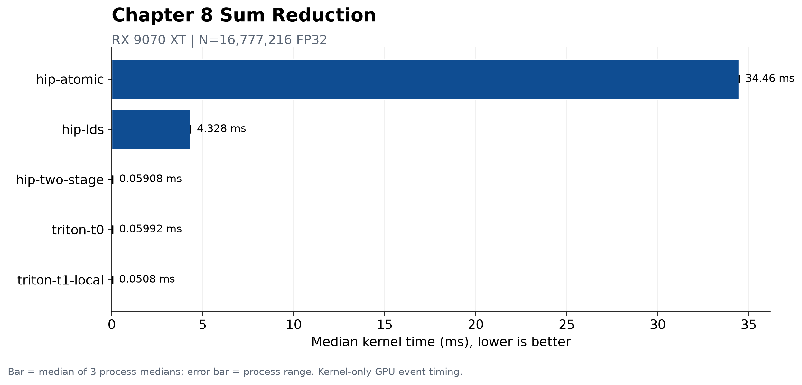

# 第8章 Reduction：归约算子

## 本章目标、前置知识与产物

> 第 7 章的 Vector Add 可以让每个输出位置独立完成。本章撤掉这个前提：`N` 个输入要共同产生一个标量。我们从一棵能手算的求和树出发，分别用 HIP 与 Triton 实现 Sum Reduction，并把“线程局部和、组内合并、跨组合并”对齐成同一套心智模型。

本章默认你已经会启动 HIP kernel、理解 block/thread，并能读懂 Triton 的 program、tile 与 mask。第 4–6 章已经介绍 GPU event 与 `rocprofv3`，这里直接复用这些工具，不重复安装过程。

学完后，你应该能回答四个问题：

1. 为什么归约不能像逐元素算子一样让线程各写各的；
2. `__syncthreads()` 在 LDS 树中保护了什么数据依赖；
3. 局部累加、Wave Shuffle 和二阶段 partial 分别减少了哪一层协作成本；
4. HIP 与 Triton 的源码层次不同，为什么仍能映射到同一棵归约树。

配套代码位于 `code/part2-kernels/chapter8/`。HIP、Triton、边界正确性、3 个独立正式进程和逐实现 `rocprofv3` trace 均已在 Radeon RX 9070 XT 上完成；本章只发布与 evidence 绑定的当前 shape 结论。

## 8.1 从“每个输出独立”到“大家合成一个结果”

Sum Reduction 的定义很短：

$$
y = \sum_{i=0}^{N-1} x_i
$$

但它与 Vector Add 的依赖关系完全不同。Vector Add 的 `C[i]` 只依赖 `A[i]` 和 `B[i]`；Reduction 的唯一输出 `y` 依赖所有输入。若两个 GPU 线程同时执行普通的：

```cpp
*output += input[index];
```

它们会先后经历“读旧值、加法、写新值”。两个线程可能读到同一个旧值，后写入的结果覆盖先写入的结果，这就是数据竞争。并行归约首先要解决的不是“怎样更快”，而是“怎样让多方更新不丢失”。

常见归约不只有 sum：

| 算子 | 输出 | 合并操作 | 还要保存什么 |
| ---- | ---- | ---- | ---- |
| Sum | 一个和 | `a + b` | 通常只保存数值 |
| Max | 一个最大值 | `max(a, b)` | 只求 max 时保存数值 |
| Argmax | 最大值及位置 | 比较后选择一对 `(value, index)` | 数值与下标必须一起移动 |

本章只实现 FP32 Sum。Max 可以沿用树的结构，但要把加法换成 `max`，并把越界位置的单位元从 `0` 换成负无穷；Argmax 则需要同时归约值和下标。

## 8.2 手算一棵归约树

先求下面 8 个数的和：

```text
x = [3, 1, 7, 0, 4, 1, 6, 2]
```

串行写法形成一条长度为 8 的依赖链：

```text
0 → 3 → 4 → 11 → 11 → 15 → 16 → 22 → 24
```

后一次加法必须等待前一次结束。树形写法先并行合并相邻元素：

```text
第 0 层： 3   1   7   0   4   1   6   2
           \ /     \ /     \ /     \ /
第 1 层：   4       7       5       8
             \     /         \     /
第 2 层：      11              13
                  \          /
第 3 层：             24
```

两种写法都执行 7 次加法，但树只有 `log2(8)=3` 轮依赖。GPU 并不是让一棵无限大的树在一个 block 中完成；更常见的层次是：

```text
每个线程累加若干输入
→ 一个 wave 合并线程局部和
→ 一个 block 合并多个 wave
→ 每个 block 写一个 partial
→ 另一次 dispatch 合并所有 partial
```

当 `N` 不是 2 的幂时，不需要补写真实输入。只要把越界位置当成加法单位元 `0`，树仍然成立。例如 `N=6`、逻辑 tile 大小为 8 时，最后两个位置加载 `0` 即可。

## 8.3 先固定正确性和测量口径

### 8.3.1 浮点加法不满足结合律

实数中 `(a+b)+c = a+(b+c)`，有限精度浮点数中却不保证相等。不同 block 数、树形顺序或 Wave Shuffle 都可能改变舍入顺序，因此并行归约通常不能用 bitwise equality 与串行 FP32 结果比较。

本章程序采用下面的裁判规则：

| 项目 | 本章固定方式 |
| ---- | ---- |
| 输入类型 | FP32 |
| 教学输入 | 交替的 `+1` 与 `-1`，`seed` 决定首项符号 |
| CPU reference | Host 侧用 FP64 累加同一输入 |
| 容差 | 绝对误差不超过 `1e-3` |
| precheck | 正式计时前运行一次并检查 |
| postcheck | 正式计时后再次检查 |
| 边界长度 | `1, 31, 32, 33, 255, 256, 257, 1027` |

交替的整数输入是有意选择的：在默认 shape 下，它让 FP32 加法保持精确可检查，便于把“索引、同步或 partial 丢失”与普通舍入差异分开。它**不是**通用数值稳定性证明。把练习改成随机宽动态范围数据时，应重新定义能解释的误差标准，并与 PyTorch/FP64 reference 一起报告。

### 8.3.2 测量的是完整归约，不是单个漂亮的 kernel

配套程序用 GPU event 计时：

- HIP atomic/LDS 计入输出清零与归约 kernel；
- HIP two-stage 计入输出清零、partial kernel 和最终归约 kernel；
- Triton 两版都计入 program partial 与 second reduction 两次 dispatch；
- 分配、Host 输入生成和 Host-to-Device 拷贝不计时。

`RESULT` 行中的 `logical_bandwidth_gbs` 按 `(N × 4 Byte + 4 Byte) / median time` 计算，只表示输入与最终输出的**逻辑字节**。它没有计入 atomic 的读改写流量、LDS 访问或 partial buffer 读写，不能冒充显存控制器实际带宽。

## 8.4 HIP atomic baseline：先得到最短的正确版本

最直接的办法是让每个线程把一个输入原子加到同一地址：

```cpp
__global__ void atomic_sum_kernel(const float* input,
                                  std::size_t size,
                                  float* output) {
    const std::size_t index =
        static_cast<std::size_t>(blockIdx.x) * blockDim.x + threadIdx.x;
    if (index < size) {
        atomicAdd(output, input[index]);
    }
}
```

`atomicAdd` 保证一次读改写不会被另一线程拆开覆盖，所以它解决了正确性问题。代价也很直观：所有有效线程都竞争同一个全局地址。这个版本的价值是建立最短 baseline，而不是把 atomic 描述成必然慢到不可用。

Host 侧每次启动前必须把输出清零。若忘记清零，第 `k` 次 benchmark 会继续叠加前 `k-1` 次的结果；kernel 本身没有越界，结果仍然是错的。配套程序把 `hipMemsetAsync` 放在 event 区间内，因为清零是这条算法路径不可缺少的一部分。

运行单个版本：

```bash
cd code/part2-kernels
source ./activate-rocm.sh
hipcc --offload-arch=gfx1201 -O3 -std=c++17 \
  chapter8/reduction_hip.hip -o /tmp/reduction_hip
/tmp/reduction_hip --version atomic --size 1027 \
  --block 256 --warmup 0 --repeat 1
```

成功信号不是某个时间，而是对应 `RESULT` 同时出现 `correct=OK precheck=OK postcheck=OK`。

## 8.5 HIP LDS：把全局竞争缩小到每个 block 一次

下一个版本让一个 block 先在 LDS（HIP 的 `__shared__`）中完成局部树归约，只让 thread 0 把 block sum 原子加到全局输出：

```cpp
extern __shared__ float shared[];
const unsigned int thread = threadIdx.x;
const std::size_t index =
    static_cast<std::size_t>(blockIdx.x) * blockDim.x + thread;

shared[thread] = index < size ? input[index] : 0.0f;
__syncthreads();

for (unsigned int stride = blockDim.x / 2; stride > 0; stride >>= 1) {
    if (thread < stride) {
        shared[thread] += shared[thread + stride];
    }
    __syncthreads();
}

if (thread == 0) {
    atomicAdd(output, shared[0]);
}
```

以 256 threads/block 为例，第一轮由前 128 个线程把后 128 个值合并进来，之后活动线程依次缩成 `64、32、16……1`。每轮后的 `__syncthreads()` 有两个职责：

1. 确保本轮所有 LDS 写入都完成，下一轮才能读取；
2. 确保仍在活动的线程与已经退出本轮 `if` 的线程一起到达同一屏障。

因此屏障必须放在条件分支外。若只有 `thread < stride` 的线程执行 `__syncthreads()`，同一个 block 中其他线程不会到达屏障，行为未定义，甚至可能挂住。

这个版本把全局 atomic 次数从“每个元素一次”降为“每个 block 一次”，但同时增加 LDS 读写和多轮 block 同步。源码只能说明成本被重新分层，不能在远端测量前断言净收益。

## 8.6 HIP 局部累加、Wave Shuffle 与二阶段 partial

LDS 版仍然让每个 thread 只加载一个元素。`hip-two-stage` 改成 grid-stride loop：先让线程在寄存器里累加多个输入，再进行组内协作。

```cpp
const std::size_t first =
    static_cast<std::size_t>(blockIdx.x) * blockDim.x + threadIdx.x;
const std::size_t step =
    static_cast<std::size_t>(gridDim.x) * blockDim.x;

float local = 0.0f;
for (std::size_t index = first; index < size; index += step) {
    local += input[index];
}
```

这一步有两个作用：减少第一阶段 block 数，并把一部分加法变成不需要同步的线程私有工作。默认 grid 取“不超过完整 grid 的 `CU 数 × 8`”；它只是待实验的起点，可用 `--grid` 覆盖，不是硬件通用最优值。

接着在 wave 内用 shuffle 交换 lane 的寄存器值：

```cpp
__device__ float wave_reduce_sum(float value) {
    for (int offset = warpSize / 2; offset > 0; offset >>= 1) {
        value += __shfl_down(value, offset);
    }
    return value;
}
```

一个 wave 的 lane 天然按锁步方式执行，shuffle 可以直接读取另一个 lane 的值，不必为每一轮都写 LDS 再做 block 屏障。不同 wave 仍需要协作，因此代码让每个 wave 的 lane 0 写一个 `wave_sums[wave]`，同步一次，再让第一个 wave 合并这些 wave sums。

第一阶段最终写出 `grid` 个 partial；第二阶段复用同一个局部归约 kernel，以一个 block 对 partial buffer 做 grid-stride 累加并写出最终标量：

```text
N 个输入
  └─ stage 1: grid 个 block → grid 个 partial
       └─ stage 2: 1 个 block → 1 个输出
```

二阶段避免了 stage 1 的 block 在同一个 kernel 内尝试“全局同步”。普通 kernel 中没有可靠的跨 block 屏障；结束一次 dispatch 再启动下一次，本身就是清晰的全局阶段边界。

## 8.7 Triton：program partial + second reduction

Triton 不要求我们手写 lane shuffle。第一阶段让每个 program 用 grid-stride 方式读取多个 tile，在寄存器向量中累加，再由 `tl.sum` 得到一个 program partial：

```python
@triton.jit
def program_partial_kernel(input_ptr, partial_ptr, size, num_programs,
                           BLOCK_SIZE: tl.constexpr):
    pid = tl.program_id(0)
    acc = tl.zeros((BLOCK_SIZE,), dtype=tl.float32)
    first = pid * BLOCK_SIZE
    step = num_programs * BLOCK_SIZE
    for tile_start in tl.range(first, size, step):
        offsets = tile_start + tl.arange(0, BLOCK_SIZE)
        values = tl.load(input_ptr + offsets,
                         mask=offsets < size, other=0.0)
        acc += values
    tl.store(partial_ptr + pid, tl.sum(acc, axis=0))
```

这里的 `acc` 是一个 `BLOCK_SIZE` 长度的逻辑张量。循环的每一轮把同一 lane 位置的新元素加进 `acc`，循环结束后 `tl.sum` 再沿 tile 维度合成一个标量。尾部 mask 把越界元素替换为加法单位元 `0`。

第二个 kernel 只启动一个 program，加载 bounded partial buffer，再做一次 `tl.sum`：

```python
offsets = tl.arange(0, SECOND_BLOCK_SIZE)
partials = tl.load(partial_ptr + offsets,
                   mask=offsets < num_partials, other=0.0)
tl.store(output_ptr, tl.sum(partials, axis=0))
```

配套脚本保留两个版本，算法语义和 block size 相同，只改变第一阶段 program 数上限：

| 版本 | 默认第一阶段 program 上限 | 每个 program 的工作趋势 | 第二阶段 |
| ---- | ----: | ---- | ---- |
| `triton-t0` | 1024 | 较少的 grid-stride 轮次 | 一个 program 合并 partial |
| `triton-t1-local` | 256 | 更多线程局部累加轮次 | 一个 program 合并 partial |

真实 program 数是 `min(ceil(N / BLOCK_SIZE), 上限)`，因此小 shape 下两版可能完全相同。`t1` 的上限可用 `--programs` 调整。program 更少可能降低 partial 数，也可能减少并行度或增加寄存器压力；这仍然是要由 profile 回答的问题。

运行单个 Triton 版本：

```bash
cd code/part2-kernels
source ./activate-rocm.sh
python chapter8/reduction_triton.py --version t1 --size 1027 \
  --block 1024 --programs 256 --warmup 0 --repeat 1
```

在 ROCm PyTorch 中仍使用 `device="cuda"`、`torch.cuda.Event` 等兼容接口；可通过 `torch.version.hip` 和程序打印的 `ENV` 行确认实际后端。

## 8.8 把 HIP 与 Triton 放回同一棵树

| 归约层次 | HIP 表达 | Triton 表达 |
| ---- | ---- | ---- |
| 输入边界 | 标量 `if (index < size)` | load mask，越界填 `0` |
| 线程/program 私有工作 | FP32 寄存器 `local` | tile 张量 `acc` |
| wave/tile 内合并 | `__shfl_down` | `tl.sum` 交给编译器降低 |
| block/program 输出 | 一个 block 写一个 partial | 一个 program 写一个 partial |
| 跨组同步 | 结束 stage 1 dispatch | 结束 stage 1 dispatch |
| 最终合并 | 第二次 HIP kernel | `second_reduction_kernel` |

不要把一个 Triton program 直接等同于一个 HIP block，也不要假设 `BLOCK_SIZE=1024` 就表示启动 1024 个硬件线程。更稳妥的迁移方法是逐层追问：

```text
1. 一个私有执行上下文先读哪些元素？
2. 私有和在哪里保存？
3. 组内怎样合并，哪里需要同步？
4. 每组输出几个 partial？
5. 谁负责合并所有 partial？
```

HIP 暴露 wave、LDS 和 block 屏障，适合研究底层协作；Triton 用 tile 与 `tl.sum` 缩短表达路径，适合快速改变 program 划分。两者都不能跳过边界、reference 和完整两阶段计时。

## 8.9 一键运行与 `rocprofv3` Profiling

### 8.9.1 一键入口

首次准备 Part 2 环境：

```bash
cd code/part2-kernels
uv sync
bash chapter8/run_all.sh
```

`run_all.sh` 会激活 `code/part2-kernels/.venv`，默认按 `gfx1201` 编译 HIP，然后依次运行 8 个边界长度与主 shape。输出不写复杂 evidence 目录；本章首版直接以清晰的 `ENV`、阶段标题和 `RESULT` 行作为复跑反馈。

常用覆盖参数：

```bash
GPU_ARCH=gfx1201 SIZE=4194304 BLOCK=256 \
TRITON_BLOCK=1024 TRITON_PROGRAMS=256 \
WARMUP=5 REPEAT=20 bash chapter8/run_all.sh
```

只跑主 shape，可关闭边界循环：

```bash
RUN_EDGE_CASES=0 SIZE=16777216 bash chapter8/run_all.sh
```

每条 `RESULT` 都包含实现名、shape、block/grid、stage/partial 数、precheck/postcheck、event 时间、逻辑带宽与绝对误差。发布任何性能表之前，至少保留这些字段以及 GPU、ROCm、PyTorch/Triton 版本。

### 8.9.2 用 kernel trace 核对阶段

先单独编译并进行一次短 precheck，再让 profiler 启动目标进程：

```bash
cd code/part2-kernels
source ./activate-rocm.sh
mkdir -p chapter8/profiles

hipcc --offload-arch=gfx1201 -O3 -std=c++17 \
  chapter8/reduction_hip.hip -o /tmp/reduction_hip_ch8

rocprofv3 --kernel-trace \
  --output-directory chapter8/profiles \
  --output-file hip-two-stage --output-format csv -- \
  /tmp/reduction_hip_ch8 --version two-stage --size 16777216 \
  --block 256 --warmup 0 --repeat 1
```

Triton 先运行一次以完成 JIT，再 profile 第二次：

```bash
python chapter8/reduction_triton.py --version t1 --size 16777216 \
  --block 1024 --programs 256 --warmup 0 --repeat 1

rocprofv3 --kernel-trace \
  --output-directory chapter8/profiles \
  --output-file triton-t1 --output-format csv -- \
  python chapter8/reduction_triton.py --version t1 --size 16777216 \
  --block 1024 --programs 256 --warmup 0 --repeat 1
```

读 trace 时先验证结构，而不是急着比较总时间：HIP atomic/LDS 每次计时应看到一次主要归约 dispatch，two-stage 应看到 partial 与 final 两类归约 dispatch；Triton 两版也应出现第一阶段和第二阶段。随后再观察 grid、workgroup、LDS、VGPR 与每个 dispatch 的持续时间。

::: tip 正式实验状态
目标 Radeon RX 9070 XT + ROCm 环境已完成边界检查、3 个独立正式进程与 5 个独立 profile。正文结果来自提交的 curated evidence；原始日志和完整 trace 不跟踪进 Git。
:::

## 8.10 练习与验收

1. 画出 `N=6`、逻辑宽度为 8 的求和树，标出两个越界位置为什么必须填 `0`。
2. 删除 LDS 循环中的一次 `__syncthreads()`，先写下可能读到旧值的轮次；不要把有数据竞争的版本用于 benchmark。
3. 把 HIP `--grid` 分别设为 `CU×2、CU×8、CU×16`，保持其他参数不变，记录 partial 数、两阶段时间和 VGPR/LDS；不要只凭 block 更少判断结果。
4. 把 Triton `--programs` 从 `256` 改成 `128、512`，核对第一阶段 grid 和第二阶段 partial 数，再测量完整两次 dispatch。
5. 实现 Max Reduction：HIP/Triton 的越界单位元都改成负无穷，并用全负输入验证不能把初值误写成 `0`。
6. 实现 Argmax：定义相同值时选择较小下标的 tie-break，确保 `(value, index)` 在每一层始终成对移动。
7. 把输入改成宽动态范围随机 FP32，比较串行 FP32、FP64 reference 与不同归约树的误差，解释为什么“结果不逐 bit 相同”不自动等于错误。

完成本章不要求某个实现必须最快，但应同时满足：

- 8 个边界长度和主 shape 的所有 `RESULT` 都是 `correct=OK`；
- 能指出 atomic、LDS、wave shuffle 和二阶段各自处理哪一层竞争；
- 能从 trace 证明实际 dispatch 数，而不是从源码名字猜；
- 能复述 event 的计时边界，并明确逻辑带宽不等于物理显存流量；
- 若某项未运行或失败，实验记录明确写出，不能静默跳过。

## 正式实验结果



主 shape 为 `N=16,777,216` FP32。`hip-atomic` 的进程 median 中位数为 `34.4608 ms`，`hip-lds` 为 `4.32771 ms`，而二阶段 HIP、Triton t0/t1 位于 `0.0508–0.0599 ms`。这说明全局同地址争用和仅做 block 内归约都是本 shape 的负基线；同时，逻辑带宽不能当作物理显存（GDDR6）流量。

完整协议、三进程范围、负结果与证据路径见 `code/part2-kernels/chapter8/EXPERIMENT.md`。

## 本章小结

- Reduction 的难点来自多输入共同更新少输出；普通 `*output += value` 存在数据竞争。
- 树形归约没有减少加法总数，却把串行依赖深度从 `O(N)` 降为 `O(log N)`，并允许分层映射到 thread、wave、block 和多次 dispatch。
- HIP atomic 是最短正确起点；LDS 把全局 atomic 缩减到每 block 一次；局部累加与 Wave Shuffle 继续减少 block 数、LDS 访问和同步。
- 普通 kernel 没有跨 block 全局屏障。写 partial 后结束 dispatch，再用第二阶段合并，是清晰且可验证的同步边界。
- Triton 用 program、grid-stride tile、mask 与 `tl.sum` 表达相同层次；抽象更高并不免除 partial buffer、第二阶段和完整计时。
- 浮点归约的顺序会影响舍入。正确性标准必须同时说明 reference、输入分布、dtype 与容差。
- 本章已完成教程、可运行实验入口、边界检查、3 个独立 benchmark 进程和逐实现 `rocprofv3` 证据。

## 延伸阅读

- [AMD HIP 编程模型](https://rocm.docs.amd.com/projects/HIP/en/latest/understand/programming_model.html)：thread、block、grid、wavefront 与同步边界。
- [AMD HIP C++ Language Extensions](https://rocm.docs.amd.com/projects/HIP/en/latest/reference/kernel_language.html)：`__shared__`、同步与 shuffle 等 kernel 语言能力。
- [Triton `tl.sum` API](https://triton-lang.org/main/python-api/generated/triton.language.sum.html)：本章直接使用的归约原语。
- [Triton Fused Softmax 教程](https://triton-lang.org/main/getting-started/tutorials/02-fused-softmax.html)：在完整算子中组合 `tl.max`、`tl.sum` 的官方示例。
- [PyTorch HIP 语义](https://docs.pytorch.org/docs/stable/notes/hip.html)：ROCm 构建为什么继续复用 `torch.cuda` 接口名。
