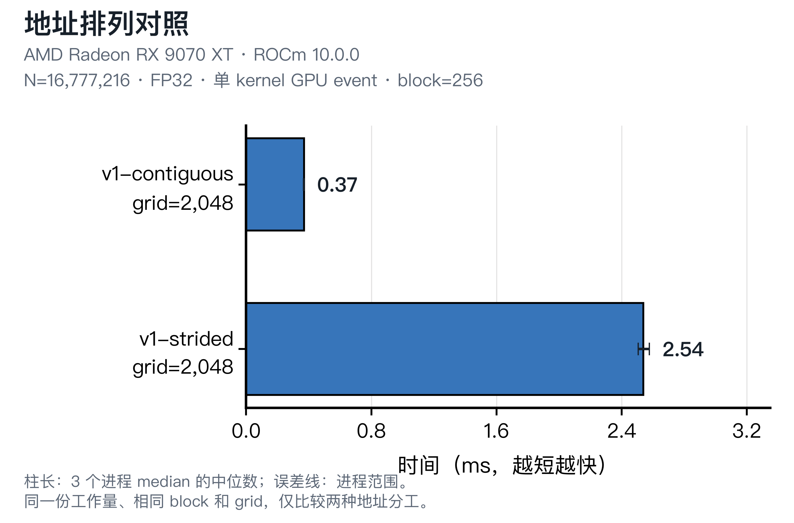
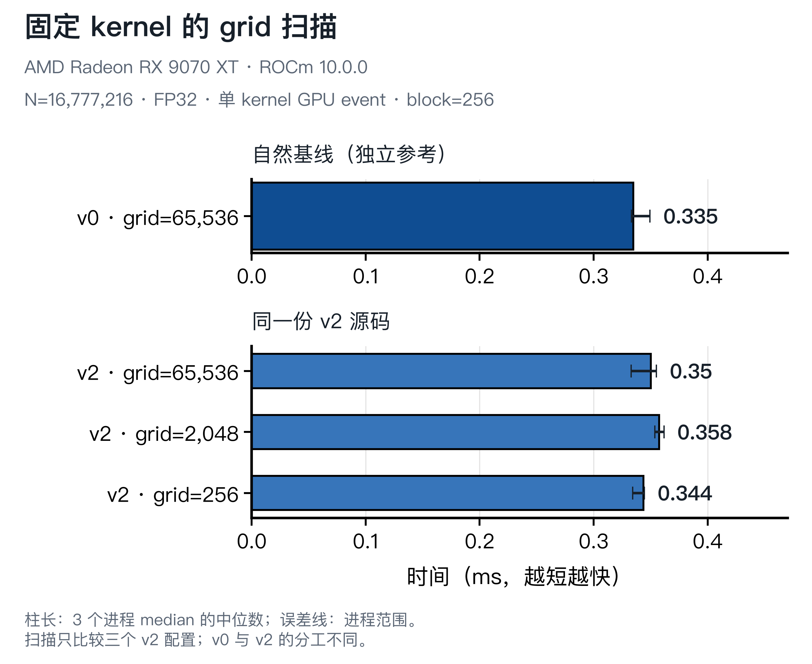
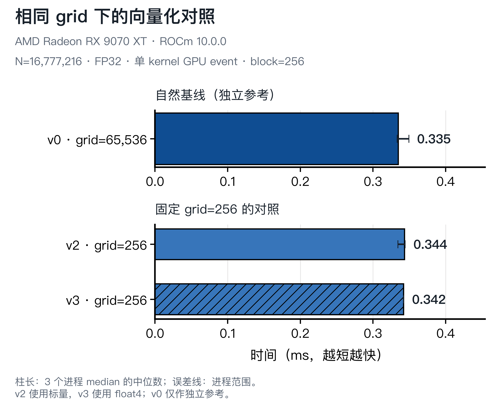
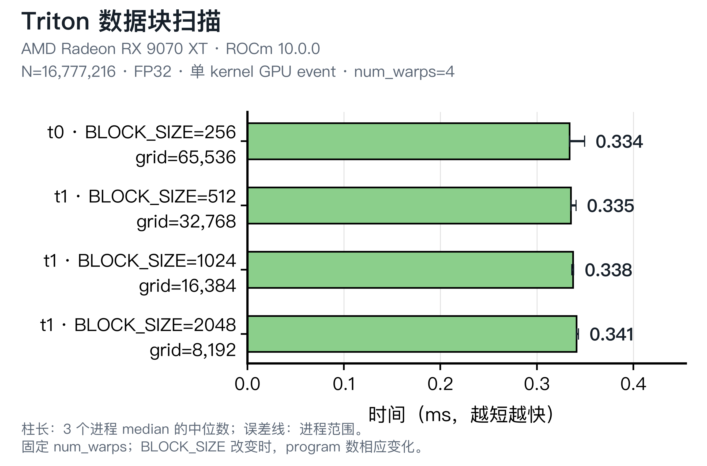
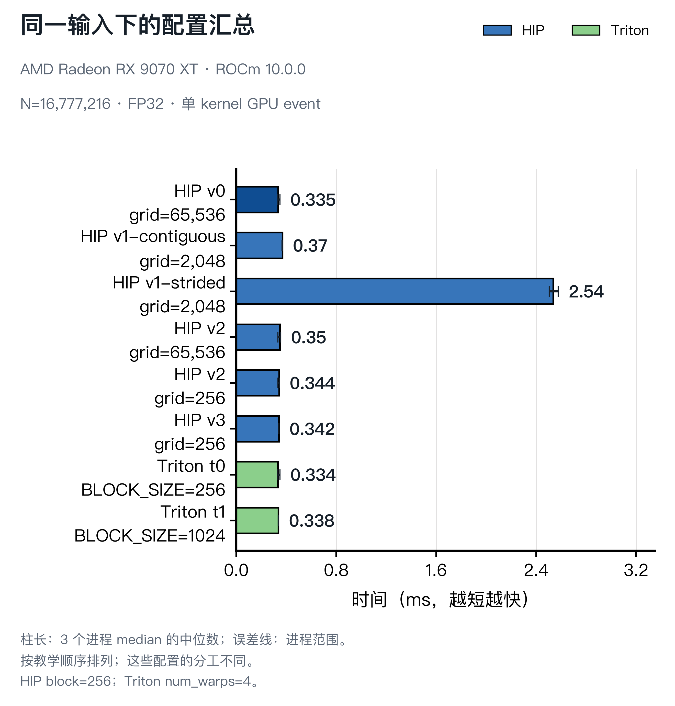

<script setup lang="ts">
import ElementwiseJourney from './elementwise-journey.vue'
</script>

# 第8章 Element-Wise：逐元素算子

## 本章导读

> 前面几章已经测量过向量加法。现在我们保持 `C[i] = A[i] + B[i]` 不变，研究另一件事：有了正确的基线，怎样判断下一步值得改什么？本章分别走一遍 HIP 与 Triton 的实验过程，用每轮结果决定保留或撤回改动。
>
> 读完后，你应该能解释一个元素由谁计算，设计只改变一个选择的对照，判断收益是否稳定，并说明什么时候值得进一步 profiling。第 4–7 章的程序、计时与 profiling 是本章基础；HIP 和 Triton 的语法可以按需查阅附录。

你可以先读共同的数学与动画，再选择一种语言：

| 阅读路线 | 如何开始 |
| ---- | ---- |
| 第一次接触 GPU 核函数 | 先读 [编程范式附录](../../appendix/programming-models/index.md)，再回到 8.1 的小数组 |
| 从 HIP 开始 | 阅读 8.1–8.3，在 [实现节](#_8-4-实现向量加法)选择 HIP，最后阅读共同的实验和对照 |
| 从 Triton 开始 | 阅读 8.1–8.3，在 [实现节](#_8-4-实现向量加法)选择 Triton，最后阅读共同的实验和对照 |

## 8.1 逐元素算子的数据依赖

### 8.1.1 输出之间的独立性

判断一个算子是不是逐元素，最稳妥的方法不是背算子表，而是观察一个输出依赖哪些输入。

Vector Add 的定义是：

$$
C_i = A_i + B_i, \qquad 0 \le i \lt N
$$

想得到 `C[3]`，只需要 `A[3]` 与 `B[3]`。`A[0]`、`A[1]` 或其他位置都不会影响它。因此不同输出位置之间没有数据依赖，可以彼此独立地计算。

::: figure fig-elementwise-dependency
<ElementwiseJourney scenario="dependency" />

Vector Add 的逐元素依赖：当前位置只读取对应的两个输入位置。
:::

如 @fig-elementwise-dependency 所示，动画每一步只激活同一列中的 `A[i]`、`B[i]` 与 `C[i]`，结尾的「并行俯瞰」把各列完成顺序打乱以凸显独立性。真实 GPU 会并行处理许多列；这里故意逐步播放，是为了让依赖关系更容易看清。动画可以暂停、单步查看；先看清一列的依赖，再观察多列并行。

同一模式还包括：

| 算子 | 单个输出的表达式 | `Y[i]` 依赖什么 |
| ---- | ---- | ---- |
| Add | `Y[i] = A[i] + B[i]` | `A[i]`、`B[i]` |
| ReLU | `Y[i] = max(X[i], 0)` | `X[i]` |
| Scale & Bias | `Y[i] = alpha * X[i] + beta` | `X[i]` 与两个标量 |
| Clamp | `Y[i] = min(max(X[i], low), high)` | `X[i]` 与上下界 |

它们的计算表达式不同，但数据划分方法相似：先把互不依赖的下标分出去，再处理对应元素。HIP 与 Triton 对“怎样分出去”给出了不同的源码视角。

### 8.1.2 HIP 与 Triton 的实现视角

同一个加法可以用两种视角描述。HIP 的核函数先描述一个线程：它得到一个下标，读取两个数并写回结果。Triton 的核函数先描述一块数据：它生成一组下标，对这一组位置执行加载、加法和写回。

如果你还不熟悉这些词，可以先读 [附录 D：HIP 与 Triton 的编程范式](../../appendix/programming-models/index.md)。附录用同一个带尾部的数组解释 thread/block、program/tile 和 `if`/mask，并把语法对应到实际源码。读完再回到本章即可，不需要先学完两门语言。

后面的实现节提供 **HIP / Triton 标签页**。先选择熟悉的一种语言，沿着一个可运行的实现读下去；数学问题、正确性检查和最终对照是两条路线共用的。

### 8.1.3 与归约算子的区别

如果输出 `Y[i]` 需要一整段输入，事情就变了。例如 Sum Reduction 要把很多输入合成一个值，线程之间必须协作；Softmax 还要先求一行最大值与总和。它们分别是[第 9 章 Reduction](../chapter9/index.md)和[第 10 章 Normalization](../chapter10/index.md)的主角。

因此，“输入输出形状相同”不是逐元素的充分条件。逐元素计算的特点是：**每个输出只对相应位置的输入元素做计算**，不需要沿某个维度把多个位置合成一个结果。输出之间没有依赖，是这种计算带来的并行机会。

## 8.2 固定数学语义与正确性标准

### 8.2.1 四元素示例

给定：

```text
A = [2, -1, 4, 3]
B = [7,  3, -1, 2]
```

逐位置相加：

```text
C[0] = 2  + 7  = 9
C[1] = -1 + 3  = 2
C[2] = 4  + -1 = 3
C[3] = 3  + 2  = 5

C = [9, 2, 3, 5]
```

这个例子已经包含完整语义。把长度从 4 换成几千万，数学没有变化，变化的是我们怎样把这些位置交给 GPU。

### 8.2.2 参考实现与检查条件

本章配套程序让 HIP 与 Triton 使用相同规则：

| 项目 | 固定方式 |
| ---- | ---- |
| 数学语义 | `C[i] = A[i] + B[i]` |
| 数据类型 | 32 位浮点数（FP32） |
| 输入 | 用同一确定性整数公式生成，再转成 FP32 |
| 参考结果 | CPU 逐元素执行同一个 FP32 加法 |
| 边界 | 覆盖小于 wavefront、刚好等于 block、比 block 多 1、不能被 4 整除等长度 |
| 正确性 | 正式计时前检查一次，计时后再检查一次 |
| 计时范围 | GPU event 包围一次 kernel 提交，不含分配、输入生成与 Host-to-Device 拷贝 |

为什么需要检查奇怪的长度？因为真实输入不会永远刚好等于 block size 的整数倍。若 `N=1027`，最后一个 block 只有少数位置有效；没有边界保护的 kernel 会访问数组外部。

PyTorch 参考写法只有一行：

```python
reference = input_a + input_b
```

短不代表可以省略它。自定义 kernel 的第一个目标永远是与参考结果一致；一个错误但很快的 kernel 没有比较价值。

### 8.2.3 非整除长度的边界

边界长度专门检查最后一组不完整的位置。例如 `N=13`、候选下标为 `8–15` 时，只有 `8–12` 有效：HIP 由各 thread 的标量 `if` 关闭越界下标，Triton 由 mask 逐位置关闭越界 load/store。两种写法都必须保护输入读取和输出写回。

## 8.3 建立成本模型和瓶颈假设

### 8.3.1 逻辑计算量与数据量

对一个 FP32 输出元素，最理想的逻辑工作量是：

| 动作 | 数量 | 逻辑字节 |
| ---- | ----: | ----: |
| 读取 `A[i]` | 1 个 FP32 | 4 Byte |
| 读取 `B[i]` | 1 个 FP32 | 4 Byte |
| 执行加法 | 1 次浮点加法 | 1 FLOP |
| 写回 `C[i]` | 1 个 FP32 | 4 Byte |
| 合计 |  | 12 Byte + 1 FLOP |

所以它的理想算术强度是：

$$
AI_{logical} = \frac{1\ \text{FLOP}}{12\ \text{Byte}}
             \approx 0.0833\ \text{FLOP/Byte}
$$

这只是从算子语义推导出的**逻辑下界**，不是性能实测。缓存命中、未合并访问、对齐和实际内存事务都可能让物理流量不同。

从这个比例可以提出一个等待实验检验的假设：

> Vector Add 每搬 12 Byte 只做 1 次加法，当前大 shape 可能更容易受显存带宽限制，而不是受浮点计算吞吐限制。

第 7 章已经解释怎样在 Roofline 上读工作点；这里不再重推硬件参考线，只保留与当前算子直接相关的假设：Vector Add 的逻辑算术强度很低，当前大 shape 更可能先受数据搬运限制。注意用词仍是“更可能”。后文会用 Radeon RX 9070 XT 上的 GPU event 时间和受控地址实验检验它。即使逻辑有效带宽较高，也只能说明结果与访存受限假设一致；没有物理流量计数器时，不能把逻辑字节直接当成显存事务。

### 8.3.2 有效带宽怎样算

本章统一用计时区间中的逻辑字节计算有效带宽：

$$
BW_{effective} = \frac{3 \times N \times 4\ \text{Byte}}{t}
$$

其中 `t` 是包围一次 kernel 提交的 GPU event 时间。这个指标适合在**相同语义、相同 shape、相同计时范围**下比较版本，但它不等于内存控制器实际传输了多少字节。物理流量必须由可用的硬件计数器或更进一步的分析支持。

## 8.4 实现向量加法

一个有用的实验从问题开始。例如，相邻线程的地址分散后会怎样；让更少的 block 各自做更多工作是否划算；让一个 Triton program 处理更多元素是否值得。假设可以来自前面的数据依赖和成本模型，再由测量检验。

先区分三件事，避免把“测到了一个数字”误当作解释：

| 方法 | 回答的问题 | 何时执行 |
| --- | --- | --- |
| 正确性检查 | 输出仍符合加法语义吗？尾部有没有漏写或越界？ | 每次改动后，先检查再计时 |
| Benchmark（性能测量） | 相同条件下更快吗？收益超过运行波动了吗？ | 每轮改动都做，与相关对照一起比较 |
| Profiling（性能分析） | 哪项额外证据能帮助解释现象或排除一种猜测？ | 有具体问题且工具能回答时再做 |

如果已经决定撤回一项没有稳定收益的改动，就可以结束这一轮。只有还想回答“为何没有收益”或核对某项执行细节时，才需要进一步分析。下面两条路线各保留自然基线；编号用于区分实验，不代表逐级提速。

**准备环境。** 在 GPU 机器上，从仓库根目录进入本篇；自带的 `uv.lock` 用于锁定依赖，不需要删除：

```bash
cd code/part2-kernels &&
uv sync --locked &&
source ./activate-rocm.sh
```

首次使用先按[环境准备](../../part0-intro/chapter1/index.md)完成驱动、uv 和系统编译依赖。后文命令均在 `code/part2-kernels/` 执行。

**新建一轮实验。** 在当前目录执行以下命令，保存打印出来的路径：

```bash
mkdir -p chapter8/results &&
RUN=$(mktemp -d chapter8/results/walkthrough-XXXXXX) &&
mkdir "$RUN/build" &&
printf '本轮结果目录：%s\n' "$RUN"
```

每次新建都会得到不同目录，保留旧结果。这里的 `RUN` 只在当前终端有效。若换了终端，从仓库根目录重新执行环境准备，然后输入之前保存的目录：

```bash
read -r -p '粘贴上次输出的结果目录：' RUN &&
test -n "$RUN" && test -d "$RUN/build" && printf '继续使用结果目录：%s\n' "$RUN"
```

在提示处粘贴目录路径，不包含 `RUN=`，再按回车。只有看到确认信息才继续；目录不存在时先核对路径。继续原实验时不重建目录、不重复已有测量；需要重测或修改源码时，新建一轮并重新编译 HIP 程序。

命令开头会检查 `RUN` 是否已设置、目录是否存在，再进行写入。每条 benchmark 命令保存一个进程的 50 个样本。`test ! -e ... && ...` 防止追加到旧 CSV；文件已存在时程序不会运行。图中使用三个独立进程的结果，不能仅凭这里的一次运行挑选赢家。手工继续测第 2、3 个进程时，要同时将命令中的 `benchmark-p1.samples.csv` 和 `--process 1` 改为对应的 `p2` / `2`、`p3` / `3`；每一轮都依次运行本组全部候选，并轮换起始配置，保留所有结果。完成单项操作后，可用 [8.8 的批量入口](#_8-8-1-复现逐轮实验)自动保存三进程比较与图。

**固定比较条件。** 本章数据来自 RX 9070 XT（gfx1201）、ROCm SDK 10.0.0、原生 Ubuntu 24.04；HIP 组件为 7.15.26333，Triton 为 3.8.0。

| 项目 | 所有逐轮图采用的条件 |
| --- | --- |
| 输入 | `N=16,777,216`，FP32，确定性输入，`seed=20260920` |
| 正确性 | 输出先填 NaN；计时前后检查所有结果有限、绝对误差不超过 `1e-6` |
| 计时 | 预热 10 次、测量 50 次；分配、输入生成、拷贝、校验及 JIT 首次编译在计时之外 |
| 重复与图示 | 每配置 3 个独立进程；柱长为三个进程 median 的中位数，误差线为这三个 median 的最小—最大范围，不是置信区间 |
| 执行条件 | 轮换配置顺序；重复使用数组、不主动清缓存；保留桌面及已有后台上下文，不假定 GPU 独占 |

以下边界输出来自同一份 kernel 源码的独立正确性检查；它们与主输入的三进程计时分开保存。通过这些已选长度不能证明所有输入均正确，修改数学表达式或访问规则后仍需重新检查。

先看输出中的 `precheck`、`postcheck`、`correct` 是否全为 `OK`，再核对输入与配置，最后看 `median_ms`。`effective_bandwidth_gbs` 由逻辑字节数换算，不是硬件流量测量。计时口径沿用[第 5 章](../../part1-profiling/chapter5/index.md)，工具基础见[第 6 章](../../part1-profiling/chapter6/index.md)。

<ImplementationTabs id="ch8-implementations">

<template #hip>

### 8.4.1 HIP 基线：一个线程处理一个元素

本章的起点是自然的一线程一元素写法。相邻线程访问相邻元素，数组加法又没有跨元素依赖，所以不需要先加入 LDS 或线程间同步。

```cpp
__global__ void vector_add_v0(const float* __restrict__ input_a,
                              const float* __restrict__ input_b,
                              float* __restrict__ output,
                              std::size_t size) {
    const std::size_t index =
        static_cast<std::size_t>(blockIdx.x) * blockDim.x + threadIdx.x;
    if (index < size) {
        output[index] = input_a[index] + input_b[index];
    }
}
```

`N=16,777,216`、每 block 256 个线程时，共需 65,536 个 block。最后一个 block 仍保留越界判断，以便同一份代码处理非整除长度。完整程序先准备输入与输出，对照 CPU 参考结果，再预热和计时。先看 `vector_add_v0()`，再看负责提交的 `launch()` 与组织测量的 `run_version()`。

<a id="ch8-hip-source"></a>

<details>
<summary>完整源码：code/part2-kernels/chapter8/vector_add_hip.hip</summary>

<<< @/../code/part2-kernels/chapter8/vector_add_hip.hip{cpp}

</details>

这份文件包含本路线所有候选。后面只需定位相应函数并改变运行参数，不必复制多份主机程序。先编译一次；已有可执行文件时直接复用：

```bash
test -d "${RUN:?请先完成环境与结果目录准备}/build" && \
if [[ ! -x "$RUN/build/vector_add_hip" ]]; then
  hipcc --offload-arch=gfx1201 -O3 -std=c++17 \
    chapter8/vector_add_hip.hip -o "$RUN/build/vector_add_hip"
fi
```

`--offload-arch=gfx1201` 选择本章显卡的编译目标。若改了源码，请新建 `RUN` 后重新编译，避免新源码与旧可执行文件混用。

<!-- benchmark:hip-v0 -->

**运行与校验**

```bash
test -d "${RUN:?请先完成环境与结果目录准备}/build" && \
mkdir -p "$RUN/configs/hip-v0" && \
test ! -e "$RUN/configs/hip-v0/benchmark-p1.samples.csv" && \
"$RUN/build/vector_add_hip" \
  --version v0 --block 256 \
  --size 16777216 --warmup 10 --repeat 50 --seed 20260920 \
  --samples "$RUN/configs/hip-v0/benchmark-p1.samples.csv" \
  --config-id hip-v0 --process 1
```

<details>
<summary>运行输出：hip-v0，第 1 个独立进程</summary>

<<< @/../code/part2-kernels/chapter8/evidence/walkthrough/configs/hip-v0/benchmark-p1.stdout.log{text}

</details>

先核对 `shape=16777216`、`block=256`、`grid=65536` 和三个 `OK`。这次单进程的 `median_ms=0.349441` 是 50 次 event 时间的中位数。另两个独立进程分别为 **0.333301、0.334861 ms**；图中采用三者中位数 **0.334861 ms**，范围 **0.333301–0.349441 ms**。较慢的一次也保留，不能只取最快值。

**基线分析：计时区间里实际执行了什么？** 这一处 trace 用来核对目标 kernel 的起止时间和实际启动规模，建立后续读报告的方法。它不负责证明“已经达到带宽极限”。

保持当前目录和 `RUN`，另启动一次带 profiler 的进程。分析时预热 5 次、记录 10 次；这次终端打印的 event 时间不进入 benchmark。`inspect_trace.py` 只用 Python 标准库读取 CSV，不运行 GPU。


```bash
test -d "${RUN:?请先完成环境与结果目录准备}/build" && \
mkdir "$RUN/configs/hip-v0/profile" && \
rocprofv3 --kernel-trace --hip-trace --stats \
  --output-format csv pftrace \
  --output-directory "$RUN/configs/hip-v0/profile" \
  --output-file hip-v0 -- \
  "$RUN/build/vector_add_hip" \
  --version v0 --block 256 \
  --size 16777216 --warmup 5 --repeat 10 --seed 20260920 \
  --config-id hip-v0 --process 1 && \
python chapter8/inspect_trace.py \
  "$RUN/configs/hip-v0/profile/hip-v0_kernel_trace.csv" \
  --kernel vector_add_v0 --skip 6 --take 10
```

<details>
<summary>性能分析原始输出：hip-v0（终端、生成记录与 CSV）</summary>

**程序 stdout**

<<< @/../code/part2-kernels/chapter8/evidence/walkthrough/configs/hip-v0/profile.stdout.log{text}

**Profiler stderr：文件生成记录**

<<< @/../code/part2-kernels/chapter8/evidence/walkthrough/configs/hip-v0/profile.stderr.log{text}

**原始 kernel trace CSV**

<<< @/../code/part2-kernels/chapter8/evidence/walkthrough/configs/hip-v0/profile/hip-v0_kernel_trace.csv{text}

</details>

<details>
<summary>筛选后的分析结果：hip-v0</summary>

<<< @/../code/part2-kernels/chapter8/evidence/walkthrough/configs/hip-v0/inspect.stdout.log{text}

</details>

先找 `vector_add_v0`：原始 CSV 还包含填充输出的辅助 kernel，目标记录共有 16 条。去掉 1 次预检和 5 次预热，保留 10 次，这就是命令中 `--skip 6 --take 10` 的含义；整份 `kernel_stats` 的平均值包含预检与预热，不能直接作正式成绩。

再核对时间：第一条保留记录为 `908153776012898 − 908153775686576 = 326322 ns`，即 **326.322 μs**；10 次的中位数为 **326.2815 μs**。它来自独立采集，与 benchmark 的 event 时间不是同一次运行，不能相减来估算 CPU 开销。

最后核对启动规模：`grid_work_items_xyz=16777216x1x1` 除以 `workgroup_size_xyz=256x1x1` 得到 65,536 个 block。这里的 Grid X 是工作项数。`vgpr_count=8`、`scratch_bytes=0` 描述资源分配，不能单独证明动态占用率或带宽瓶颈。

这次核对确认了目标、规模和统计区间。下一项假设可以直接来自地址安排，无需先为每个候选再采一份相同报告。分析脚本全文和时间线读法见 [8.5](#_8-5-按问题选择性能分析)。

### 8.4.2 地址对照：只改变同轮访问顺序

基线已经采用连续访问；不能把故意改坏它再改回来称为新的优化。这里另设一对实验，检验“同轮地址排列是否值得关注”，再把得到的判断带回正常实现。

`base` 是这组线程所负责片段的起点，`round` 是当前循环轮次。真实代码让一个 wave32 处理 1,024 个元素：32 个 lane 各处理 32 个元素，共循环 32 轮。两版的 grid、block、循环轮数、加法次数和输入完全相同，仅下标排列不同：

```cpp
// hip-v1-contiguous：同一轮，相邻 lane 读取相邻位置
index = base + round * 32 + lane;

// hip-v1-strided：同一轮，相邻 lane 的位置相隔 32 个元素
index = base + lane * 32 + round;
```

两种排法最终都会覆盖同一片输入，也产生同一份输出。区别发生在**同一轮请求哪些地址**。

::: figure fig-hip-coalescing
<ElementwiseJourney scenario="memory" />

地址排列的缩略演示：8 个 lane 各处理 4 个元素。32B 分组只帮助观察地址是否集中，不是 RX 9070 XT 的实测事务计数。
:::

图把真实代码的 32 个 lane × 32 轮缩成 8 个 lane × 4 轮，保留同轮连续或分散的差别。先在 @fig-hip-coalescing 中看一轮：连续排列的地址集中在一起，跨步排列散布在多组。再播放全部四轮，确认两边最终没有遗漏或重复。真实性能要看独立计时：


两次运行分别调用同一文件的 `vector_add_v1_contiguous()` 与 `vector_add_v1_strided()`，由 `--version` 选择。完整主机程序见[本路线源码](#ch8-hip-source)。

<!-- benchmark:hip-v1-contiguous -->

**运行与校验**

```bash
test -d "${RUN:?请先完成环境与结果目录准备}/build" && \
mkdir -p "$RUN/configs/hip-v1-contiguous" && \
test ! -e "$RUN/configs/hip-v1-contiguous/benchmark-p1.samples.csv" && \
"$RUN/build/vector_add_hip" \
  --version v1-contiguous --block 256 \
  --size 16777216 --warmup 10 --repeat 50 --seed 20260920 \
  --samples "$RUN/configs/hip-v1-contiguous/benchmark-p1.samples.csv" \
  --config-id hip-v1-contiguous --process 1
```

<details>
<summary>运行输出：hip-v1-contiguous，第 1 个独立进程</summary>

<<< @/../code/part2-kernels/chapter8/evidence/walkthrough/configs/hip-v1-contiguous/benchmark-p1.stdout.log{text}

</details>

这是本轮的连续访问对照。输出应为 `grid=2048`、`block=256`，且前后检查通过；本次单进程中位数为 **0.370081 ms**。

<!-- benchmark:hip-v1-strided -->

**运行与校验**

```bash
test -d "${RUN:?请先完成环境与结果目录准备}/build" && \
mkdir -p "$RUN/configs/hip-v1-strided" && \
test ! -e "$RUN/configs/hip-v1-strided/benchmark-p1.samples.csv" && \
"$RUN/build/vector_add_hip" \
  --version v1-strided --block 256 \
  --size 16777216 --warmup 10 --repeat 50 --seed 20260920 \
  --samples "$RUN/configs/hip-v1-strided/benchmark-p1.samples.csv" \
  --config-id hip-v1-strided --process 1
```

<details>
<summary>运行输出：hip-v1-strided，第 1 个独立进程</summary>

<<< @/../code/part2-kernels/chapter8/evidence/walkthrough/configs/hip-v1-strided/benchmark-p1.stdout.log{text}

</details>

跨步版保持同样的输入、grid、block 与循环工作量，输出仍然正确；本次单进程中位数为 **2.538206 ms**。接下来用三进程结果确认差异是否只是偶然波动。

::: figure fig-vector-add-address-round


只改变同轮地址排列的 HIP 对照；柱长为三个独立进程 median 的中位数，误差线为进程范围。
:::

连续版为 **0.369681 ms**，跨步版为 **2.538206 ms**，后者用时约为前者的 **6.87 倍**，两者的进程范围明显分离。

受控对照支持“同轮地址排列显著影响当前实现的时间”。它同时改变 A/B 的读取与 C 的写入排列，尚未把时间分摊给读、写或具体缓存行为；图中的地址分组也不是实测内存事务。基线 v0 本来就连续访问，因此这不是把 v0 加速了 6.87 倍。

本轮的决定是保留同轮相邻访问。再采一份仅重复“跨步版更慢”的 trace，不会改变这个决定。若要继续量化物理流量或缓存命中率，需要有效的硬件计数器；本机本次没有取得相应有效数据，边界见 8.5.3。

### 8.4.3 Grid-Stride：减少 block 数是否有收益

基线启动了 65,536 个 block，每个线程只做一次加法。一个可以验证的想法是：**让线程循环处理多个位置，能否用更少的 block 完成同样的工作？**

`hip-v2` 用整个 grid 的线程数作为步长：

```cpp
const std::size_t thread =
    static_cast<std::size_t>(blockIdx.x) * blockDim.x + threadIdx.x;
const std::size_t grid_stride =
    static_cast<std::size_t>(gridDim.x) * blockDim.x;

for (std::size_t index = thread; index < size; index += grid_stride) {
    output[index] = input_a[index] + input_b[index];
}
```

假设整个 grid 有 1,024 个线程，线程 0 处理 `0、1024、2048…`，线程 1 处理 `1、1025、2049…`。单个线程跨着读，**同一轮的相邻线程仍然连续读**，与上一轮的跨步反例不同。

不能只把 v0 与一个缩小了 grid 的 v2 相比，就把差异都归给 block 数。因此分两步观察：先让 v2 同样使用 65,536 个 block，再固定这份循环代码，只把 grid 改为 2,048、256。输入、block size、计时方式保持不变。

本轮重点阅读完整程序中的 `vector_add_v2_grid_stride()` 与 `grid_for()`。三次使用同一份循环代码，分别给出明确的 grid 参数。

**保持 65,536 个 block。**

<!-- benchmark:hip-v2-g65536 -->

**运行与校验**

```bash
test -d "${RUN:?请先完成环境与结果目录准备}/build" && \
mkdir -p "$RUN/configs/hip-v2-g65536" && \
test ! -e "$RUN/configs/hip-v2-g65536/benchmark-p1.samples.csv" && \
"$RUN/build/vector_add_hip" \
  --version v2 --block 256 --grid 65536 \
  --size 16777216 --warmup 10 --repeat 50 --seed 20260920 \
  --samples "$RUN/configs/hip-v2-g65536/benchmark-p1.samples.csv" \
  --config-id hip-v2-g65536 --process 1
```

<details>
<summary>运行输出：hip-v2-g65536，第 1 个独立进程</summary>

<<< @/../code/part2-kernels/chapter8/evidence/walkthrough/configs/hip-v2-g65536/benchmark-p1.stdout.log{text}

</details>

先核对 `grid=65536` 与 v0 相同。此时检验的是换成循环结构的效果，不能把它和后面的 grid 缩小混为一项改动。本次单进程中位数为 **0.355121 ms**。

**减少到 2,048 个 block。**

<!-- benchmark:hip-v2-g2048 -->

**运行与校验**

```bash
test -d "${RUN:?请先完成环境与结果目录准备}/build" && \
mkdir -p "$RUN/configs/hip-v2-g2048" && \
test ! -e "$RUN/configs/hip-v2-g2048/benchmark-p1.samples.csv" && \
"$RUN/build/vector_add_hip" \
  --version v2 --block 256 --grid 2048 \
  --size 16777216 --warmup 10 --repeat 50 --seed 20260920 \
  --samples "$RUN/configs/hip-v2-g2048/benchmark-p1.samples.csv" \
  --config-id hip-v2-g2048 --process 1
```

<details>
<summary>运行输出：hip-v2-g2048，第 1 个独立进程</summary>

<<< @/../code/part2-kernels/chapter8/evidence/walkthrough/configs/hip-v2-g2048/benchmark-p1.stdout.log{text}

</details>

输出中的 `grid=2048` 表明配置已经生效。平均每线程处理 32 个元素，总加法数量没有减少；本次单进程中位数为 **0.361721 ms**。

**减少到 256 个 block。**

<!-- benchmark:hip-v2-g256 -->

**运行与校验**

```bash
test -d "${RUN:?请先完成环境与结果目录准备}/build" && \
mkdir -p "$RUN/configs/hip-v2-g256" && \
test ! -e "$RUN/configs/hip-v2-g256/benchmark-p1.samples.csv" && \
"$RUN/build/vector_add_hip" \
  --version v2 --block 256 --grid 256 \
  --size 16777216 --warmup 10 --repeat 50 --seed 20260920 \
  --samples "$RUN/configs/hip-v2-g256/benchmark-p1.samples.csv" \
  --config-id hip-v2-g256 --process 1
```

<details>
<summary>运行输出：hip-v2-g256，第 1 个独立进程</summary>

<<< @/../code/part2-kernels/chapter8/evidence/walkthrough/configs/hip-v2-g256/benchmark-p1.stdout.log{text}

</details>

此时平均每线程处理 256 个元素。确认 `correct=OK` 后，记录本次单进程中位数 **0.343640 ms**；不要因为这一项较小，就跳过重复测量。

::: figure fig-vector-add-grid-round


v0 是原始参照；v2 的三个配置使用同一份 kernel。缩小 grid 会同时增加每个线程的工作量，图中实际比较的是这项分工选择。
:::

三个 v2 配置分别为 **0.350301、0.357582、0.343640 ms**，本轮都没有显示稳定优于 v0 的收益。减少 block 数会同时增加每个线程的循环量；预期中的管理成本下降，未必能抵消其他代价。

本轮保留 v0。这个决定只需要公平测量，不需要给三档 grid 分别再做完整 trace。若后续要判断是否启动了预期数量的 block，可针对那一档检查 Grid / Workgroup；若要解释运行时占用率或等待，还需要对应的有效证据，不能用 block 数替代它们。

### 8.4.4 `float4`：一次表达四个元素是否更快

上一轮的 `grid=256` 中位数高于基线，进程范围仍有重叠。每个线程要循环多次，按四个元素一组读写，能否弥补一部分开销？为了检验这个想法，我们继续固定 **grid=256、block=256**，比较标量循环 v2 与向量类型 v3；图中同时保留原始 v0。这里没有把 256 当作已经选出的最优 grid。

本例从 `hipMalloc` 返回的对齐基地址开始；任意 `input + 1` 偏移不再保证适合强转为 `float4*`，复用这段代码时要先保证地址对齐。

`float4` 把四个 FP32 组合成一个 16 Byte 类型。v3 按四元素组读写，并为剩余的 `0–3` 个元素保留标量路径：

::: figure fig-hip-float4-tail
<ElementwiseJourney scenario="vector" />

`N=18` 的源码分组：前 16 个元素组成四组，最后两个元素单独处理。图中只展开输入 A，B 和 C 使用相同分组。
:::

```cpp
const std::size_t vector_count = size / 4;
for (std::size_t vector_index = thread;
     vector_index < vector_count;
     vector_index += grid_stride) {
    const float4 a = input_a4[vector_index];
    const float4 b = input_b4[vector_index];
    output4[vector_index] =
        make_float4(a.x + b.x, a.y + b.y, a.z + b.z, a.w + b.w);
}
for (std::size_t index = vector_count * 4 + thread;
     index < size;
     index += grid_stride) {
    output[index] = input_a[index] + input_b[index];
}
```

本轮的假设是向量类型可能改变生成的访存指令及循环工作量。源码写出 `float4` 本身不能证明事务减少；先通过包含尾部的正确性检查，再判断时间：


完整实现仍在[HIP 源文件](#ch8-hip-source)的 `vector_add_v3_float4()`，运行参数使用 `--version v3`。

先检查新增的尾部路径：`N=2` 只走标量尾部，`N=6` 同时包含一组 float4 和两个尾部元素，`N=1026` 检查较长向量部分后的两个元素。这里预热为 0、计时重复 1 次，程序仍会先做一次预检；目的是核对答案。

```bash
test -d "${RUN:?请先完成环境与结果目录准备}/build" && \
"$RUN/build/vector_add_hip" --version v3 --size 2 --block 256 --warmup 0 --repeat 1 --seed 20260920 --grid 256 && \
"$RUN/build/vector_add_hip" --version v3 --size 6 --block 256 --warmup 0 --repeat 1 --seed 20260920 --grid 256 && \
"$RUN/build/vector_add_hip" --version v3 --size 1026 --block 256 --warmup 0 --repeat 1 --seed 20260920 --grid 256
```

<details>
<summary>边界检查原始输出：float4 尾部 @ RX 9070 XT / ROCm 10.0</summary>

**boundary-float4-n2.log**

<<< @/../code/part2-kernels/chapter8/evidence/boundary-check/boundary-float4-n2.log{text}

**boundary-float4-n6.log**

<<< @/../code/part2-kernels/chapter8/evidence/boundary-check/boundary-float4-n6.log{text}

**boundary-float4-n1026.log**

<<< @/../code/part2-kernels/chapter8/evidence/boundary-check/boundary-float4-n1026.log{text}

</details>

三项记录均为 `precheck=OK postcheck=OK correct=OK`，`max_abs_error=0`。小输入下程序会收缩 grid，三份输出的实际 `grid=1`，不是请求上限 256。日志中的单次 event 数值不作性能比较；边界通过后，再回到相同主输入与实际 grid=256 的对照。


<!-- benchmark:hip-v3-g256 -->

**运行与校验**

```bash
test -d "${RUN:?请先完成环境与结果目录准备}/build" && \
mkdir -p "$RUN/configs/hip-v3-g256" && \
test ! -e "$RUN/configs/hip-v3-g256/benchmark-p1.samples.csv" && \
"$RUN/build/vector_add_hip" \
  --version v3 --block 256 --grid 256 \
  --size 16777216 --warmup 10 --repeat 50 --seed 20260920 \
  --samples "$RUN/configs/hip-v3-g256/benchmark-p1.samples.csv" \
  --config-id hip-v3-g256 --process 1
```

<details>
<summary>运行输出：hip-v3-g256，第 1 个独立进程</summary>

<<< @/../code/part2-kernels/chapter8/evidence/walkthrough/configs/hip-v3-g256/benchmark-p1.stdout.log{text}

</details>

先核对 `grid=256`、`block=256` 与标量 v2 一致，前后检查通过；本次单进程中位数为 **0.342002 ms**。四元素分组同时改变循环工作量、地址表达和编译选择，不能仅凭源码中的类型推断访存事务减少。

::: figure fig-vector-add-vector-round


固定 grid=256、block=256，比较 v2 与 v3。相同执行配置使这轮改动更容易解释。
:::

标量 v2 为 **0.343640 ms**，四元素分组 v3 为 **0.342121 ms**。两者的三进程范围重叠，与 v0 也有重叠，尚无稳定收益足以替换简单基线。

因此本轮停止这项改动，保留 v0。只有还要回答“编译器是否生成了预期的宽指令”时，才继续看编译结果；即使发现指令变宽，也不能据此宣布速度会提高。8.5.3 的 ATT 选读只演示 v0 的源码与指令对应，不作为这里 v3 的解释证据。

### 8.4.5 HIP 路线的实验决策

这条路线保留了三种可复用的方法：用相同工作量隔离地址排列，用同一循环 kernel 扫描 grid，用相同 grid/block 对照元素分组。每个对照都回答一个问题；没有稳定提速也能帮助决定停止哪项尝试。

当前主输入选择 v0。换成别的实际长度或布局时，应从基线重新比较，不能把某个 grid 或向量类型当成通用答案。

</template>

<template #triton>

### 8.4.6 Triton 基线：一个 program 处理一段元素

HIP 的核函数描述一个线程；Triton 的核函数描述一块数据。我们先让一个 program 负责 256 个连续元素，得到本路线的 `triton-t0`。它是可以直接修改、复测的基线，不需要先复制 HIP 的线程循环和 `float4` 写法。

```python
@triton.jit
def vector_add_kernel(
    input_a_ptr, input_b_ptr, output_ptr, size,
    BLOCK_SIZE: tl.constexpr,
):
    program_id = tl.program_id(axis=0)
    offsets = program_id * BLOCK_SIZE + tl.arange(0, BLOCK_SIZE)
    valid = offsets < size
    input_a = tl.load(input_a_ptr + offsets, mask=valid, other=0.0)
    input_b = tl.load(input_b_ptr + offsets, mask=valid, other=0.0)
    tl.store(output_ptr + offsets, input_a + input_b, mask=valid)
```

`tl.arange` 生成一组下标，`program_id * BLOCK_SIZE` 将它们移到当前片段。`tl.load` 读入两组数，加法逐位置进行，`tl.store` 写回同一组位置。`BLOCK_SIZE` 表示逻辑元素数，**不是 HIP 的线程数 `blockDim.x`**；元素怎样分配给底层执行线程与寄存器，由编译器安排。

先用小输入检查最后一段：

::: figure fig-triton-program-mask
<ElementwiseJourney scenario="triton" />

`N=13`、教学 tile 大小为 8。第二个 program 生成下标 8–15，mask 只允许读写 8–12。
:::

在 @fig-triton-program-mask 中，load 的 `other=0.0` 为关闭的位置提供占位值；store 仍必须独立传入 mask，才能保护输出边界。

主机端负责把整个数组划分成 program 网格并启动它：

```python
size = output.numel()
grid = (triton.cdiv(size, implementation.block_size),)
vector_add_kernel[grid](
    input_a, input_b, output, size,
    BLOCK_SIZE=implementation.block_size,
    num_warps=4,
)
```

`triton.cdiv` 向上取整。完整程序还包含输出分配、CPU 参考计算、正确性检查与 GPU event 计时。先读 `main()` 中的准备与校验，再读 `benchmark()` 如何反复调用 `launch()`。ROCm 版 PyTorch 沿用 `torch.cuda.Event` 和 `device="cuda"` 这些兼容接口名。


<a id="ch8-triton-source"></a>

<details>
<summary>完整源码：code/part2-kernels/chapter8/vector_add_triton.py</summary>

<<< @/../code/part2-kernels/chapter8/vector_add_triton.py{python}

</details>

<!-- benchmark:triton-t0-b256 -->

**运行与校验**

```bash
test -d "${RUN:?请先完成环境与结果目录准备}/build" && \
mkdir -p "$RUN/configs/triton-t0-b256" && \
test ! -e "$RUN/configs/triton-t0-b256/benchmark-p1.samples.csv" && \
python chapter8/vector_add_triton.py \
  --version t0 --block 256 \
  --size 16777216 --warmup 10 --repeat 50 --seed 20260920 \
  --samples "$RUN/configs/triton-t0-b256/benchmark-p1.samples.csv" \
  --config-id triton-t0-b256 --process 1
```

<details>
<summary>运行输出：triton-t0-b256，第 1 个独立进程</summary>

<<< @/../code/part2-kernels/chapter8/evidence/walkthrough/configs/triton-t0-b256/benchmark-p1.stdout.log{text}

</details>

第一次调用在预检阶段完成 JIT 编译，不进入后面的稳态样本。先确认 `correct=OK`，再看 `block=256`、`grid=65536`、`num_warps=4`。这里输出字段 `block` 表示逻辑 tile 的元素数，不是实际线程数。

本次单进程中位数为 **0.349521 ms**；三进程的中位数为 **0.334061 ms**，范围 **0.333781–0.349521 ms**。这组结果是本路线后续比较的起点。

**基线分析：256 个元素对应多少底层线程？** 源码中的 tile 是逻辑数据量。下面示范本路线的基本 trace，核对编译后工作组与 program 网格，不用它替代上面的 benchmark。

仍在本篇目录运行；预热 5 次、重复 10 次，另有 1 次预检。`inspect_trace.py` 匹配目标函数，按时间排序，跳过 6 条预检与预热，只读取后续 10 条。其完整源码在 [8.5.1](#_8-5-1-从问题到字段)，只依赖标准库。

**256 个元素：资源参照。**


```bash
test -d "${RUN:?请先完成环境与结果目录准备}/build" && \
mkdir "$RUN/configs/triton-t0-b256/profile" && \
rocprofv3 --kernel-trace --hip-trace --stats \
  --output-format csv pftrace \
  --output-directory "$RUN/configs/triton-t0-b256/profile" \
  --output-file triton-t0-b256 -- \
  python chapter8/vector_add_triton.py \
  --version t0 --block 256 \
  --size 16777216 --warmup 5 --repeat 10 --seed 20260920 \
  --config-id triton-t0-b256 --process 1 && \
python chapter8/inspect_trace.py \
  "$RUN/configs/triton-t0-b256/profile/triton-t0-b256_kernel_trace.csv" \
  --kernel vector_add_kernel --skip 6 --take 10
```

<details>
<summary>性能分析原始输出：triton-t0-b256（终端、生成记录与 CSV）</summary>

**程序 stdout**

<<< @/../code/part2-kernels/chapter8/evidence/walkthrough/configs/triton-t0-b256/profile.stdout.log{text}

**Profiler stderr：文件生成记录**

<<< @/../code/part2-kernels/chapter8/evidence/walkthrough/configs/triton-t0-b256/profile.stderr.log{text}

**原始 kernel trace CSV**

<<< @/../code/part2-kernels/chapter8/evidence/walkthrough/configs/triton-t0-b256/profile/triton-t0-b256_kernel_trace.csv{text}

</details>

<details>
<summary>筛选后的分析结果：triton-t0-b256</summary>

<<< @/../code/part2-kernels/chapter8/evidence/walkthrough/configs/triton-t0-b256/inspect.stdout.log{text}

</details>

先核对 `target_rows=16` 与 `kept_rows=10`。Workgroup X 为 **128**；Grid X 为 **8,388,608**，两者相除是 **65,536** 个 workgroup，与本次 program 数一致。可见，256 个逻辑元素并不等于 256 个底层线程。记录 `vgpr_count=8`，后续如有资源问题可复用这份基线，不必重新采集。

时间字段是设备 kernel 的起止时间，单位为 μs；分析窗口中位数为 **327.2815 μs**。它与前面的 event 是不同运行、不同范围，不能相减来推算 CPU 开销。当前已核对到执行映射，可以继续检验更大的逻辑 tile。

现在可以直接提出分工假设：一个 program 多处理一些元素，减少 program 数量，是否有收益？先固定 `num_warps=4` 比较 tile，保留原有连续访问与 mask，不需要照搬 HIP 的 grid-stride 或 `float4`。

### 8.4.7 Tile 扫描：固定执行参数，只改数据粒度

先比较四个候选，观察每项实际改变了什么：

| 每 program 的元素数 `BLOCK_SIZE` | program 数，`N=16,777,216` | `num_warps` |
| ---: | ---: | ---: |
| 256 | 65,536 | 4 |
| 512 | 32,768 | 4 |
| 1,024 | 16,384 | 4 |
| 2,048 | 8,192 | 4 |

源码中的 `t0` 固定使用 256 个元素；扫描参数时选择 `t1`，再用 `--block` 指定逻辑 tile。三项都调用[完整源码](#ch8-triton-source)中的 `vector_add_kernel()`；`launch()` 依据 tile 计算网格，改的是传入编译器的配置。

四项使用同一个 kernel，地址仍连续，尾部仍由 mask 保护。`num_warps` 控制编译一个 program 时采用的执行组数；它与“这一份工作有多少元素”是不同的参数。本轮固定为 4，以便先理解 tile 大小这一项选择。

**更大的 tile 同时带来两种变化：独立 program 更少，每个 program 需要处理和保留的数据更多。** 因而不能只计算 program 数减少了几倍，就推出性能也会按比例提高。

改变 tile 后，先检查各候选的「少一个、恰好填满、多一个」。这样可以验证 mask 与 program 网格配合时不会漏掉最后一个元素；这些短运行不用于测速。

```bash
python chapter8/vector_add_triton.py --version t1 --size 511 --block 512 --warmup 0 --repeat 1 --seed 20260920
python chapter8/vector_add_triton.py --version t1 --size 512 --block 512 --warmup 0 --repeat 1 --seed 20260920
python chapter8/vector_add_triton.py --version t1 --size 513 --block 512 --warmup 0 --repeat 1 --seed 20260920
python chapter8/vector_add_triton.py --version t1 --size 1023 --block 1024 --warmup 0 --repeat 1 --seed 20260920
python chapter8/vector_add_triton.py --version t1 --size 1024 --block 1024 --warmup 0 --repeat 1 --seed 20260920
python chapter8/vector_add_triton.py --version t1 --size 1025 --block 1024 --warmup 0 --repeat 1 --seed 20260920
python chapter8/vector_add_triton.py --version t1 --size 2047 --block 2048 --warmup 0 --repeat 1 --seed 20260920
python chapter8/vector_add_triton.py --version t1 --size 2048 --block 2048 --warmup 0 --repeat 1 --seed 20260920
python chapter8/vector_add_triton.py --version t1 --size 2049 --block 2048 --warmup 0 --repeat 1 --seed 20260920
```

<details>
<summary>边界检查原始输出：三个 tile 的边界 @ RX 9070 XT / ROCm 10.0</summary>

**boundary-tile512-n511.log**

<<< @/../code/part2-kernels/chapter8/evidence/boundary-check/boundary-tile512-n511.log{text}

**boundary-tile512-n512.log**

<<< @/../code/part2-kernels/chapter8/evidence/boundary-check/boundary-tile512-n512.log{text}

**boundary-tile512-n513.log**

<<< @/../code/part2-kernels/chapter8/evidence/boundary-check/boundary-tile512-n513.log{text}

**boundary-tile1024-n1023.log**

<<< @/../code/part2-kernels/chapter8/evidence/boundary-check/boundary-tile1024-n1023.log{text}

**boundary-tile1024-n1024.log**

<<< @/../code/part2-kernels/chapter8/evidence/boundary-check/boundary-tile1024-n1024.log{text}

**boundary-tile1024-n1025.log**

<<< @/../code/part2-kernels/chapter8/evidence/boundary-check/boundary-tile1024-n1025.log{text}

**boundary-tile2048-n2047.log**

<<< @/../code/part2-kernels/chapter8/evidence/boundary-check/boundary-tile2048-n2047.log{text}

**boundary-tile2048-n2048.log**

<<< @/../code/part2-kernels/chapter8/evidence/boundary-check/boundary-tile2048-n2048.log{text}

**boundary-tile2048-n2049.log**

<<< @/../code/part2-kernels/chapter8/evidence/boundary-check/boundary-tile2048-n2049.log{text}

</details>

九项均通过前后检查，最大绝对误差为零；每组三个长度的 `grid` 分别为 1、1、2。不要用这些无预热、单次执行的 event 时间给候选排序。下面恢复相同主输入与正式预热、重复次数，比较 tile 的性能。


**每个 program 处理 512 个元素。**

<!-- benchmark:triton-t1-b512 -->

**运行与校验**

```bash
test -d "${RUN:?请先完成环境与结果目录准备}/build" && \
mkdir -p "$RUN/configs/triton-t1-b512" && \
test ! -e "$RUN/configs/triton-t1-b512/benchmark-p1.samples.csv" && \
python chapter8/vector_add_triton.py \
  --version t1 --block 512 \
  --size 16777216 --warmup 10 --repeat 50 --seed 20260920 \
  --samples "$RUN/configs/triton-t1-b512/benchmark-p1.samples.csv" \
  --config-id triton-t1-b512 --process 1
```

<details>
<summary>运行输出：triton-t1-b512，第 1 个独立进程</summary>

<<< @/../code/part2-kernels/chapter8/evidence/walkthrough/configs/triton-t1-b512/benchmark-p1.stdout.log{text}

</details>

核对 `block=512`、`grid=32768`，以及三个检查字段为 `OK`。本次单进程中位数为 **0.340481 ms**。

**每个 program 处理 1,024 个元素。**

<!-- benchmark:triton-t1-b1024 -->

**运行与校验**

```bash
test -d "${RUN:?请先完成环境与结果目录准备}/build" && \
mkdir -p "$RUN/configs/triton-t1-b1024" && \
test ! -e "$RUN/configs/triton-t1-b1024/benchmark-p1.samples.csv" && \
python chapter8/vector_add_triton.py \
  --version t1 --block 1024 \
  --size 16777216 --warmup 10 --repeat 50 --seed 20260920 \
  --samples "$RUN/configs/triton-t1-b1024/benchmark-p1.samples.csv" \
  --config-id triton-t1-b1024 --process 1
```

<details>
<summary>运行输出：triton-t1-b1024，第 1 个独立进程</summary>

<<< @/../code/part2-kernels/chapter8/evidence/walkthrough/configs/triton-t1-b1024/benchmark-p1.stdout.log{text}

</details>

核对 `block=1024`、`grid=16384`。本次单进程中位数为 **0.338220 ms**；后面仍与最初的 tile256 一起比较，不只挑一个较慢候选作分母。

**每个 program 处理 2,048 个元素。**

<!-- benchmark:triton-t1-b2048 -->

**运行与校验**

```bash
test -d "${RUN:?请先完成环境与结果目录准备}/build" && \
mkdir -p "$RUN/configs/triton-t1-b2048" && \
test ! -e "$RUN/configs/triton-t1-b2048/benchmark-p1.samples.csv" && \
python chapter8/vector_add_triton.py \
  --version t1 --block 2048 \
  --size 16777216 --warmup 10 --repeat 50 --seed 20260920 \
  --samples "$RUN/configs/triton-t1-b2048/benchmark-p1.samples.csv" \
  --config-id triton-t1-b2048 --process 1
```

<details>
<summary>运行输出：triton-t1-b2048，第 1 个独立进程</summary>

<<< @/../code/part2-kernels/chapter8/evidence/walkthrough/configs/triton-t1-b2048/benchmark-p1.stdout.log{text}

</details>

核对 `block=2048`、`grid=8192`。本次单进程中位数为 **0.341241 ms**。program 更少没有在这一次运行里自动换来更短的时间，判断仍看三进程结果。

::: figure fig-vector-add-triton-round


固定 `num_warps=4` 的 tile 扫描；每个候选均先通过正确性，再参加独立进程计时。
:::

256、512、1,024、2,048 四个候选分别为 **0.334061、0.335441、0.337701、0.341241 ms**。三个更大 tile 的进程范围都与 256 基线有重叠，没有稳定收益，因此本轮保留 `BLOCK_SIZE=256、num_warps=4`。这个性能决定到这里已经成立。

**代表配置分析：program 减少后，每份工作的资源分配是否也变化？** 如果要进一步理解 tile 的代价，可以比较扫描的两端 256 与 2048。选择它们是为了检查分工变化，不是为了把“没有收益”解释成已经证明的寄存器瓶颈；中间两个配置无需再重复同一操作。

复用 8.4.6 中已取得的 tile256 基线，只对 tile2048 增加一次分析。下面仍在本篇目录运行，采用同样的预检、预热与筛选窗口；两份 trace 都独立于 benchmark。

**2,048 个元素：与参照保持相同 `num_warps`。**


```bash
test -d "${RUN:?请先完成环境与结果目录准备}/build" && \
mkdir "$RUN/configs/triton-t1-b2048/profile" && \
rocprofv3 --kernel-trace --hip-trace --stats \
  --output-format csv pftrace \
  --output-directory "$RUN/configs/triton-t1-b2048/profile" \
  --output-file triton-t1-b2048 -- \
  python chapter8/vector_add_triton.py \
  --version t1 --block 2048 \
  --size 16777216 --warmup 5 --repeat 10 --seed 20260920 \
  --config-id triton-t1-b2048 --process 1 && \
python chapter8/inspect_trace.py \
  "$RUN/configs/triton-t1-b2048/profile/triton-t1-b2048_kernel_trace.csv" \
  --kernel vector_add_kernel --skip 6 --take 10
```

<details>
<summary>性能分析原始输出：triton-t1-b2048（终端、生成记录与 CSV）</summary>

**程序 stdout**

<<< @/../code/part2-kernels/chapter8/evidence/walkthrough/configs/triton-t1-b2048/profile.stdout.log{text}

**Profiler stderr：文件生成记录**

<<< @/../code/part2-kernels/chapter8/evidence/walkthrough/configs/triton-t1-b2048/profile.stderr.log{text}

**原始 kernel trace CSV**

<<< @/../code/part2-kernels/chapter8/evidence/walkthrough/configs/triton-t1-b2048/profile/triton-t1-b2048_kernel_trace.csv{text}

</details>

<details>
<summary>筛选后的分析结果：triton-t1-b2048</summary>

<<< @/../code/part2-kernels/chapter8/evidence/walkthrough/configs/triton-t1-b2048/inspect.stdout.log{text}

</details>

阅读时先确认两份结果都为 `target_rows=16`、`kept_rows=10`，随后按下列顺序比较：

| 字段 | tile256 | tile2048 | 能回答什么 |
| --- | ---: | ---: | --- |
| Workgroup X | 128 | 128 | 本次实际工作组大小没有随逻辑 tile 变成 8 倍 |
| Grid X | 8,388,608 | 1,048,576 | 工作项数；除以 Workgroup X，得到 65,536 与 8,192 个 workgroup，与 program 网格对应 |
| VGPR | 8 | 40 | 当前编译与启动的寄存器资源字段增大 |
| LDS / Scratch（Byte） | 0 / 0 | 0 / 0 | 本次记录的这两项分配为零 |

这组证据说明，减少 program 并不是只减少启动数量：每份工作的资源需求也会改变。它没有测出动态 occupancy 或寄存器造成的耗时比例；`scratch=0` 也不表示资源没有代价。不要将“VGPR 增大”和“没有稳定加速”直接拼成唯一因果关系。

当前仍保留 tile256。若实际工作需要处理另一种长度，可以重新比较；若继续研究资源与并行量的取舍，可固定 tile 再单独改变 `num_warps`，但那是下一项实验，不能用本轮数据预告结果。

### 8.4.8 从手工比较到自动调优

Triton 的优化从 program 的数据分工出发：先写清 offsets、mask 与负责的输出，再固定一个执行参数，扫描少量有理由的 tile。编译器负责将逻辑数据块映射到底层线程和寄存器；需要解释这层映射时才查看相应记录。

当候选变多、不同 shape 需要不同配置时，可以让 `triton.autotune` 搜索。但它只比较给定候选，不替代正确性检查、数据流设计或结果解释。本章保留小范围手工扫描；后面的矩阵乘再研究多个 tile 参数怎样组合。

</template>

</ImplementationTabs>

<a id="_8-5-正确性-benchmark-与-profiling"></a>

## 8.5 按问题选择性能分析

打开 profiler 之前，先写一句它要回答的问题，再决定读什么字段。若报告无法改变下一步的选择，就不必为了流程完整而采集。

### 8.5.1 从问题到字段

| 当前问题 | 优先证据 | 本章的使用位置 |
| --- | --- | --- |
| 修改后是否正确，是否值得替换基线？ | 正确性检查与独立进程 benchmark | 每轮必做；不需要 profiler 才能作取舍 |
| 运行的是预期 kernel 和启动规模吗？ | kernel 名称、Grid / Workgroup、目标调用次数 | HIP 基线 trace |
| kernel 在设备上何时开始、何时结束？ | 起止时间戳与 CPU/GPU 时间线 | 基线示范；后续有提交节奏疑问时再看 |
| tile 改变后资源分配有变化吗？ | 代表配置的 Workgroup、VGPR、LDS、Scratch | Triton256 与2048配对分析 |
| 物理流量或缓存命中率是否变化？ | 经过有效性核验的相应硬件计数器 | 本机本次没有取得足够证据，不能用逻辑字节替代 |
| 源码对应哪些指令，局部 wave 在哪里等待？ | 编译结果或局部指令跟踪 | 进阶诊断；不能直接分摊整个 kernel 的时间 |

本章的 `inspect_trace.py` 先匹配一个确定的 kernel 名称，按起点排序，再去掉预检与预热。它会检查记录数量、必需列和各次启动字段是否一致；不满足预期时直接报错。命令中的 grid 仍要与结果人工对照。

<details>
<summary>完整分析脚本：code/part2-kernels/chapter8/inspect_trace.py</summary>

<<< @/../code/part2-kernels/chapter8/inspect_trace.py{python}

</details>

采集命令用 `mkdir ... && rocprofv3 ... && python ...` 连接。目录已存在或采集失败时停止后续步骤，避免覆盖旧记录或误读旧报告。采集过程中可能改变队列处理方式，因此其 event 时间始终与 benchmark 分开。

| 文件 | 阅读用途 |
| --- | --- |
| `*_kernel_trace.csv` | 逐条核对目标名称、时间戳和启动字段 |
| `*_hip_api_trace.csv` | CPU 侧 API 调用，用 `Correlation_Id` 关联提交与设备执行 |
| `*_kernel_stats.csv` | 整次进程汇总，含预检与预热，不作正式成绩 |
| `*_results.pftrace` | 查看 CPU/GPU 时间线与调用关系 |

工具的 `Opened result file` 记录位于 stderr，行首带 `E`；这些行报告文件生成。是否成功还要看退出状态、文件内容与目标记录，不能只看日志前缀。时间戳单位为 ns，分析脚本为 μs，benchmark 为 ms：`1 ms = 1,000 μs = 1,000,000 ns`。

### 8.5.2 时间线与工具适用范围

先让工具回答一个具体问题：要知道哪次 kernel 慢，读时间线；要核对执行了多少工作，尝试有效的硬件计数器；要观察局部 wave 的指令轨迹，再进入 ATT。工具越底层，需要核对的采集条件也越多。

本章环境中的 `rocprofv3` 来自 **ROCprofiler-SDK 1.3.5**，工具自报 ROCm 10.0.0。ROCm 发行版、SDK 工具和 HIP 组件各有自己的版本号，不能要求它们都显示 `10.0`。

```bash
rocprofv3 --version
```

<details>
<summary>查看本机 rocprofv3 版本输出</summary>

**ROCm wheel 环境中的工具**

<<< @/../code/part2-kernels/chapter8/evidence/tool-audit/version.stdout.log{text}

</details>

输出中的 `version` 与 `rocm_version` 对应工具版本和 ROCm 版本；`system_version` 是工具构建信息，实验机系统以本章的环境记录为准。

| 工具或功能 | 在本章 RX 9070 XT 上的情况 | 适合回答的问题 |
| --- | --- | --- |
| `rocprofv3` kernel / HIP trace | 本章 11 个配置均已采集 CSV 与 Perfetto 时间线 | CPU 提交了什么，GPU 何时执行，实际启动规模是多少 |
| `rocprofv3` 硬件计数器（PMC） | wave 数取得可核对结果；本次缓存与流量指标返回零，不能用来解释访存效率 | 指定 dispatch 的某类事件发生了多少次；先核对指标与采集是否有效 |
| `rocprofv3 --att` 指令跟踪 | 已取得单次 baseline dispatch 的原始跟踪与解码产物 | 选定硬件位置上的 wave 执行了哪些指令；适合继续定位局部等待 |
| ROCprofiler Systems | 官方 ROCm 10.0 矩阵列出 Radeon 支持；本章未实测此工具 | 更大的应用中，CPU 调用栈、线程活动与 GPU 工作怎样关联 |
| ROCprofiler Compute（原 Omniperf） | 当前官方兼容表未列 RX 9070 XT | 在其支持设备上使用硬件指标面板；本章不提供该工具的实操命令 |
| Radeon GPU Profiler（RGP） | 官方 Linux Ubuntu 24.04 条目为 Vulkan only，不能直接套到这里的 HIP 程序 | 需要同时符合 GPU、API 与操作系统要求，不能只看显卡型号 |

支持范围分别见 [SDK tracing 文档](https://rocm.docs.amd.com/projects/rocprofiler-sdk/en/latest/how-to/using-rocprofv3.html)、[ROCm 10.0 兼容矩阵](https://rocm.docs.amd.com/en/docs-10.0.0/compatibility/compatibility-matrix.html)、[Compute 支持表](https://rocm.docs.amd.com/projects/rocprofiler-compute/en/latest/reference/compatible-accelerators.html)和 [RGP Requirements](https://gpuopen.com/rgp/#requirements)。下面只展开本机已经验证过的路径。

**先看时间线。** 在 [Perfetto](https://ui.perfetto.dev/) 中选择 **Open trace file**，打开本次配置目录内的 `*_results.pftrace`。先找到 CPU 的 HIP API 轨道与 GPU kernel 轨道，再搜索目标函数名：CPU 的 launch 调用结束，不代表 GPU kernel 已经完成。展开进程轨道，搜索 `vector_add_v0`，可以依次定位 16 次目标调用；第一条是预检。点选 GPU 区间，在 Details 中看 Duration，在 Preceding Flows 中找到对应的 `hipLaunchKernel`；比较时仍应使用 8.4 中经过筛选的多次执行，而非随手选中一条。

同一个 profile 同时导出了 API trace 和 kernel trace，可以借助 `Correlation_Id` 对应一次提交与设备执行。时间线适合找执行先后和空隙，不能仅凭某段空白就断言 CPU 算力不足；同步、依赖和提交节奏都需要结合程序检查。当前命令没有开启 memory-copy trace，因此不把缺少拷贝轨道解释为没有发生数据复制。


本次 Perfetto 导入出现了一项 `track_descriptor_conflicting_reservation` 提示，目标 kernel 的 16 条记录仍可检索，数量与 CSV 一致。因此时间线用于观察调用关系，本章的筛选统计继续以原始 CSV 为准；不把查看器的导入提示当作 kernel 性能问题。

### 8.5.3 进阶诊断：计数器与指令跟踪

前面的配置选择不依赖下面两项诊断。只有遇到对应问题时才展开；不能因为工具更底层，就默认它更适合回答当前问题。

**计数器能否作为解释依据？** 当前 wave 计数能与启动规模核对，但缓存与流量计数返回零，不足以解释地址对照的时间差。这里的第一步是确认测到的量有意义。

<details>
<summary>选读：核对 wave 计数，以及缓存与流量指标的有效性</summary>

计数器记录某类硬件事件的次数。先选择一个能用程序规模核对的量，比一开始就读几十个百分比更容易。本例选择 `SQ_WAVES_sum`，核对 baseline 启动的 wave 数。

下面使用 HIP v0 做独立工具核验。若前面只走了 Triton 路线，也先执行这里的编译命令；它生成的仍是 8.4.1 的完整程序。然后查询指标组合，采集 v0 预检和预热之后的 10 次执行：

```bash
test -d "${RUN:?请先完成环境与结果目录准备}/build" && \
if [[ ! -x "$RUN/build/vector_add_hip" ]]; then
  hipcc --offload-arch=gfx1201 -O3 -std=c++17 \
    chapter8/vector_add_hip.hip -o "$RUN/build/vector_add_hip"
fi && \
rocprofv3-avail -d 0 pmc-check SQ_WAVES_sum GRBM_GUI_ACTIVE && \
mkdir "$RUN/pmc-waves" && \
rocprofv3 --pmc SQ_WAVES_sum GRBM_GUI_ACTIVE \
  --kernel-include-regex vector_add_v0 --kernel-iteration-range 7-16 \
  --output-format csv --output-directory "$RUN/pmc-waves" \
  --output-file baseline -- \
  "$RUN/build/vector_add_hip" --version v0 --size 16777216 --block 256 \
  --warmup 5 --repeat 10 --seed 20260920
```

`-d 0` 选择当前查询到的设备；`pmc-check` 检查这组指标能否一起采集，最终还要看实际记录。`--kernel-iteration-range 7-16` 在这里筛选 **计数器采集的目标调用**；它不会替 8.4 的 kernel trace 删除预检与预热，所以 trace 仍然需要自己的筛选步骤。

<details>
<summary>查看计数器组合检查、运行输出与完整原始 CSV</summary>

**组合检查**

<<< @/../code/part2-kernels/chapter8/evidence/tool-audit/pmc/pmc-check-global-device-waves.stdout.log{text}

**采集进程的输出（不用于 benchmark）**

<<< @/../code/part2-kernels/chapter8/evidence/tool-audit/pmc-walkthrough/pmc/pmc-waves.stdout.log{text}

**Profiler 文件生成记录**

<<< @/../code/part2-kernels/chapter8/evidence/tool-audit/pmc-walkthrough/pmc/pmc-waves.stderr.log{text}

**baseline_counter_collection.csv**

<<< @/../code/part2-kernels/chapter8/evidence/tool-audit/pmc-walkthrough/pmc/waves_counter_collection.csv{text}

</details>


读取 `baseline_counter_collection.csv` 时，先找 `Counter_Name=SQ_WAVES_sum`。同一个 `Dispatch_Id` 下有不同计数器的记录，不要把 CSV 行数当作 kernel 次数。本次每个目标 dispatch 的值都是 **524,288**。本例实际采用 wave32，可以按分工核对：

$$
65,536\ \text{blocks} \times \frac{256\ \text{threads}}{32\ \text{threads/wave}}
= 524,288\ \text{waves}
$$

这说明本次 wave 计数与已知启动规模吻合。它并没有告诉我们显存传输了多少字节，也不表示 wave 数越少就越快。

我们还试了 `GL2C_HIT_sum`、`GL2C_MISS_sum` 与 `FetchSize`，本机当前电源状态下得到的记录均为零，没有取得足以解释缓存命中率或物理流量的有效证据。AMD 的 [SDK 限制说明](https://github.com/ROCm/rocm-systems/blob/therock-10.0/projects/rocprofiler-sdk/README.md#limitations)要求 gfx11/gfx12 计数器采集使用稳定 power state；本次保留机器原来的 AUTO 状态。因此本章不据这些零值计算命中率，也不把地址反例的慢直接换算成 DRAM 事务数。

<details>
<summary>查看本次缓存与流量计数器的尝试：命令及原始零值记录</summary>

两组分别采集，程序与参数不变；结果保存在不同目录。

```bash
test -d "${RUN:?请先完成环境与结果目录准备}/build" && \
mkdir "$RUN/pmc-l2" && \
rocprofv3 --pmc GL2C_HIT_sum GL2C_MISS_sum \
  --kernel-include-regex vector_add_v0 --kernel-iteration-range 7-16 \
  --output-format csv --output-directory "$RUN/pmc-l2" \
  --output-file baseline -- \
  "$RUN/build/vector_add_hip" --version v0 --size 16777216 --block 256 \
  --warmup 5 --repeat 10 --seed 20260920

test -d "${RUN:?请先完成环境与结果目录准备}/build" && \
mkdir "$RUN/pmc-fetch" && \
rocprofv3 --pmc FetchSize \
  --kernel-include-regex vector_add_v0 --kernel-iteration-range 7-16 \
  --output-format csv --output-directory "$RUN/pmc-fetch" \
  --output-file baseline -- \
  "$RUN/build/vector_add_hip" --version v0 --size 16777216 --block 256 \
  --warmup 5 --repeat 10 --seed 20260920
```

**缓存计数器：采集进程输出**

<<< @/../code/part2-kernels/chapter8/evidence/tool-audit/pmc-walkthrough/pmc/pmc-l2.stdout.log{text}

**缓存计数器：原始 CSV**

<<< @/../code/part2-kernels/chapter8/evidence/tool-audit/pmc-walkthrough/pmc/l2_counter_collection.csv{text}

**FetchSize：采集进程输出**

<<< @/../code/part2-kernels/chapter8/evidence/tool-audit/pmc-walkthrough/pmc/pmc-fetch.stdout.log{text}

**FetchSize：原始 CSV**

<<< @/../code/part2-kernels/chapter8/evidence/tool-audit/pmc-walkthrough/pmc/fetch_counter_collection.csv{text}

这里核对的是目标 dispatch 的 `Counter_Value`，不是上方采集进程打印的 event 耗时。全零尚不能解释原来的快慢，下一步应先核对采集条件，而不是用这些零值计算命中率或带宽。

</details>

</details>

**一行加法对应哪些指令？** 下例跟踪 baseline v0 的一个局部硬件位置，将源码对应到实际加载、等待、计算与写回。它用于理解指令报告，不用来解释 v3 或把局部周期换算成整卡瓶颈。

<details>
<summary>选读：用 ATT 查看 baseline 的源码与指令对应</summary>

若要观察某行源码对应哪些指令，可以用局部 wave 跟踪补充证据。下面只演示 baseline 的源码对应，不归因某个优化版本的时间差。SDK 的 [ATT 支持表](https://rocm.docs.amd.com/projects/rocprofiler-sdk/en/latest/how-to/using-thread-trace.html#supported-devices)已列出 gfx1201，模式为 **trace-only**；本例不使用 Instinct 示例里的 `--att-perfcounters`。

这是进阶选读，不影响前面完成一轮优化实验。本章提供一个短脚本，仍使用完整的 `vector_add_hip.hip`：单独编译带行号的诊断程序，选择 v0 的第 7 次调用，即预检与 5 次预热之后的一次调用，再限定一个 shader engine 与 SIMD。

<details>
<summary>完整采集脚本：code/part2-kernels/chapter8/profile_att.sh</summary>

<<< @/../code/part2-kernels/chapter8/profile_att.sh{bash}

</details>

脚本最后会调用随附的 `validate_att.py`，核对目标 dispatch 的指令统计、kernel 名称和解码 JSON；产物缺失或为空时会报错，不会只凭 profiler 正常退出就宣布解码成功。

<details>
<summary>完整产物检查脚本：code/part2-kernels/chapter8/validate_att.py</summary>

<<< @/../code/part2-kernels/chapter8/validate_att.py{python}

</details>

```bash
test -d "${RUN:?请先完成环境与结果目录准备}/build" && \
bash chapter8/profile_att.sh "$RUN/att"
```

<details>
<summary>查看 ATT 运行结果、采集记录与解码后的指令统计</summary>

**脚本的终端输出**

<<< @/../code/part2-kernels/chapter8/evidence/tool-audit/att-helper.stdout.log{text}

**采集进程输出（不用于 benchmark）**

<<< @/../code/part2-kernels/chapter8/evidence/tool-audit/att/profile.stdout.log{text}

**Profiler 记录**

<<< @/../code/part2-kernels/chapter8/evidence/tool-audit/att/profile.stderr.log{text}

**stats_ui_output_agent_3208_dispatch_8.csv 的归档副本**

<<< @/../code/part2-kernels/chapter8/evidence/tool-audit/att/instruction-stats.csv{text}

</details>


本次生成原始 `.att`、对应 code object，以及解码后的 `stats_ui_output_agent_3208_dispatch_8.csv` 与 `ui_output_agent_3208_dispatch_8/`；文件名中的 agent 编号可能随运行变化。终端中的 `ATT_VALIDATED` 确认目标为 dispatch 8、kernel 为 `vector_add_v0`，并检查了 29 行指令统计和 4,134 个非空的有效 JSON 文件。输出记录中只有选定的一次 dispatch。脚本显式指定当前 ROCm wheel 的解码库目录，是因为本次直接采用默认搜索路径时出现了 `Error loading decoder: 37`；指定路径后采集与解码均成功。脚本会保留实际命令、编译日志、采集日志与产物检查结果。

先读 `Instruction` 与 `Source` 两列。本次 `vector_add_hip.hip:42` 的一行加法，映射出两条 `global_load_b32`，随后是 `s_wait_loadcnt`、`v_add_f32_e32` 与 `global_store_b32`。它把源码中的“读两个数、等待数据、相加、写回”对应到了真实指令。

再看 `Hitcount`：上述指令在本次局部跟踪中各记录了 **4,124** 次。它是对已追踪 wave 累加的该指令执行次数；本例每个被跟踪的 wave 执行这些指令各一次。它和上一节全 dispatch 的 **524,288** 个 wave 不是同一范围。`Latency`、`Stall` 与 `Idle` 是周期统计，不是 ms；即使等待指令对应较大数值，也需要结合跟踪范围、依赖和受控对照分析，不能直接宣布它贡献了整个 kernel 的多少百分比。字段定义见 [ATT Stats CSV](https://rocm.docs.amd.com/projects/rocprofiler-sdk/en/latest/how-to/using-thread-trace.html#stats-csv)。

这些轨迹只代表选定硬件位置与这一次调用。局部 wave 的指令时间不能直接加成整个 GPU 的 kernel 时间，也不能拿启用 ATT 后的 event 耗时替换 benchmark。解码目录可交给 [ROCprof Compute Viewer](https://rocm.docs.amd.com/projects/rocprof-compute-viewer/en/amd-mainline/how-to/using_compute_viewer.html)继续查看；本章验证到采集与解码，尚未验证该查看器在本机上的图形展示。


</details>

## 8.6 HIP 与 Triton 对照

### 8.6.1 两条路线调整的对象

| 问题 | HIP 直接表达 | Triton 直接表达 |
| --- | --- | --- |
| 一份工作负责哪些数据 | 线程下标、循环步长、向量分组 | program 的 offsets 与逻辑 tile |
| 尾部怎样保护 | 标量 `if` 与标量尾部循环 | load/store 各自的 mask |
| 本章改变的执行粒度 | 固定 kernel 后调整 grid | 固定 `num_warps` 后调整 `BLOCK_SIZE` |
| 谁完成底层映射 | 源码指定线程到地址的关系，编译器生成指令 | 编译器将 tile 分配给 lane、寄存器与执行组 |

HIP 的 thread 与 Triton 的 program 不是一一对应关系。比较两种实现时，先核对**负责哪些输出、读哪些输入、怎样处理边界**，再核对时间与资源，而不是把两种语言的参数名称直接互换。

### 8.6.2 将每轮结果放回原始基线

::: figure fig-vector-add-bandwidth


相同主输入下的代表配置总览；下表列出全部 11 个配置。地址对照是独立诊断，不是从 v0 开始的线性升级链；这张图用于回看各轮选择，不替代前面的受控比较。
:::

| 配置 | Median（ms） | 三进程范围（ms） |
| --- | ---: | ---: |
| `hip-v0` | 0.334861 | 0.333301–0.349441 |
| `hip-v1-contiguous` | 0.369681 | 0.366240–0.370081 |
| `hip-v1-strided` | 2.538206 | 2.505867–2.576887 |
| `hip-v2-g65536` | 0.350301 | 0.332861–0.355121 |
| `hip-v2-g2048` | 0.357582 | 0.353582–0.361721 |
| `hip-v2-g256` | 0.343640 | 0.334301–0.344421 |
| `hip-v3-g256` | 0.342121 | 0.342002–0.342500 |
| `triton-t0-b256` | 0.334061 | 0.333781–0.349521 |
| `triton-t1-b512` | 0.335441 | 0.335401–0.340481 |
| `triton-t1-b1024` | 0.337701 | 0.336301–0.338220 |
| `triton-t1-b2048` | 0.341241 | 0.340961–0.343221 |


`hip-v0` 与 `triton-t0-b256` 的三进程范围重叠，当前数据不足以宣布某种语言获胜。更可靠的判断是：在这次主输入上，两条路线的自然基线都具备竞争力；后续复杂写法只有通过同口径复测，才值得替换它们。

本轮正文的单进程输出、三进程统计和五张比较图均来自 `evidence/walkthrough/`。这是一次新的实测组；之前的 `evidence/rounds/` 与确认记录仍按原始身份保留，不与本表合并计算。

## 8.7 负结果、适用边界与下一步

一次修改没有变快，也能帮助缩小下一轮的问题。关键是把观察写完整：

| 观察 | 现在可以采取的决定 | 还不能推出什么 |
| --- | --- | --- |
| 受控地址排列出现明显差异 | 保留同轮相邻访问，迁移到其他逐元素算子时继续检查地址 | 由教学分桶直接算出真实事务数 |
| grid 或 tile 变大/变小没有稳定收益 | 保留原配置，或到另一个实际 shape 再测试 | 更少的 block/program 普遍更快 |
| 使用 `float4` 后没有稳定收益 | 保留简单写法；仅在要核对编译假设时检查生成代码 | 源码用了向量类型就必然节省物理流量 |

本章的配置选择只对当前主输入成立。换一个长度时，先重新跑基线，再检查候选的正确性与性能；需要解释具体疑问时才采集相关报告；不能把大数组的 trace 直接用来解释小数组。本章练习会让你完成一次这样的迁移。

如果接下来换成 ReLU 或 Scale & Bias，输出仍然独立，地址划分与尾部保护可以复用；需要重新计算每个元素的算术和数据量，再测量。若把 Add 与 ReLU 融合，则应同时测完整的“两次调用”和“一次融合调用”，不能只比较其中较快的一段。第 12 章会进一步研究融合的收益与代价。

## 8.8 复跑与练习

### 8.8.1 复现逐轮实验

在仓库根目录进入本篇环境：

```bash
cd code/part2-kernels &&
uv sync --locked &&
source ./activate-rocm.sh
```

单项命令帮助你理解一个改动。要比较运行波动，用批量入口自动运行 11 个配置，每个配置启动 3 个独立进程，并轮换运行顺序。这里显式选择 `main`：做小边界检查与 benchmark，不采集 profiler。输出目录必须尚不存在：

```bash
python chapter8/run_rounds.py --output chapter8/results/my-run --phase main
```

程序默认同样为 `main`。它在测量前检查 `1、31、32、33、255、256、257、1027` 等小长度；主输入每个进程仍执行前后检查。`profile` 与 `validation` 是额外阶段，不是每次实验必做的下一步；`profile` 会采集全部配置，当前章节通常只需 8.4 中针对问题的单项命令。已有主实验目录不会被覆盖。

若需要在独立进程中再次确认选定配置，并检查各 tile 的专属边界，可以执行下面的补充验收。这是单独的验收步骤，不包含在上面的默认运行中：

```bash
python chapter8/verify_rounds.py \
  --frozen-run chapter8/results/my-run \
  --output chapter8/results/my-confirmation
```

确认步骤复用 `my-run` 中保存的 kernel，结果写进新目录；不覆盖原扫描。8.4 的单项命令用于看清每一步，这里的运行器用于自动保存完整的多进程矩阵。

从自己的汇总重画本章五类比较图：

```bash
python chapter8/plot_rounds.py \
  --summary chapter8/results/my-run/summary/summary.csv \
  --manifest chapter8/results/my-run/summary/manifest.json \
  --out-dir chapter8/results/my-run/figures
```

运行目录中，`samples/` 保存每次 event 时间，`commands.jsonl` 保存实际命令，`logs/` 保存环境、程序输出和检查结果，`profiles/` 保存原始 trace，`source/` 保存该次源码，`summary/` 保存汇总与环境清单。仅执行 `main` 时，`profiles/` 为空是正常现象。上面的绘图命令显式读取你自己的汇总；不要省略数据参数，否则脚本的默认值会读取另一组归档。正文五张图对应 `evidence/walkthrough/`；`evidence/rounds/` 是先前完整运行器实验的独立快照，两组不混算成绩。

采集日期、源码身份与详细条件保存在每组实验记录中。新增结果以自己的运行目录保存，原始样本、环境、源码哈希和实际参数一起保留；不同日期、shape 或计时区间的结果不混成一个中位数。

### 8.8.2 练习与验收

1. 选择一个新的非整除长度，先预测最后一个 HIP block 和 Triton program 中哪些位置有效，再检查输出。正确性通过后才计时。
2. 固定 v2 的源码与 block size，增加一个 grid 候选。把结果与现有 grid 配置放在同一张图中，说明这次是否值得保留。
3. 固定 Triton 的 `num_warps=4`，改变一个 tile 候选；记录 program 数和实测范围。若差异很小，说明为什么还不能宣布胜者。
4. 将算术替换为 `output[i] = alpha * input[i] + beta`。重新计算逻辑字节与 FLOP，先写出改动假设，再校验和比较；如果需要 profiling，写明它要回答的问题与预期字段。

完成时应能独立回答：我改了哪项分工，为什么值得试，正确性怎样确认，比较图支持什么决定，还有什么原因没有证实。如果决定进一步 profiling，还要说明现有测量缺少什么证据、工具能否取得它，以及不同结果会怎样改变下一步。某个优化一定成功，不是验收条件。

## 本章小结

逐元素算子的输出互不依赖，适合先研究数据怎样分给执行单元。HIP 路线从线程下标出发，分别检验访问排列、grid 和向量类型；Triton 路线从 program 的逻辑 tile 出发，用同一份 kernel 比较工作粒度。

可迁移的方法是：先保留正确的基线，再用观察提出一个可检验的问题；每次改动后重新校验，在相同条件下与原实现比较，然后根据结果决定保留、撤回或继续分析。正确性保证可用，benchmark 判断收益，profiling 只为尚未回答的具体问题补充证据；停止一项没有收益的尝试也是合理决定。下一章加入新的依赖：多个输入需要合成一个结果，我们将研究局部求和、线程协作与最终合并。

## 延伸阅读

- [AMD HIP Performance Guidelines](https://rocm.docs.amd.com/projects/HIP/en/latest/how-to/performance_guidelines.html)：线程映射、合并访存、对齐与内存吞吐建议。
- [Triton 官方编程模型介绍](https://triton-lang.org/main/programming-guide/chapter-1/introduction.html)：program 与分块计算的含义。
- [Triton 官方 Vector Addition 教程](https://triton-lang.org/main/getting-started/tutorials/01-vector-add.html)：kernel、主机调用、正确性与 benchmark 的完整起点。
- [PyTorch HIP 语义](https://docs.pytorch.org/docs/stable/notes/hip.html)：ROCm 构建为何沿用 `torch.cuda` 接口名。
- 《AMD GPU 编程》第 8.1–8.2 节：从任务分工到 block/grid 实验的思路；书中 MI100 的配置与性能不作为本章 RX 9070 XT 的结论。
