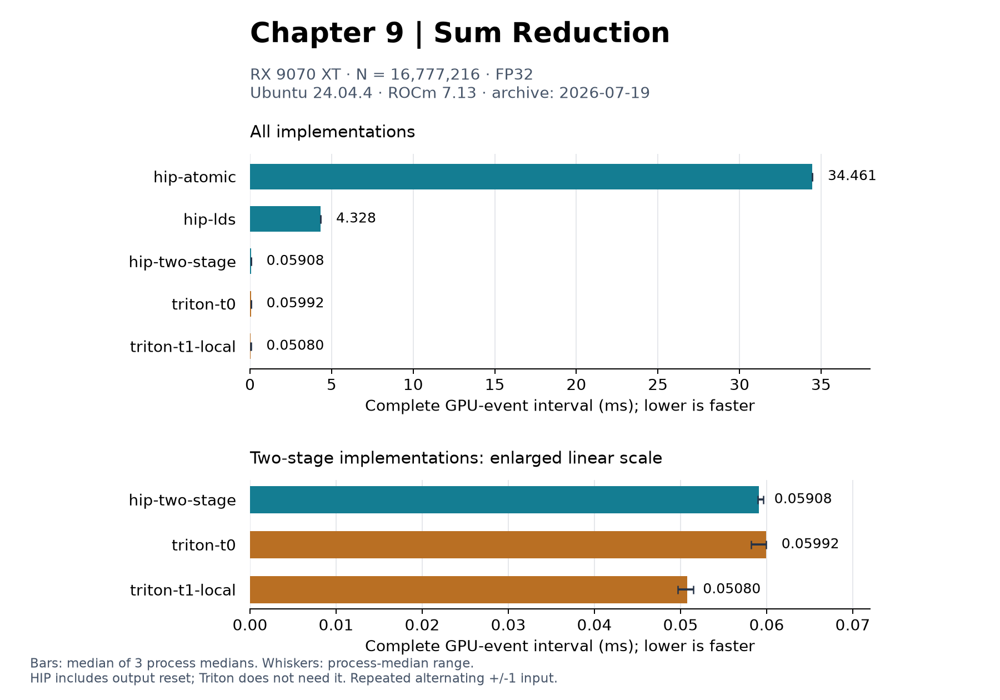

<script setup>
import ReductionJourney from './reduction-journey.vue'
import ReductionExecution from './reduction-execution.vue'
</script>

# 第9章 Reduction：归约算子

## 本章导读

第 8 章中，一个线程算完 `C[i]` 就可以写回，不必等待别的位置。现在把问题改成：**把整个数组加起来，只输出一个数。** 如果所有线程都往同一个位置写，怎样保证不丢结果？如果大家排队相加，又怎样利用并行？

我们先用 8 个数看清数据依赖，再沿着“先在局部相加，再让各组交出一个结果”的思路实现归约。读完本章，你应该能画出局部和怎样合并，指出哪里需要同步，并解释为什么计时必须覆盖整个归约过程。

可以按需要选择阅读路线：

- **先理解算法**：阅读 [求和树](#reduction-tree) 和[正确性约定](#reduction-contract)，再看[实测结果](#reduction-results)。
- **动手写 HIP**：公共部分之后进入 [HIP 实现](#ch9-hip)，重点观察 thread、LDS 与 block 的协作。
- **动手写 Triton**：公共部分之后进入 [Triton 实现](#ch9-triton)，把同一棵树对应到 program、tile 与 `tl.sum`。

配套代码在 `code/part2-kernels/chapter9/`。启动、mask 等基础沿用[第 8 章](../chapter8/index.md)，GPU event 和 trace 沿用[第 5–6 章](../../part1-profiling/chapter5/index.md)。本章保留 2026 年 7 月在 Radeon RX 9070 XT、ROCm 7.13、原生 Ubuntu 24.04 上的实验；动画使用可手算的小数组，表示算法依赖，不表示实测时间。

## 9.1 多个输入怎样合成一个输出 {#reduction-dependency}

本节先弄清共享输出为什么需要协作。求和归约（Sum Reduction）把长度为 `N` 的数组 `x` 变成一个标量：

$$
y = \sum_{i=0}^{N-1}x_i.
$$

例如 `[3, 1, 7, 0, 4, 1, 6, 2]` 的结果是 `24`。与 Vector Add 不同，这个唯一输出依赖全部输入。

设输出初值为 `0`，两个线程分别要加 `3` 和 `1`。如果它们都先读到 `0`，就会分别算出 `3` 和 `1`，随后把结果写回。最后留下哪个值取决于写入顺序；正确答案 `4` 反而可能丢失。这种不同线程未经协调访问同一位置的情况叫作**数据竞争**。

一种解法是原子加法：让一次“读旧值、相加、写回”成为不可拆开的更新。另一种解法是先把数据分组，各组算出自己的局部和，最后再合并。我们会保留两种实现，观察它们的成本。

归约还包括求最大值、求最大值的位置等操作：

| 任务 | 每次合并什么 | 越界位置贡献什么 |
| --- | --- | --- |
| Sum | 两个值相加 | `0` |
| Max | 取两个值中较大的一个 | 负无穷 |
| Argmax | 比较 `(数值, 下标)`，保留胜出的一对 | 无效候选；还需规定相等时选哪个下标 |

这里的 `0` 是加法的**单位元**：加入它不会改变结果。这个小性质随后会帮助我们处理数组尾部。

## 9.2 把串行依赖改成求和树 {#reduction-tree}

本节沿用刚才的 8 个数，逐轮观察并行相加需要等待什么。

如果从第一个数开始依次相加，需要 7 次加法，后一次依赖前一次的结果。树形方法也做 7 次加法，但可以把互不依赖的加法放在同一轮。下面按 HIP LDS 代码的顺序，将前半区与后半区配对：

| 轮次 | 本轮计算 | 留给下一轮的值 |
| --- | --- | --- |
| 输入 | — | `[3, 1, 7, 0, 4, 1, 6, 2]` |
| `stride=4` | `3+4`、`1+1`、`7+6`、`0+2` | `[7, 2, 13, 2]` |
| `stride=2` | `7+13`、`2+2` | `[20, 4]` |
| `stride=1` | `20+4` | `[24]` |

::: figure fig-reduction-tree
<ReductionJourney />

求和树逐轮缩小活动范围。前四步对应前后半区配对的 LDS 树；最后两步用同一输入演示分组 partial 与第二阶段合并。播放、单步和拖动进度条都可以观察中间值。
:::

在 @fig-reduction-tree 的第二轮开始前，`7、2、13、2` 必须已经产生。因此“并行”并没有消除依赖，而是把一条长链改成了几轮短依赖。对于 2 的幂长度，理想树深度为 `log₂N`；它没有把总加法数变成 `log₂N`，也不表示 GPU 只需要这么多个周期。

若只取前 6 个输入，把逻辑宽度补到 8 时应补两个 `0`。这样得到 `[3,1,7,0,4,1,0,0]`，最终和为 `16`。无需真的扩充数组，只需让越界位置在加载时贡献 `0`。

大数组通常不能全部交给一个 block。动画最后把输入分成两组，先得到 partial（局部结果）`11` 和 `13`，再合成 `24`。真实实现也沿用这种分层：线程先累加，组内再归约，各组写出 partial，最后用另一个 kernel 合并。

## 9.3 怎样确认答案和时间都可信 {#reduction-contract}

本节固定两条实现路线共同使用的裁判规则。

浮点加法会舍入，所以调整加法顺序可能改变结果。以 FP32 为例，数量级相差很大的数相加时，小数可能被舍去。不能因为并行树与串行 FP32 的最后几个比特不同，就直接判定实现错误。

当前实验采用以下约定：

| 项目 | 本章约定 |
| --- | --- |
| 输入与累加 | FP32，交替 `+1` 和 `-1`；`seed` 决定首项符号 |
| 参考答案 | Host 侧用 FP64 累加同一输入 |
| 校验 | 结果必须有限，绝对误差不超过 `1e-3` |
| 检查时机 | 正式计时前一次；计时后检查最后一次输出 |
| 脚本中的边界长度 | `1, 31, 32, 33, 255, 256, 257, 1027` |
| 主输入 | `N=16,777,216`，即 64 MiB FP32 输入 |

交替整数便于排除普通舍入误差，但覆盖能力有限：偶数长度的和为 `0`，某些成对漏读也可能留下相同答案。因此现有 `correct=OK` 只说明通过了这些输入，不能替代全正数、不同位置权重、宽动态范围等测试。练习会要求我们补上这些区分力更强的输入。

计时也要围住完整的输出路径：

- HIP atomic/LDS：输出清零，加上归约 kernel。
- HIP two-stage：当前代码仍执行输出清零，再运行 partial 和 final 两个 kernel。第二阶段直接写输出，清零对这一版并非数学必需，但历史时间确实包含它。
- Triton 两版：partial 与 final 两个 kernel；输出由第二阶段覆盖，不需要逐次清零。
- 分配、CPU reference 和初次数据拷贝均不计入。

HIP 每轮等待 event 完成，Triton 归约脚本则先提交多组 event 与计算，最后统一同步。两者都测完整算法的 GPU event 区间，但主机提交节奏不同；尤其比较很接近的时间时，不能把差异全部归因于语言或 kernel。

`logical_bandwidth_gbs` 使用下面的口径：

$$
B_{\text{logical}} = \frac{4N+4}{t\times 10^{-3}}\times 10^{-9}\ \text{GB/s},
$$

其中 `t` 的单位是毫秒，分子只数输入与最终输出。它没有计入 atomic 的读改写、partial buffer、清零和 LDS 访问，表示**按问题规模换算的逻辑带宽**。

## 9.4 用 HIP 或 Triton 实现同一层次 {#reduction-implementation}

本节把局部相加、组内合并、跨组合并落到代码中。先选一条路线读完整，再切换标签对照即可。

<ImplementationTabs id="ch9-implementation">
<template #hip>

### 9.4.1 HIP：从原子加法开始 {#ch9-hip}

`reduction_hip.hip` 的第一个版本让每个有效线程原子更新同一个输出。下面是源文件中的 kernel：

```cpp
__global__ void atomic_sum_kernel(const float* input, std::size_t size,
                                  float* output) {
    const std::size_t index =
        static_cast<std::size_t>(blockIdx.x) * blockDim.x + threadIdx.x;
    if (index < size) {
        atomicAdd(output, input[index]);
    }
}
```

原子操作解决丢更新的问题，但所有线程仍然竞争同一地址。在主 shape 下，它意味着 `16,777,216` 次对同一输出的原子加法。

Host 在每次调用前用 `hipMemsetAsync` 清零输出。清零放在 event 区间内，否则多次运行会持续累加旧结果。这一步不能仅靠默认偶数长度测试发现，因为该测试的和刚好为 `0`。

在已按第 1 章准备的实验环境中，先运行一个非整除长度：

```bash
cd code/part2-kernels
source ./activate-rocm.sh
hipcc --offload-arch=gfx1201 -O3 -std=c++17 \
  chapter9/reduction_hip.hip -o /tmp/reduction_hip
/tmp/reduction_hip --version atomic --size 1027 \
  --block 256 --warmup 0 --repeat 1
```

先检查 `RESULT` 中的 `correct=OK precheck=OK postcheck=OK`，再看时间。默认 seed 下，1027 个交替输入的答案应为 `1`；这是由输入构造得出的答案，不是另一次实测输出。

### 9.4.2 LDS：每个 block 只提交一个和

第二版 `hip-lds` 让一个 block 先把输入写进片上共享存储 LDS，再使用 @fig-reduction-tree 的配对方法：

```cpp
shared[thread] = index < size ? input[index] : 0.0f;
__syncthreads();

for (unsigned int stride = blockDim.x / 2; stride > 0; stride >>= 1) {
    if (thread < stride) {
        shared[thread] += shared[thread + stride];
    }
    __syncthreads();
}
if (thread == 0) {
    atomicAdd(output, shared[0]);
}
```

对于 `block=256`，活动线程数依次为 `128、64、32……1`。每轮屏障 `__syncthreads()` 保证前一轮的 LDS 写入完成后，下一轮才能读取。它必须放在 `if` 外，让整个 block 都到达；只让活动线程进入屏障会破坏这个协作约定。

主 shape 需要 `16,777,216 / 256 = 65,536` 个 block，全局原子加法随之降为 `65,536` 次。代价是增加了 LDS 访问和 block 同步。是否划算，需要看完整计时。

当前命令行要求 block 是 2 的幂，并且是设备 wavefront 大小的整数倍。数组长度本身不必满足这些条件，尾部由 `0` 补齐。

### 9.4.3 局部累加与两阶段合并

`hip-two-stage` 继续让一个线程先累加多个输入，减少需要相互协作的局部和数量。下面是源码中的 grid-stride loop：

```cpp
const std::size_t first =
    static_cast<std::size_t>(blockIdx.x) * blockDim.x + thread;
const std::size_t grid_stride =
    static_cast<std::size_t>(gridDim.x) * blockDim.x;

float local = 0.0f;
for (std::size_t index = first; index < size; index += grid_stride) {
    local += input[index];
}
```

`local` 只属于当前线程，更新它不需要线程间同步。随后代码在 wavefront 内通过 shuffle 读取其他 lane 的寄存器值：

```cpp
__device__ float wave_reduce_sum(float value) {
    for (int offset = warpSize / 2; offset > 0; offset >>= 1) {
        value += __shfl_down(value, offset);
    }
    return value;
}
```

本章调用处让完整 wavefront 的线程共同执行这个循环，最后只采用 lane 0 的总和。它不是 block 屏障，也不负责同步其他 wavefront。代码仍需让每个 wavefront 的 lane 0 写入 LDS，做一次 block 同步，再由第一个 wavefront 合并这些局部和。

::: figure fig-reduction-shuffle
<ReductionExecution scenario="shuffle" />

wavefront 内 shuffle 归约的逐步特写：`offset` 从 `warpSize/2` 逐轮折半，低 lane 读取高 lane 的寄存器值并相加，被读取的 lane 随后空闲。图为 `warpSize=32` 的 8-lane 教学缩略（真实为 16→8→4→2→1 五轮），输入与 @fig-reduction-tree 相同，动画表示算法依赖，不表示实测时间。
:::

如 @fig-reduction-shuffle 所示，每一步对应一个 `__shfl_down` offset：`lane 0` 的寄存器逐步吸收 4、2、1 号偏移位置的值，三轮之后整段的和落进一个寄存器。把这张图与 @fig-reduction-tree 对照可以看到：LDS 树和 shuffle 树是同一棵求和树在两块存储上的两种画法——前者要 block 屏障，后者只要硬件寄存器交换。

每个 block 把结果写到自己独占的 `partials[blockIdx.x]`。第一阶段结束后，同一 stream 的第二次 kernel 调用读取 partial 数组，输出最终标量。普通 block 屏障只能管一个 block；这种跨 kernel 的顺序让跨 block 合并有了明确边界。

::: figure fig-reduction-two-stage
<ReductionExecution scenario="two-stage" />

两阶段归约的完整时间线：grid-stride 局部累加 → 组内合并 → 每组交出 partial → 第二阶段 kernel 跨组合并，四个步骤对应 9.5 层次表的固定用语。图为 2 block × 4 线程、N=16 的教学缩略（真实第一阶段 grid 受 CU 数 × 8 限制），结尾给出 9070 XT 主 shape 实测。
:::

如 @fig-reduction-two-stage 所示，「先做局部工作、组内合并、每组交出结果、跨组合并」四个阶段各自把需要协作的规模缩小一层：16 个输入先变 8 个 `local`，再变 2 个 partial，最后由第二阶段一次合并。9.5 的实测将说明，这个层次差正是三个数量级时间差的来源。

默认第一阶段 grid 不超过 `CU 数 × 8`，并受完整输入需要的 block 数限制。可以用 `--grid` 覆盖这个启发式选择。程序将局部累加、shuffle 和两阶段合并放在同一个版本，因此它与 LDS 版的比较同时改变了多项机制，不能从一个加速比拆出每项改动的贡献。

</template>
<template #triton>

### 9.4.4 Triton：先让每个 program 交出一个 partial {#ch9-triton}

`reduction_triton.py` 沿用同样的两阶段划分。第一阶段的主要代码如下：

```python
program_id = tl.program_id(axis=0)
accumulator = tl.zeros((BLOCK_SIZE,), dtype=tl.float32)
first = program_id * BLOCK_SIZE
step = num_programs * BLOCK_SIZE
for tile_start in tl.range(first, size, step):
    offsets = tile_start + tl.arange(0, BLOCK_SIZE)
    values = tl.load(input_ptr + offsets, mask=offsets < size, other=0.0)
    accumulator += values
tl.store(partial_ptr + program_id, tl.sum(accumulator, axis=0))
```

`accumulator` 是长度为 `BLOCK_SIZE` 的逻辑向量。每轮加载一个 tile，逐位置加进这个向量；循环结束后，`tl.sum` 把它归约为一个标量。这里的逻辑位置不等于硬件线程，具体映射由编译器生成。

用 `BLOCK_SIZE=4`、`num_programs=2`、`N=16` 手算：program 0 先读下标 `0–3`，再读 `8–11`；program 1 先读 `4–7`，再读 `12–15`。所有输入恰好被覆盖一次。若最后一个 tile 不满，`other=0.0` 让越界位置不改变和。

第二阶段只启动一个 program：

```python
offsets = tl.arange(0, BLOCK_SIZE)
values = tl.load(
    partial_ptr + offsets,
    mask=offsets < num_partials,
    other=0.0,
)
tl.store(output_ptr, tl.sum(values, axis=0))
```

这里的 `BLOCK_SIZE` 是第二阶段的宽度。Host 将它设为不小于 `num_programs` 的最小 2 的幂，从而覆盖完整 partial 数组。

### 9.4.5 Host、校验和参数怎样连接

Host 的 `launch` 先计算第一阶段 program 数并启动 `program_partial_kernel`，再用 grid `(1,)` 启动 `second_reduction_kernel`。输入、partial、输出张量提前分配；第一次计算用来检查答案并完成 JIT，正式 benchmark 才围住这两次调用。

两个已测版本使用相同 kernel，默认逻辑块宽度都是 `1024`，`num_warps` 都是 `4`：

| 版本 | 第一阶段 program 上限 | 实际 program 数 |
| --- | ---: | --- |
| `triton-t0` | 1024 | `min(ceil(N / BLOCK_SIZE), 1024)` |
| `triton-t1-local` | 256 | `min(ceil(N / BLOCK_SIZE), 256)` |

program 少一些，每个 program 就要多处理几个 tile，第二阶段却要合并更少的 partial。这同时影响并行度与局部工作量；只看源码不能提前选出赢家。小输入若只需要一个 program，两种配置还可能相同。

运行非整除长度的完整两阶段版本：

```bash
cd code/part2-kernels
source ./activate-rocm.sh
python chapter9/reduction_triton.py --version t1 --size 1027 \
  --block 1024 --programs 256 --warmup 0 --repeat 1
```

程序在计时前后把最终标量与 FP64 CPU reference 比较，再输出 `RESULT`。ROCm 上的 PyTorch 仍使用 `device="cuda"` 和 `torch.cuda.Event` 兼容接口；启动时的 `ENV` 行会打印实际 HIP 后端版本。

</template>
</ImplementationTabs>

## 9.5 用实测结果检查归约层次 {#reduction-results}

本节把版本放回同一张表，先看局部合并是否有效，再区分结果能支持多强的解释。

下面来自 2026-07-19 的归档实验：**RX 9070 XT（gfx1201）、原生 Ubuntu 24.04.4、ROCm 7.13、PyTorch 2.11、Triton 3.6；`N=16,777,216` FP32，warmup 10 次、repeat 50 次、3 个独立进程**。每个进程先取本进程的计时中位数，表中再取三个中位数的中位数。

| 实现 | 完整路径 median（ms） | 三个进程的 median 范围（ms） |
| --- | ---: | ---: |
| `hip-atomic` | 34.460838 | 34.459259–34.461426 |
| `hip-lds` | 4.327710 | 4.326371–4.329390 |
| `hip-two-stage` | 0.059081 | 0.058961–0.059641 |
| `triton-t0` | 0.059921 | 0.058200–0.059921 |
| `triton-t1-local` | 0.050801 | 0.049680–0.051460 |

::: figure fig-reduction-performance


上半图比较全部实现，下半图用单独的线性刻度放大三种两阶段实现。误差范围来自三个进程各自的 median；这些结果只适用于本章实现、输入与计时方法。
:::

先比较 `hip-atomic` 与 `hip-lds`：每个 block 先交出一个局部和，比所有元素直接竞争输出更快，但仍落后于两阶段版本。全局竞争减少是一项由源码可确认的变化；要量化它和同步、block 数各自的成本，还需要更细的对照。

再看两种 Triton 配置：当前 shape 下，program 上限从 `1024` 调到 `256` 的版本更快。这个结果支持继续研究“多做线程局部累加、少写 partial”的方向，但不能推广为 program 越少越好。

`hip-two-stage` 与 `triton-t0` 的三个进程范围有交叠，加上提交节奏和清零差异，不适合据此宣称某种语言更快。跨路线最有价值的是对齐工作层次：

| 层次 | HIP two-stage | Triton |
| --- | --- | --- |
| 先做局部工作 | 线程的 `local` | program 的 `accumulator` 逻辑向量 |
| 组内合并 | shuffle，再合并各 wavefront 的 LDS 局部和 | `tl.sum` |
| 每组交出结果 | 一个 block 写一个 partial | 一个 program 写一个 partial |
| 跨组合并 | 第二次 kernel | 第二次 kernel |

归档中三种两阶段实现的逻辑带宽分别约为 `1136、1120、1321 GB/s`。**这不表示测出了相同数值的 GDDR6 带宽。** 当前分子只计算 `4N+4`，又重复使用同一输入；缓存状态和实际传输字节并没有被这个指标单独测出。

证据在 `code/part2-kernels/chapter9/evidence/` 的 `manifest.json`、`summary.csv` 与 `profile_summary.csv`；来源源码为 `ef1722a6743bc0a9d6528d1fa938ad64976f0c05`。文件中的 `chapter8-process-*` 是章节重排前的日志名，归档内容对应本章 Sum Reduction。

## 9.6 复跑时先检查结果，再读 trace {#reduction-rerun}

本节把运行入口与观察顺序连起来。在项目根目录进入已准备的 Part 2 环境：

```bash
cd code/part2-kernels
uv sync
WARMUP=10 REPEAT=50 bash chapter9/run_all.sh
```

脚本先跑 8 个边界长度，再跑主 shape 的全部实现。原有脚本默认是 warmup 5 次、repeat 20 次；上面显式覆盖为性能表采用的 10/50。输出中的 `Chapter 8` 是保留的旧编号，识别结果应看 `operator=sum-reduction` 与 `implementation`。

读 `RESULT` 时依次核对：正确性字段、shape、版本和参数、`stages`/`partials`，最后才比较 `median_ms`。比较改动前后时，还要保持输入与 event 边界一致。

独立 profiler 脚本位于 `chapter9/profile_all.sh`。它要求 `SOURCE_COMMIT` 记录所测源码版本；在本地确定版本后随代码传到实验机，不在实验机运行 git。归档 profile 使用 `warmup=0`、`repeat=5`，与性能实验分开运行。

trace 里不仅有算法主体，还可能有清零、拷贝、预检等 dispatch。HIP 两阶段的两个阶段复用同名 `local_wave_partial_kernel`，要结合记录顺序和输入规模区分；Triton 则分别叫 `program_partial_kernel` 和 `second_reduction_kernel`。

现有汇总对部分 grid、workgroup 和 VGPR 字段记为 `unavailable`；LDS 字段中出现的 `0` 也不足以否定源码中的动态 LDS。不能用缺失或未核实字段推导占用率，更不能拿整个进程的 dispatch 总数充当每次归约的阶段数。

## 9.7 练习：改变一个条件再解释 {#reduction-exercises}

1. 把动画输入改为前 6 个数，用宽度 8 的树手算。若错误地补两个 `1`，最终答案会变成多少？解释单位元为什么是算法的一部分。
2. 构造一个能暴露“漏读两个相邻输入”的测试。比较交替 `+1/-1` 与全 `1` 输入，说明为什么同样的错误可能只被后一种发现。
3. 保持输入、block、repeat 不变，改变 HIP grid 或 Triton program 上限。运行前预测 partial 数，运行后同时记录第一阶段与第二阶段的成本；不要只保存最快一组。
4. 实现 Max Reduction，用全负数组检验越界填充值。若把初值设成 `0`，哪种输入会让错误暴露？
5. 用宽动态范围 FP32 数据比较不同加法顺序与 FP64 reference。报告绝对误差和适合该数据尺度的相对误差，区分舍入差异与遗漏输入。

<details>
<summary>自检提示：前三题先不依赖 GPU 也能推敲</summary>

前 6 个数的和为 `16`；补两个 `1` 会错误地得到 `18`。交替正负数中，漏掉一对 `+1/-1` 不改变总和，而全 `1` 会少 `2`。增加局部工作可以减少 partial 数，但也可能减少可并行执行的组，因此时间不能仅由 partial 数决定。

</details>

## 本章小结

归约把多输入合成少输出，首先需要协调共享更新。树形相加保留总工作量，同时缩短依赖链；线程局部累加、组内合并和跨组合并，让这棵树适应 GPU 的执行层次。

HIP 显式表达线程、shuffle、LDS 与屏障，Triton 用逻辑向量和 `tl.sum` 表达组内归约。两条路线都要覆盖尾部、保存完整 partial，并计时到最终输出完成。测试数据和计时边界同样决定我们能下什么结论。

下一章把本章的 max、sum 归约与逐元素指数、除法接起来，实现[逐行 Softmax](../chapter10/index.md)。那时我们会面对一个新问题：同一行已经读进来了，中间结果还需要写回全局内存吗？

## 延伸阅读

- [HIP Kernel Language](https://rocm.docs.amd.com/projects/HIP/en/latest/reference/kernel_language.html)：原子操作、共享存储与同步语义。
- [Triton `tl.sum`](https://triton-lang.org/main/python-api/generated/triton.language.sum.html)：归约维度与累加类型。
- [第 6 章：用 rocprof 找到慢点](../../part1-profiling/chapter6/index.md)：trace 筛选与字段解释。
