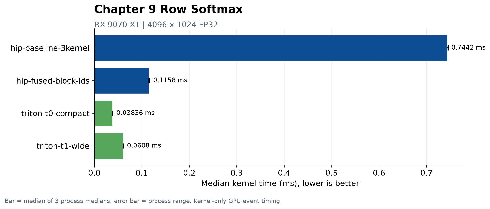

# 第9章 Normalization：归一化算子

## 本章目标、前置知识与产物

> Softmax 看起来只是“取指数再除以总和”，实际却把逐元素计算、两种归约和数值稳定性放进了同一行数据里。它非常适合用来学习融合：究竟少了哪次 launch、哪块中间内存，又付出了什么同步与资源代价？

第 7 章的 Vector Add 中，每个输出只依赖同位置输入；第 8 章开始讨论多个输入共同得到一个结果。Softmax 把两者接起来：一行先求最大值，再逐元素取指数，再求和，最后逐元素归一化。

学完本章，你应该能够：

- 从二维张量上准确写出“逐行 Softmax”的语义；
- 用手算解释为什么必须先减去行最大值；
- 把 Softmax 拆成 `max → exp → sum → normalize` 四个基本模式；
- 读懂 HIP 三 kernel baseline 与 block+LDS 融合版的数据流；
- 读懂 Triton“一行一个 program”、mask、`BLOCK_SIZE` 与 `num_warps`；
- 用正确性、GPU event 和 kernel trace 区分事实、假设与待验证结论。

本章配套代码位于：

```text
code/part2-kernels/chapter9/
├── run_all.sh
├── softmax_hip.hip
└── softmax_triton.py
```

::: warning 首版实验状态
本章已经在 Radeon RX 9070 XT、ROCm 7.13、原生 Ubuntu 24.04 上完成边界正确性、3 个独立正式进程和逐实现 profiling。下文的性能结论只对应 `4096×1024` FP32 与已提交 evidence，不外推到其他列数或 dtype。
:::

## 9.1 逐行 Softmax 到底算什么

### 9.1.1 先固定轴与形状

设输入 `X` 是一个 `R × C` 的 FP32 矩阵。对每一行 `r`，Softmax 沿列维度独立计算：

$$
Y_{r,c} = \frac{e^{X_{r,c}}}{\sum_{j=0}^{C-1}e^{X_{r,j}}},
\qquad 0 \le r < R,\ 0 \le c < C
$$

“逐行”有两个重要含义：

1. 同一行的所有输出共享同一个分母，所以列之间不是独立的；
2. 不同行之间互不依赖，所以行可以并行。

每行输出还有两个可检查的不变量：

$$
Y_{r,c} \ge 0, \qquad \sum_{c=0}^{C-1}Y_{r,c} \approx 1
$$

这里写“约等于”是因为 FP32 加法顺序会影响最后几个比特。实现不能只检查逐元素误差，还应该检查每行和是否接近 1。

### 9.1.2 用三个数手算

取一行 logits：

```text
X = [2, 1, 0]
```

先取指数：

```text
exp(X) ≈ [7.3891, 2.7183, 1.0000]
sum    ≈ 11.1074
```

再除以总和：

```text
softmax(X) ≈ [0.6652, 0.2447, 0.0900]
```

三个输出都非负，和约等于 1。最大的 logit 得到最大概率，但 Softmax 没有把其他位置直接变成 0。

### 9.1.3 加同一个常数，结果不变

对一行所有元素同时减去常数 `a`：

$$
\frac{e^{X_c-a}}{\sum_j e^{X_j-a}}
= \frac{e^{X_c}/e^a}{\sum_j e^{X_j}/e^a}
= \frac{e^{X_c}}{\sum_j e^{X_j}}
$$

这条“平移不变性”是稳定 Softmax 的依据。我们可以选择最有利的 `a`，而不改变数学结果。

## 9.2 为什么直接取指数会溢出

### 9.2.1 大正数：`inf / inf` 不是概率

考虑：

```text
X = [1000, 1001, 1002]
```

FP32 最大有限值约为 `3.4 × 10^38`，其自然对数约为 `88.7`。`exp(1000)` 远远超过这个范围。直接计算时，三个指数都会溢出成 `inf`：

```text
exp(X) = [inf, inf, inf]
sum    = inf
output = [inf/inf, inf/inf, inf/inf] = [NaN, NaN, NaN]
```

这不是“小误差”，而是结果完全失效。

### 9.2.2 减最大值后手算一次

选择 `a = max(X) = 1002`：

```text
X - max(X)       = [-2, -1, 0]
exp(X - max(X))  ≈ [0.1353, 0.3679, 1.0000]
sum              ≈ 1.5032
output           ≈ [0.0900, 0.2447, 0.6652]
```

减最大值以后，最大的指数一定是 `exp(0)=1`，其余指数落在 `(0, 1]`。这消除了大正数指数溢出；分母至少包含一个 1，也不会因为所有项都下溢为 0 而变成 0。

### 9.2.3 大负数同样需要稳定公式

对 `[-1002, -1001, -1000]` 直接取指数，三个值都可能下溢为 0，最后得到 `0/0`。减去最大值 `-1000` 后仍然得到 `[-2,-1,0]`，所以结果与上一例相同。

因此，本章所有实现都固定使用：

$$
m_r = \max_j X_{r,j}
$$

$$
s_r = \sum_j e^{X_{r,j}-m_r}
$$

$$
Y_{r,c} = \frac{e^{X_{r,c}-m_r}}{s_r}
$$

::: tip 稳定公式解决什么，不解决什么
减最大值解决的是有限输入下的指数范围问题。若输入本身已经含有 `NaN` 或正负无穷，需要单独定义传播策略；本章程序的输入契约是“有限 FP32 logits”。
:::

## 9.3 拆成四种基本模式

把稳定 Softmax 拆开，数据依赖会更清楚：

| 阶段 | 数学操作 | 模式 | 每行输出规模 |
| ---- | ---- | ---- | ----: |
| 1. max | `m = max(x)` | Reduction | 1 |
| 2. exp | `p[c] = exp(x[c] - m)` | Element-Wise | `C` |
| 3. sum | `s = sum(p)` | Reduction | 1 |
| 4. normalize | `y[c] = p[c] / s` | Element-Wise | `C` |

这四步带来两个共享值：行最大值 `m` 与行和 `s`。不同实现的核心差别不是公式，而是：

- `m`、`s` 与中间指数 `p` 放在全局内存、寄存器还是 LDS；
- 一行由一个线程、一个 block，还是一个 Triton program 负责；
- 四个逻辑阶段要启动几次 kernel；
- 两次归约如何让多个线程协作。

### 9.3.1 一个直观但昂贵的多 kernel 数据流

```text
input[R,C]
   │
   ├─ kernel 1: row max ───────────────> row_max[R]
   │
   ├─ kernel 2: exp + row sum ─────────> exp_tmp[R,C] + row_sum[R]
   │
   └─ kernel 3: normalize(exp_tmp/sum) ─> output[R,C]
```

这个布局容易检查：每个阶段都有可见中间结果。但它需要多次 launch，并把 `exp_tmp` 完整写入再读回全局内存。

### 9.3.2 融合不等于“所有东西都只读一次”

本章 HIP 融合版用一个 block 完成一行：

```text
一行 input
  → 每线程局部 max → LDS 归约 max
  → 每线程局部 exp sum → LDS 归约 sum
  → 写 output
```

它不分配 `exp_tmp`，也只 launch 一次。不过教学实现为了避免把任意长的一行全部放进 LDS，会在三个阶段重新读取输入并重新计算最后一次 `exp`。所以准确结论是：**它消除了全局中间指数写回和两次 launch，而不是保证输入只读一次。**

## 9.4 先固定正确性与计时口径

### 9.4.1 同一份裁判规则

HIP 与 Triton 程序采用相同的实验契约：

| 项目 | 规则 |
| ---- | ---- |
| 语义 | 二维 FP32 输入，沿最后一维逐行 Softmax |
| 参考 | HIP 使用 CPU 稳定 Softmax；Triton 使用 CPU `torch.softmax(..., dim=1)` |
| 输入 | 确定性有限值，并按行叠加 `+1000`、`-1000`、`0` 测试平移稳定性 |
| 元素误差 | `max_abs_error <= 2e-5` |
| 行和误差 | `max(abs(sum(row)-1)) <= 2e-5` |
| 检查时机 | 正式计时前一次，计时后一次 |
| 计时范围 | 只包围候选 kernel dispatch，不含分配、CPU reference 和拷贝 |
| 输出 | 与第 7 章一致的 `ENV` 与 `RESULT key=value` 行 |

不同归约树会改变 FP32 加法顺序，因此 fused 版不应要求逐比特等于串行 CPU 参考。容差是正确性门槛，不是“误差越接近门槛越好”的性能指标。

### 9.4.2 为什么要测非二次幂列数

真实列数不总是 `32`、`256` 或 `1024`。本章脚本覆盖：

```text
1, 31, 32, 33, 255, 257 columns
```

这些 shape 分别触发单元素行、wave 边缘、跨 wave、block 边缘和非二次幂尾部。HIP 用 `column < columns` 的循环条件保护尾部；Triton 用 mask 把补齐位置排除在 load/store 之外。

## 9.5 HIP baseline：把三次 dispatch 看清楚

配套文件 `softmax_hip.hip` 中的 `hip-baseline-3kernel` 是稳定的多 kernel baseline。它不是性能模板，而是让阶段边界清晰可见的正确性起点。

### 9.5.1 Kernel 1：每个线程串行求一行最大值

```cpp
const std::size_t row =
    static_cast<std::size_t>(blockIdx.x) * blockDim.x + threadIdx.x;
if (row >= rows) return;

float maximum = negative_infinity;
for (std::size_t column = 0; column < columns; ++column) {
    maximum = fmaxf(maximum, input[row * columns + column]);
}
row_max[row] = maximum;
```

一个 thread 负责一整行，因此不需要线程间同步。这种映射非常直白，但长行只有一个 thread 工作，不能利用行内并行。

### 9.5.2 Kernel 2：计算指数并串行累加

第二个 kernel 读取 `row_max[row]`，把稳定指数写入 `exp_tmp[R,C]`，同时得到 `row_sum[row]`：

```cpp
float sum = 0.0F;
for (std::size_t column = 0; column < columns; ++column) {
    const float value = expf(input[base + column] - row_max[row]);
    exponentials[base + column] = value;
    sum += value;
}
row_sum[row] = sum;
```

`exp_tmp` 是 baseline 最显眼的全局中间张量。它让第三阶段简单，也让 profiler 能分别看到各阶段；代价等待实测量化。

### 9.5.3 Kernel 3：逐元素归一化

最后一个 kernel 回到常见的一线程一元素映射：

```cpp
if (index < rows * columns) {
    output[index] = exponentials[index] / row_sum[index / columns];
}
```

这里的 `index / columns` 把扁平元素下标映射回行号。由于总元素数可能不是 block size 的整数倍，`index < elements` 仍然不能省略。

### 9.5.4 baseline 的价值与局限

它准确表达了稳定公式，并提供可观察的中间边界；同时存在明显的待验证成本：

- 三次 kernel launch；
- 一次完整 `exp_tmp` 写入和读回；
- 两个归约阶段由单线程串行完成；
- 行很少时，并行度可能不足。

这些是由源码可以确认的结构事实。它们是否主导总时间、各自占多少比例，必须等 kernel trace 和实测数据回答。

## 9.6 HIP 行融合：一个 block 完成一行

`hip-fused-block-lds` 把一行分给一个 HIP block。假设 `block=256`，线程 `t` 访问：

```text
column = t, t + 256, t + 512, ...
```

因此相邻线程在每一轮访问相邻列；`columns` 不是 256 的整数倍时，最后一轮自然由循环条件裁掉。

### 9.6.1 第一次归约：局部 max → LDS max

每个线程先在寄存器中得到自己的 `local_maximum`，再把它写到动态 LDS：

```cpp
shared[lane] = local_maximum;
__syncthreads();

for (unsigned int stride = blockDim.x / 2; stride > 0; stride /= 2) {
    if (lane < stride) {
        shared[lane] = fmaxf(shared[lane], shared[lane + stride]);
    }
    __syncthreads();
}
```

每轮活动线程减半，最终 `shared[0]` 是行最大值。`__syncthreads()` 保护的是整个 block：下一轮不能在上一轮所有写入完成前开始。

### 9.6.2 第二次归约：局部 sum → LDS sum

拿到最大值后，每个线程沿自己的列序列计算稳定指数并累加到 `local_sum`。同一块 LDS 被复用，再执行一次加法树归约，得到分母。

### 9.6.3 最后写回

每个线程再次沿相同列序列计算：

```cpp
output[base + column] =
    expf(input[base + column] - maximum) / denominator;
```

这里重新计算 `exp` 是有意的空间—计算权衡：它避免分配 `R×C` 的全局 `exp_tmp`，也不要求一整行都能塞入 LDS。重算是否值得，要由目标 shape 上的实测决定。

## 9.7 Wave32、LDS 与融合边界

### 9.7.1 当前版本没有使用 wave shuffle

目标 GPU 以 Wave32 执行线程，但当前融合 kernel 使用的是**整个 block 的 LDS 树归约**。即使一个 block 包含多个 wave，`__syncthreads()` 也会让它们在每一轮正确会合。

这意味着不能把当前版本描述成“wave-level Softmax”。后续可以先在每个 wave 内用 shuffle 归约，再让少量 wave partial 进入 LDS；那是新的受控实验，不属于本章首版代码。

### 9.7.2 为什么 block 必须是二次幂

当前循环从 `blockDim.x / 2` 逐轮减半，并配对 `lane` 与 `lane + stride`。为使所有槽位都被归约，CLI 明确要求：

```text
block ∈ {1, 2, 4, ..., 1024}
```

列数本身不需要是二次幂。没有真实列可读的线程把 max 初值贡献为负无穷，把 sum 初值贡献为 0，所以 `C=33` 配 `block=256` 仍然正确。

### 9.7.3 LDS 容量不是唯一边界

当前 kernel 只申请 `block × sizeof(float)` 的动态 LDS；`block=256` 时逻辑申请量是 1024 Byte。这个数能从源码计算，但 occupancy、VGPR、scratch 和实际驻留 block 数不能只靠源码断言，需读取编译/profile 结果。

不同 shape 还会碰到不同边界：

| Shape 特征 | 当前映射可能出现什么 | 应观察什么 |
| ---- | ---- | ---- |
| `C << block` | 很多线程只贡献归约单位元 | 有效 lane 比例、launch/同步占比 |
| `C ≈ block` | 每线程约处理一个元素 | LDS 归约成本与访存 |
| `C >> block` | 每线程循环多次 | `exp` 吞吐、寄存器与循环成本 |
| `R` 很小 | 可启动的 block 很少 | GPU 是否吃满、短任务延迟 |
| `R` 很大 | 行级 block 数充足 | 总吞吐与内存访问 |

“融合更多”不自动等于“更快”。融合可能减少全局中间写回与 launch，也可能增加单 kernel 的同步、寄存器压力或重复计算。

## 9.8 Triton：一行对应一个 program

Triton 版本把 HIP 中“一个 block 协作完成一行”的意图写成“一行一个 program”：

```python
row = tl.program_id(axis=0)
offsets = tl.arange(0, BLOCK_SIZE)
valid = offsets < columns

logits = tl.load(
    input_ptr + row * input_row_stride + offsets,
    mask=valid,
    other=-float("inf"),
)
maximum = tl.max(logits, axis=0)
numerator = tl.exp(logits - maximum)
denominator = tl.sum(numerator, axis=0)
probabilities = numerator / denominator
tl.store(output_ptr + row * output_row_stride + offsets,
         probabilities, mask=valid)
```

### 9.8.1 program 不等于硬件线程

grid 是 `(rows,)`，所以每行启动一个 program instance。这个 program 在源码里操作一个长度为 `BLOCK_SIZE` 的向量；向量怎样映射到底层线程与指令，由 Triton 编译器完成。

因此下面两句话不能混用：

```text
HIP:    一个 block 有 blockDim.x 个显式线程
Triton: 一个 program 有 BLOCK_SIZE 个逻辑位置
```

### 9.8.2 为什么补到下一个二次幂

若 `columns=257`，t0 选择 `BLOCK_SIZE=512`。逻辑下标 `0–256` 有效，`257–511` 是填充位置。load 时用 `-inf` 填充：

- `max(real values, -inf)` 不改变最大值；
- `exp(-inf - maximum)=0`，不改变分母；
- store mask 防止向行尾之外写入。

这就是 Triton 对非二次幂列数的边界处理。mask 不只是防越界，它还为归约提供了正确的单位元。

### 9.8.3 t0 与 t1 的受控参数实验

脚本至少运行两种配置：

| 版本 | 默认 `BLOCK_SIZE` | 默认 `num_warps` | 想比较什么 |
| ---- | ---- | ----: | ---- |
| `triton-t0-compact` | `next_power_of_2(cols)` | 4 | 覆盖一行所需的最小逻辑块 |
| `triton-t1-wide` | 可行时为 t0 的 2 倍，最大 65536 | 8 | 更多填充位置与更多 warps 的组合 |

这是一个配置对照，不是“t1 一定更优”。更大的 block 可能改变生成代码、寄存器使用和调度，也会让更多无效位置参与逻辑计算；更多 warps 可能提高并行性，也可能增加资源压力。

若想单独控制 t1：

```bash
python chapter9/softmax_triton.py \
  --version t1 --rows 4096 --cols 1024 \
  --t1-block 2048 --t1-warps 8 --warmup 10 --repeat 50
```

当前单 program 实现要求 `cols <= 65536`。更长的行需要分块/在线 Softmax 或多阶段算法，不能简单继续扩大 `BLOCK_SIZE`。

## 9.9 稳定性与边界测试矩阵

不要只拿随机小数跑一次。下面的矩阵分别针对数学稳定性、mask 和并行边界：

| 输入或 shape | 不稳定公式的风险 | 稳定实现应满足什么 | 当前脚本 |
| ---- | ---- | ---- | ---- |
| `[1000,1001,1002]` | `exp` 溢出，出现 NaN | 有限，且等价于 `[-2,-1,0]` | 用 `+1000` 行覆盖 |
| `[-1002,-1001,-1000]` | 全部下溢为 0，出现 `0/0` | 有限，且等价于 `[-2,-1,0]` | 用 `-1000` 行覆盖 |
| `x` 与 `x+常数` | 实现若不稳定会分叉 | 两行结果在容差内一致 | 三种行偏移可扩展检查 |
| `C=1` | 分母与分子相同 | 输出严格接近 1 | 自动覆盖 |
| `C=31/32/33` | wave 边缘与 mask 错误 | 无越界，行和接近 1 | 自动覆盖 |
| `C=255/257` | block/二次幂尾部错误 | 所有列与参考一致 | 自动覆盖 |
| `C=4097` | 更长的线程循环/逻辑块 | 正确；性能结论待测 | 建议练习 |
| 相同最大值出现多次 | max 归约次序变化 | 概率相等且有限 | 建议练习 |

当前程序只实现 FP32。FP16/BF16 练习必须明确“输入/输出 dtype”和“max、sum 的累加 dtype”；不能只把指针类型替换后沿用 FP32 误差阈值。

## 9.10 HIP 与 Triton 对照

| 问题 | HIP 三 kernel baseline | HIP block+LDS fused | Triton 一行一 program |
| ---- | ---- | ---- | ---- |
| 行的分工 | 一个 thread 串行处理一行归约 | 一个 block 协作处理一行 | 一个 program 描述一行逻辑向量 |
| dispatch | 3 | 1 | 1 |
| 中间指数 | 全局 `exp_tmp[R,C]` | 不保存，最后重算 | program 内逻辑值 |
| 行 max/sum | 全局 `row_max/row_sum` | LDS 中归约并复用 | `tl.max` / `tl.sum` |
| 尾部 | 标量循环/元素 `if` | 线程跨步循环条件 | load/store mask |
| block 限制 | block 控制行线程或元素线程 | 当前树归约要求二次幂 | `BLOCK_SIZE` 覆盖整行且为二次幂 |
| 显式控制 | grid、thread、LDS、同步 | 同左，且控制归约树 | program、逻辑 block、warps；底层映射由编译器生成 |
| 适合作为 | 阶段清晰的正确性起点 | 学习融合与协作归约 | 快速表达整行融合与参数实验 |

两条路线最终必须回答同一组问题：

```text
一行交给谁？
最大值在哪里产生？
分母在哪里产生？
中间指数有没有写入全局内存？
尾部如何排除？
完整路径怎样计时和验证？
```

源码更短不等于运行成本更低，控制更显式也不等于自动更快。目标机器上的 `RESULT` 与 trace 才能决定当前 shape 的结论。

## 9.11 运行与读取结果

### 9.11.1 一次运行全部边界与主 shape

在项目根目录执行：

```bash
cd code/part2-kernels
uv sync
bash chapter9/run_all.sh
```

`activate-rocm.sh` 会激活 `code/part2-kernels/.venv` 并暴露其中的 ROCm SDK。`run_all.sh` 随后：

1. 用 `hipcc` 编译 HIP 程序到临时目录；
2. 对六组边界 shape 运行 HIP 与 Triton 的全部版本；
3. 对默认 `4096×1024` 主 shape 预热 10 次、计时 50 次；
4. 每个版本在计时前后检查参考结果；
5. 退出时删除临时 HIP 二进制。

覆盖默认参数：

```bash
ROWS=8192 COLS=257 HIP_BLOCK=128 WARMUP=5 REPEAT=20 \
  bash chapter9/run_all.sh
```

若只想快速检查主 shape：

```bash
RUN_EDGE_CASES=0 WARMUP=2 REPEAT=5 bash chapter9/run_all.sh
```

### 9.11.2 分别运行 HIP 与 Triton

```bash
cd code/part2-kernels
source activate-rocm.sh

hipcc --offload-arch=gfx1201 -O3 -std=c++17 \
  chapter9/softmax_hip.hip -o /tmp/softmax_hip

/tmp/softmax_hip --version all --rows 4096 --cols 1024 \
  --block 256 --warmup 10 --repeat 50

python chapter9/softmax_triton.py --version all \
  --rows 4096 --cols 1024 --warmup 10 --repeat 50
```

输出不会内置任何预期毫秒数。应先确认：

```text
correct=OK precheck=OK postcheck=OK
```

然后才比较同一 shape、同一 warmup/repeat 下的 `median_ms`。关键字段包括：

| 字段 | 含义 |
| ---- | ---- |
| `implementation` | 具体 baseline/fused 或 t0/t1 |
| `shape` | `rows×cols`，比较时必须相同 |
| `launches` | HIP 单次逻辑调用的 kernel 数 |
| `block` / `num_warps` | 当前启动配置 |
| `timing=gpu-event` | kernel 区间由 GPU event 测量 |
| `max_abs_error` | 相对参考结果的最大绝对误差 |
| `max_row_sum_error` | 所有行中最大的归一化和误差 |

## 9.12 用 rocprofv3 看融合发生在哪里

正式 benchmark 与 profile 使用独立入口，避免 profiler 开销混入 GPU event 计时：

```bash
cd code/part2-kernels
export SOURCE_COMMIT="$(git rev-parse HEAD)"
PROFILE_WARMUP=0 PROFILE_REPEAT=5 bash chapter9/profile_all.sh
```

`profile_all.sh` 会在 `chapter9/profiles/` 写 HIP 与 Triton 的 kernel trace CSV。也可以对单版本手动采集：

```bash
rocprofv3 \
  --kernel-trace \
  --output-directory chapter9/profiles \
  --output-file softmax-hip-fused \
  --output-format csv \
  -- /tmp/softmax_hip --version fused --rows 4096 --cols 1024 \
     --block 256 --warmup 0 --repeat 5
```

第一次看 trace，先回答下面四个问题：

1. baseline 的 `row_max_serial`、`row_exp_sum_serial`、`normalize_rows` 是否分别出现？
2. fused 的一次逻辑调用是否只出现 `softmax_fused_lds`？
3. 同一版本的单次 dispatch 时间分布是否稳定，是否有明显首次编译/冷启动影响？
4. profiler 可用字段中，workgroup、LDS、VGPR、scratch 是否与假设一致？不可用字段要明确记为不可用。

::: warning 不要把 trace 中的总 dispatch 数误读成算法阶段数
程序在预检、warmup 和正式 repeat 中会启动 kernel；后检只拷贝并检查最后一次计时结果，不额外启动 Softmax kernel。baseline 每次逻辑调用有 3 个 dispatch，fused 有 1 个；解读总数前先对照 CLI 的 `warmup`、`repeat` 和程序流程。
:::

首轮远端实验建议保存：环境版本、完整命令、原始 `RESULT`、trace 路径和源代码 commit。没有这些信息，单独抄一个毫秒数无法复现。

## 9.13 练习

### 练习 1：验证平移不变性

在 CPU 参考中构造 `x`、`x+1000` 与 `x-1000` 三行，逐元素比较输出。然后故意换成直接 `exp(x)/sum(exp(x))`，记录哪一行首先出现非有限值。

**成功标准：**稳定版本三行在容差内一致；不稳定版本明确暴露 `inf`、0 或 NaN，而不是静默通过。

### 练习 2：记录 shape 扫描，不挑赢家

固定 `rows=4096`，扫描：

```text
cols = 31, 32, 33, 255, 256, 257, 1024, 4097
```

记录四个实现的正确性与 median，不删掉“参数变大反而变慢”的结果。

**成功标准：**每条记录都有 shape、实现名、参数、GPU event 时间和校验字段；若某配置编译失败，也原样记录错误与限制。

### 练习 3：只替换 HIP 归约收尾

保持“一 block 一行”和线程访问映射不变，把 LDS 全树归约改为：wave 内 shuffle 得 partial，再用 LDS 合并各 wave partial。

**成功标准：**先证明边界 shape 正确，再用 trace 比较同步、LDS 与资源字段；不能同时改 block、输入或计时次数。

### 练习 4：比较重算与保存指数

为中等列数实现一个保存局部指数的版本。先计算它实际需要的寄存器/LDS 空间，再决定支持的最大 `cols`。

**成功标准：**文档明确写出空间上限和溢出时的处理，不允许越过 LDS 或数组边界。

### 练习 5：扩展到混合精度

输入输出改为 FP16 或 BF16，但 max 与 sum 保留 FP32 累加，并与 PyTorch 参考比较。

**成功标准：**分别报告输入/输出 dtype、累加 dtype、误差阈值与失败 shape；不要沿用本章 FP32 阈值却不解释。

## 正式实验结果



主 shape 为 `4096×1024` FP32。HIP 三 kernel baseline 为 `0.744228 ms`，融合 LDS 版为 `0.115781 ms`；Triton compact/wide 分别为 `0.038361/0.060801 ms`。当前 shape 上 `t1-wide` 反而慢于 `t0-compact`，因此“更宽 block/更多 warps”被记录为负结果，而不是默认优化。

完整记录见 `code/part2-kernels/chapter9/EXPERIMENT.md`。

## 本章小结

- 逐行 Softmax 的列之间共享最大值和分母，行之间可以并行。
- 直接计算指数会在大正数上溢出、在大负数上下溢；减去行最大值利用平移不变性得到稳定公式。
- Softmax 可以拆成 `max reduction → exp → sum reduction → normalize`。
- HIP 三 kernel baseline 把阶段和全局中间张量显式展开；融合版用一个 block、两次 LDS 归约完成一行，并通过重算指数避免 `exp_tmp`。
- Wave32 是硬件执行背景，但当前 HIP 首版是 block 级 LDS 算法，不应误称为 wave shuffle 优化。
- Triton 用一个 program 描述一整行，`BLOCK_SIZE` 与 mask 负责逻辑覆盖，`num_warps` 是需要实测的编译/调度参数。
- 非二次幂列、极大正负平移、单元素行、长行和 dtype 都属于正确性矩阵，而不是附加项。
- 本章已完成实现、边界检查、3 个独立正式进程、逐实现 profile 与 curated evidence。

## 延伸阅读

- [Triton Fused Softmax 教程](https://triton-lang.org/main/getting-started/tutorials/02-fused-softmax.html)：官方的一行一个 program 教学实现；本章的 program 映射只描述当前实现，不代表所有 Softmax kernel。
- [Triton `tl.max` API](https://triton-lang.org/main/python-api/generated/triton.language.max.html) 与 [`tl.sum` API](https://triton-lang.org/main/python-api/generated/triton.language.sum.html)：两次归约的语言语义。
- [AMD HIP Kernel Language](https://rocm.docs.amd.com/projects/HIP/en/latest/reference/kernel_language.html)：LDS、同步和 kernel 内建变量。
- [`rocprofv3` 使用文档](https://rocm.docs.amd.com/projects/rocprofiler-sdk/en/latest/how-to/using-rocprofv3.html)：kernel trace 的官方命令说明。
- [第 7 章 Element-Wise：逐元素算子](../chapter7/index.md)
- [第 8 章 Reduction：归约算子](../chapter8/index.md)
- [第 5 章 用 rocprof 找到慢点](../../part1-profiling/chapter5/index.md)
