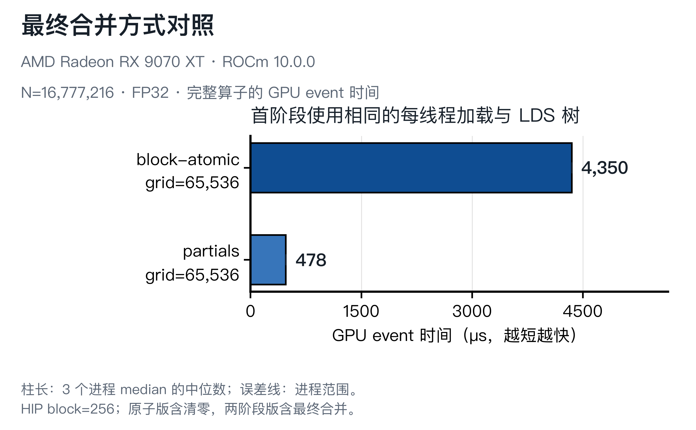
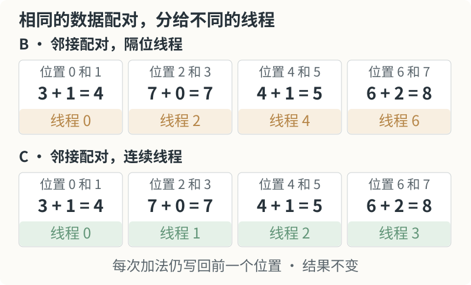
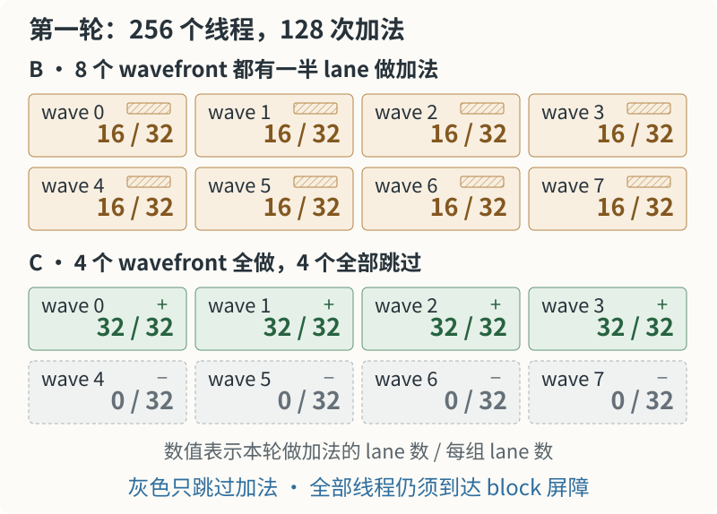
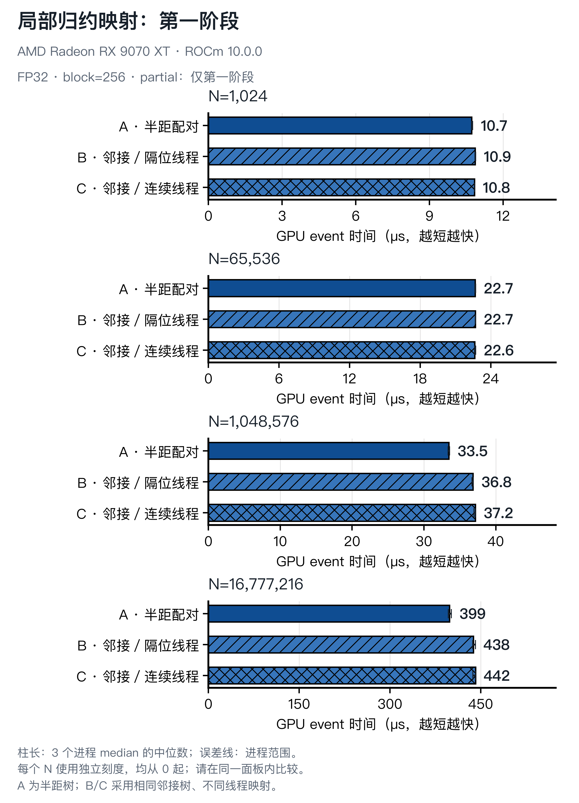
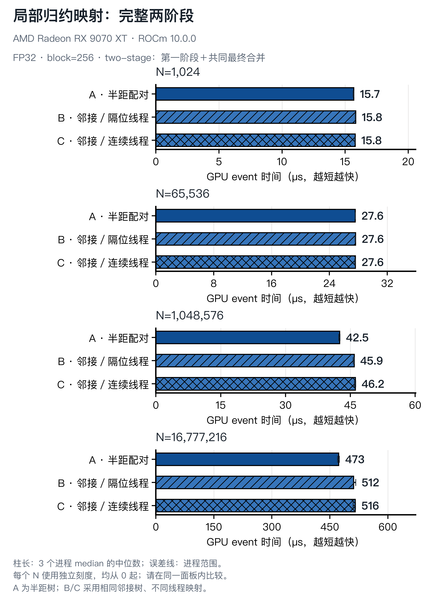
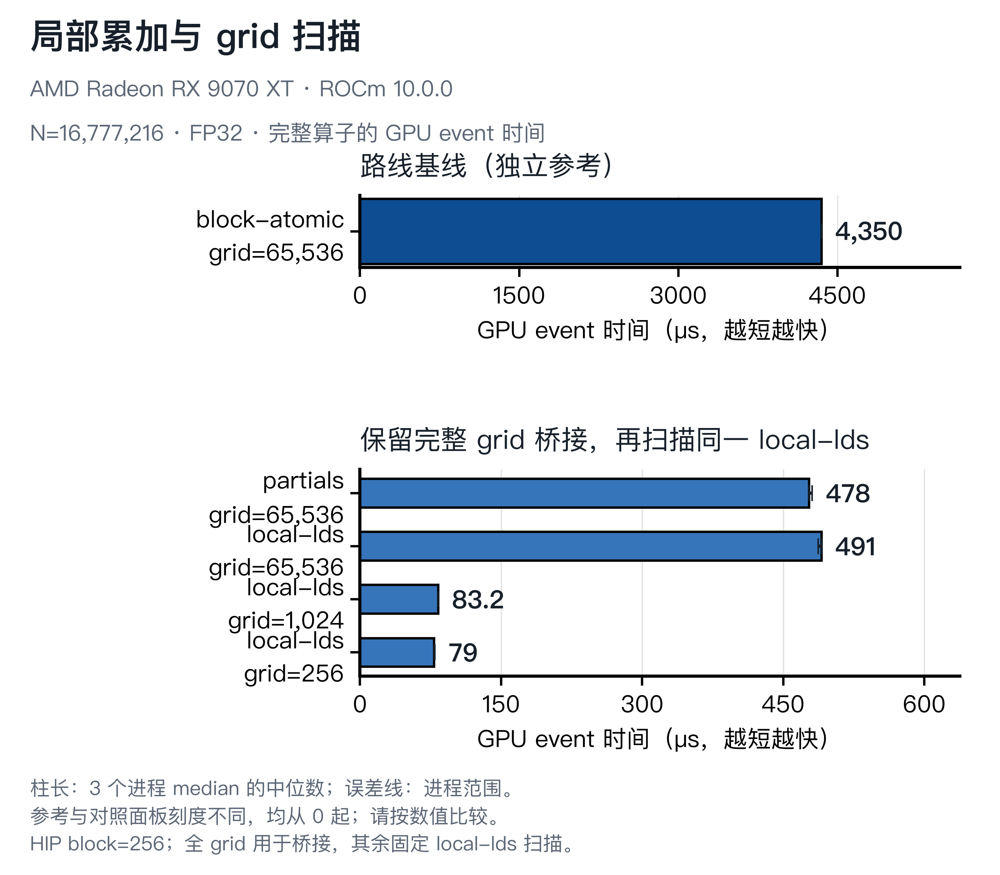
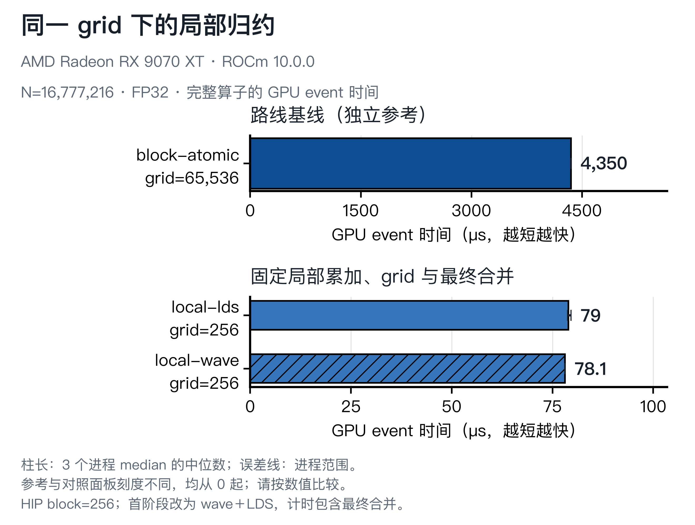
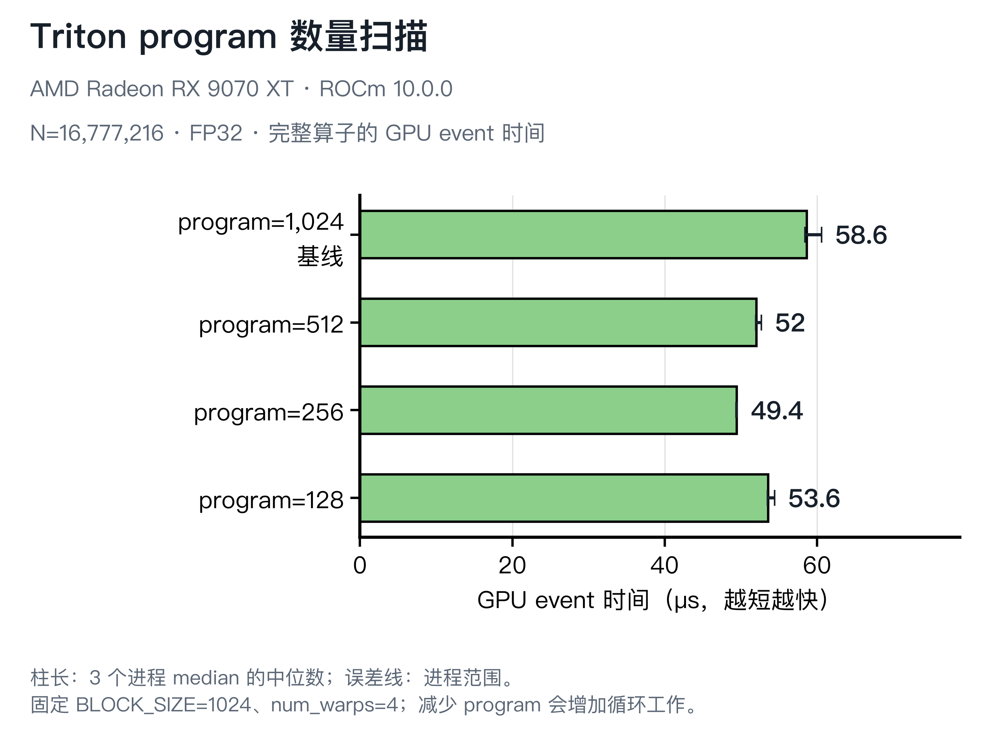
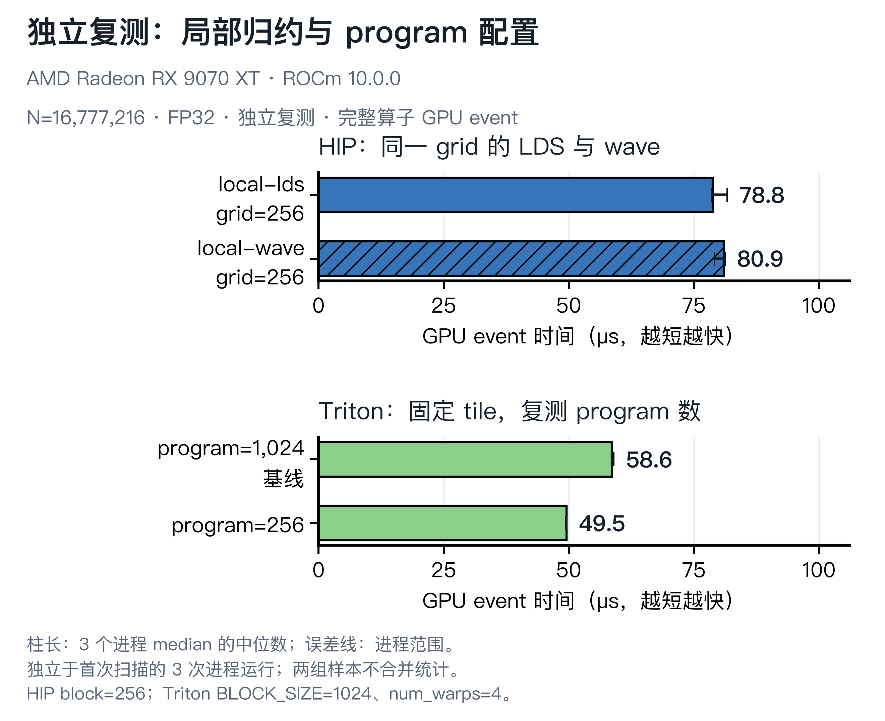

<script setup>
import ReductionJourney from './reduction-journey.vue'
import ReductionExecution from './reduction-execution.vue'
import pairMappingImage from './images/reduction-pair-mapping.svg'
import waveParticipationImage from './images/reduction-wave-participation.svg'
import mappingSourceUrl from '../../../code/part2-kernels/chapter9/reduction_mapping.hip?url&no-inline'
import mappingSummaryUrl from '../../../code/part2-kernels/chapter9/evidence/tree-layout/summary.csv?url&no-inline'
import mappingIsaUrl from '../../../code/part2-kernels/chapter9/evidence/tree-layout/isa_excerpt.txt?url&no-inline'
</script>

# 第9章 Reduction：归约算子

## 本章导读

第 8 章的 Vector Add 中，每个输出只依赖同一位置的两个输入。现在把问题改成：**把整个数组加起来，只输出一个数。** 各线程算出的值最终要汇到一起，怎样保证不丢结果，又不让所有线程都等着更新同一个位置？

我们先用 8 个数看清如何合并，再建立两条优化路线。HIP 从“每个 block 算出一个和”出发，逐步调整最终合并、线程工作量和块内协作；Triton 从完整的两阶段归约出发，研究该启动多少个 program。每次先说明为什么改，再检查答案、计时并决定是否保留。

- **理解算法**：先看[求和树](#reduction-tree)与[正确性约定](#reduction-contract)。
- **选择 HIP**：进入 [HIP 路线](#ch9-hip)，观察 LDS、partial 和 shuffle 的具体分工；[线程映射实验](#reduction-divergence)会用一次没有提速的改动解释分支发散。
- **选择 Triton**：进入 [Triton 路线](#ch9-triton)，把局部累加和 `tl.sum` 组成完整归约，再比较 program 上限。

配套代码在 `code/part2-kernels/chapter9/`。环境沿用 **Radeon RX 9070 XT（gfx1201）+ ROCm 10.0 + 原生 Ubuntu 24.04**；GPU event 和 trace 的读法见[第 5–6 章](../../part1-profiling/chapter5/index.md)。动画中的时间只用于讲解步骤，不表示实际执行速度。

## 9.1 归约的数据依赖 {#reduction-dependency}

求和归约（Sum Reduction）把长度为 `N` 的数组 `x` 变成一个标量：

$$
y = \sum_{i=0}^{N-1}x_i.
$$

例如 `[3, 1, 7, 0, 4, 1, 6, 2]` 的结果是 `24`。这个唯一输出依赖全部输入。

最直接的想法是让每个线程执行 `output += input[i]`。设输出初值为 `0`，两个线程分别要加 `3` 和 `1`：如果它们都先读到 `0`，就会分别算出 `3` 和 `1`，再把结果写回。最后可能只留下其中一个值，正确答案 `4` 被破坏了。这是对同一输出未经协调的读写，构成了**数据竞争**。

原子加法 `atomicAdd` 可以把一次“读旧值、相加、写回”作为不可拆开的更新。它解决了丢更新，但所有线程仍然更新同一位置。后面用它合并各个 block 的局部和；逐元素 atomic 只作为理解共享更新的入口。

归约也可以求最大值、最大值的位置：

| 任务 | 每次合并什么 | 越界位置贡献什么 |
| --- | --- | --- |
| Sum | 两个值相加 | `0` |
| Max | 取两个值中较大的一个 | 负无穷 |
| Argmax | 比较 `(数值, 下标)`，保留胜出的一对 | 无效候选；还需规定相等时选哪个下标 |

加上 `0` 不改变结果，所以它是加法的**单位元**。我们会用这个性质处理数组尾部。

## 9.2 串行求和与并行求和树 {#reduction-tree}

从第一个数开始依次相加，需要 7 次加法，后一次依赖前一次的结果。树形方法也做 7 次加法，但可以把互不依赖的加法放在同一轮：

| 轮次 | 本轮计算 | 留给下一轮的值 |
| --- | --- | --- |
| 输入 | — | `[3, 1, 7, 0, 4, 1, 6, 2]` |
| 第 1 轮 | `3+1`、`7+0`、`4+1`、`6+2` | `[4, 7, 5, 8]` |
| 第 2 轮 | `4+7`、`5+8` | `[11, 13]` |
| 第 3 轮 | `11+13` | `[24]` |

::: figure fig-reduction-tree
<ReductionJourney />

从上到下保留完整的求和树：8 个输入经过 4 次、2 次、1 次加法得到 24。每一步高亮当前计算的一层，上层结果继续保留，便于沿连线核对来源。
:::

在 @fig-reduction-tree 的第二轮开始前，`4、7、5、8` 必须已经产生。并行没有消除依赖，而是把一条长链变成了几轮短依赖。对于 2 的幂长度，理想树深度为 `log₂N`；总加法数仍是 `N-1`，实际执行还要处理加载、同步和写回。

若只取前 6 个输入，可以把逻辑宽度补到 8，让两个越界位置贡献 `0`。得到 `[3,1,7,0,4,1,0,0]`，和仍是 `16`；无需真的扩充输入数组。

图中前四个数合成 `11`，后四个数合成 `13`，这类尚待继续合并的结果叫作 **partial（局部结果）**。大数组也可以先分组求出 partial，再完成最终合并；后面的 @fig-reduction-two-stage 展示这些局部结果怎样交接。

这里用相邻配对看清树形依赖。后面的 HIP 实现也会按前后半区配对，树中的分组顺序不同，但仍遵循“上一轮结果就绪，下一轮才能合并”的规则；浮点输入改变相加顺序后，需要重新检查误差。

## 9.3 正确性与计时约定 {#reduction-contract}

先固定裁判，再比较版本。CPU 用 FP64 累加同一输入，作为正确性参考；HIP 的性能基线是 block-atomic，Triton 的性能基线是 program 上限为 1024 的两阶段实现。CPU reference 不参与 GPU 性能排名。

本章使用 FP32 输入与累加，主测试规模为 `N=16,777,216`，输入占 64 MiB。输入值随位置变化，使用可精确表示的小幅二进制分数；另外检查全 `1` 和位置相关的输入。这既能控制舍入影响，也比总和常为 `0` 的交替正负数组更容易发现漏读。程序将长度限定为 $0 < N \le 2^{24}$，在这组受控数据上要求结果与 CPU 的 FP64 参考值严格相等。检查通过只说明这些测试用例符合约定，不代表任意 FP32 归约都应零误差。

主实验随机种子为 `20260920`。程序在预热与正式计时前先执行一次并检查结果，计时结束后再检查一次。阅读输出时，区分下面几项：

1. **输出是否写入**：两阶段版本先将 partial 与最终输出填为 NaN，计算后检查这些位置，发现未被覆盖的结果。atomic 版本每次启动前将最终输出清零，累加后只核对最终值，不逐个检查 partial；
2. **结果是否有限**：被核对的 partial 与最终值都必须是有限数，出现 NaN 或 Inf 就报错，不能只依赖误差比较；
3. **结果是否相等**：两阶段版本逐个比较 partial 和最终值，atomic 版本比较最终值。**本组实验采用严格相等检查，没有设置数值容差**；
4. **边界与输入分布是否覆盖**：对 `1、33、257、1023、1024、1025` 六种长度，检查三类输入、六种代表配置，共 108 项；另在非整除长度 `1,048,579` 上检查全部 11 个配置的三类输入，共 33 项，全部通过。

预填 NaN 有助于发现待检查缓冲区中的漏写，不能代替边界防护，也不能检测所有越界读写或重复读取。仍需核对下标、掩码与边界用例。换成一般浮点输入后，改变相加顺序可能改变舍入误差，应重新确定并验证容差标准；不能把本组数据的严格相等要求直接套用过去。

所有主图以**得到最终标量的完整 GPU event 时间**作为比较依据：

| 路线 | 计入的工作 |
| --- | --- |
| HIP block-atomic | 输出清零 + block 归约并原子更新 |
| HIP partials / local-lds / local-wave | 第一阶段写 partial + 同一个 final kernel |
| Triton 各 program 配置 | 第一阶段写 partial + 第二阶段合并 |

atomic 每次都要从 `0` 开始，因此清零计入时间；两阶段版本直接覆盖 partial 和最终输出，不需要这次清零。内存分配、初始数据拷贝、CPU reference、编译和首次执行不计入稳态时间。

阶段时间用来定位问题，完整时间用来决定是否保留改动。正式计时不打开 profiler，trace 另行采集。主实验采集于 **2026-09-20，Radeon RX 9070 XT（gfx1201）+ ROCm SDK 10.0.0 + 原生 Ubuntu 24.04**，HIP 组件为 7.15.26333，Triton 为 3.8.0。每配置预热 10 次、计时 50 次，共三个独立进程，轮换运行顺序；同一进程重复使用数组，不主动刷缓存。设备保留桌面和已有上下文，没有声明独占。

图中的点或柱表示各独立进程 median 的中位数，误差范围表示这些进程 median 的最小值到最大值，不是置信区间。

## 9.4 HIP 与 Triton 优化路线 {#reduction-implementation}

先选一条路线读完整即可。两条路线都遵循“观察已有实现 → 提出一个假设 → 修改并校验 → 比较完整结果”的顺序。

**环境与结果目录。** 以下命令在 GPU 机器的仓库根目录开始执行，后续保持在 `code/part2-kernels/`。沿用本篇 `uv.lock`，不要删除锁文件：

```bash
cd code/part2-kernels &&
uv sync --locked &&
source ./activate-rocm.sh
```

为本章新建一个独立结果目录，保存打印出来的路径：

```bash
mkdir -p chapter9/results &&
RUN=$(mktemp -d chapter9/results/walkthrough-XXXXXX) &&
mkdir "$RUN/build" &&
printf '本轮结果目录：%s\n' "$RUN"
```

换终端后，重新执行环境准备，再恢复之前打印的目录；提示处只粘贴路径，不含 `RUN=`：

```bash
read -r -p '粘贴上次输出的结果目录：' RUN &&
test -n "$RUN" && test -d "$RUN/build" &&
printf '继续使用结果目录：%s\n' "$RUN"
```

需要重测或改动源码时，新建 `RUN`，重新编译 HIP；恢复旧目录只用于继续未修改的实验。后续命令会拒绝写入已有样本。

每条命令先校验，再完成一个进程的 10 次预热与 50 次计时；折叠输出对应第 1 个进程。**图使用三个独立进程的统计，不是一次终端输出。** 手工复测时同时把样本名 `p1` 与 `--process 1` 改为 `p2`/`2`、`p3`/`3`，每遍覆盖同组候选并轮换起始项。[章末批量入口](#reduction-rerun)会自动完成这一步、汇总并画本轮图，不要求先运行 profiler。

本章每轮都检查 partial 或最终值，并比较完整 event 时间。阶段 trace 只在追问“哪一阶段改变了”时使用；求和树的指令选读则回答“源码实际编译成了什么”，不负责替某项改动寻找必然加速的理由。

<ImplementationTabs id="ch9-implementation">
<template #hip>

### 9.4.1 HIP 基线：每个 block 提交一个和 {#ch9-hip}

先让一个 block 负责 256 个输入，每个线程加载一个数，放入 LDS。随后用半距树合并：每轮配对前后半区的对应位置，再将步长减半，最后只由线程 0 提交这个 block 的和。本章代码在 `reduction_rounds.hip`，版本名为 `block-atomic`。

`block_tree` 接收每个线程加载的值，所有线程调用同一个 helper：

```cpp
__device__ float block_tree(float value, float* shared) {
    const unsigned t = threadIdx.x;
    shared[t] = value;
    __syncthreads();
    for (unsigned stride = blockDim.x / 2; stride > 0; stride >>= 1) {
        if (t < stride) shared[t] += shared[t + stride];
        __syncthreads();
    }
    return shared[0];
}
```

加载时用 `i < n ? x[i] : 0.0f` 处理尾部，最终由线程 0 执行 `atomicAdd(out, sum)`。

`block=256` 时，每轮做加法的线程数是 `128、64、32……1`。没有做本轮加法的线程也要到达 `__syncthreads()`：下一轮可能读取其他线程刚更新的 LDS 值，因此屏障放在 `if` 外，让整个 block 共同经过。

主输入需要 `16,777,216 / 256 = 65,536` 个 block。每个 block 内先归约，再向同一输出做一次原子加，已经把全局更新次数从逐元素方案的 `16,777,216` 次降为 `65,536` 次。这是后续性能比较的起点。

<a id="ch9-hip-source"></a>

<details>
<summary>完整源码：code/part2-kernels/chapter9/reduction_rounds.hip</summary>

<<< @/../code/part2-kernels/chapter9/reduction_rounds.hip{cpp}

</details>

这份文件包含本路线的输入准备、kernel、启动、校验与计时；后续配置共用它，按函数和运行参数定位改动。

先编译一次。未修改源码时可复用本轮可执行文件；修改源码后请新建结果目录再编译：

```bash
test -d "${RUN:?请先准备本章环境与结果目录}/build" && \
if [[ ! -x "$RUN/build/reduction_rounds" ]]; then
  hipcc --offload-arch=gfx1201 -O3 -std=c++17 \
    chapter9/reduction_rounds.hip -o "$RUN/build/reduction_rounds"
fi
```

运行 `block-atomic`，先看 `correct/precheck/postcheck`，再核对输入、实际 grid 和完整计时范围：

<!-- benchmark:hip-block-atomic:16777216 -->

```bash
test -d "${RUN:?请先准备本章环境与结果目录}/build" && \
test ! -e "$RUN/n16777216-hip-block-atomic-p1.csv" && \
"$RUN/build/reduction_rounds" \
  --version block-atomic --size 16777216 --block 256 \
  --warmup 10 --repeat 50 --seed 20260920 \
  --input random --config-id hip-block-atomic --samples "$RUN/n16777216-hip-block-atomic-p1.csv" \
  --process 1
```

<details>
<summary>真实输出：hip-block-atomic，shape=16777216，第 1 个独立进程</summary>

<<< @/../code/part2-kernels/chapter9/evidence/walkthrough/logs/n16777216-hip-block-atomic-p1.log{text}

</details>

这份输出是第 1 个进程的 50 次中位数。下面的性能数值与图使用三个独立进程的汇总，较慢的一次同样保留。

基线的正确性检查通过，完整 event 时间为 **4.350179 ms**。输出中的 `grid=65536`、`block=256` 与上面的分工一致。这个总时间没有分别计量原子等待、块内归约与访存，不能把它称为纯原子操作的成本。

这个基线仍让全部 block 更新一个地址。由此提出第一项假设：**如果各块先写独占位置，再用另一个 kernel 合并，减少共享更新的收益能否覆盖额外一次启动和 partial 读写？**

### 9.4.2 第一轮：独占 partial 与固定 final

保持第一阶段的加载、`block=256`、block 数和 LDS 求和树不变，只把每块末尾的写入改成独占位置：

```cpp
// block-atomic：各块合并到同一个输出。
atomicAdd(out, sum);

// partials：每块先写自己的位置。
partials[blockIdx.x] = sum;
```

上面两种写法都只由线程 0 执行。`partials` 版随后启动一个固定的 final kernel：一个 block 的 256 个线程按步长 256 读取 partial，先各自累加，再用同一棵 LDS 半距树合成最终标量。主输入有 65,536 个 partial，所以 final 中每个线程要先累加 256 个值。

两个 kernel 在同一 stream 中按顺序执行，第二阶段能够读取第一阶段写完的 partial。普通的 block 屏障只同步本 block，不能代替这个跨 block 的阶段边界。

这轮同时付出了 partial 数组读写和第二次启动的成本，也去掉了全局原子更新及其必需清零。因此它回答的是**两种完整合并方案哪一种更合适**，不是单条 atomic 指令值多少时间。

在同一份[完整 HIP 程序](#ch9-hip-source)中，`reduction_partials()` 写独占位置，`reduction_final()` 完成共同的最终合并。运行时只切换版本，其他测量参数保持不变：

<!-- benchmark:hip-partials:16777216 -->

```bash
test -d "${RUN:?请先准备本章环境与结果目录}/build" && \
test ! -e "$RUN/n16777216-hip-partials-p1.csv" && \
"$RUN/build/reduction_rounds" \
  --version partials --size 16777216 --block 256 \
  --warmup 10 --repeat 50 --seed 20260920 \
  --input random --config-id hip-partials --samples "$RUN/n16777216-hip-partials-p1.csv" \
  --process 1
```

<details>
<summary>真实输出：hip-partials，shape=16777216，第 1 个独立进程</summary>

<<< @/../code/part2-kernels/chapter9/evidence/walkthrough/logs/n16777216-hip-partials-p1.log{text}

</details>

先看 partial 与最终输出的检查是否通过，再看 `stages=2` 和完整 `median_ms`。增加了一个阶段，因此采用决定必须覆盖两个阶段。

新版本的每个 partial 和最终结果均通过检查，完整时间降到 **0.477668 ms**。这轮 benchmark 已足以判断是否采用完整方案；阶段时间留到需要解释后续变化时再看。

::: figure fig-reduction-round-partials


第一轮只改变跨 block 的合并方案。主比较计时到最终输出完成；原始基线保留在图中。
:::

本轮采用独占 partial 方案。它增加了一个 kernel，却缩短了完整归约时间；“启动次数越少越快”在这里不成立。根据当前分工，还有 65,536 个 partial 要交给 final，由此可以直接提出下一个问题：能否先减少这批中间结果？

### 9.4.3 局部对照：求和树与线程分工 {#reduction-divergence}

<details>
<summary>选读：改变求和树与参与线程，是否一定更快？</summary>

在继续改变 block 数之前，先检查一个看起来合理的想法：当前每轮合并前后半区的数据，如果先合并相邻位置，访问距离更近，是否会更快？

这里使用 `reduction_mapping.hip` 的独立对照。每个线程仍加载一个数，各块写独占 partial，各版使用共同的 final kernel。**A 版 `sequential`** 是原来的半距树；**B 版 `interleaved`** 改成先合并 `0+1、2+3、4+5、6+7`，再继续合并：

```cpp
for (unsigned int stride = 1; stride < blockDim.x; stride *= 2) {
    if (thread % (2 * stride) == 0) {
        shared[thread] += shared[thread + stride];
    }
    __syncthreads();
}
```

第一轮 `stride=1`，线程 `0、2、4、6……` 做加法；第二轮 `stride=2`，线程 `0、4、8、12……` 做加法。A → B 改了配对顺序，也改了线程分工，不能只把它叫作“地址变近了”。

这里的 A/B/C 共用一份独立程序，先准备可运行的完整对照，再看结果。它与本章主链输入协议不同，不跨组计算加速比。

<details>
<summary>完整源码：code/part2-kernels/chapter9/reduction_mapping.hip</summary>

<<< @/../code/part2-kernels/chapter9/reduction_mapping.hip{cpp}

</details>

```bash
test -d "${RUN:?请先准备本章环境与结果目录}/build" && \
MAPPING_SOURCE="$PWD/chapter9/reduction_mapping.hip" && \
if [[ ! -x "$RUN/build/reduction_mapping" ]]; then
  (cd "$RUN/build" && hipcc --offload-arch=gfx1201 -O3 -std=c++17 \
    -save-temps "$MAPPING_SOURCE" -o reduction_mapping)
fi
```

下面一次进程会运行三版，并分别测第一阶段与完整两阶段。`--order rotate` 轮换版本顺序，保存全部候选：

```bash
test -d "${RUN:?请先准备本章环境与结果目录}/build" && \
test ! -e "$RUN/mapping-p1.csv" && \
"$RUN/build/reduction_mapping" --version all \
  --size 16777216 --block 256 --input random --seed 20260919 \
  --warmup 10 --repeat 50 --order rotate --measure both \
  --samples "$RUN/mapping-p1.csv"
```

<details>
<summary>真实输出：独立求和树对照，第 1 个进程，三版与两个计时范围</summary>

<<< @/../code/part2-kernels/chapter9/evidence/walkthrough/logs/mapping-bench-16777216-p1.txt{text}

</details>

先检查每版的 partial 与最终结果，再按 `interval=partial` 或 `interval=two-stage` 分开读时间。不要把这两组独立测得的中位数相减当作 final 时间。这里样本路径会使用自己的 `RUN`；原始日志保留采集时的相对文件名。

本组图汇总三个进程，手工复现时再以 `mapping-p2.csv`、`mapping-p3.csv` 分别重跑上述命令。该程序的进程由独立样本文件识别，不接收主实验的 `--process` 参数。

这组实验于 **2026-09-19** 在 **RX 9070 XT、ROCm 10.0、原生 Ubuntu 24.04** 上完成。主输入 `N=16,777,216`、FP32，`block=256`，实际编译为 wave32；三进程各预热 10 次、计时 50 次，轮换版本执行顺序。第一阶段和完整两阶段分别计时，partial 和最终结果在计时前后均通过检查。

| 独立局部版本 | 第一阶段（μs） | 完整两阶段（μs） |
| --- | ---: | ---: |
| A · 半距树 | 399（396–402） | 473（470–475） |
| B · 邻接树、隔位线程 | 438（437–441） | 512（511–517） |

括号为三进程 median 的最小—最大范围。第一阶段从约 **399 μs** 增加到约 **438 μs**，慢了约 **9.9%**。最初的假设没有成立。接下来从 B 版的线程分工寻找一个可检验的改动。

**观察参与加法的线程。** 一个 block 的 256 个线程按 wave32 分为 8 组。B 版第一轮只让偶数线程做加法，因此每组都有 16 个线程进入 `if`，另 16 个跳过。同一 wavefront 内的线程对条件选择不同路径，称为**分支发散（Branch Divergence）**；执行掩码记录当前指令由哪些 lane 参与。

如果让加法集中在连续编号的线程上，第一轮是否能让参与的 wavefront 更完整？为检验这个想法，**C 版 `compacted` 保留 B 版的数据配对**，只重新安排由哪个线程执行：

::: figure fig-reduction-pair-mapping
<a :href="pairMappingImage" target="_blank" rel="noopener" aria-label="查看数据配对与线程分工的 SVG 原图">
  
</a>

B → C 保持每次相加的数据位置不变，变化的是每次加法交给哪个线程。
:::

如 @fig-reduction-pair-mapping 所示，用 `j = 2 * stride * thread` 将连续线程编号换成目标数据位置：

```cpp
for (unsigned int stride = 1; stride < blockDim.x; stride *= 2) {
    const unsigned int j = 2 * stride * thread;
    if (j < blockDim.x) {
        shared[j] += shared[j + stride];
    }
    __syncthreads();
}
```

::: figure fig-reduction-wave-participation
<a :href="waveParticipationImage" target="_blank" rel="noopener" aria-label="查看 wavefront 参与分布的 SVG 原图">
  
</a>

第一轮仍做 128 次加法。B 将它们分布在 8 个 wavefront，C 集中在前 4 个 wavefront。
:::

@fig-reduction-wave-participation 中，C 第一轮每个 wavefront 内的条件一致。但后面的树继续收缩，同一组仍可能只剩部分 lane 做加法。跳过加法的线程也没有退出 kernel：两版都把屏障放在 `if` 外，让整个 block 共同经过。

::: figure fig-reduction-tree-abc-result


独立局部对照的第二轮：重排线程后没有得到稳定改善，B、C 的进程范围重叠。A 仍保留在图中，便于看清这次尝试相对原来方案的位置。
:::

@fig-reduction-tree-abc-result 中，C 的第一阶段约 **442 μs**，未比 B 的约 **438 μs** 更快，进程范围也有重叠。本轮保留 A 的半距树，继续研究其他成本。

::: figure fig-reduction-tree-full-result


同一局部实验的完整路径，计入共同 final。各输入长度独立分面，坐标从零开始，刻度范围不同，不能跨面板直接比较柱长。
:::

@fig-reduction-tree-full-result 的主输入中，A、B、C 的完整时间分别约为 473、512、516 μs；完整路径也没有支持保留这两次尝试。

为什么“参与线程更集中”没有保证加速？重排线程还改变了条件判断、地址计算，以及同一条 LDS 指令中各 lane 访问的位置。实际编译产物确认了这些变化，却不能把总时间拆成各项成本。源码中的 `%` 也没有直接成为整数除法：B 的对应部分编译成了位运算；C 则需要计算 `j` 及访问地址。

<details>
<summary>证据怎样连接：源码、trace 与机器指令分别说明什么</summary>

- **算法与地址**：A 是半距树；B、C 才共享邻接树。B → C 保留数据配对，改变线程映射及其连带的地址计算和 LDS 访问分布。
- **实际编译**：GPU code object 确认为 wave32；指令中可以看到参与条件和 EXEC 掩码的设置与恢复。B 的取模被编译成位运算，C 有计算 `j` 的乘法与地址计算，不能只凭源码符号断言哪个指令在拖慢程序。
- **kernel trace**：筛选 `mapping_*_partial`，排除预检、final 和拷贝后，可以核对第一阶段的时间与启动规模；`Grid_Size_X=16,777,216` 在这份 trace 中是线程总数，除以 256 才是 block 数。trace 不直接给出发散耗时占比。
- **counter**：三版 `Wavefronts=524,288` 与启动规模一致，只说明启动的 wave 数相同。能力检查中的 LDS/SQ 计数器返回零，未形成可用测量，不能据此宣布没有冲突或没有相应指令。

本组随机输入为位置相关的 `k/32`，`k` 在 `-16` 至 `16` 之间，seed 为 `20260919`。各 block 的 partial 与 FP64 参考精确比较；最终和与相同次序的 CPU FP32 计算匹配，并记录相对 FP64 的误差。边界另测全 `1` 与 weighted 输入。完整路径和第一阶段独立计时，不能把两组 median 相减当成 final 时间。

下载 <a :href="mappingSourceUrl" download="reduction_mapping.hip">对照源码</a>、<a :href="mappingSummaryUrl" download="mapping-summary.csv">全部结果 CSV</a> 与<a :href="mappingIsaUrl" download="mapping-isa-excerpt.txt">实际机器指令摘录</a>。这是独立局部实验，不与本章主实验跨日期计算加速比。

</details>


</details>

### 9.4.4 第二轮：局部累加与 block 数

回到主实验的 `partials` 版本。每线程只读取一个数，意味着主输入需要 65,536 个 block，也会留下 65,536 个 partial。下一项假设是：**让线程先多加几个数，能否在保持足够并行工作的同时，减少 partial 和最终合并的工作？**

用 grid-stride loop 给每个线程分配多个输入。一个线程从自己的起点读起，再跨过整个 grid 的线程数，继续处理下一项：

```cpp
__device__ float local_accumulate(const float* x, std::size_t n) {
    float value = 0.0f;
    const std::size_t stride = std::size_t(gridDim.x) * blockDim.x;
    for (std::size_t i = std::size_t(blockIdx.x) * blockDim.x + threadIdx.x;
         i < n; i += stride) value += x[i];
    return value;
}
```

这里的累加值 `value` 只属于当前线程，累加时不需要与其他线程同步。循环后再把它写入 LDS，沿用原来的半距树、独占 partial 和固定 final。

::: figure fig-reduction-two-stage
<ReductionExecution scenario="two-stage" />

两阶段归约的分工示例：2 个 block，每块 4 个线程，共 16 个输入。线程按步长 8 读取两项，局部累加后再做组内归约；两块分别交出 22、26，第二阶段合并为 48。
:::

@fig-reduction-two-stage 把同一段输入重复两次，便于检查结果。block 0 的线程 0 读取位置 0 与 8，先得到 `3+3=6`；其余线程按同样规则工作。先完成自己的累加，再共同归约，便把要交接的值缩少了一层。

**先检查循环本身。** 新版叫 `local-lds`。第一项对照仍使用完整 grid：65,536 个 block，每个线程恰好读取一次。此时没有减少 partial，只是把单次加载改写为循环，用来观察循环结构这一步的变化。

定位 `local_accumulate()`，先运行未减少 block 数的桥接对照：

<!-- benchmark:hip-local-lds-g65536:16777216 -->

```bash
test -d "${RUN:?请先准备本章环境与结果目录}/build" && \
test ! -e "$RUN/n16777216-hip-local-lds-g65536-p1.csv" && \
"$RUN/build/reduction_rounds" \
  --version local-lds --grid 65536 --size 16777216 \
  --block 256 --warmup 10 --repeat 50 \
  --seed 20260920 --input random --config-id hip-local-lds-g65536 \
  --samples "$RUN/n16777216-hip-local-lds-g65536-p1.csv" --process 1
```

<details>
<summary>真实输出：hip-local-lds-g65536，shape=16777216，第 1 个独立进程</summary>

<<< @/../code/part2-kernels/chapter9/evidence/walkthrough/logs/n16777216-hip-local-lds-g65536-p1.log{text}

</details>

正确性通过后核对 `grid=65536`。这里仍是一线程一个输入，不能把循环语法本身当成减少工作量。

相同 full-grid 下，`partials` 为 **0.477668 ms**，`local-lds` 为 **0.490709 ms**，循环写法在本轮略慢。此时每线程仍只读一个数，不能把这一步称为局部累加已经带来收益。

**再减少 block 数。** 固定这份 `local-lds` 代码和 `block=256`，比较 grid 为 65,536、1,024、256 的配置。对于本章主输入，工作分配可在运行前算出来：

| 第一阶段 block 数 | 每线程读取的输入数 | partial 数 | 固定 final 中每线程读取的 partial 数 |
| ---: | ---: | ---: | ---: |
| 65,536 | 1 | 65,536 | 256 |
| 1,024 | 64 | 1,024 | 4 |
| 256 | 256 | 256 | 1 |

这些数量只适用于表中的主输入；实际代码会处理不能整除的尾部，并把 grid 限制在需要的范围内。减少 grid 同时减少并行 block 数、增加线程的串行累加、缩短 partial 数组。因此“final 处理的数更少”只是收益候选，还要检查第一阶段和完整时间。

保持这一份循环代码，分别运行另外两档 grid：

<!-- benchmark:hip-local-lds-g1024:16777216 -->

```bash
test -d "${RUN:?请先准备本章环境与结果目录}/build" && \
test ! -e "$RUN/n16777216-hip-local-lds-g1024-p1.csv" && \
"$RUN/build/reduction_rounds" \
  --version local-lds --grid 1024 --size 16777216 \
  --block 256 --warmup 10 --repeat 50 \
  --seed 20260920 --input random --config-id hip-local-lds-g1024 \
  --samples "$RUN/n16777216-hip-local-lds-g1024-p1.csv" --process 1
```

<details>
<summary>真实输出：hip-local-lds-g1024，shape=16777216，第 1 个独立进程</summary>

<<< @/../code/part2-kernels/chapter9/evidence/walkthrough/logs/n16777216-hip-local-lds-g1024-p1.log{text}

</details>

<!-- benchmark:hip-local-lds-g256:16777216 -->

```bash
test -d "${RUN:?请先准备本章环境与结果目录}/build" && \
test ! -e "$RUN/n16777216-hip-local-lds-g256-p1.csv" && \
"$RUN/build/reduction_rounds" \
  --version local-lds --grid 256 --size 16777216 \
  --block 256 --warmup 10 --repeat 50 \
  --seed 20260920 --input random --config-id hip-local-lds-g256 \
  --samples "$RUN/n16777216-hip-local-lds-g256-p1.csv" --process 1
```

<details>
<summary>真实输出：hip-local-lds-g256，shape=16777216，第 1 个独立进程</summary>

<<< @/../code/part2-kernels/chapter9/evidence/walkthrough/logs/n16777216-hip-local-lds-g256-p1.log{text}

</details>

先核对实际 grid 与 partial 数，再比较同一完整范围。三档的结果都保留在图中；小输入会缩小实际 grid，因此查看输出比只看命令参数更可靠。

::: figure fig-reduction-round-grid


本轮固定局部求和方式，只改变第一阶段 block 数。图中保留全部候选，不能只展示选中的配置。
:::

grid 从 65,536 减为 1,024、256 时，完整时间分别为 **0.083161 ms**、**0.078961 ms**；两者都明显短于 full-grid。减少 partial 是从源码提出的假设，完整时间已经支持这项取舍；若还想知道两个阶段分别怎样变化，可看下面的按需分析。当前扫描支持继续采用 256，但这里没有穷尽全部 grid。下一轮按预先选定的 `grid=256` 做块内方法对照。

<details>
<summary>按需分析：减少 partial 后，改善是否只发生在 final？</summary>

这是额外的问题，不影响刚才的完整时间比较。仍在 `code/part2-kernels/`，复用当前 `RUN` 与程序，对同一份 `local-lds` 的 `grid65536` 和 `grid256` 各采一次独立 trace；每个阶段按名字分别筛选。目录已存在时命令停止，不覆盖旧报告。

```bash
test -d "${RUN:?请先准备本章环境与结果目录}/build" && \
mkdir "$RUN/profile-hip-local-lds-g65536" && \
rocprofv3 --kernel-trace --output-format csv \
  --output-directory "$RUN/profile-hip-local-lds-g65536" --output-file hip-local-lds-g65536 -- \
  "$RUN/build/reduction_rounds" \
    --version local-lds --grid 65536 --size 16777216 \
    --block 256 --warmup 5 --repeat 10 \
    --seed 20260920 --input random --config-id hip-local-lds-g65536 && \
python chapter8/inspect_trace.py \
  "$RUN/profile-hip-local-lds-g65536/hip-local-lds-g65536_kernel_trace.csv" \
  --kernel reduction_local_lds --skip 6 --take 10 && \
python chapter8/inspect_trace.py \
  "$RUN/profile-hip-local-lds-g65536/hip-local-lds-g65536_kernel_trace.csv" \
  --kernel reduction_final --skip 6 --take 10
```

<details>
<summary>筛选后的真实 trace：hip-local-lds-g65536，shape=16777216</summary>

<<< @/../code/part2-kernels/chapter9/evidence/walkthrough/reports/hip-local-lds-g65536.txt{text}

</details>

<details>
<summary>原始 kernel trace CSV：hip-local-lds-g65536，shape=16777216</summary>

<<< @/../code/part2-kernels/chapter9/evidence/walkthrough/profiles/hip-local-lds-g65536_kernel_trace.csv{text}

</details>

```bash
test -d "${RUN:?请先准备本章环境与结果目录}/build" && \
mkdir "$RUN/profile-hip-local-lds-g256" && \
rocprofv3 --kernel-trace --output-format csv \
  --output-directory "$RUN/profile-hip-local-lds-g256" --output-file hip-local-lds-g256 -- \
  "$RUN/build/reduction_rounds" \
    --version local-lds --grid 256 --size 16777216 \
    --block 256 --warmup 5 --repeat 10 \
    --seed 20260920 --input random --config-id hip-local-lds-g256 && \
python chapter8/inspect_trace.py \
  "$RUN/profile-hip-local-lds-g256/hip-local-lds-g256_kernel_trace.csv" \
  --kernel reduction_local_lds --skip 6 --take 10 && \
python chapter8/inspect_trace.py \
  "$RUN/profile-hip-local-lds-g256/hip-local-lds-g256_kernel_trace.csv" \
  --kernel reduction_final --skip 6 --take 10
```

<details>
<summary>筛选后的真实 trace：hip-local-lds-g256，shape=16777216</summary>

<<< @/../code/part2-kernels/chapter9/evidence/walkthrough/reports/hip-local-lds-g256.txt{text}

</details>

<details>
<summary>原始 kernel trace CSV：hip-local-lds-g256，shape=16777216</summary>

<<< @/../code/part2-kernels/chapter9/evidence/walkthrough/profiles/hip-local-lds-g256_kernel_trace.csv{text}

</details>

先看每个目标的 `target_rows=16`，排除一次预检与五次预热，保留十次；再看 `workgroups_total`。两个 first-stage 的 block 数是65,536与256，final始终只有一个block。`kernel_median_us` 中，首阶段约411.649→70.301 μs，final约73.042→3.220 μs。证据支持“两个阶段都发生了变化”，所以不能将完整收益全归给final。

这些是另一次带profiler运行的设备区间，不与event相减，也不把两个独立中位数相加当作正式成绩。`lds_bytes=0` 不包含本次HIP动态申请：LDS首阶段实际请求 `block×4=1024 B`，应按启动代码核对。这里没有有效证据分摊访存、并行量或同步各自贡献。

读取CSV使用第8章的标准库脚本 `chapter8/inspect_trace.py`，不会再次启动GPU。当前只使用已验证的kernel trace；PMC/ATT的有效范围见[第8章按问题选择性能分析](../chapter8/index.md#_8-5-按问题选择性能分析)。

</details>

### 9.4.5 第三轮：比较 LDS 与 wavefront 内交换

上一轮已经改变了线程工作量。这一轮固定 `grid=256`、`block=256`、局部加载循环、partial 数和 final kernel，只比较第一阶段的块内归约方法。

`local-lds` 将每个线程的 `local` 写入 LDS，每轮读取其他线程的值并通过 block 屏障交接。`local-wave` 尝试先在各 wavefront 内交换寄存器值，再合并少量 wavefront 结果。假设是：**减少块内 LDS 交接和屏障后，完整时间能否进一步缩短？**

wavefront 内的核心操作是 `__shfl_down`：

```cpp
__device__ float wave_sum(float value) {
    for (int offset = 16; offset > 0; offset >>= 1)
        value += __shfl_down(value, offset, 32);
    return value;
}
```

本章实现明确检查设备为 wave32，代码中的 32 与该约束一致。

本章调用处让完整 wavefront 共同执行这个循环，最后采用 lane 0 的总和。它只在 wavefront 内交换值，不代替整个 block 的同步。每个 wavefront 的 lane 0 还要把结果写入 LDS，等全 block 到达屏障，再由第一个 wavefront 合并这些结果。

::: figure fig-reduction-shuffle
<ReductionExecution scenario="shuffle" />

固定位置的 shuffle 依赖图：竖线沿用本位置的值，斜线读取相隔 offset 的值，相加结果放在下一层的同一列。历史层保留用于追溯，只展开最终 lane 0 所需的依赖。真实 wave32 的 offset 为 16→8→4→2→1。
:::

@fig-reduction-shuffle 展示了值如何逐步合并，画面保留的是 lane 0 的依赖子集，不能用展示范围推断执行掩码。主实验的 block 有多个 wavefront；换用这种层次也会改变浮点相加顺序，所以仍须重新检查 partial 和最终输出。

本轮只切换块内归约方法，保留 `grid=256` 和共同 final。修改相加顺序后仍重新核对所有 partial：

<!-- benchmark:hip-local-wave-g256:16777216 -->

```bash
test -d "${RUN:?请先准备本章环境与结果目录}/build" && \
test ! -e "$RUN/n16777216-hip-local-wave-g256-p1.csv" && \
"$RUN/build/reduction_rounds" \
  --version local-wave --grid 256 --size 16777216 \
  --block 256 --warmup 10 --repeat 50 \
  --seed 20260920 --input random --config-id hip-local-wave-g256 \
  --samples "$RUN/n16777216-hip-local-wave-g256-p1.csv" --process 1
```

<details>
<summary>真实输出：hip-local-wave-g256，shape=16777216，第 1 个独立进程</summary>

<<< @/../code/part2-kernels/chapter9/evidence/walkthrough/logs/n16777216-hip-local-wave-g256-p1.log{text}

</details>

`correct/precheck/postcheck` 通过后，再与上一轮已经保存的 LDS/grid256 比较。小幅差异需要独立确认；再采一份仅显示时间接近的 trace 不会替代确认。

::: figure fig-reduction-round-wave


本轮固定第一阶段工作分配和 final，只替换块内归约实现。图中的改善或退步属于整项改动，不能据此单独计算某次屏障的代价。
:::

首次扫描中，LDS 为 **0.078961 ms**，wave 版为 **0.078061 ms**，只差约 1.1%。对这种小幅领先，再用新进程复测才决定是否替换：确认组的 LDS 为 **0.078770 ms**，wave 为 **0.080950 ms**，中位数顺序反转，进程范围也重叠（见 @fig-reduction-confirmation）。因此本轮保留 `local-lds` 的 grid=256 配置；不能写成 shuffle 已经稳定加速。两版答案都正确，未被采纳的 wave 版仍可用于理解另一种块内协作方式。

HIP 路线到这里，每一步都有直接对照：改变跨块合并，改变线程工作量，再改变块内协作。最终实现相对 `block-atomic` 的差距是这些设计选择的合计效果；每项是否值得，则由附近的逐轮图回答。

</template>
<template #triton>

### 9.4.6 Triton 基线：完整的两阶段归约 {#ch9-triton}

第 8 章用一个 program 处理一个逻辑 tile。归约仍从 tile 出发，但一个 program 算出的和只覆盖自己负责的输入，必须再汇合其他 program 的结果。

`reduction_rounds_triton.py` 的第一阶段让每个 program 逐 tile 累加，再交出一个 partial。先固定 `BLOCK_SIZE=1024`、`num_warps=4`，program 上限为 `1024`，建立完整两阶段的路线基线。

```python
pid = tl.program_id(0)
accumulator = tl.zeros((BLOCK_SIZE,), tl.float32)
for first in tl.range(pid * BLOCK_SIZE, size, programs * BLOCK_SIZE):
    offsets = first + tl.arange(0, BLOCK_SIZE)
    accumulator += tl.load(x + offsets, mask=offsets < size, other=0.0)
tl.store(partials + pid, tl.sum(accumulator, 0))
```

`accumulator` 是长度为 `BLOCK_SIZE` 的逻辑向量。每次读入一个 tile，逐位置加到向量上；循环结束后，`tl.sum` 将这个向量合为一个值。它只合并本 program 的数据，不会自动收集其他 program 的 partial。

把参数缩为 `BLOCK_SIZE=4`、两个 program、`N=16`，就能检查整个输入是否恰好被覆盖一次：

| program | 第一次读入 | 第二次读入 | 最后交出 |
| --- | --- | --- | --- |
| 0 | 下标 `0–3` | 下标 `8–11` | `partials[0]` |
| 1 | 下标 `4–7` | 下标 `12–15` | `partials[1]` |

这些是逻辑元素位置，具体如何分配给硬件线程由编译器安排。最后一个 tile 不满时，`mask` 阻止越界加载，`other=0.0` 让无效位置不改变和。

把长度改为前 10 项，观察 program 0 的第二片段。先预测累计向量，再单步查看 @fig-reduction-triton-tiles：下标 10、11 并不存在，不能真的从数组中读取。

::: figure fig-reduction-triton-tiles
<ReductionExecution scenario="triton" />

两个 program 的逻辑分工与尾部处理。先各自交出 15、13，再由第二阶段得到 28；补齐位置只提供零贡献。
:::

第二阶段只启动一个 program，读取全部 partial：

```python
offsets = tl.arange(0, BLOCK_SIZE)
values = tl.load(partials + offsets, mask=offsets < programs, other=0.0)
tl.store(out, tl.sum(values, 0))
```

第二阶段也固定 `BLOCK_SIZE=1024`、`num_warps=4`，让后续四项配置沿用相同逻辑宽度。有效 partial 不足 1024 时，其余位置由 `mask` 和 `0.0` 补齐。两次调用都计入完整时间，输出由第二阶段直接覆盖。

<a id="ch9-triton-source"></a>

<details>
<summary>完整源码：code/part2-kernels/chapter9/reduction_rounds_triton.py</summary>

<<< @/../code/part2-kernels/chapter9/reduction_rounds_triton.py{python}

</details>

这份文件包含本路线的输入准备、kernel、启动、校验与计时；后续配置共用它，按函数和运行参数定位改动。

完整程序由 `launch()` 顺序提交两个阶段；`main()` 中的 event 区间包住它们。先运行上限1024的自然基线：

<!-- benchmark:triton-p1024:16777216 -->

```bash
test -d "${RUN:?请先准备本章环境与结果目录}/build" && \
test ! -e "$RUN/n16777216-triton-p1024-p1.csv" && \
python chapter9/reduction_rounds_triton.py \
  --programs 1024 --size 16777216 --block 1024 \
  --warmup 10 --repeat 50 --seed 20260920 \
  --input random --config-id triton-p1024 --samples "$RUN/n16777216-triton-p1024-p1.csv" \
  --process 1
```

<details>
<summary>真实输出：triton-p1024，shape=16777216，第 1 个独立进程</summary>

<<< @/../code/part2-kernels/chapter9/evidence/walkthrough/logs/n16777216-triton-p1024-p1.log{text}

</details>

先看所有检查为 `OK`，再核对 `grid=1024`、`stages=2`。`block=1024` 是逻辑宽度，不能当成HIP线程数。

基线通过逐 partial 与最终值检查，完整时间为 **0.058641 ms**。主机端依次提交 `round_partial_kernel` 与 `round_final_kernel`，第一阶段有1,024个program，第二阶段一个。这从分工和启动代码就能核对，不必为每个cap再采一次trace。

### 9.4.7 调整 program 数：局部工作与最终合并

主输入共有 `16,777,216 / 1024 = 16,384` 个 tile。基线的 1,024 个 program 各处理 16 个 tile，随后第二阶段合并 1,024 个 partial。沿着这个分工提出假设：**让每个 program 多处理几个 tile、少交出一些 partial，完整归约是否更快？**

这一轮保持第一阶段 `BLOCK_SIZE=1024`、`num_warps=4` 与 kernel 代码不变，只比较 program 上限 `1024、512、256、128`。实际数量为 `min(ceil(N / 1024), program 上限)`；小输入可能根本用不到这个上限。

| program 上限 | 主输入的实际 program 数 | 每个 program 的 tile 数 | 有效 partial 数 | 第二阶段逻辑宽度 |
| ---: | ---: | ---: | ---: | ---: |
| 1024（基线） | 1024 | 16 | 1024 | 1024 |
| 512 | 512 | 32 | 512 | 1024 |
| 256 | 256 | 64 | 256 | 1024 |
| 128 | 128 | 128 | 128 | 1024 |

减少上限，第一阶段可同时调度的 program 数变少，每个 program 的循环变长；第二阶段需要读取的有效 partial 变少，但逻辑归约宽度仍固定为 1024。虽然只改一个 Host 参数，这几项影响会一起发生，所以不能提前断言“partial 越少越好”。

后续三档只修改 `--programs`；同一份[完整 Triton 程序](#ch9-triton-source)处理尾部、partial和最终校验：

<!-- benchmark:triton-p512:16777216 -->

```bash
test -d "${RUN:?请先准备本章环境与结果目录}/build" && \
test ! -e "$RUN/n16777216-triton-p512-p1.csv" && \
python chapter9/reduction_rounds_triton.py \
  --programs 512 --size 16777216 --block 1024 \
  --warmup 10 --repeat 50 --seed 20260920 \
  --input random --config-id triton-p512 --samples "$RUN/n16777216-triton-p512-p1.csv" \
  --process 1
```

<details>
<summary>真实输出：triton-p512，shape=16777216，第 1 个独立进程</summary>

<<< @/../code/part2-kernels/chapter9/evidence/walkthrough/logs/n16777216-triton-p512-p1.log{text}

</details>

<!-- benchmark:triton-p256:16777216 -->

```bash
test -d "${RUN:?请先准备本章环境与结果目录}/build" && \
test ! -e "$RUN/n16777216-triton-p256-p1.csv" && \
python chapter9/reduction_rounds_triton.py \
  --programs 256 --size 16777216 --block 1024 \
  --warmup 10 --repeat 50 --seed 20260920 \
  --input random --config-id triton-p256 --samples "$RUN/n16777216-triton-p256-p1.csv" \
  --process 1
```

<details>
<summary>真实输出：triton-p256，shape=16777216，第 1 个独立进程</summary>

<<< @/../code/part2-kernels/chapter9/evidence/walkthrough/logs/n16777216-triton-p256-p1.log{text}

</details>

<!-- benchmark:triton-p128:16777216 -->

```bash
test -d "${RUN:?请先准备本章环境与结果目录}/build" && \
test ! -e "$RUN/n16777216-triton-p128-p1.csv" && \
python chapter9/reduction_rounds_triton.py \
  --programs 128 --size 16777216 --block 1024 \
  --warmup 10 --repeat 50 --seed 20260920 \
  --input random --config-id triton-p128 --samples "$RUN/n16777216-triton-p128-p1.csv" \
  --process 1
```

<details>
<summary>真实输出：triton-p128，shape=16777216，第 1 个独立进程</summary>

<<< @/../code/part2-kernels/chapter9/evidence/walkthrough/logs/n16777216-triton-p128-p1.log{text}

</details>


先核对每个输出的实际 `grid` 和完整两阶段范围，再与已保存的1024基线比较。

四项候选均通过主输入和非整除长度的正确性检查，随后在相同输入上各进行三次独立进程测量。

::: figure fig-reduction-triton-programs


program 上限扫描：逻辑 tile 和 `num_warps` 固定，完整归约计时到第二阶段完成。图中保留基线和全部候选。
:::

program 上限从 1024 降到 512、256 时，完整时间由 **0.058641 ms** 降至 **0.052041 ms**、**0.049441 ms**；再降到 128，时间回升到 **0.053601 ms**。因此本轮选择 256 进入确认，不能把“更少 program”继续外推为更快。这轮的采用决定来自完整路径的测量；若要进一步分摊局部循环与最终合并的影响，应另选代表点，而不是让全部候选重复一套工具流程。

选出值得保留的配置后，把它与 cap=1024 基线放在一次新的独立确认中复测。若扫参时的领先没有重现，就保留这个不确定性，不从原记录里挑最好的一次。

独立确认中，cap=1024 为 **0.058593 ms**，cap=256 为 **0.049534 ms**，三进程范围仍清楚分离（见 @fig-reduction-confirmation）。因此对本章主输入保留 cap=256。它是本轮候选中的选择，不是任意长度下的固定答案。

Triton 路线的可迁移做法是：先画出一个 program 处理哪些 tile，再算 partial 数，固定逻辑块和执行配置，围绕 program 数提出有限候选。遇到新长度时，从这个分工重新检查，而不是直接沿用本章选中的数字。

</template>
</ImplementationTabs>

两个阶段都要处理尾部。选择已经阅读的路线复查；HIP 需要先完成[本路线编译](#ch9-hip-source)。下面分别使用 HIP 的随机输入与 Triton 的位置相关输入，N=1025；这些命令只做一次计时，目的是检查 partial 和最终值，不用于性能比较。完整批量入口另有 141 项检查。

```bash
test -d "${RUN:?请先准备本章环境与结果目录}/build" && \
"$RUN/build/reduction_rounds" \
  --version local-lds --grid 256 --size 1025 \
  --block 256 --warmup 0 --repeat 1 \
  --seed 20260920 --input random --config-id hip-local-lds-g256
```

<details>
<summary>正确性输出：HIP local-lds，N=1025</summary>

<<< @/../code/part2-kernels/chapter9/evidence/walkthrough/logs/edge-n1025-random-hip-local-lds-g256.log{text}

</details>

```bash
test -d "${RUN:?请先准备本章环境与结果目录}/build" && \
python chapter9/reduction_rounds_triton.py \
  --programs 128 --size 1025 --block 1024 \
  --warmup 0 --repeat 1 --seed 20260920 \
  --input weighted --config-id triton-p128
```

<details>
<summary>正确性输出：Triton，N=1025，位置相关输入</summary>

<<< @/../code/part2-kernels/chapter9/evidence/walkthrough/logs/edge-n1025-weighted-triton-p128.log{text}

</details>

先确认 `correct/precheck/postcheck=OK`，再看实际 grid。短输入会减少实际组数，不应把命令中的上限当作本次组数。

## 9.5 比较结果与优化决策 {#reduction-results}

两条路线都把工作分成“先局部相加、再组内归约、交出 partial、最终合并”。它们直接控制的对象不同：

| 需要作出的选择 | HIP | Triton |
| --- | --- | --- |
| 每组负责多少输入 | grid、block 与线程的 grid-stride loop | program 上限、逻辑 tile 与 tile 循环 |
| 怎样合并组内的值 | LDS 树、屏障、wavefront shuffle | 逻辑向量上的 `tl.sum`，配合 `num_warps` |
| 跨组怎样汇合 | 原子更新，或 partial + 固定 final | partial + 第二阶段归约 |
| 判断是否值得 | 同一路线的完整时间与原始基线、上一版比较 | 同一路线的完整时间与 cap=1024、相邻候选比较 |

<div id="fig-reduction-performance"></div>

| 配置 | 完整 median（ms） | 三进程范围（ms） | 相对本路线基线的速度比 |
| --- | ---: | ---: | ---: |
| `hip-block-atomic` | 4.350179 | 4.350118–4.350396 | 1.00× |
| `hip-partials` | 0.477668 | 0.477409–0.480828 | 9.11× |
| `hip-local-lds-g65536` | 0.490709 | 0.487289–0.490769 | 8.87× |
| `hip-local-lds-g1024` | 0.083161 | 0.083161–0.083202 | 52.31× |
| `hip-local-lds-g256` | 0.078961 | 0.078761–0.079581 | 55.09× |
| `hip-local-wave-g256` | 0.078061 | 0.078022–0.078081 | 55.73× |
| `triton-p1024` | 0.058641 | 0.058401–0.060581 | 1.00× |
| `triton-p512` | 0.052041 | 0.051961–0.052681 | 1.13× |
| `triton-p256` | 0.049441 | 0.049361–0.049521 | 1.19× |
| `triton-p128` | 0.053601 | 0.053461–0.054401 | 1.09× |

速度比用本路线基线的时间除以当前时间；两条路线的分母不同，不据此排列语言优劣。


HIP 的主要改善来自独占 partial 与减少第一阶段 block 数；把 LDS 换成 wavefront 内交换的微小领先没有在确认中重现，所以保留 LDS。Triton 的 program 上限从 1024 调为 256 后，改善在新进程中再次出现。两条路线都经过了选择，而不是把最后写出的版本自动当作最终方案。

::: figure fig-reduction-confirmation


重新启动进程的确认组，仍采用每配置三进程、各 50 次计时。它与首次扫描分别统计；两个语言面板各有明确刻度，不跨面板比较柱长。
:::

选定配置还检查了较小的 `N=1,048,576`。HIP 的 LDS 与 wave 版本范围重叠，同样不足以宣布 wave 更快；两阶段分工需要按新长度重新判断。本轮没有在小输入上穷尽 grid 或 program 参数，不能将主输入的选择外推为它的最优配置。

已有的线程映射实验给出了一条明确的负结果：在它的主输入与独立测量中，先合并邻接位置没有比半距树更快，再把参与加法的线程集中起来也没有得到稳定改善。算法树、线程分工和实际机器指令都能解释“改了什么”；完整复测才决定是否值得保留。

如果结果里同时提供逻辑带宽，它只用输入与最终输出的 `4N+4` 字节换算。partial、atomic、LDS 和缓存影响没有由这个分子测出，因此本章优先用完整时间作判断，不把逻辑带宽当成 GDDR6 的实测流量。

## 9.6 实验复现与诊断 {#reduction-rerun}

前面的命令便于逐项理解。要完成三个独立进程的整组比较，仍在已激活的 `code/part2-kernels/` 中，使用批量入口；它以尚不存在的 `$RUN/rounds` 子目录保存本轮结果：

```bash
test -d "${RUN:?请先准备本章环境与结果目录}/build" && \
python chapter9/run_rounds.py --output "$RUN/rounds" --phase main && \
python chapter9/plot_rounds.py \
  --evidence "$RUN/rounds/summary" --out-dir "$RUN/figures/main" \
  --round merge --round grid --round wave --round triton
```

主阶段固定 N=16,777,216，先做 108 项小输入检查，再测 HIP 与 Triton 候选。 每项三个独立进程，各预热 10 次、计时 50 次，轮换候选顺序；先检查正确性，再汇总性能。`main` 不采集 profiler。图中心为三个进程中位数的中位数，误差线为它们的最小值到最大值，不是置信区间。

需要检查形状迁移时，再运行 validation：

```bash
python chapter9/run_rounds.py --output "$RUN/rounds" --phase validation && \
python chapter9/plot_rounds.py \
  --evidence "$RUN/rounds/summary" --out-dir "$RUN/figures/validation" --shape 1048576 \
  --round wave
```

validation 还增加 N=1,048,579 的 33 项尾部检查，与主阶段共 141 项。补充性能形状为 N=1,048,576，比较已选的 HIP LDS/wave 与 Triton 基线、候选。这一步继续使用本轮冻结的源码和配置，并检查实际环境。两条绘图命令都显式读取**你的本轮 summary**，不会用教程发布的成绩替缺失结果补值。

选出候选后，再以独立目录确认：

```bash
python chapter9/verify_rounds.py \
  --frozen-run "$RUN/rounds" --output "$RUN/confirmation"
```

默认确认 HIP LDS/wave 的 grid256 与 Triton 的 program1024/256，保持完整算子范围。确认数据保存在自己的 `summary/summary.csv`、`summary/process-summary.csv` 与 `confirmation.json` 中，不自动并入父实验。先比较同形状的新旧进程范围，再决定是否保留候选；不要复制教程中的确认文件到新目录拼图。

程序把逐次计时写入 `samples/`，把检查与终端记录写入 `logs/`；`source/` 保存本轮源码，`commands.jsonl` 保存实际参数。已有主目录拒绝被新的 `main` 覆盖；修改代码、改变条件或重新采一轮时，新建 `RUN`。第一次编译和 Triton JIT 在稳态计时之外，后续终端继续使用本篇环境。

本章图使用 `chapter9/evidence/rounds/` 的三进程实测与独立确认；折叠终端输出来自其中第 1 个进程的原始日志，保存在 `chapter9/evidence/walkthrough/`。一次进程的中位数不必等于图的中心。按需 trace 的采集命令与阅读报告已经放在对应问题旁；批量 `--phase profile` 仅供需要完整诊断矩阵时选用。

<details>
<summary>进阶：求和树里的取模实际生成了什么指令？</summary>

前面的求和树选读编译时已经保存中间文件。要回答“取模是否变成了整数除法”，可以直接看编译产物，不必再采一遍运行 trace。仍在 `code/part2-kernels/`：

```bash
test -d "${RUN:?请先准备本章环境与结果目录}/build" && "${ROCM_PATH}/lib/llvm/bin/llvm-objdump" -d --mcpu=gfx1201   "$RUN/build/reduction_mapping-hip-amdgcn-amd-amdhsa-gfx1201.out"   > "$RUN/mapping-isa.txt"
```

<details>
<summary>实测编译产物节选：B/C 的条件判断与 EXEC 掩码</summary>

<<< @/../code/part2-kernels/chapter9/evidence/tree-layout/isa_excerpt.txt{text}

</details>

先按 `mapping_interleaved_partial` 与 `mapping_compacted_partial` 分开读。B 的二次幂取模在这份产物里化为位运算；条件判断通过 EXEC 掩码选择参与 lane。它支持源码到指令的对应关系，不能给出发散耗时比例，也不能单凭指令数量宣称某版更快。决定是否采用，仍回到选读中单独统计的完整两阶段时间。

独立求和树与主实验使用各自输入、统计与记录，不能跨组计算加速比。该实验的原始数据及图在 `chapter9/evidence/tree-layout/`。

</details>

## 9.7 练习：分工、测量与取舍 {#reduction-exercises}

1. **单位元与正确性**：只取动画前 6 个数，手算宽度 8 的求和树。若把两个越界位置填成 `1`，答案会怎样变化？再构造一组能暴露“漏读相邻两项”的输入。
2. **HIP 线程分工**：在 `block=256`、wave32、`stride=2` 时，画出 B、C 的加法参与线程。解释没有做加法的线程为什么仍要到达屏障，并指出这张参与图不能证明哪项性能结论。
3. **HIP 受控修改**：在一个新长度上固定 `local-lds` 与 `block=256`，选择三个 grid。运行前算每线程工作量和 partial 数，运行后保存全部结果，与 `block-atomic` 和本轮对照同时比较。若只看到第一阶段变快，是否足以保留改动？
4. **Triton 参数迁移**：选择一个不是 1024 整数倍的长度，保持 `BLOCK_SIZE=1024`、`num_warps=4`，比较四个 program 上限。先算实际 program 数；如果几项配置相同，解释原因，再用独立复测确认是否有值得保留的选择。

<details>
<summary>自检提示</summary>

前 6 个数之和为 `16`，错误补两个 `1` 会得到 `18`。全 `1` 输入中漏两项会少 `2`；交替 `+1/-1` 漏掉一对却可能不改变总和。

`stride=2` 时，B 的 8 个 wavefront 各有 8 个 lane 做加法；C 的前两个 wavefront 各有 32 个 lane 做加法。它们都要经过 block 屏障。参与分工说明条件选择，不能直接给出发散耗时或整体加速比。

两阶段算法须计时到最终标量完成。减少 grid/program 数会增加每组工作并减少 partial；如果输入太小，实际组数会先被 `ceil(N / tile)` 限制，多个上限可能得到相同分工。

</details>

## 本章小结

归约把多输入合成少输出。求和树缩短依赖链，线程或 program 的局部累加则减少需要交接的值；这两种安排都要与最终合并一起评估。

HIP 路线先固定块内求和，比较跨块汇合，再分别调整工作粒度和块内协作。Triton 路线固定逻辑 tile 与执行配置，扫描 program 上限。每次改动都保留原始基线和当前对照，正确性、完整时间与独立复测共同决定是否保留。

下一章把归约与逐元素操作接起来，实现[逐行 Softmax](../chapter10/index.md)：同一行已经读进来后，中间结果是否还要写回全局内存？

## 延伸阅读

- [AMD HIP Reduction 教程](https://rocm.docs.amd.com/projects/HIP/en/latest/tutorial/reduction.html)：求和树与线程分工。
- [HIP Kernel Language](https://rocm.docs.amd.com/projects/HIP/en/latest/how-to/hip_cpp_language_extensions.html)：原子操作、共享存储与同步语义。
- [Triton `tl.sum`](https://triton-lang.org/main/python-api/generated/triton.language.sum.html)：归约维度与累加类型。
- 《AMD GPU 编程》第 8.3 节“归约——数组求和”：参考其局部累加、LDS 协作和分阶段的讲解顺序。本章最终合并仍在 GPU 上执行，计时与书中由 CPU 汇总的范围不同。
- [第 6 章：用 rocprof 找到慢点](../../part1-profiling/chapter6/index.md)：trace 筛选与字段解释。
