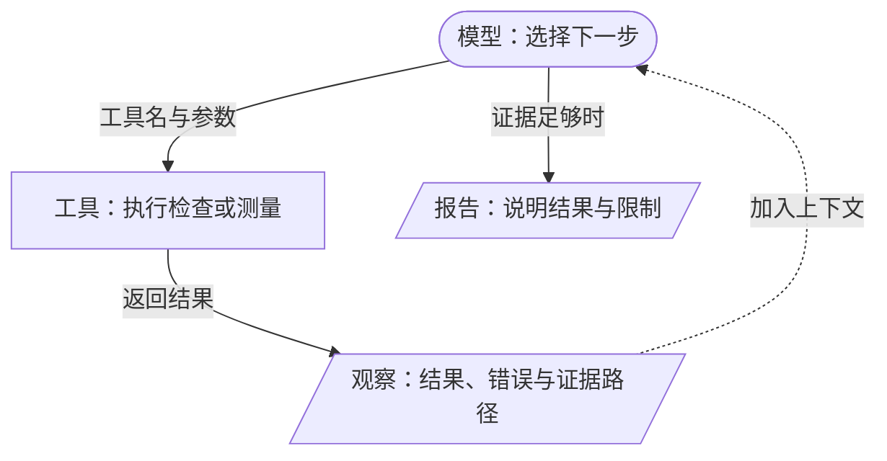
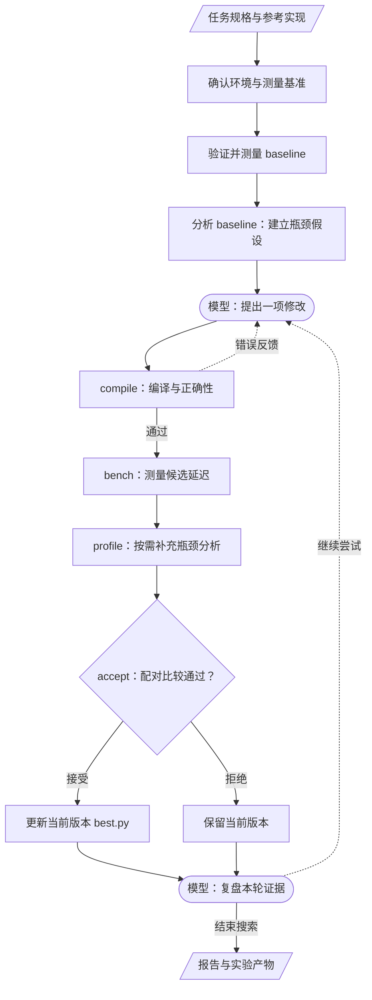

# 第14章 Agent 入门

## 本章导读

> 前两篇里，你已经练习过修改算子、验证结果和比较耗时。现在，我们把其中反复发生的工作交给一个能调用工具的程序。本章用向量加法介绍智能体（Agent），讲清模型怎样提出修改、工具怎样提供反馈，以及一次优化怎样形成闭环。读完后，你应该能判断一份 Agent 优化报告还缺什么证据。前置知识是 [第 5 章的可信计时](../../part1-profiling/chapter5/index.md) 和 [第 8 章的向量加法](../../part2-kernels/chapter8/index.md)，不要求先学过 Agent 框架。

## 14.1 从一次手动优化说起

先从我们已经写过的向量加法 `output = x + y` 开始。数学公式很短，工作却没有随着公式一起结束：你需要确认张量形状和数据类型，读懂当前实现，改变一次数据划分，然后编译、对答案、计时。如果新版本变慢了，还要回到代码里寻找原因。

其中有两类不同的工作。选择“下一次试什么”需要判断；执行“这份代码是否正确、耗时多少”需要遵守固定的测量方法。前者可以借助大语言模型（Large Language Model，LLM），后者由程序完成。

只让模型返回一段代码，还没有完成优化。模型可能遗漏边界掩码，也可能写出正确却更慢的实现。要让它继续工作，程序必须把编译错误、正确性结果和计时反馈交给模型，让它据此修改下一版。这种**围绕目标选择行动、读取反馈并继续行动的程序**，就是本篇讨论的 Agent。

@fig-agent-feedback 展示了这个最小循环。图中的“观察”既可以是成功结果，也可以是明确的失败原因；失败并不会自动让下一轮变得更好，关键在于模型能否据此调整假设。

::: figure fig-agent-feedback

模型通过工具获得外部反馈，再决定继续尝试还是整理报告。
:::

**图例**：圆角框表示模型决策，矩形表示工具执行，平行四边形表示信息或产物；实线表示调用或结果传递，虚线表示反馈进入下一轮。

这里的“学习”容易引起误解。模型会在后续输入中读到失败记录，但本篇代码没有因此训练模型、更新模型参数。变化的是当前任务的上下文和候选源码。你可以把它理解为：同一个助手读过新的实验记录后，重新制定下一步计划。

## 14.2 把算子优化拆成一个闭环

模型能够反复调用工具之后，我们还需要把这些调用组织成一次完整的算子实验。

首先，我们必须固定任务。对于向量加法，“优化加法”还不够明确：输入是连续张量吗，输出是否预分配，允许多大的浮点误差，计时是否包含内存分配？这些条件变化后，两次测量就可能不再回答同一个问题。本篇将这些条件写入任务规格 `task.json`，并用参考实现 `reference.py` 给出预期结果。

随后，我们测量基线实现（Baseline）。基线是一份保留下来的起点，用来回答“相对于什么变快了”。程序还会维护当前已接受版本（Incumbent），即工作区中的 `best.py`。第一轮开始时它来自基线；后续只有通过裁决的候选才能替换它。比较新候选时，应当同时记住这两个参照物，不能把相对上一版的收益写成相对最初基线的收益。

@fig-kernel-optimization-loop 将完整过程分成准备、实验和收尾。它表达的是推荐的工作顺序；实际代码由模型选择工具，并通过评测器和完成检查约束关键行为，并非逐格执行的固定状态机。

::: figure fig-kernel-optimization-loop

一次算子优化从固定任务开始，以可核对的实验产物结束；候选被拒绝时，当前版本保持不变。
:::

**图例**：圆角框表示模型提出修改或复盘，矩形表示准备和工具执行，菱形表示接受判定，平行四边形表示输入或产物；实线表示主要流程，虚线表示失败反馈或继续迭代。箭头上的“通过、接受、拒绝”给出分支条件。

测量设备的带宽和算力基准，有助于判断还可能从哪里获得收益，但这些数值也有适用范围。例如，拷贝微基准得到的是该测试方式下的带宽参照，并不等于任意算子的可达带宽。如果峰值测量失败，我们仍可检查正确性、比较延迟，只是不能继续声称“达到了峰值的多少”。

性能分析（Profiling）也需要区分证据强弱。当前 `profile_kernel` 可以使用计算量、读写字节数和计时构造 Roofline 估算；这种结果用于提出瓶颈假设，不能代替硬件计数器。到 [第 15 章](../chapter15/index.md)，我们会专门说明这一区别。

## 14.3 理解 ReAct 与反思

有了工具返回的结果，模型就可以据此调整下一次尝试。我们用一次参数修改来看看这个过程。

推理与行动相结合的 ReAct 范式，让模型在选择行动后读取外部结果，再继续选择行动。本篇不要求读者查看模型的内部思考过程；我们要保留的是**可检查的改动说明、工具调用和工具结果**。这些信息足以讨论一次修改是否有依据。

以 `block_size` 为例。它控制一个 Triton program 处理多少个元素。调大它可能减少 program 数量，也可能改变寄存器需求和编译器的数据映射。因此，“把 block 调大”只是候选方案，不能直接写成优化结论。

一个完整的实验假设应该包括以下内容：

| 要回答的问题 | 向量加法中的例子 |
| --- | --- |
| 当前看到了什么 | 当前版本的计时和 program 数量已经记录 |
| 准备只改变什么 | 调整 `block_size`，保持任务、输入和计时条件不变 |
| 如何判断结果 | 先过正确性，再与当前版本交错配对计时 |
| 结果能说明什么 | 该参数改动在本次任务和环境下是否值得接受 |
| 还不能说明什么 | 没有资源数据时，不能确定变慢是否来自寄存器压力 |

反思（Reflection）发生在结果返回之后。假如候选正确，却没有通过接受阈值，下一步可以重测噪声，也可以换一种修改；如果候选答案错误，应先检查索引和掩码，继续比较延迟没有意义。

反思不需要写成长篇自述。简短地记录“本轮修改、观察到的现象、下一步计划”通常更便于检查。尤其要避免把猜测写成工具测得的事实：`bound = memory-bound` 是模型估算得到的分类时，报告就应保留“估算”这个前提。

## 14.4 模型怎样调用工具

接下来，我们看看模型返回的工具名和参数怎样变成一次函数调用。

在本书实现中，工具先注册自己的名字、用途和参数格式。模型看到这些描述后，可以返回一个工具名和一组 JSON 参数。程序解析参数，调用对应函数，再把结果作为新的工具消息加入对话。

这和你手工调用 Python 函数的区别在于：下一次调用哪个函数、参数填什么，由模型根据上下文提出。执行函数、验证参数、解释返回值结构，仍然是应用程序的工作。模型生成了一个工具调用，并不意味着该工具已经成功执行。

源码中的三个入口分别承担不同职责：

| 文件 | 阅读时关注的问题 |
| --- | --- |
| [`agent.py`](https://github.com/datawhalechina/hello-gpu/blob/main/code/part3-agent/kernel_optimize/agent.py) | 工具结果怎样回到对话，什么时候允许结束 |
| [`tools.py`](https://github.com/datawhalechina/hello-gpu/blob/main/code/part3-agent/kernel_optimize/tools.py) | 工具接受哪些参数，谁可以更新 `best.py` |
| [`prompts.py`](https://github.com/datawhalechina/hello-gpu/blob/main/code/part3-agent/kernel_optimize/prompts.py) | 模型收到哪些任务要求和优化建议 |

不要把工具简单理解成“不会出错的事实来源”。工具也可能依赖缺失、输入不合法、采样不充分。相比模型自由生成的一段性能描述，结构化结果的价值在于：我们可以定位它对应的源码、任务、测量方法和文件，再检查结论是否成立。

## 14.5 明确这套 Agent 能做什么

我们把搜索范围限制在一个给定任务中的 Triton 算子。任务规格定义输入与输出，参考实现负责正确性，模型在这组约束内修改候选。CUDA 或 HIP C++ 代码可以作为理解和转换的输入，但当前评测器不直接编译这些语言；转换后的 Triton 版本仍需重新验证。

如果你只想枚举几个明确的参数，普通网格搜索可能更简单。Agent 的价值在于能够结合错误信息、代码结构和实验反馈选择不同尝试，但这也让它的搜索路径更难完全重复。相同任务和相同模型配置不保证产生逐字相同的候选；可复核的重点是每份候选是否经过相同的检查，以及结论能否追溯到对应记录。

本篇也不预设加速倍数。已经优化过的基线可能没有明显改进空间；只在一个 shape 上有效的候选，也不能自动推广到其他输入或 GPU。报告应允许“没有找到值得接受的版本”，这同样是一次有信息量的实验结果。

接下来，我们先把编译、计时和接受判定封装成工具，再让模型反复调用它们。[第 17 章](../chapter17/index.md) 将用向量加法练习完整的搜索与复测过程。

## 14.6 练习：判断一份报告是否可信

试着根据以下情形，区分模型的提议、工具的观察和可以得出的结论。

1. 模型说“这个实现减少了一次全局内存写回，所以一定更快”。把这句话拆成代码事实、性能假设和需要补充的实验。
2. 候选编译成功，但尚未对答案。指出 @fig-kernel-optimization-loop 中它还不能越过的检查，并说明原因。
3. 一轮候选被拒绝后，为什么 `best.py` 应保持不变？如果每轮生成代码时都覆盖它，下一次比较会失去什么？
4. 不看源码，画出模型、工具和反馈之间的关系；再打开 `agent.py`，找到与三个角色对应的位置。

## 本章小结

- Agent 在目标约束下反复选择行动、调用工具和读取反馈，模型参数不会因一次反馈而自动更新。
- 基线是最初的参照，当前版本是已经被接受的参照，候选则是尚待验证的修改。
- 正确性、计时和接受判定承担不同职责；瓶颈估算需要与硬件实测区分。
- 一次搜索没有获得加速，也可以通过完整的负结果帮助我们缩小后续尝试范围。

下一章把这些要求落实为工具接口，先回答一个具体问题：怎样让模型知道候选到底失败在哪一步？

## 延伸阅读

- [ReAct 原论文](https://arxiv.org/abs/2210.03629)：理解推理、行动与外部反馈的交替过程。
- [hello-agents](https://github.com/datawhalechina/hello-agents)：补充通用 Agent 概念与工具调用基础。
- [第 15 章：工具封装](../chapter15/index.md)：将正确性和计时约定变为结构化接口。
