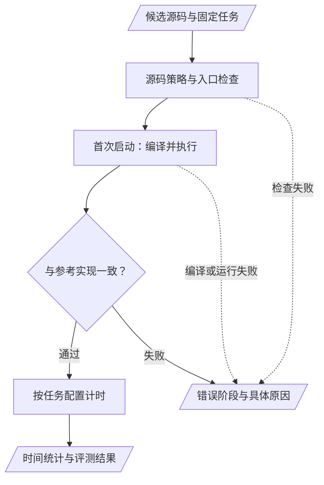
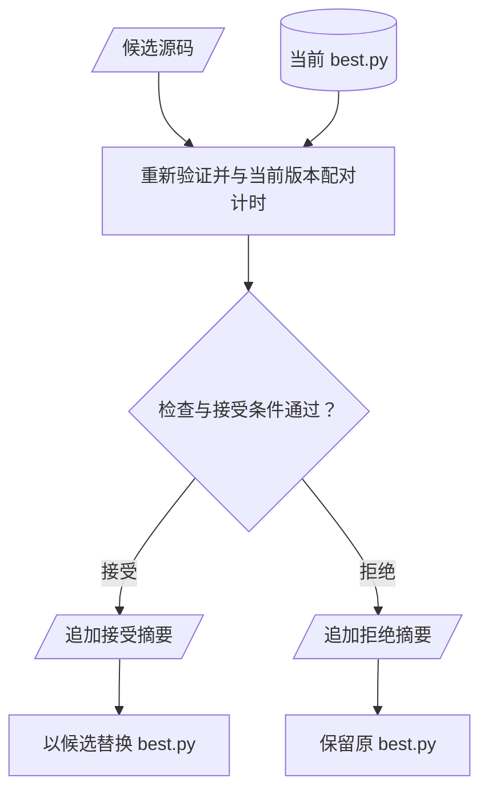

# 第15章 工具封装

## 本章导读

> 如果模型提交了一份候选，程序只返回“失败”，它很难知道该改索引、改语法，还是检查环境。本章把 [第 5 章的计时方法](../../part1-profiling/chapter5/index.md) 和前一章的反馈循环落实为工具接口。我们仍以向量加法为例，依次讨论编译与正确性、独立计时、瓶颈分析，以及候选的接受判定。读完后，你应该能根据返回字段定位失败阶段，并解释为什么“测得更快”还不等于“可以替换当前版本”。

## 15.1 先固定任务，再设计工具

这一节先明确工具共同遵守的输入条件，避免每个工具测的是不同问题。

假设模型拿到一个向量加法任务，把 FP16 输入改成 FP32，又自行减少测试元素数量。新版本可能更容易写对，也可能得到更短的计时，但它已经偏离了原任务。工具接口需要把“允许改变的源码”和“应当保持的实验条件”分开。

本篇的任务规格 `task.json` 固定张量、入口、正确性与计时配置。候选通过 `source` 参数交给工具；工具读取工作区里的同一份规格，而不是让模型在每次调用时重新声明一套条件。

当前向量加法示例的几个字段如下。这些是源码中的**任务配置**，不是一次实验输出。

| 字段 | 当前配置 | 约束什么 |
| --- | --- | --- |
| `entrypoint` | `launch` | 工具调用的函数入口 |
| `shape` | `4096 × 2048` | 本次任务的输入规模 |
| `tensors` | 两个 FP16 输入、一个 FP16 输出及元素数量 | 参数类型与输入输出职责 |
| `correctness` | 随机种子 17、29，`atol = rtol = 0.001` | 检查输入与误差容限 |
| `benchmark` | 预热 10 次、25 个样本、每样本 5 次重复 | 统一计时口径 |
| `minImprovementFraction` | `0.01` | 相对当前版本的接受阈值 |

完整配置见 [`task.json`](https://github.com/datawhalechina/hello-gpu/blob/main/code/part3-agent/chapter15/fixtures/vector_add/task.json)。如果你要研究非整除长度，应创建另一份相应任务，同时修改张量形状与元素数量；不要只改候选中的常数，否则测量条件就失去了一致性。

接口的另一端是结构化返回值。模型需要先知道调用是否完成，再知道正确性是否通过，最后才有资格解读时间。与一段混杂日志相比，命名明确的字段更容易让程序和读者分别检查这些条件。

## 15.2 编译通过之后，还要对答案

这一节说明 `compile_kernel` 为什么同时承担正确性检查。

在 Triton 中，许多编译工作发生在首次启动核函数时。因此，只解析 Python 文件不能证明候选能在目标设备上运行。当前 `compile_kernel` 会通过评测器检查源码、触发实际执行，并与参考实现比较；它使用只检查正确性的路径，不进行性能采样。

你可以按以下顺序阅读返回结果：

| 返回字段 | 怎么读 | 不能据此推断什么 |
| --- | --- | --- |
| `ok` | 当前检查是否通过 | `true` 不代表快于基线 |
| `stage` | 大致失败阶段；成功时也可为 `run` | 不能只凭 `run` 判断是答案错误 |
| `errors` | 查看具体错误及可获得的定位信息 | 行号可能缺失，不保证每个错误都精确定位 |
| `warnings` | 补充信息 | 空列表不等于候选适用于所有输入 |

例如，漏掉尾部掩码和缺少依赖可能都表现为无法完成一次运行，但处理方式完全不同。前者需要检查下标，后者应先修复环境。工具的职责是保留这种区别，而不是统一改写成“请重试”。

@fig-tool-validation 将评测器中的检查顺序画出来。只有走完正确性路径，性能字段才有意义。图中的检查是当前任务范围内的检查，不是对所有形状、所有设备的正确性证明。

::: figure fig-tool-validation

编译、正确性和计时逐层推进；`compile_kernel` 在正确性检查后返回，`bench_kernel` 继续执行计时。
:::

**图例**：矩形表示执行阶段，菱形表示检查条件，平行四边形表示输入或结果；实线表示主要路径，虚线表示提前失败。失败路径不产生可用的性能结论。

评测器使用独立进程和受控环境，降低候选对计时和执行状态的干扰。这些措施服务于实验一致性，不能把它们概括成完整的操作系统安全沙箱。

## 15.3 计时工具回答“这份源码有多快”

这一节说明 `bench_kernel` 的测量边界，以及返回数值的不同来源。

`bench_kernel` 会重新验证候选，再按任务配置采样。它不把先前一次 `compile_kernel` 成功当作永久通行证，这样即使模型传入了修改后的源码，也不会跳过正确性检查。

计时范围是任务声明的整个 `launch(...)` 调用路径。输出重置在计时事件之前，结果检查在计时事件之后；每个样本汇总多次独立 GPU event 计时。这样可以把输出校验留在实验中，又不把校验本身的开销直接记入核函数时间。GPU event 的异步执行语义可回看 [第 5 章](../../part1-profiling/chapter5/index.md)。

| 字段 | 来源 | 读法 |
| --- | --- | --- |
| `mean_ms`、`median_ms` | 时间样本 | 平均值与中位数，单位 ms |
| `p95_ms`、`std_ms` | 时间样本的统计量 | 观察尾部和波动，不等同于置信区间 |
| `bandwidth_gbps` | `costModel.bytes` 除以计时 | 有效带宽，不是计数器测得的物理显存流量 |
| `tflops` | `costModel.flops` 除以计时 | 按任务工作量推算的吞吐率 |

以 FP16 向量加法为例，每个元素读取两个输入、写回一个输出，任务成本模型记为 6 Byte，完成一次加法。于是算术强度（Arithmetic Intensity，AI）为：

$$
I = \frac{N\ \mathrm{FLOP}}{6N\ \mathrm{Byte}}
  = \frac{1}{6}\ \mathrm{FLOP/Byte}.
$$

这是由任务语义得到的工作量模型。实际缓存行为、内存事务和编译器生成代码可能使物理流量与它不同。因此，在报告中写“有效带宽”能保留这个前提，直接写“显存实测带宽”则会混淆来源。

工具接口里保留了兼容用的 `repeats` 参数，但当前实现忽略它，采用 `task.json` 中的计时配置。如果需要修改采样数量，应该修改任务配置并重新测量比较双方。

## 15.4 用 Roofline 建立假设

这一节解释 `profile_kernel` 当前能提供的分析，以及这些分析的边界。

如果只看一个延迟数字，我们不知道下一轮应当减少计算，还是关注数据搬运。Roofline 模型把算术强度与设备的校准吞吐结合起来，提供一个分析起点。设校准带宽为 $B$，校准算力为 $P$，则任务的模型吞吐上界为：

$$
P_{\mathrm{roof}} = \min(P,\; B I).
$$

两项单位需要一致：带宽乘以 FLOP/Byte 得到 FLOP/s。对于向量加法，代入前一节的 $I = 1/6$ 后，再与当前机器的校准算力比较，就能提出“更值得先研究数据搬运”的假设。没有当前机器的校准结果时，不应填入另一个 GPU 的常数来完成这一步。

当前 `profile_kernel` 的主要输出来自这种工程估算。源码预留的 rocprof 辅助脚本尚未随仓库提供，因此不能将它描述为已经采到了寄存器、占用率和访存计数器。

| 字段 | 当前含义 | 使用限制 |
| --- | --- | --- |
| `ai` | 任务计算量除以字节数 | 来自成本模型 |
| `bound`、`bottleneck` | 根据 Roofline 关系给出的分类与标签 | 是瓶颈假设，不是硬件直接诊断 |
| `bandwidth_utilization_pct` | 有效带宽相对校准拷贝带宽的比例 | 受成本模型、缓存与校准条件影响 |
| `sm_saturation_pct` | 已达吞吐相对 Roofline 上界的比例 | 兼容字段名；不是 SM/CU 实测占用率 |
| `grid`、`vgpr` | 当前没有可用采集值 | 空值表示未知，不能按零解释 |

`measure_peak` 用固定拷贝和矩阵乘微基准得到校准参照，并支持缓存。缓存并不会完整校验 GPU 型号、驱动和运行条件是否发生变化；更换设备或环境后，应重新校准并检查工作区的 `hardware.json`。当前算力上界的选择还优先使用 FP16 参照，不能不加说明地推广到其他数据类型。

这些限制并不妨碍我们开始优化。它们提醒我们：模型分析负责缩小搜索方向，候选是否值得保留，仍需由下一节的实际比较决定。

## 15.5 接受候选需要重新配对比较

这一节解释为什么 `accept_candidate` 不直接比较两次独立 benchmark 的摘要。

假设上午测基线，下午测候选。即使参数相同，设备负载、温度和运行状态也可能变化。把两个中位数相减，会把代码差异和时间漂移放在一起。当前工具在同一轮里交错测量当前版本与候选，并交替改变先后顺序。

对于第 $i$ 对测量，记当前版本时间为 $t_i^{\mathrm{current}}$，候选时间为 $t_i^{\mathrm{candidate}}$，则该对的改进比例是：

$$
r_i = \frac{t_i^{\mathrm{current}} - t_i^{\mathrm{candidate}}}
            {t_i^{\mathrm{current}}}.
$$

正值表示该对中候选更快。工具先计算各对的 $r_i$，再取中位数作为 `improvementFraction`。**各对改进比例的中位数，通常不等于两个整体时间中位数算出的改进比例。** 因此不能由一行候选延迟和改进比例反推出“实测基线延迟”。

当前已有版本存在时，接受规则要求评测成功、至少 5 对样本、中位改进达到配置阈值，并且至少 60% 的配对为正。向量加法配置的阈值是 1%，它是本任务的接受策略，不是适用于所有 GPU 的噪声常数，也不构成统计显著性的证明。

::: figure fig-candidate-promotion

优化阶段通过 `accept_candidate` 决定是否替换当前版本；拒绝也是需要记录的裁决结果。
:::

**图例**：平行四边形表示候选或结果，圆柱表示保存的当前版本，矩形表示执行动作，菱形表示判定；实线表示数据或控制流，分支标签说明是否更新文件。

注意图中的“追加裁决摘要”。`trajectory.jsonl` 记录进入接受工具的结果，每行的 `evaluation` 指向对应评测目录。该目录保存当次任务、候选、参考实现、配对的当前版本和完整评测 JSON；只编译就失败的尝试也会留下评测文件，但不会变成一次接受裁决。工具调用及完整返回值另存到 `tool-calls.jsonl`。摘要与 `best.py` 写入仍不是原子事务，异常后需要核对二者是否一致。

## 15.6 根据失败阶段决定下一步

这一节把工具返回值转化为下一次可执行的检查。

| 观察到的结果 | 优先检查 | 此时应保留什么 |
| --- | --- | --- |
| 依赖缺失或设备不可用 | 环境与任务是否能运行 | 原始错误，不填写时间 |
| 编译或源码检查失败 | 不支持的语法、入口与参数 | 失败源码及错误信息 |
| 正确性失败 | 索引、掩码、数据类型与误差 | 触发错误的任务与输入条件 |
| 正确但未过阈值 | 配对分布与修改假设 | 拒绝原因，保留当前版本 |
| 分析字段为空 | 采集能力与字段来源 | 标记未知，不猜一个值 |

在 [`tools.py`](https://github.com/datawhalechina/hello-gpu/blob/main/code/part3-agent/kernel_optimize/tools.py) 中，可以沿着工具注册找到这些接口，再进入 [`chapter14/`](https://github.com/datawhalechina/hello-gpu/tree/main/code/part3-agent/chapter14) 阅读评测后端。本章的主要工作是理解接口。统一的运行入口与实测报告见 [第 17 章](../chapter17/index.md)。

## 15.7 练习：为结果找对解释

1. `compile_kernel` 返回 `ok = true`，但 `bench_kernel` 失败。列出仍需检查的信息，说明为什么两次工具调用不矛盾。
2. 对照成本模型，推导 FP32 向量加法的算法字节数和算术强度。这里计算的是物理显存事务数吗？
3. 两份摘要都有中位延迟，却没有配对样本。说明哪些比较可以描述，哪些接受结论还不能下。
4. 设计一份错误返回结构，使模型能够分清“答案错误”和“缺少设备”；只需画字段表，不需要伪造实验输出。

## 本章小结

- 工具共享固定任务，将候选源码与实验条件分开。
- 编译、正确性和计时逐层检查；有效带宽和 Roofline 分类需要注明推算来源。
- 接受工具重新配对比较，以配置阈值和样本条件裁决候选，拒绝时保留当前版本。
- 裁决摘要不等于完整实验档案，缺少的信息必须如实标记。

下一章把这些接口接入模型循环，讨论一个更具体的工程问题：候选已经测过，却还没有裁决时，程序能否让模型直接开始下一版？

## 延伸阅读

- [第 5 章：benchmark 与可信计时](../../part1-profiling/chapter5/index.md)：复习计时边界与波动。
- [第 7 章：Roofline 模型](../../part1-profiling/chapter7/index.md)：复习成本模型与性能上界。
- [当前工具实现](https://github.com/datawhalechina/hello-gpu/blob/main/code/part3-agent/kernel_optimize/tools.py)：核对参数、返回字段与接受规则。
