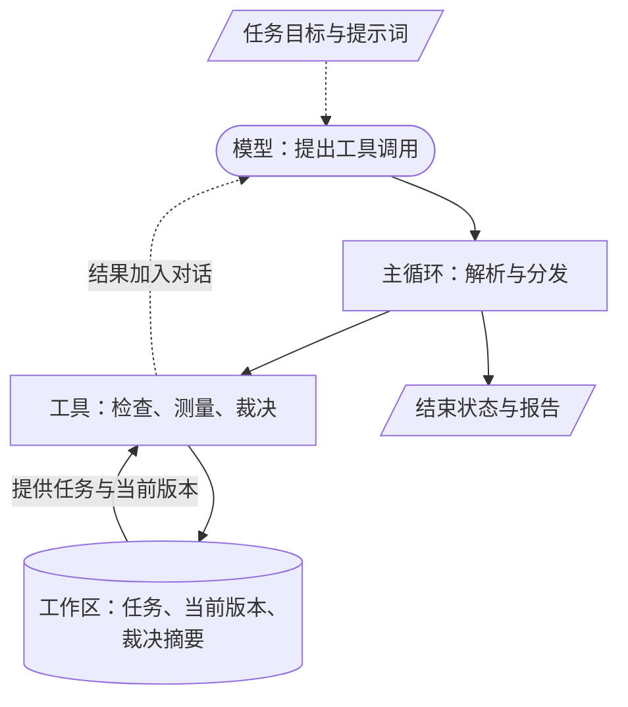
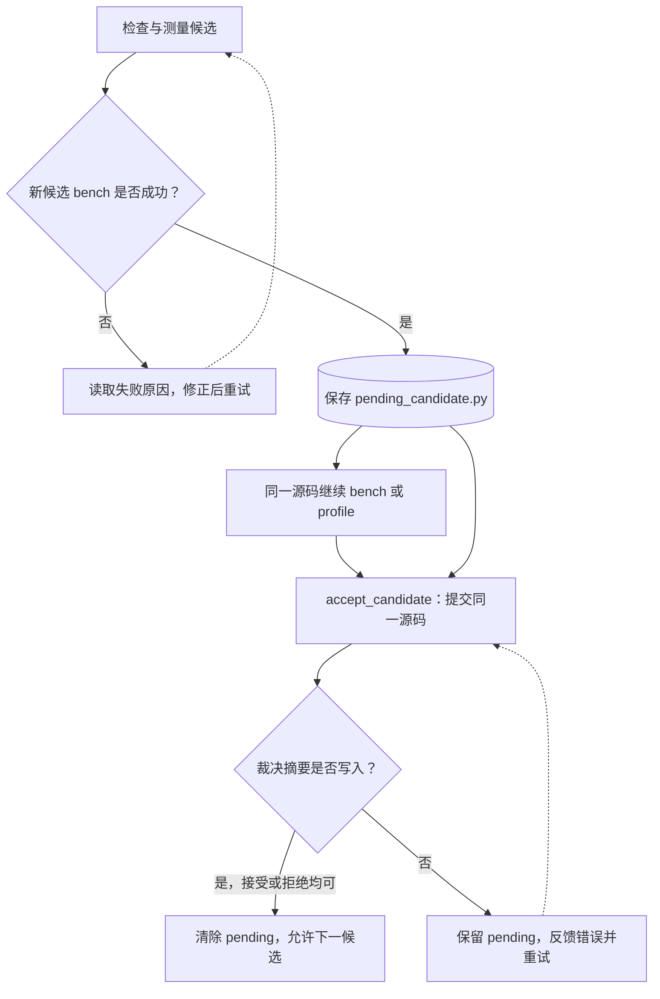

# 第16章 算子优化 Agent 设计

## 本章导读

> 现在我们已经有了能检查正确性、测量时间和裁决候选的工具。剩下的问题是怎样让模型连续使用它们：上一轮的错误放在哪里，已测过的候选何时可以替换，模型说“完成”时程序应检查什么？本章沿着一个候选的生命周期阅读 Agent 实现。前置是 [第 14 章的反馈循环](../chapter14/index.md) 与 [第 15 章的工具接口](../chapter15/index.md)。读完后，你应该能区分提示词建议、程序约束与实验完成证据。

## 16.1 把系统分成三个部分

这一节先明确模型、工具和工作区各自管理什么。

你可以把一次优化看作围绕实验记录展开的协作。模型阅读任务、提出候选并解释下一步；工具按照固定条件执行；工作区保存当前状态。三者分开后，模型即使提出一个失败方案，也不必丢失已经确认可用的版本。

@fig-agent-architecture 中的实线是运行时的调用和数据传递，虚线是供模型阅读的任务约束与反馈。提示词影响模型的选择，工具实现则决定一次调用实际发生什么。

::: figure fig-agent-architecture

Agent 的主要职责分工：模型提出行动，主循环安排调用，工具处理评测，工作区保存状态。
:::

**图例**：圆角框表示模型决策，矩形表示程序执行，圆柱表示持久化状态，平行四边形表示输入或输出信息；实线表示调用或数据传递，虚线表示进入模型上下文的信息。

对应实现集中在 `code/part3-agent/kernel_optimize/`：

| 文件 | 职责 | 初读时关注什么 |
| --- | --- | --- |
| `__main__.py` | 创建工作区、选择入口、打印汇总 | 初始文件怎样准备 |
| `agent.py` | 模型调用、工具结果回传、完成检查 | 一轮调用后状态怎样变化 |
| `tools.py` | 工具注册与评测调用 | 谁能裁决候选 |
| `intake.py` | 将输入整理成任务并执行自检 | 原始代码怎样成为可评测任务 |
| `prompts.py` | 优化步骤与报告要求 | 模型收到哪些建议和限制 |
| `llm.py` | 模型接口与配置 | 消息和工具描述怎样发给模型 |

阅读时不必一次理解所有文件。先跟踪一个候选从 `agent.py` 进入 `tools.py`，再返回工具结果，便能建立整体认识。与之相关的源码可从 [实现目录](https://github.com/datawhalechina/hello-gpu/tree/main/code/part3-agent/kernel_optimize) 打开。

## 16.2 先把问题整理成可检查的任务

这一节比较交互式输入与预置任务，说明它们为什么最终需要相同的任务规格。

交互式入口允许你描述算子、提供源码，并补充形状与数据类型。模型可以使用 `ask_user` 收集缺失信息，再调用 `setup_task` 创建任务。若输入语言不是当前评测器执行的 Triton，还需要转换；转换得到的代码依旧要与参考实现比较。

预置任务入口使用 `--batch`，直接加载已有的 `task.json`、`reference.py` 和 `baseline.py`。向量加法示例采用这条路径，能够把学习重点放在优化循环上，减少自然语言读题带来的不确定性。

两条入口都应回答同一组问题：算什么，哪些输入有效，什么结果算对，计时包含什么，以及允许改动哪些源码。一个含糊的任务不会因为接入大模型就自动变得严谨。

以向量加法为例，输入形状决定待处理的元素数量，`launchArguments` 决定函数收到的参数顺序，误差容限决定参考检查的标准。模型若只读题目描述、没有核对这些字段，就可能优化一段“看起来像向量加法”的程序，却没有解决工作区规定的任务。

预置任务初始化时会把基线复制为 `best.py`，同时保留原始 `baseline.py`。**这次复制表示建立起点，不代表它已经通过当前机器的验证。** 第一轮仍应检查和测量基线，不能把文件名当作正确性证据。

## 16.3 让一项假设对应一份候选

这一节说明候选应当怎样生成，以及为什么要限制每次修改的范围。

一个可解释的候选应当由上一轮观察引出。例如，当前向量加法基线使用 `block_size = 256`。我们可以研究增大它是否有效，但不能预先宣布更大的值更快。改变参数后，program 数量会变化，编译器的映射和资源需求也可能变化，收益与代价都要留给实验回答。

如果同时修改 block size、数据类型、输入规模和计时方法，即使延迟下降，也很难知道哪项改动产生作用。因此，模型每轮应优先改变一个主要因素，并用 `change` 写清本轮差异。读者看到这条说明后，应该能在候选源码里找到对应修改。

这里也要分清两种“优化代码”。一种改变任务的实现方式，例如调整 tile；另一种改变任务本身，例如减少输出元素。后者可能使时间缩短，却违反固定任务。正确性工具和任务规格共同限制这种偏离。

推荐步骤仍是先检查候选，再测量，必要时分析瓶颈，最后进入接受判定。但当前主循环并没有对每个候选强制验证“已经单独调用 compile”或“已经完成 profile”。`bench_kernel` 和 `accept_candidate` 自己会重新进行必要评测；提示词中的完整顺序与程序实际保证，应该分别理解。

## 16.4 管理已经测过、尚未裁决的候选

这一节研究一个容易遗漏的状态：候选已经产生计时结果，却还没有进入接受工具。

假设模型测完版本 A，接着生成版本 B，最后报告“A 比较快”。如果系统没有保存 A 的身份，我们就无法确认报告对应哪一份源码，更无法确认它是否被接受。因此，非交互模式在一份不同于当前 `best.py` 的候选源码通过 `bench_kernel` 后，将该源码保存为 `pending_candidate.py`，表示它正等待裁决。

@fig-pending-candidate 展示了当前代码对这个状态的处理。等待期间，只允许对同一份源码继续计时、分析或裁决；不能换一份源码直接提交，也不能跳到下一份候选。

::: figure fig-pending-candidate

非交互模式保存已通过 benchmark 的新候选源码；只有确认裁决写入后，才清除此状态。
:::

**图例**：矩形表示动作，菱形表示程序检查，圆柱表示保存的候选文件；实线表示状态推进，虚线表示修正后重试。这里“写入裁决”同时包含接受与拒绝，不表示一定获得加速。

“同一份源码”在这里按字符串内容检查，不只是文件名相同。这个约束连接了模型先前看到的候选和真正提交裁决的候选，减少了中途换代码却沿用旧结论的机会。

如果模型提前结束，或达到步数上限时仍有待裁决候选，主循环会尝试自动提交它。提交成功后可以读取已有裁决；提交失败则保留文件并标记未完成。对于仅编译过、尚未成功 benchmark 的候选，不能声称它也已经自动进入完整轨迹。

底层 `run_agent` 有恢复待裁决源码的逻辑，但当前命令行入口会重新复制预置基线到指定工作区。因此，`--workspace` 目前不应被当作完整的断点续跑开关；运行新实验时使用新工作区，避免重置已有的当前版本。

## 16.5 用反馈调整下一次尝试

这一节把一轮结果变成下一轮的输入，而不是把所有结果都解释为“继续加参数”。

模型会在后续消息中读到工具观察。编译错误可以引出语法修改，正确性失败可以引出索引检查，配对改进不足则可能引出重测或改换方向。这些反馈承担不同职责，不应该被压缩成一个统一分数。

| 本轮观察 | 可以尝试的下一步 | 需要保留的限定 |
| --- | --- | --- |
| 尾部输入不正确 | 检查 mask 与元素数量 | 修复后重新验证任务 |
| 候选正确但配对改进不足 | 检查波动，或更换参数方向 | 不能把独立计时的较小值当成已接受 |
| Roofline 估算偏向带宽约束 | 检查算法字节数和数据映射 | 不能直接断言 DRAM 饱和 |
| 参数变大后变慢 | 回看源码差异并考虑资源代价 | 没有资源数据时，原因仍是假设 |
| 必需依赖或设备不可用 | 停止性能判断，解决前提 | 不生成预期性能输出 |

好的复盘通常可以写成一个短段落：“本轮改变了什么；工具实际观察到什么；这支持或否定了哪个假设；下一轮准备只改变什么。”它不需要复述全部历史，更不能把模型的信心作为接受依据。

对于本篇的教学任务，保留失败说明还有另一个作用：让读者能够看出搜索并非单调进步。一个拒绝结果可能排除了某种配置，但它只对相应任务和环境成立，不能升级成“这种配置始终不好”。

## 16.6 区分停止、完成与加速

这一节解释运行结束时究竟应该检查什么。

`max_steps` 限制的是模型调用轮次。一轮回复可以包含多个工具调用，因此它既不等于工具调用总数，也不等于接受裁决的数量。任务里虽然有 `maxRounds` 和 `patience` 字段，当前 Agent 主循环没有把它们实现为自动停止计数器，不能靠修改这两个值就期待程序按它们停止。

模型返回不含工具调用的文本时，主循环会检查是否存在过早收尾的情况。非交互模式关注有没有裁决证据、是否还留有待处理候选，以及本轮活动是否完成；必要时提示模型继续，或尝试提交待裁决源码。最终状态写入 `agent-status.json`。

| 状态 | 当前实现表达的含义 | 读者下一步 |
| --- | --- | --- |
| `complete` | 有可分析的裁决证据，且没有未清除的 pending | 核对轨迹和最终源码 |
| `complete_with_warning` | 前面有可分析记录，但存在未完成尝试等限制 | 将警告写入报告 |
| `incomplete` | 当前不能确认具备完整裁决证据 | 检查缺失步骤，不报告本轮成功 |

这些状态检查的是流程证据，不保证最终版本比基线更快。候选全部被拒绝，也可能形成一份完整报告；找到接受版本，也仍需最后的独立复测才能报告相对最初基线的整体收益。

此外，当前入口正常退出时可能返回退出码 0，即使报告中说明证据未完成。看到终端结束并不足以验收实验。应继续查看 `agent-status.json`、`trajectory.jsonl` 和源码文件是否对应，这正是下一章的实践重点。

## 16.7 练习：沿着状态检查程序

1. 模型已成功 benchmark 版本 A，随后尝试提交版本 B。沿 @fig-pending-candidate 说明程序应当拒绝哪一步，以及理由。
2. 一轮模型回复调用了三个工具，其中只有一次 `accept_candidate`。分别计算模型轮次、工具调用数和裁决数。
3. 所有候选都被拒绝时，什么条件下报告仍然有价值？报告中的“最终结果”应如何表述？
4. 在 `agent.py` 中找到保存和清除 `pending_candidate.py` 的位置，解释为什么不能在收到任意字符串返回后立即清除它。

## 本章小结

- 模型选择行动，工具执行实验，工作区保存任务与当前状态，三者职责分开。
- 提示词建议的流程不等于程序强制的流程；理解实现时需要分别核对。
- 非交互模式为成功 benchmark 的新候选建立待裁决状态，并检查源码一致性。
- 停止运行、证据完整和获得加速是三个不同判断，报告必须分别说明。

下一章用向量加法串起这些检查，学习怎样保存、读图并报告一次多轮优化实验。

## 延伸阅读

- [Agent 主循环](https://github.com/datawhalechina/hello-gpu/blob/main/code/part3-agent/kernel_optimize/agent.py)：阅读待裁决状态与完成检查。
- [工具实现](https://github.com/datawhalechina/hello-gpu/blob/main/code/part3-agent/kernel_optimize/tools.py)：阅读源码如何进入评测器。
- [第 17 章：多轮优化实战](../chapter17/index.md)：从运行产物判断实验是否完成。
