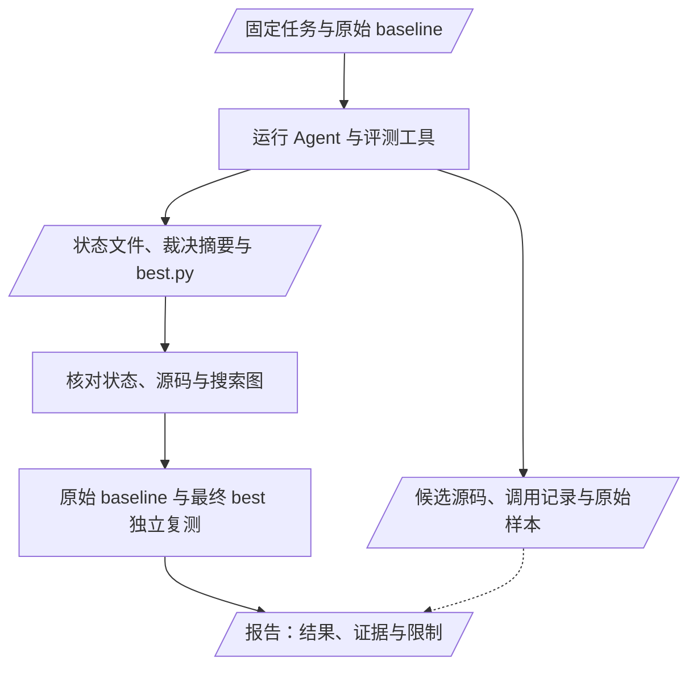
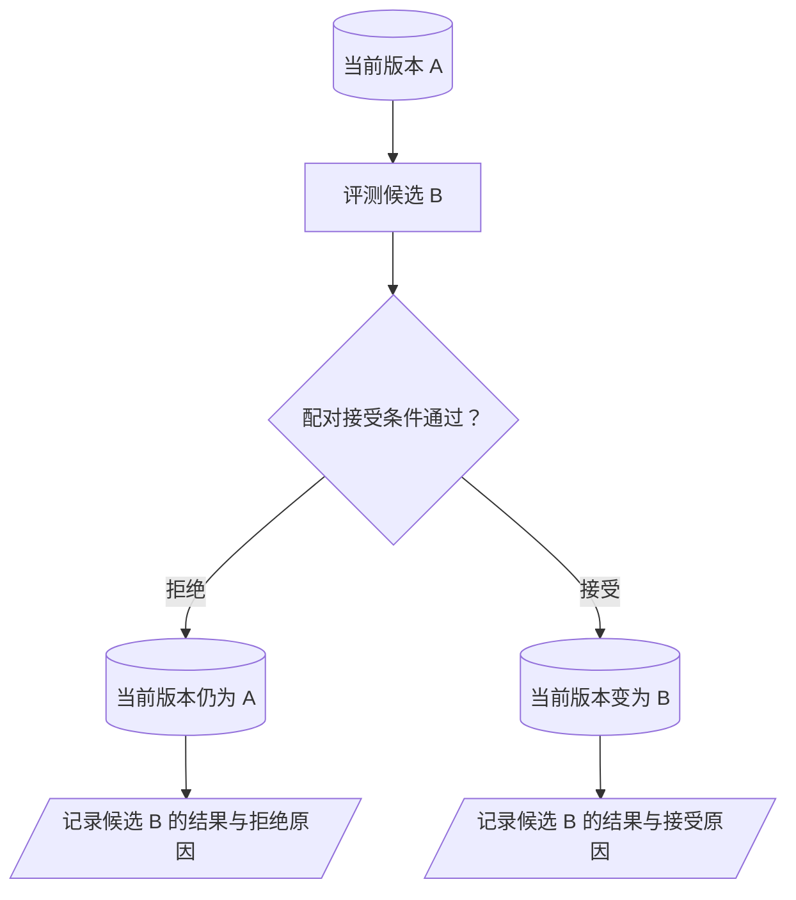
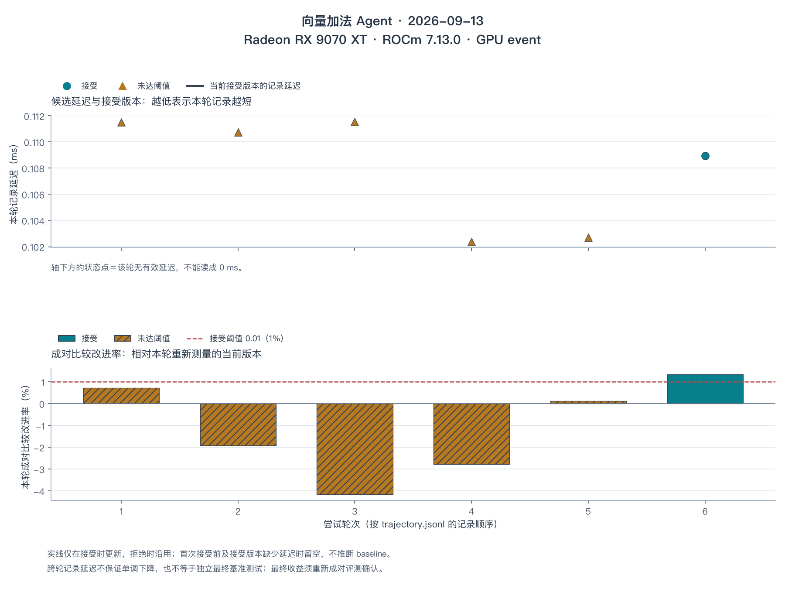

# 第17章 多轮优化实战

## 本章导读

> 本章把 [第 15 章的工具](../chapter15/index.md) 和 [第 16 章的循环](../chapter16/index.md) 放进同一次向量加法实验。我们先固定任务与基线，再检查一次运行是否留下可用结果，最后学习怎样读接受记录、理解曲线并写报告。读完后，你应该能够区分候选计时、配对裁决和最终复测，说明一次搜索得到了什么、还没有证明什么。

::: tip 本章实测
2026-09-13，在 Radeon RX 9070 XT（`gfx1201`）+ ROCm 7.13 + 原生 Ubuntu 24.04 上完成本章实验。25 次模型调用留下 6 条裁决，1 个候选被接受；独立复测时，原始基线与最终版本都约为 **112 μs**，没有确认稳定加速。我们会沿这次实际记录解释：为什么接受判定与最终性能结论需要分开。
:::

## 17.1 选择一个能读懂结果的任务

这一节从向量加法开始，明确为什么它适合检验优化流程。

向量加法的语义只有 `output = x + y`，我们可以把注意力放在实验本身：候选是否保持任务不变，是否经过正确性检查，是否与当前版本公平比较。选择它不代表一定能找到明显加速；一个已经合适的基线，完全可能使所有候选都被拒绝。

本章使用 [`chapter15/fixtures/vector_add/`](https://github.com/datawhalechina/hello-gpu/tree/main/code/part3-agent/chapter15/fixtures/vector_add) 中的预置任务。目录里只需先认识三份文件：`task.json` 固定规格，`reference.py` 定义正确结果，`baseline.py` 提供开始搜索的实现。

| 实验条件 | 当前任务配置 |
| --- | --- |
| 数学语义 | 逐元素相加，写入预分配的输出 |
| 输入 | 两个连续 FP16 张量，形状 `4096 × 2048` |
| 正确性 | 与 PyTorch 参考实现比较，容差见任务配置 |
| 计时 | GPU event；预热、采样和重复次数由任务固定 |
| 接受条件 | 相对当前版本的配对中位改进至少 1%，并满足配对数与正改进比例要求 |
| 当前实测结果 | 6 条裁决、1 次接受；独立复测未确认稳定加速 |

基线的入口如下，片段来自现有 `baseline.py`：

```python
def launch(x, y, output, n_elements):
    block_size = 256  # 故意偏小，给优化留空间（可试更大 block / 向量化）
    grid = (triton.cdiv(n_elements, block_size),)
    _vadd_kernel[grid](x, y, output, n_elements, block_size)
```

先看 `grid` 的计算。增大 `block_size` 会减少同一 grid 中的 program 数量，并不意味着减少 kernel dispatch 次数：这段入口仍调用一次核函数。是否因而更快，需要计时回答；是否改变了寄存器压力或占用率，需要额外证据回答。

## 17.2 运行之前固定基线与记录范围

这一节明确实验开始前必须保留的参照物，并给出尽量集中的运行入口。

保留基线有两个用途。搜索时，它提供最初可验证的实现；搜索结束时，它与最终版本组成独立复测的两端。如果在试验中不断覆盖基线，就无法回答“从起点到终点改进了多少”。

运行入口会在新工作区保留 `baseline.py`，并将它复制为初始 `best.py`。后续接受的候选更新 `best.py`。运行不同任务时使用新工作区；不要把已有工作区参数当作完整的断点续跑功能。

模型配置可以写入程序自动读取的 `~/.config/hello-gpu/kernel-agent.env`，或由当前环境提供。选择支持工具调用的模型，并按照服务商要求配置端点。

| 配置项 | 用途 |
| --- | --- |
| `KERNEL_AGENT_MODEL` | `provider/model` 形式的模型标识 |
| `KERNEL_AGENT_API_KEY` | 服务要求的密钥 |
| `KERNEL_AGENT_API_BASE` | 可选，自定义兼容端点 |
| `KERNEL_AGENT_EXTRA_BODY` | 按模型接口要求调整额外参数；需要移除默认扩展时可设为 `{}` |

密钥留在机器配置中即可，不需要写进教程源码，也不需要提供任何 Git 提交号。Part 3 的依赖现已锁定 ROCm 7.13.0、PyTorch 2.11.0 与 Triton 3.6.0；`gfx1201` 对应 AMD 的 `gfx120X-all/` 源和 `rocm-sdk-libraries-gfx120x-all` 包，映射方法见 [附录 B](../../appendix/appendix-b-switch-gpu/index.md)。在 GPU 机器的仓库根目录执行：

```bash
cd code/part3-agent
uv sync
source ./activate-rocm.sh
bash chapter17/run_all.sh --skip-pytest
```

这个入口先检查基线并重新校准当前机器，再运行 Agent、完成 5 次独立配对复测并生成图。默认最多调用模型 25 次；模型调用步数和接受工具的裁决轮数不同，需要调整预算时可设置 `MAX_STEPS`。`--skip-pytest` 跳过的是开发用测试套件，候选的正确性检查仍由评测器执行。只需要运行搜索时，可将最后一行换为 `bash chapter15/run_vector_add.sh`，但这个较短入口不会自动生成可视化图和 `run_summary.json`。

运行后以终端打印的实际工作区为准。每次新实验使用空目录，避免覆盖上一次的基线、候选和记录；只查看已有结果时使用脚本的 `--reuse-latest`。

## 17.3 先检查产物，再读性能数字

这一节按文件职责检查一次运行，避免被“程序已退出”误导。

@fig-agent-experiment-artifacts 展示了从任务到报告的信息关系。运行入口会自动保存评测与调用记录，报告仍需根据这些文件核对模型的解释。

::: figure fig-agent-experiment-artifacts


运行状态、搜索过程与最终复测分别支持报告中的不同结论，候选源码和原始记录将这些结论连接起来。
:::

**图例**：矩形表示执行过程，平行四边形表示输入、记录或报告；实线表示主要产物关系，虚线表示补充证据。运行检查与最终复测不能互相替代。

先打开 `agent-status.json`。若状态是 `incomplete`，应定位缺失步骤；若是 `complete_with_warning`，应阅读警告并在报告中保留限制。即使状态是 `complete`，也只说明当前完成检查通过，不保证性能变好。

然后读取 `trajectory.jsonl`。它每行记录一次进入接受工具的裁决摘要，主要字段包括：

| 字段 | 含义 |
| --- | --- |
| `change` | 本轮声明的源码改动 |
| `status`、`reason` | 评测状态与裁决原因 |
| `accepted` | 是否替换当前版本 |
| `latencyMs` | 本轮候选的记录延迟，可能为空 |
| `improvementFraction` | 相对当时当前版本的配对改进中位数，可能不存在 |

最后检查 `best.py` 与 `baseline.py`，确认当前版本究竟改了什么。完整记录按职责存放：

| 文件或目录 | 用来核对什么 |
| --- | --- |
| `environment.json`、`hardware.json` | 实际软件环境与当次硬件校准 |
| `preflight.json`、`baseline-evaluation.json` | 搜索前的正确性与基线计时 |
| `model-messages.jsonl` | 实际进入模型上下文的提示词、回复与反馈 |
| `tool-calls.jsonl` | 工具参数与未经上下文截断的返回值 |
| `evaluations/evaluation-*/` | 每次评测的源码快照、任务、参考实现和完整结果 |
| `final-comparison.json` | 原始基线与最终版本的独立配对样本及汇总 |

`trajectory.jsonl` 每行的 `evaluation` 指向对应评测目录。只调用编译工具就失败的尝试会留下文件，但不会额外增加一行接受裁决。终端展示与模型上下文可能截断较长的观察；完整工具返回值仍保存在工具日志中。评测 JSON 里的子进程输出本身有长度限制，因此不能将它称为未截断的全部进程输出。

## 17.4 分清搜索曲线里的三种量

这一节说明图例与坐标轴各自代表什么，避免把候选中最小的数字当成已接受结果。

可视化入口会生成 `rounds_overview.png`、`process_timeline.png` 和 `status_breakdown.png`。总览图用于观察候选延迟与配对改进；时间线连接改动说明和裁决；状态分布统计不同结果的次数。这三张图都来自同一份裁决摘要，因此摘要没有记录的尝试不会凭空出现在图中。

读总览图时，先分清以下三种量：

| 图中信息 | 表示什么 | 容易误解的地方 |
| --- | --- | --- |
| 候选延迟点 | 该轮候选的记录延迟 | 跨轮更小的点不等于该轮被接受 |
| 当前接受版本记录线 | 只在接受事件发生时更新的延迟记录 | 不是每一轮都重新测量当前版本，也不保证单调下降 |
| 配对改进柱 | 候选相对当时当前版本的改进中位数 | 不是相对最初基线的整体加速 |

当前版本记录线在拒绝轮保持原值，在首次接受之前不补一个猜测的基线值。如果接受记录缺少有效时间，该处应显示缺失，不能继续把旧版本的时间挂在新版本名下。图例同时使用文字、点形和纹理，接受与拒绝不只依赖颜色区分。

@fig-accepted-version-state 用版本身份解释这一点。它是**状态关系示意**，不代表一次已经执行的搜索，也没有填入虚构的性能数值。

::: figure fig-accepted-version-state


候选结果与当前版本身份分别记录：一次较小的候选延迟，只有通过接受条件后才对应版本替换。
:::

**图例**：圆柱表示被保留的版本，矩形表示评测动作，菱形表示接受判定，平行四边形表示裁决记录；实线表示状态推进，分支上的文字决定版本是否变化。

现在把这些含义放回本次实验。@fig-vector-add-search 显示 6 条裁决：前 5 条未达阈值，第 6 条被接受。第 4 条候选的记录延迟比第 6 条更低，却没有被接受，因为它们分别与当时重新测量的当前版本比较，不能按跨轮最小值选胜者。

::: figure fig-vector-add-search


FP16 向量加法在 RX 9070 XT + ROCm 7.13 上的真实搜索记录；图中的时间属于各轮评测，最终收益另行复测。
:::

**图例**：三角形与斜纹柱表示未达接受阈值，圆点与实色柱表示接受；红色虚线表示 1% 阈值，黑色记录线仅从首次接受开始更新。本次直到第 6 条才接受，因此不会补画前 5 条的当前版本延迟。

拒绝并非没有收获。例如，正确但未过阈值的记录告诉我们：在这组配对测量和接受策略下，证据不足以替换当前版本。它没有证明候选在所有条件下都更慢，也没有证明编译器一定使用了更多寄存器。

## 17.5 独立复测回答整体收益

这一节将“搜索时如何挑选候选”与“最后如何报告性能”分开。

搜索中的每轮比较面向当时的当前版本。经过多次接受，参照物已经改变，采样时刻也不同。将这些轮次的最佳点连起来，或者连乘每轮改进比例，都不能替代最终的基线对比。

搜索结束后，运行入口会固定最终 `best.py`，重新与原始 `baseline.py` 进行 5 次同口径配对测量，并保存 `final-comparison.json`。如果需要单独复测，可以使用同一个 `compare.py` 入口，将路径替换为本次实际工作区：

```bash
uv run python chapter14/compare.py \
  --task "chapter15/logs/tasks/<本次工作区>/task.json" \
  --incumbent "chapter15/logs/tasks/<本次工作区>/baseline.py" \
  --candidate "chapter15/logs/tasks/<本次工作区>/best.py" \
  --runs 5
```

这里的尖括号是待替换路径，不是可以原样执行的参数。单独复测时也应保存输出，避免新结果与之前的文件混淆。

拿到原始数据后，可以分别报告两项统计量。第一项是同口径下基线与最终版本中位延迟之比。这里的 $t_{\mathrm{baseline}}$ 和 $t_{\mathrm{final}}$ 分别表示多次独立进程运行各自得到的中位延迟列表，公式对应输出中的 `medianIncumbentMs / medianCandidateMs`，没有将所有原始样本混成一组：

$$
S = \frac{\operatorname{median}(t_{\mathrm{baseline}})}
         {\operatorname{median}(t_{\mathrm{final}})}.
$$

第二项是 `medianPairedImprovementFraction`：先在每次运行内部计算配对改进中位数，再跨独立运行取中位数。它们回答相关但不同的问题，不能混用，也不能从其中一个反推另一个的原始时间。小幅收益还应结合样本波动、重复运行和测试范围来解释。

本次最终版本把 `block_size` 从 256 改为 512，源码保存在 [`chapter17/vector_add_selected.py`](https://github.com/datawhalechina/hello-gpu/blob/main/code/part3-agent/chapter17/vector_add_selected.py)。第 6 条裁决的配对改进为 **+1.35%**，通过了当前规则；随后 5 次独立复测得到以下结果：

| 统计量 | 原始基线 | 最终版本 |
| --- | --- | --- |
| 独立运行中位延迟列表的中位数 | 112 μs | 112 μs |
| 5 次运行的中位延迟范围 | 107–114 μs | 107–113 μs |
| 正确性 | 通过 | 通过 |

时间比值约为 **1.00 倍**，跨运行的配对改进中位数为 **+0.261%**；各次配对改进从 **−1.74% 到 +1.17%**，正负都有。我们据此保留“搜索时接受了候选”的事实，但不把它写成稳定的性能提升。详细逐次数据见 [实验报告](./optimization-report.md)。

与人工优化比较时，也需要相同的任务、起点与实验条件。如果本次没有人工对照，就只报告 Agent 的调用次数、修改内容和结果，不猜测“熟练者几轮就能完成”。模型调用耗时、GPU 评测耗时和最终核函数延迟也应分别记录，不能用其中一项代表总优化成本。

## 17.6 写一份读者能核对的报告

这一节把实验收束成结果，而不是把模型最后一段回复直接当成报告。

一份简洁的报告可以先说有没有找到可接受版本，再展示任务、环境、重要尝试和最终复测。每条结论旁边给出对应文件或图，读者就能从叙述回到证据。

| 报告内容 | 应回答的问题 |
| --- | --- |
| 任务与基线 | 算什么，输入范围是什么，起点是哪份源码 |
| 环境与配置 | 在什么 GPU、ROCm、系统与模型配置下运行 |
| 完成状态 | 有没有未完成候选或证据警告 |
| 关键尝试 | 改了什么，为什么接受或拒绝 |
| 最终复测 | 基线与最终版本的正确性、时间及波动 |
| 限制 | 哪些解释是估算，哪些输入和设备尚未覆盖 |

本次填写完成的 [向量加法实验报告](./optimization-report.md) 同时保留了失败尝试和独立复测。模型运行到步数上限后由程序提交最后一个已测候选，状态文件显示流程完成，但这既不表示搜索已经收敛，也不表示模型生成的原因解释已经得到验证。

报告中的性能图应由本次实际任务的原始输出生成，并标明设备、软件环境和计时范围。更换环境后重新测量，不能只修改旧图的设备标签。

## 17.7 练习：完成一次可复盘的优化

1. 找出当前 fixture 中与输入规模有关的所有字段，说明只修改 `n_elements` 为什么可能改变实验含义。
2. 假设某个候选跨轮看起来更快，却被配对裁决拒绝。结合采样时间和比较对象，给出一个可能的解释，并说明还需哪些数据。
3. 运行完成后，分别指出支持“流程完成”“版本被接受”“相对基线获得加速”的证据文件或实验步骤。
4. 选择一次被拒绝的尝试，用一个短段落区分源码改动、观察结果与原因假设。没有实测时，先完成这份记录的字段设计。

## 本章小结

- 先固定任务与基线，再搜索候选；一次搜索不预设收益大小。
- 运行状态、裁决摘要和完整实验档案的覆盖范围不同，需要逐项核对。
- 候选延迟、当前版本记录与配对改进有不同含义，图例应明确说明。
- 最终加速结论来自原始基线与最终版本的独立复测，不能从搜索曲线反推。

至此，算子层的自动化流程已经讲清。进入真实模型时，还需要先测量目标算子占端到端耗时的比例：即使算子变快，模型整体也未必得到同等收益。

## 延伸阅读

- [向量加法实验报告](./optimization-report.md)：查看真实裁决与独立复测。
- [第 16 章：算子优化 Agent 设计](../chapter16/index.md)：回看候选状态和结束条件。
- [可视化源码](https://github.com/datawhalechina/hello-gpu/blob/main/code/part3-agent/chapter16/visualize_trajectory.py)：核对曲线、状态和图例的含义。
