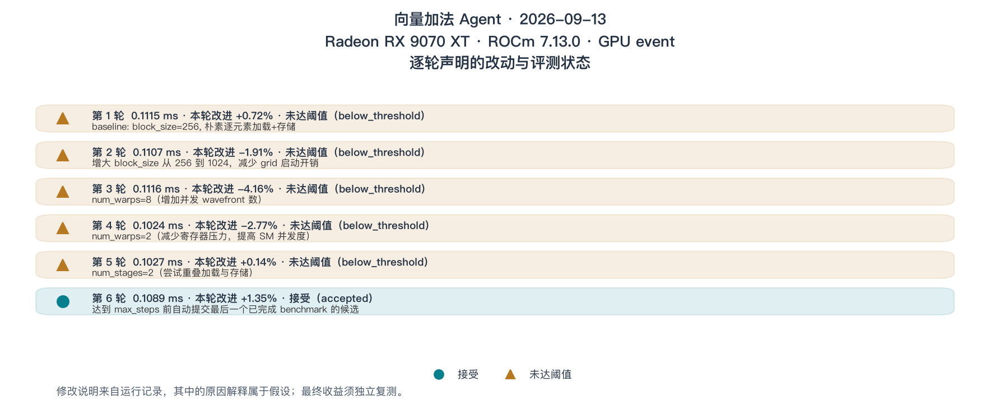
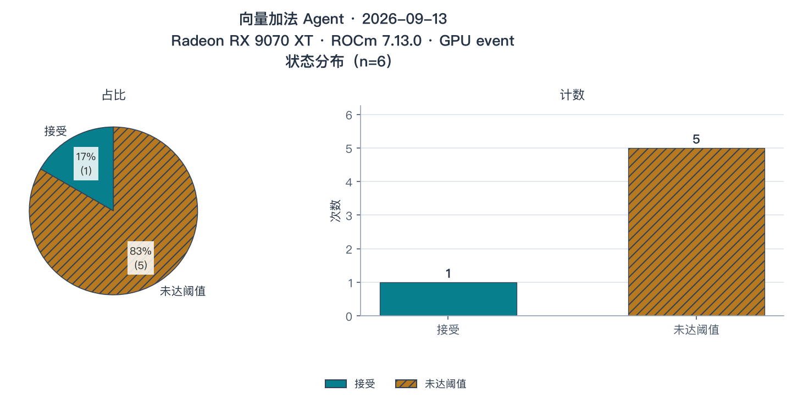

# 向量加法 Agent 实验报告

2026-09-13，我们在 Radeon RX 9070 XT 上运行了 [第 17 章](./index.md) 的向量加法实验。Agent 搜索留下 6 条裁决，其中 1 个候选被接受；随后 5 次独立复测没有确认稳定加速。这份报告保留这两个不同层面的结果，并沿源码和样本解释它们为何可以同时成立。

## 1. 任务与环境

这一节固定本次实验的范围，便于你判断哪些条件需要在复跑时保持一致。

| 项目 | 本次配置 |
| --- | --- |
| 任务 | `output = x + y`，两个连续 FP16 输入，形状 `4096 × 2048` |
| 设备 | AMD Radeon RX 9070 XT，`gfx1201` |
| 系统 | 原生 Ubuntu 24.04.5 LTS，Linux `7.0.0-31-generic` |
| 软件 | ROCm SDK 7.13.0，HIP runtime 7.13.99004，PyTorch 2.11.0+rocm7.13.0，Triton 3.6.0+rocm7.13.0 |
| Python 与调用库 | Python 3.12.3，LiteLLM 1.95.0 |
| 模型 | 硅基流动兼容接口，`openai/Qwen/Qwen3.6-35B-A3B`，temperature 0.2，`enable_thinking=false` |
| 正确性 | seeds 17、29；`atol=rtol=0.001`；检查输入不变、输出契约与数值结果 |
| 计时 | GPU event；warmup 10，samples 25，每个样本 innerRepeats 5 |
| 接受条件 | 配对改进中位数至少 1%，并满足评测器的有效配对数与正改进比例要求 |
| 搜索预算 | 最多 25 次模型调用；不是 25 个候选 |
| 最终复测 | 原始基线与最终版本，5 次独立进程运行 |

在 GPU 机器的仓库根目录执行：

```bash
cd code/part3-agent
uv sync
source ./activate-rocm.sh
bash chapter17/run_all.sh --skip-pytest
```

第 17 章入口调用共用的 `chapter16/run_and_visualize.sh`。本次实测使用同一共用入口，显式设置 `MAX_STEPS=25`，并将工作区命名为 `vector-add-20260913-01`。新入口默认采用相同预算；读者不需要复用这个目录名。

## 2. 搜索完成了哪些步骤

这一节核对流程是否结束，再讨论候选的表现。

搜索前，原始基线通过正确性预检与计时检查；参考输出与基线输出的最大绝对、相对误差均为 0。程序还重新进行复制与矩阵乘法校准，避免直接沿用旧环境的硬件画像。

本次共有 25 次模型调用、27 次工具调用、25 份工具评测记录，以及 6 条接受裁决。工具调用和裁决轮数不同：编译、计时、profile 都可能各占一次调用，而它们并不各自构成一次版本替换。

到达第 25 步时，最后一个候选已完成 benchmark，尚未进入接受工具；程序自动提交同一份源码，完成第 6 条裁决。`agent-status.json` 中 `state=complete`、`evidenceReady=true`、`pendingCandidate=false`。这里的完成表示没有遗漏待裁决候选，**不表示搜索收敛**。此次最终文本也是步数用尽的程序提示，不能冒充模型自行写出的分析报告。

从基线预检开始，包含校准、搜索和最终 5 次配对复测的运行段约耗时 **216 s**；它不包含依赖安装与绘图，也不是 GPU kernel 的运行时间。

## 3. 从候选源码理解搜索

这一节将模型声明与实际改动分开，再查看接受工具的结果。

所有裁决候选都通过正确性检查。表中的改动来自各轮保存的 `candidate.py`；时间与改进来自同轮的 `result.json`。前 5 条都被拒绝，因此这些候选以及第 6 条始终与原始基线比较。

| 裁决序号 | 源码确认的配置 | 候选记录延迟（μs） | 配对改进中位数 | 裁决 |
| --- | --- | --- | --- | --- |
| 1 | 重新生成同配置基线，`block_size=256` | 112 | +0.719% | 未达阈值 |
| 2 | `block_size=1024`，其余启动参数默认 | 111 | -1.91% | 未达阈值 |
| 3 | `block_size=256, num_warps=8` | 112 | -4.16% | 未达阈值 |
| 4 | `block_size=256, num_warps=2` | 102 | -2.77% | 未达阈值 |
| 5 | `block_size=256, num_stages=2` | 103 | +0.136% | 未达阈值 |
| 6 | `block_size=512`，其余启动参数默认 | 109 | +1.35% | 接受 |

第二条记录中，模型将增大 block 解释为“减少 grid 启动开销”。源码只能确认 grid 中的 program 数减少，kernel dispatch 仍然只有一次。类似地，`num_warps=2` 是否降低实际寄存器占用、`num_stages=2` 是否产生预期流水效果，都没有硬件计数器或编译产物证据支持。本报告将这些解释保留为假设。

@fig-vector-add-timeline 保留运行记录中的原话，让你能将模型提出的理由与上表逐项核对。

::: figure fig-vector-add-timeline


RX 9070 XT + ROCm 7.13，FP16 向量加法：修改说明来自运行记录，计时和裁决来自评测工具。
:::

**图例**：三角形表示未达阈值，圆点表示接受；每行同时列出本轮候选延迟与相对当时当前版本的配对改进。文字里的原因解释未被自动验证；第 6 条自动提交的实际源码配置是 `block_size=512`。

还发生了两次未进入接受裁决的失败。第一次 profile 调用携带的源码缺少必要的 `block_size` 实参，返回 `compile_error`。另一次候选使用 `cache_modifier='ca'`，编译器返回 `Cache modifier ca not supported`；模型随后改写候选。这两份失败源码和错误分别保存在 `evaluation-0001` 与 `evaluation-0010`，没有被补写成有性能数字的裁决行。

@fig-vector-add-status 只统计进入接受工具的 6 条记录，因此不能从中推断“全部尝试都编译成功”。

::: figure fig-vector-add-status


接受工具共记录 6 条裁决，1 条接受、5 条未达阈值；此前的编译失败不属于这个分母。
:::

**图例**：青色实色区域表示接受，赭色斜纹表示未达阈值；饼图表示占比，条形图表示次数，二者统计同一组裁决。

## 4. 独立复测是否支持加速

这一节重新比较起点与终点，检验搜索中的局部接受能否支持最终结论。

第 6 条裁决中的配对改进中位数为 **+1.35%**，60% 的配对为正，按现有规则得到接受。最终源码把基线的 `block_size=256` 改成 512，保留相同的逐元素加载、相加和存储。原始基线在 `chapter15/fixtures/vector_add/baseline.py`，本次最终源码另外保存为 [`chapter17/vector_add_selected.py`](https://github.com/datawhalechina/hello-gpu/blob/main/code/part3-agent/chapter17/vector_add_selected.py)，便于脱离模型重新比较。

5 次独立复测的结果如下。每格时间先在该次进程内取样本中位数；最后一列先在该次进程内计算配对改进中位数，不能从表中已经舍入的两个时间重新推导。

| 独立运行 | 原始基线中位延迟（μs） | 最终版本中位延迟（μs） | 配对改进中位数 |
| --- | --- | --- | --- |
| 1 | 107 | 107 | +1.17% |
| 2 | 111 | 108 | -0.476% |
| 3 | 112 | 112 | +0.467% |
| 4 | 114 | 113 | +0.261% |
| 5 | 113 | 112 | -1.74% |

两个时间列表的中位数都约为 **112 μs**，时间比值约为 **1.00 倍**。配对改进中位数跨 5 次运行再取中位数，得到 **+0.261%**；其中两次为负，只有一次超过 1%。这组结果不足以支持稳定加速，也说明一次刚过阈值的接受不能代替独立复测。

这里没有将结果最好的某一次单独作为成绩，也没有把搜索阶段的最低延迟与另一时刻的基线组合。全部 5 次输出都保存在 `final-comparison.json` 中，正确性检查均通过。

## 5. 证据与复现范围

这一节说明如何从报告回到具体文件，以及本次结论的边界。

运行脚本会自动保存这些文件：

| 位置 | 内容 |
| --- | --- |
| `environment.json`、`task.json` | 实际运行环境和固定任务 |
| `preflight.json`、`baseline-evaluation.json` | 搜索前的正确性检查与计时样本 |
| `hardware.json` | 当次复制、FP32/FP16 矩阵乘法校准结果 |
| `model-messages.jsonl`、`tool-calls.jsonl` | 模型上下文、调用参数和完整工具返回 |
| `evaluations/evaluation-*/` | 每次评测的任务、源码快照与结果 JSON |
| `trajectory.jsonl`、`agent-status.json` | 接受裁决、对应评测目录与结束状态 |
| `final-comparison.json` | 5 次独立配对复测的样本与统计 |

本次工具层的 profile 来自成本模型与实测校准，没有提供可用的寄存器、占用率或显存计数器证据。因此报告不把 Roofline 方向判断写成已经定位到某个硬件原因。该机器同时运行桌面会话，本次没有施加独占 GPU 或锁频条件；小幅波动应由重复测量展示，不能省略。

代码和插图随教程入仓库，原始日志与 `EXPERIMENT.md` 按项目约定保留在本地。模型采样可能产生不同候选；即使软件环境一致，复跑也不保证生成相同的搜索路径。此处验证的是这次固定输入上的优化过程，没有人工优化对照，也没有覆盖其他输入规模、GPU 或端到端模型。
